+++
title = "Algoritmi in podatkovne strukture"
date = 2021-03-07T07:07:07+01:00
draft = false
math = true
mermaid = true
tags = ["1. letnik", "poletni semester"]
categories = ["RIT UNI"]

summary = "Zapiski za predmet Algoritmi in podatkovne strukture za poletni semester prvega letnika FERI RIT UNI."
summary_enable = true
summary_style = "subtitle"
+++

## Algoritem

**Algoritem** je končno zaporedje natančno določenih korakov (ukazov), ki v končnem številu korakov rešijo nek problem. Algoritem ima **vhodne podatke** (ki opisujejo problem) in vrne **izhodne podatke** (rešitev problema). Zanimajo nas predvsem algoritmi, ki jih je mogoče izvajati na računalniku - **program** je algoritem, zapisan v programskem jeziku.

Ločiti moramo med **tvorbo** postopka za reševanje problema (razvoj algoritma) in **izvajanjem** tega postopka na konkretnem problemu - prvo je intelektualno zahtevno delo, drugo pa je običajno precej preprostejše.

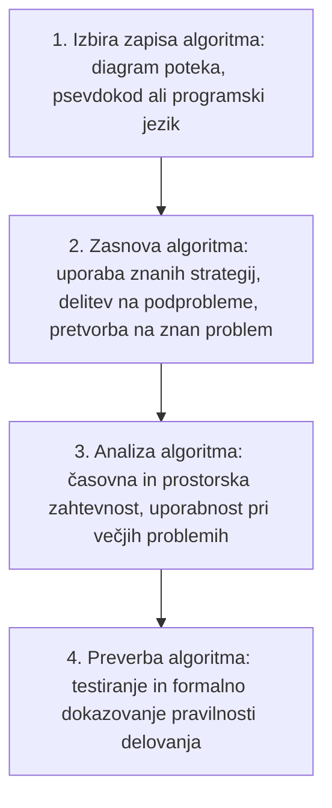

## Analiza algoritmov

Z **analizo algoritma** ugotavljamo, kako učinkovit je - koliko časa in koliko pomnilniškega prostora zahteva glede na velikost problema. **Velikost problema** označimo z \(n\) - na kaj točno se \(n\) nanaša, je odvisno od problema (npr. pri sortiranju seznama števil \(n\) predstavlja dolžino seznama; včasih je lahko velikost problema kar vhodni podatek sam).

- **Časovna zahtevnost** (*time complexity*) \(T(n)\) določa čas izvajanja algoritma kot število potrebnih osnovnih operacij v odvisnosti od velikosti problema \(n\). Vsaka **osnovna operacija** (aritmetična operacija, primerjava dveh vrednosti ipd.) se izvede v **konstantnem (fiksnem) času**.
- **Prostorska zahtevnost** (*space complexity*) \(S(n)\) določa potreben pomnilniški prostor kot število osnovnih enot hrambe (lahko so to bajti, lahko pa tudi podatkovne strukture, ki predstavljajo en element problema) v odvisnosti od velikosti problema \(n\).

V praksi nas pogosto zanima predvsem **velikostni razred** zahtevnosti (logaritemski, polinomski, eksponentni) - torej za kakšno vrsto funkcije gre, ne pa natančna formula.

### Najslabši, najboljši in povprečni primer

Zahtevnost algoritma je lahko odvisna ne samo od velikosti problema \(n\), ampak tudi od tega, **kakšni** so konkretni vhodni podatki.

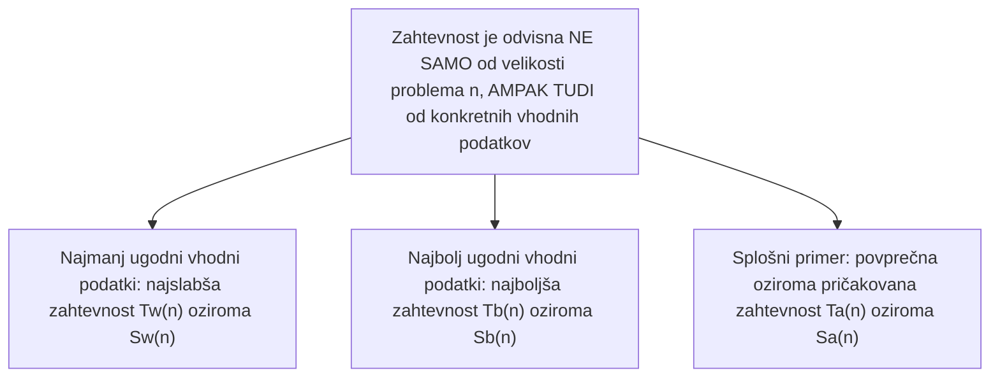

Pri najmanj ugodnih vhodnih podatkih dobimo **najslabšo zahtevnost** \(T_w(n)\) oz. \(S_w(n)\) (*worst*), pri najbolj ugodnih **najboljšo zahtevnost** \(T_b(n)\) oz. \(S_b(n)\) (*best*), v splošnem primeru pa zahtevnost izražamo s **povprečno oz. pričakovano zahtevnostjo** \(T_a(n)\) oz. \(S_a(n)\) (*average*). Velikostne razrede zahtevnosti izražamo s posebnimi funkcijami \(O\) (veliki omikron), \(\Omega\) (veliki omega) in \(\Theta\) (veliki theta). V nadaljevanju bomo zaradi preglednosti govorili predvsem o časovni zahtevnosti, a vse povedano velja enako tudi za prostorsko zahtevnost.

## Asimptotična notacija

### Veliki omikron O

\[
T(n) = O(g(n)) \iff \text{obstajata pozitivni konstanti } c \text{ in } n_0,\ \text{tako da velja } |T(n)| \le c\,|g(n)| \text{ za vse } n \ge n_0
\]

Funkcija \(g(n)\) predstavlja red zahtevnosti v najneugodnejšem primeru in je **asimptotična zgornja meja** funkcije \(T(n)\) - torej od velikosti problema \(n_0\) naprej je časovna zahtevnost vedno pod krivuljo \(c\cdot g(n)\). Pišemo \(T(n) = O(g(n))\), nikoli v obratni smeri (gre za **enosmerno enakost**). Vrednost \(c\) imenujemo **vodilna konstanta** (*leading constant*), funkcija \(g(n)\) pa je **vodilni člen** - tisti del funkcije \(T(n)\), ki najbolj narašča (npr. člen polinoma z najvišjo potenco).

### Primer: ocena časovne zahtevnosti

Dana je dejanska časovna zahtevnost algoritma:

\[
T(n) = \tfrac{1}{3}n^3 + \tfrac{1}{2}n^2 + \tfrac{1}{6}n
\]

Ker je vodilni člen (tisti, ki najhitreje narašča) člen s potenco \(n^3\), lahko vse ostale člene navzgor omejimo z njim:

\[
T(n) = \tfrac13 n^3 + \tfrac12 n^2 + \tfrac16 n \le \tfrac13 n^3 + \tfrac12 n^3 + \tfrac16 n^3 = \tfrac{6}{6}n^3 = n^3 \quad (\text{za } n \ge 1)
\]

torej lahko zapišemo \(T(n) = O(n^3)\) - časovna zahtevnost je reda \(n^3\), ker imamo polinom tretje stopnje.

Podobno velja \(\tfrac35 n^2 + \tfrac16 = O(n^2)\) in \(\tfrac35 n^2 = O(n^2)\) - velikostna razreda teh dveh funkcij (oz. časovnih zahtevnosti) sta enaka, \(O(n^2)\), saj ta fiksni pribitek \(\tfrac16\) ne naredi algoritma bistveno bolj zahtevnega. Zaradi enosmerne enakosti pa **ne smemo** zapisati \(\tfrac35 n^2 + \tfrac16 = \tfrac35 n^2\) - časovna zahtevnost (notacija O) velja lahko samo v eni smeri!

> [!NOTE]
> Notacija \(O\) izraža samo **velikostni razred**, ne natančne vrednosti - zato \(O(n^2)\) in \(O(3n^2)\) označujeta isti razred zahtevnosti (konstanta \(c\) ni pomembna), le da pri drugem upoštevamo prevladujoč, večji del vrednosti.

### Lastnosti funkcije O

- **refleksivnost**: \(g(n) = O(g(n))\)
- **odstranitev konstante**: če je \(c>0\), potem \(O(c\cdot g(n)) = O(g(n))\)
- **vsota**: \(O(f(n)) + O(g(n)) = O(\max(f(n), g(n)))\)
- **prevladujoča funkcija**: če za vsak \(n\) velja \(f(n) > g(n)\), potem \(O(f(n)) + O(g(n)) = O(f(n))\)
- **produkt**: \(O(f(n)) \cdot O(g(n)) = O(f(n)\cdot g(n))\) - skupna časovna zahtevnost je produkt dveh funkcij
- **tranzitivnost**: če je \(f(n) = O(g(n))\) in \(g(n) = O(h(n))\), potem \(f(n) = O(h(n))\) - to nam omogoča, da lahko vmesni člen preskočimo

Na primer, če imamo logaritemsko in kvadratno časovno zahtevnost, pri seštevanju dveh časovnih zahtevnosti vedno dobimo tisto, ki je **večja (slabša)** izmed danih dveh - npr. \(O(n^2) + O(\log_2 n) = O(n^2)\), saj je kvadratna zahtevnost prevladujoča.

### Pravila za določanje zgornje meje iz programske kode

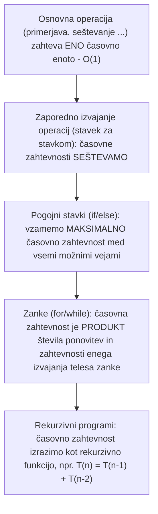

- Osnovne operacije (primerjava, seštevanje ipd.) zahtevajo eno časovno enoto - označimo jih z \(O(1)\), fiksno vrednostjo, neodvisno od \(n\).
- Pri **zaporednem** izvajanju operacij se časovna zahtevnost **sešteva** (če ena vrstica kode ima npr. linearno, naslednja pa kvadratno zahtevnost, se ti dve zahtevnosti seštejeta - rezultat je kvadratna zahtevnost, saj je prevladujoča).
- Pri **pogojnih stavkih** (`if`/`else` ipd.) vzamemo **maksimalno** časovno zahtevnost med vsemi možnimi vejami - v primeru, kjer `if`-veja zahteva \(O(n)\), `else`-veja pa \(O(n^2)\), bomo kot skupno zahtevnost vzeli \(O(n^2)\), saj je med njima slabša (večja):

```
if (pogoj) {
    // O(n)
} else {
    // O(n^2)
}
```

- **Časovna zahtevnost zanke** (npr. `for`, `while`) se določi kot **produkt** števila ponovitev zanke in časovne zahtevnosti enega izvajanja telesa zanke. Pri gnezdenih zankah, kjer se zunanja zanka ponovi \(O(n)\)-krat, znotraj nje pa še notranja zanka prav tako \(O(n)\)-krat, je skupna časovna zahtevnost produkt obeh, torej \(O(n)\cdot O(n) = O(n^2)\).
- **V rekurzivnih programih** se časovna zahtevnost izrazi kot **rekurzivna funkcija** - problem razdelimo na podprobleme, katera znamo rešiti, npr. \(T(n) = T(n-1) + T(n-2)\).
- Če je \(T(n) = a_0 + a_1 n + \dots + a_m n^m\) polinom stopnje \(m\), lahko zahtevnost ocenimo z zgornjo mejo \(T(n) = O(n^m)\).

## Velikostni razredi zahtevnosti

Razvrstitev velikostnih razredov zahtevnosti, od najugodnejše do najmanj ugodne: **konstantna** \(O(1)\), **logaritemska** \(O(\log_2 n)\), **linearna** \(O(n)\), **n log n** \(O(n\log_2 n)\), **kvadratna** \(O(n^2)\), **kubična** \(O(n^3)\) in (precej slabša od vseh prejšnjih) **eksponentna** \(O(2^n)\). \(O(1)\) pomeni, da je število izvršitev osnovnih operacij fiksno in neodvisno od velikosti vhodnih podatkov, torej je časovna zahtevnost konstantna - to je najbolj ugodna možna zahtevnost (npr. problem, ki bi ga znali rešiti v 10 ms ne glede na velikost problema).

Za velike \(n\) obstaja ogromna razlika med eksponentno zahtevnostjo \(O(a^n)\) (\(a>1\)) in katerokoli polinomsko zahtevnostjo \(O(n^m)\) - ne obstaja tak \(m\), da bi \(n^m\) omejeval \(2^n\). **Vsak polinomski algoritem bo v neki točki postal ugodnejši od eksponentnega!**

### Primerjalna tabela vrednosti

| \(n\) | \(\log_2 n\) | \(n\) | \(n\log_2 n\) | \(n^2\) | \(n^3\) | \(2^n\) |
|---|---|---|---|---|---|---|
| 0 | - | 1 | 0 | 1 | 1 | 2 |
| 1 | 0 | 2 | 2 | 4 | 8 | 4 |
| 2 | 1 | 4 | 8 | 16 | 64 | 16 |
| 3 | 1.58 | 8 | 24 | 64 | 512 | 256 |
| 4 | 2 | 16 | 64 | 256 | 4096 | 65536 |
| 5 | 2.32 | 32 | 160 | 1024 | 32768 | 4294967296 |

Pri linearni časovni zahtevnosti bo reševanje problema trajalo toliko, kolikor je velikost problema - velikost problema je hkrati enaka številu operacij, ki jih bomo porabili. \(n\log_2 n\) raste vidno hitreje kot linearna, a opazno počasneje od kvadratne zahtevnosti. Kubična zahtevnost že precej hitreje narašča - za problem velikosti 32 imamo že 1024 enot pri kvadratni, a kar 32768 pri kubični zahtevnosti (torej 5-krat toliko operacij). Eksponentna zahtevnost pa naraste **grozno visoko** že pri majhnih \(n\).

### Primerjava časov izvajanja

Primerjava časov izvajanja za problem velikosti \(n\) pri različnih časovnih zahtevnostih, če ena operacija traja \(1\ \mu s\) in je vodilna konstanta \(c=1\):

| \(n\) | \(n\) | \(n^2\) | \(n^3\) | \(n^5\) | \(n^{\log_2 n}\) | \(2^n\) | \(3^n\) |
|---|---|---|---|---|---|---|---|
| 10 | 0.01 ms | 0.1 ms | 1 ms | 0.1 s | 2 ms | 1 ms | 59 ms |
| 20 | 0.02 ms | 0.4 ms | 8 ms | 3.2 s | 420 ms | 1 s | 58 min |
| 30 | 0.03 ms | 0.9 ms | 27 ms | 24.3 s | 17.3 s | 17.9 min | 6.5 let |
| 40 | 0.04 ms | 1.6 ms | 64 ms | 1.7 min | 5.6 ms | 12.7 dni | \(3.9\times10^5\) let |
| 50 | 0.05 ms | 2.5 ms | 125 ms | 5.2 min | 1.1 h | 35.7 let | \(2.3\times10^{10}\) let |
| 60 | 0.06 ms | 3.6 ms | 216 ms | 13 min | 8.9 h | \(36.5\times10^3\) let | \(1.3\times10^{15}\) let |

Razlike med razredi postanejo pri večjih \(n\) drastične - pri eksponentni časovni zahtevnosti bi za problem velikosti samo 60 potrebovali tisočletja, medtem ko kubična zahtevnost pri enaki velikosti problema zahteva le 216 ms.

### Prirastek časovne zahtevnosti

Ocena prirastka časovne zahtevnosti, če se velikost problema poveča za 1:

| \(T(n)\) | \(T(n+1) - T(n)\) |
|---|---|
| \(\log_2 n\) | \(O(1/n)\) |
| \(n\) | \(O(1)\) |
| \(n\log_2 n\) | \(O(\log_2 n)\) |
| \(n^2\) | \(O(n)\) |
| \(n^3\) | \(O(n^2)\) |
| \(2^n\) | \(O(2^n)\) |

Pri algoritmu s polinomsko zahtevnostjo je prirastek za en red manjše zahtevnosti (npr. pri kvadratni je prirastek linearen), pri eksponentnem pa je prirastek **enake zahtevnosti kot sam algoritem** - s časom (z naraščanjem \(n\)) prirastek sploh ne pada, kar pomeni, da vsak dodaten element problema zahteva sorazmerno vedno več dodatnega dela.

### Primer: ocena rešljive velikosti problema v danem času

Koliko obsežen problem lahko rešimo v danem času, če ena operacija traja \(1\ \mu s\)? Primer: na voljo imamo 1 minuto.

\[
1\ \text{min} = 60\ \text{s} = 6\times10^7\ \mu s \implies 6\times10^7 \text{ operacij lahko izvedemo v tej minuti}
\]

- \(T(n) = n^2 \implies n^2 = 6\times10^7 \implies n = \sqrt{6\times10^7} \approx 7746\)
- \(T(n) = n^5 \implies n^5 = 6\times10^7 \implies n = \sqrt[5]{6\times10^7} \approx 35\)
- \(T(n) = n^{\log_2 n}\): tu za izračun \(n\) potrebujemo še logaritmiranje obeh strani:

\[
n^{\log_2 n} = 6\times10^7 \;\Rightarrow\; \log_2\!\left(n^{\log_2 n}\right) = \log_2(6\times10^7) \;\Rightarrow\; \log_2 n \cdot \log_2 n = \log_2^2 n = \log_2(6\times10^7)
\]

\[
\Rightarrow\; \log_2 n = \sqrt{\log_2(6\times10^7)} \;\Rightarrow\; n = 2^{\sqrt{\log_2(6\times10^7)}} \approx 33
\]

Isti postopek lahko uporabimo za poljuben razpoložljiv čas (1 s, 1 min, 1 uro, 100 ur) - s tem prikažemo, koliko večje probleme lahko posamezna časovna zahtevnost reši v določenem času. Razlika med razredi je spet drastična: pri eksponentni zahtevnosti lahko z izjemno podaljšanim časom (s 1 s na 100 ur) rešimo le malenkostno večji problem (z recimo 19 na 38 elementov), medtem ko se pri kvadratni zahtevnosti rešljiva velikost problema poveča s 1000 na skoraj 6 milijonov.

### Primer: pohitritev računalnika

Kako velik problem lahko rešimo v enakem času, če uporabimo **hitrejši računalnik** (tj. osnovna operacija zahteva manj časa)? Primer: na računalniku z izvajanjem osnovne operacije \(1\ \mu s\) smo v času \(T\) rešili problem velikosti \(n\) s časovno zahtevnostjo \(2^n\). Kakšne velikosti \(n^*\) problem lahko rešimo v istem času \(T\) na 1000-krat hitrejšem računalniku (torej z izvajanjem osnovne operacije \(1\ ns\))?

\[
T = 2^{n^*}\,\text{ns} = 2^n\,\mu s \;\Rightarrow\; 2^{n^*}\,\text{ns} = 10^3 \cdot 2^n\,\text{ns}
\]

\[
\Rightarrow\; n^* = \log_2(10^3 \cdot 2^n) = \log_2(10^3) + \log_2(2^n) = n + 9.97
\]

Na 1000-krat hitrejšem računalniku lahko torej pri eksponentni zahtevnosti rešimo problem, ki je le za približno 10 elementov večji (saj je \(2^{10}\approx 1000\)) - pridobitev je zelo majhna glede na 1000-kratno pohitritev strojne opreme!

| \(T(n)\) | \(1\ \mu s\) | \(1\ ns\) (1000x hitrejši) | \(1\ ps\) (1000000x hitrejši) |
|---|---|---|---|
| \(n\) | \(n_1\) | \(1000\,n_1\) | \(10^6\,n_1\) |
| \(n^2\) | \(n_2\) | \(31.6\,n_2\) | \(1000\,n_2\) |
| \(n^3\) | \(n_3\) | \(10\,n_3\) | \(100\,n_3\) |
| \(n^5\) | \(n_4\) | \(3.98\,n_4\) | \(15.85\,n_4\) |
| \(2^n\) | \(n_5\) | \(n_5+9.97\) | \(n_5+19.93\) |
| \(3^n\) | \(n_6\) | \(n_6+6.29\) | \(n_6+12.58\) |

Pri **polinomskih** problemih se velikost rešljivega problema s hitrejšim računalnikom poveča za nek **faktor** (npr. 1000-krat hitrejši računalnik pri kvadratni zahtevnosti reši približno 31.6-krat večji problem), pri **eksponentnih** problemih pa se poveča samo za **konstanto** (fiksno število dodatnih elementov) - to je bistvena razlika med obema vrstama problemov.

> [!WARNING]
> Konstanta, ki jo pri eksponentni zahtevnosti pridobimo z (tudi zelo veliko) hitrejšim računalnikom, je zelo majhna - to je ključni razlog, zakaj eksponentni algoritmi ostanejo nepraktični tudi z razvojem strojne opreme.

### Veliki omega Ω

\[
T(n) = \Omega(g(n)) \iff \text{obstajata pozitivni konstanti } c \text{ in } n_0,\ \text{tako da velja } |T(n)| \ge c\,|g(n)| \text{ za vse } n \ge n_0
\]

Gre za **ravno obratno** definicijo kot pri velikem omikronu O. Funkcija \(g(n)\) predstavlja red zahtevnosti v najugodnejšem primeru in je **asimptotična spodnja meja** funkcije \(T(n)\) - od velikosti problema \(n_0\) naprej bo \(T(n)\) vedno nad spodnjo mejo \(c\,g(n)\). Pišemo \(T(n) = \Omega(g(n))\), spet nikoli v obratni smeri. Funkcija \(\Omega\) služi za izražanje spodnje meje časovne zahtevnosti algoritma - uporablja se za najugodnejši primer.

### Veliki theta Θ

\[
\Theta(g(n)) \iff \text{obstajajo pozitivne konstante } c_1,\, c_2 \text{ in } n_0,\ \text{tako da velja } c_1|g(n)| \le |T(n)| \le c_2|g(n)| \text{ za vse } n \ge n_0
\]

Funkcija \(g(n)\) tu predstavlja red zahtevnosti tako v najbolj kot v najmanj ugodnem primeru in je **asimptotična tesna meja** funkcije \(T(n)\) (predstavlja hkrati zgornjo in spodnjo mejo časovne zahtevnosti). Funkcija \(\Theta\) služi za izražanje časovne zahtevnosti algoritma, kadar imata spodnja in zgornja meja **enak red** - če obstaja ista funkcija \(g(n)\) in za vse probleme večje od \(n_0\) velja, da je \(T(n)\) med obema faktorjema (\(c_1\) in \(c_2\)) funkcije \(g(n)\), tako časovno zahtevnost označimo z velikim theta. Velja: če je \(T(n)=\Theta(g(n))\), potem je \(T(n)=\Omega(g(n))=O(g(n))\).

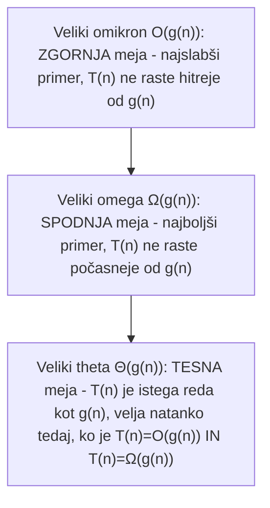

## Ocenjevanje časovne zahtevnosti iz meritev

Ocenjevanje časovne zahtevnosti **iz meritev** potrebujemo takrat, kadar je ne moremo analitično izpeljati, ali kadar želimo teoretično izpeljavo potrditi v praksi.

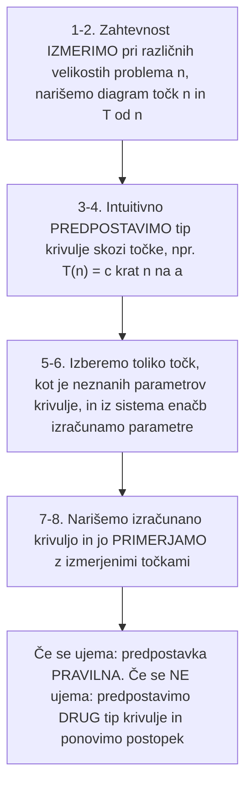

Koraki postopka: (1) časovno zahtevnost izmerimo pri različnih velikostih problema; (2) narišemo diagram z izmerjenimi vrednostmi (velikost problema \(n\) na abscisi, \(T(n)\) na ordinati); (3) intuitivno predpostavimo tip krivulje, npr. \(T(n) = c\,n^a\); (4) izberemo toliko točk, kot je neznanih parametrov krivulje (npr. za \(T(n)=c\,n^a\) potrebujemo dve točki za izračun \(c\) in \(a\)); (5) iz sistema enačb izračunamo neznane parametre; (6) narišemo krivuljo, ki jo določa izračunana funkcija; (7) če se izmerjena krivulja zadovoljivo ujema z izračunano, je naša predpostavka pravilna - v nasprotnem primeru predpostavimo drug tip krivulje (npr. namesto \(c\,n^a\) morda \(c\,n\log_2 n\)) in izračun ponovimo.

> [!NOTE]
> Dejanska časovna zahtevnost algoritma ni nujno oblike \(c\,n^a\) - lahko gre tudi za povsem drugačno obliko funkcije (npr. \(c\,n\log_2 n\)), zato je pomembno, da ob slabem ujemanju predpostavko spremenimo in postopek ponovimo, dokler izračunana krivulja zadovoljivo ne ustreza izmerjenim točkam.

## Razreda problemov P in NP

**Odločitveni problem** (*decision problem*) je problem, kjer za dani vhod iščemo odgovor "da" ali "ne" (npr. ali obstaja pot, ali je število praštevilo, ali obstaja ustrezna podmnožica). Razreda P in NP lahko uporabimo tudi za opis **optimizacijskih problemov**, če jih obravnavamo kot odločitvene probleme oblike "ali obstaja rešitev z vrednostjo največ/najmanj X?".

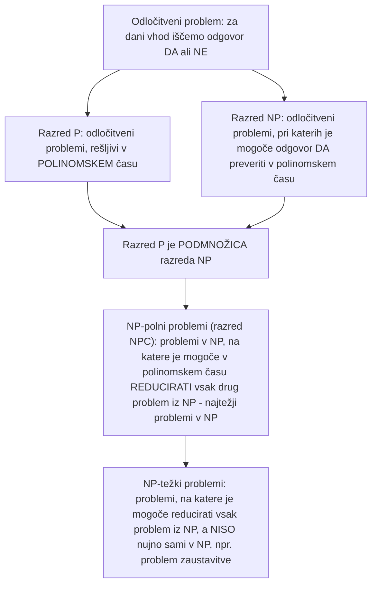

Odločitveni problemi, ki so rešljivi v polinomskem času \(O(n^k)\), spadajo v **razred P** (*polynomial*). Odločitveni problemi, ki morda niso rešljivi v polinomskem času, je pa mogoče potrditev oz. dokaz za odgovor "da" preveriti v polinomskem času, tvorijo **razred NP** (*non-deterministic polynomial*).

Proceduro, ki nek odločitveni problem A prevede na drug odločitveni problem B, tako da je odgovor na B enak "da" natanko tedaj (pri istih vhodih), kot je odgovor na A enak "da", imenujemo **redukcijski algoritem** (procedura, ki en odločitveni problem pretvori v drugega).

Problem je **NP-poln** (*NP-complete*) oz. spada v **razred NPC**, če spada v razred NP in je nanj možno v polinomskem času reducirati vsak drug NP problem - gre torej za **najtežje** probleme v razredu NP. Primera NP-polnih problemov sta vsota podmnožice in problem trgovskega potnika (TSP). Primer problema, ki je v NP, ni pa NP-poln, je faktorizacija števila.

Problem je **NP-težek** (*NP-hard*), če ni nujno v razredu NP, je pa nanj možno v polinomskem času reducirati vsak drug NP problem. Primer NP-težkega problema, ki ni NP-poln, je **problem zaustavitve** (*halting problem*) - za dani vhodni program in njegov vhod je treba določiti, ali se bo program zaključil.

> [!NOTE]
> Ali velja \(P = NP\)? To je eno najbolj znanih odprtih vprašanj v računalništvu - še ni znano, ali je vsak problem, katerega rešitev je mogoče v polinomskem času preveriti (NP), mogoče v polinomskem času tudi rešiti (P).

## Sklep

Izmed dveh algoritmov za reševanje istega problema bo tisti z nižjim redom časovne zahtevnosti učinkovitejši, ko problem doseže določeno velikost - pri analizi algoritmov namreč določamo njihovo **asimptotično** učinkovitost, torej v limiti velikosti problema. Za dovolj majhne velikosti problema je lahko algoritem s slabšo (asimptotično) časovno zahtevnostjo vseeno hitrejši - zato se v praksi pogosto uporablja **kombinirana rešitev**, ki za dovolj majhne probleme preklopi na drug algoritem (npr. pri dovolj majhnih problemih je lahko *bubble sort* hitrejši kot *quick sort*). Za učinkovito implementacijo algoritmov je poleg asimptotične zahtevnosti potrebno upoštevati tudi lastnosti strojne opreme (predpomnilnik, napovedovanje vejitev).

## Osnovne podatkovne strukture

**Podatkovna struktura** (*data structure*) je način hranjenja in organizacije množice podatkov v računalniku z namenom olajšanja dostopa do podatkov in njihovega spreminjanja. Učinkovitost operacij nad podatkovno strukturo je odvisna od njenega tipa (zaporedna, hierarhična ...). Posamezen element podatkovne strukture lahko vsebuje **ključ** (*key*), ki hrani podatkovno vrednost elementa, in **spremljajoče (satelitske) podatke** (*satellite data*), kot so kazalci na druge elemente.

### Operacije na podatkovnih strukturah

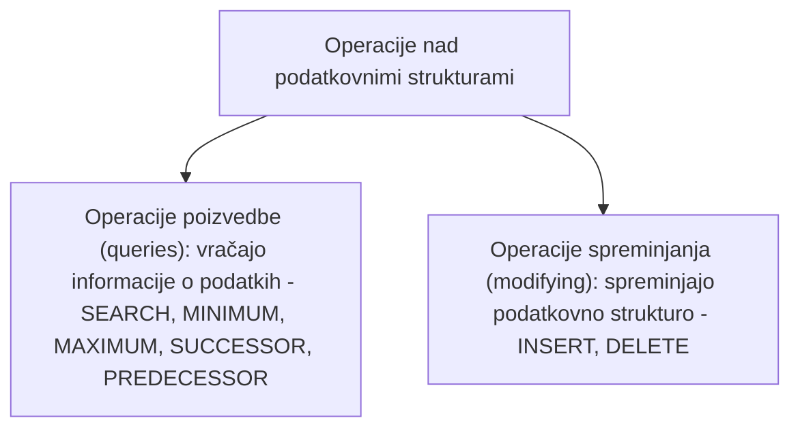

Operacije delimo na **operacije poizvedbe** (*queries*), ki vračajo informacije o podatkovni strukturi (ne spreminjajo je), in **operacije spreminjanja** (*modifying operations*), ki spreminjajo samo podatkovno strukturo (oz. podatke v njej). Tipične operacije so:

- `SEARCH(S,k)` - vrne kazalec na element \(x\) s ključem \(k\) v strukturi \(S\) (torej \(key[x]=k\)) ali `NIL`, če takega elementa v \(S\) ni
- `INSERT(S,x)` - vstavi element \(x\) (ki vsebuje že neko vrednost ključa) v strukturo \(S\)
- `DELETE(S,x)` - odstrani element \(x\) iz strukture \(S\)
- `MINIMUM(S)` oz. `MAXIMUM(S)` - vrne kazalec na element z najmanjšim oz. največjim ključem v strukturi \(S\)
- `SUCCESSOR(S,x)` oz. `PREDECESSOR(S,x)` - vrneta kazalec na element z naslednjim večjim oz. prejšnjim manjšim ključem glede na element \(x\) v strukturi \(S\), ali `NIL`, če tak element ne obstaja

Na primer, če imamo podatkovno strukturo \(S\) s podatki `7 5 3 2 4` in iščemo predhodnika elementa s ključem 4, bomo kot rezultat `PREDECESSOR` dobili kazalec na element, ki je prvi manjši (torej 3); pri `SUCCESSOR` istega elementa pa kazalec na prvi večji element (torej 5). Če predhodnik ali naslednik nekega elementa ne obstaja, funkciji vrneta `NIL` (npr. naslednik elementa 7 v zgornjem primeru bi bil `NIL`, saj je 7 največji element).

## Polje (Array)

**Polje** (*array*) je najosnovnejša podatkovna struktura. Enodimenzionalno polje je zaporedje \(n\) ključev (podatkov) istega podatkovnega tipa, ki so shranjeni zvezno (zaporedno) v pomnilniku in neposredno dosegljivi preko svojega indeksa. V tej obravnavi bomo uporabljali indekse od 1 naprej, čeprav večina programskih jezikov uporablja ničelno indeksiranje (*zero-based indexing*, indeksi od 0 naprej).

Vsak element polja je dosegljiv v **konstantnem času** \(O(1)\) - dostopanje do elementov je mogoče preko indeksov (direktno naslavljanje), s čimer takoj pridemo do naslova, kjer se nahaja željeni ključ (podatek). Polje lahko uporabimo tudi za implementacijo drugih podatkovnih struktur in nizov (pri nizih so elementi polja znaki).

## Sklad (Stack)

**Sklad** (*stack*) je podatkovna struktura, ki uporablja strategijo **LIFO** (*last-in, first-out*) - neposreden dostop imamo samo do zadnjega dodanega elementa. Za dodajanje elementa na sklad uporabljamo operacijo **potisni** (*push*), za odstranjevanje zadnjega dodanega elementa pa operacijo **dvigni** (*pop*). Sklad se uporablja pri strojni izvedbi prekinitev, podprogramov, rekurzije in začasni hrambi podatkov (npr. undo/redo).

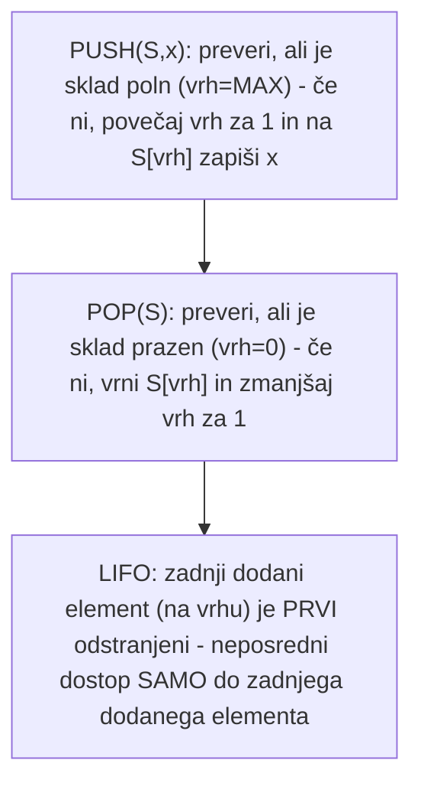

Za implementacijo sklada bomo uporabili polje \(S\) (ki bo statično) - velikost polja določa maksimalno število elementov `MAX`, ki jih lahko shranimo na sklad. Poleg samega polja sklad potrebuje še režijski podatek **vrh**, ki beleži indeks zadnjega (nazadnje dodanega) elementa na skladu - `S[1]` je element na dnu, `S[vrh]` pa element na vrhu. Sklad je prazen, če je `vrh = 0` (to je običajno začetno stanje sklada).

```
STACK-EMPTY(S)
    if vrh = 0 then
        return TRUE
    else
        return FALSE
```

Vrh povečujemo z operacijo `PUSH` in zmanjšujemo z operacijo `POP`. Preden vrh povečamo, moramo preveriti, da sklad še ni poln (da `vrh` še ni dosegel `MAX`):

```
PUSH(S, x)
    if vrh = MAX then
        return prekoračitev
    else
        vrh ← vrh + 1
        S[vrh] ← x
```

```
POP(S)
    if STACK-EMPTY(S) then
        return napaka
    else
        vrh ← vrh - 1
        return S[vrh+1]
```

Vsaka od operacij ima časovno zahtevnost \(O(1)\). Zgled: sklad trenutno vsebuje tri elemente, 12, 7 in 2 (`vrh=3`). Po izvedbi `PUSH(S,9)` in `PUSH(S,6)` je `vrh=5` (polje vsebuje `12 7 2 9 6`).

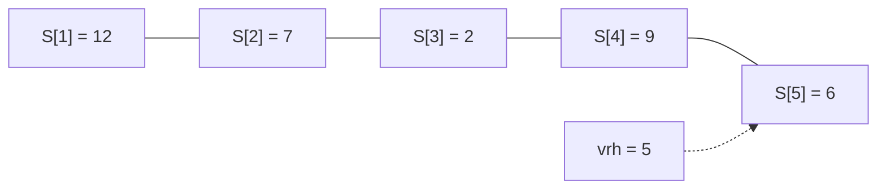
 Izvedba `POP(S)` vrne element 6, ki ostane zapisan v polju (ne brišemo ga eksplicitno), a bo prepisan ob naslednjem dodajanju - `POP` namreč samo spremeni mesto, kamor kaže `vrh`, oz. spremeni, do kod je sklad veljaven.

> [!NOTE]
> Ko se sklad popolnoma izprazni, mora `POP(S)` vrniti napako oz. vrednost `NIL` - ne obstaja element, ki bi ga lahko odstranili.

## Vrsta (Queue)

**Vrsta** (*queue*) je podatkovna struktura, ki uporablja strategijo **FIFO** (*first-in, first-out*, oz. "prvi prideš, prvi melješ") - neposreden dostop imamo samo do elementa, ki je najdlje v vrsti (realen zgled je vrsta pri blagajni). Za dodajanje elementa v vrsto uporabljamo operacijo **vstavi** (*enqueue*), za odstranjevanje pa operacijo **odstrani** (*dequeue*). Vrsta se uporablja npr. kot medpomnilnik za podatkovne tokove.

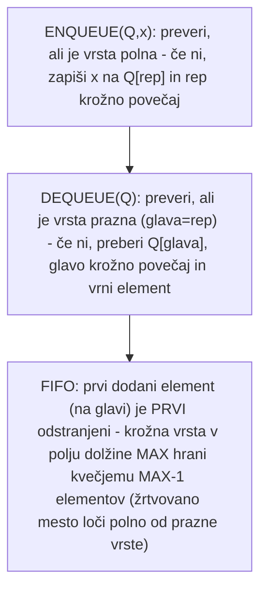

Za implementacijo vrste bomo prav tako uporabili polje (podobno kot pri skladu, le da ga bomo označili z \(Q\)) - bistvena razlika od sklada je, da lahko v polje velikosti `MAX` shranimo kvečjemu `MAX-1` elementov vrste. To eno žrtvovano mesto uporabimo, da lahko ločimo, kdaj je vrsta polna in kdaj prazna. **Glava** (kazalec na indeks prvega elementa v vrsti - tistega, ki ga bomo naslednjega vzeli iz vrste) je indeks prvega elementa vrste, **rep** (kazalec na mesto, ki je za eno mesto dalje od zadnjega elementa v vrsti) pa indeks prvega prostega mesta v vrsti, kamor bomo vstavili naslednji element.

**Krožna vrsta** (*circular queue*) omogoča ponovno uporabo sproščenih lokacij v linearnem polju - ko se zapolni lokacija `Q[MAX]`, bomo naslednji element zapisali na lokacijo `Q[1]` (če se je ta medtem že sprostila). Vrsta je prazna, če je `glava = rep` (začetno stanje je `glava = rep = 1`).

```
QUEUE-EMPTY(S)
    if glava = rep then
        return TRUE
    else
        return FALSE
```

Pri vstavljanju zapisujemo na lokacijo `Q[rep]` in `rep` krožno povečamo (če je `rep` enak `MAX`, ga pomaknemo nazaj na 1):

```
ENQUEUE(Q, x)
    if (glava = rep + 1) or ((glava = 1) and (rep = MAX)) then
        return prekoračitev    % vrsta je polna
    else
        Q[rep] ← x              % vstavi element
        if rep = MAX then
            rep ← 1             % krožno povečaj rep
        else
            rep ← rep + 1
```

Pri odstranjevanju beremo iz `Q[glava]` in `glavo` krožno povečamo:

```
DEQUEUE(Q)
    if glava = rep then
        return napaka    % vrsta je prazna
    else
        x ← Q[glava]             % preberi element, ki je v glavi
        if glava = MAX then
            glava ← 1             % krožno povečaj glavo
        else
            glava ← glava + 1
        return x
```

Vsaka od operacij ima časovno zahtevnost \(O(1)\). Zgled: v vrsti je trenutno pet elementov (3, 1, 12, 9 in 7), `glava=5` in `rep=10`. Po izvedbi `ENQUEUE(Q,4)` in `ENQUEUE(Q,8)` se `rep` krožno poveča na 2 (nova elementa se zapišeta na prej sproščeni lokaciji 10 in 1). Po izvedbi `DEQUEUE(Q)` se `glava` poveča na 6 (element na dotedanji glavi je bil odstranjen).

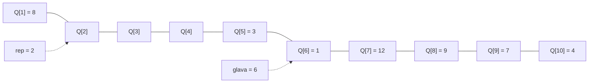


## Povezani seznam (Linked list)

**Povezani seznam** (*linked list*) je dinamična linearna podatkovna struktura (prostor ni vnaprej rezerviran, ampak ga dodajamo po potrebi, glede na podatke, ki jih v seznam vnašamo), v kateri so elementi zaporedoma povezani s kazalci. Povezani seznam je podatkovna struktura, kjer operiramo s kazalci - za razliko od polja, sklada in vrste, ki so **statične** (vnaprej smo rezervirali polnilniški prostor, zato smo lahko vstavili le toliko elementov, kolikor smo predvideli z `MAX`).

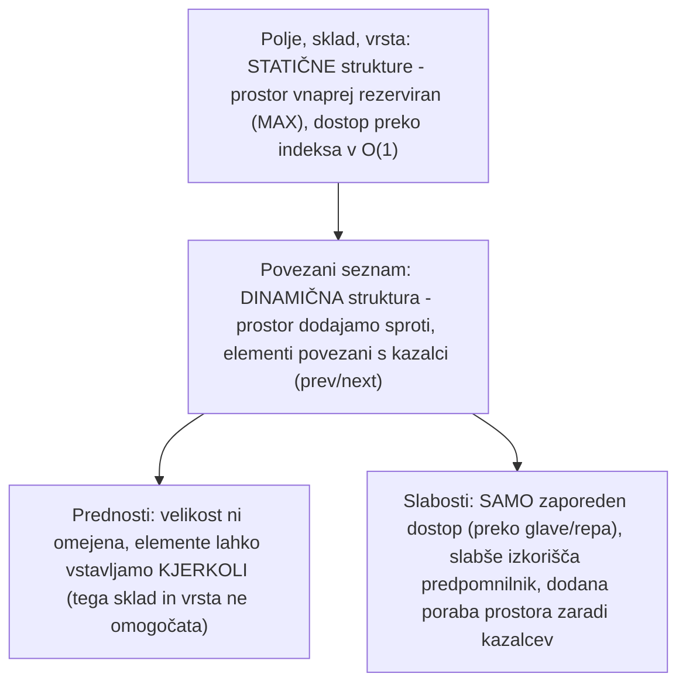

Vsak element seznama vsebuje ključ (podatkovno polje) ter kazalca `prev` na predhodni in `next` na naslednji element seznama; če element nima naslednika (predhodnika), je ustrezen kazalec enak `NIL`. **Glava** je kazalec na prvi, **rep** pa na zadnji element seznama; seznam je prazen, če je `glava = NIL`. Oblike povezanega seznama:

- **enojno povezan seznam** - vsak element ima samo kazalec `next`
- **dvojno povezan seznam** - vsak element ima kazalca `next` in `prev`
- **krožno povezan seznam** - zadnji in prvi element sta povezana

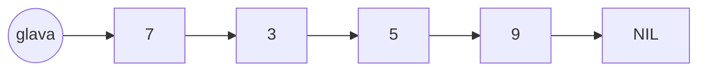


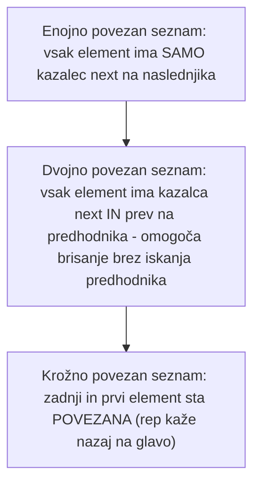

**Prednosti** povezanega seznama: velikost povezanega seznama ni omejena (razen z velikostjo prostega pomnilnika), elemente pa lahko vstavljamo kjerkoli (tega vrsta in sklad ne omogočata - njuna glavna slabost).

**Slabosti** povezanega seznama: dostop do elementov je zaporeden (nima naključnega dostopa - do elementov dostopamo samo preko glave ali repa); slabše izkorišča predpomnilnik (če elemente dodajamo in brišemo, si elementi v pomnilniku ne bodo sledili zaporedno, ampak bodo na naključnih mestih pomnilnika); dodana poraba prostora zaradi kazalcev.

### Enojno povezani seznam

**Iskanje.** Procedura `LIST-SEARCH(L,k)` poišče prvi element s ključem \(k\) v seznamu \(L\); če elementa ni v seznamu, vrne `NIL`:

```
LIST-SEARCH(L, k)
    x ← glava
    while x ≠ NIL and key[x] ≠ k do
        x ← next[x]
    return x
```

Časovna zahtevnost iskanja je \(O(n)\) - v najslabšem primeru moramo preiskati celoten seznam.

**Vstavljanje.** Procedura `LIST-INSERT(L,x)` vstavi element \(x\) v glavo seznama \(L\):

```
LIST-INSERT(L, x)
    next[x] ← glava
    if rep = NIL then
        rep ← x
    glava ← x
```

Procedura `LIST-INSERT-AFTER(L,y,x)` vstavi element \(x\) za elementom \(y\) v seznamu \(L\):

```
LIST-INSERT-AFTER(L, y, x)
    next[x] ← next[y]
    next[y] ← x
    if rep = y then
        rep ← x
```

Časovna zahtevnost samega vstavljanja je \(O(1)\), vendar moramo pri vstavljanju za nek element (npr. pri `LIST-INSERT-AFTER`) tega najprej poiskati, kar zahteva \(O(n)\).

**Brisanje.** Pri brisanju elementa iz enojno povezanega seznama potrebujemo kazalec na njegovega predhodnika, če ta obstaja. Procedura `LIST-DELETE(L)` briše prvi element seznama \(L\):

```
LIST-DELETE(L)
    x ← glava
    glava ← next[glava]
    if rep = x then
        rep ← NIL
    uniči x
```

Procedura `LIST-DELETE-AFTER(L,x)` izbriše element za elementom \(x\) v seznamu \(L\):

```
LIST-DELETE-AFTER(L, x)
    y ← next[x]
    next[x] ← next[y]
    if rep = y then
        rep ← x
    uniči y
```

Časovna zahtevnost brisanja je \(O(1)\), vendar moramo pri brisanju naslednika nekega elementa tega najprej poiskati, kar zahteva \(O(n)\).

### Dvojno povezani seznam

Procedura za iskanje je identična tisti za enojno povezani seznam. Pri **vstavljanju** procedura `LIST-INSERT(L,x)` vstavi element \(x\) v glavo seznama \(L\) - ker ima vsak element zdaj tudi kazalec `prev`, moramo ob vstavljanju na novo glavo pravilno povezati tudi predhodnika dosedanje glave:

```
LIST-INSERT(L, x)
    next[x] ← glava
    if glava ≠ NIL then
        prev[glava] ← x
    glava ← x
    prev[x] ← NIL
    if rep = NIL then
        rep ← x
```

Procedura `LIST-INSERT-AFTER(L,y,x)` vstavi element \(x\) za elementom \(y\) v seznamu \(L\) - časovna zahtevnost vstavljanja je \(O(1)\), vendar moramo pri vstavljanju za nek element tega najprej poiskati, kar zahteva \(O(n)\).

Pri **brisanju** procedura `LIST-DELETE(L,x)` briše element \(x\) iz seznama \(L\) - ker ima vsak element kazalec tako na predhodnika kot naslednika, pri dvojno povezanem seznamu ne potrebujemo ločene procedure `LIST-DELETE-AFTER`, saj lahko element \(x\) izbrišemo neposredno. Časovna zahtevnost brisanja je \(O(1)\), vendar moramo kazalec na element, ki ga želimo izbrisati, najprej poiskati, kar zahteva \(O(n)\).

> [!NOTE]
> Posebnost pri dvojno povezanem seznamu je, da pri brisanju (za razliko od enojno povezanega seznama) ne potrebujemo kazalca na predhodnika - ta je namreč že neposredno dostopen preko kazalca `prev` elementa, ki ga brišemo.

## Drevo (Tree)

**Drevo** (*tree*) je hierarhična podatkovna struktura (pri hierarhičnih podatkovnih strukturah govorimo o prednikih in naslednikih), pri kateri ima vsako vozlišče lahko več naslednikov, a le enega predhodnika. V primerjavi s seznamom omogoča učinkovitejše shranjevanje urejenih podatkov - prednost, ki jo ima drevo pred seznamom, je, da v drevesu lahko pridemo do želenega elementa v manj korakih kot v seznamu. V teoriji grafov je drevo povezan graf brez ciklov (do vsakega vozlišča se da priti samo po eni poti, ne po večih).

Formalno je **drevo** \(T\) končna neprazna množica vozlišč, za katero velja: eno od vozlišč je posebej odlikovano, tj. **koren** (*root*), druga vozlišča pa razpadejo v disjunktno unijo \(n\) dreves \(T_1, T_2, \dots, T_n\), kjer je \(n>0\). Grafično drevo ponazorimo tako, da ga rišemo od korena navzdol - poddrevesa \(T_1, T_2, \dots\) korena so **neposredni nasledniki** (sinovi) tega vozlišča.

### Osnovni pojmi

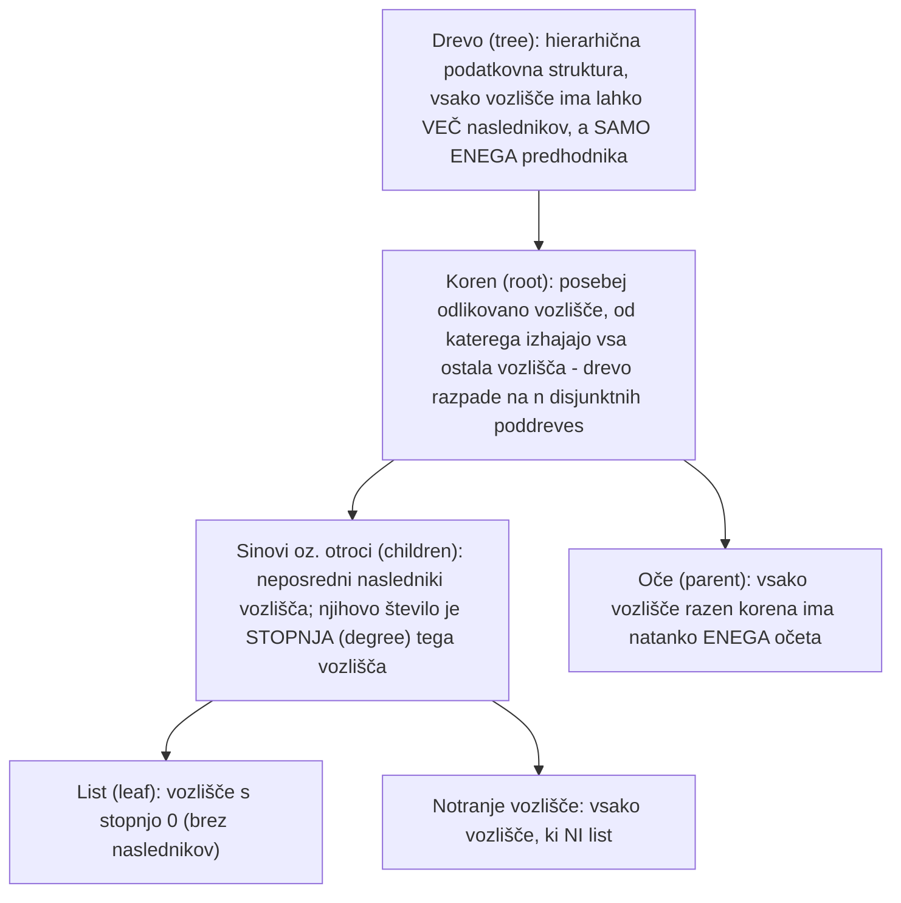

Vozlišče (element) \(v \in T\) ima poljubno število **sinov** oz. otrok (*children*); temu številu rečemo **stopnja** (*degree*) vozlišča \(v\) in ustreza številu poddreves v vozlišču \(v\). Vozlišče s stopnjo 0 (torej brez naslednikov) je **list** (*leaf*); vozlišča, ki niso listi, so **notranja vozlišča**. Vsako vozlišče razen korena ima natanko enega **očeta** oz. starša (*parent*).

Zgled: drevo potomcev osebe Janez, kjer ima Janez tri otroke (Miho, Luko in Majo), Miha ima dva otroka (Petra in Andreja), Luka pa tri otroke (Aleša, Anjo in Roka). V tem drevesu je 6 listov (Peter, Andrej, Aleš, Anja, Rok, Maja) in 3 notranja vozlišča (Janez, Miha, Luka).

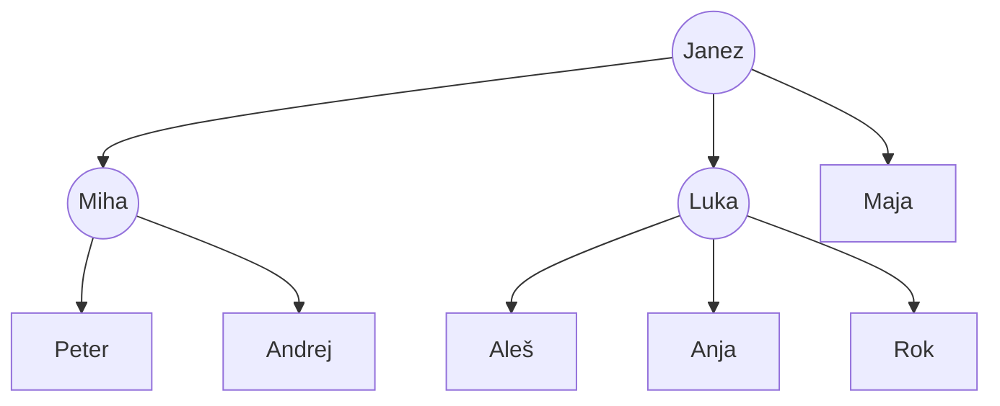


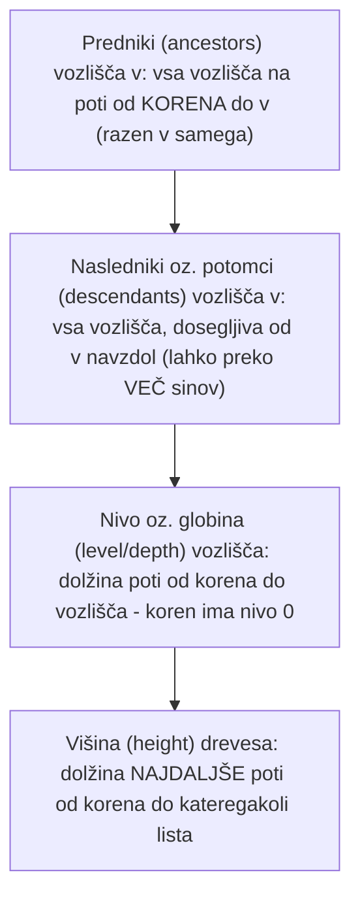

Vsem vozliščem, do katerih pridemo v drevesu z zaporedjem preslikav \(v \to oce[v]\) (vozlišče preslikamo v očeta od vozlišča), pravimo **predniki** (*ancestors*) od \(v\) - npr. v zgornjem zgledu ima vozlišče Rok dva prednika (Luka in Janez). Vsa vozlišča, ki jih dobimo v drevesu z zaporedjem preslikav \(v \to otrok[v]\), so **nasledniki** ali **potomci** (*descendants*) od \(v\) - npr. Janez ima osem naslednikov (3 posredne in 5 neposrednih); Janez je oče Mihe, Luke in Maje, dedek pa Petru, Andreju, Alešu, Anji in Roku.

**Nivo** (*level*) ali **globina** (*depth*) vozlišča je dolžina poti od korena do vozlišča - koren ima nivo 0, njegovi sinovi so na nivoju 1, itd. **Višina** (*height*) drevesa je dolžina najdaljše poti od korena do katerega od listov.

### Posebne oblike drevesa

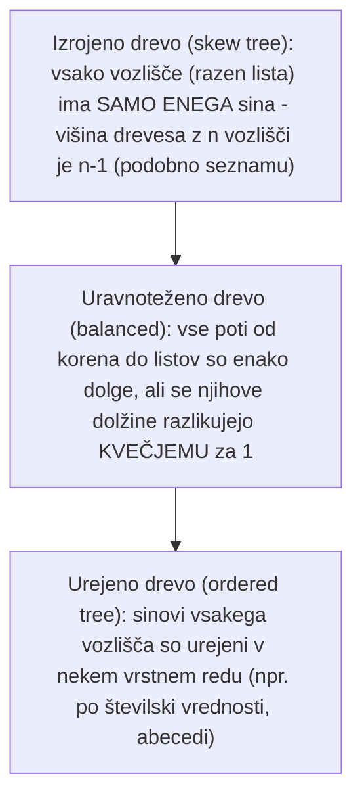

V **izrojenem drevesu** (*skew tree*) ima vsako vozlišče (z izjemo lista) enega samega sina - izrojeno drevo z \(n\) vozlišči ima višino \(n-1\) (gre torej za neke vrste seznam).

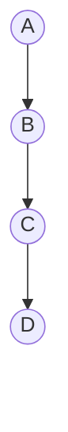
 Drevo je **uravnoteženo** (*balanced*), če so vse poti od korena do listov enako dolge, oziroma se njihove dolžine razlikujejo največ za 1 (npr. pot od vozlišča J do korena A in pot od vozlišča F do A se razlikujeta samo za 1 - dolžina poti do J je 3, do F pa 2).

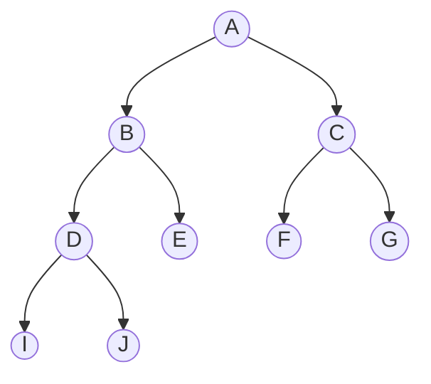
 V **urejenem drevesu** (*ordered tree*) so sinovi vsakega vozlišča urejeni v nekem vrstnem redu (npr. po številski vrednosti, abecedi ...).

## Dvojiško drevo (Binary tree)

**Dvojiško drevo** (*binary tree*) je drevo, v katerem imajo vozlišča stopnjo največ 2 (vsako vozlišče ima lahko največ dva naslednika, v primeru, da ima enega ali dva, gre za notranje vozlišče). Dvojiško drevo, ki ne vsebuje vozlišč, je **prazno drevo** (*empty tree*, *null tree*) - označimo ga z `NIL`. Prazno drevo je podatkovna struktura, ki ne vsebuje še nobenih podatkov (je prazna); z `NIL` bomo označevali tudi prazna poddrevesa v listih.

```mermaid
flowchart TB
    drvD_definicija["Dvojiško drevo (binary tree): drevo, v katerem ima vsako vozlišče STOPNJO KVEČJEMU 2 (največ dva naslednika)"] --> drvD_prazno["Prazno drevo (NIL): dvojiško drevo brez vozlišč - z NIL označujemo tudi prazna poddrevesa v listih"]
    drvD_definicija --> drvD_poddrevesa["Vsako vozlišče ima levo in desno poddrevo (lahko tudi prazni) - koren levega poddrevesa je LEVI SIN, koren desnega DESNI SIN"]
    drvD_poddrevesa --> drvD_polno["Polno (complete) dvojiško drevo: VSI listi so na isti globini"]
    drvD_poddrevesa --> drvD_poravnano["Poravnano (aligned) dvojiško drevo: nova vozlišča dodajamo po vrstnem redu od leve proti desni, nivo za nivojem"]
```

Vsako vozlišče ima (v dvojiškem drevesu, zaradi dveh naslednikov) **levo poddrevo** in **desno poddrevo**, ki sta lahko tudi prazni (če nimata nobenega naslednika). Če levo poddrevo ni prazno, je njegov koren **levi sin**; če desno poddrevo ni prazno, je njegov koren **desni sin**. **Polno** (*complete*) dvojiško drevo ima samo liste z isto globino - če bi en del takega drevesa "odčrtali", ne bi več imeli polnega dvojiškega drevesa.

Posebna oblika uravnoteženega dvojiškega drevesa je **levo (ali desno) poravnano** (*aligned*) dvojiško drevo. Desno poravnana dvojiška drevesa so manj pogosta. Levo poravnano dvojiško drevo ohranjamo tako, da dodajamo nova vozlišča po vrstnem redu od leve proti desni; ko napolnimo eno vrsto (globino), gremo ponovno na levo stran in začnemo na novo polniti naslednjo globino drevesa, spet od leve proti desni.

```mermaid
flowchart TB
    al1((1)) --> al2((2))
    al1 --> al3((3))
    al2 --> al4((4))
    al2 --> al5((5))
    al3 --> al6((6))
```


### Lastnosti dvojiškega drevesa

- Število vozlišč na nivoju \(i\) v **polnem** dvojiškem drevesu je natanko \(2^i\) (npr. na nivoju 0 je \(2^0=1\) vozlišče - koren; na nivoju 1 sta \(2^1=2\) vozlišči; na nivoju 2 so \(2^2=4\) vozlišča) - število vozlišč po nivojih torej eksponentno narašča.
- Število vozlišč na nivoju \(i\) v **splošnem** dvojiškem drevesu je **največ** \(2^i\) - če nekatera vozlišča nimajo obeh naslednikov, je lahko število vozlišč na nivoju \(i\) tudi manjše.
- Število notranjih vozlišč v polnem dvojiškem drevesu z višino \(h\) je \(2^h - 1\) (npr. za \(h=3\): \(2^3-1=7\)); v splošnem dvojiškem drevesu z višino \(h\) je notranjih vozlišč **največ** \(2^h-1\).
- Polno dvojiško drevo višine \(h\) ima \(n = 2^{h+1}-1\) vozlišč; za dani \(n\) je torej višina drevesa \(h = \log_2(n+1)-1\) (npr. za \(n=15\): \(h=\log_2(16)-1=4-1=3\)).
- Poravnano (levo ali desno) dvojiško drevo ima višino \(h = \lfloor \log_2(n+1)\rfloor - 1\) (izračun na koncu zaokrožimo navzgor, da dobimo celoštevilsko vrednost).

## Dvojiško iskalno drevo (Binary Search Tree)

Vozlišča drevesa naj bodo objekti z naslednjimi elementi: **ključ** (*key*) je podatkovno polje vozlišča (dejanska vrednost, ki jo hranimo v vozlišču); **leviSin** in **desniSin** sta kazalca na levega in desnega sina (lahko sta `NIL`, v primeru, da naslednika ni); **oče** je kazalec na očeta. Do korena drevesa \(T\) dostopamo s `koren[T]` (globalna spremenljivka, s katero bomo dostopali do drevesa \(T\), `koren[T]` bo kazalec na koren drevesa).

**Dvojiško iskalno drevo** (*binary search tree*, BST) je dvojiško drevo, v katerem so ključi shranjeni tako, da za vsako vozlišče \(x\) drevesa velja: če je vozlišče \(y\) v levem poddrevesu od \(x\), potem je \(key[y] \le key[x]\) (vrednost v \(y\) je manjša oz. kvečjemu enaka vrednosti v vozlišču/korenu \(x\)); če je vozlišče \(y\) v desnem poddrevesu od \(x\), potem je \(key[y] \ge key[x]\) (obratno kot prej).

```mermaid
flowchart TB
    drvE_vozlisce["Vsako vozlišče ima: ključ (key), kazalca leviSin in desniSin (NIL, če naslednika ni), ter kazalec oče"] --> drvE_lastnost["Lastnost BST: za vsako vozlišče x - vsa vozlišča v LEVEM poddrevesu imajo ključ MANJŠI ALI ENAK key[x]"]
    drvE_lastnost --> drvE_desno["Vsa vozlišča v DESNEM poddrevesu imajo ključ VEČJI ALI ENAK key[x] - lastnost velja za VSAKO vozlišče, ne samo za koren"]
    drvE_desno --> drvE_inorder["INORDER-TREE-WALK(x): rekurzivno izpiše levo poddrevo, nato key[x], nato desno poddrevo - izpiše ključe v NARAŠČAJOČEM vrstnem redu, O(n)"]
```

> [!NOTE]
> Lastnost BST ne velja samo okrog korena nekega drevesa, ampak za **vsako** vozlišče (in njegovo poddrevo) tega drevesa.

Če imamo podatke shranjene v dvojiškem iskalnem drevesu, jih lahko zelo enostavno izpišemo kot urejeno zaporedje: **urejen sprehod po drevesu** (*inorder tree walk*) omogoča izpis vseh ključev v urejenem zaporedju. Elegantna rekurzivna implementacija je `INORDER-TREE-WALK(x)`, ki jo kličemo z začetnim argumentom \(x = koren\):

```
INORDER-TREE-WALK(x)
1  if x ≠ NIL
2      then INORDER-TREE-WALK(leviSin[x])
3           print kljuc[x]
4           INORDER-TREE-WALK(desniSin[x])
```

Najprej izpišemo vsa manjša vozlišča (ki se nahajajo v levem poddrevesu), nato vrednost samega vozlišča \(x\), nato pa še vozlišča desnega poddrevesa - na koncu bomo dobili vsa vozlišča izpisana po naraščajočem vrstnem redu. Če bi želeli izpisana vozlišča po padajočem vrstnem redu, bi morali v `if` stavku zamenjati klic levega in desnega poddrevesa (najprej bi izpisali vozlišča desnega poddrevesa, nato pa še vozlišča levega poddrevesa).

Časovna zahtevnost procedure je \(O(n)\) - zahtevnost je linearna s številom elementov, saj `INORDER-TREE-WALK` obišče vsako vozlišče natanko enkrat (\(n\) je število elementov). Pri dvojiškem iskalnem drevesu isto množico ključev lahko predstavimo z različnimi dvojiškimi drevesi - drevo z manjšo višino je bolj učinkovito za nekatere operacije (čim večja je višina drevesa, slabše je zanje, saj si želimo, da je pot do nekega elementa čim krajša).

### Iskanje (TREE-SEARCH)

Procedura `TREE-SEARCH(x,k)` izvaja iskanje ključa \(k\) v dvojiškem iskalnem drevesu \(T\); z iskanjem začnemo v korenu, t.j. s klicem `TREE-SEARCH(koren[T], k)`. Pri klicu `TREE-SEARCH(x,k)` nas zanima, ali v poddrevesu, katerega koren je \(x\), obstaja ključ z vrednostjo \(k\). Na vsakem koraku primerjamo ključ trenutnega vozlišča \(x\) s \(k\): če je \(k = key[x]\), smo ključ našli in vrnemo kazalec na trenutno vozlišče; sicer, če je \(k < key[x]\), iskanje ponovimo v levem poddrevesu, če je \(k > key[x]\), pa v desnem poddrevesu (če poddrevo ne obstaja, ključa ni v drevesu in vrnemo `NIL`).

```mermaid
flowchart TB
    drvF_search["TREE-SEARCH(x,k): primerjaj k s key[x] - če enako, najden; če k MANJŠI, nadaljuj v LEVEM poddrevesu; če k VEČJI, nadaljuj v DESNEM poddrevesu"] --> drvF_nil["Če pridemo do praznega poddrevesa (NIL), ključa v drevesu NI"]
    drvF_search --> drvF_min["TREE-MINIMUM(x): sledimo SAMO levi veji, dokler ne naletimo na NIL - zadnje obiskano vozlišče ima najmanjši ključ"]
    drvF_search --> drvF_max["TREE-MAXIMUM(x): sledimo SAMO desni veji, dokler ne naletimo na NIL - zadnje obiskano vozlišče ima največji ključ"]
    drvF_search --> drvF_slozenost["Časovna zahtevnost VSEH treh procedur je O(h), kjer je h višina drevesa - najslabše O(n) pri izrojenem drevesu, najboljše O(log2 n) pri uravnoteženem"]
```

**1. način (rekurzivna iteracija):**

```
TREE-SEARCH(koren[T], k)

TREE-SEARCH(x, k)
1  if x = NIL or k = kljuc[x]
2      then return x          % ključa ni ali pa smo ga našli
3  if k < kljuc[x]
4      then return TREE-SEARCH(leviSin[x], k)    % preiskuj levo poddrevo
5      else return TREE-SEARCH(desniSin[x], k)   % preiskuj desno poddrevo
```

**2. način (iterativna različica):**

```
ITERATIVE-TREE-SEARCH(x, k)
1  while x ≠ NIL and k ≠ kljuc[x]
2      do if k < kljuc[x]
3          then x ← leviSin[x]     % preiskuj levo poddrevo
4          else x ← desniSin[x]    % preiskuj desno poddrevo
5  return x
```

Zanko `while` ponavljamo tako dolgo, dokler ne pridemo do praznega poddrevesa ali dokler ne najdemo iskanega ključa - na koncu, ne glede na to, ali smo \(x\) našli ali ne, ga vrnemo.

Časovna zahtevnost procedure je \(O(h)\), kjer \(h\) predstavlja višino drevesa - predstavlja število primerjav, ki jih moramo v odvisnosti od velikosti problema (števila vozlišč \(n\)) izvesti. V najslabšem primeru se bomo morali pomakniti do največje globine, kjer bomo ponovili toliko iteracij primerjav, kolikšna je višina drevesa. Pri izrojenem drevesu je \(h=n\), zato bo v najslabšem primeru zahtevnost \(O(n)\); pri uravnoteženem drevesu pa je najboljša možna zahtevnost \(O(\log_2 n)\).

**Zgled.** Izvedimo iskanje `TREE-SEARCH(1,17)` v drevesu s korenom na naslovu 1 (ključ 15): ker \(1 \ne NIL\) in \(17 > kljuc[1]=15\), nadaljujemo v desnem poddrevesu s (rekurzivnim) klicem `TREE-SEARCH(3,17)` (naslov 3 hrani ključ 18); ker \(17 < 18\), nadaljujemo v levem poddrevesu s klicem `TREE-SEARCH(6,17)` (naslov 6 hrani ravno iskano vrednost 17) - ker je \(6 \ne NIL\) in \(17 = kljuc[6]=17\), procedura vrne naslov 6 (naslov vozlišča, ki vsebuje iskani ključ).

Podobno bi za iskanje `TREE-SEARCH(1,8)` v istem drevesu sledili poti: koren (15) → levo poddrevo (6) → desno poddrevo (7) → desno poddrevo (13) → levo poddrevo (9) → levo poddrevo (`NIL`) - ker pridemo do praznega poddrevesa (`x = NIL`), procedura vrne `NIL`: prišli smo do dna drevesa, kar pomeni, da iskani ključ 8 ni vrednost, ki bi se nahajala v tem drevesu.

```mermaid
flowchart TB
    bs15((15)) --> bs6((6))
    bs15 --> bs18((18))
    bs18 --> bs17((17))
    bs18 --> bs20((20))
    bs6 --> bs7((7))
    bs7 --> bs13((13))
    bs13 --> bs9((9))
    bs9 --> bsnil[NIL]
```


### Najmanjši in največji ključ

Pogosto nas zanima najmanjši ali največji ključ, ki je shranjen v nekem (pod)drevesu. Procedura `TREE-MINIMUM(x)` vrne element z najmanjšim ključem v dvojiškem iskalnem drevesu s korenom \(x\), tako da sledi levi veji, dokler ne naleti na `NIL`. Ko pridemo do `NIL`, vemo, da zadnje vozlišče, ki smo ga obiskali, vsebuje ključ, ki je po vrednosti najmanjši v našem dvojiškem iskalnem drevesu:

```
TREE-MINIMUM(x)
1  while leviSin[x] ≠ NIL
2      do x ← leviSin[x]     % preiskuj levo poddrevo
3  return x
```

Procedura `TREE-MAXIMUM(x)` vrne element z največjim ključem v dvojiškem iskalnem drevesu s korenom \(x\), tako da analogno sledi desni veji, dokler ne naleti na `NIL`:

```
TREE-MAXIMUM(x)
1  while desniSin[x] ≠ NIL
2      do x ← desniSin[x]    % preiskuj desno poddrevo
3  return x
```

Časovna zahtevnost obeh procedur je \(O(h)\).

### Iskanje predhodnika in naslednika

Prav tako nas pogosto zanimata naslednik ali predhodnik vozlišča \(x\) v (pod)drevesu, ki ju najdeta proceduri `TREE-SUCCESSOR(x)` oz. `TREE-PREDECESSOR(x)` - pri tem iščemo naslednika oz. predhodnika v smislu **podatkovne vrednosti**, ne hierarhije (npr. če je \(kljuc[x]=5\), potem kot naslednika iščemo vozlišče, ki ima najmanjšo vrednost, večjo od trenutnega ključa - torej ključ 6, v primeru, da 6 ni, potem 7 itd.). **Naslednik** vozlišča \(x\) je vozlišče z najmanjšim ključem, večjim od \(kljuc[x]\); **predhodnik** vozlišča \(x\) je vozlišče z največjim ključem, manjšim od \(kljuc[x]\).

Iskanje naslednika se razcepi v dve možnosti: če je desno poddrevo vozlišča \(x\) neprazno, potem je naslednik od \(x\) najbolj levo vozlišče v desnem poddrevesu (torej `TREE-MINIMUM` desnega poddrevesa); če je desno poddrevo vozlišča \(x\) prazno, potem je naslednik od \(x\) prvo vozlišče, v katerega pri vračanju proti korenu vstopimo iz leve podveje, ali pa `NIL`, če tako vozlišče ne obstaja (v tem primeru je \(x\) največji element v drevesu).

```mermaid
flowchart TB
    drvG_succ_desno["TREE-SUCCESSOR(x), desno poddrevo NEPRAZNO: naslednik je NAJMANJŠI element (TREE-MINIMUM) v desnem poddrevesu"] --> drvG_succ_prazno["TREE-SUCCESSOR(x), desno poddrevo PRAZNO: vračamo se proti korenu, dokler ne vstopimo iz LEVE podveje - to vozlišče je naslednik (ali NIL, če takega ni)"]
    drvG_succ_prazno --> drvG_pred["TREE-PREDECESSOR(x) deluje SIMETRIČNO: če ima x neprazno levo poddrevo, predhodnik je TREE-MAXIMUM levega poddrevesa; sicer se vračamo proti korenu, dokler ne vstopimo iz DESNE podveje"]
```

**Iskanje naslednika:**

```
TREE-SUCCESSOR(x)
1  if desniSin[x] ≠ NIL
2      then return TREE-MINIMUM(desniSin[x])
3  y ← oce[x]
4  while y ≠ NIL and x = desniSin[y]
5      do x ← y          % pomaknemo se v y
6         y ← oce[y]     % y pomaknemo v očeta
7  return y
```

Če ima \(x\) desno poddrevo, vrnemo minimum tega poddrevesa. Sicer se vračamo po hierarhiji navzgor (proti očetu od \(x\)), dokler ne pridemo do vozlišča `NIL` (v tem primeru naslednik od \(x\) ne obstaja, zato vrnemo `NIL`) ali dokler \(x\) ne preneha biti desni sin od \(y\) (torej dokler ne pridemo iz leve smeri); \(y\) na koncu vrnemo. Iskanje predhodnika poteka **simetrično**:

```
TREE-PREDECESSOR(x)
1  if leviSin[x] ≠ NIL
2      then return TREE-MAXIMUM(leviSin[x])
3  y ← oce[x]
4  while y ≠ NIL and x = leviSin[y]
5      do x ← y
6         y ← oce[y]
7  return y
```

Časovna zahtevnost obeh procedur je \(O(h)\) - za vsako vozlišče bomo morali kvečjemu prehoditi najdaljšo pot v drevesu, ki je \(O(h)\).

**Zgled.** Za iskanje naslednika vozlišča s ključem 15 (klic `TREE-SUCCESSOR(1)`) iščemo najmanjšo vrednost, večjo od 15: ker ima vozlišče 1 neprazno desno poddrevo (desni sin je vozlišče 3, s ključem 18), iščemo najmanjši element v tem poddrevesu - `TREE-MINIMUM(3)` vrne vozlišče s ključem 17. Za iskanje naslednika vozlišča s ključem 7 (klic `TREE-SUCCESSOR(7)`, kjer ima vozlišče 7 prazno desno poddrevo) se vračamo proti korenu, dokler ne vstopimo iz leve podveje - ker se med vračanjem od vozlišča 10 (ključ 20) nikoli ne vrnemo iz leve podveje (vedno smo desni sin svojega očeta, vse do korena), zanka se zaključi, ko pridemo do `NIL`, zato tudi `NIL` vrnemo (vozlišče s ključem 20 je namreč največji element drevesa). Za iskanje naslednika vozlišča s ključem 13 (klic `TREE-SUCCESSOR(10)`) pa se med vračanjem od vozlišča 10 proti korenu iz vozlišča z naslovom 2 (ključ 6) vrnemo v vozlišče z naslovom 1 (ključ 15) iz leve podveje - zanka se zaključi, procedura vrne kazalec na vozlišče s ključem 15.

### Vstavljanje (TREE-INSERT)

Metodi za modificiranje drevesa sta **vstavljanje** in **brisanje** elementov drevesa. Za vstavljanje novega ključa z vrednostjo \(k\) uporabimo proceduro `TREE-INSERT(T,k)`, ki vstavi novo vozlišče \(z\) s ključem \(kljuc[z]=k\) v dvojiško iskalno drevo \(T\). Vstavljeno vozlišče postane nov **list** drevesa (v drevo dodamo nov list, v katerega vstavimo vrednost) - procedura najprej poišče ustrezno mesto s pomikanjem od korena proti listom in nato nov list poveže z očetom.

```mermaid
flowchart TB
    drvH_insert["TREE-INSERT(T,k): ustvari novo vozlišče z ključem k - leviSin in desniSin novega vozlišča sta NIL"] --> drvH_pomik["Od korena se pomikamo navzdol: če je k manjši od trenutnega ključa, gremo v levo poddrevo, sicer v desno - dokler ne pridemo do NIL"]
    drvH_pomik --> drvH_povezava["Novo vozlišče povežemo z očetom na mestu, kjer smo naleteli na NIL - vstavljeno vozlišče postane nov LIST drevesa"]
    drvH_povezava --> drvH_slozenost["Časovna zahtevnost je O(h) - v najslabšem primeru moramo priti do najgloblejšega lista"]
```

```
TREE-INSERT(T, k)
1  ustvari novo vozlišče z
2  kljuc[z] ← k
3  leviSin[z] ← NIL
4  desniSin[z] ← NIL
5  y ← NIL
6  x ← koren[T]                % začni v korenu drevesa T
7  while x ≠ NIL
8      do y ← x
9          if k < kljuc[x]
10             then x ← leviSin[x]
11             else x ← desniSin[x]
12 oce[z] ← y
13 if y = NIL
14     then koren[T] ← z
15     else if k < kljuc[y]
16             then leviSin[y] ← z
17             else desniSin[y] ← z
```

Spremenljivka \(y\) v vsakem trenutku predstavlja očeta od \(x\) (začne na `NIL`, saj preverjamo, ali \(y\) ni prvi element drevesa). Pomikamo se po drevesu navzdol, dokler ne pridemo do `NIL` (za čisto prvi element se ta `while` zanka ne bo izvedla) - glede na to, ali je ključ, ki ga vstavljamo, večji ali manjši od vrednosti trenutnega vozlišča, ga gremo vstavit v primerno poddrevo, nato gremo ponovno na začetek zanke in ponovno primerjamo, dokler ne bomo prišli do novega vozlišča, kjer bomo levo ali desno (glede na to, ali bomo poskušali vstaviti element levo ali desno od njega) naleteli na `NIL`. Kazalec \(y\) nato predstavlja očeta novega vozlišča \(z\) - na ti dve mesti (`leviSin[y]` ali `desniSin[y]`) bomo lahko vstavili naš novi element (vozlišče) \(z\).

Časovna zahtevnost procedure je \(O(h)\) - v najslabšem primeru bomo morali iti do najgloblejšega lista (vozlišča) in pod njim vstaviti novi element.

**Zgled.** Vstavimo ključ 13 v obstoječe drevo s korenom 12: ker je \(13 > 12\), gremo v desno poddrevo (koren 18); ker je \(13 < 18\), gremo v levo poddrevo (koren 15); ker je \(13 < 15\) in je vozlišče 15 trenutno brez levega sina (vrednost `NIL`), 13 vstavimo na to mesto - novo vozlišče \(z\) s ključem 13 postane levi sin vozlišča s ključem 15.

```mermaid
flowchart TB
    bi12((12)) --> bi18((18))
    bi18 --> bi15((15))
    bi15 -.->|vstavi 13| bi13((13))
```


### Brisanje (TREE-DELETE)

Procedura `TREE-DELETE(T,z)` odstrani vozlišče \(z\) iz dvojiškega iskalnega drevesa \(T\) (opomba: tu ne vstavljamo ključa, ampak kazalec na vozlišče). Za razliko od vstavljanja lahko tukaj brišemo ne samo listov, ampak tudi notranja vozlišča - pri brisanju vozlišča \(z\) ločimo tri scenarije:

```mermaid
flowchart TB
    drvI_delete["TREE-DELETE(T,z): brisanje vozlišča z loči TRI scenarije glede na število njegovih sinov"] --> drvI_list["Z je LIST: kazalec očeta na z preprosto postavimo na NIL"]
    drvI_delete --> drvI_eden["Z ima ENEGA sina: oče od z in sin od z se neposredno POVEŽETA (prevezava), z pa odstranimo"]
    drvI_delete --> drvI_dva["Z ima DVA sinova: na mesto z prestavimo njegovega NASLEDNIKA (najmanjši element desnega poddrevesa) - ta ima kvečjemu enega sina"]
    drvI_dva --> drvI_slozenost["Časovna zahtevnost je O(h)"]
```

- Če je \(z\) **list** drevesa, samo postavimo kazalec na sina \(z\) pri njegovem očetu na `NIL`.
- Če ima \(z\) **samo enega sina**, naredimo prevezavo med očetom od \(z\) in sinom od \(z\) - oče in sin se neposredno povežeta, \(z\) pa odstranimo.
- Če ima \(z\) **dva sinova**, na njegovo mesto prestavimo najmanjši (t.j. najbolj levi) element v desnem poddrevesu ali največji (t.j. najbolj desni) element v levem poddrevesu - gre torej za naslednika oz. predhodnika vozlišča \(z\), ki ima lahko kvečjemu enega sina (s čimer se primer prevede na enega od prejšnjih dveh scenarijev).

```
TREE-DELETE(T, z)
1  if leviSin[z] = NIL or desniSin[z] = NIL
2      then y ← z                      % brišemo list drevesa
3      else y ← TREE-SUCCESSOR(z)      % naslednik
4  if leviSin[y] ≠ NIL
5      then x ← leviSin[y]
6      else x ← desniSin[y]
7  if x ≠ NIL
8      then oce[x] ← oce[y]
9  if oce[y] = NIL
10     then koren[T] ← x
11     else if y = leviSin[oce[y]]
12             then leviSin[oce[y]] ← x
13             else desniSin[oce[y]] ← x
14 if y ≠ z
15     then kljuc[z] ← kljuc[y]
16 uniči vozlišče y
17 return y
```

Najprej preverimo, ali ima vozlišče \(z\) oba naslednika - če nima (vrstica 1), bomo brisali \(z\) samega (\(y \leftarrow z\)); če ima oba naslednika, bomo namesto \(z\) dejansko brisali njegovega naslednika \(y\) (ki ima kvečjemu enega sina), vrednost ključa od \(z\) pa bomo prepisali z vrednostjo ključa od \(y\) (vrstica 15). V vrsticah 4-6 preverimo, ali ima \(y\) levo ali desno poddrevo neprazno, in si zapomnimo tega sina kot \(x\); v vrsticah 7-13 \(x\) prevežemo neposredno z očetom od \(y\) (bodisi kot novi koren drevesa, bodisi kot levega ali desnega sina očeta od \(y\), odvisno od tega, na kateri strani je bil \(y\)).

Časovna zahtevnost procedure je \(O(h)\). Da bi npr. želeli izbrisati vozlišče, ki vsebuje ključ z vrednostjo 10, bi morali najprej izvesti `TREE-SEARCH`, da bi poiskali vozlišče s to vrednostjo - če bi `TREE-SEARCH` vrnil kazalec na vozlišče, ki ni enak `NIL`, iskano vozlišče obstaja in ga lahko brišemo.

## Kopica (Heap) in prednostna vrsta

### Podatkovna struktura - kopica

**Kopica** (*heap*) je posebna oblika dvojiškega (binarnega) drevesa, ki se uporablja za implementacijo **prednostne vrste** (*priority queue*) in urejanje podatkov (*heap sort*). **Maksimalna kopica** je dvojiško drevo z naslednjimi lastnostmi: vrednost v korenu je večja od vrednosti v njegovih (dveh) sinovih; obe poddrevesi korena sta prav tako kopici (kar pomeni, da tako levi kot desni sin korena imata isto lastnost kot njun oče - levo poddrevo ima koren, ki je večji od svojih dveh naslednikov).

```mermaid
flowchart TB
    kopA_def["Kopica (heap): posebna oblika dvojiškega drevesa - uporablja se za implementacijo prednostne vrste in UREJANJE podatkov (heap sort)"] --> kopA_maxlastnost["Maksimalna kopica: vrednost v KORENU je večja od vrednosti v obeh sinovih - lastnost velja za VSAKO vozlišče, ne samo koren"]
    kopA_maxlastnost --> kopA_poddrevo["Obe poddrevesi korena sta prav tako kopici - rekurzivna lastnost"]
    kopA_maxlastnost --> kopA_min["Minimalna kopica: obratno - koren je MANJŠI od obeh sinov"]
```

Pri kopici velja, da je vsako vozlišče po vrednosti vedno večje od svojih (dveh) sinov. Zaradi te lastnosti je koren vsakega poddrevesa največji element danega poddrevesa. Če zahtevamo, da je koren manjši od obeh sinov, dobimo **minimalno kopico** (obratno kot pri maksimalni kopici). V nadaljevanju bomo obravnavali le maksimalno kopico - vse povedano velja simetrično za minimalno kopico.

**Predstavitev kopice s poljem:** koren je prvi element polja; indeksi v polju tečejo od 1 naprej (ne od 0). Vozlišče na indeksu \(i\) ima levega in desnega sina na indeksih \(2i\) in \(2i+1\); vozlišče na indeksu \(i\) ima očeta na indeksu \(\lfloor i/2 \rfloor\). Da se izognemo neizkoriščenim elementom v polju, zahtevamo, da je kopica **levo poravnano drevo** - spodnji nivo polnimo od leve proti desni, s čimer bodo zapolnjena zaporedna polja v polju in naslednje prosto mesto bo na naslednjem indeksu.

```mermaid
flowchart TB
    kopB_polje["Kopica je predstavljena s poljem A (indeksi od 1 naprej) - koren je prvi element polja A[1]"] --> kopB_sinovi["Vozlišče na indeksu i ima LEVEGA sina na indeksu 2i in DESNEGA sina na indeksu 2i+1"]
    kopB_sinovi --> kopB_oce["Vozlišče na indeksu i ima OČETA na indeksu floor(i/2)"]
    kopB_oce --> kopB_poravnano["Da se izognemo neuporabljenim elementom polja, zahtevamo, da je kopica LEVO PORAVNANO drevo"]
    kopB_poravnano --> kopB_atributi["Polje A ima dva atributa: dolzina[A] (velikost polja) in velikost-kopice[A] (dejansko število elementov kopice v polju, velikost-kopice[A] kvečjemu enako dolzina[A])"]
```

Za polje \(A\) (običajno v obliki vektorja), ki predstavlja kopico, hranimo dva (globalna) atributa: `dolzina[A]`, ki predstavlja velikost polja (maksimalno število elementov, ki jih želimo shraniti - ravno iz tega razloga je dobro polje-vektor, saj ni potrebe po ročnem povečevanju polja, ampak se ob dodajanju novih elementov avtomatsko poveča), in `velikost-kopice[A]`, ki je število elementov v kopici, shranjenih v polju \(A\). Velja `velikost-kopice[A]` ≤ `dolzina[A]` (če velikost kopice preseže velikost polja, moramo polje povečati ali ustvariti večje polje in prekopirati podatke) - razlika med njima predstavlja količino elementov, ki jih lahko še dodamo v kopico, preden bomo morali povečati polje \(A\).

Koren kopice je v elementu `A[1]`. Funkcije `OCE(i)`, `LEVI(i)` in `DESNI(i)` vrnejo indeks očeta, levega in desnega sina \(i\)-tega elementa v polju:

```
OCE(i)
    return floor(i/2)

LEVI(i)
    return 2i

DESNI(i)
    return 2i + 1
```

Zgled: oče elementa `A[4]` je na indeksu \(\lfloor 4/2 \rfloor = 2\), levi sin na indeksu \(2 \cdot 4 = 8\) in desni sin na indeksu \(2 \cdot 4 + 1 = 9\).

### Lastnosti kopice

```mermaid
flowchart TB
    kopC_lastnost["Za vsako vozlišče razen korena velja: A[OCE(i)] VEČJI ALI ENAK A[i] (oče je večji ali kvečjemu enak sinovom)"] --> kopC_koren["Največji element kopice je VEDNO shranjen v korenu (A[1])"]
    kopC_koren --> kopC_poddrevo["Vsi elementi vsakega poddrevesa so manjši od ali kvečjemu enaki korenu tega poddrevesa"]
    kopC_poddrevo --> kopC_visina["Višina kopice z n elementi je reda O(log2 n) - zato je časovna zahtevnost operacij na kopici zelo ugodna"]
```

Lastnosti maksimalne kopice: za vsako vozlišče razen za koren (ki očeta nima) velja \(A[OCE(i)] \ge A[i]\) (oče je večji oz. kvečjemu enak sinovom); največji element v kopici je shranjen v korenu dvojiškega drevesa oz. v `A[1]`; vsi elementi vsakega poddrevesa kopice so manjši od ali kvečjemu enaki korenu poddrevesa (pri minimalni kopici bi bilo ravno obratno). Višina vozlišča v kopici je enaka številu povezav na najdaljši poti od vozlišča do lista pod njim (to je zaradi tega, ker delamo z levo poravnanim drevesom - nove elemente dodajamo drevesu iz leve proti desni, zato je največja možna razlika v globini med dvema listoma kvečjemu 1); višina kopice ustreza višini korena.

Višina kopice z \(n\) elementi je reda \(O(\log_2 n)\). Če imamo 512 elementov, imamo višino reda 9; pri podvojitvi elementov v kopici (torej 1024 elementov) se višina poveča za 1 (sedaj je višina 10). Ravno zaradi tega razloga je časovna zahtevnost operacij na kopici zelo ugodna.

### Vzdrževanje lastnosti kopice

Imamo že neko polje \(A\), v katerega smo zapisovali neke podatke, zdaj pa želimo to polje podatkov preoblikovati v kopico. Nad poljem izvedemo **preureditev**, da postane kopica - to preureditev izvedemo s pomočjo procedure `VZDRZUJ-MAX-KOPICO(A,i)`. Vhod je polje \(A\) in dodatni indeks \(i\); dodatni indeks \(i\) se bo nanašal na katerokoli vozlišče, mi pa bomo preuredili s to proceduro **poddrevo** tega vozlišča, ki ima indeks \(i\).

**Pomožna procedura** `VZDRZUJ-MAX-KOPICO(A,i)` izvede preureditev polja \(A\) tako, da ponovno vzpostavi lastnost kopice, če je ta prekršena. Vhoda v proceduro sta polje kopice \(A\) in indeks elementa \(i\), ki predstavlja koren (pod)drevesa. Procedura predpostavlja, da sta levo in desno poddrevo vozlišča \(i\) že kopici. Če je \(A[i] < A[LEVI(i)]\) ali \(A[i] < A[DESNI(i)]\), je potrebno \(A[i]\) premestiti po kopici navzdol, tako da poddrevo s korenom pri indeksu \(i\) ponovno postane kopica.

```mermaid
flowchart TB
    kopD_predpostavka["VZDRZUJ-MAX-KOPICO(A,i): predpostavlja, da sta levo in desno poddrevo vozlišča i ŽE kopici"] --> kopD_primerjava["Če je A[i] manjši od A[LEVI(i)] ali A[DESNI(i)], je lastnost kopice PREKRŠENA"]
    kopD_primerjava --> kopD_zamenjava["Vozlišče i zamenjamo z VEČJIM od njegovih dveh sinov (največji med i, levi in desni sin postane novi koren tega poddrevesa)"]
    kopD_zamenjava --> kopD_rekurzija["Postopek REKURZIVNO ponovimo na poddrevesu, kamor smo premaknili prvotno vrednost - dokler lastnost kopice ni ponovno vzpostavljena"]
    kopD_rekurzija --> kopD_slozenost["Časovna zahtevnost je O(log2 n) - v najslabšem primeru gremo čisto dol do lista (višina drevesa)"]
```

Na vsakem koraku premestitev izvedemo tako, da položaj korena izmenjamo s položajem večjega sinova (preverimo, ali je kateri od sinov vozlišča z indeksom \(i\) večji od njega). Če ni, pomeni, da je že kopica. Če je samo levi sin večji od korena (vozlišča z indeksom \(i\)), izvedemo zamenjavo tega sina in korena. Če je samo desni sin večji od korena, izvedemo zamenjavo tega sina in korena. Če sta oba sinova večja od korena, pa bomo naredili zamenjavo korena s tistim sinom, ki je večji med sinovoma (npr. če bomo imeli koren 2 in sinova 5 in 7, bomo naredili zamenjavo korena s sinom, ki ima vrednost 7).

```
VZDRZUJ-MAX-KOPICO(A, i)
1  l ← LEVI(i)
2  r ← DESNI(i)
3  if l ≤ velikost-kopice[A] and A[l] > A[i]
4      then največji ← l
5      else največji ← i
6  if r ≤ velikost-kopice[A] and A[r] > A[največji]
7      then največji ← r
8  if največji ≠ i
9      then zamenjaj A[i] ↔ A[največji]
10         VZDRZUJ-MAX-KOPICO(A, največji)
```

V 1. in 2. koraku poiščemo indeksa levega in desnega sina od vozlišča z indeksom \(i\). V 3. koraku preverimo, ali naše vozlišče ima levega sina in ali je ta levi sin po vrednosti večji od korena - če je, v pomožno spremenljivko `največji` zapišemo indeks levega sina, sicer pa indeks korena (\(i\)). 6. korak naredimo podobno primerjavo, tokrat za desnega sina, pri čemer primerjamo desnega sina z `A[največji]` (ne z `A[i]`) - katero vozlišče (sin ali koren) se je izkazalo v prvem `if` stavku za večje, se zdaj uporabi od tega vozlišča indeks kot indeks polja \(A\). S tema dvema `if` stavkoma preverimo, kateri element (koren \(i\), levi sin \(l\) ali desni sin \(r\)) je največji.

V 8. koraku bomo v spremenljivki `največji` imeli shranjen indeks največjega elementa. Če je ta indeks enak \(i\), ne bomo rabili nič spreminjati (že je kopica) in lahko proceduro zaključimo. V primeru, da spremenljivka `največji` vsebuje indeks elementa, ki ni koren (levi ali desni sin), pa se izvede `if` stavek, ki bo zamenjal koren (vozlišče z indeksom \(i\)) z elementom (sinom, ki ima indeks `največji`), ki ima večjo vrednost od njega (korena). Za to zamenjavo pa ponovno kličemo to isto proceduro `VZDRZUJ-MAX-KOPICO`, tokrat nad elementom z indeksom `največji`, ki bo ponovno šla skozi vse stavke in preverila pogoje, vse dokler ne bo preskočila tega zadnjega `if` stavka v koraku 8. Ko bo ta zadnji korak preskočila, bo to pomenilo, da imamo urejeno kopico, tako kot treba.

Časovna zahtevnost procedure je \(O(\log_2 n)\). To pa zato, ker v katerem koli koraku, tudi če začnemo v korenu, nato preverjamo največji element med korenom in njegovimi sinovi, ter če je potrebno vrstni red zamenjati, bomo za to v najslabšem primeru morali iti čisto dol v list našega drevesa (kar bo znašalo enako kot je višina našega drevesa).

**Zgled: `VZDRZUJ-MAX-KOPICO(A,2)`.** Imamo drevo s korenom 16, kjer je vozlišče na indeksu 2 (vrednost 4) oče vozliščem 14, 8 in 9. Ker ima vozlišče 2 (vrednost 4) kot sinova vrednosti, ki sta večji od njega, ta del drevesa ni kopica. Primerjamo vrednost starša (4) z vrednostjo v sinovih (14 in 7) in ugotovimo, da je levi sin (14) večji - zamenjamo vrednosti 4 in 14. Nato rekurzivno kličemo proceduro na novem mestu vrednosti 4 (sedaj na indeksu, kjer je bila prej vrednost 14) in primerjamo 4 s sinovoma 8 in 9 - ker je 8 večji sin, 4 zamenjamo z 8. Ponovno kličemo proceduro `VZDRZUJ-MAX-KOPICO`, ampak bomo ugotovili, da je sedaj vrednost sinov enaka `NIL` in klic procedure se lahko prekine - dobimo urejeno kopico.

### Tvorba kopice

Naj bo \(A\) poljubno polje dolžine \(n\) (polovica elementov bo postala list kopice); pretvorbo polja v kopico lahko izvedemo z zaporednim izvajanjem procedure `VZDRZUJ-MAX-KOPICO`. Listi kopice bodo postali elementi polja z indeksi \(\lfloor n/2\rfloor+1, \lfloor n/2\rfloor+2, \dots, n\); vsak posamezen list je kopica velikosti 1 (listi nimajo sinov, torej so v vsakem primeru že največji element za svojo kopico). Lastnost kopice v notranjih vozliščih vzpostavimo s klicem procedure `VZDRZUJ-MAX-KOPICO` za indekse \(\lfloor n/2\rfloor, \lfloor n/2\rfloor-1, \dots, 1\) (začnemo pri zadnjem notranjem vozlišču in izvedemo `VZDRZUJ-MAX-KOPICO`, da to poddrevo pretvorimo v kopico, nato podobno naredimo na predzadnjem notranjem vozlišču, vse do vrha - na koncu nam `VZDRZUJ-MAX-KOPICO` pretvori še celotno drevo v kopico).

```mermaid
flowchart TB
    kopE_listi["Elementi polja z indeksi od floor(n/2)+1 do n so že LISTI kopice (vsak list je kopica velikosti 1, saj nima sinov)"] --> kopE_zanka["Za preostala NOTRANJA vozlišča (indeksi floor(n/2), floor(n/2)-1 ... 1) kličemo VZDRZUJ-MAX-KOPICO"]
    kopE_zanka --> kopE_smer["Postopek izvajamo od ZADNJEGA notranjega vozlišča proti KORENU (od spodaj navzgor) - na koncu je celo polje pretvorjeno v kopico"]
    kopE_smer --> kopE_slozenost["Čeprav groba ocena da O(n log2 n), natančnejša analiza (upoštevajoč, da je večina vozlišč nižje v drevesu) pokaže, da je časovna zahtevnost O(n)"]
```

```
ZGRADI-MAX-KOPICO(A)
1  velikost-kopice[A] ← dolzina[A]
2  for i ← floor(dolzina[A]/2) downto 1
3      do VZDRZUJ-MAX-KOPICO(A, i)
```

Prvi korak procedure preveri, kakšna je dolžina polja \(A\), in določi, da je velikost kopice enaka dolžini polja. V drugem koraku imamo `for` zanko, ki gre od \(\lfloor dolzina[A]/2 \rfloor\) navzdol do 1 - za vsak tak indeks \(i\) kličemo `VZDRZUJ-MAX-KOPICO(A,i)`.

**Zgled.** Pretvorimo polje \(A = [4,1,3,2,16,9,10,14,8,7]\) v kopico - v zanki zaporedoma izvedemo klice `VZDRZUJ-MAX-KOPICO(A,i)` za \(i=5,4,3,2,1\). Polovica polja \(A\) (indeksi 6-10) že predstavlja liste drevesa. Začnemo z zadnjim notranjim vozliščem (vozlišče z indeksom 5, vrednostjo 16) - ker je levi sin od vozlišča \(i\) manjši, je to poddrevo že kopica (preurejanje ni potrebno). Podobno naredimo pri ostalih notranjih elementih (indeksi 4, 3, 2 in nazadnje koren z indeksom 1), kjer `VZDRZUJ-MAX-KOPICO` na vsakem koraku po potrebi premakne element navzdol po kopici, dokler ni lastnost kopice ponovno vzpostavljena. Na koncu je vsebina polja: `A = [16,14,10,8,7,9,3,2,4,1]`.

```mermaid
flowchart TB
    subgraph PRED["pred ZGRADI-MAX-KOPICO"]
    h1((4)) --> h2((1))
    h1 --> h3((3))
    h2 --> h4((2))
    h2 --> h5((16))
    h3 --> h6((9))
    h3 --> h7((10))
    h4 --> h8((14))
    h4 --> h9((8))
    h5 --> h10((7))
    end
    subgraph PO["po ZGRADI-MAX-KOPICO"]
    k1((16)) --> k2((14))
    k1 --> k3((10))
    k2 --> k4((8))
    k2 --> k5((7))
    k3 --> k6((9))
    k3 --> k7((3))
    k4 --> k8((2))
    k4 --> k9((4))
    k5 --> k10((1))
    end
```


Preprost izračun zgornje meje časovne zahtevnosti da \(O(n \log_2 n)\). Tesnejšo mejo dobimo, če upoštevamo, da je višina kopice \(h = \lfloor \log_2 n \rfloor\) in da je število vozlišč na višini \(h\) kvečjemu \(\lceil n/2^{h+1} \rceil\) (polovica manj vozlišč na vsaki naslednji višini - število vozlišč navzgor pada, polovica vseh vozlišč je na zadnji globini); izvajanje procedure `VZDRZUJ-MAX-KOPICO` za vozlišče na višini \(h\) zahteva \(O(h)\) (`VZDRZUJ-MAX-KOPICO` bo v tem poddrevesu zahteval manj časa, kot v tem poddrevesu in pri klicu za celotno drevo). Izpeljava pokaže:

\[
\sum_{h=0}^{\lfloor \log_2 n\rfloor} \left\lceil \frac{n}{2^{h+1}} \right\rceil O(h) = O\!\left(n \sum_{h=0}^{\lfloor \log_2 n\rfloor} \frac{h}{2^h}\right) = O(n)
\]

(vrsta \(\sum h/2^h\) konvergira k vrednosti 2, ko gre \(h\) proti neskončnosti) - dobimo časovno zahtevnost \(O(n)\), kar je zelo ugodno (linearen čas). Časovna zahtevnost procedure `ZGRADI-MAX-KOPICO` je torej \(O(n)\).

### Urejanje s kopico (Heapsort)

Procedura `UREJANJE-S-KOPICO(A)` uredi polje \(A\) z \(n\) elementi tako, da ga pretvori v kopico in ponavlja naslednji postopek: ker je maksimalni element polja shranjen v korenu `A[1]`, ga postavimo na pravo končno mesto, tako da ga zamenjamo z `A[n]` (zadnjim mestom v kopici) - s tem smo en element že postavili na pravo mesto po vrstnem redu velikosti (največji element je na zadnjem mestu po velikosti, saj je največji). Nato zbrišemo vozlišče \(n\), tako da zmanjšamo `velikost-kopice[A]` za 1 (zadnji element, ki smo ga že postavili na njegovo pravo mesto, ignoriramo in rečemo, da je kopica velika do \(n-1\) elementa). Preostale podatke `A[1..(n-1)]` pretvorimo v kopico s klicem `VZDRZUJ-MAX-KOPICO(A,1)` - po izvedbi te procedure bo na prvem mestu ponovno največji element (preostale) kopice. Ta element ni največji element v celotni kopici, saj smo prvega že prej izločili in ga postavili na zadnje mesto; trenutni največji element bomo ponovno postavili na konec trenutne kopice in ga v naslednjem koraku ignorirali. Končamo, ko velikost kopice postane 1 (ko ostane en element, je to v vsakem primeru najmanjši element v kopici in ga ne rabimo več nikamor premikati, ker je že na pravem mestu).

```mermaid
flowchart TB
    kopF_zgradi["1. Polje A z n elementi pretvorimo v (maksimalno) kopico s klicem ZGRADI-MAX-KOPICO"] --> kopF_zamenjaj["2. Zamenjamo koren A[1] (največji element) z zadnjim elementom kopice A[n] - največji element je s tem na svojem KONČNEM mestu"]
    kopF_zamenjaj --> kopF_zmanjsaj["3. Zmanjšamo velikost-kopice[A] za 1 (zadnji element IGNORIRAMO, ne bomo ga več premikali)"]
    kopF_zmanjsaj --> kopF_vzdrzuj["4. Kličemo VZDRZUJ-MAX-KOPICO(A,1), da preostanek polja PONOVNO postane kopica"]
    kopF_vzdrzuj --> kopF_ponovi["Korake 2-4 ponavljamo, dokler ne ostane samo še en element kopice - vsak naslednji največji element se zaporedoma postavi na svoje mesto"]
    kopF_ponovi --> kopF_slozenost["Časovna zahtevnost: O(n) klicev VZDRZUJ-MAX-KOPICO, vsak O(log2 n) - skupaj O(n log2 n)"]
```

```
UREJANJE-S-KOPICO(A)
1  ZGRADI-MAX-KOPICO(A)
2  for i ← dolzina[A] downto 2
3      do zamenjaj A[1] ↔ A[i]
4          velikost-kopice[A] ← velikost-kopice[A] - 1
5          VZDRZUJ-MAX-KOPICO(A, 1)
```

Najprej dobimo neko polje \(A\), nad katerim izvedemo gradnjo kopice (`ZGRADI-MAX-KOPICO`). V `for` zanki gremo od zadnjega elementa vse do drugega elementa (prvi ni potreben, ker je že urejen) - na vsakem koraku zamenjamo prvi element z zadnjim, zmanjšamo velikost kopice za 1, nato pa izvedemo `VZDRZUJ-MAX-KOPICO`, ki se sklicuje na (zmanjšano) velikost kopice iz 4. koraka, da preostanek kopice ponovno postane urejena kopica.

**Zgled (povzeto).** Uredimo polje \(A = [4,1,3,2,16,9,10,14,8,7]\): najprej ga pretvorimo v kopico (`ZGRADI-MAX-KOPICO`), kar da `A = [16,14,10,8,7,9,3,2,4,1]`. Nato v zanki ponavljamo: koren (trenutno največji element) zamenjamo z zadnjim elementom trenutne kopice, velikost kopice zmanjšamo za 1 (ta zadnji element se ga več ne dotikamo - je že na svojem pravem mestu), nad preostankom polja pa pokličemo `VZDRZUJ-MAX-KOPICO(A,1)`, da ponovno postane kopica. Ta postopek ponavljamo, dokler ne ostane samo še en element kopice - na koncu dobimo polje \(A\), urejeno po naraščajočem vrstnem redu: `A = [1,2,3,4,7,8,9,10,14,16]`.

> [!NOTE]
> Razlika med heapsortom in `IZLOČI-MAXIMUM-KOPICE` (glej spodaj) je, da pri heapsortu zamenjavo in izločitev maksimuma naredimo v isti `for` zanki, pri `IZLOČI-MAXIMUM-KOPICE` pa to storimo ločeno (kot samostojno proceduro).

Časovna zahtevnost procedure `UREJANJE-S-KOPICO(A)` je \(O(n \log_2 n)\) - to izvedemo \(O(n)\) krat, v vsaki iteraciji pa izvedemo proceduro `VZDRZUJ-MAX-KOPICO`, ki traja \(O(\log_2 n)\), skupaj torej \(O(n\log_2 n)\). To je maksimalna učinkovitost algoritma za urejanje, predvsem za manjša polja (boljšega ni).

### Prednostna vrsta

**Prednostna vrsta** ali **prioritetna vrsta** (*priority queue*) je podatkovna struktura za vzdrževanje množice elementov s pridruženimi ključi, ki predstavljajo prioritete elementov. Prednostna vrsta se običajno uporablja, kadar moramo urejati neke procese po prioriteti - nek proces, ki ga bomo pravkar izvedli, bomo mu zmanjšali prioriteto (na 0), medtem ko bo proces, ki ga več časa že nismo izvedli, imel visoko prioriteto. V prednostni vrsti je vedno na prvem mestu element z največjim ključem (ta ključ predstavlja prioriteto), zato jo lahko implementiramo s kopico.

```mermaid
flowchart TB
    kopG_def["Prednostna vrsta (priority queue): podatkovna struktura za vzdrževanje množice elementov s pridruženimi ključi, ki predstavljajo PRIORITETE - implementiramo jo s kopico"] --> kopG_max["MAXIMUM-KOPICE(A): vrne (NE odstrani) največji ključ iz prednostne vrste - O(1)"]
    kopG_def --> kopG_izloci["IZLOČI-MAXIMUM-KOPICE(A): odstrani IN vrne največji ključ - zamenja koren z zadnjim elementom, zmanjša velikost kopice, nato VZDRZUJ-MAX-KOPICO - O(log2 n)"]
    kopG_def --> kopG_vstavi["VSTAVI-V-KOPICO(A,k): doda nov ključ k v kopico - vstavi k na KONEC, nato ga premika NAVZGOR (proti korenu), dokler oče ni večji od njega - O(log2 n)"]
```

Operacije na prednostni vrsti, implementirani s kopico:

- `MAXIMUM-KOPICE(A)` vrne največji ključ iz prednostne vrste \(A\) (ne ga odstrani); časovna zahtevnost je \(\Theta(1)\) (gre samo za `A[1]`).
- `IZLOČI-MAXIMUM-KOPICE(A)` odstrani in vrne največji ključ iz \(A\); časovna zahtevnost je \(O(\log_2 n)\).

```
IZLOČI-MAXIMUM-KOPICE(A)
1  if velikost-kopice[A] < 1
2      then error prazna kopica
3  max ← A[1]
4  A[1] ← A[velikost-kopice[A]]        % zadnji element vnesi kot prvi
5  velikost-kopice[A] ← velikost-kopice[A] - 1
6  VZDRZUJ-MAX-KOPICO(A, 1)            % ponovno postavi v koren element z
                                        % najvišjo vrednostjo
7  return max
```

V 1-2. koraku naredimo varnostno preverjanje, če sploh imamo kakšen element v kopici (če je kopica prazna, vrnemo napako). V 3. koraku, če kopica ni prazna, v spremenljivko `max` zapišemo prvi element kopice. V 4. koraku izvedemo zamenjavo prvega elementa z zadnjim. V 5. koraku velikost kopice zmanjšamo za eno vrednost (največji element bomo odstranili in kopica bo za en element manjša). Nato pa še kličemo proceduro `VZDRZUJ-MAX-KOPICO`. Na koncu vrnemo vrednost spremenljivke `max`, ki vsebuje vrednost največjega elementa, katerega smo brisali.

- `VSTAVI-V-KOPICO(A,k)` vstavi ključ \(k\) v \(A\); časovna zahtevnost je \(O(\log_2 n)\).

```
VSTAVI-V-KOPICO(A, k)
1  velikost-kopice[A] ← velikost-kopice[A] + 1
2  i ← velikost-kopice[A]
3  while i > 1 and A[OCE(i)] < k
4      do A[i] ← A[OCE(i)]
5          i ← OCE(i)
6  A[i] ← k
```

Velikost kopice se poveča za 1 element. Z `while` zanko ugotovimo, na katero mesto bomo lahko novi element \(k\) vstavili - izvedemo obratno operacijo od operacije `VZDRZUJ-MAX-KOPICO`: tu premikamo nek element od korena navzdol, pri `VSTAVI-V-KOPICO` pa novovstavljeni element premikamo navzgor, dokler je njegova vrednost večja od vrednosti njegovega očeta; ko več ni (ko je oče večji ali enak), končamo in na to mesto zapišemo vrednost \(k\).

**Zgled.** Vstavimo ključ 12 v kopico `A = [14,8,10,4,7,9,3,2,1]`: velikost kopice se poveča za 1 (na mesto 10). Primerjamo 12 z njegovim (bodočim) očetom na indeksu `OCE(10)=5` (vrednost 7) - ker je 12 večji od 7, element na mestu 5 premaknemo na mesto 10, \(i\) pa se premakne na 5. Primerjamo 12 z očetom na indeksu `OCE(5)=2` (vrednost 8) - ker je 12 večji od 8, element na mestu 2 premaknemo na mesto 5, \(i\) pa se premakne na 2. Primerjamo 12 z očetom na indeksu `OCE(2)=1` (vrednost 14) - ker 12 ni večji od 14, zanka se ustavi in 12 zapišemo na mesto 2. Končna kopica je `A = [14,12,10,4,8,9,3,2,1,7]`.

```mermaid
flowchart TB
    i1((14)) --> i2((12))
    i1 --> i3((10))
    i2 --> i4((4))
    i2 --> i5((8))
    i3 --> i6((9))
    i3 --> i7((3))
    i4 --> i8((2))
    i4 --> i9((1))
    i5 -.->|novo vstavljen| i10((7))
```


## Deli in vladaj

**Deli in vladaj** (divide and conquer) je splošna strategija reševanja problemov, pri kateri problem razdelimo na manjše podprobleme **enake narave** kot izvirni problem, te podprobleme rešimo (običajno rekurzivno) in njihove rešitve združimo v rešitev celotnega problema.

```mermaid
flowchart TB
    dvA_def["Deli in vladaj (divide and conquer): splošna strategija reševanja problemov - problem razdelimo na manjše podprobleme ENAKE narave"] --> dvA_majhen["Če je problem DOVOLJ MAJHEN (PROBLEM-MAJHEN), ga rešimo neposredno (RESI)"]
    dvA_def --> dvA_koraki["Sicer: 1. DELI problem na podprobleme, 2. rekurzivno REŠI vsak podproblem, 3. ZLIJ delne rešitve v rešitev celotnega problema"]
```

Splošna shema algoritma:

```
DELI-IN-VLADAJ(A, dno, vrh)
    if PROBLEM-MAJHEN(A, dno, vrh)
        then return RESI(A, dno, vrh)
        else s ← DELI(A, dno, vrh)
             leva ← DELI-IN-VLADAJ(A, dno, s)
             desna ← DELI-IN-VLADAJ(A, s + 1, vrh)
             return ZLIJ(leva, desna)
```

### Časovna zahtevnost

Časovno zahtevnost zapišemo z rekurenčno enačbo

\[
T(n) = T(s) + T(n-s) + T_{\text{DELI}} + T_{\text{ZLIJ}}
\]

kjer je \( s \) velikost prvega podproblema, \( T_{\text{DELI}} \) čas, potreben za razdelitev problema na podprobleme, in \( T_{\text{ZLIJ}} \) čas, potreben za zlitje delnih rešitev v končno rešitev. Rekurzija se konča, ko je problem dovolj majhen, da ga rešimo neposredno (robni pogoj).

```mermaid
flowchart TB
    dvB_rekurenca["Časovna zahtevnost: T(n) = T(s) + T(n-s) + T_DELI + T_ZLIJ, kjer je s velikost prvega podproblema"] --> dvB_deli["T_DELI: čas, potreben za RAZDELITEV problema na podprobleme"]
    dvB_rekurenca --> dvB_zlij["T_ZLIJ: čas, potreben za ZLITJE delnih rešitev v končno rešitev"]
    dvB_rekurenca --> dvB_pogoj["Rekurzija se konča, ko je problem dovolj majhen, da ga rešimo neposredno (robni pogoj)"]
```

### Zaprta rešitev rekurence

Za pogosto obliko rekurence

\[
T(n) = \begin{cases} T_1, & n = 1 \\ aT\left(\dfrac{n}{c}\right) + bn^r, & n > 1 \end{cases}
\]

kjer je \( n \) potenca števila \( c \) (torej \( n = c^k \)), velja naslednja zaprta rešitev, odvisno od razmerja med \( a \) in \( c^r \):

\[
T(n) = \begin{cases}
O(n^r), & a < c^r \\
O(n^r \log_2 n), & a = c^r \\
O(n^{\log_c a}), & a > c^r
\end{cases}
\]

Če je \( a \) manjši od \( c^r \), prevladuje delo pri zlivanju delnih rešitev; če je \( a \) večji od \( c^r \), pa prevladuje delo v rekurzivnih klicih.

```mermaid
flowchart TB
    dvC_oblika["Za rekurenco oblike T(n) = aT(n/c) + bn^r (a podproblemov velikosti n/c, b in r konstanti) velja zaprta rešitev"] --> dvC_manj["Če je a manjši od c^r: časovna zahtevnost je reda O(n^r) - delo pri ZLIVANJU prevladuje"]
    dvC_oblika --> dvC_enako["Če je a enak c^r: časovna zahtevnost je reda O(n^r krat log2 n)"]
    dvC_oblika --> dvC_vec["Če je a večji od c^r: časovna zahtevnost je reda O(n na log_c a) - delo v REKURZIVNIH klicih prevladuje"]
```

## Hitro urejanje (Quicksort)

**Hitro urejanje** (HITRO-UREDI) je klasičen primer algoritma deli in vladaj. Procedura `DELI` za pivot izbere zadnji element podzaporedja in zaporedje razdeli tako, da so vsi elementi levo od pivota manjši ali enaki pivotu, vsi elementi desno pa večji ali enaki pivotu. Ker je po klicu `DELI` pivot že na svojem končnem mestu v urejenem zaporedju, po rekurzivnem urejanju obeh delov ni potrebno nobeno dodatno zlivanje.

```mermaid
flowchart TB
    hitA_deli["HITRO-UREDI (Quicksort): primer deli-in-vladaj - DELI(A,dno,vrh) izbere zadnji element kot PIVOT in razdeli polje na dva dela"] --> hitA_razvrsti["Po razdelitvi: vsi elementi LEVO od pivota so MANJŠI ali enaki pivotu, vsi elementi DESNO so VEČJI ali enaki"]
    hitA_razvrsti --> hitA_rekurzija["HITRO-UREDI se nato rekurzivno pokliče na obeh delih - pivot je po DELI že na svojem KONČNEM mestu, zato ni potrebe po ZLIVANJU"]
    hitA_rekurzija --> hitA_sprehod["DELI deluje s sprehodom dveh kazalcev i in j z robov proti sredini polja - elemente, ki so na napačni strani, zamenjamo"]
```

### Psevdokoda

```
HITRO-UREDI(A, dno, vrh)
    if dno < vrh
        then s ← DELI(A, dno, vrh)
             HITRO-UREDI(A, dno, s - 1)
             HITRO-UREDI(A, s + 1, vrh)
```

```
DELI(A, dno, vrh)
    pivot ← A[vrh]
    i ← dno - 1
    for j ← dno to vrh - 1
        do if A[j] ≤ pivot
            then i ← i + 1
                 zamenjaj A[i] in A[j]
    zamenjaj A[i + 1] in A[vrh]
    return i + 1
```

### Primer

Uredimo zaporedje \( A = [7,1,6,8,4,0] \) s klicem `HITRO-UREDI(A,1,6)`. Spodnja tabela prikazuje zaporedne klice procedure `DELI`:

| zap. št. klica | parametra DELI (dno, vrh) | pivot | pozicija pivota po klicu | zaporedje po klicu |
|---|---|---|---|---|
| 1 | 1, 6 | A[6]=0 | 1 | [0,1,6,8,4,7] |
| 2 | 2, 6 | A[6]=7 | 5 | [0,1,6,4,7,8] |
| 3 | 2, 4 | A[4]=4 | 3 | [0,1,4,6,7,8] |

Po prvem klicu `DELI(A,1,6)` je pivot (vrednost 0) na mestu 1 — levo podzaporedje je prazno, zato se `HITRO-UREDI` rekurzivno pokliče samo na desnem delu `(2,6)`. Klic `DELI(A,2,6)` postavi pivot (vrednost 7) na mesto 5, kar da levi del `(2,4)` in desni del `(6,6)` (en sam element, brez nadaljnjega klica). Klic `DELI(A,2,4)` postavi pivot (vrednost 4) na mesto 3, oba preostala dela `(2,2)` in `(4,4)` pa vsebujeta po en sam element. Po teh treh klicih je zaporedje urejeno: \( [0,1,4,6,7,8] \).

```mermaid
flowchart TB
    qs0["A = [7,1,6,8,4,0]"] -->|"DELI(A,1,6), pivot=0"| qs1["[0,1,6,8,4,7]"]
    qs1 -->|"DELI(A,2,6), pivot=7"| qs2["[0,1,6,4,7,8]"]
    qs2 -->|"DELI(A,2,4), pivot=4"| qs3["[0,1,4,6,7,8]"]
```


### Časovna zahtevnost

```mermaid
flowchart TB
    hitB_najslabsi["Najslabši primer (polje že UREJENO): vsaka delitev ustvari en podproblem velikosti 0 in enega velikosti n-1 - globina rekurzije je n"] --> hitB_vsota["Skupno število primerjav je vsota aritmetnega zaporedja 1+2+...+n = n(n+1)/2, torej časovna zahtevnost O(n^2)"]
    hitB_vsota --> hitB_povprecen["Povprečni primer (naključno razporejeni podatki): delitve so v povprečju bolj uravnotežene - časovna zahtevnost je O(n krat log2 n)"]
    hitB_povprecen --> hitB_praksa["V praksi je hitro urejanje pogosto HITREJŠE od urejanja z zlivanjem zaradi manjše vodilne konstante, kljub enakemu redu povprečne zahtevnosti"]
```

V **najslabšem primeru** (zaporedje je že urejeno) vsaka delitev ustvari en podproblem velikosti 0 in enega velikosti \( n-1 \), zato je globina rekurzije enaka \( n \). Skupno število primerjav je tedaj vsota aritmetnega zaporedja

\[
1 + 2 + \dots + n = \frac{n(n+1)}{2} = O(n^2)
\]

V **povprečnem primeru** (naključno razporejeni podatki) so delitve v povprečju precej bolj uravnotežene, zato je povprečna časovna zahtevnost reda \( O(n \log_2 n) \) (izpeljava v literaturi). Red povprečne časovne zahtevnosti hitrega urejanja in urejanja z zlivanjem je torej enak, vendar je hitro urejanje v praksi pogosto hitrejše zaradi manjše vodilne konstante.

## Urejanje z zlivanjem (Merge sort)

Pri hitrem urejanju lahko globina rekurzije v najslabšem primeru doseže \( n \) (zelo neuravnotežene delitve). Pri **urejanju z zlivanjem** (`UREDI-Z-ZLIVANJEM`) je polje vedno razdeljeno natanko na polovico pri sredini \( s = \lfloor (dno+vrh)/2 \rfloor \), neodvisno od vrednosti elementov, zato je globina rekurzije vedno reda \( \log_2 n \).

```mermaid
flowchart TB
    zliA_motivacija["Pri hitrem urejanju lahko globina rekurzije v najslabšem primeru doseže n (neuravnotežene delitve) - pri UREJANJU Z ZLIVANJEM je globina VEDNO reda log2 n"] --> zliA_deli["UREDI-Z-ZLIVANJEM(A,dno,vrh): polje vedno razdeli na POLOVICO pri sredini s = floor((dno+vrh)/2), neodvisno od vrednosti elementov"]
    zliA_deli --> zliA_rekurzija["Rekurzivno uredi levo polovico [dno,s] in desno polovico [s+1,vrh], nato ju ZLIJE v urejeno zaporedje s klicem ZLIJ"]
```

### Psevdokoda

```
UREDI-Z-ZLIVANJEM(A, dno, vrh)
    if dno < vrh
        then s ← ⌊(dno + vrh) / 2⌋
             UREDI-Z-ZLIVANJEM(A, dno, s)
             UREDI-Z-ZLIVANJEM(A, s + 1, vrh)
             ZLIJ(A, dno, s, vrh)
```

Procedura `ZLIJ(A,dno,s,vrh)` zlije dve že urejeni podzaporedji \( [dno,s] \) in \( [s+1,vrh] \) v eno urejeno zaporedje s pomočjo pomožnega polja \( B \). S kazalcema \( h \) (levo podzaporedje) in \( j \) (desno podzaporedje) primerjamo \( A[h] \) in \( A[j] \) — manjšega prekopiramo v \( B \) in ustrezni kazalec povečamo za 1. Ko je eno podzaporedje izčrpano, preostale elemente drugega podzaporedja prekopiramo v \( B \) v celoti, na koncu pa rezultat iz \( B \) prekopiramo nazaj v \( A \):

```
ZLIJ(A, dno, s, vrh)
    h ← dno
    j ← s + 1
    i ← dno
    repeat
        if A[h] ≤ A[j]
            then B[i] ← A[h]
                 h ← h + 1
            else B[i] ← A[j]
                 j ← j + 1
        i ← i + 1
    until h > s or j > vrh
    if h > s
        % izčrpano je levo podzaporedje, zato jemljemo v zaporedje B
        % preostale elemente iz desnega podzaporedja
        then for k ← j to vrh
                do B[i] ← A[k]
                   i ← i + 1
        % izčrpano je desno podzaporedje (j > vrh), zato jemljemo v
        % zaporedje B preostale elemente iz levega podzaporedja
        else for k ← h to s
                do B[i] ← A[k]
                   i ← i + 1
    % preložimo rezultat iz zaporedja B nazaj v zaporedje A
    for k ← dno to vrh
        do A[k] ← B[k]
```

```mermaid
flowchart TB
    zliB_zlij["ZLIJ(A,dno,s,vrh): zlije DVE že urejeni podzaporedji [dno,s] in [s+1,vrh] v eno urejeno zaporedje - uporabi pomožno polje B"] --> zliB_primerjava["S kazalcema h (levo podzaporedje) in j (desno podzaporedje) primerjamo A[h] in A[j] - MANJŠEGA prekopiramo v B in ustrezni kazalec povečamo za 1"]
    zliB_primerjava --> zliB_izcrpano["Ko je eno podzaporedje IZČRPANO (kazalec pride do konca svojega polja), preostale elemente DRUGEGA podzaporedja prekopiramo v B v celoti"]
    zliB_izcrpano --> zliB_nazaj["Na koncu rezultat iz pomožnega polja B prekopiramo nazaj v A - ZLIJ ima časovno zahtevnost O(n), linearno glede na skupno dolžino obeh podzaporedij"]
```

### Primer

Uredimo zaporedje \( A = [7,1,6,8,4,0] \) s klicem `UREDI-Z-ZLIVANJEM(A,1,6)`. Rekurzivni klici procedure se sredi ne glede na vrednosti vedno delijo na polovico: \( (1,6) \) z \( s=3 \) razpade na \( (1,3) \) in \( (4,6) \); \( (1,3) \) z \( s=2 \) razpade na \( (1,2) \) in \( (3,3) \); \( (1,2) \) z \( s=1 \) razpade na \( (1,1) \) in \( (2,2) \); simetrično \( (4,6) \) z \( s=5 \) razpade na \( (4,5) \) in \( (6,6) \), \( (4,5) \) pa z \( s=4 \) na \( (4,4) \) in \( (5,5) \). Ko rekurzija doseže podzaporedja dolžine 1, se klici procedure `ZLIJ` izvajajo od listov navzgor proti korenu:

| zap. št. klica | parametri ZLIJ (dno,s,vrh) | vhodni podzaporedji | izhodno zaporedje |
|---|---|---|---|
| 1 | 1, 1, 2 | ⟨7⟩⟨1⟩ | ⟨1,7⟩ |
| 2 | 1, 2, 3 | ⟨1,7⟩⟨6⟩ | ⟨1,6,7⟩ |
| 3 | 4, 4, 5 | ⟨8⟩⟨4⟩ | ⟨4,8⟩ |
| 4 | 4, 5, 6 | ⟨4,8⟩⟨0⟩ | ⟨0,4,8⟩ |
| 5 | 1, 3, 6 | ⟨1,6,7⟩⟨0,4,8⟩ | ⟨0,1,4,6,7,8⟩ |

Zadnji klic `ZLIJ(A,1,3,6)` zlije že urejeni polovici \( \langle 1,6,7\rangle \) in \( \langle 0,4,8\rangle \) v končno urejeno zaporedje \( \langle 0,1,4,6,7,8\rangle \).

```mermaid
flowchart BT
    v7["7"] --> p1["⟨1,7⟩"]
    v1["1"] --> p1
    p1 --> p2["⟨1,6,7⟩"]
    v6["6"] --> p2
    v8["8"] --> p3["⟨4,8⟩"]
    v4["4"] --> p3
    p3 --> p4["⟨0,4,8⟩"]
    v0["0"] --> p4
    p2 --> p5["⟨0,1,4,6,7,8⟩"]
    p4 --> p5
```


### Časovna zahtevnost

Drevo rekurzivnih klicev je odvisno **samo od velikosti problema** \( n \), ne pa tudi od oblike (razporeditve) vhodnih podatkov, zato so najboljša, povprečna in najslabša časovna zahtevnost **enake**. Rekurzivna enačba časovne zahtevnosti je

\[
T(n) = \begin{cases} 0, & n = 1 \\ T\left(\left\lfloor \dfrac{n}{2} \right\rfloor\right) + T\left(\left\lceil \dfrac{n}{2} \right\rceil\right) + bn, & n > 1 \end{cases}
\]

(za \( n=1 \) ni nobenega dela; sicer polje razdelimo na dve podpolji velikosti \( \lfloor n/2 \rfloor \) in \( \lceil n/2 \rceil \), samo zlivanje ZLIJ pa je reda \( O(n) \), torej linearne časovne zahtevnosti). Z uporabo izreka za \( T(n) = aT(n/c) + bn^r \) pri \( c=2 \), \( a=2 \) in \( r=1 \) velja \( a = c^r \) (\( 2 = 2^1 \)), zato je časovna zahtevnost reda

\[
O(n \log_2 n)
\]

Red povprečne časovne zahtevnosti urejanja z zlivanjem je torej enak redu povprečne zahtevnosti hitrega urejanja, vendar pri urejanju z zlivanjem ta zahtevnost velja v **vsakem primeru** (ni razlike med najslabšim, najboljšim in povprečnim primerom). Kar se tiče teoretične časovne zahtevnosti je urejanje z zlivanjem torej boljše (zagotovljena zahtevnost), v praksi pa je hitro urejanje praviloma vseeno hitrejše zaradi manjše vodilne konstante — še posebej pri poljih z malo vrednostmi je hitro urejanje hitrejše, pri poljih z veliko vrednostmi pa se algoritma izenačita.

## Množenje matrik z deli-in-vladaj

Deli in vladaj lahko uporabimo tudi za **množenje matrik**. Želimo izračunati \( C = AB \), kjer sta \( A \) in \( B \) matriki reda \( n \times n \), \( n = 2^k \). Vsako od matrik razbijemo na štiri podmatrike reda \( n/2 \times n/2 \):

\[
A = \begin{bmatrix} A_{11} & A_{12} \\ A_{21} & A_{22} \end{bmatrix}, \qquad
B = \begin{bmatrix} B_{11} & B_{12} \\ B_{21} & B_{22} \end{bmatrix}
\]

Produkt matrik nato izrazimo s produkti in vsotami podmatrik:

\[
C_{11} = A_{11}B_{11} + A_{12}B_{21}, \quad
C_{12} = A_{11}B_{12} + A_{12}B_{22}
\]
\[
C_{21} = A_{21}B_{11} + A_{22}B_{21}, \quad
C_{22} = A_{21}B_{12} + A_{22}B_{22}
\]

```mermaid
flowchart TB
    matA_pristop["Množenje matrik z deli-in-vladaj: matriki A in B reda n×n (n=2^k) razdelimo na štiri podmatrike reda n/2×n/2"] --> matA_produkt["Produkt C=AB izrazimo s produkti in vsotami podmatrik: C11=A11B11+A12B21, C12=A11B12+A12B22, C21=A21B11+A22B21, C22=A21B12+A22B22"]
    matA_produkt --> matA_zahtevnost["Izračun matrike C zahteva 8 matričnih MNOŽENJ in 4 matrična SEŠTEVANJA podmatrik reda n/2×n/2"]
    matA_zahtevnost --> matA_rekurenca["Rekurenca T(n)=8T(n/2)+bn^2, kjer je a=8, c=2, r=2 (a večji od c^r=4) - po izreku T(n)=O(n^(log2 8))=O(n^3), enako navadnemu množenju"]
```

### Časovna zahtevnost

Izračun matrike \( C \) zahteva **8 matričnih množenj** in **4 matrična seštevanja** podmatrik reda \( n/2 \times n/2 \); vsako seštevanje matrik tega reda zahteva \( n^2/4 \) osnovnih operacij, kar skupaj (4-krat) da zahtevnost reda \( O(n^2) \) zgolj za seštevanja. To nam da rekurzivno enačbo časovne zahtevnosti:

\[
T(n) = \begin{cases} T_1, & n \le 2 \\ 8T\left(\dfrac{n}{2}\right) + bn^2, & n > 2 \end{cases}
\]

Pri \( a=8 \), \( c=2 \) in \( r=2 \) velja \( a > c^r \) (\( 8 > 2^2=4 \)), zato je po izreku

\[
T(n) = O(n^{\log_c a}) = O(n^{\log_2 8}) = O(n^3)
\]

enako kot pri običajnem (negrupiranem) množenju matrik — deli-in-vladaj pristop sam po sebi torej tu ne prinese izboljšave reda zahtevnosti.

## Strassenovo množenje matrik

**Strassenovo množenje matrik** je izboljšava zgornjega pristopa, ki 8 množenj in 4 seštevanja nadomesti s **samo 7 množenji** in 18 seštevanji podmatrik reda \( n/2 \times n/2 \). Iz podmatrik \( A \) in \( B \) se izračuna sedem pomožnih produktov \( P, Q, R, S, T, U, V \), iz katerih se nato z le nekaj seštevanji in odštevanji sestavijo vse štiri podmatrike rezultata \( C_{11}, C_{12}, C_{21}, C_{22} \).

```mermaid
flowchart TB
    strA_ideja["Strassenovo množenje matrik: izboljšava, ki 8 množenj in 4 seštevanja nadomesti s SAMO 7 množenji in 18 seštevanji podmatrik reda n/2×n/2"] --> strA_rekurenca["Rekurenca T(n)=7T(n/2)+bn^2, kjer je a=7, c=2, r=2 (a večji od c^r=4) - po izreku T(n)=O(n^(log2 7))=O(n^2.81)"]
    strA_rekurenca --> strA_prihranek["Čeprav je vodilna konstanta b (zaradi 18 seštevanj namesto 4) večja, se za VELIKE n to izkaže za pomembno prihranko časa, ker je red rasti nižji (n^2.81 namesto n^3)"]
```

### Časovna zahtevnost

Rekurenca v tem primeru je

\[
T(n) = \begin{cases} T_1, & n \le 2 \\ 7T\left(\dfrac{n}{2}\right) + bn^2, & n > 2 \end{cases}
\]

(7 podproblemov, ki so za polovico manjši, vodilna konstanta \( b \) pa je zaradi 18 seštevanj namesto 4 nekoliko večja, kar pa ne vpliva na red časovne zahtevnosti). Pri \( a=7 \), \( c=2 \) in \( r=2 \) velja \( a > c^r \), zato je po izreku

\[
T(n) = O(n^{\log_c a}) = O(n^{\log_2 7}) = O(n^{2.81})
\]

Čeprav je vodilna konstanta pri Strassenovem postopku večja kot pri navadnem (zaradi 4-kratno več seštevanj), se za velike \( n \) to izkaže za veliko prihranko časa, saj je izkazani red rasti nižji (\( n^{2.81} \) namesto \( n^3 \) pri klasičnem pristopu).

## Sekljalna preglednica (Hash table)

**Sekljalna preglednica** (hash table; v literaturi tudi zgoščevalna preglednica, razpršena preglednica ali tabela) je podatkovna struktura, ki hrani pare \( (k,r) \), kjer je \( k \) ključ, \( r \) pa vsebina (poljubni podatki) hranjenega elementa.

```mermaid
flowchart TB
    hashA_def["Sekljalna preglednica (hash table): podatkovna struktura, ki hrani pare (k,r), kjer je k ključ, r pa vsebina (poljubni podatki) elementa"] --> hashA_neposredno["Neposredno naslavljanje: če je polje dovolj veliko in so ključi cela števila, lahko vsakemu ključu pripada ena lokacija v polju (lokacija k)"]
    hashA_neposredno --> hashA_problem["Težava: kadar je množica vseh možnih ključev U veliko večja od množice aktivnih ključev K, bi bila taka preglednica potratna ali celo neuporabna (npr. emšo številke)"]
```

Sekljalna preglednica omogoča neposreden dostop do podatkov prek vrednosti ključev — naravna implementacija je s poljem, pri čemer se lokacija elementa v polju izračuna iz vrednosti ključa. Če je polje dovolj veliko in so ključi cela števila, tako da vsakemu ključu pripada ena lokacija v polju, lahko uporabimo **neposredno naslavljanje** (ključu \( k \) pripada lokacija \( k \) v polju). Množica aktivnih ključev \( K \) je tedaj podmnožica množice vseh ključev \( U \), ki določajo naslove lokacij z veljavnimi kazalci na hranjene elemente; ostale lokacije so NIL. Takšna preglednica še ni sekljalna.

Kadar število možnih ključev presega velikost polja, naslov elementa izračunamo iz vrednosti ključa s **sekljalno funkcijo** (hash function) \( h: U \to \{0,\dots,m-1\} \), ki slika iz množice ključev \( U \) v predale sekljalne preglednice \( T \) — \( h(k) \) je naslov elementa s ključem \( k \) v sekljalni preglednici.

```mermaid
flowchart TB
    hashB_funkcija["Sekljalna funkcija (hash function) h: U v {0,...,m-1} preslika vrednost ključa k v indeks predala sekljalne preglednice T - h(k) je naslov elementa s ključem k"] --> hashB_prednost["Prednost: poraba pomnilnika je O(|K|) namesto O(|U|) - potrebujemo samo velikost preglednice, enako številu aktivnih ključev"]
    hashB_funkcija --> hashB_trk["Slabost: dva različna ključa se lahko preslikata v isti predal, čemur rečemo TRK (collision) - ker ne moremo shraniti dveh podatkov na isto lokacijo, potrebujemo metode za reševanje trkov"]
    hashB_trk --> hashB_dobra["Dobra (uniformna) sekljalna funkcija vsak ključ z enako verjetnostjo razporedi v enega od m predalov - zmanjša število trkov"]
```

Prednost sekljalne preglednice pred preglednico z neposrednim naslavljanjem je manjša poraba pomnilnika (\( O(|K|) \) namesto \( O(|U|) \)) — potrebujemo samo preglednico velikosti, enake številu aktivnih ključev, ne pa preglednice tolikšne, kot je zaloga vrednosti vseh ključev. Povprečni čas dostopa je še vedno \( O(1) \) (konstanten, za povprečen primer), kar pa ne velja za najneugodnejši primer.

Slabost sekljalne preglednice je, da se lahko dva ključa preslikata v isti predal, čemur rečemo **trk** (collision), sovpadanje ali navzkrižje. Število trkov lahko zmanjšamo z uporabo primerne sekljalne funkcije, ki ključe čim bolj enakomerno preslika v naslove lokacij — a ker lahko do trkov v vsakem primeru pride (kadar je \( |U| > m \)), moramo uporabiti eno od tehnik za reševanje trkov.

Dobra sekljalna funkcija vsakega od ključev z enako verjetnostjo razporedi v enega od \( m \) predalov sekljalne preglednice (**uniformno sekljanje**) — to je zelo zaželena lastnost, ki je v praksi ne moremo vedno zagotoviti. Kadar ključi niso naravna števila, jih moramo na nek način najprej pretvoriti vanje (npr. niz znakov pretvorimo v število z uporabo ASCII vrednosti znakov in ustreznega sistema, nato pa to vrednost preslikamo v indeks z izbrano sekljalno funkcijo). V nadaljevanju predstavljeni metodi za tvorbo dobrih sekljalnih funkcij sta **metoda deljenja** (division method) in **metoda množenja** (multiplication method).

### Metoda deljenja

Metoda deljenja uporablja naslednjo enačbo sekljalne funkcije:

\[
h(k) = k \bmod m
\]

Ostanek pri deljenju je vedno med 0 in \( m-1 \) in ga lahko uporabimo kot indeks v sekljalni preglednici velikosti \( m \). Izogibati se je treba določenim vrednostim \( m \): npr. pri velikosti preglednice \( m=12 \) in ključu \( k=100 \) je \( h(100) = 100 \bmod 12 = 4 \), v isti predal pa padejo tudi vsi ključi oblike \( k = 4+12i \) (\( i=0,1,2,\dots \)).

```mermaid
flowchart TB
    hashC_enacba["Metoda deljenja: h(k) = k mod m - ostanek pri deljenju ključa k z velikostjo preglednice m, vedno med 0 in m-1"] --> hashC_izogibaj["Izogibati se je treba določenim vrednostim m: npr. pri m=12 in ključih oblike k=4+12i vsi padejo v isti predal"]
    hashC_izogibaj --> hashC_potence["Izbira potenc števila 2 za m je slaba: če je m=2^p, je h(k) odvisen samo od p najnižjih bitov ključa k - celoten naslovni prostor ni izkoriščen"]
    hashC_potence --> hashC_priporocilo["V praksi je dobro izbrati m, ki ni v bližini potence števila 2 (npr. praštevilo, oddaljeno od potenc 2)"]
```

**Izbira potenc števila 2 za \( m \) je slaba.** Če je \( m = 2^p \), ima \( m \) dolžino \( p+1 \) bitov, medtem ko ima \( h(k) \) dolžino največ \( p \) bitov — torej je \( h(k) \) odvisen samo od \( p \) najnižjih bitov ključa \( k \), celoten naslovni prostor pa ni izkoriščen (npr. pri \( m=2^4=10000_{(2)} \) in \( k=15 \) je \( h(15)=15 \bmod 16 = 1111_{(2)} \), dolg največ 4 bite, medtem ko je \( m \) dolg 5 bitov).

Podobno ni dobra niti izbira \( m=2^p-1 \): če je ključ \( k \) sestavljen iz niza znakov z osnovo \( 2^p \), imajo vse permutacije znakov ključa \( k \) enako sekljalno vrednost. Npr. za niz znakov `CLRS` (ASCII vrednosti so 7-bitne: C=67, L=76, R=82, S=83) dobimo v 128-tiškem sistemu vrednost \( (67\cdot128^3)+(76\cdot128^2)+(82\cdot128^1)+(83\cdot128^0)=141\,764\,947 \). Pri \( m=2^7-1=127 \) je \( h(141\,764\,947) \bmod 127 \) enak sekljalni vrednosti permutiranega niza `tp` namesto `pt` (obe permutaciji ustrezata isti sekljalni vrednosti 101) — kar prav tako ni zaželeno. V praksi je torej dobro izbrati \( m \), ki ni v bližini potence števila 2 (npr. praštevilo, dovolj oddaljeno od sosednjih potenc 2).

### Metoda množenja

Metoda množenja uporablja naslednjo enačbo sekljalne funkcije:

\[
h(k) = \left\lfloor m \,(kA \bmod 1) \right\rfloor
\]

kjer je \( A \) konstanta z intervala \( (0,1) \). Vrednost ključa \( k \) pomnožimo s konstanto \( A \); \( (kA \bmod 1) \) pomeni, da obdržimo samo decimalni del produkta (tisto, kar ostane za decimalno vejico). Ta decimalni del pomnožimo z velikostjo tabele \( m \), celotno dobljeno vrednost pa na koncu zaokrožimo navzdol na največje manjše celo število.

```mermaid
flowchart TB
    hashD_enacba["Metoda množenja: h(k) = floor(m krat (kA mod 1)), kjer je A konstanta z intervala (0,1)"] --> hashD_koraki["Vrednost ključa k pomnožimo s konstanto A, obdržimo samo DECIMALNI del produkta (kA mod 1), tega pomnožimo z velikostjo tabele m in zaokrožimo navzdol"]
    hashD_koraki --> hashD_prednost["Prednost metode: vrednost m ni kritična (ni treba paziti na posebne vrednosti kot pri deljenju) - slabost je počasnost. Priporočena vrednost A je recipročna vrednost zlatega reza: A enako približno 0.618"]
```

Prednost metode je, da vrednost \( m \) ni kritična, slabost pa je počasnost v primerjavi z metodo deljenja. Priporočena vrednost konstante \( A \) je

\[
A = \frac{\sqrt{5}-1}{2} \approx 0.6180339887\ldots
\]

(vrednost zlatega reza). Zgled: pri \( m=8 \), \( A=13/32 \) in \( k=21 \):

\[
h(21) = \left\lfloor 8\cdot\left(21\cdot\tfrac{13}{32} \bmod 1\right)\right\rfloor = \lfloor 8\cdot(8.53125 \bmod 1)\rfloor = \lfloor 8\cdot 0.53125\rfloor = \lfloor 4.25\rfloor = 4
\]

Najprej pomnožimo vrednost ključa s konstanto \( A \), kar da \( 8.53125 \); obdržimo samo decimalni del \( 0.53125 \); tega pomnožimo z velikostjo tabele (8), kar da \( 4.25 \); to zaokrožimo navzdol na 4, s čimer dobimo sekljalno vrednost 4.

## Reševanje trkov z verženjem

TRK se zgodi, kadar se dva ali več ključev preslika v isto celico v preglednici — to je problem, ki ga moramo pri sekljalnih preglednicah razrešiti. Prva metoda za razreševanje trkov je **verženje** (chaining): vse elemente, ki padejo v isti predal sekljalne preglednice, postavimo v enosmerno povezan seznam. Vsak predal vsebuje kazalec na glavo seznama; če je predal prazen, je kazalec enak NIL.

```mermaid
flowchart TB
    hashE_verizenje["Reševanje trkov z verženjem (chaining): vse elemente, ki padejo v isti predal sekljalne preglednice, postavimo v enosmerno povezan seznam"] --> hashE_predal["Vsak predal vsebuje kazalec na glavo seznama - če je predal prazen, je kazalec enak NIL"]
    hashE_verizenje --> hashE_operacije["Operacije: VSTAVI-V-VERIZENI-PREDAL vstavi x v glavo seznama T[h(ključ[x])] v O(1); POISCI-V-VERIZENEM-PREDALU in BRISI-IZ-VERIZENEGA-PREDALA zahtevata prehod skozi seznam"]
```

Zgled uporabe: telefonski imenik kot sekljalna preglednica, kjer so ključi imena oseb (ki jih moramo najprej pretvoriti v celoštevilske ključe, nato pa s sekljalno funkcijo \( h \) te celoštevilske ključe preslikamo v indekse predalov); pare ključ–vrednost (ime–telefonska številka) najdemo v enojno povezanem seznamu predala, v kolikor se je več imen preslikalo v isti indeks.

```mermaid
flowchart LR
    subgraph T["Sekljalna preglednica T (m=5), h(k)=k mod 5"]
    t0["T[0] = NIL"]
    t1["T[1] = NIL"]
    t2["T[2]"] --> h7((7)) --> h12((12)) --> nilc2[NIL]
    t3["T[3]"] --> h23((23)) --> nilc3[NIL]
    t4["T[4]"] --> h9((9)) --> nilc4[NIL]
    end
```


### Operacije na verženi sekljalni preglednici

**Vstavljanje** — `VSTAVI-V-VERIZENI-PREDAL(T,x)`: vstavi element \( x \) v glavo seznama \( T[h(\text{ključ}[x])] \). Časovna zahtevnost vstavljanja je \( O(1) \), če predpostavimo, da \( x \) še ni v \( T \); če želimo to predpostavko preveriti, moramo najprej izvesti iskanje.

**Iskanje** — `POISCI-V-VERIZENEM-PREDALU(T,k)`: poišče element s ključem \( k \) v seznamu \( T[h(k)] \). Časovna zahtevnost je sorazmerna dolžini seznama v predalu \( h(k) \) — pri slabi sekljalni funkciji, ki vse vrednosti ključev preslika v isti indeks, se to odraža na (slabi) časovni zahtevnosti iskanja, saj je treba iti skozi cel enojno povezan seznam do iskane vrednosti.

**Brisanje** — `BRISI-IZ-VERIZENEGA-PREDALA(T,x)`: izbriše \( x \) iz seznama \( T[h(\text{ključ}[x])] \). Če so seznami dvojno povezani, je časovna zahtevnost brisanja \( O(1) \) (s tega vidika je dobro imeti dvojno povezane sezname); če so seznami enojno povezani, moramo pred brisanjem poiskati predhodnika od \( x \), zato je časovna zahtevnost enaka tisti pri iskanju.

### Analiza sekljanja z verženjem

**Faktor obremenitve** (load factor) \( \alpha \) za preglednico, ki hrani \( n \) elementov in ima \( m \) predalov, je definiran kot

\[
\alpha = \frac{n}{m}
\]

\( \alpha \) je povprečno število elementov, ki so shranjeni v eni verigi (seznamu).

```mermaid
flowchart TB
    hashF_faktor["Faktor obremenitve (load factor) alfa = n/m za preglednico, ki hrani n elementov in ima m predalov - alfa je povprečno število elementov na posamezen predal"] --> hashF_najslabsi["Najslabši primer: vsi elementi so v istem predalu - iskanje je O(n) (linearna časovna zahtevnost)"]
    hashF_najslabsi --> hashF_izrek["Izrek: pri verženju s predpostavko preprosto enakomernega sekljanja (simple uniform hashing) ima tako neuspešno kot uspešno iskanje povprečno časovno zahtevnost Θ(1+alfa)"]
```

Najslabši primer se zgodi, ko so vsi elementi v istem predalu; najslabša časovna zahtevnost iskanja je v tem primeru \( O(n) \) (linearna časovna zahtevnost, saj se moramo pomikati čez celoten seznam), čemur moramo prišteti še čas računanja sekljalne funkcije. Povprečna (časovna) zahtevnost je odvisna od tega, kako dobro sekljalna funkcija \( h \) v povprečju porazdeli množico ključev med \( m \) predalov. Predpostavimo, da se vsak ključ enako verjetno priredi enemu od \( m \) predalov — tej predpostavki rečemo **preprosto enakomerno sekljanje** (simple uniform hashing).

**Izrek:** pri sekljanju z verženjem ima tako neuspešno kot uspešno iskanje povprečno časovno zahtevnost \( \Theta(1+\alpha) \), če predpostavimo preprosto enakomerno sekljanje (1 je čas računanja sekljalne funkcije, \( \alpha \) pa povprečni čas iskanja v seznamu dolžine \( \alpha = n/m \)). Če sekljalna preglednica ne vsebuje elementa z iskanim ključem \( k \), je iskanje neuspešno, sicer je uspešno.

## Odprto naslavljanje

**Odprto naslavljanje** (open addressing) je druga tehnika za reševanje trkov pri sekljalnih preglednicah. Po konceptu deluje povsem drugače kot verženje, saj so sami podatki (elementi) shranjeni v sami sekljalni preglednici — vanjo pa ne moremo vstaviti več kot \( m \) podatkov. Vsak predal vsebuje ključ ali NIL (prazni predali); iskanje poteka s sistematičnim pregledovanjem predalov, dokler iskanega elementa ne najdemo ali ugotovimo, da ga ni v preglednici.

```mermaid
flowchart TB
    hashG_koncept["Odprto naslavljanje (open addressing): vsi elementi so shranjeni v sami sekljalni preglednici (brez kazalcev) - v preglednico ne moremo vstaviti več kot m podatkov"] --> hashG_zaporedje["Sekljalno funkcijo razširimo z argumentom števila preiskovanja: h: U × {0,...,m-1} v {0,...,m-1} - zaporedje preiskovanih predalov je permutacija zaporedja (0,1,...,m-1)"]
    hashG_zaporedje --> hashG_vstavljanje["VSTAVI-V-SEKLJALNO-PREGLEDNICO preiskuje predale po tem zaporedju, dokler ne najde praznega predala - če so vsi predali polni, vrne napako prekoračitve"]
    hashG_vstavljanje --> hashG_brisanje["Pri brisanju moramo na mesto zbrisanega elementa zapisati posebno oznako (npr. -1), NE NIL - sicer bi postali vsi elementi za njo v zaporedju preiskovanja nedosegljivi"]
```

Prednost odprtega naslavljanja je, da se izognemo kazalcem — prihranjeni pomnilnik lahko uporabimo za povečanje same velikosti sekljalne preglednice. Velikost preglednice \( m \) mora biti večja od pričakovanega števila elementov \( n \), zato se odprto naslavljanje uporablja le, kadar slednjega poznamo vnaprej (ni primerno za aplikacije, kjer podatke sproti pridobivamo in ne vemo, koliko jih bomo na koncu imeli — če zapolnimo preglednico dane velikosti, novo pridobljenih podatkov ne bomo mogli več shraniti).

### Vstavljanje

Vstavljanje izvedemo s **preiskovanjem** (probing) sekljalne preglednice, dokler ne najdemo praznega predala. Sekljalno funkcijo razširimo z dodatnim argumentom, ki je številka preiskovanja (zaporedna številka poskusa):

\[
h: U \times \{0,1,\dots,m-1\} \to \{0,\dots,m-1\}
\]

Pri vsakem ključu \( k \) se (s pomočjo izračuna preiskusov) določi **zaporedje preiskovanih predalov** (probe sequence) \( \langle h(k,0), h(k,1), \dots, h(k,m-1)\rangle \) — to izvajamo tako dolgo, dokler za naš ključ ne najdemo praznega predala zanj. \( h(k,0) \) je prvi možni predal za ključ \( k \), \( h(k,1) \) drugi možni predal, itd. Zaporedje preiskovanih predalov je permutacija zaporedja \( (0,1,\dots,m-1) \), kar pomeni, da je v zaporedju zajetih vseh \( m \) predalov sekljalne preglednice.

Procedura `VSTAVI-V-SEKLJALNO-PREGLEDNICO(T,k)` vrne številko predala, v katerega se vstavi ključ \( k \), ali napako prekoračitve, če ni več prostega predala:

```
VSTAVI-V-SEKLJALNO-PREGLEDNICO(T, k)
1 i ← 0
2 repeat j ← h(k, i)
3     if T[j] = NIL
4         then T[j] ← k
5              return j
6         else i ← i + 1
7 until i = m
8 error "prekoračitev sekljalne preglednice"
```

### Iskanje

Procedura za iskanje ključa \( k \) preiskuje isto zaporedje predalov kot procedura za vstavljanje. Iskanje se lahko konča neuspešno, če najde prazen predal, ali ko so vsi predali polni in v njih ni ključa \( k \). V najslabšem možnem primeru je časovna zahtevnost \( O(n) \), kjer je \( n \) število elementov, ki so že v preglednici.

```
ISCI-V-SEKLJALNI-PREGLEDNICI(T, k)
1 i ← 0
2 repeat j ← h(k, i)
3     if T[j] = k
4         then return j
5     i ← i + 1
7 until T[j] = NIL ali i = m
8 return NIL
```

### Brisanje

Pri brisanju elementa iz sekljalne preglednice z odprtim naslavljanjem je potrebno na mesto zbrisanega elementa zapisati neko posebno vrednost (npr. \( -1 \)), ki označuje, da element polja ni bil od vsega začetka prazen. To omogoča, da pri iskanju elementa vedno nadaljujemo do prvega praznega elementa in pri tem preskakujemo elemente, ki so bili nekoč že zasedeni — če bi na brisano lokacijo zapisali NIL, bi postali vsi elementi v zaporedju preiskovanih predalov za njo nedosegljivi. Pri vstavljanju novih elementov lahko lokacije z brisanimi elementi zapolnimo z novimi elementi.

### Zaporedja preiskovanj

**Enakomerno sekljanje** (uniform hashing) je posplošitev preprostega enakomernega sekljanja, pri katerem je vsaka od \( m! \) možnih permutacij \( (0,1,\dots,m-1) \) izbrana kot zaporedje preiskovanja z enako verjetnostjo. V praksi je enakomerno sekljanje težko doseči, zato ga aproksimiramo z metodami, ki zagotovijo vsaj to, da je zaporedje preiskovanja permutacija \( (0,1,\dots,m-1) \): **linearno preiskovanje** (linear probing), **kvadratično preiskovanje** (quadratic probing) in **dvojno sekljanje** (double hashing).

```mermaid
flowchart TB
    hashH_linearno["Linearno preiskovanje: h(k,i) = (h'(k)+i) mod m - glavna slabost je primarno gručenje (primary clustering), dolge gruče zasedenih predalov povečajo povprečni iskalni čas"] --> hashH_kvadraticno["Kvadratično preiskovanje: h(k,i) = (h'(k)+c1*i+c2*i^2) mod m - gručenje omili, a z neugodno izbiro c1,c2 nekateri predali sploh niso dosegljivi"]
    hashH_kvadraticno --> hashH_dvojno["Dvojno sekljanje (double hashing): h(k,i) = (h1(k)+i*h2(k)) mod m - uporablja dve pomožni sekljalni funkciji, velja za NAJBOLJŠO metodo odprtega naslavljanja"]
```

**Linearno preiskovanje** uporablja naslednjo sekljalno funkcijo:

\[
h(k,i) = (h'(k) + i) \bmod m, \qquad i = 0,1,\dots,m-1
\]

kjer je \( h'(k) \) **pomožna sekljalna funkcija** (auxiliary hash function), ki določa prvi preiskani predal \( T[h'(k)] \) — če bo ta predal zaseden, bomo poskusili naslednji predal. Zaporedje preiskovanj je torej \( \langle T[h'(k)], T[h'(k)+1], \dots, T[m-1], T[0], T[1], \dots, T[h'(k)-1]\rangle \) (z zavijanjem na začetek preglednice, ko preidemo njen konec).

Implementacija linearnega preiskovanja je enostavna, vendar se v sekljalni preglednici pojavijo dolge gruče zasedenih predalov (t. i. **primarno gručenje**, primary clustering), kar poveča povprečni iskalni čas — to je glavna slabost linearnega preiskovanja. Ko poskušamo vstaviti nov podatek, ki spet pade v gručo zasedenih predalov, moramo v tej gruči preveriti vse že zasedene predale, preden pridemo do prvega prostega predala; ko ga najdemo in zapolnimo z novim podatkom, smo gručo za eno mesto povečali, naslednji podatek v tej gruči pa bo moral preiskati za eno mesto več.

**Kvadratično preiskovanje** omogoči, da gručenje malo omilimo do določene meje. Uporablja sekljalno funkcijo oblike:

\[
h(k,i) = (h'(k) + c_1 i + c_2 i^2) \bmod m, \qquad i = 0,1,\dots,m-1
\]

\( c_1 \) in \( c_2 \) sta neničelni konstanti, ki morata biti ustrezno izbrani, da lahko naslovimo vse predale sekljalne preglednice — z neugodno izbiro \( c_1 \) in \( c_2 \) nekateri predali sploh niso dosegljivi (dobimo verigo predalov, pri čemer pa kar nekaj predalov sploh ni izkoriščenih).

**Dvojno sekljanje** (double hashing z dvojnim iskanjem) uporablja v sekljalni funkciji dve pomožni sekljalni funkciji (\( h_1 \) in \( h_2 \)) za izračun vsakega posameznega naslova v zaporedju:

\[
h(k,i) = (h_1(k) + i \cdot h_2(k)) \bmod m, \qquad i = 0,1,\dots,m-1
\]

Prvi preiskani predal je \( T[h_1(k)] \), naslednji preiskani predali pa so odvisni od \( h_2(k) \). Dvojno sekljanje velja za najboljšo metodo za odprto naslavljanje — tudi če nam prva sekljalna funkcija preslika dva ključa v isti začetni predal, naslednja zaporedja ne bosta nujno enaka, saj sta določeni še z drugo sekljalno funkcijo.

Zgled: \( h_1(k)=k \bmod m \), \( h_2(k)=1+(k \bmod (m-1)) \), \( k=123456 \), \( m=701 \):
\( h_1(123456) = 123456 \bmod 701 = 80 \), \( h_2(123456) = 1+(123456 \bmod 700) = 257 \), torej \( h(k,i) = [80+i\cdot257] \bmod 701 \), zaporedje preiskovanja pa je \( \langle 80, 337, 594, 150, 407, \dots\rangle \).

Nadaljnji zgled: v sekljalno preglednico z odprtim naslavljanjem velikosti \( m=13 \) vstavimo ključ \( k=14 \), z dvojnim sekljanjem \( h_1(k)=k \bmod 13 \) in \( h_2(k)=1+(k \bmod 11) \): \( h_1(14)=14 \bmod 13=1 \), \( h_2(14)=1+(14 \bmod 11)=1+3=4 \), torej \( h(14,i)=[1+4i] \bmod 13 \), zaporedje preiskovanj pa je \( \langle 1,5,9,0,4,8,12,3,7,11,2,6,10\rangle \). Ključ najprej poskusimo vstaviti v predal 1, ki pa je že zaseden; nato v predal 5, ki je prav tako že zaseden; v tretjem poskusu ključ vstavimo v predal 9, ki je še prost. Če bi kasneje iz preglednice brisali npr. ključ v predalu 5 (brisanje označimo s posebnim simbolom, npr. \( + \)) in bi nato iskali ključ 14, bi iskanje po istem zaporedju predalov (1, nato 5) na predalu 5 naletelo na oznako brisanja — kar pomeni, da je treba z iskanjem nadaljevati (na predal 9, kjer ključ 14 dejansko najdemo); če bi na brisano mesto namesto oznake zapisali NIL, bi se iskanje napačno zaključilo že na predalu 5.

```mermaid
flowchart LR
    p1["T[1] zasedeno"] -->|"poskus 1 (i=0), zavrnjeno"| p5["T[5] zasedeno"]
    p5 -->|"poskus 2 (i=1), zavrnjeno"| p9["T[9] prosto → k=14"]
```


### Analiza sekljanja z odprtim naslavljanjem

Če predpostavimo faktor obremenitve \( \alpha < 1 \) in enakomerno sekljanje, je povprečno število preiskovanj za **neuspešno iskanje** največ

\[
\frac{1}{1-\alpha}
\]

**Vstavljanje** elementa v sekljalno preglednico zahteva v povprečju največ \( \frac{1}{1-\alpha} \) preiskovanj (pri odprtem naslavljanju je vedno \( \alpha \le 1 \), saj ne moremo vstaviti več kot \( m \) elementov). Če poleg tega predpostavimo, da lahko najdemo vsak ključ v preglednici z enako verjetnostjo, je povprečno število preiskovanj za **uspešno iskanje** največ

\[
\frac{1}{\alpha}\ln\frac{1}{1-\alpha}
\]

```mermaid
flowchart TB
    hashI_analiza["Pri odprtem naslavljanju s faktorjem obremenitve alfa manjšim od 1 in enakomernim sekljanjem: povprečno število preiskovanj za NEUSPEŠNO iskanje in za VSTAVLJANJE je največ 1/(1-alfa)"] --> hashI_uspesno["Povprečno število preiskovanj za USPEŠNO iskanje je največ (1/alfa) krat ln(1/(1-alfa))"]
    hashI_uspesno --> hashI_slabosti["Slabosti sekljalne preglednice: ni dinamična struktura (fiksna sekljalna funkcija), ne omogoča učinkovite implementacije iskanja minimuma/maksimuma, predhodnika/naslednika ali urejenega izpisa"]
    hashI_slabosti --> hashI_uporaba["Uporaba: slovarji in asociativna polja, preglednice simbolov v prevajalnikih, tabele pomnilniških strani v operacijskih sistemih, implementacija množic z unikatnimi elementi"]
```

## Slabosti sekljalne preglednice

Sekljalno preglednico uporabljamo, kadar želimo hitro ugotavljati, ali nek ključ že imamo (v množici) — omogoča namreč konstanten povprečni dostop in čas preverjanja, ali nek ključ že imamo ali ne.

Slabosti sekljalne preglednice:

- ne more biti dinamična struktura zaradi fiksne sekljalne funkcije (se ne more avtomatsko večati/manjšati/prilagajati). Zaradi tega moramo v primeru prekoračitve preglednice velikosti \( m \) ustvariti novo, večjo preglednico in vanjo prekopirati vrednosti prve preglednice — to je zelo draga operacija (saj je treba za ta proces izračunati nove sekljalne funkcije in vrednosti za vse ključe, ker se ob spremembi \( m \) spremenijo vrednosti sekljalnih funkcij), zato se ji v praksi izogibamo
- ne moremo je prilagoditi spremenjeni porazdelitvi elementov
- ne omogoča učinkovite implementacije operacij kot so iskanje minimalnega ali maksimalnega elementa, iskanje predhodnika ali naslednika, urejen izpis, ...

Aplikacije, kjer uporabimo sekljalne tabele: slovarji in asociativna polja, preglednice simbolov v prevajalnikih, tabele pomnilniških strani v operacijskih sistemih, implementacija množice, ki ima unikatne elemente.

## Zmanjšaj in vladaj

**Zmanjšaj in vladaj** (decrease and conquer) je strategija reševanja problemov, ki izkorišča povezanost rešitve osnovnega problema in manjšega primerka **istega** problema (podobno kot pri deli in vladaj, le da je tukaj ta postopek zmanjševanje primerka problema, ki ga izvajamo tako dolgo, dokler ne pridemo do neke instance problema, katero pa znamo rešiti, in nato pri vračanju navzgor do rešitve glavnega problema rešimo vse prej zmanjšane instance tega glavnega problema).

```mermaid
flowchart TB
    zvA_def["Zmanjšaj in vladaj (decrease and conquer): strategija, ki izkorišča povezanost rešitve osnovnega problema in manjšega primerka ISTEGA problema"] --> zvA_smer["Po določitvi povezave med večjim in manjšim primerkom rešujemo problem REKURZIVNO od zgoraj navzdol ali ITERATIVNO od spodaj navzgor (majhnemu problemu dodajamo nove elemente)"]
    zvA_def --> zvA_variante["Tri variante pristopa: zmanjšaj za KONSTANTO, zmanjšaj za KONSTANTNI FAKTOR, zmanjšaj za SPREMENLJIVO velikost"]
```

Po določitvi povezave med večjim in manjšim primerkom problema rešujemo problem na enega od dveh načinov: **rekurzivno od zgoraj navzdol** ali **iterativno od spodaj navzgor** (majhnemu problemu dodajamo nove elemente). Ločimo tri variante pristopa: **zmanjšaj za konstanto**, **zmanjšaj za konstantni faktor** in **zmanjšaj za spremenljivo velikost**.

### Zmanjšaj za konstanto

Pri tej varianti se v vsaki iteraciji reševanja velikost problema zmanjša za isto konstanto (običajno 1). Če imamo problem z \( n \) elementi, ga v vsakem koraku zmanjšamo za en element.

```mermaid
flowchart TB
    zvB_konstanta["Zmanjšaj za konstanto: v vsaki iteraciji se velikost problema zmanjša za isto konstanto (običajno 1)"] --> zvB_zgled["Zgled: izračun potence a^n - povezava a^n = a^(n-1) krat a (velikost problema zmanjšujemo za konstanto 1, dokler ne pridemo do problema, ki ga znamo rešiti - a^1=a)"]
    zvB_zgled --> zvB_nacina["Vrednost lahko izračunamo od zgoraj navzdol z REKURZIJO (f(n)=f(n-1)*a za n>1, f(n)=a za n=1) ali od spodaj navzgor tako, da a množimo med seboj (n-1)-krat"]
```

Zgled: izračun potence \( a^n \) za \( n>0 \). Povezava med problemom velikosti \( n \) (velikost problema) in problemom velikosti \( n-1 \) je \( a^n = a^{n-1}\cdot a \); povezava za naslednji korak bi bila \( a^{n-1} = a^{n-2}\cdot a \), itd. Ta postopek delamo tako dolgo, dokler ne pridemo do problema, katerega znamo rešiti (\( a^1 = a \)). Vrednost \( f(n) = a^n \) lahko izračunamo:

Od zgoraj navzdol z rekurzijo:

\[
f(n) = \begin{cases} f(n-1)\cdot a, & n>1 \\ a, & n=1 \end{cases}
\]

Ali od spodaj navzgor, tako da \( a \) pomnožimo med seboj \( (n-1) \)-krat.

### Zmanjšaj za konstantni faktor

Pri tej varianti se v vsaki iteraciji reševanja velikost problema zmanjša za isti **faktor** (običajno 2) — namesto da od velikosti problema odštevamo konstanto, jo z njo delimo.

```mermaid
flowchart TB
    zvC_faktor["Zmanjšaj za konstantni faktor: v vsaki iteraciji se velikost problema zmanjša za isti FAKTOR (običajno 2) - namesto da odštejemo konstanto, delimo z njo"] --> zvC_zgled["Zgled: a^n = (a^(n/2))^2, če je n sodo in pozitivno; (a^(n/2))^2 * a, če je n liho in večje od 1; a, če je n=1 - časovna zahtevnost O(log2 n)"]
    zvC_zgled --> zvC_primerjava["Po strategiji DELI IN VLADAJ bi problem delili drugače: a^n = a^floor(n/2) krat a^ceil(n/2) za n>1 - obe podpolovici bi bilo treba izračunati LOČENO, namesto da eno izračunamo in jo samo KVADRIRAMO"]
```

Zgled: izračun potence \( a^n \) za \( n>0 \) — povezava med problemom velikosti \( n \) in problemom polovične velikosti je

\[
a^n = \begin{cases}
\left(a^{n/2}\right)^2, & n \text{ sodo in pozitivno število} \\
\left(a^{n/2}\right)^2 \cdot a, & n \text{ liho in večje od } 1 \\
a, & n = 1
\end{cases}
\]

(npr. \( a^5 = (a^2)^2 \cdot a \)). Časovna zahtevnost takega izračuna je \( O(\log_2 n) \).

Po strategiji **deli in vladaj** bi problem delili drugače:

\[
a^n = \begin{cases} a^{\lfloor n/2\rfloor}\cdot a^{\lceil n/2\rceil}, & n>1 \\ a, & n=1 \end{cases}
\]

Razlika je v tem, da bi pri pristopu deli in vladaj morali obe podpolovici izračunati **ločeno** (vsako s svojim rekurzivnim klicem), medtem ko pri zmanjšaj za konstantni faktor eno podpolovico izračunamo samo enkrat in jo nato **kvadriramo** — zato je pristop zmanjšaj za konstantni faktor tu učinkovitejši.

### Zmanjšaj za spremenljivo velikost

Pri tej varianti se v vsaki iteraciji reševanja velikost problema zmanjša za **spremenljivo** vrednost (ne za konstanto in ne za konstanten faktor).

```mermaid
flowchart TB
    zvD_spremenljiva["Zmanjšaj za spremenljivo velikost: v vsaki iteraciji reševanja se velikost problema zmanjša za SPREMENLJIVO vrednost (ne za konstanto ali konstanten faktor)"] --> zvD_evklid["Zgled: Evklidov algoritem za izračun največjega skupnega delitelja (gcd) temelji na enačbi gcd(m,n) = gcd(n, m mod n) - desna stran je v vsaki iteraciji manjša za vrednost, ki NI konstantna"]
    zvD_evklid --> zvD_primer["Primer: gcd(697,306) = gcd(306,85) = gcd(85,51) = gcd(51,34) = gcd(34,17) = gcd(17,17) = 17"]
```

Zgled: **Evklidov algoritem** za izračun največjega skupnega delitelja (gcd, greatest common divisor) temelji na enačbi

\[
\gcd(m,n) = \gcd(n,\ m \bmod n)
\]

Desna stran enačbe je v vsaki iteraciji manjša za vrednost, ki ni konstantna. Primer:

\[
\gcd(697,306)=\gcd(306,85)=\gcd(85,51)=\gcd(51,34)=\gcd(34,17)=\gcd(17,17)=17
\]

## Urejanje z vrivanjem (Insertion sort)

**Urejanje z vrivanjem** (insertion sort) uporablja strategijo zmanjšaj in vladaj, ki problem urejanja zaporedja \( A \) z \( n \) elementi v vsaki iteraciji zmanjša za konstanto 1 (začnemo s samo enim elementom in ga urejenega "pustimo pri miru", nato mu dodamo še en element in to zaporedje uredimo, nato dodamo še en element in bomo tri elemente uredili itd.).

```mermaid
flowchart TB
    insA_koncept["Urejanje z vrivanjem (insertion sort) uporablja strategijo zmanjšaj in vladaj - problem urejanja zaporedja z n elementi v vsaki iteraciji zmanjša za konstanto 1"] --> insA_ideja["Če je krajše podzaporedje A[1,...,n-1] že urejeno, dobimo daljše urejeno zaporedje A[1,...,n] tako, da element A[n] VRINEMO na pravo mesto"]
    insA_ideja --> insA_analogija["Podoben postopek uporablja igralec pri urejanju kart v roki: začne z leve in se pomika proti desni, pri tem pa vsako karto vrine na pravo mesto v že urejenem delu zaporedja levo od nje"]
```

Osnovna ideja: če je krajše podzaporedje \( A[1,\dots,n-1] \) že urejeno, dobimo daljše urejeno zaporedje \( A[1,\dots,n] \) tako, da element \( A[n] \) vrinemo na pravo mesto (\( n \) je število elementov v polju). Podoben postopek uporablja igralec pri urejanju kart v roki — začne z leve in se pomika proti desni, pri tem pa vsako karto vrine na pravo mesto v že urejenem zaporedju levo od nje.

```
UREJANJE-Z-VRIVANJEM(A)
1 for j ← 2 to n
    % vrini izbrano vrednost A[j] v urejeno zaporedje A[1..j-1]
2   do kljuc ← A[j]
3      i ← j - 1
4      while i > 0 and A[i] > kljuc
5          do A[i + 1] ← A[i]      % večjo številko prestavi desno
6             i ← i - 1
7      A[i + 1] ← kljuc            % ključ postavi na pravo mesto
```

### Primer

Imamo polje šestih števil \( A = [7,1,3,8,0,2] \). Na začetku je število 7 samo zase že urejeno (podzaporedje dolžine 1), zato z njim nič ne naredimo. Nato se z indeksom \( j \) premikamo po preostalih elementih:

- vrivamo 1: je manjše od 7, zato 7 pomaknemo za eno mesto desno in 1 zapišemo pred njega → \( [1,7,3,8,0,2] \)
- vrivamo 3: pomikamo se levo od 3, dokler ne naletimo na prvi manjši element (1); 7 pomaknemo desno, 3 vrinemo med 1 in 7 → \( [1,3,7,8,0,2] \)
- vrivamo 8: prvi element levo od njega (7) je že manjši, zato se nič ne spremeni → \( [1,3,7,8,0,2] \)
- vrivamo 0: vsa števila na poti so večja od njega, zato 0 pomaknemo na prvo mesto, vse ostale vrednosti pa pomaknemo za eno mesto desno → \( [0,1,3,7,8,2] \)
- vrivamo 2: pomikamo se levo, dokler ne naletimo na prvi manjši element (1); 3,7,8 pomaknemo desno, 2 vrinemo za 1 → \( [0,1,2,3,7,8] \)

Rezultat: \( [0,1,2,3,7,8] \) — zaporedje je urejeno.

### Časovna zahtevnost

```mermaid
flowchart TB
    insB_for["Zanka for se v vsakem primeru izvede (n-1)-krat - izvajanje notranje zanke while pa je odvisno od UREJENOSTI vhodnega zaporedja"] --> insB_best["Najugodnejši primer (zaporedje je nepadajoče): telo zanke while se sploh ne izvede - T(n)=Ω(n), to je BOLJŠE od quick, heap in merge sorta"]
    insB_for --> insB_worst["Najneugodnejši primer (zaporedje je padajoče): telo zanke while se izvede (j-1)-krat za vsak element - T(n)=O(n^2)"]
    insB_worst --> insB_avg["V povprečnem primeru se da pokazati, da je T_a(n)=O(n^2) - pri vsakem naslednjem elementu moramo v povprečju izvesti polovico teh korakov (zamikov elementov)"]
    insB_avg --> insB_korist["Urejanje z vrivanjem je kot algoritem bolj učinkovito v primeru, da je treba v zaporedju urediti le nekaj posameznih elementov (skoraj urejeno zaporedje)"]
```

Zanka `for` se v vsakem primeru izvede \( (n-1) \)-krat; izvajanje notranje zanke `while` pa je odvisno od urejenosti vhodnega zaporedja:

- če je zaporedje **nepadajoče** (najugodnejši primer), se telo zanke `while` sploh ne izvede, kar nam da \( T(n)=\Omega(n) \) — to je **boljše** od spodnje meje quick, heap in merge sorta.
- če je zaporedje **padajoče** (najneugodnejši primer), se telo zanke izvede \( (j-1) \)-krat za vsak element, kar nam da \( T(n)=O(n^2) \) — to je slabo zato, ker moramo za vsak element pomakniti celotno predhodno zaporedje za eno mesto in trenutni element vstaviti na prvo mesto.
- v **povprečnem primeru** se da pokazati, da je \( T_a(n)=O(n^2) \) — pri vsakem naslednjem elementu moramo v povprečju izvesti polovico teh korakov (oz. zamikov elementov).

Urejanje z vrivanjem je kot algoritem bolj učinkovito v primeru, da je treba v zaporedju urediti le nekaj posameznih elementov (skoraj že urejeno zaporedje).

## Iskanje z razvijanjem v širino (BFS)

Deluje po principu zmanjšaj in vladaj. **Iskanje z razvijanjem v širino** (breadth-first search, BFS) je eden osnovnih algoritmov za preiskovanje grafa: v danem grafu \( G=(V,E) \) je podano izhodišče \( s \), algoritem pa sistematično preiskuje povezave in odkriva vozlišča, ki so dosegljiva iz \( s \). Prva najdena pot od \( s \) do poljubnega vozlišča \( v \) je tudi najkrajša, če je strošek vseh povezav enak.

```mermaid
flowchart TB
    bfsA_koncept["Iskanje z razvijanjem v širino (breadth-first search, BFS): v danem grafu G=(V,E) je podano izhodišče s - algoritem sistematično preiskuje povezave in odkriva vozlišča, dosegljiva iz s"] --> bfsA_lastnost["Prva najdena pot od s do poljubnega vozlišča v je tudi NAJKRAJŠA, če je strošek vseh povezav enak"]
    bfsA_koncept --> bfsA_barve["Barva vozlišča določa njegov status: BELA (neobiskano), SIVA (tvorjeno, še ne razvito - vsi njegovi nasledniki še niso tvorjeni), ČRNA (razvito - vsi njegovi nasledniki so že tvorjeni)"]
    bfsA_barve --> bfsA_vrsta["Zaporedje razvoja vozlišč je določeno s položajem v VRSTI (queue, FIFO), v katero dodajamo tvorjena (siva) vozlišča - za vsako vozlišče hranimo barvo, kazalec na očeta in razdaljo d[v] od izhodišča"]
```

Osnovna operacija je **razvoj** (expansion) vozlišča, pri katerem tvorimo vse njegove naslednike, ki še niso bili tvorjeni. Barva vozlišča določa njegov status: vsa vozlišča so na začetku neobiskana oz. **bela**; vozlišča **sive** barve so že bila tvorjena (vemo za vozlišče povedati, kam in kako pridemo do vseh njegovih naslednikov, in ti nasledniki bodo sive barve); vozlišča **črne** barve so že bila razvita (tvorjeni so bili vsi njihovi nasledniki).

Ker na vsakem koraku algoritma razvijemo eno vozlišče, lahko iskanje v širino obravnavamo kot implementacijo strategije zmanjšaj in vladaj (ob vsakem razvoju in procesiranju vozlišča se naš problem iskanja vozlišč zmanjša za eno vrednost). Za vsako vozlišče \( v \) hranimo njegovo barvo (\( \text{barva}[v] \)), kazalec na očeta — to je vozlišče, iz katerega smo prvič prišli v vozlišče \( v \) (\( \text{oce}[v] \)) — in razdaljo oz. najkrajšo možno pot (t.j. število povezav), \( d[v] \), od izhodišča \( s \). Zaporedje razvoja vozlišč je določeno s položajem v **vrsti**, v katero dodajamo tvorjena (t.j. siva) vozlišča, ki so nam že poznana, a jih še moramo razviti, da bomo iz njih prišli do njihovih naslednikov. Algoritem deluje za usmerjene in neusmerjene grafe.

```
ISKANJE-Z-RAZVIJANJEM-V-SIRINO(G, s)
1  for vsako vozlišče u ∈ V - {s}
2      do barva[u] ← BELA
3         d[u] ← ∞
4         oce[u] ← NIL
5  barva[s] ← SIVA
6  d[s] ← 0
7  oce[s] ← NIL
8  Q ← ∅
9  VSTAVI-V-VRSTO(Q, s)
10 while Q ≠ ∅
11     do u ← IZLOCI-IZ-VRSTE(Q)
12        for vsako vozlišče v ∈ Adj[u]
13            do if barva[v] = BELA
14                then barva[v] ← SIVA
15                     d[v] ← d[u] + 1
16                     oce[v] ← u
17                     VSTAVI-V-VRSTO(Q, v)
18        barva[u] ← ČRNA           % vozlišče u je že razvito
```

### Primer

Imamo graf s šestimi vozlišči: povezave \( 1\text{-}2 \), \( 1\text{-}4 \), \( 2\text{-}5 \), \( 4\text{-}5 \), \( 5\text{-}3 \), \( 5\text{-}6 \), \( 3\text{-}6 \). Iskanje v širino začnemo pri izhodišču **2**.

```mermaid
flowchart TB
    bg1((1)) --- bg2((2))
    bg1 --- bg4((4))
    bg2 --- bg5((5))
    bg4 --- bg5
    bg5 --- bg3((3))
    bg5 --- bg6((6))
    bg3 --- bg6
```
 Vsa vozlišča najprej pobarvamo belo in jim inicializiramo razdaljo od izhodišča na \( \infty \), kazalce na očete pa na NIL; izhodišče pobarvamo sivo, mu določimo razdaljo 0 in ga postavimo v vrsto.

Algoritem nato vozlišča razvija v naslednjem vrstnem redu: najprej razvijemo izhodišče **2** (odkrijemo sosedi 1 in 5, oba postaneta siva z razdaljo 1); nato razvijemo **1** (iz vrste; odkrije novega soseda 4 z razdaljo 2, sosed 2 je že razvit); nato razvijemo **5** (odkrije nova soseda 3 in 6, oba z razdaljo 2); nazadnje razvijemo še preostala siva vozlišča **4**, **3** in **6**, pri katerih ne odkrijemo nobenih novih (belih) sosedov več. Celoten potek razvoja povzema spodnja tabela:

| zap. št. razvoja | vozlišče \( u \) | oce\([u]\) | \( d[u] \) |
|---|---|---|---|
| 1 | 2 | NIL | 0 |
| 2 | 1 | 2 | 1 |
| 3 | 5 | 2 | 1 |
| 4 | 4 | 1 | 2 |
| 5 | 3 | 5 | 2 |
| 6 | 6 | 5 | 2 |

S pomočjo kazalcev na očete lahko po končanem iskanju zgradimo **drevo iskanja v širino**: koren je izhodiščno vozlišče 2 (globina 0), na globini 1 sta njegova neposredna naslednika 1 in 5, na globini 2 pa so listi 4 (naslednik od 1) ter 3 in 6 (naslednika od 5).

```mermaid
flowchart TB
    b2((2)) --> b1((1))
    b2 --> b5((5))
    b1 --> b4((4))
    b5 --> b3((3))
    b5 --> b6((6))
```


### Časovna zahtevnost

```mermaid
flowchart TB
    bfsB_init["Inicializacija algoritma zahteva O(|V|) časa - vsa vozlišča pobarvamo belo, razdalje nastavimo na neskončno, izhodišče pobarvamo sivo z razdaljo 0"] --> bfsB_vrsta["Operaciji vstavljanja in izločanja iz vrste za eno vozlišče zahtevata O(1) časa, za vsa vozlišča skupaj pa O(|V|) časa"]
    bfsB_vrsta --> bfsB_seznam["Če je graf predstavljen s seznami sosedov, se seznam sosedov za vsako vozlišče prebira samo enkrat - skupna časovna zahtevnost je T(n)=O(|V|+|E|)"]
    bfsB_seznam --> bfsB_matrika["Če je graf podan z matriko sosednosti, je časovna zahtevnost algoritma T(n)=O(|V|^2) - s pomočjo kazalcev na očete lahko po končanem iskanju zgradimo DREVO iskanja v širino"]
```

Inicializacija algoritma zahteva \( O(|V|) \) časa. Operacija vstavljanja in izločanja iz vrste za eno vozlišče zahteva \( O(1) \) časa, za vsa vozlišča pa \( O(|V|) \) časa. Če je graf predstavljen s seznami sosedov, se seznam sosedov za vsako vozlišče prebira samo enkrat, za vsa vozlišča pa to skupaj zahteva \( O(|E|) \) časa; skupna časovna zahtevnost je v tem primeru

\[
T(n) = O(|V| + |E|)
\]

Če je graf podan z matriko sosednosti, je časovna zahtevnost algoritma \( T(n) = O(|V|^2) \).

## Iskanje z razvijanjem v globino (DFS)

**Iskanje z razvijanjem v globino** (depth-first search, DFS) deluje podobno kot iskanje v širino, vendar namesto vrste za shranjevanje sivih vozlišč uporablja **sklad**.

```mermaid
flowchart TB
    dfsA_koncept["Iskanje z razvijanjem v globino (depth-first search, DFS) deluje podobno kot iskanje v širino, vendar namesto VRSTE za shranjevanje sivih vozlišč uporablja SKLAD (stack, LIFO)"] --> dfsA_razlika["Pri DFS se vedno najprej razvije NAZADNJE dodano (sivo) vozlišče na vrhu sklada - zato algoritem 'gre v globino' po eni veji grafa, preden se vrne in razišče druge veje"]
    dfsA_razlika --> dfsA_zahtevnost["Časovna zahtevnost je enaka kot pri BFS: operaciji dodajanja in odstranjevanja s sklada zahtevata O(1) časa za eno vozlišče (O(|V|) skupaj) - T(n)=O(|V|+|E|) pri seznamih sosedov oz. O(|V|^2) pri matriki sosednosti"]
```

```
ISKANJE-Z-RAZVIJANJEM-V-GLOBINO(G, s)
1  for vsako vozlišče u ∈ V - {s}
2      do barva[u] ← BELA
3         d[u] ← ∞
4         oce[u] ← NIL
5  barva[s] ← SIVA
6  d[s] ← 0
7  oce[s] ← NIL
8  S ← ∅
9  POTISNI-NA-SKLAD(S, s)
10 while S ≠ ∅
11     do u ← POVLECI-IZ-SKLADA(S)
12        for vsako vozlišče v ∈ Adj[u]
13            do if barva[v] = BELA
14                then barva[v] ← SIVA
15                     d[v] ← d[u] + 1
16                     oce[v] ← u
17                     POTISNI-NA-SKLAD(S, v)
18        barva[u] ← ČRNA           % vozlišče u je že razvito
```

Časovna zahtevnost algoritma: operaciji dodajanja in odstranjevanja s sklada za eno vozlišče zahtevata \( O(1) \) časa, za vsa vozlišča pa \( O(|V|) \) časa. Ostale ugotovitve so enake kot pri iskanju v širino, zato je pri predstavitvi grafa s seznami sosedov časovna zahtevnost \( T(n)=O(|V|+|E|) \), v primeru predstavitve z matriko sosednosti pa \( T(n)=O(|V|^2) \).

### Primer

Na istem grafu (povezave \( 1\text{-}2 \), \( 1\text{-}4 \), \( 2\text{-}5 \), \( 4\text{-}5 \), \( 5\text{-}3 \), \( 5\text{-}6 \), \( 3\text{-}6 \)) poženemo iskanje v globino z izhodiščem **2**. Izhodišče pobarvamo sivo, mu določimo razdaljo 0 in ga postavimo na sklad. Ker DFS vedno najprej razvije vozlišče na **vrhu** sklada (nazadnje dodano), gre algoritem najprej globoko po eni veji, preden se vrne nazaj: po razvoju vozlišča 2 (sosedi 1 in 5 postanejo sivi, na vrhu sklada je 5) se najprej razvije **5** (ne 1!) — s tem na sklad pridejo novi sosedi 6, 4 in 3 (3 pride nazadnje in je zdaj na vrhu); nato se zaporedno razvijejo **3**, **6**, **4** (vsak od njih doda kvečjemu že obarvane sosede), nazadnje pa še **1**, ki je ostal spodaj na skladu vse od začetka. Celoten potek razvoja:

| zap. št. razvoja | vozlišče \( u \) | oce\([u]\) | \( d[u] \) |
|---|---|---|---|
| 1 | 2 | NIL | 0 |
| 2 | 5 | 2 | 1 |
| 3 | 6 | 5 | 2 |
| 4 | 4 | 5 | 2 |
| 5 | 3 | 5 | 2 |
| 6 | 1 | 2 | 1 |

Drevo iskanja v globino je zato drugačne oblike kot drevo iskanja v širino: koren 2 (globina 0) ima dva neposredna naslednika, 5 in 1 (globina 1); vozlišče 5 ima tri naslednike — 6, 4 in 3 (globina 2), vozlišče 1 pa nobenega novega naslednika več (njegova edina soseda, 2 in 4, sta bila ob njegovem razvoju že razvita oz. odkrita). Razlika med drevesoma iskanja v širino in v globino na istem grafu lepo pokaže, da BFS razvija vozlišča "po plasteh" okoli izhodišča, DFS pa se najprej v celoti poglobi v eno vejo grafa.

```mermaid
flowchart TB
    d2((2)) --> d5((5))
    d2 --> d1((1))
    d5 --> d6((6))
    d5 --> d4((4))
    d5 --> d3((3))
```


## Graf

**Graf** (graph) je podatkovna struktura \( G=(V,E) \), ki sestoji iz množice vozlišč \( V \) in množice \( E \) povezav (t.j. parov vozlišč) med njimi. Zgled: \( G=(\{a,b,c,d,e\},\{(a,b),(a,c),(b,d),(b,e),(c,d),(d,e)\}) \).

```mermaid
flowchart TB
    grA_def["Graf (graph) je podatkovna struktura G=(V,E), ki sestoji iz množice vozlišč V in množice E povezav (t.j. parov vozlišč) med njimi"] --> grA_posebni["Povezan seznam in drevo sta samo posebni obliki grafa"]
    grA_posebni --> grA_razlika["Pri drevesu obstaja od korena do nekega določenega vozlišča samo ENA pot, medtem ko v splošnih grafih od poljubnega vozlišča do drugega lahko obstaja VEČ poti"]
```

**Povezan seznam** in **drevo** sta samo posebni obliki grafa. Pri drevesu obstaja od korena do nekega določenega vozlišča samo ena pot, medtem ko v splošnih grafih od nekega poljubnega vozlišča (npr. \( a \)) do nekega drugega vozlišča (npr. \( e \)) lahko obstaja več poti.

### Neusmerjen in usmerjen graf

Graf je lahko:

```mermaid
flowchart TB
    grB_neusmerjen["Neusmerjen (undirected) graf: povezave so NEUREJENI pari vozlišč - vrstni red vozlišč v parih je nepomemben, (b,d) pomeni isto kot (d,b)"] --> grB_usmerjen["Usmerjen (directed) graf: prvo vozlišče povezave je izhodišče, drugo je cilj - zaporedje zapisa parov je pomembno, (b,d) NI enako kot (d,b)"]
```

- **neusmerjen** (undirected) — povezave so neurejeni pari vozlišč; pri takih grafih je vrstni red vozlišč v parih nepomemben (\( (b,d) \) pomeni isto kot \( (d,b) \)). Grafično so povezave neusmerjenega grafa narisane brez puščic.
- **usmerjen** (directed) — prvo vozlišče povezave je izhodišče, drugo pa cilj; pri tej vrsti grafa je zaporedje zapisa parov vozlišč pomembno, saj prvi element para predstavlja izhodišče, drugi element para pa cilj (\( (b,d) \) ni enako kot \( (d,b) \) — pri povezavi \( (b,d) \) je izhodišče \( b \) in cilj \( d \), pri povezavi \( (d,b) \) pa je izhodišče \( d \), cilj pa \( b \)). Grafično so povezave usmerjenega grafa narisane s puščicami.

### Poln graf in stopnja vozlišča

```mermaid
flowchart TB
    grC_poln["Poln graf (complete graph): graf, v katerem je vsako vozlišče povezano z vsakim drugim vozliščem - število povezav v polnem grafu z n vozlišči je n(n-1)/2"] --> grC_stopnja["Stopnja vozlišča je število njegovih sosedov"]
    grC_stopnja --> grC_usmerjena["V usmerjenem grafu ločimo VSTOPNO stopnjo (število povezav, ki vodijo V vozlišče) in IZSTOPNO stopnjo (število povezav, ki vodijo IZ vozlišča)"]
```

**Poln graf** (complete graph) je graf, v katerem je vsako vozlišče povezano z vsakim drugim vozliščem — število povezav v polnem grafu z \( n \) vozlišči je \( \dfrac{n(n-1)}{2} \).

**Stopnja vozlišča** je število njegovih sosedov. V usmerjenem grafu ločimo **vstopno** stopnjo (število povezav, ki vodijo v vozlišče) in **izstopno** stopnjo (število povezav, ki vodijo iz vozlišča) — npr. vozlišče, v katero vodita dve povezavi, ima vstopno stopnjo 2, če pa iz njega vodi samo ena povezava, ima izstopno stopnjo 1.

### Pot, cikel in aciklični graf

```mermaid
flowchart TB
    grD_pot["Pot (path) v grafu je vsako zaporedje povezav (v1,v2),(v2,v3),...,(v_(r-1),v_r)"] --> grD_enostavna["Enostavna pot je pot, ki gre skozi vsako vmesno vozlišče samo enkrat (vsako vozlišče je unikatno in se ne ponovi)"]
    grD_enostavna --> grD_cikel["Zaključena enostavna pot je CIKEL (vozlišče, v katerem smo začeli, je vozlišče, v katerega se na koncu tudi vrnemo)"]
    grD_cikel --> grD_hamilton["Cikel, ki gre skozi VSA vozlišča grafa, je Hamiltonov cikel"]
    grD_cikel --> grD_acikl["Aciklični graf je (usmerjen) graf, ki ne vsebuje ciklov - taki grafi imajo običajno oznako DAG (directed acyclic graph)"]
```

**Pot** (path) v grafu je vsako zaporedje povezav \( (v_1,v_2),(v_2,v_3),\dots,(v_{r-1},v_r) \) — to je zaporedje vozlišč, ki se začne pri \( v_1 \) in konča pri \( v_r \). **Enostavna pot** je pot, ki gre skozi vsako vmesno vozlišče samo enkrat (vsako vozlišče je unikatno in se ne ponovi). **Zaključena enostavna pot** je **cikel** (vozlišče, v katerem smo začeli, je vozlišče, v katerega se na koncu tudi vrnemo). Cikel, ki gre skozi vsa vozlišča grafa, je **Hamiltonov cikel**.

**Aciklični graf** je (navadno usmerjen) graf, ki ne vsebuje ciklov. Običajno ta lastnost ne velja pri neusmerjenih grafih, saj bi pri povezavi dveh vozlišč, npr. \( a \) in \( b \), šli iz \( a \) v \( b \) \( (a,b) \), ali pa ravno obratno iz \( b \) v \( a \) \( (b,a) \) — kar bi (pri neusmerjenem razumevanju) že samo po sebi tvorilo cikel dolžine 2. Aciklični usmerjeni grafi imajo običajno poleg še oznako **DAG** (directed acyclic graph).

### Povezanost in uteženi grafi

```mermaid
flowchart TB
    grE_povezan["Graf je povezan (connected), če obstaja pot iz poljubnega vozlišča v poljubno drugo vozlišče"] --> grE_mocno["Graf je MOČNO povezan, če to velja v OBE smeri za vsak par vozlišč - pri usmerjenem grafu lahko je povezan, a ni nujno močno povezan (če v neko vozlišče ne vodi nobena povezava)"]
    grE_mocno --> grE_utezen["Graf je utežen (weighted), če so povezavam prirejene uteži oz. stroški - w(u,v) je utež povezave od u do v"]
```

Graf je **(močno) povezan** (connected), če obstaja pot iz poljubnega vozlišča v poljubno drugo vozlišče. Npr. graf je lahko povezan, ni pa nujno močno povezan — če iz enega vozlišča (recimo \( e \)) ne moremo priti nazaj v neko drugo vozlišče (recimo \( a \)), ker ima slednje vstopno stopnjo enako 0 (vanj ne vodi nobena povezava), je graf povezan, ni pa močno povezan.

Graf je **utežen** (weighted), če so povezavam prirejene uteži oz. stroški; \( w(u,v) \) je utež povezave od \( u \) do \( v \).

## Predstavitev grafa

Graf \( G=(V,E) \) lahko predstavimo na dva načina: s **seznami sosedov** (adjacency lists) ali z **matriko sosednosti** (adjacency matrix).

### Predstavitev s seznami sosedov

```mermaid
flowchart TB
    grF_seznami["Predstavitev s seznami sosedov (adjacency lists): primerna za REDKE grafe (sparse graph), pri katerih je |E| veliko manjše od |V|^2"] --> grF_struktura["Sestoji iz polja Adj (seznam sosednosti), ki za vsako vozlišče u iz V vsebuje kazalec na povezan seznam njegovih sosedov"]
    grF_struktura --> grF_utezi["Pri uteženih grafih je utež povezave shranjena pri vozlišču povezanega seznama (dodatno polje)"]
    grF_utezi --> grF_prostor["Prostorska zahtevnost za graf z n vozlišči je S(n)=O(|V|+|E|) (vsota števila vozlišč in števila povezav)"]
```

Predstavitev s seznami sosedov je primerna za **redke grafe** (sparse graph — pri teh grafih so povezave med posameznimi vozlišči redke), pri katerih je \( |E| \ll |V|^2 \) (moč množice \( E \), oz. število povezav med vozlišči, je močno manjša od množice \( V \) oz. števila vozlišč na kvadrat).

Sestoji iz polja \( \text{Adj} \) (seznam sosednosti), ki za vsako vozlišče grafa \( u \in V \) vsebuje kazalec na povezan seznam njegovih sosedov. Pri uteženih grafih je utež povezave shranjena pri vozlišču povezanega seznama (vsak element seznama ima dodatno polje za utež). Prostorska zahtevnost za graf z \( n \) vozlišči je

\[
S(n) = O(|V| + |E|)
\]

(vsota števila vozlišč in števila povezav).

Zgled (neusmerjen graf na vozliščih \( 1,2,3,4 \) s povezavami \( (1,2),(1,3),(1,4),(2,4),(3,4) \)):

```mermaid
flowchart TB
    ru1((1)) --- ru2((2))
    ru1 --- ru3((3))
    ru1 --- ru4((4))
    ru2 --- ru4
    ru3 --- ru4
```


```
Adj[1] → 2 → 4 → 3
Adj[2] → 1 → 4
Adj[3] → 1 → 4
Adj[4] → 3 → 2 → 1
```

Zgled (usmerjen graf na vozliščih \( 1,2,3,4 \) s povezavami \( (1,2),(1,4) \) in zanko \( (2,2) \) ter povezavo \( (3,4) \)):

```mermaid
flowchart TB
    rd1((1)) --> rd2((2))
    rd1 --> rd3((3))
    rd1 --> rd4((4))
    rd3 --> rd4
    rd2 -.->|"zanka (2,2)"| rd2
```


```
Adj[1] → 2 → 4
Adj[2] → 2
Adj[3] → 4
Adj[4]
```

### Predstavitev z matriko sosednosti

```mermaid
flowchart TB
    grG_matrika["Predstavitev z matriko sosednosti (adjacency matrix): primerna za GOSTE grafe (dense graph), pri katerih je |E| približno enako |V|^2"] --> grG_oznaka["Vozlišča grafa oštevilčimo z indeksi od 1 do |V| - matrika sosednosti A je velikosti |V|×|V|, element a_ij pove, ali obstaja povezava od vozlišča i do vozlišča j (1 ali 0)"]
    grG_oznaka --> grG_utezena["Za utežene grafe namesto 1 zapišemo dejansko utež w(i,j), namesto 0 pa vrednost neskončno (če povezave ni)"]
    grG_utezena --> grG_simetricna["Matrika sosednosti za NEUSMERJEN graf je simetrična (povezava velja v obe smeri) - prostorska zahtevnost je S(n)=Θ(|V|^2), ne glede na redkost grafa"]
```

Predstavitev z matriko sosednosti je primerna za **goste grafe** (dense graph), pri katerih je \( |E| \approx |V|^2 \) (število povezav v grafu je približno enako številu vozlišč na kvadrat — "približno enako" je lahko že samo polovica tega ali več).

Vozlišča grafa so oštevilčena z indeksi od 1 do \( |V| \). Matrika sosednosti (ima enako število vrstic in stolpcev) \( A \) je velikosti \( |V|\times|V| \), kjer element \( a_{ij} \) označuje, ali obstaja povezava od vozlišča \( i \) do vozlišča \( j \):

\[
a_{ij} = \begin{cases} 1, & \text{če je } (i,j) \in E \\ 0, & \text{drugače} \end{cases}
\]

Za utežene grafe uporabimo namesto tega dejansko utež povezave (namesto 0, kjer povezave ni, pa vrednost neskončno):

\[
a_{ij} = \begin{cases} w(i,j), & \text{če je } (i,j) \in E \\ \infty, & \text{drugače} \end{cases}
\]

Matrika sosednosti za **neusmerjen** graf je simetrična (če obstaja povezava med dvema vozliščema, npr. \( a \) in \( b \), velja lahko v obe smeri, iz \( a \) v \( b \) ali iz \( b \) v \( a \)). Prostorska zahtevnost je

\[
S(n) = \Theta(|V|^2)
\]

(ne glede na dejansko redkost grafa).

Zgled neusmerjenega grafa (vozlišča \( 1,2,3,4 \), povezave \( (1,2),(1,3),(1,4),(2,4),(3,4) \)):

\[
A = \begin{bmatrix} 0&1&1&1 \\ 1&0&0&1 \\ 1&0&0&1 \\ 1&1&1&0 \end{bmatrix}
\]

Zgled usmerjenega grafa (vozlišča \( 1,2,3,4 \), povezave \( (1,2),(1,3),(1,4) \), zanka \( (2,2) \), povezava \( (3,4) \)):

\[
A = \begin{bmatrix} 0&1&1&1 \\ 0&1&0&0 \\ 0&0&0&1 \\ 0&0&0&0 \end{bmatrix}
\]

## Požrešna metoda

**Požrešna metoda** (greedy method) se običajno uporablja za probleme, pri katerih je med \( n \) vhodnimi podatki potrebno določiti podmnožico, ki izpolnjuje določene omejitve. Vsaka taka podmnožica predstavlja **dopustno rešitev** (feasible solution). Pogosto nas zanima **optimalna rešitev** (optimal solution), t.j. dopustna rešitev, ki minimizira ali maksimizira dano **kriterijsko funkcijo** (objective function).

```mermaid
flowchart TB
    pozA_def["Požrešna metoda (greedy method) se uporablja za probleme, pri katerih je med n vhodnimi podatki potrebno določiti podmnožico, ki izpolnjuje določene omejitve (dopustna rešitev)"] --> pozA_optimalna["Zanima nas optimalna rešitev: dopustna rešitev, ki minimizira ali maksimizira dano kriterijsko funkcijo (objective function)"]
    pozA_optimalna --> pozA_razlika["Za razliko od deli-in-vladaj (deli na neodvisne podprobleme) in zmanjšaj-in-vladaj (zmanjšuje problem za faktor do trivialnega primera), požrešna metoda rešitev GRADI POSTOPOMA"]
    pozA_razlika --> pozA_korak["Na vsakem koraku doda element, ki največ doprinese h kriterijski funkciji, in ga sprejme, če s tem elementom razširjena množica ostane DOPUSTNA"]
```

Do sedaj smo spoznali strategijo deli in vladaj in strategijo zmanjšaj in vladaj. Strategija deli in vladaj je problem razdelila na neke podprobleme, ki so bili med seboj neodvisni, medtem ko je strategija zmanjšaj in vladaj zmanjšala problem za nek faktor vse dokler nismo prišli do nekega trivialnega problema, katerega pa smo znali rešiti.

Strategija požrešne metode pa rešitev ne deli na neke podprobleme, ampak rešitev, ki jo iščemo, gradi postopoma, tako da na vsakem koraku doda nek element k rešitvi, ki največ doprinese h kriterijski funkciji (to je element, ki maksimalno poveča vrednost oz. minimalno poveča strošek rešitve) in ga sprejmemo, če s tem elementom razširjena množica ostane dopustna (to pomeni, da se vedno izpolnjuje neke omejitve, ki so določene s problemom). Oblika procedur `izberi` in `dopustna` je odvisna od problema.

Požrešna metoda, prikazana s psevdokodo:

```
POZRESNA(n, a, resitev)
1 resitev ← 0
2 for i ← 1 to n
3     do x ← izberi(n, a, resitev)       % izberi naslednji element, ki še ni
                                           % v rešitvi in pride na vrsto
                                           % po kriteriju optimalnosti
4     if dopustna(x, resitev)
5         then resitev ← resitev ∪ x      % če je tekoči element x dopusten,
                                           % ga vključimo v celotno rešitev
```

## Preprosti problem nahrbtnika

Podanih je \( n \) predmetov, ki jih vstavljamo v nahrbtnik prostornine \( V \). Za vsak predmet \( i \) poznamo njegovo prostornino \( v[i] \), ki je po prostornini med 0 in prostornino nahrbtnika (\( 0 < v[i] \le V \)), in vrednost \( c[i] \) (\( c[i]>0 \)). Predmete lahko poljubno režemo, dobljeno vrednost pa bomo vpisali v dodatno polje \( x[i] \) (\( 0 \le x[i] \le 1 \)), ki predstavlja delež predmeta \( i \) v nahrbtniku.

```mermaid
flowchart TB
    nahA_problem["Preprosti problem nahrbtnika: n predmetov vstavljamo v nahrbtnik prostornine V - vsak predmet i ima prostornino v[i] in vrednost c[i], predmete lahko poljubno režemo (x[i] med 0 in 1)"] --> nahA_cilj["Cilj: maksimizirati vsoto c[i]*x[i] ob omejitvi, da vsota v[i]*x[i] ne presega V"]
    nahA_cilj --> nahA_pozresno["Požrešna strategija: nahrbtnik doseže maksimalno vrednost, če vanj vlagamo predmete urejene po RELATIVNI VREDNOSTI (gostoti) c[i]/v[i], od najbolj do najmanj vrednega"]
```

Nahrbtnik želimo napolniti tako, da ima njegova vsebina maksimalno vrednost, t.j. maksimizirati želimo izraz

\[
\sum_{i=1}^{n} c[i]x[i]
\]

pri omejitvi

\[
\sum_{i=1}^{n} v[i]x[i] \le V
\]

Požrešna metoda: nahrbtnik bo dosegel maksimalno vrednost, če bomo vanj vlagali predmete urejene po relativni vrednosti (gostoti) vrednosti, t.j. razmerju \( c[i]/v[i] \) (kolikšna je vrednost predmeta glede na volumen — tisti predmet, ki ima večjo vrednost na enoto volumna, dobi prednost).

Opomba: to je **ulomljeni** (frakcijski) problem nahrbtnika, pri katerem predmete lahko režemo. Če bi lahko nahrbtnik po deležu predmete prejel samo cele (objekt v celoti) ali pa jih sploh ne prejel (0/1 problem nahrbtnika), požrešna strategija po relativni vrednosti ne bi nujno vodila do optimalne rešitve — npr. pri predmetih vrednih 8€ (1 liter) in 10€ (10 litrov) ter nahrbtniku velikem 10 litrov bi bilo, če predmetov ne bi smeli rezati, bolje izplačano nahrbtnik v celoti zapolniti z drugim (10-litrskim, 10€ vrednim) predmetom, kot pa ga napolniti s prvim (dražjim po gostoti, a manjšim) predmetom in pustiti preostanek prostora neizkoriščen.

Predmete uredimo po relativni vrednosti od najbolj vrednega do najmanj vrednega:

\[
\frac{c[i]}{v[i]} \ge \frac{c[i+1]}{v[i+1]}, \qquad i=1,2,\dots,n-1
\]

Ko imamo predmete urejene od najbolj vrednega do najmanj vrednega, jih lahko začnemo vstavljati v nahrbtnik: dokler je mogoče, v nahrbtnik vlagamo cele predmete; odrežemo samo zadnji predmet, ki ga ni mogoče vstaviti v celoti (predmet, katerega volumen z vstavitvijo v naš nahrbtnik preseže vrednost prostega volumna v nahrbtniku).

```
PREPROSTI-NAHRBTNIK(V, n, v, c, x)   % predmeti že urejeni po c/v
1 for i ← 1 to n
2     do x[i] ← 0                    % inicializiraj vrednosti x[i]
3 y ← V                              % y je prostor, ki je še na voljo v nahrbtniku
4 for i ← 1 to n
5     do if v[i] ≤ y                 % ali je rešitev dopustna?
6         then x[i] ← 1              % celoten predmet gre v nahrbtnik
7              y ← y - v[i]
8         else x[i] ← y / v[i]       % delež predmeta, ki napolni nahrbtnik
9              exit
```

### Primer

Imamo tri predmete z vrednostmi \( c=[10,14,20] \) in prostorninami \( v=[4,7,5] \). Prostornina nahrbtnika je \( V=8 \).

Pred klicanjem požrešne metode izračunamo relativne vrednosti predmetov: \( c/v = [2.5, 2, 4] \) (\( 10/4=2.5 \), \( 14/7=2 \), \( 20/5=4 \)). Preuredimo predmete po relativni vrednosti (C je najbolj vreden, naslednji je A, najmanj vreden je B): \( c=[20,10,14] \), \( v=[5,4,7] \), vrstni red C, A, B.

Inicializacija: \( x_1=x_2=x_3=0 \), preostala prostornina nahrbtnika je \( y=8 \). Prvi predmet (C) gre v nahrbtnik v celoti (\( v=5 < y=8 \)): \( x[C]=1 \), preostala prostornina je \( y=8-5=3 \). Drugi predmet (A) ima volumen 4 in ne gre v nahrbtnik v celoti (prostora je le še 3 enote): \( x[A]=y/v[A]=3/4=0.75 \).

Rešitev problema je vektor \( x=[1, 0.75, 0] \) (vrstni red C, A, B; rezultat se nanaša na zaporedje predmetov urejenih po njihovi pomembnosti).

```mermaid
flowchart LR
    subgraph N["Nahrbtnik (V=8)"]
    c["C: v=5, c=20 (x=1, v celoti)"] --- a["A: v=3 od 4 (x=0.75, odrezan)"]
    end
```


Časovna zahtevnost algoritma je \( T(n)=O(n) \), saj je \( n \) velikost problema oz. število predmetov (ta časovna zahtevnost velja, če ne upoštevamo urejanja). V primeru, da upoštevamo tudi urejanje, je časovna zahtevnost \( O(n \log n) \).

## Minimalno vpeto drevo

**Vpeto drevo** (spanning tree) za dani neusmerjen graf \( G=(V,E) \) je vsak acikličen (pomeni, da vozlišča ne tvorijo ciklov oz. krožnih poti) podgraf \( G'=(V,E') \), tako da je \( E' \subseteq E \) in \( G' \) povezuje vsa vozlišča grafa \( G \) (graf je neusmerjen, kar pomeni, da imamo med dvema vozliščema lahko tudi povezavo v obe smeri). Število vpetih dreves eksponentno narašča s številom povezav med vozlišči.

```mermaid
flowchart TB
    mstA_vpeto["Vpeto drevo (spanning tree) za neusmerjen graf G=(V,E) je vsak acikličen podgraf G'=(V,E'), tako da je E' podmnožica E in G' povezuje VSA vozlišča grafa G"] --> mstA_strosek["Če je vsaki povezavi (u,v) prirejen strošek c(u,v), je strošek vpetega drevesa T vsota stroškov vseh povezav v T: c(T) = vsota c(u,v) za (u,v) v T"]
    mstA_strosek --> mstA_mst["Vpeto drevo z minimalnim stroškom imenujemo minimalno vpeto drevo (MST) - iskanje MST je pogost praktični problem (npr. povezava krajev z najkrajšim cestnim, električnim ali vodovodnim omrežjem)"]
```

Če je vsaki povezavi \( (u,v)\in E \) prirejen strošek \( c(u,v) \), lahko določimo strošek vpetega drevesa \( T \) kot:

\[
c(T) = \sum_{(u,v)\in T} c(u,v)
\]

Vpeto drevo z minimalnim stroškom imenujemo **minimalno vpeto drevo** (minimum spanning tree, MST). Iskanje MST je pogost praktični problem (npr. povezava krajev z najkrajšim cestnim, električnim ali vodovodnim omrežjem). V teh primerih so nam acklične strukture, kot so drevesa, prava izbira — npr. če povlečemo vodovod iz enega mesta v drugo in tretje mesto, ni potrebno še vleči vodovodne povezave med drugim in tretjim mestom. Moramo pa še vedno imeti v našem grafu povezana vsa mesta.

## Primov algoritem

**Primov algoritem** je algoritem za iskanje minimalnega vpetega drevesa, ki uporablja strategijo požrešne metode (zato ima tudi učinkovito rešitev). Graf je podan z matriko sosednosti oz. matriko stroškov med povezavami. Časovna zahtevnost tega algoritma (z implementacijo z matriko) znaša \( O(n)=n^2 \), oz. kvadratična časovna zahtevnost, pri čemer je \( n \) velikost problema (število vozlišč v grafu).

```mermaid
flowchart TB
    primA_strategija["Primov algoritem je algoritem za iskanje minimalnega vpetega drevesa, ki uporablja strategijo POŽREŠNE METODE"] --> primA_gradi["Rešitev gradi postopoma (na začetku je vpeto drevo prazno) - na vsakem koraku doda eno povezavo minimalnega vpetega drevesa"]
    primA_gradi --> primA_zacetek["Najprej doda najcenejšo povezavo v grafu. Nato v vsaki iteraciji doda povezavo do vozlišča j, ki je NAJBLIŽJE (c(i,r[i]) minimalno) kateremu od že vključenih vozlišč v MST - požrešna poteza"]
```

Rešitev gradi postopoma (na začetku je vpeto drevo prazno), tako da na vsakem koraku vanjo doda eno povezavo minimalnega vpetega drevesa:

Kot prvo dodamo povezavo od vozlišča \( k \) do \( l \), \( (k,l) \), z minimalnim stroškom v \( G \). Pogledamo v graf, katera je najcenejša povezava (katera povezava ima najmanjši strošek), in to povezavo vstavimo kot temelj v naše minimalno vpeto drevo (če imamo več povezav, ki imajo isto minimalno ceno, izberemo poljubno povezavo izmed teh). Ko dodamo prvo povezavo v minimalno vpeto drevo (povezava med vozliščema \( k \) in \( l \)), se moramo sprehoditi skozi še \( n-2 \) povezav.

Če imamo \( n \) vozlišč, bomo imeli v vpetem drevesu \( n-1 \) povezav, saj bi več kot \( n-1 \) povezav že pomenilo cikel (npr. s 3 vozlišči lahko imamo med njimi samo 2 povezavi, saj bi 3 povezave že tvorile cikel, kar bi porušilo strukturo vpetega drevesa).

Vsakemu vozlišču \( j \), ki še ni vključeno v MST, priredimo vrednost \( r[j] \), velikosti \( n \), ki predstavlja indeks najbližjega vozlišča, ki je že v MST (vozliščem, ki so že v MST, sproti postavljamo \( r[j]=0 \), s čimer povemo, da je dano vozlišče že v vpetem drevesu). V vsaki iteraciji v drevo dodamo povezavo do vozlišča \( j \) (\( j \) je vozlišče, ki še ni vpeto v naše minimalno vpeto drevo), za katerega velja:

- \( r[j] \neq 0 \) (t.j. vozlišče \( j \) še ni vključeno v MST)
- \( j = \operatorname{argmin}_i \{c(i,r[i])\} \) (t.j. vozlišče \( j \) je najbližje kateremu od že vključenih vozlišč v MST) — požrešna poteza

```
PRIM(G = (V,E), C, n, v, T)
1  izberi povezavo (k,l) ∈ E, ki ima najmanjšo ceno c(u,v)  (u,v ∈ V)
2  T ← {(k,l)}                   % vključi povezavo (k,l) v rešitev
3  v ← c(k,l)                    % strošek vpetega drevesa
4  for i ← 1 to n                % zanka za določitev indeksov r[i]
5      do if c(i,l) < c(i,k)
6          then r[i] ← l
7          else r[i] ← k
8  r[k] ← r[l] ← 0                % vozlišči k in l sta že vključeni v drevo T
9  for p ← 1 to n - 2
10     do poišči j, tako da r[j] ≠ 0, j = argmin_i c(i,r[i]) in c(j,r[j]) < ∞
11        T ← T ∪ {(j,r[j])}      % vključi povezavo (j,r[j]) v T
12        v ← v + c(j,r[j])       % osveži strošek v vpetega drevesa
13        r[j] ← 0                % spremeni indeks vključenosti za vozlišče j
14        for h ← 1 to n          % zanka za osvežitev indeksov r[j]
15            do if r[h] ≠ 0 and c(h,r[h]) > c(h,j)
16                then r[h] ← j
```

Vozlišču \( j \), ki smo ga ravnokar dodali v MST, poiščemo s pogojem, da \( r[j]\neq 0 \) (vozlišče še ni v vpetem drevesu) in je najbližje kateremu od že vpetih vozlišč. Ko ga najdemo, naredimo povezavo med vozliščema \( j \) in vozliščem iz vpetega drevesa, ter strošek drevesa posledično poveča. Z dodatno zanko (vrstice 14–16) nato preverimo za vsa še nevpeta vozlišča, ali jim novo dodano vozlišče \( j \) sedaj predstavlja bližjega soseda kot prej — če je bližji, indeks posodobimo.

### Primer

Podan je graf s petimi vozlišči (1–5) in matriko stroškov povezav med njimi (nekatere povezave ne obstajajo, zato je njihova cena neskončna). Začetek Primovega algoritma je dodajanje najcenejše povezave v grafu — to je povezava \( (2,5) \) s stroškom \( c(2,5)=4 \). Postopek nato zaporedoma dodaja povezave do najbližjega še nevpetega vozlišča, dokler niso vpeta vsa vozlišča:

| zap. št. vključene povezave | \( j \) | vključena povezava | strošek drevesa \( v \) | \( r[1] \) | \( r[2] \) | \( r[3] \) | \( r[4] \) | \( r[5] \) |
|---|---|---|---|---|---|---|---|---|
| 1 | — | (2,5) | 4 | 2 | 0 | 5 | 5 | 0 |
| 2 | 4 | (4,5) | 16 | 4 | 0 | 4 | 0 | 0 |
| 3 | 1 | (1,4) | 22 | 4 | 0 | 0 | 0 | 0 |
| 4 | 3 | (3,4) | 36 | 0 | 0 | 0 | 0 | 0 |

Rezultat je minimalno vpeto drevo s povezavami \( \{(2,5),(4,5),(1,4),(3,4)\} \) in skupnim stroškom \( c(T)=36 \).

```mermaid
flowchart TB
    p2((2)) ---|4| p5((5))
    p5 ---|12| p4((4))
    p4 ---|6| p1((1))
    p4 ---|14| p3((3))
```


### Časovna zahtevnost

```mermaid
flowchart TB
    primB_matrika["Časovna zahtevnost Primovega algoritma z implementacijo s poljem oz. matriko sosednosti: T(n) = Θ(n) + Θ(n^2) = Θ(n^2) = Θ(|V|^2)"] --> primB_seznami["Z implementacijo s seznami sosedov in prednostno vrsto (kopico): časovna zahtevnost je O(|E| krat log2|V|) - za redke grafe to je ugodneje od O(|V|^2)"]
```

Z implementacijo z matriko \( C \): prva zanka `for` se izvede \( n \)-krat (\( n=|V| \)); druga zanka `for` se izvede \( (n-2) \)-krat; tretja zanka `for` se izvede \( n \)-krat v vsaki iteraciji druge zanke, v katero je vgnezdena. Skupna časovna zahtevnost je torej

\[
T(n) = \Theta(n) + \Theta(n^2) = \Theta(n^2) = \Theta(|V|^2)
\]

Algoritem lahko implementiramo tudi s seznami sosedov in **prednostno vrsto** (implementirano s kopico), v kateri so vozlišča, ki še niso v MST, urejena po nepadajoči razdalji do najbližjega soseda, ki je že v MST — v tem primeru je časovna zahtevnost \( O(|E|\cdot\log_2|V|) \), kar je za redke grafe ugodneje od \( O(|V|^2) \).

## Problem najkrajših poti

Pri **problemu najkrajših poti** (shortest-path problem) iščemo najkrajše poti med vozlišči v uteženem usmerjenem grafu \( G=(V,E) \). Pri problemu najkrajše poti nas izmed vseh poti zanima najkrajša pot. Uteži povezav so podane z utežno funkcijo \( w: E \to \mathbb{R} \) in predstavljajo razdalje, stroške, čas, ...

```mermaid
flowchart TB
    spA_problem["Problem najkrajših poti (shortest-path problem): iščemo najkrajše poti med vozlišči v uteženem usmerjenem grafu G=(V,E) - uteži povezav so podane z utežno funkcijo w: E v R"] --> spA_teza["Teža poti p=(v0,...,vk) je vsota uteži njenih povezav: w(p) = vsota w(v_(i-1),v_i)"]
    spA_teza --> spA_delta["Teža najkrajše poti δ(u,v) je minimalna teža med vsemi potmi od u do v, ali neskončno, če pot ne obstaja - obravnavamo problem iskanja najkrajših poti IZ ENEGA IZHODIŠČA"]
```

**Teža poti** \( p=\langle v_0,v_1,\dots,v_k\rangle \) je vsota uteži njenih povezav:

\[
w(p) = \sum_{i=1}^{k} w(v_{i-1},v_i)
\]

**Teža najkrajše poti** (shortest-path weight) je definirana z:

\[
\delta(u,v) = \begin{cases} \min\{w(p): u \to v\}, & \text{če obstaja pot od } u \text{ do } v \\ \infty, & \text{drugače} \end{cases}
\]

Najkrajšo pot od vozlišča \( u \) do vozlišča \( v \) označimo z znakom delta (\( \delta \)). Delta je minimalna izmed vseh poti, ki jih najdemo iz \( u \) v \( v \) — izmed vseh poti tista, ki ima minimalno težo, predstavlja težo najkrajše poti. V primeru, da med nekima vozliščema ni poti, to označimo z neskončno.

**Najkrajša pot** (shortest path) od vozlišča \( u \) do vozlišča \( v \) je katerakoli pot \( p \) s težo \( w(p)=\delta(u,v) \). Lahko imamo več enakovrednih najkrajših poti. Problem iskanja najkrajših poti na grafih, kjer je utež vsake povezave enaka, lahko rešimo z iskanjem v širino (BFS).

Obravnavali bomo problem iskanja **najkrajših poti iz enega izhodišča** (single-source shortest path) — iščemo najkrajše poti od izhodišča \( s \) do vseh ostalih vozlišč grafa. Druge variante problema so: iskanje najkrajših poti od vseh vozlišč do istega cilja (samo zamenjamo vlogo izhodišča in cilja ter smeri povezav); iskanje najkrajše poti za en par vozlišč (ne obstaja algoritem, ki bi bil asimptotično hitrejši od algoritmov za iskanje poti iz enega izhodišča do vseh ostalih vozlišč); iskanje najkrajših poti za vse pare vozlišč (možno rešiti z algoritmi za iskanje poti iz enega izhodišča, a obstajajo hitrejše variante — strategija dinamičnega programiranja).

### Negativne uteži in cikli

```mermaid
flowchart TB
    spB_negativni["Uteži povezav so lahko negativne. Če graf NE vsebuje ciklov z negativno težo, dosegljivih iz izhodišča s, so najkrajše poti δ(s,v) dobro definirane"] --> spB_cikel["Če na poti od s do v obstaja cikel z negativno težo, najkrajša pot ni definirana - postavimo δ(s,v)=-neskončno (pot lahko vedno 'skrajšamo', če gremo še enkrat v cikel)"]
    spB_cikel --> spB_substruktura["Lastnost optimalne podstrukture: najkrajša pot med dvema vozliščema vsebuje tudi druge najkrajše poti (delne poti na njej so prav tako najkrajše) - to lastnost izkoriščajo algoritmi najkrajših poti"]
```

Uteži povezav so lahko negativne. Če graf \( G=(V,E) \) ne vsebuje ciklov z negativno težo (da bi bila cena povezave iz nekega vozlišča preko ostalih vozlišč nazaj v prvotno vozlišče negativna), dosegljivih iz izhodišča \( s \), potem so najkrajše poti \( \delta(s,v) \) do vozlišč \( v\in V \) dobro definirane.

Če na katerikoli poti od \( s \) do \( v \) obstaja cikel z negativno težo, potem najkrajša pot (od \( s \) do \( v \)) ni definirana in postavimo pot med vozliščema na \( \delta(s,v)=-\infty \) (pot lahko vedno "skrajšamo", če gremo še enkrat v cikel). Najkrajša pot prav tako ne more vsebovati pozitivnega cikla, saj jo lahko z odstranitvijo tega cikla skrajšamo. V grafu z \( |V| \) vozlišči je lahko zato najkrajša pot dolga kvečjemu \( |V|-1 \) povezav.

Zgled: v uteženem grafu z vozlišči \( s,a,b,c,d,e,f,g \) ima npr. cikel \( \langle c,d,c\rangle \) težo \( 5+(-4)=1>0 \) (pozitivna, ne vpliva na definiranost), medtem ko ima cikel \( \langle e,f,e\rangle \) težo \( 2+(-5)=-3<0 \) (negativna) — zato najkrajša pot od \( s \) do \( e \), do \( f \) in do vsakega vozlišča, dosegljivega samo preko tega cikla (npr. \( g \)), ni definirana: \( \delta(s,e)=\delta(s,f)=\delta(s,g)=-\infty \). Za preostala vozlišča, ki niso dosegljiva preko negativnega cikla, so najkrajše poti dobro definirane, npr. \( \delta(s,a)=w(s,a)=6 \) (edina pot od \( s \) do \( a \) je \( \langle s,a\rangle \)) in \( \delta(s,b)=w(s,a)+w(a,b)=6+(-2)=4 \).

### Princip optimalnosti

**Lastnost optimalne podstrukture** (optimal-substructure property) — najkrajša pot med dvema vozliščema vsebuje druge najkrajše poti:

**Izrek.** Dan je utežen usmerjeni graf \( G=(V,E) \) z utežno funkcijo \( w:E\to\mathbb{R} \). Naj bo \( p=\langle v_1,v_2,\dots,v_k\rangle \) najkrajša pot iz vozlišča \( v_1 \) do vozlišča \( v_k \) in za poljubna \( i \) in \( j \) (\( 1\le i\le j\le k \)) naj bo \( p_{ij}=\langle v_i,v_{i+1},\dots,v_j\rangle \) delna pot (subpath) iz vozlišča \( v_i \) do vozlišča \( v_j \). Potem je \( p_{ij} \) najkrajša pot iz \( v_i \) do \( v_j \).

Lastnost optimalne podstrukture izkoriščajo različni algoritmi najkrajših poti (tako po strategiji požrešne metode kot po strategiji dinamičnega programiranja). Če imamo npr. najkrajšo pot med dvema vozliščema \( s \) in \( v \), morajo biti tudi vse poti med njima optimalne — če bi se zgodilo, da bi med vozliščema \( x \) in \( y \), ki sta na poti med \( s \) in \( v \), našli neko krajšo pot (bolj optimalno rešitev), bi to pot lahko vzeli, da bi lahko še bolj skrajšali pot med \( s \) in \( v \).

### Relaksacija

Med postopkom iskanja najkrajših poti iz izhodišča \( s \) za vsako vozlišče \( v\in V \) vzdržujemo:

- **oceno najkrajše poti** (shortest-path estimate), ki jo bomo označevali z \( d[v] \) in ki predstavlja zgornjo mejo teže najkrajše poti od \( s \) do \( v \) (ta zgornja meja bo med delovanjem algoritma za iskanje najkrajše poti postopoma zniževala)
- njegovega predhodnika \( \text{oce}[v] \): po zaključku algoritma najkrajšo pot od \( s \) do \( v \) zgradimo s sledenjem verigi predhodnikov od \( v \) nazaj proti \( s \)

```mermaid
flowchart TB
    relA_ocena["Med iskanjem najkrajših poti iz izhodišča s za vsako vozlišče v vzdržujemo oceno najkrajše poti d[v] (zgornja meja teže najkrajše poti) in kazalec na očeta oce[v]"] --> relA_relaksacija["Relaksacija (relaxation): tehnika, pri kateri ponavljajoče zmanjšujemo zgornjo mejo teže najkrajše poti vsakega vozlišča, dokler ta ne postane enaka teži najkrajše poti"]
    relA_relaksacija --> relA_postopek["RELAKSACIJA(u,v,w): če je d[v] > d[u]+w(u,v), smo našli krajšo pot do v (preko u) - osvežimo d[v] in oce[v] postavimo na u"]
```

```
INICIALIZACIJA(G, s)
1 for vsako vozlišče v ∈ V
2     do d[v] ← ∞
3        oce[v] ← NIL
4 d[s] ← 0
```

Ocene najkrajših poti in predhodnike inicializiramo s proceduro `INICIALIZACIJA(G,s)`. **Relaksacija** (relaxation) je tehnika, pri kateri ponavljajoče zmanjšujemo zgornjo mejo teže najkrajše poti vsakega vozlišča, dokler ta ne postane enaka teži najkrajše poti. S procesom relaksacije povezave \( (u,v) \) preverimo, ali lahko izboljšamo najkrajšo pot od izhodišča \( s \) do \( v \) tako, da gremo skozi \( u \); če nam to uspe, osvežimo \( d[v] \) in \( \text{oce}[v] \) (oče postane vozlišče \( u \)):

```
RELAKSACIJA(u, v, w)
1 if d[v] > d[u] + w(u, v)
2     then d[v] ← d[u] + w(u, v)
3          oce[v] ← u
```

Spoznali bomo dva algoritma za iskanje najkrajše poti iz enega izhodišča, ki najprej izvedeta inicializacijo (to je pri obeh algoritmih enako), nato pa zaporedoma izvajata relaksacije povezav (v tem se razlikujeta):

- **Dijkstrin algoritem** vsako povezavo relaksira samo enkrat (teoretično je učinkovitejši, vendar ne deluje z negativnimi utežmi)
- **Bellman-Fordov algoritem** vsako povezavo relaksira večkrat (teoretično in praktično manj učinkovit, vendar omogoča delovanje tudi nad negativnimi utežmi)

## Dijkstrin algoritem

**Dijkstrin algoritem** (Dijkstra's algorithm) rešuje problem najkrajše poti iz enega vozlišča na uteženem usmerjenem grafu, ko so vse uteži nenegativne (imamo lahko povezave s stroškom 0, ne moremo pa imeti povezav z negativnim stroškom).

```mermaid
flowchart TB
    dijA_koncept["Dijkstrin algoritem rešuje problem najkrajše poti iz enega vozlišča na uteženem usmerjenem grafu, ko so VSE uteži nenegativne (ne sme biti povezav z negativnim stroškom)"] --> dijA_mnozica["Algoritem vzdržuje množico S vozlišč, za katera je najkrajša pot že dokončno določena - na vsakem koraku izbere vozlišče z MINIMALNO oceno najkrajše poti d[u] (požrešna strategija) in ga doda v S"]
    dijA_mnozica --> dijA_relaksacija["Nato relaksira vse povezave, ki izhajajo iz na novo dodanega vozlišča u - seznam V-S vzdržujemo s prednostno vrsto Q"]
```

Algoritem vzdržuje množico \( S \) tistih vozlišč, ki že imajo določeno najkrajšo pot, t.j. za vsak \( v\in S \) velja \( d[v]=\delta(s,v) \). Za vsa vozlišča, za katera smo že našli najkrajšo pot, hranimo v množici \( S \). Na začetku v množici \( S \) hranimo samo začetno izhodišče.

Na vsakem koraku algoritem izvede naslednji postopek: izbere vozlišče iz grafa (\( V \)), ki še nima določene najkrajše poti \( u\in V-S \), katero ima minimalno oceno najkrajše poti \( d[u] \) (požrešna strategija); vstavi \( u \) v \( S \) in relaksira vse povezave, ki izhajajo iz \( u \) (podobno kot smo pri Primovem algoritmu ob dodajanju novega vozlišča v minimalno vpeto drevo preverili in po potrebi spremenili povezave med vpetimi in še ne vpetimi vozlišči, tudi tukaj pri Dijkstrinovem algoritmu z relaksacijo vseh povezav, ki izhajajo iz \( u \), preverimo, ali lahko preko na novo dodanega \( u \) sedaj določimo kakšno krajšo pot vozliščem, ki še niso del množice \( S \) oz. še nimajo določene najkrajše možne poti).

Seznam vozlišč \( V-S \), urejen po \( d \) (od najmanjšega do največjega), vzdržujemo s prednostno vrsto \( Q \) (katero implementiramo s prednostno vrsto — kopico). Implementacija predpostavlja, da je graf podan s seznami sosedov (za vsako vozlišče vodimo seznam sosedov).

```
DIJKSTRA(G, w, s)
1 INICIALIZACIJA(G, s)
2 S ← ∅
3 Q ← V
4 while Q ≠ 0
5     do u ← IZLOCI-MINIMUM(Q)
6        S ← S ∪ {u}
7        for vsako vozlišče v ∈ Adj[u]
8            do RELAKSACIJA(u, v, w)
```

### Primer

Podan je graf s petimi vozlišči, izhodišče je vozlišče 1. Inicializacija: \( d[1]=0 \), vsa ostala vozlišča imajo \( d=\infty \), vsi očetje so NIL, \( S=\emptyset \), \( Q=\{1,2,3,4,5\} \). Algoritem nato zaporedoma izbira vozlišče z najmanjšo oceno \( d \) iz \( Q \), ga doda v \( S \) in relaksira vse njegove izhodne povezave:

| zap. št. iteracije | izbrano vozlišče | oče v drevesu | najkrajša pot | \( d[1] \) | \( d[2] \) | \( d[3] \) | \( d[4] \) | \( d[5] \) |
|---|---|---|---|---|---|---|---|---|
| vrstica 3 (inicializacija) | – | – | – | **0** | \( \infty \) | \( \infty \) | \( \infty \) | \( \infty \) |
| 1 | 1 | NIL | 1 | – | 9 | \( \infty \) | \( \infty \) | **4** |
| 2 | 5 | 1 | 1, 5 | – | **5** | \( \infty \) | \( \infty \) | – |
| 3 | 2 | 5 | 1, 5, 2 | – | – | 10 | **9** | – |
| 4 | 4 | 2 | 1, 5, 2, 4 | – | – | **10** | – | – |
| 5 | 3 | 2 | 1, 5, 2, 3 | – | – | – | – | – |

Ko je prednostna vrsta \( Q \) prazna, se algoritem zaključi. Če izrišemo samo poudarjene (uporabljene) povezave v grafu, dobimo drevo najkrajših poti iz vozlišča 1 do vseh ostalih vozlišč: \( 1(0) \to 5(4) \to 2(5) \to \{4(9), 3(10)\} \).

```mermaid
flowchart TB
    di1((1)) -->|4| di5((5))
    di5 -->|1| di2((2))
    di2 -->|4| di4((4))
    di2 -->|5| di3((3))
```


### Časovna zahtevnost

Algoritem izvaja tri operacije nad prednostno vrsto: vstavljanje elementa se izvede \( |V| \)-krat, izločanje minimuma se izvede \( |V| \)-krat, dostopanje do elementov pri relaksaciji znotraj zanke `for` se izvede za vsako povezavo enkrat, skupaj \( |E| \)-krat. Zahtevnost Dijkstrinega algoritma je odvisna od oblike implementacije prednostne vrste:

```mermaid
flowchart TB
    dijB_polje["Implementacija s poljem: vstavljanje in dostop O(1), vsako izločanje minimuma O(|V|), skupaj O(|V|^2)"] --> dijB_kopica["Implementacija s kopico: tvorba kopice O(|V|), dostop in izločanje minimuma O(log2|V|), skupaj T(n)=O(|E| krat log2|V|) - ugodneje za redke grafe"]
    dijB_kopica --> dijB_fib["Implementacija s Fibonaccijevo kopico je za redke grafe še ugodnejša: T(n)=O(|V| krat log2|V| + |E|)"]
```

- **implementacija s poljem**, kjer vozlišču \( i \) pripada \( i \)-ti element polja: vstavljanje in dostop zahtevata \( O(1) \) časa, vsako izločanje minimuma pa zahteva \( O(|V|) \) časa (skupaj \( O(|V|^2) \)); skupni čas algoritma je \( T(n)=O(|V|+|V|^2+|E|)=O(|V|^2) \), saj velja \( |V|^2 > |E| \).
- **implementacija s kopico**: tvorba kopice zahteva \( O(|V|) \) časa, dostop do elementov kopice zahteva \( O(\log_2|V|) \) časa, vsako izločanje minimuma zahteva \( O(\log_2|V|) \) časa — skupni čas je \( T(n)=O((|V|+|E|)\cdot\log_2|V|)=O(|E|\cdot\log_2|V|) \), kar je ugodneje od \( O(|V|^2) \) za redke grafe (\( |E| \ll |V|^2 \)).
- **implementacija s Fibonaccijevo kopico** ima za redke grafe še ugodnejšo časovno zahtevnost \( T(n)=O(|V|\cdot\log_2|V|+|E|) \). Fibonaccijeva kopica je posebna izvedba kopice, ki je učinkovita v primerih, ko je število brisanj elementov iz kopice majhno v primerjavi z ostalimi operacijami.

## Bellman-Fordov algoritem

**Bellman-Fordov algoritem** rešuje problem najkrajše poti iz enega vozlišča v splošnem primeru, ko so uteži lahko tudi negativne.

```mermaid
flowchart TB
    bfA_koncept["Bellman-Fordov algoritem rešuje problem najkrajše poti iz enega vozlišča v SPLOŠNEM primeru, ko so uteži lahko tudi NEGATIVNE"] --> bfA_vrne["Algoritem vrne Boolovo vrednost: FALSE, če je iz izhodišča dosegljiv cikel z negativno težo (ni rešitve); TRUE, če tak cikel ne obstaja (algoritem proizvede najkrajše poti)"]
    bfA_vrne --> bfA_relaksira["Vsako povezavo relaksira VEČKRAT (|V|-1 krat skozi vse povezave) - teoretično in praktično manj učinkovit kot Dijkstrin algoritem, časovna zahtevnost T(n)=O(|V| krat |E|)"]
```

Za dani utežen usmerjeni graf \( G=(V,E) \) z izhodiščem \( s \) in utežno funkcijo \( w:E\to\mathbb{R} \) Bellman-Fordov algoritem vrne Boolovo vrednost, ki označuje, ali je iz izhodišča dosegljiv cikel z negativno težo: če tak cikel obstaja, algoritem naznani, da ni rešitve (ker imamo negativni cikel); če tak cikel ne obstaja, algoritem proizvede najkrajše poti in njihove teže.

Algoritem s pomočjo relaksacije postopoma znižuje zgornjo mejo dolžine najkrajših poti za vsa vozlišča \( v \), dokler ne doseže dolžine najkrajše poti \( \delta(s,v) \).

```
BELLMAN-FORD(G, w, s)
1 INICIALIZACIJA(G, s)
2 for i ← 1 to |V| - 1
3     do for vsaka povezava (u, v) ∈ E
4            do RELAKSACIJA(u, v, w)
5 for vsaka povezava (u, v) ∈ E
6     do if d[v] > d[u] + w(u, v)
7            then return FALSE      % eden od ciklov je negativen
8 return TRUE                       % vsi cikli so pozitivni
```

Zunanja zanka `for` (vrstica 2) gre skozi vsa vozlišča (natančneje, izvede se \( |V|-1 \)-krat — to je največje možno število povezav na najkrajši poti, saj izhodišču poti ni treba računati), znotraj nje pa relaksiramo vse povezave grafa. Če po \( |V|-1 \) iteracijah za katero od povezav še vedno velja, da bi jo relaksacija izboljšala (druga zanka `for`), to pomeni, da imamo negativni cikel, zato vrnemo `FALSE`, saj rešitve niso veljavne.

### Primer

Podan je graf s petimi vozlišči, izhodišče je vozlišče 5. Predpostavimo, da v vsaki iteraciji prve (zunanje) zanke `for` relaksiramo povezave po naslednjem vrstnem redu: \( (1,2),(1,3),(1,4),(2,1),(3,2),(3,4),(4,2),(4,5),(5,1),(5,3) \) (če bi vzeli drugačen vrstni red povezav, bi dobili drugačno zaporedje relaksacij, končni rezultat najkrajših poti pa bi bil enak).

Inicializacija: \( d[5]=0 \), vsa ostala vozlišča imajo \( d=\infty \), vsi očetje so NIL. V prvi iteraciji zunanje zanke so uspešne relaksacije povezav \( (5,1) \) (\( d[1]=0+6=6 \), \( \text{oce}[1]=5 \)) in \( (5,3) \) (\( d[3]=0+7=7 \), \( \text{oce}[3]=5 \)), ostale relaksacije so neuspešne. V drugi iteraciji so uspešne relaksacije \( (1,2) \) (\( d[2]=6+5=11 \)), \( (1,4) \) (\( d[4]=6-4=2 \)) in nato \( (3,2) \) (\( d[2]=7-3=4 \), boljše od 11). V tretji iteraciji je uspešna le relaksacija \( (2,1) \) (\( d[1]=4-2=2 \)). V četrti iteraciji je uspešna le relaksacija \( (1,4) \) (\( d[4]=2-4=-2 \)). V peti (preverjalni) zanki ne pride do nobene nadaljnje uspešne relaksacije, zato algoritem vrne `TRUE`. Celoten potek povzema spodnja tabela:

| zap. št. iteracije | oce[1] | oce[2] | oce[3] | oce[4] | oce[5] | \( d[1] \) | \( d[2] \) | \( d[3] \) | \( d[4] \) | \( d[5] \) |
|---|---|---|---|---|---|---|---|---|---|---|
| pred 1. it. | NIL | NIL | NIL | NIL | NIL | \( \infty \) | \( \infty \) | \( \infty \) | \( \infty \) | 0 |
| 1 | 5 | NIL | 5 | NIL | NIL | 6 | \( \infty \) | 7 | \( \infty \) | 0 |
| 2 | 5 | 3 | 5 | 1 | NIL | 6 | 4 | 7 | 2 | 0 |
| 3 | 2 | 3 | 5 | 1 | NIL | 2 | 4 | 7 | 2 | 0 |
| 4 | 2 | 3 | 5 | 1 | NIL | 2 | 4 | 7 | **−2** | 0 |

Potrditev: noben od ciklov v grafu nima negativne teže — npr. cikel \( \langle 1,2,1\rangle \) ima težo \( 5+(-2)=3 \), cikel \( \langle 1,4,2,1\rangle \) ima težo \( (-4)+7+(-2)=1 \), cikel \( \langle 1,4,5,1\rangle \) ima težo \( (-4)+2+6=4 \), itd. — zato je \( \delta(s,v) \) za vsa vozlišča dobro definirana in algoritem konča z `TRUE`.

```mermaid
flowchart TB
    bf5((5)) -->|7| bf3((3))
    bf3 -->|-3| bf2((2))
    bf2 -->|-2| bf1((1))
    bf1 -->|-4| bf4((4))
```


### Časovna zahtevnost

Inicializacija zahteva \( O(|V|) \) časa. Prva zanka `for` se izvede \( (|V|-1) \)-krat, zanka `for` znotraj nje pa izvede relaksacijo, ki gre skozi vse povezave \( |E| \)-krat; njuna skupna časovna zahtevnost je torej \( O(|V|\cdot|E|) \). Zadnja zanka `for` se izvede \( |E| \)-krat. Skupna časovna zahtevnost Bellman-Fordovega algoritma je

\[
T(n) = O(|V|) + O(|V|\cdot|E|) + O(|E|) = O(|V|\cdot|E|)
\]

kar je nekoliko slabša časovna zahtevnost kot pri Dijkstrinem algoritmu.

## Dinamično programiranje

```mermaid
flowchart TB
    dpA_def["Dinamično programiranje: metoda za reševanje optimizacijskih problemov, ki jih lahko razstavimo na prekrivajoče se podprobleme (overlapping subproblems)"] --> dpA_substruktura["Problem mora imeti tudi lastnost optimalne podstrukture (optimal substructure): optimalna rešitev je sestavljena iz optimalnih rešitev podproblemov"]
    dpA_substruktura --> dpA_primer["Zgled: če sta x in y vmesni vozlišči na optimalni poti med s in v, mora biti tudi pot med x in y optimalna - sicer bi jo lahko nadomestili s krajšo, kar bi nasprotovalo optimalnosti poti s-v"]
```

Dinamično programiranje (dynamic programming) je metoda za reševanje optimizacijskih problemov, ki jih lahko razstavimo na **prekrivajoče se podprobleme** (overlapping subproblems) - podproblemi si delijo skupne manjše podprobleme - in ki imajo lastnost **optimalne podstrukture** (optimal substructure): optimalna rešitev problema je sestavljena iz optimalnih rešitev njegovih podproblemov. To ponazarja primer iskanja najkrajše poti: če sta vozlišči \( x \) in \( y \) vmesni vozlišči na optimalni poti med \( s \) in \( v \), mora biti tudi pot med \( x \) in \( y \) optimalna - sicer bi jo lahko nadomestili s krajšo potjo, kar bi bilo v nasprotju s predpostavko, da je pot med \( s \) in \( v \) optimalna.

```mermaid
flowchart TB
    dpB_koraki["Rešitev gradimo v štirih korakih: 1. opišemo strukturo optimalne rešitve, 2. definiramo rekurenco za vrednost optimalne rešitve"] --> dpB_koraki2["3. izračunamo vrednost optimalne rešitve od spodaj navzgor po rekurenci, 4. na podlagi rezultatov sestavimo (rekonstruiramo) optimalno rešitev"]
```

Rešitev s pomočjo dinamičnega programiranja gradimo v štirih korakih: (1) opišemo strukturo optimalne rešitve, (2) definiramo rekurenco za vrednost optimalne rešitve, (3) vrednost optimalne rešitve izračunamo **od spodaj navzgor** s pomočjo rekurence, (4) na podlagi izračunanih vrednosti iz tretjega koraka **rekonstruiramo** (sestavimo) optimalno rešitev.

```mermaid
flowchart TB
    dpC_deli["Za razliko od deli-in-vladaj, kjer so podproblemi neodvisni (isti podproblem se lahko rešuje večkrat), dinamično programiranje vsak podproblem reši samo ENKRAT in rezultat shrani (tabelarično)"] --> dpC_pozresno["Tudi požrešna metoda izkorišča optimalno podstrukturo, a rešitev gradi tako, da v vsaki iteraciji doda en lokalno optimalen element, namesto da bi sestavljala rešitve podproblemov"]
```

### Primerjava z deli-in-vladaj in požrešno metodo

Za razliko od strategije deli-in-vladaj, kjer so podproblemi med seboj neodvisni (zato se lahko isti podproblem večkrat ponovno reši), dinamično programiranje vsak podproblem reši samo **enkrat** in rezultat shrani v tabelo (od tod ime "programiranje" - gre za tabelarično shranjevanje izračunanih vrednosti, ne za pisanje programske kode).

Tudi požrešna metoda izkorišča lastnost optimalne podstrukture, vendar rešitev gradi tako, da v vsaki iteraciji doda en "lokalno optimalen" element, namesto da bi rešitev sestavljala iz rešitev manjših podproblemov.

## Iskanje najkrajših poti med vsemi pari vozlišč

```mermaid
flowchart TB
    apspA_problem["Iskanje najkrajših poti med vsemi pari vozlišč: lahko rešimo s ponavljanjem algoritma za eno izhodišče za vsako vozlišče posebej (|V|-krat)"] --> apspA_dijkstra["Z Dijkstrinim algoritmom (polje): O(|V|^3+|V|*|E|)=O(|V|^3), z binarno kopico O(|V|*|E|*log2|V|)"]
    apspA_dijkstra --> apspA_bf["Z Bellman-Fordovim algoritmom (za negativne uteži): O(|V|^2*|E|), za goste grafe O(|V|^4)"]
```

Problem iskanja najkrajših poti med vsemi pari vozlišč (all-pairs shortest path) lahko rešimo s ponavljanjem algoritma za iskanje iz enega izhodišča za vsako vozlišče posebej (\( |V| \)-krat). Z Dijkstrinim algoritmom in poljem kot prednostno vrsto dobimo časovno zahtevnost \( O(|V|^3+|V|\cdot|E|)=O(|V|^3) \), z binarno kopico pa \( O(|V|\cdot|E|\cdot\log_2|V|) \). Z Bellman-Fordovim algoritmom (potrebnim, če graf vsebuje negativne uteži) dobimo \( O(|V|^2\cdot|E|) \), kar je za goste grafe \( O(|V|^4) \).

## Floyd-Warshallov algoritem

```mermaid
flowchart TB
    fwA_koncept["Floyd-Warshallov algoritem rešuje problem najkrajših poti med vsemi pari vozlišč na uteženem usmerjenem grafu G=(V,E) z metodo dinamičnega programiranja"] --> fwA_negativne["Tako kot Bellman-Fordov algoritem deluje tudi z negativnimi utežmi (in je pri tem učinkovitejši), ob predpostavki da graf ne vsebuje ciklov z negativno težo"]
    fwA_negativne --> fwA_matrika["Graf podamo z utežno matriko W: w_ij=0 za i=j, w_ij enak teži povezave (i,j) če ta obstaja, sicer w_ij=neskončno"]
```

Floyd-Warshallov algoritem rešuje problem najkrajših poti med vsemi pari vozlišč na uteženem usmerjenem grafu \( G=(V,E) \). Temelji na dinamičnem programiranju in je učinkovitejši od zaporednega iskanja najkrajših poti iz posameznih izhodišč. Tako kot Bellman-Fordov algoritem deluje tudi z negativnimi utežmi povezav (in je pri tem učinkovitejši), pod predpostavko, da graf ne vsebuje ciklov z negativno težo.

Graf podamo z utežno matriko \( W \), kjer je \( w_{ij}=0 \) za \( i=j \), \( w_{ij} \) enak teži povezave \( (i,j) \), če ta povezava obstaja (\( i\neq j \)), in \( w_{ij}=\infty \), če povezave \( (i,j) \) ni.

### Struktura optimalne rešitve

```mermaid
flowchart TB
    fwB_substruktura["Naj bo p najkrajša pot od i do j z vmesnimi vozlišči iz {1,...,k}. Če vozlišče k ni na p, je p enaka najkrajši poti z vmesnimi vozlišči iz {1,...,k-1}"] --> fwB_split["Če je vozlišče k na poti p, se p razdeli na pot od i do k in pot od k do j, obe z vmesnimi vozlišči iz {1,...,k-1}"]
    fwB_split --> fwB_rekurenca["Rekurenca: d_ij^(k) = w_ij za k=0; min(d_ij^(k-1), d_ik^(k-1)+d_kj^(k-1)) za k večji ali enako 1"]
```

Naj bo \( p \) najkrajša pot od \( i \) do \( j \), ki uporablja samo vmesna vozlišča iz množice \( \{1,...,k\} \). Če vozlišče \( k \) ni na poti \( p \), je \( p \) enaka najkrajši poti, ki uporablja samo vmesna vozlišča iz \( \{1,...,k-1\} \). Če vozlišče \( k \) na poti \( p \) je, se \( p \) razdeli na dva dela: pot od \( i \) do \( k \) in pot od \( k \) do \( j \), obe z vmesnimi vozlišči iz \( \{1,...,k-1\} \).

Rekurenca za dolžino najkrajše poti:

\[
d_{ij}^{(k)} = \begin{cases} w_{ij} & k=0 \\ \min\left(d_{ij}^{(k-1)},\ d_{ik}^{(k-1)}+d_{kj}^{(k-1)}\right) & k \geq 1 \end{cases}
\]

### Psevdokoda

```
FLOYD-WARSHALL(W)
1  n ← število vrstic v W
2  D^(0) ← W
3  for k ← 1 to n
4      do for i ← 1 to n
5             do for j ← 1 to n
6                    do d_ij^(k) ← min(d_ij^(k-1), d_ik^(k-1) + d_kj^(k-1))
7  return D^(n)
```

```mermaid
flowchart TB
    fwC_zahtevnost["Matrika D^(n) vsebuje dolžine najkrajših poti (d_ij^(n)=delta(i,j)) - tri gnezdene zanke for dajo časovno zahtevnost Theta(n^3)"] --> fwC_pi["Za rekonstrukcijo poti vzporedno vzdržujemo matriko prednikov Pi: pi_ij^(0)=NIL če je i=j ali w_ij=neskončno, sicer pi_ij^(0)=i"]
    fwC_pi --> fwC_pirekurenca["Rekurenca: pi_ij^(k)=pi_ij^(k-1), če je d_ij^(k-1) manjše ali enako d_ik^(k-1)+d_kj^(k-1), sicer pi_ij^(k)=pi_kj^(k-1)"]
```

Matrika \( D^{(n)}=(d_{ij}^{(n)}) \) po koncu algoritma vsebuje dolžine najkrajših poti, \( d_{ij}^{(n)}=\delta(i,j) \) za vse \( i,j\in V \). Zaradi treh gnezdenih zank for je časovna zahtevnost \( \Theta(n^3) \).

Za rekonstrukcijo samih poti vzporedno vzdržujemo matriko prednikov \( \Pi=(\pi_{ij}) \): na začetku je \( \pi_{ij}^{(0)}=\text{NIL} \), če je \( i=j \) ali \( w_{ij}=\infty \), sicer \( \pi_{ij}^{(0)}=i \). Rekurenca: \( \pi_{ij}^{(k)}=\pi_{ij}^{(k-1)} \), če je \( d_{ij}^{(k-1)} \leq d_{ik}^{(k-1)}+d_{kj}^{(k-1)} \), sicer \( \pi_{ij}^{(k)}=\pi_{kj}^{(k-1)} \).

### Primer

Graf s tremi vozlišči in utežno matriko \( W=\begin{pmatrix}0&4&11\\6&0&2\\3&\infty&0\end{pmatrix} \):

```mermaid
flowchart TB
    fw1((1)) -->|4| fw2((2))
    fw1 -->|11| fw3((3))
    fw2 -->|6| fw1
    fw2 -->|2| fw3
    fw3 -->|3| fw1
```


| \( k \) | \( D^{(k)} \) | \( \Pi^{(k)} \) |
|---|---|---|
| 0 | \( \begin{pmatrix}0&4&11\\6&0&2\\3&\infty&0\end{pmatrix} \) | \( \begin{pmatrix}\text{NIL}&1&1\\2&\text{NIL}&2\\3&\text{NIL}&\text{NIL}\end{pmatrix} \) |
| 1 | \( \begin{pmatrix}0&4&11\\6&0&2\\3&7&0\end{pmatrix} \) | \( \begin{pmatrix}\text{NIL}&1&1\\2&\text{NIL}&2\\3&1&\text{NIL}\end{pmatrix} \) |
| 2 | \( \begin{pmatrix}0&4&6\\6&0&2\\3&7&0\end{pmatrix} \) | \( \begin{pmatrix}\text{NIL}&1&2\\2&\text{NIL}&2\\3&1&\text{NIL}\end{pmatrix} \) |
| 3 | \( \begin{pmatrix}0&4&6\\5&0&2\\3&7&0\end{pmatrix} \) | \( \begin{pmatrix}\text{NIL}&1&2\\3&\text{NIL}&2\\3&1&\text{NIL}\end{pmatrix} \) |

V vsaki iteraciji \( k \) se spremeni samo ena vrednost: pri \( k=1 \) se zmanjša \( d_{32} \) (krajša pot \( 3\to1\to2 \) z dolžino \( 3+4=7 \)), pri \( k=2 \) se zmanjša \( d_{13} \) (pot \( 1\to2\to3 \) z dolžino \( 4+2=6 \)), pri \( k=3 \) se zmanjša \( d_{21} \) (pot \( 2\to3\to1 \) z dolžino \( 2+3=5 \)).

Rekonstrukcija poti iz \( \Pi^{(3)} \): najkrajša pot od vozlišča 1 do vozlišča 3 je \( 1\text{-}2\text{-}3 \) (\( \pi_{13}=2 \), nato \( \pi_{12}=1 \)); najkrajša pot od vozlišča 3 do vozlišča 2 je \( 3\text{-}1\text{-}2 \) (\( \pi_{32}=1 \), nato \( \pi_{31}=3 \)).

## Problem trgovskega potnika

```mermaid
flowchart TB
    tspA_def["Problem trgovskega potnika (TSP): najkrajši krožni obhod (Hamiltonov cikel) uteženega grafa s stroškovno matriko C, ki gre skozi vsako vozlišče natanko enkrat"] --> tspA_naivno["V polnem grafu z n vozlišči obstaja (n-1)! možnih obhodov - zgornja meja za izčrpno preiskovanje je O(n^n)"]
    tspA_naivno --> tspA_dp["Problem ima lastnost optimalne podstrukture, zato ga rešimo z dinamičnim programiranjem - z Bellman-Held-Karpovim algoritmom"]
```

Problem trgovskega potnika (traveling salesman problem, TSP) zahteva iskanje najkrajšega krožnega obhoda (Hamiltonovega cikla) uteženega grafa \( G=(V,E) \) s stroškovno matriko \( C=(c_{ij}) \), ki gre skozi vsako vozlišče natanko enkrat in se na koncu vrne v izhodišče. V polnem grafu z \( n \) vozlišči obstaja \( (n-1)! \) možnih obhodov, kar da zgornjo mejo \( O(n^n) \) za izčrpno preiskovanje. Problem ima lastnost optimalne podstrukture, zato ga lahko rešimo z dinamičnim programiranjem - z **Bellman-Held-Karpovim algoritmom**.

### Struktura optimalne rešitve

```mermaid
flowchart TB
    tspB_g["g(i,S) = dolžina najkrajše poti, ki se začne v i, obišče vsa vozlišča množice S natanko enkrat in se konča v vozlišču 1 - dolžina najkrajšega obhoda je g(1,V-{1})"] --> tspB_bellman["Bellmanova enačba: g(i,S) = min za j v S od {c[i,j]+g(j,S-{j})}, osnovni primer g(i,prazna mnozica)=c[i,1]"]
    tspB_bellman --> tspB_rekonstrukcija["Vozlišče j, ki minimizira desno stran, hranimo kot J(i,S) - obhod rekonstruiramo v obratnem vrstnem redu s sledenjem vrednostim J"]
```

Ob predpostavki, da je izhodišče vozlišče 1, se obhod iz vozlišča 1 najprej premakne v neko vozlišče \( k \), nato pa razdeli na povezavo \( (1,k) \) in pot od \( k \) nazaj do vozlišča 1 skozi vsa preostala vozlišča \( V-\{1,k\} \).

Naj bo \( g(i,S) \) dolžina najkrajše poti, ki se začne v vozlišču \( i \), obišče vsa vozlišča množice \( S \) natanko enkrat in se konča v vozlišču 1 (\( S \) je množica vozlišč, ki jih je treba obiskati pred vrnitvijo v izhodišče). Dolžina najkrajšega obhoda je \( g(1,V-\{1\}) \), kjer \( |S|=n-1 \).

Bellmanova enačba:

\[
g(i,S) = \min_{j \in S} \{c[i,j] + g(j,S-\{j\})\}, \qquad g(i,\emptyset) = c[i,1]
\]

Vozlišče \( j \), ki minimizira desno stran enačbe, hranimo kot \( J(i,S) \) - s pomočjo teh vrednosti rekonstruiramo optimalni obhod, in sicer v obratnem vrstnem redu: najprej poiščemo prvo vmesno vozlišče \( J(1,V-\{1\}) \), nato naslednje vmesno vozlišče na podlagi prejšnjega rezultata, in tako naprej.

### Primer

Graf s 4 vozlišči, stroškovna matrika \( C=\begin{pmatrix}0&5&11&4\\3&0&6&2\\1&8&0&7\\6&4&9&0\end{pmatrix} \), izhodišče vozlišče 1:

\( |S|=0 \): \( g(2,\emptyset)=c[2,1]=3 \), \( g(3,\emptyset)=c[3,1]=1 \), \( g(4,\emptyset)=c[4,1]=6 \).

\( |S|=1 \): \( g(2,\{3\})=c[2,3]+g(3,\emptyset)=6+1=7 \) (\( J=3 \)); \( g(2,\{4\})=c[2,4]+g(4,\emptyset)=2+6=8 \) (\( J=4 \)); \( g(3,\{2\})=c[3,2]+g(2,\emptyset)=8+3=11 \) (\( J=2 \)); \( g(3,\{4\})=c[3,4]+g(4,\emptyset)=7+6=13 \) (\( J=4 \)); \( g(4,\{2\})=c[4,2]+g(2,\emptyset)=4+3=7 \) (\( J=2 \)); \( g(4,\{3\})=c[4,3]+g(3,\emptyset)=9+1=10 \) (\( J=3 \)).

\( |S|=2 \): \( g(2,\{3,4\})=\min\{c[2,3]+g(3,\{4\}),\ c[2,4]+g(4,\{3\})\}=\min\{6+13,\ 2+10\}=12 \) (\( J=4 \)); \( g(3,\{2,4\})=\min\{c[3,2]+g(2,\{4\}),\ c[3,4]+g(4,\{2\})\}=\min\{8+8,\ 7+7\}=14 \) (\( J=4 \)); \( g(4,\{2,3\})=\min\{c[4,2]+g(2,\{3\}),\ c[4,3]+g(3,\{2\})\}=\min\{4+7,\ 9+11\}=11 \) (\( J=2 \)).

\( |S|=3 \) (dolžina najkrajšega obhoda): \( g(1,\{2,3,4\})=\min\{c[1,2]+g(2,\{3,4\}),\ c[1,3]+g(3,\{2,4\}),\ c[1,4]+g(4,\{2,3\})\}=\min\{5+12,\ 11+14,\ 4+11\}=\min\{17,25,15\}=15 \) (\( J=4 \)).

Dolžina najkrajšega obhoda je torej 15. Rekonstrukcija obhoda: \( J(1,\{2,3,4\})=4 \) → \( 1\to4 \); \( J(4,\{2,3\})=2 \) → \( 1\to4\to2 \); \( J(2,\{3\})=3 \) → \( 1\to4\to2\to3 \). Optimalni obhod je **1-4-2-3-1**.

```mermaid
flowchart LR
    t1((1)) -->|4| t4((4))
    t4 -->|4| t2((2))
    t2 -->|6| t3((3))
    t3 -->|1| t1
```


### Časovna zahtevnost

```mermaid
flowchart TB
    tspC_stevilo["Za vsako velikost |S|=k obstaja C(n-1,k) podmnožic, za vsako izračunamo n-k-1 vrednosti g, vsaka zahteva k stroškovnih primerjav"] --> tspC_skupaj["Skupna časovna zahtevnost T(n)=O(n^2*2^n) - bistveno boljše od O(n^n), a še vedno eksponentno. Prostorska zahtevnost S(n)=O(n*2^n)"]
```

Za vsako velikost \( |S|=k \) (\( k=1,...,n-1 \)) obstaja \( \binom{n-1}{k} \) podmnožic, za vsako podmnožico \( S \) pa izračunamo \( n-k-1 \) vrednosti \( g \) (po eno za vsako vozlišče iz \( V-\{1\} \), ki ni v \( S \)), izračun vsake pa zahteva \( k \) stroškovnih primerjav (po eno za vsak element \( S \)). Skupna časovna zahtevnost je \( T(n)=O(n^2\cdot2^n) \) - bistveno boljše od \( O(n^n) \), a še vedno eksponentno. Prostorska zahtevnost je \( S(n)=O(n\cdot2^n) \), kar prav tako ni zanemarljivo.

## Optimalna dvojiška iskalna drevesa

```mermaid
flowchart TB
    obstA_def["Optimalno dvojiško iskalno drevo minimizira povprečni čas iskanja ključev a1 manjši od a2 ... manjši od an, uteženih z verjetnostjo iskanja pi (npr. pogostejše besede bližje korenu)"] --> obstA_q["Razredi neobstoječih ključev z0,z1,...,zn (z0 manjši od a1 manjši od z1 ...) predstavljajo neuspešna iskanja, vsak z verjetnostjo qi - vsota vseh pi in qi je 1"]
    obstA_q --> obstA_strosek["Ključi ai so notranja vozlišča, razredi zi so listi. Strošek drevesa: c = vsota pi*(globina(ai)+1) + vsota qi*globina(zi)"]
```

Optimalno dvojiško iskalno drevo minimizira povprečni čas iskanja ključev, uteženih z verjetnostjo iskanja posameznega ključa (npr. pri gradnji slovarja postavimo pogosteje iskane besede bližje korenu drevesa).

Dani so ključi \( a_1<a_2<...<a_n \), vsak s svojo verjetnostjo iskanja \( p_i \), ter razredi neobstoječih ključev \( z_0,z_1,...,z_n \) (urejeni kot \( z_0<a_1<z_1<a_2<...<a_n<z_n \)), vsak z verjetnostjo \( q_i \) (verjetnost neuspešnega iskanja vrednosti med \( a_i \) in \( a_{i+1} \), oziroma pred \( a_1 \) ali za \( a_n \) za \( z_0 \) in \( z_n \)), pri čemer velja \( \sum_{i=1}^{n}p_i+\sum_{i=0}^{n}q_i=1 \).

Ključi \( a_i \) so predstavljeni z notranjimi vozlišči drevesa, razredi \( z_i \) pa z listi, v katerih se neuspešno iskanje konča. Čas iskanja ključa \( a_i \) je \( \text{globina}(a_i)+1 \), čas (neuspešnega) iskanja razreda \( z_i \) pa je \( \text{globina}(z_i) \). Strošek drevesa z \( n \) ključi:

\[
c = \sum_{i=1}^{n} p_i \cdot (\text{globina}(a_i)+1) + \sum_{i=0}^{n} q_i \cdot \text{globina}(z_i)
\]

Izčrpno preiskovanje vseh možnih dreves ima eksponentno časovno zahtevnost, kar lahko bistveno izboljšamo z dinamičnim programiranjem.

### Struktura optimalne rešitve

```mermaid
flowchart TB
    obstB_substruktura["Vsako poddrevo optimalnega drevesa je optimalno drevo za podmnožico zaporednih ključev - T_ij je poddrevo za ključe a(i+1),...,aj z vsebovanimi razredi zi,...,zj"] --> obstB_koren["Optimalno drevo T_ij sestoji iz korena ak (i manjši od k, k manjši ali enako j), levega poddrevesa T(i,k-1) in desnega poddrevesa T(k,j)"]
    obstB_koren --> obstB_bellman["w_ij = vsota pl (od i+1 do j) + vsota ql (od i do j). Bellmanova enačba: c_ij = min za i manjši od k manjši ali enako j od {c(i,k-1)+c(k,j)} + w_ij"]
```

Vsako poddrevo optimalnega dvojiškega drevesa je optimalno drevo za podmnožico zaporednih ključev, ki jih vsebuje - če pot med dvema vmesnima vozliščema ne bi bila optimalna, bi tisti del lahko nadomestili z bolj optimalno povezavo in tako znižali skupni strošek celotnega drevesa.

S \( T_{ij} \) (\( 0\leq i\leq j\leq n \)) označimo poddrevo z minimalnim stroškom za podmnožico ključev \( a_{i+1},a_{i+2},...,a_j \); poleg njih poddrevo \( T_{ij} \) vsebuje tudi vozlišča \( z_i,z_{i+1},...,z_j \) (prvi indeks \( i \) sam ni vključen kot ključ, je pa vključen preko \( z_i \)). S \( c_{ij} \) označimo strošek drevesa \( T_{ij} \), z \( r_{ij} \) njegov koren, z \( w_{ij} \) pa vsoto verjetnosti vseh vozlišč, ki jih drevo vsebuje:

\[
w_{ij} = \sum_{l=i+1}^{j} p_l + \sum_{l=i}^{j} q_l
\]

Optimalno drevo \( T_{ij} \) sestoji iz korena \( a_k \) (\( i<k\leq j \)) ter dveh optimalnih poddreves: levega poddrevesa \( T_{i,k-1} \) s ključi \( a_{i+1},...,a_{k-1} \) in desnega poddrevesa \( T_{kj} \) s ključi \( a_{k+1},...,a_j \). Če je \( i=k-1 \) (oz. \( k=j \)), je ustrezno poddrevo "prazno" in vsebuje samo vozlišče \( z_i \) (oz. \( z_j \)); zanj velja \( w_{ii}=q_i \) in \( c_{ii}=0 \).

Ker se pri prehodu korena \( a_k \) z globine 0 globina vseh vozlišč obeh poddreves poveča za 1, je strošek optimalnega drevesa s korenom \( a_k \) enak \( c_{ij}=c_{i,k-1}+c_{kj}+w_{ij} \). Od tod Bellmanova enačba za optimalna dvojiška iskalna drevesa:

\[
c_{ij} = \min_{i<k\leq j} \{c_{i,k-1}+c_{kj}\} + w_{ij}
\]

### Psevdokoda

```
OPTIMALNO-DVOJISKO-DREVO(n,a,p,q,T)
% inicializacija praznih dreves in dreves z enim vozliščem
1  for i ← 0 to n-1
2      do [w_ii,c_ii,r_ii] ← [q_i,0,0]
3         [w_i,i+1,c_i,i+1,r_i,i+1] ← [q_i+p_i+1+q_i+1, q_i+p_i+1+q_i+1, i+1]
% inicializacija praznega drevesa T_nn
4  [w_nn,c_nn,r_nn] ← [q_n,0,0]
% poišči optimalna drevesa z m vozlišči
5  for m ← 2 to n
6      do for i ← 0 to n-m
7             do j ← i+m
8                w_ij ← w_i,j-1 + p_j + q_j
9                k ← vrednost [t], ki minimizira {c_i,t-1 + c_t,j} ob pogoju r_i,j-1 ≤ t ≤ r_i+1,j
10               c_ij ← w_ij + c_i,k-1 + c_kj
11               r_ij ← k
```

Spremenljivka \( m \) predstavlja število ključev, ki jih vključuje obravnavano drevo: pri \( m=0 \) gre za prazna drevesa (vrstici 1-2), pri \( m=1 \) za drevesa z enim ključem (vrstica 3), za \( m=2,...,n \) pa vrednosti izračunamo po Bellmanovi enačbi (vrstice 5-11).

### Primer

Za ključe \( a=[\text{for},\text{if},\text{while}] \) z verjetnostmi \( p=[4,2,1] \) in \( q=[2,3,2,1] \) (brez izgube splošnosti pomnoženo s skupnim imenovalcem 15, da dobimo cela števila):

| \( m\backslash i \) | 0 | 1 | 2 | 3 |
|---|---|---|---|---|
| 0 | \( T_{00} \): 2,0,0 | \( T_{11} \): 3,0,0 | \( T_{22} \): 2,0,0 | \( T_{33} \): 1,0,0 |
| 1 | \( T_{01} \): 9,9,1 | \( T_{12} \): 7,7,2 | \( T_{23} \): 4,4,3 | |
| 2 | \( T_{02} \): 13,20,1 | \( T_{13} \): 9,13,2 | | |
| 3 | \( T_{03} \): 15,28,1 | | | |

(vsak vnos v tabeli podaja trojico \( w_{ij},c_{ij},r_{ij} \); pri \( T_{03} \) sta koren \( k=1 \) in \( k=2 \) enako dobra, izbran je \( k=1 \))

Rekonstrukcija: koren celotnega drevesa je \( r_{03}=1 \), torej \( a_1=\text{for} \), z levim poddrevesom \( T_{00} \) (prazno, vsebuje samo list \( z_0 \)) in desnim poddrevesom \( T_{13} \). Ker je \( r_{13}=2 \), je koren poddrevesa \( T_{13} \) enak \( a_2=\text{if} \), z levim poddrevesom \( T_{11} \) (prazno, list \( z_1 \)) in desnim poddrevesom \( T_{23} \) (ključ \( a_3=\text{while} \) z listoma \( z_2 \) in \( z_3 \)). Optimalno drevo ima torej koren **for**, njegov levi naslednik je list \( z_0 \), desni naslednik pa **if**, katerega levi naslednik je list \( z_1 \) in desni naslednik **while** z listoma \( z_2,z_3 \); strošek celotnega drevesa je \( c_{03}=28 \) (oziroma \( 28/15\approx1{,}87 \) v izvirnih verjetnostih).

```mermaid
flowchart TB
    ofor((for)) --> z0[z0]
    ofor --> oif((if))
    oif --> z1[z1]
    oif --> owhile((while))
    owhile --> z2[z2]
    owhile --> z3[z3]
```


### Časovna zahtevnost

```mermaid
flowchart TB
    obstC_m["Algoritem OPTIMALNO-DVOJISKO-DREVO gradi rešitve po naraščajočem številu vključenih ključev m (0 - prazna drevesa, 1 - eno vozlišče, 2 do n - po Bellmanovi enačbi)"] --> obstC_zahtevnost["Pri vsakem m izračunamo n-m+1 vrednosti c_ij, vsaka zahteva iskanje minimuma med m kandidati - skupaj O(n^3)"]
    obstC_zahtevnost --> obstC_izboljsava["Z omejitvijo kandidatov za koren na interval r(i,j-1) do r(i+1,j) lahko časovno zahtevnost znižamo na O(n^2)"]
```

Števec velikosti drevesa \( m \) teče od 2 do \( n \) (vrstica 5); pri vsakem \( m \) je treba izračunati \( n-m+1 \) različnih vrednosti \( c_{ij} \) (vrstica 6); izračun vsake vrednosti \( c_{ij} \) zahteva iskanje minimuma med \( m \) kandidati. Vsak od teh vgnezdenih korakov zahteva \( O(n) \), skupaj torej \( O(n^3) \). Dokazano je, da lahko časovno zahtevnost znižamo na \( O(n^2) \), če število kandidatov za koren omejimo z zahtevo \( r_{i,j-1}\leq k\leq r_{i+1,j} \) (vrstica 9).
