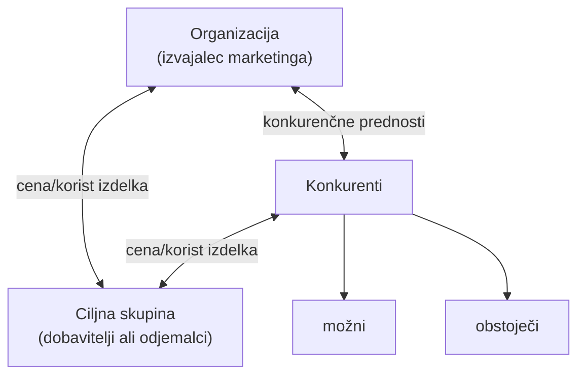
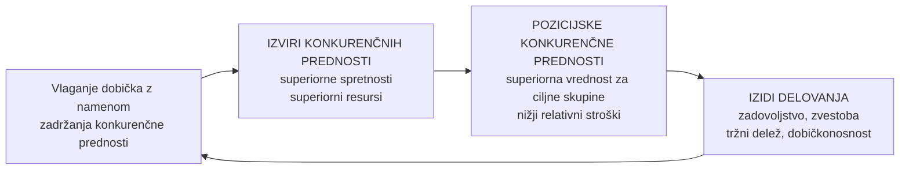
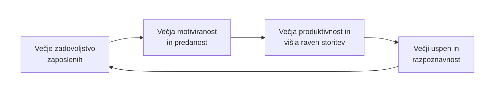

+++
title = "Marketing"
date = 2024-10-06T07:07:07+01:00
draft = false
math = true
mermaid = true

summary = "Zapiski za predmet Marketing za zimski semester drugega letnika FERI MK MAGISTERIJ."
summary_enable = true
summary_style = "subtitle"
+++

## Vrste Marketinga

### Marketing glede na stopnjo etičnosti in dolgoročnosti odnosa

Glede na ta dva dejavnika (etičnost in dolgoročnost odnosa) poznamo 3 vrste:

- **Transakcijski** - pridemo v trgovino in kupimo mleko in kruh. To je navadna transakcija, glede dolgoročnosti odnosa je kratkoročno. Trgovca na blagajni prvič in zadnjič vidimo. Stopnja etičnosti je tu tudi na minimumu.
- **Pogodbeni** - gremo v lesnino in kupujemo novo sedežno garnituro. To gre za pogodbeni marketing. S prodajalcem smo dlje časa na liniji, nam pomaga, svetuje pri nakupu, sklenemo pogodbo, kjer je zapisano dostava, cena, dvoletna garancija na garnituro. To zajema pogodba in gre zato že za srednje ročen odnos. Stopnja etičnosti pa je tako tudi večja.
- **Partnerski** - gremo z nekim solastnikom/sodružbenikom, v neko partnersko razmerje npr. nakup zemljišča, lokala. Gre za partnerski odnos. Dolgoročnost je tu najvišja in stopnja etičnosti je tudi višja.

---

### Marketing, naravnan na vrzeli (niche marketing)

Marketing, naravnan na vrzeli (angl. *niche marketing*, *concentrated marketing*).

**Tržna niša ali marketinška niša** pomeni majhne ali specifičen del trga, ki se osredotoča na točno določeni izdelek ali storitev. Nišni marketing je usmerjen v tiste ciljne skupine, katerih potrebe niso zadovoljene ali pa so slabo zadovoljene. Zanimanje ljudi, marketingerjev za te niše je aktualno, ker bi tržne niše naj predstavljale neko konkurenčno prednost pred našimi konkurenti. Tržna niša predstavlja neko dodano vrednost.


**Aktivno delo:** Preberi članek *"Proteinski izdelki kot tržna niša"*


---

### Marketing glede na diferenciranje ciljnih skupin (tržnih segmentov)

**Nediferenciran (agregirani) marketing** - organizacija uporablja isti marketinški splet za vse glavne ciljne skupine - homogeni izdelki, veliko število kupcev. Recimo za izdelke, ki so splošno uporabni, npr. mleko, cedevita. Gre za homogene izdelke, ki imajo veliko število kupcev.

**Diferenciran marketing** - organizacija uporablja različne marketinške splete za različne tržne segmente (segmentirani). Nanaša se na kakšne luksuzne izdelke, recimo primer pristižnih izdelkov, gospodinjski izdelki Miller. Izdelki so namenjeni ljudem z visokim dohodkom. Ne gre za homogene izdelke, ampak specifične diferencirane izdelke. En primer je tudi nov električni BMW. Komu je namenjen? Samo specifični skupini ljudi. Ne ciljamo široko populacijo, ampak specifičen segment ljudi.

---

### Vrste marketinga

- **e-marketing**, ki temelji na elektronskih (zlasti računalniških) povezavah med udeleženci v menjalnih procesih. Sem spada tudi spletni marketing oz. marketing po spletu.
- **marketing na podlagi podatkovnih baz** (angl. *data-base marketing*). Ta marketing temelji na uporabi računalniških bank podatkov o udeležencih, ki so v teh menjalnih procesih.
- **nevromarketing**, ki temelji na uporabi nevroznanosti pri proučevanju reakcij posameznika na stimulanse. V zadnjem času zelo popularen, ker se združuje nevrologija, psihologija in ekonomija. Proučuje senzomotorično, kognitivno in afektivno podajanje odgovorov potrošnikov. Raziskovalci na tem področju uporabljajo neko tehnologijo za aktivacijo možganov. Proučujejo kako oglaševalci vplivajo in nadzorujejo naše misli. To je marketing, ki je zelo zanimiv in v zadnjem času zelo trendovski.


**Aktivno delo:** Preberi članek *"Z nevromarketingom do uspešnega uresničevanja oglaševalskih konceptov"*


---

### Marketing glede na pravni status ciljne skupine

- marketing, usmerjen v fizične osebe (gospodinjstva, člane gospodinjstev) (angl. *consumer marketing*, B2C),
- marketing, usmerjen v organizacije, medorganizacijski marketing (angl. B2B marketing).

Na eni strani je usmerjen v fizične osebe (na gospodinjstva ali pa posamezne člane gospodinjstva), ali pa marketing usmerjen v organizacije.

**Ključni subjekti in odnosi v digitalni dobi:**

| | Vrsta | Opis |
| :---: | :--- | :--- |
| 🏭 → 🧍 | **B2C** *(business to consumer)* | podjetje in končni potrošnik sta tu. Podjetje prodaja končnemu potrošniku, gospodinjstvu, osebi gospodinjstva. |
| 🏭 → 🏭 | **B2B** *(business to business)* | medorganizacijski marketing. Menjalni procesi se odvijajo na medorganizacijskih trgih. |
| 🧍 ⇄ 🧍 | **C2C** *(consumer to consumer)* | potrošnik potrošniku. To je bolha. |
| 🧍 → 🏭 | **C2B** *(consumer to business)* | potrošnik podjetju. Izumimo patent in ga prodamo podjetju. |

---

### Marketing glede na uporabo posrednikov na poti izdelka

- **neposredni** (brez uporabe posrednikov): TV prodaja, proizvajalci prodajajo neposredno iz svojih prodajaln, prodaja po pošti, kataloška prodaja…podjetje direktno proda potrošniku.
- **posredni** (z uporabo posrednikov): trgovinske organizacije na debelo (prodajo drugim organizacijam) in drobno (prodaja končnim potrošnikom).

Ali posrednike uporabimo ali ne.

---

### Marketing glede na geografski trg

**Globalni ali mednarodni marketing** - Globalni trg je najbolj širok trg. Organizacija uporablja na čim več trgih po celem svetu, npr. Coca Cola, McDonalds.

**Nacionalni marketing** - Marketinško delovanje znotraj državnih mej.

**Regionalni marketing** - Marketing v nekaj mestih ali regijah. Npr. marketing za Štajerce.

**Lokalni marketing** - Omejitev marketinga na neko lokalno zadevo. Recimo marketing v neki vasici.

---

### Marketing glede na družbeno odgovornost

- "zeleni" ("ekološki"),
- socialni marketing,
- demarketing.

#### Demarketing

Zajema aktivnosti zmanjševanja povpraševanja. Primer: cigareti, junk food, pijače z umetnimi sestavinami…

Slovenski izraz za ta marketing je protitrženje. Protitrženje se uporablja za zmanjševanja povpraševanje, ali celotno povpraševanje celo uničiti. Strategije te vrste marketinga vključujejo promocijo npr. proti kajenju, kake davke na tobačne izdelke, uvedba kakih opozorilnih nalepk, zmanjševanje oglasnih površin, zahtevajo zviševanje cen npr. rečejo, da to in to škodi zdravju in zato zahtevajo dvig cen. Npr. davek na trans maščobe, cene na cigarete in alkohol. Sem sodi tudi proti hranam in pijačam z dodatki, maščobami, hrani z umetnimi sestavinami. Na ta način želijo zmanjšat debelost, sladkorno bolezen, druge bolezni itd.





**De-influencerji**  
Posamezniki, katerih cilj je, da bi sledilce odvrnili od nekih nakupov, katere označijo za škodljive, slabe.

#### "Zeleni" ("ekološki") marketing

Zajema razvoj in izvajanje marketinških programov, usmerjenih v povečanje imidža organizacij v zvezi s skrbjo za okolje.

Za njega je značilno izboljšanje zelenega naravnega okolja, da bi to bilo čim bolj zaščiteno. Skrbijo za dvig imidža organizacijam s tem, da se podjetja v oglaševanju sponzorirajo s tem da skrbijo za okolje.





**Primeri:**

- Natureta - "Hvala, narava." - reklama, v kateri nastopajo predstavniki različnih generacij.



- Pivovarna Bevog z novo podobo ozavešča: *"Izumrtje je za vedno"* - opozarjajo na izumiranje živalskih vrst z motivi ptic na pločevinkah piva.

- Systemair - razlagalni video (*Clean air*), ki opozarja na svež in čist zrak. Združeni narodi so ga naročili naj izdelajo.



- Oglas ob dnevu Zemlje - *"Non-Fungible Planet"*. Ne bomo govorili o nenadomestljivem planetu. To je cilj tega oglasa - primer zelenega oglasa.



- Vandalizem nad drevesa - v sklopu projekta so drevesa, ki so bila poškodovana, označili in dopisali drevesom zgodbe, zakaj je prišlo do poškodb drevesa. Namen oglasa je bilo ozaveščati ljudi o vandalizmu.





- Barcaffè Flora - *"Opojna. Odgovorna."*

- Najgrši božični pulover je iz Španije ("Ugly Data Sweater") - v Španiji so naredili akcijo, s katero so ljudi želeli opozoriti na gozdne požare, ki so bili v Španiji, in so z dano akcijo zbirali najgrši božični pulover, ki bo prikazal požare v Španiji, in tako je prišlo do donacij.

- Proglas - družbeno odgovoren oglas o problematiki smeti. Zmagal je oglas **Posameznikova senca**: *"Naša kreativna rešitev prikazuje posameznika in njegovo senco, ki simbolizira smeti, ki jih je v življenju odvrgel. Senca nam sledi in ne moremo se je znebiti. Kako velika bo ta senca in kako bo vplivala na okolje in družbo, je izključno naša odgovornost. Zato ni dovolj, da odpadke ločujemo, ampak da se tudi zavedamo, kakšne vrste odpadkov ustvarjamo in v kolikšnih količinah."*

- Mercator - plakati, ki čistijo zrak. Čistilne oglase so naredili s QR kodami, da lahko uporabniki vidijo količino ogljikovega dioksida. *"Ker se plakati nahajajo v zunanjem okolju, kjer so prisotni zvoki okolice, smo video opremili še s podnapisi za lažje spremljanje na mobilnikih. Z novimi pobudami želimo skupaj s partnerji spodbujati inovativne in okolju prijaznejše oglaševalske prakse,"* pravijo v Mercatorju.

- WWF - ogrožene živalske vrste. Če kupujemo kakšne spominke eksotičnih živali, puščamo krvni madež s tem (*"Don't buy exotic animal souvenirs"*). Oglas sporoča, da živali ne moremo popravit kot avtomobile (*"Extinction can't be fixed"*).





- Boj proti cirkusu z živalmi - da se živali ne bi izkoriščalo za to (tiger na vrvicah - *"The show mustn't go on"*; opica za rešetkami z naličenim obrazom klovna - *"Animals are not clowns"*).





- IFAW - slon, sestavljen iz črt črtne kode, na afriški savani - *"Stoppt den Handel mit Wildtieren."* (Ustavimo trgovino z divjimi živalmi.)

- BUND - boj proti petardam, opustitev pirotehnike (*"Petarde? Ne, hvala!"*). Akcija, ki je vsako leto in novembra, decembra se začne pojavljat, in želijo, da ne bi bilo uporabe pirotehnike dosti oz. nič (*"Every 60 seconds a species dies out."*).



Kljub akciji BUND proti petardam pa trgovci pirotehniko še vedno intenzivno oglašujejo in prodajajo po akcijskih cenah.





#### Socialni marketing

Osrednji cilj socialnega marketinga je (ustvarjati) "družbeno dobro".

Izhajajoč iz spoznanja, da zgolj informiranje posameznikov/družbenih skupin o določenih družbenih vedenjih ne zadostuje, da bi slednji/e pričeli/e ta spreminjati, začne socialni marketing uporabljati orodja in izsledke s področja **socialne psihologije**, in sicer z namenom odkrivanja zaznanih ovir pri spreminjanju vedenja in načinov njihovega premagovanja.

> **Primeri**
>
> Oglasi za vedenje na avtocestah, varna vožnja, oglasi proti kajenju…

Gre za družbeno dobro. Gre za spodbujanje družbenih sprememb. Angleško je to *social marketing*. Zajema celoto marketinških aktivnosti, naravnanih predvsem na družbeno koristne namene in ne na pridobivanje denarja in finančnih sredstev. Izvira iz socialne psihologije. Teži k spreminjanju naših navad, da bi te navade spremenili.

**Primeri kampanj, ki temeljijo na logiki socialnega marketinga:**

- Heroji - *"Virus prometnih nesreč še vedno kosi med aktivno populacijo. Ne pozabimo na varnostne ukrepe tudi v prometu!"* (Vir: Zavod Vozim, 2020)

- *"Nalezimo se dobrih navad"* - to je bilo v času korone (Vir: Ministrstvo za zdravje, 2020)

- Zavod Diabetes - *"Pri diabetesu misli tudi na srce!"* (Vir: Zavod Diabetes, 2020)

- vsaka tretja slovenska pesem normalizira pitje alkohola. Nekaj najboljših komadov:

**Adi Smolar - Eks za ex ljubico**



**D'Kwaschen Retashy - Ge rad pigen**



Več ko spijemo, boljši smo. Naj razmišljamo, naj se nič ne zgodi, ne samo da nas ne ustavijo (*"Poslušajte odgovorno in razmislite, preden sedete za volan."*).

- *"Najhitrejši včasih ne pridejo na cilj"* - opozarja voznike na prevelike hitrosti, ki so glavni vzroki, da se zgodijo hude prometne nesreče (#VarnoDoCilja).

- The Irish Road Safety - šokanten oglas, kjer opozarja na varno vožnjo - ne sedite za volan, ko pijete!



- Jelen (pivo) - *"Every 48 seconds, a drunk driver makes another person eligible to park here."* - znamka Jelen predlaga, da če pijemo, naj nas nekdo drug odpelje domov.

- Apatinska pivara - *"Kad pijem ne vozim. Ako zoveš bivšu, zovi i kuma da dođe po tebe."*

- Toyota - ne vozite, ko pijete (video *Toyota Kids*). Naj bi bili ljudje v vinjenem stanju podobni otrokom, nimajo občutka za koordinacijo, varnost, reflekse. Zakaj se podjetjem splača delati takšen oglas? Da opozorijo, da pokažejo, da jim je mar za to. S tem delajo na tem, da bi jim potrošniki bolj zaupali, bili v njihovih očeh bolj verodostojni, da ljudje dobijo občutek, da ne dajo samo denar podjetju, ampak bo podjetje na njih gledalo kot na ljudi. Imidž podjetja pa se s takimi oglasi tudi izboljša.



- Veriga dobrih ljudi - *"Pogrešam šolo, tam sem imela malico."* - akcija, kjer so govorili o tem, da revščina mnogim ostane skrita. Ljudje se nočejo izpostavljat. V humanitarnem programu so tudi želeli pokazat, da polno ljudi ostane pod pragom revščine, kljub temu, da aktivno delajo. (*"Držimo skupaj z družinami v stiski."*)

- Veriga dobrih ljudi - *"Naj kupim hrano ali plačam položnice?"*

- Ameriški rdeči križ - *"Kri ni le za v filme"* (video *A Bloody Nightmare*) - da je nujna kri tudi za preživetje, ne samo za filme.



- Brez izgovorov - marketinške akcije, ki se navezujejo na bolezni in odkrivanje bolezni. Rak kože npr. običajno ni boleč, zato se naj ne zanašamo na to, da je vse v redu. *"Če zdravstvene težave ne izginejo v tednu ali dveh, zberite pogum in čim prej pojdite k zdravniku. Prej ko je bolezen odkrita, manj naporno je zdravljenje, lažje je okrevanje in večje so možnosti za preživetje in ozdravitev."* / *"Rak kože običajno ni boleč, zato se ne zanašajmo na odsotnost bolečine."* / *"100 % je zaradi stresa."*





- Europa Donna - rak materničnega vratu, oglas z nekdanjo predsednico Slovenije, opozarjajo na pregled pri ginekologu (*"Da bi postala britanska princesa, si prepozna. Za druge priložnosti ne zamudi pregleda pri ginekologu."*).



- Movember.com - kako je grozno, če sin umre pred očetom (video *Movember 2016: Father & Son*).



- Raka prebavil - *"Neprimerno sranje"* - hitra reakcija na neprimerno sranje poveča možnost za ozdravitev (Onkoman).

- Malibu in Tom Daley - *Don't Drink and Dive* - da ni dobro piti in skakati v vodo pijan.



---

### Vrste marketinga

- **marketing, ukrojen po meri** (angl. *customized marketing*), ki je prilagojen čim manjši možni ciljni skupini. V to izvedenko marketinga spada tudi **mikromarketing**;
- **makromarketing** kot veda, ki proučuje vpliv marketinga na (celotno) družbo in trg ter vpliv družbenih sprememb na marketing;
- **mrežni marketing** je marketing na več ravneh (angl. *multilevel marketing*), ki je sistem prodaje blaga neposredno kupcem z mrežo samozaposlenih prodajalcev - **piramidna prodaja**;

**Marketing ukrojen po meri** - pomeni, da je za točno specifično osebo, ali ciljno skupino ljudi.  
**Mikromarketing** se nanaša na prilagajanje spleta, izdelka, posebnim željam skupin in posameznikov. Mikromarketing je izredno pomemben, ob koncu 20. stoletja je postal eden izmed najpomembnejših vrst marketinga.

**Makromarketing** - vpliv marketinškega procesa na celoto. Pomemben je za čisto vse vidike poslovanja, vključno za povezovanja procesa in stranko in tudi v povezavi z globalnim nakupnim vedenjem.

**Piramidni marketing** - gre za piramidno skupino sodelavcev. Vabijo v piramide. Gre za multilevel marketing. Gre za piramidno prodajo, kjer tisti, ki so na vrhu, dobro zaslužijo, vsi nižje na hierarhiji pa bistveno manj. Gre za zunanje sodelavce, ki se od zunaj priključijo. Tisti se priključijo na nižjih nivojih.

---

### Marketing, naravnan na trajnejše odnose (marketing povezav, odnosov – partnerski marketing)

- marketing, naravnan k trajnejšim odnosom (angl. *relationship marketing*), vsebuje aktivnosti marketinga, usmerjene v menjalne procese, ki temeljijo na trajnejših odnosih med udeleženci;
- **obojestranske koristi**.

To je partnerski marketing. To je način, da se strankam pokaže, da ti je mar za njih. Da te zanima njihovo mnenje, njihove potrebe. Gre za razvijanje nekih nenehnih povezav s kupci. Pomembno je, da gre za obojestranske koristi. Gre za neko tvorjenje povezav zaradi koristi.

### Digitalni marketing

- Digitalni marketing je načrtovanje, organiziranje, izvajanje in nadzor celote **marketinških aktivnosti** s pomočjo **digitalnih komunikacijskih in prodajnih poti**.
- Digitalni marketing se razlikuje od tradicionalnega v tem, da vključuje uporabo digitalnih kanalov in metod.

Marketing, ko se znova razvija, dopolnjuje, gre vedno do neke nadgradnje. Gre za marketinške poteze, kjer je organizacija na eni strani, potrošniki na drugi strani, med sabo interaktivno komunicirajo po raznih elektronskih, digitalnih kanalih, nadaljnjo povprašujejo po nekih spletnih izdelkih v spletnih prodajalnah. Te digitalne komunikacijske in prodajne poti pa ne temeljijo le na uporabi spleta, ampak vključujejo tudi druge poti. Primer - epošta, video streaming, bloganje, mobilna sporočila, podcasting itd.

Tradicionalne komunikacijske prodajne poti, zakaj so še zmeraj pomembne? Zakaj ne gremo samo v digitalne?

Klasične tradicionalne poti so še vedno pomembne, da potrošnika obvestijo o neki blagovni znamki. To je razlog, zakaj so klasične tradicionalne marketinške poti še zmeraj pomembne, da vzbudijo zanimanje za blagovno znamko. Digitalne poti pa so pomembne, ker imajo več pomena pri oblikovanju stališč, večji pomen imajo pri odločitvi o nakupu in stopnji zvestobe. Povečevanje stopnje zvestobe imajo večji vpliv digitalni mediji. Tudi tradicionalni mediji imajo svojo vlogo. Še vedno je najboljša vloga obojega - tradicionalni pomembni za en del, digitalni za drugi del. Pri nekem novem izdelku ali storitvi vedno uporabimo kombinacijo. Pomembno kaj želimo pri potrošniku doseč in glede na to uporabimo različno kombinacijo različnih medijev.

Pri 4 P projektu bo en izmed teh P-jev tudi marketinško komuniciranje - tu se bomo lahko odločili za tradicionalne ali digitalne medije, ali kombinacijo obojega. Kdo bo naša ciljna skupina in glede na to koristimo različne mere tradicionalnega, digitalnega marketinga in medijev.


**Aktivno delo:** Preberi članek *"Holistic marketing - Umetnost grajenja trajnih odnosov med podjetjem in potrošniki"*


## Marketinško okolje

### Marketinško okolje in njegova analiza

- Celovito okolje, ki podjetje obkroža in s katerim je v interakciji. Marketinško okolje zajema "vse", kar vpliva na marketinške odločitve - vključno z globalnim makro okoljem in mikrookoljem.
- Najširše: organizacija znotraj **megatrendov**.

### Marketinška okolja

Na sredini je podjetje, organizacija, ki se odloča o marketinških odločitvah. Oranžno polje je ožje okolje, modro polje pa pomeni širše okolje.

- **Interno okolje** sestavljajo notranji deležniki, viri, kultura in struktura, ter cilji.
- Sem sodi še **eksterno mikro okolje**. Tu so posredniki, dobavitelji, potrošniki, ki kupujejo izdelke, in konkurenti. To sodi vse v ožje okolje.
- **Zunanje okolje** pa je pomembno za organizacijo, a ne neposredno. Sem sodi sociokulturno okolje, tehnološko in naravno okolje itd.

Struktura marketinškega okolja (od najožjega do najširšega): organizacija (marketinške odločitve) → notranji deležniki, viri, kultura & struktura, cilji → posredniki, dobavitelji, potrošniki/javnost, konkurenti → politično-pravno, tehnološko in naravno, socio-kulturno, demografsko in ekonomsko okolje, znotraj vsega tega pa še megatrendi.

### Spremembe v makro okolju

- **Modne muhe** - tiste igrače za otroke, ki se vrtijo, Rubikova kocka, Pokémon igrače…? Začasne stvari, ki so mogoče ta hip popularne, jutri pa več niso. Podobno velja za trende.
- **Trendi** - razcapanstvo: hlače, puloverji…?
- **Megatrendi** - čas, prostor, intenziteta. Primer: klimatske spremembe.

**Čas** - pomemben čas napovedi za spremembe naslednjih deset let. Ko se pogovarjamo o modnih muhah in trendih, je to mogoče čas enega meseca. Megatrend pa se nanaša na več let.

**Prostor** - gre za neko večjo širšo regijo, mogoče celo globalno regijo.

**Intenziteta** - spremembe številnih področij. To so lahko socialna, ekonomska, politična, način življenja itd.

> **Primer**
>
> Klimatske spremembe - moč, intenziteta, daljše časovno obdobje itd. Npr. bolj vroča poletja, gladina morja se dviga, izumrtje živalskih vrst, razvoj tehnologije, potrošnja - to vse sodi k megatrendom.

**Kakšni so trenutni megatrendi?**

- Rast prebivalstva
- Rast srednjega razreda
- Staranje prebivalstva
- Klimatske spremembe
- Okoljske omejitve
- Mobilna komunikacija 5G,…

Zakaj so megatrendi pomembni za marketing? Pri izdelkih, storitvah npr. staranje prebivalstva je pomembno, da se ve, da se prilagodi storitve in izdelke starejšim osebam.

Klimatske spremembe, okoljske omejitve - lahko investiramo ogromno, od zdravstvenih storitev, prosti čas. Če bo več ljudi v penziji, bo več prostega časa in bodo izdelki namenjeni takim uporabnikom, ki imajo več prostega časa.


**Aktivno delo:** Preberi članek *"Zares dober svet"*


---

### Ožje in širše marketinško okolje

- **Mikro okolje** (ožje okolje) sestavljajo udeleženci, ki so neposredno povezani s podjetjem in nanj tudi najbolj vplivajo: potrošniki, dobavitelji, konkurenti, javnosti in posredniki. To je okolje, ki je tudi najbolj odvisno od organizacije in organizacija od njega.
- **Makro okolje** (širše okolje) pa sestavljajo dejavniki, ki nanj učinkujejo le posredno in nanje organizacija ne more pomembno neposredno vplivati: demografsko, socio-kulturno, ekonomsko, naravno, tehnološko in politično-pravno okolje.
  - **Sociokulturno okolje** so vrednote, način življenja.
  - **Ekonomsko okolje** - to so gospodarske razmere, razmere v določeni panogi.
  - **Naravno okolje** - omejenost naravnih virov.
  - **Tehnološko okolje** - razvoj novih izdelkov, storitev, novi materiali, novi procesi, novi postopki.
  - **Politično-pravno okolje** - predpisi, ki vplivajo na poslovanje.

**Sodelovanje Spara z dobavitelji** (primer: video *SPAR - Kdo smo mi: Ribogojnica Fonda*) prikazuje, kako dobavitelj deluje in kako sodeluje s Sparom.



Podjetje ali organizacija z makrookoljem običajno nima pogostih ali neposrednih stikov, je pa to okolje dolgoročno in odločilno vseeno pomembno zanj - gre za gibanja in trende, ki vplivajo na menjalne odnose organizacije, čeprav organizacija nanje ne more pomembno vplivati.

---

### 1. Demografsko okolje

- Populacija - rojstva, smrti
- Starostna, spolna in geografska struktura/porazdelitev prebivalstva
- Generacije:
  - Generacija Z: 1995– (vanjo sodite tudi sami)
  - Generacija Y: 1977-1994 (danes 30+)
  - Generacija X: 1965-1976
  - Baby Boomers: 1946-1964 (danes "vladajo"?)
  - Stare osebe: 1920-45
- Etnična in druga struktura
- Izobrazbena struktura in struktura poklicev
- Struktura in velikost gospodinjstev
- Migracije
- Število zaposlenega prebivalstva in razmerje med aktivnim in vzdrževanim prebivalstvom
- Delež kmečkega, mešanega in nekmečkega prebivalstva
- Stopnja mobilnosti in zdravstvena slika prebivalstva

Zakaj je demografsko področje pomembno v marketingu? Da lahko segmentiramo ljudi in na tej osnovi določimo ciljne trge in ko jih imamo izbrane, lažje določimo marketinško strategijo in ostale strategije na področju marketinga.

**Prebivalci Slovenije** - prebivalstvo raste. Po podatkih za 2024Q2: skupaj 2.124.709 prebivalcev (1.068.998 moških, 1.055.711 žensk), od tega 1.918.711 državljanov Republike Slovenije in 205.998 tujih državljanov.

**Število in sestava prebivalstva, SURS (2022):** 2.108.708 prebivalcev Slovenije, povprečna starost 43,8 let, delež prebivalcev starih 0-14 let 15,1 %, delež prebivalcev starih 15-64 let 64,0 %, delež prebivalcev starih 65 ali več let 20,9 %, delež tujih državljanov med prebivalci 8,1 %.

**Imena, SURS (2022):** najpogostejše ime novorojencev Luka, najpogostejše ime novorojenk Mia, najpogostejše moško ime Franc, najpogostejše žensko ime Marija, najpogostejši priimek Novak.

> **Primera**
>
> - Za organizacije s področja turizma, ki imajo probleme s sezonskimi nihanji povpraševanja kupcev, predstavlja naraščanje deleža starejših ljudi v sestavi prebivalstva ugodno možnost za usklajevanje razlik med ponudbo in povpraševanjem, ki so značilne za to panogo. Z ustrezno ponudbo bi lahko v izvensezonskih razdobjih pritegnili omenjeni segment prebivalstva.
> - V razvitih državah je značilen trend povečevanja števila samskih gospodinjstev, kar ima posledice na področju marketinga izdelkov, ki so prilagojeni tem gospodinjstvom (pomivalni stroji, dostava hrane na dom,…).

Zakaj ima turizem problem s sezonskimi nihanji? Zaradi dogodkov, počitnic, letnih časov, vremena. Ker prihaja do staranja prebivalstva, bi bilo smiselno več akcij za starostnike.

### 2. Ekonomsko okolje

- Dohodkovna distribucija
- Kupna moč
- Prihranki
- Dolgovi
- Razpoložljivost kreditov
- Strukture nacionalnih ekonomij
- Ekonomski kazalci (napovedi)

Sem sodijo ekonomski kazalci, tudi kupna moč, BDP itd. Sem sodijo tudi davki, denarne cene, stroški, stopnja brezposelnosti.

Sem sodijo tudi gibanja: narodnega dohodka, kupne moči, bruto domačega proizvoda, inflacije, obrestnih mer, povpraševanja in ponudbe, varčevanja, porabe, kreditov…

Sem sodijo tudi različne organizacije, na katere organizacija - izvajalec marketinga ne more pomembneje vplivati: vlada, parlament, združenja in druge. Podjetje na katero marketing ne more vplivat. To so vlada, komisije, to sodi pod vlado. Pod **parlament** sodijo poslanci, politične stranke, razne komisije. **Združenja** so lahko sindikati, zbornice, organizacije za zaščito naravnega okolja, organizacije za zaščito kupcev, potrošnikov itd.

### 3. Socio-kulturno okolje

- vrednote in način življenja
- odnosi med ljudmi
- kultura
- primeri: navade v državah z različnimi verami; gibanja za zaščito potrošnikov; skrb za zdravje…

Pomembne so vrednote in način življenja. To okolje se nanaša na odnose med ljudmi, pri katerih se kultura udejanja preko nekega znanja, kulturnih vrednot, idej, norm, umetnosti, navade tudi sodijo sem.

> **Primeri**
>
> Države z različnimi verami - drugačne navade so v državah s krščansko vero, v državah z budistično vero. Različna gibanja za zaščito potrošnikov.

### 4. Naravno okolje

- Pomanjkanje surovin
- Dvig stroškov energije
- Onesnaževanje
- Regulacija in državna zaščita
- Naravni viri

Vključuje stanja gibanja in organizacije, ki pa se nanašajo na naravne razsežnosti delovanja sveta. Sem sodi pomanjkanje surovin, onesnaževanje, dvig stroškov energije, regulacija in državna zaščita. Za zadovoljevanje naših potreb so pa naravni viri, ki niso vedno v neomejenih količinah. To je pomembno za posameznike v marketingu.

**Tri vrste naravnih virov:**

- Viri, ki so v relativno neomejenih količinah, npr. sončna energija, zrak, voda. Relativno neomejeni sta zrak in voda, ker v neki določenih obdobjih ali razdobjih in na določenih geografskih območjih sta lahko količinsko in kakovostno omejeni, npr. v arabskih državah je voda dražja od nafte.
- Viri, ki so v naravi v omejenih količinah, vendar jih je možno obnavljati, npr. rodovitna zemlja, hrana itd.
- Viri, ki so v omejenih in neobnovljivih količinah - nafta, premog, zemeljski plin in razna rudna bogastva.

> **Primer**
>
> Radenska - da moramo na stvari gledati s srcem (*"Tvoje srce vidi, česar oči ne."* - Radenska za jutri). Ciljali so na ljudi, katerim je pomembno okoljevarstvo in obnovitveni projekti.
>
> 

### 5. Tehnološko okolje

- Trenutki sprememb in njihova uveljavitev
- Priložnosti za inovacije
- R & R investicije
- Regulacije sprememb

(primer: 3D-tiskan stol, Touraine, 2018)

### 6. Politično-pravno okolje

- Upoštevanje zakonov
- Politično-zakonodajna telesa: zakoni, predpisi, uzance, pravilniki, ki vplivajo na delovanje organizacije.
- Upoštevanje okolja - tujina…
- Specifičnosti in "pasti" tuje zakonodaje
- Verjetnosti drastičnih političnih in zakonodajnih sprememb na posameznih trgih

Potrebno je upoštevati zakon, potrebno je poznat regulative, ki se navezujejo in je pomembno za podjetje. Politično-zakonodajna telesa npr. sodišča, policija, ministrstva, ki imajo zakone, ki vplivajo na področje delovanja marketinga. Upoštevanje okolja - tujina. Zakoni in predpisi se med državami razlikujejo. Če bomo vstopili na tuje trge, je potrebno dobro poznat politiko in kulturo druge države.

---

### Eksterno, makro okolje: namen analiz

Ko analiziramo okolje, je potrebno analizirati ne samo mikrookolje, ampak tudi makrookolje. Opravljene analize makro okolij nam pomagajo odgovoriti na naslednja vprašanja:

- Ali poznamo ključne dejavnike (politični, okoljski, tehnološki, ki vplivajo na delovanje našega podjetja, na delovanje znamk in na prihodnji razvoj naših izdelkov in storitev)?
- Ali vemo, zakaj je posamezni dejavnik pomemben za delovanje našega podjetja, in ali vemo, kako lahko dejavnike upoštevamo in spremljamo?
- Kateri dejavniki predstavljajo grožnjo in kateri priložnost za naše podjetje?
- Kateri dejavniki so globalne in kateri lokalne narave?

Dobro poznavanje okoljskih silnic in njihovo holistično razumevanje podjetjem/organizacijam omogoča prepoznavanje (Kotler in Keller, 2016) priložnosti in groženj - to je tudi del SWOT analize. S tem se podjetja izognejo t. i. "Kodak momentom" (zapoznelo zaznavanje trendov v makrookolju in posledično zapoznel odziv nanje).

---

## Vedenje potrošnikov

### Opredelitev človekovega (nakupnega) vedenja

Interakcija: človek - okolje.

- razmišljanje in fizične aktivnosti
- proces, v katerem se kupec/potrošnik odloča kaj, kje, kdaj, kako in od koga kupiti ter kdaj, kje in kako kupljeno uporabljati.
- reagiranje na dražljaje

Potrošnik sodi v mikrookolje, ker je zelo pomemben za podjetje, za organizacijo in gre za neko neposredno sodelovanje.

Človeško vedenje zadeva nek celoten proces interakcije med na eni strani človekom, na drugi strani pa okoljem. Interakcija med človekom in njegovim okoljem - tukaj gre za povezavo vrednot, stališč, prepričanj, njegovih potreb, želj, njegovih pričakovanj, in gre za to interakcijo tudi na podlagi tega, ker se s tem pridobiva in uporablja izdelke, ki so predmet menjave. Pri marketingu je bistvo, da gre za menjavo. Človekovo nakupno vedenje - gre za proces, ki vključuje razmišljanje in fizične aktivnosti v zvezi z njegovim odločanjem. O tem, kaj bomo kupili, kaj bomo rabili itd. Gre za proces, v katerem kupec ni nujno da je kupec, lahko je tudi potrošnik, se odloči kje, kaj, bo nekaj od njega kupil in kje, kako bo storitev oz. izdelek uporabil.

Vedenje potrošnika pomeni njegovo reagiranje na različne dražljaje. Najdemo npr. izdelek v akciji, to je en dražljaj, ki nas pripelje do tega, da izdelek kupimo, tudi če ga ne rabimo. Podobno če vidimo izdelek v izložbi, ga ne rabimo, ampak ga kupimo, ker nam je lep.

### Proces vedenja potrošnika

- zaznanamo določeno napetost
- dražljaji

Se začne takrat, ko zaznamo določeno napetost. Ta se ustvari v delu njegovega psihološkega polja in jo povzročijo najrazličnejši dražljaji, recimo izložba, akcija, oglasno sporočilo.

### Potrošnik in kupec

- Kdo je kupec?
- Kdo je potrošnik?
- Kdo je potencialni potrošnik?

**Kdo je kupec?** Je oseba, ki ima možnost za nakup. Možnosti za nakup so pa viri in sposobnosti. Npr. en vir je denar, sposobnost pa je, da smo dovolj stari. To dvoje je potrebno, da lahko kupimo alkohol.

**Kdo je potrošnik?** Kupuje, da zadovolji skupne, ali pa osebne potrebe. Recimo bomo šli v trgovino in bomo kupili kruh. Mogoče smo mi lačni, mogoče pa ga bomo delili s celotno družino. Kupec ni nujno da je potrošnik, lahko pa je, v primeru da bo izdelek, storitev tudi sam uporabil. Potrošnik je oseba, ki ima vire in sposobnosti, za pridobitev in uporabo dobrin, ki jih ponuja trg, z namenom, da bi lahko zadovoljil svoje osebne potrebe ali skupne potrebe, npr. družinske potrebe.

**Kdo je potencialni potrošnik?** O njem govorimo v marketingu zato, ker je pomemben v sklopu marketinga. Na njih posebej ciljamo. Poznamo aktualnega in potencialnega potrošnika. Na potencialnega potrošnika vplivamo z različnimi sredstvi v marketingu, da bi ta opravil nek nakup. Potencialni potrošniki so tisti, ki se ne zavedajo potrebe po določeni dobrini (moramo jih spomnit po neki dobrini, naredimo nek super oglas, da jih opomnimo, da nek izdelek potrebujejo), to so ljudje, ki nimajo ustreznih informacij o nekem izdelku ali storitvi (marketingarji morajo te ljudi informirat z oglasi, razlagalnimi videi), to so ljudje, ki kupujejo sorodne izdelke pri konkurenčnih podjetjih (marketingarji morajo prepričat, da smo boljši od konkurence), to so ljudje, ki danes še nimajo ustreznih finančnih sredstev za nakup nekega izdelka (v marketingu jih je treba prepričat, da bodo prišli k nam in kupili izdelek, ko bodo imeli sredstva, damo jim boljše plačilne pogoje itd.)

### Vrste nakupnih procesov

- Razširjeni nakupni proces
- Zoženi nakupni proces
- Impulzivni nakup
- Kompulzivni nakup

Imamo 4 vrste nakupovalnih procesov:

- **Razširjeni nakupni proces** - kupec poglobljeno razmišlja o tem, kaj bo kupil, poglobljeno zbira informacije in se zelo dolgo odloča. To se dogaja pri nakupu dražjih, luksuznih izdelkov, pri nakupih, ki jih naredimo redko in tam kjer smo močno vpleteni npr. avtomobil, pohištvo.
- **Zožen nakupni proces** - pri tem nakupnem procesu pa preskočimo fazo zbiranja informacij, ocenjevanja izdelka. Te faze spustimo in nakup opravimo hitro. Razlog je lahko pomanjkanje časa ali ker gre za izdelke, ki jih pogosto kupujemo. To je nek naučen vsakdanji nakup.
- **Impulzivni nakup** - kupec opravi nakup, ne da bi pred tem prepoznal potrebo. Ne vemo, da nekaj rabimo. To se zgodi v nekih samopostrežnih prodajalnah ali pa recimo pri akcijah. To so impulzivni nakupi. Vključujejo nenačrtovanost. Gre za posledico, da smo izpostavljeni nekemu dražljaju, recimo akciji. Smo v trgovini na blagajni, nam je dolg čas in vzamemo iz police nekaj. To so impulzivni nakupi, pomemben tukaj je dražljaj. Gre za kognitivno reakcijo.
- **Kompulzivni nakup** - kupec opravi nakup zaradi žalosti, osebne praznine, gremo v trgovino, da se počutimo boljše, vendar samo kratek čas. Dostikrat tudi zaradi tega, ker se hočemo izognit soočanja z realnim, resničnim problemom. Oseba je v stanju depresije in išče način, pobega in gre v shopping. Namesto da bi se soočili s problemom in bi ga reševali, problem zaobidemo. Kaj se dogaja s kupci? Kupci se po nakupu soočajo z občutki krivde, tesnobe, začutijo, da to ni dobro in da je sreča samo trenutna. Potem se kupec tudi dostikrat zaveda, da je zapravil denar za nekaj, kar mu ni bilo potrebno. Včasih pa to v izjemnih redkih primerih pride tako daleč, da lahko govorimo o zasvojenosti.

### Modeli marketinškega komuniciranja

- AIDA,
- DAGMAR,
- DIDADA,
- Lavidge&Steinerjev,
- model adopcije,
- Howard&Shethov model,
- model on-line informacijskega procesiranja.

Obstajajo najrazličnejši modeli. Ti modeli nam predstavljajo sosledje mentalnih ali duševnih stopenj. Skozi te mentalne stopnje pa prehajajo ciljne skupine takrat, ko kupujejo ali ko pri njih pride do menjave, ali pa ko se odločajo o nakupu. Te skupine prehajajo skozi različne stopnje.

**AIDA** (E. K. Strong, 1925)  
Gre za psihološko vedenjsko teorijo. Gre za model nakupnega vedenja potrošnika, ki gre skozi 4 faze. Najprej moramo pritegnit pozornost (*Attention*), potem moramo ga spravit do tega, da ga bo stvar zanimala (*Interest*), potem ko ga bo začelo zanimat, se bo sprožila želja (*Desire*), na koncu pa še akcija (*Action*), da kupec kupi.

**DAGMAR** (*Defining Ad Goals for Measured Ad Results*)  
V praksi se manj krat uporablja kot AIDA, je pa zelo podoben. Faze: nezavedanje (*Unawareness*) → zavedanje (*Awareness*) → razumevanje (*Comprehension*) → prepričevanje (*Conviction*) → akcija (*Action*).

### Selekcija ciljev marketinškega komuniciranja

Tovrstni modeli omogočajo selekcijo ciljev marketinškega komuniciranja z določanjem, ali marketinška situacija zahteva:

- **kognitivno reakcijo ciljne skupine** - izpostavljanje izdelku, zavedanje, razumevanje, poznavanje, pozornost.
- **afektivno reakcijo ciljne skupine** - všečnost, ovrednotenje izdelka, sprejeta stališča o izdelku, prepričanje, sprejemanje izdelkov, imidž.
- **vedenjsko reakcijo ciljne skupine** - nakup, ponoven nakup, poskus, adopcija.

### Dejavniki, ki vplivajo na vedenje potrošnika

- Individualni, notranji, osebni vplivi
- Vplivi iz okolja, medosebni vplivi

**Individualni, notranji, osebni vplivi** - ali bomo mi nekaj kupili, ali bo nam nekaj všeč. Tukaj je pomembna motivacija, samopodoba, zavedanje, stališča, vrednote - to sodi k notranjim dejavnikom.

**Medosebni vplivi** - to pa so referenčne skupine, ki vplivajo na to, kaj bomo kupovali, kupčeva družina, mnenjski vodja, kultura, v kateri sodimo, pripadamo, družbeni razred oz. sloj, ki vpliva na vedenje potrošnika.

---

## Medorganizacijski marketing (B2B)

### Ključni subjekti in odnosi v digitalni dobi

Ključni subjekti (B2C, B2B, C2C, C2B) so že opisani zgoraj pri "Marketing glede na pravni status ciljne skupine"; v medorganizacijskem marketingu je v ospredju **B2B**. B2B marketing, organizacijski marketing in industrijski marketing so vse izraz za isto vrsto marketinga.

### Medorganizacijski trg

- Menjalni procesi med organizacijami se odvijajo na medorganizacijskih trgih - B2B.
- Medorganizacijski trgi vključujejo proizvajalce, trgovine na debelo (prodajo drugim organizacijam), trgovine na drobno (prodaja končnim potrošnikom) in številne druge, tudi javne organizacije: bolnišnice, univerze, vladne agencije, DARS, šolstvo, zdravstvo…

**Medorganizacijsko kupovanje** je postopek odločanja, ko organizacija zazna potrebo, nabavi izdelke in storitve ter zatem razišče, oceni in izbere potencialne znamke in dobavitelje. Medorganizacijski trg vključuje vse organizacije, ki kupujejo blago in storitve, da jih predelajo, uporabijo pri izdelavi drugih izdelkov ali dobavijo naprej. To je nakupno vedenje organizacij.

**B2B blago delimo na 3 dele:**

- **Vhodno blago** - gre za blago, iz katerega kupec izdeluje končne izdelke. To so lahko surovine ali polizdelki.
- **Oprema** - oprema kupcu omogoča proizvajanje blaga, ampak ni njegov del. To so poslovni prostori, IT oprema itd.
- **Dobavno blago** - gre za materiale, ki zagotavljajo, da proizvodnji proces sploh teče. Npr. električna energija.

Na medorganizacijskem trgu poznamo tri vrste kupcev:

- **Proizvajalci** - ti kupujejo polizdelke in surovine, da predelajo in ponujajo svoje izdelke.
- **Preprodajalci** - ti kupujejo končne izdelke, ki jih lahko oddajajo ali prodajajo končnim kupcem na drobno ali pa drugim organizacijam na debelo. Preprodajalci ne proizvajajo izdelkov in nimajo proizvodnega procesa.
- **Druge organizacije** - to so lahko državne, javne, za njih velja zakon o javnem naročanju, imajo posebno zakonodajo, ali druge neprofitne organizacije npr. rdeči križ, organizacije, ki jih mogoče sploh ne upravlja država.

### Značilnosti medorganizacijskih trgov

- **Manj večjih kupcev**: le 20 % v Sloveniji se ustvari za končne potrošnike, 80 % na medorganizacijskih trgih.
- **Tesni odnosi med kupci in dobavitelji**: malo kupcev, velika moč kupcev, prilagajanje.
- **Strokovno kupovanje**: medorganizacijsko blago kupujejo usposobljeni nabavni strokovnjaki.
- **Več dejavnikov vpliva na nakup**: več ljudi sodeluje (nakupne komisije), osebna prodaja.
- **Izpeljano povpraševanje**: povezano s trgi končnih potrošnikov.
- **Neelastično povpraševanje**: kupovanje enakih količin ne glede na spremembo cene.
- **Nestalno povpraševanje**: večja nihanja v povpraševanju povzročijo velike spremembe.
- **Neposredno kupovanje**: medorganizacijski kupci pogosto kupujejo neposredno od proizvajalcev (tehnično zapleteni in dragi izdelki).

Tu so prisotne velike količine denarja in izdelkov oz. storitev. Imajo tudi več značilnosti, ki se razlikujejo od trga končnih uporabnikov.

Manj večjih kupcev - v Sloveniji se 20 % ustvari za končne potrošnike, 80 % pa za B2B trgov, katere se dostikrat zanemari. Gre za tesne odnose med kupci in dobavitelji. Dobavitelji tukaj zelo pogosto prilagodijo svojo ponudbo na B2B trgih. Upoštevajo njihove želje, da pridejo do pogodb in jim je to zelo pomembno. Gre za strokovno kupovanje - načeloma ga kupujejo strokovnjaki, nabavni strokovnjaki, ker gre za večje količine tehničnih podatkov tukaj in je nujen strokovni pristop. Več dejavnikov vpliva na nakup - sestavljajo tudi višji marketinški menedžerji.

Na B2B trgih je malo oglaševanja, je pa osebna prodaja tu glavna.

Pomembno je spremljanje porabe, makrookolja, gre za neelastično povpraševanje, kupovanje enakih količin ne glede na spremembo cene. Pogodbe so med organizacijami dolgoročne, zniževanje cen polizdelkov ne vpliva na ceno končnih izdelkov. Nestalno povpraševanje - večja nihanja povzročajo velike spremembe.

Neposredno kupovanje - gre za neposredno kupovanje, ker gre za tehnično zapletene drage izdelke npr. letala, računalniki.

### Kdo sodeluje v procesu kupovanja (v večjem podjetju)

Nakupni center: uporabniki (*Users*), pobudniki (*Initiators*), vplivneži (*Influencers*), čuvaji (*Gatekeepers*), nakupovalci (*Buyers*), potrjevalci (*Approvers*), odločevalci (*Deciders*).

Imamo nakupni center, kjer sodelujejo vsi v nakupnem procesu:

- **Uporabniki** - tisti, ki bodo izdelek kupovali. Oni predlagajo nakup in sodelujejo pri odločitvah. Podobno velja za ponudnike.
- **Vplivneži** - to so osebe, ki vplivajo na nakupno odločitev. Pomagajo pri opredelitvi značilnosti izdelka. Gre za neko tehnično osebo.
- **Odločevalci** - ti odločajo o potrebah po izdelkih in odločajo o dobaviteljih.
- **Potrjevalci** - ti odobrijo predlagano.
- **Nakupovalci** - imajo formalno moč, da izberejo in dobavitelja in pogoje.
- **Čuvaji** - to so osebe, ki lahko preprečijo prodajalcu in informacijam, da pridejo do članov nakupnega središča. To so lahko nabavno osebje, receptorji, telefonisti.

### Tipologija kupcev na B2B trgih

- **Cenovno orientirani kupci** - njim je pomembna samo cena.
- **Rešitveno naravnani kupci** - oni iščejo neke skupne rešitve.
- **Zlati kupci** - te načeloma ne sprašujejo po ceni, ampak samo zaupajo.
- **Strateško vrednostni kupci** - to običajno ključni kupci, ki imajo dolgoročen vpliv na podjetje. Gre za tiste stranke, katerih nakupi in sodelovanje so ključnega pomena za poslovni uspeh podjetja, pogosto zaradi njihove velikosti, pomembnosti ali specifičnih potrebščin.


**Aktivno delo:** Preberi članek *"Sunkovita rast naložb B2B-podjetij v televizijsko oglaševanje"*


### Vrste nakupov v organizacijah

Glede na zahtevnost:

- **Prvi nakup**: organizacije zberejo veliko informacij.
- **Takojšen ponovni nakup**: najpreprostejša nakupna situacija.
- **Prilagojen ponovni nakup**: organizacija želi spremeniti cene, pogoje nakupa ali plačila.

**Prvi nakup** - organizacija zbere veliko informacij o nakupnih pogojih, o dobaviteljih.

Najpreprostejša nakupna situacija je **takojšnji ponovni nakup** - organizacija kupi nek izdelek, ki ga je v preteklosti že večkrat kupila, gre za avtomatični sistem naročanja.

**Prilagojen ponovni nakup** - organizacija želi spremeniti značilnosti izdelka in išče boljše ponudnike, ki imajo bolj ugodne cene, bolj kakovostne izdelke, boljše nabavne pogoje. Ponovni prilagojen nakup pa zahteva ponovno zbiranje informacij o ponudniku.

### B2B in B2C - primerjava

| | Medorganizacijski (B2B) trgi | Trgi končnih odjemalcev |
| --- | --- | --- |
| Izdelki in storitve | Po navadi gre za zelo tehnične izdelke, zelo pomembne pa so tudi podporne storitve, kot so servisi, izobraževanje in svetovanje. | Izdelki so standardizirani, bolj preprosti in prirejeni končnim odjemalcem. Podporne storitve niso tako pomembne kot na trgih B2B. |
| Komuniciranje | Poudarek je predvsem na osebni prodaji, osnovni cilj komuniciranja je prodaja izdelka. | Poudarek je predvsem na oglaševanju. Poleg prodaje so pomembni še cilji poznavanja izdelkov pri potencialnih odjemalcih. |
| Marketinške poti | Marketinške poti so kratke, kar pomeni, da izdelki prehajajo od proizvajalcev do organizacij, ki so uporabniki. | Marketinške poti so daljše, kar pomeni, da izdelki do končnih uporabnikov prehajajo prek številnih posrednikov (proizvajalec, prodaja na debelo, prodaja na drobno). |
| Odnosi z odjemalci | Odnosi so relativno dolgi in zapleteni, pogodbe o nakupih so dolgoročne. | Odnosi so bolj kratkoročni, manjše je tudi število kontaktov. |
| Odločitveni procesi | Odločitve sprejema večje število zaposlenih v organizacijah. | Odločitve sprejema posameznik ali gospodinjstvo. |
| Cene | Organizacije zahtevajo konkurenčne ponudbe in izberejo ponudnika, ki jim najbolj ustreza. Cena se po navadi določa s pogajanji. | Končni odjemalci plačajo ceno po ceniku. Cena je po navadi fiksna in se ne določa s pogajanji. |

*(Vir: prilagojeno po Boone in Kurtz, 2012, 171.)*

Pri B2C je najpomembnejše oglaševanje, pri B2B tega ni. Pri B2B so kratke neposredne poti, brez posrednikov in preprodajalcev, pri B2C pa je polno posrednikov. Odnosi z uporabniki - B2B so dolgoročni, zapleteni odnosi, pri B2C pa kratkoročni, manj zavezujoči odnosi. Odločitveni procesi - B2B ima polno zaposlenih, ker gre za drage, dolgoročne nakupe, pri B2C pa se za nakup odloča samo posameznik ali gospodinjstvo. Cene - pri B2C so običajno fiksne cene.

**B2B - marketing postaja bolj čustven** (primer videov o B2B oglaševanju)





## Konkurenca

### Opredelitev pojma konkurent

Drug izraz za konkurenta je tudi **tekmec**.

Organizacija se v poslovanju običajno srečuje z drugimi organizacijami, ki menjavajo oziroma skušajo menjavati izdelke z **istimi(!)** ciljnimi skupinami. Te organizacije so njeni **konkurenti (tekmeci)**. Skupni imenovalec za opredelitev, kdo so obstoječi konkurenti, je predvsem **ista ciljna skupina**.

**Konkurenca** je oblika marketinškega tekmovanja med posameznimi organizacijami, podjetji - na isti strani ponudbe oz. na isti strani povpraševanja. Nekdo, ki nekaj ponuja na strani ponudbe, in nekdo, ki po nečem povprašuje, nista tekmeca - morata biti tekmeca na isti strani.

Za podjetja so največji konkurenti druga podjetja, ki želijo zadovoljiti potrebe istih kupcev in imajo tudi podobno ponudbo.

> **Primer**
>
> Luka je v soglasju z občino Maribor in ostalimi pristojnimi organizacijami postavil kiosk, kjer prodaja hamburgerje, Coca Colo in vodo. Kiosku je dal ime Hambi. Primarna ciljna skupina so dijaki srednješolskega centra. Pojavi se Andrej, ki redno hodi mimo. On je imel idejo, da bi prodajal na triciklu hotdoge in pijačo. Ko prodaja Andrej hotdoge po Taboru, so njegova ciljna publika osnovnošolci in ne dijaki. Nista konkurenta, ker imata drugo ciljno skupino, kljub temu, da imata podobne izdelke in kljub temu, da zadovoljujete zelo podobne potrebe, nista konkurenta.
>
> Če se Andrej postavi pred srednješolskim centrom in tam na triciklu prodaja izdelke? Takrat sta konkurenta s podobno stopnjo konkuriranja.
>
> Jure pa na Ptuju pred srednješolskim centrom postavi kiosk isto kot Luka, z imenom Hambi, kjer prodaja prav tako hamburgerje. Sta konkurenta? Nista konkurenta, ker imata po geografskem kriteriju popolnoma drugačno ciljno skupino. Srednješolci s Ptuja ne bodo hodili v Maribor po hrano in pijačo. Po geografskem kriteriju imata drugačno ciljno skupino in nista konkurenta.

### Trikotnik strateškega marketinga

To velja za normalne marketinške razmere in so med sabo odvisni. Organizacija je izvajalec marketinga. Konkurenti so pa lahko možni ali pa obstoječi.

### Konkurenčna prednost

**Konkurenčna prednost** je pojem, ki pokaže, katere so tiste značilne kompetence organizacije, pri katerih:

- je boljša od konkurentov po mnenju ciljne skupine in
- so za to ciljno skupino pomembne.

Pokaže tiste značilnosti, kjer smo boljši od konkurentov, a ne po našem mnenju, ampak po mnenju ciljne skupine, kako ciljna skupina na nas gleda. Za ciljno skupino so te lastnosti pomembne.

Imamo neke boljše resurse. Boljšo vrednost za ciljno skupino. Tu je večja dobičkonosnost, boljši ugled, prepoznavnost, zvestoba, kupci se vrnejo, da so zadovoljni.

#### Elementi konkurenčne prednosti

**Izviri konkurenčnih prednosti**: superiorne spretnosti, superiorni resursi → **pozicijske konkurenčne prednosti**: superiorna vrednost za ciljne skupine, nižji relativni stroški → **izidi delovanja**: zadovoljstvo, zvestoba, tržni delež, dobičkonosnost → dobiček se ponovno vlaga z namenom zadržanja konkurenčne prednosti.

Ko mi nekaj vlagamo, recimo dobiček, želimo to narediti, da imamo konkurenčno prednost, da smo boljši kot naša konkurenca, da konkurenti želijo od nas kupiti. Pomembne so spretnosti, resursi, superiorna vrednost, relativni nizki stroški, izidi delovanja.

Na podlagi tržnega deleža se marsikje pogleda, koliko je podjetje dobro in priznano. Tržni delež je tisto, preko katerega se o nekem podjetju prepoznava.

### Vrste konkurentov

- **Obstoječi konkurenti** - so tiste organizacije, podjetja, ki že danes tekmujejo, pri menjalnih odnosih z istimi ciljnimi skupinami.
- **Možni konkurenti** - so tiste organizacije, ki v nekem obravnavanem obdobju ne tekmujejo s podjetjem pri menjalnih odnosih z istimi ciljnimi skupinami, ampak utegnejo kmalu postati tista podjetja, organizacije, ki bodo v nadaljevanju tekmovala z njimi.
- **Prikriti konkurenti** - o njih je malo govora, a ti pa zadovoljujejo iste potrebe potrošnikov, a nudijo drugačne poti. Recimo spletna prodaja je prikriti konkurent za lokalne ponudnike, preko spleta lahko kupimo lahko vse, ter po možnosti po dosti nižjih cenah.

**Obstoječi konkurenti:**

- Cola Cola in Pepsi imajo isto ciljno skupino
- Sprite, 7up
- Fanta, Crush
- Nike, Adidas
- Redbull, Shark, Monster, Hell

### Pomen poznavanja konkurentov

Ni lahka naloga prepoznat konkurente. Npr. McDonalds ima za konkurenta največjega Burger Kinga, ampak to ni edini konkurent, je še polno drugih. Temu se reče **marketinška kratkovidnost**. Drugi konkurenti McDonaldsa so tudi lokalni ponudniki, potem podobne restavracije s hitro hrano kot so KFC, Wendys itd.

Vsako podjetje mora imeti narejeno analizo svojih konkurentov. Omogoča učinkovitejšo analizo kupcev in prodajalcev. Če mi poznamo konkurente lažje presodimo, kdo so pomembni kupci in prodajalci na nekem trgu. Pomaga opredeljevati značilnosti ciljnih skupin, katerim so strategije konkurentov usmerjene, v katero smer se gibajo konkurenti.

S pomočjo poznavanja konkurentov tudi lažje ugotavljamo tržne možnosti, kje so možnosti na trgu, tudi slabosti posameznih konkurentov lažje ugotovimo in lažje predpostavimo, na kak način bodo konkurenti v bodoče reagirali, in na podlagi tega lažje postavimo strategije in lažje reagiramo na morebitne nevarnosti v okolju, ki se pojavijo.

### Porterjeve konkurenčne silnice

**Konkurenčne silnice: Porterjeva opredelitev privlačnosti trga**

**a) Konkurenti v panogi** - Preden se podjetje ali posameznik odloči, da bo vstopil v neko industrijo, panogo, je dobro, da prouči privlačnost oz. neprivlačnost te panoge. Glede neprivlačnosti panoge si najpomembnejše, da se preuči konkurente, ki so v panogi, število konkurentov, ali gre za panogo, ki raste, ali panogo, ki upada.

**b) Nadomestki oz. substituti** - Ali je na tržišču veliko popolnih nadomestkov, ali gre le za delne nadomestke. Tukaj je treba tudi proučiti razvoj tehnologije. Tu ima veliko vlogo razvoj tehnologije in spreminjanje cen. V določenih panogah se dogajajo velike spremembe cen.

**c) Kupci** - Za neprivlačnost panoge je potrebno analizirati kupce. Ali gre pri panogi za povezovanje kupcev, če jih je več, so močnejši. Ali gre za diferenciacijo ali nediferenciacijo izdelkov, ali so si izdelki podobni ali ne, torej. Dostikrat na veliko stane, da menjamo ponudnika.

**d) Dobavitelji** - Pomembno je opredeliti stroške dobaviteljev, koliko so stroški za menjavo dobaviteljev.

**e) Nevarnost vstopa potencialnih ponudnikov** - Tukaj gledamo vstopne ovire v neko panogo. Vstopne ovire so lahko vladna regulativa, investicije, ekspertna znanja, začetni kapital - to so vstopne ovire. Po drugi strani pa je potrebno pogledati izstopne ovire, če bi izstopili iz neke panoge - tu treba preveriti, koliko je nizka odpisna vrednost, vladne omejitve, pomanjkanje alternativnih možnosti itd.

Če so vstopne in izstopne ovire majhne, gre za majhne stabilne donose, to so kaki kafiči, butične trgovine. Če so velike vstopne ovire in male izstopne ovire, so to kaki hoteli. Velike vstopne in izstopne ovire pomenijo tvegana vlaganja in donose - sem sodi "zahtevna proizvodnja".

#### Donosnost segmenta/panoge glede na vstopne/izstopne ovire

| | Izstopne ovire: Majhne | Izstopne ovire: Velike |
| --- | --- | --- |
| **Vstopne ovire: Majhne** | Majhni, stabilni donosi (kafič, butiček ...) | Majhni, tvegani donosi (zastopstvo ...) |
| **Vstopne ovire: Velike** | Visoki, stabilni donosi (hotel ...) | Visoki, tvegani donosi ("zahtevna" proizvodnja ...) |

Pomembno je iti v panogo, kjer so velike vstopne ovire in male izstopne ovire (visoki, stabilni donosi). Z velikimi vstopnimi ovirami je malo konkurentov, z malimi izstopnimi ovirami pa tudi ni tveganja za izstop.

### Panožni (statični) ekonomski koncept konkurence

Gre za enačenje konkurence s tržno strukturo.

- **Monopol** - svetovni monopol → visoke cene, manj skrbi za potrošnika, diskriminacija cen (cenovna segmentacija) ... npr. elektrika, mobilna telefonija. Npr. Microsoft je svetovni monopol. Ima velike cene, manj skrbi za potrošnike, cenovno segmentacijo.
- **Oligopol** - jeklo, železo ... predvsem zniževanje stroškov, ker diferenciacija ni možna. Na tem trgu si konkurirajo proizvajalci homogenih in diferenciranih proizvodov. Osnovna značilnost tega je majhno število podjetij v eni panogi. Obstoječa podjetja imajo visoke dobičke pri oligopolu, ker je vstop v dano panogo zelo težek. Vstopne ovire so zelo visoke.
- **Diferencirani oligopol** - delna diferenciacija, konkurenčne prednosti, oglaševanje. Gre za delno diferenciacijo. Tu se pojavi že oglaševanje. Tega pri monopolih in oligopolih skoraj ni.
- **Monopolistična konkurenca** - ima dve značilnosti. Prvič, podjetja med sabo tekmujejo s prodajo diferenciranih proizvodov, ki so med seboj bližnji, a ne popolni substituti. Če bi bili popolni substituti, bi šlo za popolno konkurenco. Drugič pa obstaja prost vstop in izstop podjetij iz dane panoge. Nova podjetja brez težav stopijo v panogo, obstoječa podjetja pa brez problema lahko izstopijo, če nimajo od panoge dobička.
- **Popolna konkurenca** - bolj teoretični model → živi trg (če), borza in delnice. Gre za teoretični model. V živo lahko govorimo tukaj o tem pri delnicah. Gre za neskončno število podjetij, ki strankam ponujajo enake izdelke. Popolna konkurenca je trg, kjer posamezni trgovci nimajo moči vplivati na ceno. Pri monopolu lahko zelo vplivajo, pri popolni konkurenci pa ni možno vplivat na tržno ceno.

### Marketinški vidik konkurence

- **Posredna konkurenca**
- **Neposredna konkurenca**

> **Primer**
>
> Picerija posredno tekmuje s prodajalno ocvrtih piščancev, neposredno pa tekmuje z neko konkurenčno picerijo.

> **Primer**
>
> Coca Cola in Pepsi sta si neposredna konkurenta.

### Prepoznavanje konkurentov

Poznamo tiskano izdajo, nedeljski dnevnik in spletni dnevnik. Njihova neposredna konkurenca so tiskane izdaje konkurentov npr. Delo. Posredna konkurenca pa je televizija, splet, mobilna telefonija.

### Predvidevanje reakcij konkurentov

- **Zleknjeni (oz. sproščeni) konkurent** - ni reakcije, ker konkurent predpostavlja lojalnost, ne zaznava sprememb, ni sredstev za spremembe. Nekatera podjetja na poteze konkurentov se ne odzovejo hitro, močno, ali pa sploh ne odzovejo. Nekateri so prepričani, da so jim njihovi uporabniki povsem zvesti in počasi zaznavajo spremembe na trgu. Nekateri nimajo niti možnosti in sredstev za spremembe, tudi te sodijo sem. Za podjetje pa je pomembno, da ugotovi, zakaj se konkurent ne odziva. Ker nima sredstev, ker ni interesa? To velja za velika podjetja, da so sproščeni konkurenti.
- **Selektivni konkurent** - selektivne reakcije na določene spremembe, najbolj pogosta reakcija na **znižanje cene**. Podjetja se odzovejo na določeno vrsto napadov, recimo samo na znižanje cene pri konkurenci, ali pa samo na povečanje stroškov v oglaševanje. Npr. da naš konkurent veliko oglašuje, pomeni, da je povečal stroške v oglaševanje. Temu sledi, da bo posledično imel več uporabnikov, ker bo bolj poznan pri kupcih. Če podjetja vedo, kako se bo odzival njihov ključni konkurent, se lažje prilagodijo in pripravijo, kako bodo reagirali. Primer je npr. Affinity Designer, ki je konkurent Adobe programski opremi za oblikovanje. Ob ogorčenju javnosti nad politiko, ki jo je brez njihove vednosti sprejel Adobe za uporabo njihove programske opreme, je Affinity šel in na spletni strani ponudil 50% popust na svojo programsko opremo. Ali pa podobno A1 in Telekom, ki sta zadnja leta svojo ponudbo paketov začela oglaševati preko znanih Slovencev.
- **Tiger** - hitre in močne reakcije na kakršnokoli spremembo. Pride do spremembe pri konkurentu npr. da se znižajo stroški izdelkov, oglaševanju, podjetje na vsak način ga napade in se odzove in odgovori zelo hitro in močno.
- **Nepredvidljivi (oz. stohastični) konkurent** - ne moremo predvideti. Ne znamo predvidet, napovedat, kako se bodo konkurenti odzvali. Konkurent ima nepredvidljivo reakcijo. Dober primer je npr. Nintendo, ki je nasproti svojim tekmecem kot sta Sony in Microsoft, pri svojih konzolah gre namesto v golo izboljšanje komponent strojne opreme, bolj v diferenciacijo (npr. Nintendo Switch).

### Vloge in strategije podjetij na trgu

Hipotetična tržna struktura panoge:

| Nišar | Sledilec | Izzivalec | Tržni vodja |
| --- | --- | --- | --- |
| 10 % | 20 % | 30 % | 40 % |

**Tržni vodja** - ima največji tržni delež. Vodja želi širiti svoj trg. Širi ga lahko tako, da uvede nove načine uporabe, da vpliva na to, da bi uporabniki več in hitreje porabili stvari. To so značilnosti tržnega vodje. Izzivalec želi povečati svoj tržni delež in želi približati se tržnemu vodji.

**Izzivalec** - lahko napade tržnega vodjo, ali pa napade konkurentna podjetja, ki niso tako močna, tretja možnost pa je, da napada majhna, regionalna podjetja, ki nimajo dovolj finančnih sredstev, niso tako uspešna.

**Sledilci** - izogibajo se močnim in jim sledijo. Posnemajo jih, delajo fake izdelke, dodatne inovacije, ali pa kaj celo izboljšajo, pogosto pa ponarejajo. To so značilnosti sledilcev.

**Nišarji** - iščejo neke tržne niše, ki so za večje nezanimive, so pa dovolj velike, da se jim vseeno izplača, da so dovolj donosni za nišarje. Tržne niše imajo možnost nadaljnje rasti.

> **Primer: identifikacija vlog med mobilnimi operaterji**
>
> | Operater | Tržni delež (Q4, 2021; v %) |
> | --- | --- |
> | Telekom | 33,7 |
> | Telemach | 27,2 |
> | T-2 | 19,6 |
> | A-1 | 11,7 |
> | Ostali | 7,8 |
>
> *(Vir: AKOS, 2021)*
>
> - Telekom - tržni vodja
> - Telemach - izzivalec
> - T2 - sledilec
> - A1 - sledilec/tržni nišar
> - Ostali - tržni nišarji

### Pomen sodelovanja s konkurenti

Nekatere oblike sodelovanja: kooperacija pri proizvodnji, sovlaganja pri generičnem oglaševanju, ustanavljanje skupnih prodajnih mest ...

Dostikrat je treba sodelovati s konkurenti, da si podjetje zagotovi obstoj. Namesto, da napade konkurenta, z njim sodeluje.

Temeljno načelo marketinga pravi, da bo organizacija uspešnejša od konkurentov v primeru, da bo s svojimi aktivnostmi zadovoljevala potrebe ciljnih skupin bolje kot njeni konkurenti.

### Kanibalizacija

**Dva ali več** izdelkov istega tržnika zadovoljuje **isto(!)** potrebo **iste(!)** ciljne skupine. V tem primeru se izdelki tržnika medsebojno ogrožajo in prihaja do pojava **kanibalizacije** (izdelkožerstvo).

Pride do ogrožanja pri istem ponudniku. Npr. Ora in Marinda sta obe od podjetja Radenska.





---

## Interni marketing

Interno komuniciranje poteka odznotraj organizacije, med zaposlenimi.

### Bistvo internega marketinga

Interni marketing naj bi:

- 'spremljal kampanje' eksternega marketinga in zviševal motivacijo zaposlenih, kar vpliva na ekonomsko učinkovitost,
- vplival na inovativnost zaposlenih, kar je pomembno za uspešnost podjetja,
- ustvarjal skupne vrednote zaposlenih, s čimer pride do boljšega zadovoljstva zaposlenih,
- zagotavljal zadovoljevanje potreb in želja zaposlenih.

Pojem internega marketinga se je prvič pojavil v povezavi s storitvenim marketingom, kjer je interni marketing najpomembnejši - npr. v hotelu, če so zaposleni žalostni, ne bodo do nas prijazni in v ta hotel že zaradi tega ne bomo šli.

Interni marketing je filozofija razmišljanja, kot skrb za zaposlenega. Razmišljanje, da gre za skrb zaposlenega. Zajema vse procese, vse aktivnosti, s katerimi vodstvo organizacije usklajuje potrebe organizacije in zaposlenih.

Interni marketing je mogoče razumeti vsaj v dvojnem pomenu kot:

- **poslovno filozofijo** oziroma **način razmišljanja** in
- kot **skupek poslovnih aktivnosti** oziroma **proces**.

### Pomen internega marketinga

Če v neki organizaciji skrbijo za dobro kakovost življenja zaposlenih, se navzgor pojavi pozitivna spirala zadovoljstva zaposlenih:

večje zadovoljstvo zaposlenih → večja motiviranost in predanost → večja produktivnost in višja raven storitev → večji uspeh in razpoznavnost → (pozitivno vplivanje nazaj na začetek)

### Cilji internega marketinga

Splošna cilja internega marketinga:

- zagotoviti motiviranost zaposlenih, da dobro opravijo svoje marketinške naloge,
- privabiti in obdržati dobre zaposlene, da pri podjetju ostanejo z veseljem.

Za doseganje ciljev internega marketinga so npr. team buildingi.

### Ekonomski vidiki internega marketinga

Vrednotenje plače in 'neekonomskih dejavnikov'. Obstajajo trije vidiki:

1. **Izključevalni model** - zgolj plača.
2. **Kompenzacijski model** - plača in neekonomski dejavniki (sodelavci, možnost doizobraževanja itd.). Če so neekonomski dejavniki toliko višji, je nekdo bolj pripravljen delati kljub slabši plači.
3. **Komplementarni model** - nanaša se na povezovanje notranjih procesov v podjetju z zunanjimi trgi. Razdeljen je na več enako pomembnih komponent: zadovoljstvo zaposlenih, odprta in transparentna komunikacija, ponujeno usposabljanje in razvoj, zdrava organizacijska kultura ter razumevanje strank (zaposleni, ki razumejo zadovoljstvo strank, so bolj pripravljeni nuditi kakovostne storitve). Vse te komponente pripomorejo k večji konkurenčnosti podjetja.

Če mi želimo v podjetju ugotoviti stanje, moramo to izmeriti, sicer ne vemo, ali so zaposleni zadovoljni. Ena možnost je anketiranje. Anketa predstavi stopnjo stanja v organizaciji. Lahko se uporabi Likertova lestvica npr. precej nezadovoljni, niti niti zadovoljni. Merimo več vidikov.

Pri internem marketingu gledamo, ali smo kot zaposleni zadovoljni, če si kaj želimo izboljšat.

#### Osnova za uvajanje sprememb internega marketinga: posnetek stanja

- **Anketa**
- **Likertova lestvica**

Kaj merimo?

- zadovoljstvo z delovnim mestom
- zadovoljstvo s plačo
- zadovoljstvo z možnostmi napredovanja
- zadovoljstvo z nadrejenimi
- zadovoljstvo s sodelavci
- zadovoljstvo z informiranjem
- zadovoljstvo s poslovanjem podjetja ...

---

## Segmentiranje trga

### Opredelitev segmentiranja

**Segmentiranje trga** je postopek razdelitve trga na različne skupine kupcev, ki se med sabo razlikujejo po potrebah in odzivih na ponudbo. Imamo skupino oseb, ki jih razdelimo na dele. Npr. eni so vegetarjanci, eni so vsejedci, eni pa so vegani.

**Tržni segment** pa je dovolj velika skupina potrošnikov znotraj nekega trga. Potrošniki znotraj trga so homogeni. Tu gre za skupino s podobnimi željami, podobnimi dohodki, podobnim načinom življenja itd. Odvisno, glede na to, na kaj jih mi razdelimo.

*Segmentiranje trga* (lat. *segment* - odsek, ki tvori zaključeno celoto). Različni segmenti so med sabo heterogeni.

### Segmentacija: elementarno

- **Nesegmentiran trg** - nikogar nismo delili.
- **Popolna segmentacija**.
- **Dohodkovna segmentacija** - ločimo glede na dohodke (npr. rumeni - revni, modri - srednji, rdeči - bogati).
- **Segmentacija po starosti** - ločimo po starosti (npr. mlajši - zeleni, srednji - vijoličasti, starejši - sivi).

Mi se lahko odločimo, da ne bomo segmentirali npr. samo po starosti, ampak tudi po dohodkih. Obe segmentaciji združimo. Gre za **segmentacijsko tabelo**, kjer se segmenti prekrivajo.

**Zgodovinska segmentacija trga**

### Zgodovinske faze segmentacije trga v Sloveniji

- **cca. 1970/80: množično trženje** - Jogi, Radenska, Cockta, Gorenje pralni stroji ... Ponujal se je en in enak izdelek npr. Coca Cola. Pri tej segmentaciji je temeljilo na padajočih stroških, ker smo imeli samo en izdelek. Množično se je proizvajalo, distribuiralo, oglaševalo. Prišlo je do nizkih stroškov na enoto. To so značilnosti množičnega trženja.
- **cca. 1980: proizvodno (izdelčno) raznoliko trženje** - Jogi različnih barv, različice Radenske, ponudba različic pralnih strojev ... Ponujali so se različnosti z različno obliko, kakovostjo, velikostjo. Za to vrsto trženja je značilno, da se je pripravljalo brez prej pripravljenih raziskav. Pojavile so se različice Radenske, ne na podlagi raziskav.
- **cca. od 1990 naprej: ciljno trženje** - *merljivi segmenti* porabnikov različic Cockte, Radenske ... - osnova za mikrotrženje. Podjetje v tem primeru cilja tako, da izdelek prilagodi posameznim segmentom, kjer se izvede raziskave o segmentih, njihovih vrednostih, lastnostih. Na podlagi raziskav lahko predvidijo, kaki tip izdelka si katera skupina ljudi želi. Gre za trženje v segmentih. Posledično prinaša višje stroške, višje cene. To je osnova za mikrotrženje.

### Mikrotrženje

Naraščajoča segmentacija vodi v mikrotrženje in v t. i. *"customized, tailored marketing"*. Rezultat tega so izdelki, ki so popolnoma prilagojeni potrošnikom (razvoj tehnologije) oz. so narejeni 'po meri'/'po željah' potrošnikov.

**Prednosti**: zvesti kupci in poznavanje želja/značilnosti kupcev.

Npr. avtomobili, računalniki, skeniranje telesa, individualna psihoterapija ...

**Mikrotrženje** - gre za majhno skupino, ki išče točno določene značilnosti proizvoda. Iščejo točno določene lastnosti nekega proizvoda npr. si želijo izjemno kakovost, kake posebne storitve, dostavo na dom itd. Gre za mikrotrženje in gre za popolno prilagajanje potrošnikov. Kupci so tu pripravljeni plačati bistveno več, tudi višjo ceno. Zaradi manjšega obsega so višji stroški. Gre za manjše število konkurentov, število konkurentov ni veliko. Pomembno, da lahko govorimo o možnosti specializacije, s čimer postane boljše od drugih in ima konkurenčno prednost.

> **Primer mikrotrženja**
>
> Pasji saloni, estetske storitve, kozmetične storitve.

#### Mikrotrženje: pasti čezmerne izbire

*'Sladki' eksperiment o zožani/razširjeni izbirnosti (Iyengar in Lepper, 2000)*

Narejen je bil eksperiment, kjer so ljudi peljali v supermarket in so jim ponudili 6 različnih vrst marmelade. **30 %** potrošnikov, ki jih pritegne izbira oz. so postavljeni pred izbiro med 6 različnimi/imi marmeladami izbrane blagovne znamke, se dejansko odloči za nakup ene izmed njih.

Enako velik delež pa so poslali potem v drug supermarket, kjer je bilo ponujenih 24 različnih vrst marmelade, se je le malo jih odločilo za nakup - le **3 %** potrošnikov, ki jih pritegne izbira med 24 različnimi/imi marmeladami, se dejansko odloči za nakup ene izmed njih.

Pojavi se zmotno prepričanje, motnja ocen, ali zelo napačnega razumevanja. Gre za povečan stres, če imaš preveliko možnosti izbire nekega izdelka. Npr. se ne odločijo za nakup, ker se bojijo, da bodo narobe izbrali, kot pa ko je en izdelek in samo njega imajo na razpolago, da kupijo.

B. Schwartz (*The Paradox of Choice*, 2004): Prevelika/čezmerna "izbira (potrošnika) ne osvobaja, ampak izčrpava." S tega vidika jo je zato mogoče povezati tudi s pojmom 'tiranija izbire'.

Trend/gibanje *prostovoljne preprostosti* (ang. *voluntary simplicity*).

**Koncept manj je več** - čezmerna izbira potrošnika ne osvobaja, ampak ga izčrpava. Če imamo na izbiro več, ni nujno, da je to boljše za nas.

### Osnove za segmentiranje trga končnih porabnikov

1. Geografske spremenljivke
2. Demografske spremenljivke
3. Psihografske spremenljivke
4. Vedenjske spremenljivke

#### 1. Geografska segmentacija

Glede na velikost mest lahko nekaj razdelimo, lahko tudi glede na število prebivalcev (države, regije, mesta ...): mesto/vas, Ljubljana/ostala Slovenija, Osrednjeslovenska regija/ostale regije, mesto/predmestje, severozahod, obala.

#### 2. Demografska segmentacija

Spol, starost, življenjski cikel družine (mlad, sam, poročen, brez otrok ...), velikost družine (npr. *empty nest*, *full nest* ...), premoženje in dohodek, izobrazba, poklic ... Sem sodi tudi religija, pripadnost generaciji, rasa.

#### 3. Psihografska segmentacija

Osebnost je lahko zadržana, družabna, ambiciozna. To je pomembno, ker osebnost lahko enačimo z osebnostjo blagovne znamke. Npr. kakšna ura je za takšne in takšne ženske. Način življenja - razgiban, športen itd. Zajema: družbeni sloj, življenjski slog, osebnost, vrednote, način življenja ...

> **Primer: LEVI'S**
>
> Kupci bi naj bili tradicionalisti, neodvisneži, cenovno občutljivi.

> **Primer: psihografske značilnosti kupcev kavbojk Levi's**
>
> Klasični neodvisnež, tradicionalist, cenovno občutljiv, 'casual' (sproščen).

> **Primer: psihografske značilnosti voznikov** (ločili na pet možnosti, glede na to, na koga ciljajo, prilagodijo marketing)
>
> - **Navdušenci** (17 %) - malo vedo, a jih zanima, ogledajo si veliko modelov, radi kupujejo inovativna vozila.
> - **Avtomobilski poznavalci** (26 %) - poznajo avtomobile, se zanimajo, se radi pogovarjajo, kupujejo prestižne avtomobile.
> - **Motoristi** (16 %) - tehnično podkovani, natančno sprejemajo nakupne odločitve.
> - **Pragmatiki** (19 %) - avtomobili jih ne zanimajo, nimajo znanja in ne uživajo v izbiri.
> - **Plašni uporabniki** (22 %) - ne vedo veliko o avtomobilih, so lojalni blagovni znamki, avtomobili so zanje bolj ali manj podobni, lastniki manjših vozil.

> **Primer: psihografske značilnosti kupcev sladoledov** (obstajajo tri vrste kupcev)
>
> - **Mlečkoti** (22 %) - oboževalci mlečnih sladoledov, nezainteresiranost za certifikate, ne obremenjujejo se s količino dodanega sladkorja, vsebnostjo aditivov, sladoled konzumirajo brez slabe vesti, nenaklonjeni sadnim sladoledom.
> - **Centkoti** (35 %) - so najbolj cenovno občutljivi, priložnostni jedci sladoleda, večinoma jedo sladoled na počitnicah, menijo, da so mlečni sladoledi boljšega okusa kot naravne, bolj zdrave alternative.
> - **Zdravkoti** (43 %) - preferirajo sadne sladolede, iščejo izdelke z nizko vsebnostjo sladkorja in drugih aditivov, iščejo naravne, lokalne in zdrave izdelke, velik pomen dajejo certifikatom, za kakovosten in naraven izdelek so pripravljeni odšteti več denarja, zdrav in aktiven življenjski slog, sladoled pripravijo tudi sami, zanima jih zgodba blagovne znamke, o izdelkih se radi prepričajo na spletu.

**Življenjski slog** se nanaša na vzorec potrošnje, ki odseva človekov izbor izrabe časa in denarja, pogosto pa se nanaša tudi na stališča in vrednote, ki se ujemajo s temi vedenjskimi vzorci. V ekonomskem smislu pomeni življenjski slog način izbire alokacije dohodkov. Temelji na statusnem sistemu.

Gre za omejen dohodek in omejen čas. Je način, kako posameznik živi, kar vključuje njegove vrednote, aktivnosti, in to se odraža, kako preživi svoj čas, kako poskrbi za svoje zdravje, kakšne prioritete ima v življenju, kako se povezuje z drugimi ljudmi. Življenjski slog lahko zajema različna področja. Sem sodijo družbeni odnosi, izraba prostega časa, delo, kariera, vrednote, prepričanja itd. Življenjski slog se skozi čas spreminja. Temelji na statusnem sistemu.

**Primer: Adidas** ("*Impossible is nothing*") - namiguje, da če se bo uporabljal Adidas, boš dosegel to, kar si si zamislil. Podjetja koristijo življenjski slog ljudi in na tak način vplivajo na svoje marketinško komuniciranje.



> **Primer: Marlboro**
>
> Je s svojimi cigareti prvo ciljal ženske. Usmeril se je za preusmeritev k mladim moškim, ker se pri ženskah ni toliko uspel prijeti.
>
> 

#### 4. Vedenjska (behavioristična) segmentacija

Segmentacija potrošnikov na osnovi njihovega poznavanja, nagnjenosti ali uporabe izdelka:

- **Priložnosti nakupa in uporabe** (običajne, posebne). Segmentacija potrošnikov glede na način uporabe izdelka. Pomembna je priložnost nakupa in uporabe. Navade npr. imamo drugačne skozi dan, zjutraj so drugačne, kot čez dan.
- **Koristi** - **poprodajne storitve** - nekateri kupijo nek izdelek zaradi poprodajnih storitev (npr. ob nakupu Samsung Galaxy A55 5G dobiš poleg slušalke buds). Zobna pasta in pivo sta najvišja glede stopnje zvestobe. Najbolj zvesti kupci pijejo vedno isto pivo in uporabljajo isto zobno pasto. Imamo kupce, ki analizirajo znamke in čez čas najdejo nek izdelek, ki jim je všeč.
- **Zvestoba kupcev** (zvesti, spremenljivo zvesti, nezvesti).
- **Odnos do izdelka** - pozitiven, sovražen, negativen, neopredeljen.
- **Uporabniški status** - lahko smo neuporabnik, novi uporabnik, potencialni uporabnik, nekdanji uporabnik. To je pomembno za podjetje, da ve, kakšni so uporabniki in da na vsakega od uporabnikov naslovi drugačno marketinško komuniciranje.

### Uspešnost segmentacije: značilnosti segmentov

Segmenti morajo biti:

- **merljivi**: velikost, kupna moč, tipične značilnosti segmenta. Nekatere segmentacijske spremenljivke je težko meriti.
- **pravšnje velikosti**: tržni segmenti morajo biti dovolj veliki in dobičkonosni.
- **dostopni**: mediji, e-pošta, pošta ...
- **do drugih različni/diferencirani**: segmenti se med seboj razlikujejo in različno odzivajo.
- **operativni**: možnost komuniciranja.

Segment mora biti najprej merljiv, npr. kupna moč, značilnosti segmenta. Nekatere spremenljivke je težko meriti, npr. težko je izmeriti število mladoletniških kadilcev, ki to delajo zato, da nasprotujejo svojim staršem. Velikost mora biti prava, mora biti dovolj velika in dobičkonosna. Če nismo, govorimo o tržni niši, če pa je dovolj velik, pa lahko govorimo o segmentu. Segment mora biti tudi dostopen. Moramo jih preko medijev doseči in jih tudi oskrbovat.

### Pogoji za uspešno segmentiranje

Predvsem izbira **smiselnih** segmentacijskih spremenljivk!

**Ni smiselno**: npr. ugotavljanje segmenta svetlolasih potrošnikov bančnega trga, plešastih voznikov BMW, segmenta potrošnikov žvečilnega gumija, ki nosijo zelene hlače ipd.

**Diferenciranost segmenta** - pomeni, da se segmenti med sabo razlikujejo. Morajo se med sabo razlikovat in različno odzivat. Če se recimo poročene in neporočene ženske različno odzovejo na krzne plašče, govorimo o dveh tržnih segmentih. Če ne vpliva pa ne, govorimo o dveh tržnih segmentih, ni pomembno, ali so poročene ali ne.

Moramo ugotoviti, kaj je smiselno segmentirat in kaj ne.

### Modeli izbire ciljnega trga

Pet različnih modelov ciljnega trga (P - izdelek, M - trg):

1. **Osredotočenost na en segment** - podjetje izbere osredotočenost na samo en segment. S koncentriranim trženjem gre za povečano tveganje.
2. **Selektivna specializacija** - podjetje izbere nekaj zanimivih in primernih segmentov, ki so skladni s cilji in viri podjetja. Gre za manjše poslovno tveganje. Če postane recimo en segment nezanimiv, imamo še druga dva segmenta, ne propademo.
3. **Specializacija glede na izdelke** - imamo različne trge in en izdelek, ki ga prodajamo na različnih trgih. Npr. mikroskopi za državne laboratorije, visokošolske itd.
4. **Specializacija glede na trge** - podjetje se usmeri za zadovoljevanje potreb na samo enem trgu. Npr. nudimo kozmetične in frizerske storitve ženskam, npr. nega obraza, barvanje las itd.
5. **Popolno pokrivanje trga** - pomeni, da podjetje poskuša oskrbovati vse skupine kupcev z različnimi izdelki, ki jih potrebujejo. Primer: IBM kot trg računalnikov, Coca Cola kot trg brezalkoholnih pijač, ima še Sweps, Sprite itd.

### Etičnost segmenta

Ciljno trženje lahko povzroča kakšna nasprotovanja, npr. prodaja škodljivih izdelkov.

**Neetične prakse marketinga:**

- **Podkupovanje** - uporaba podkupovanja pri pridobivanju poslov; pri etičnih vidikih pomembno, da se ne poslužujemo, in je v kazenskem zakoniku označena kot kaznivo dejanje.
- **Prodajanje nevarnih in škodljivih izdelkov**.
- **Zlorabe prodajnih denarnih cen** - če gre za akcijske ponudbe, znižanja cen izdelkov. Najprej povišajo ceno, potem pa kot znižajo ceno izdelka.
- **Impulzivno vedenje kupcev** - nekaj kupimo, kljub temu, da tega ne rabimo.
- **Pretiravanje v obljubah** - če bomo kupili dano kremo, bomo zgubili celovit, temu ni tako.
- **Zloraba človeških stisk** - če so ljudje močno bolni, so pripravljeni za preživetje in ozdravitev pripravljeni plačati ogromno denarja.
- **Napeljevanje ljudi k pretiranemu nakupovanju**.
- **Ciljanje na otroke** - to je marsikje že prepovedano, ampak se še zmeraj pojavlja.

> **Primer: zavajajoče prikazovanje količine izdelka s pomočjo pretirano velike embalaže**
>
> Npr. Herta Finesse - dva videza podobne embalaže z različnima vsebinama, 150 g in 100 g.
>
> 

## Pozicioniranje

Na prejšnjem predavanju smo segmentirali ljudi v različne tržne segmente po različnem kriteriju. Pozicioniranje pa je odločitev za nek določen tržni segment.

**Pozicioniranje** je postopek oblikovanja ponudbe in podobe podjetja z namenom, da v očeh ciljnih kupcev pridobi neko vidno mesto z določeno vrednostjo v odnosu do konkurence. Pozicija (*positio* - položaj; *ponere* - postaviti) - **umeščanje**.

Bistvo pozicioniranja: **'zasedanje' določenega mesta v zavesti potrošnikov na ciljnem trgu**.

Različne skupine kupcev imajo različne potrebe. Npr. moški kupujejo eno, ženske kupujejo drugo. Take skupine tvorijo tržne segmente. Podjetje izbere nekaj izmed vseh segmentov. Pomeni, da gre za ciljanje, kar pomeni, da izbere samo nekatere določene segmente. Podjetje za vsak tržni segment ustvari določeno marketinško ponudbo. Ponudbo ustvari za točno določen tržni segment. Kupci imajo določene potrebe in zato jih privlačijo različne ponudbe.

S strani podjetja je pozicioniranje zaznano kot neke vrste žrtev, ker se z izbiro točno določenega segmenta odpove določenemu številu drugih segmentov in opcij. Bistvo pozicioniranja je, da se glede kakšno vlogo imajo v zavesti potrošnikov.

Podjetje se vedno sooči s težavo, koliko idej mora sedaj poudarit, koliko značilnosti, kaj je bistvo njihovega podjetja. Ali se naj osredotočijo na eno stvar, eno idejo, eno sporočilo, eno značilnost, potem je edinstvena prodajna vrednost. Lahko se pa podjetje osredotoči na dve ideji npr. Volvo se je osredotočil na dve koristi, *safety and durability*.

### Koliko idej (sporočil) promovirati?

1. **Le eno 'number one' sporočilo**: Renault - *Passion for life* (kakovost, ki lajša posameznikov vsakdan); Audi - Prednost je v tehniki; VW - *Das Auto*.
2. **Dvojno**: Volvo - *safety, durability* (varnost, vzdržljivost > 'Volvo. For life.').
3. **Celo trojno (vendar konsistentno!) pozicioniranje**.

Pozicioniranje mora biti konsistentno, morajo biti take značilnosti, ki med sabo pašejo.

### Začetni korak: konkurenčni okvir

Pogledamo, kakšna je trenutna zaznana konkurenčna pozicija znamke in kakšna je njena relativna prednost pred konkurenti.

1. Identificiramo konkurente.
2. Na podlagi **analize** zaznane konkurenčnosti pogledamo, po katerih značilnostih se naša znamka ključno razlikuje od svoje konkurence.

Pogledamo, kakšna je trenutna zaznana pozicija naše blagovne znamke, pozicija glede na konkurente. Kaj je boljše, kar ima konkurenca, kaj je drugačno od konkurence, kaj ima naše podjetje več od konkurence. Lahko imamo večjo ponudbo od konkurence, lahko imamo lepšo embalažo, dizajn, kakovost našega izdelka, naravnost, trajnost, garancijo itd. Kaj povdarit je vedno dilema.

### Sedem možnosti za pozicioniranje proizvoda/storitve

| Osnova | Primer |
| --- | --- |
| Na osnovi **lastnosti** | npr. velikost, tradicija |
| Na osnovi **prednosti** | npr. Terme Čatež: doživetja |
| Na osnovi **uporabnosti** | za določeno vrsto uporabe |
| Na osnovi **uporabnika** | za določen krog uporabnikov |
| Glede na **konkurenta** | (Koreja - avtomobili - npr. Hyundai); vključena tudi cena ... Škoda - 'Simply Clever' |
| Na osnovi **vrste izdelka** | npr. znotraj določene vrste izdelkov |
| Na osnovi **kakovosti/cene** | Pay less. - Target |

Izbrati moramo lastnost, način, kako se bo naš izdelek, naša storitev od konkurence razlikovala, kako jo bomo pozicionirali. Imamo sedem možnosti:

- Izdelke lahko pozicioniramo glede na **lastnosti** npr. tradicija - Laško od leta, Disneyland največji tematski park na svetu.
- Izdelke lahko pozicioniramo glede na **prednosti** npr. Terme Čatež za tiste, ki iščejo raziskovanje, ali pa Čokolino za velike in majhne otroke.
- Vrsta **uporabe** npr. za turiste, ki pridejo na ogled in imajo eno uro časa, brez ogleda vinske kleti.
- Na osnovi **uporabnika**, pri tem je opredeljena točna skupina uporabnikov.
- Glede na **konkurente** lahko podjetje trdi, da ima boljšo ponudbo, cene napram drugim podjetjem.
- Določene **vrste izdelkov** npr. Rio Mare ima tudi solate, paštete.
- **Kakovost/cena** lahko targetiramo glede na kakovost in ceno.

Podjetje mora značilnosti, ki jih poudarja pri pozicioniranju, poleg cene še upoštevati druge dejavnike spletnega marketinga, torej vsi 4P oz. 7P pri storitvah mora biti usklajenih.

> **Primer: Gorenjka in Natureta**
>
> Gorenjka - "Popolna kot najljubša pesem." Natureta - "Naravno okusno" - so poudarjali, da imajo vse naravno.
>
> 
>
> 

### Napake pri pozicioniranju

| Prešibko pozicioniranje | Premočno pozicioniranje | Nejasno, konfuzno pozicioniranje | Dvomljivo pozicioniranje |
| --- | --- | --- | --- |
| Kupci imajo zelo nejasno predstavo o znamki zaradi medlega sporočila ali premajhnega obsega oglaševanja. | Kupci si predstavljajo, da gre za izjemno drag prestižen izdelek (ki pa to ni). | Kupec ima nejasno predstavo o znamki zaradi prevelikega števila trditev o prednostih izdelka ali pa prepogostega spreminjanja pozicioniranja blagovne znamke. | Kupci neradi verjamejo trditvam proizvajalca blagovne znamke. |

Prva napaka je, da gre za **prešibko pozicioniranje**, npr. zaradi slabega oglaševanja. Npr. bančne storitve. Pri bančnih storitvah gre pogosto za šibko pozicioniranje, nobena bančna storitev se nič posebej ne oglašuje. Je pa se oglaševala v zadnjem času OTP banka zaradi združitve.

Druga napaka pa je **premočno pozicioniranje**. Kupci imajo preozko znanje o nekem izdelku ali storitvi. Npr. tifani diamanti prstan za 5000 dolarjev.

Tretja možnost je **nejasno konfuzno pozicioniranje**. Težko je hkrati oglaševat, da imamo najbolj vrhunsko ponudbo, pa dodatno še cenovno ugodno.

Četrta možnost pa je **dvomljivo pozicioniranje** npr. McDonalds in zdrav zajtrk, ali pa ko je McDonalds uvajal korenček.

**Premočno pozicioniranje - primeri:** Zlatarna Celje ("Prestige").

VW - češ, da se sistemom UI premalo še zaupa (primer video "Komotar Minuta preizkusil ID. Buzz Svetovalca").



**Nejasno, konfuzno pozicioniranje - primeri:** Eurospin - ima visoko kakovost in nizko ceno, kar sta dva kar precej nekompatibilna pojma mnogokrat. Tu je primer, ko je mogoče pozicioniranje na eno stvar boljše, kot pa na več lastnosti, ki bi privedle do nejasnega pozicioniranja ("Misija: vse sveže" - visoka kakovost, nizka cena, široka ponudba).

**Dvomljivo pozicioniranje - primeri:** McDonalds z zdravimi zajtrki.

### Ko sprejmemo odločitev o poziciji, torej pazimo, da:

- **pozicija je relevantna za potrošnika**,
- **pozicija je realna in konkurenčna**,
- **pozicijo bomo lahko posredovali**.

Atributi so za ciljno skupino atraktivni in privlačni. Pozicija bo vplivala na nakupno odločitev naših ciljnih potrošnikov.

**Pozicija je realna in konkurenčna** - Pozicija temelji na nekih resničnih lastnostih, da ne pride do dvomljivega pozicioniranja, ki so edinstvene, drugič pa so branljive pred konkurenti. Podjetje lahko pozicijo zagotovi, konkurenti pa jo težko posnemajo. Podjetje pozicijo ima, težko se pa naredijo neki faki.

**Pozicijo lahko posredujemo** - Pozicija mora biti preprosta in primerna za marketinško komuniciranje. Lahko jo bomo posredovali preko samega vedenja, ali pojavnosti ko se bomo pojavili, ali pa preko marketinškega komuniciranja.

### Repozicioniranje

Delovanje in komuniciranje podjetja s ciljem **spremembe njegovega položaja oz. izdelka v glavah potrošnikov**.

S tujko se temu reče **rebranding**. Repozicioniranje je proces spremembe strategije, ali usmeritve podjetja, blagovne znamke, ali izdelka, da bi se podjetje prilagodilo novim tržnim razmeram ali novim potrebam potrošnikov, ali da bi se prilagodili konkurenčnemu okolju. Gre za prilagoditev percepcije, zaznave podjetja v očeh ciljnih strank, kako nas ciljne stranke vidijo, kakšno percepcijo imajo o podjetju. Lahko vključuje spremembo identitete blagovne znamke, spremembo tržnega segmenta. Lahko tudi naredijo spremembo komunikacijskih sporočil.

Rebranding je potreben oz. nujen, ko gre za kakšen zastarel izdelek ali znamko, ali neprivlačni videz, kadar gre za spremembo ciljne skupine, ko se osredotočimo na nov segment trga, če se pojavijo novi konkurenti v panogi, ki jo pokrivamo, ali preprosto, ker želimo več prepoznavnosti, ali diferenciacije. Tudi, če pride do škandala, je smiseln rebranding.

Primeri repozicioniranja so spremembe slogana, logotipa, sprememba cenovne politike (zvišanje ali znižanje cene).

Podjetje se osredotočijo za repozicioniranje, ker se v panogi pojavi preveč konkurentov, ali pa zato, ker se pojavi bistveno več povpraševanja po nekih drugih izdelkih, potrebah.

**Primer:** Repozicioniranje z znamko Samsonite, kjer so naredili video, da bi njihovo blagovno znamko približali mladim, ker jih je uporabljalo večino starih generacij, ne toliko mladih ("Samsonite Rediscovers the Joy of Traveling in *Travel Like Your Parents*").



### Diferenciacija izdelka

- oblika
- značilnosti
- enakost proizvodov
- trajnost
- zanesljivost
- popravljivost
- stil
- dizajn
- možnost naročanja
- dostava
- vgradnja
- servis

### Diferenciacija storitev

- Dostava
- Namestitev
- Izobraževanje uporabnikov
- Svetovalna služba
- Popravilo
- Druge storitve (garancija, plačilni pogoji, nagrade ...)

Diferenciacija storitve ali izdelka podjetju omogoči, da lahko zračuna višjo ceno, zaradi dodatne vrednosti izdelka. Ampak pomembno je, da to dodatno vrednost kupci zaznajo in tudi sprejmejo. Če si več podjetij prizadeva priti na isti ciljni trg in njihovi izdelki med sabo niso diferencirani, bo prišlo do tega, da ne bodo imeli nekih lojalnih strank, po drugi strani pa se bo zgodilo to, da bodo kupci kupovali pri tistem, ki bo imel najnižjo ceno. Če bomo imeli 3 vrste mleka, ki so popolnoma identična, bomo kupili tisto, ki bo najcenejše. Zato je potrebno diferenciranje. Tisti z višjimi cenami bodo prisiljeni znižati ceno. Zato je potrebna diferenciacija izdelkov.

Apple je uspešno diferenciral svoj iPhone z obliko in tehnologijo. Cena je s tem visoka, uporabniki ga sprejmejo, sprejeli so ga kot premium izdelek v primerjavi z njegovimi konkurenti in zato Apple še naprej uspešno lahko svoje izdelke prodaja. Na splošno imamo na eni strani visoko standardizirane izdelke, ki dopuščajo malo sprememb, je pa možna neko razlikovanje, npr. to so prodaja jekla, piščancev. Druga skrajnost pa so izdelki z visoko možnostjo razlikovanja npr. glede na obliko, embalažo, stil, servis, dostavo itd. Recimo avtomobili, pohištvo itd.

Poleg izdelkov lahko spremljamo tudi diferenciacijo storitev. Ko je diferenciacija izdelka težka, je rešitev lahko, da nudimo kakšno dodatno storitev. Povečamo obseg storitev, kakovost storitev. Imamo npr. identični izdelek kot konkurenca, vendar da nudimo neke dodatne storitve.

### Diferenciacija prodajnega osebja

- Znanje
- Vljudnost
- Zaupanje
- Zanesljivost
- Odzivnost
- Komunikativnost

Boljši uslužbenci so večja konkurenčna prednost. Neko bolj usposobljeno osebje mora imeti značilnosti, kot so znanje, vljudnost, komunikativnost itd. Podjetja, ki želijo biti boljša od konkurence, lahko naredijo to z več vrstami diferenciacije.

### Identiteta in image

Sta različna, a med sabo povezana pojma. Uporabljata se za opisovanje blagovne znamke, posameznika, podjetja. Razlika med njima je, kako se oblikujeta in kako vplivata na percepcijo in na naše zaznavanje. Identiteta vključuje neke načine, kako podjetje želi poistovetiti z javnostjo. Image pa je način, kako javnost zaznava podjetje. Identiteta je bolj notranja, stabilna, se ne spreminja hitro in na njeni osnovi se gradi blagovna znamka. Gre za to, kaj blagovna znamka je in zakaj obstaja.

Image pa se hitreje spreminja, se ustvari skozi neko komunikacijo, neke marketinške aktivnosti. Nam je npr. všeč oglas in nam je blagovna znamka všeč in obratno.

| Identiteta | Image |
| --- | --- |
| kako podjetje/proizvodi **želi/jo biti** pozicionirano/i oz. predstavljeno/i | kako javnost/potrošniki **dojemajo/zaznavajo** podjetje ali proizvode |

---

## Izdelek

### Teorija 4P - izdelek

Marketinški splet je sestavljen iz 4 dejavnikov: izdelek, marketinške poti, cena in marketinško komuniciranje. To so **4P-ji, ki veljajo za izdelke** (McCarthy - 4P): izdelek ('izdelčni splet'), kraj ('marketinške poti'), cena, promocija (komunikacijski splet).

### 7P, ki veljajo za storitve

Booms in Bitner - 7P (storitve > dodatni P-ji): izdelek, tržne poti, cena, promocija, procesiranje, fizični dokazi, ljudje.

Takrat se 4P-jem priključijo še trije P-ji, ki so ljudje (tisti, ki delajo z ljudmi, njihova komunikacija), fizični dokazi (tukaj ni materialno, npr. kruh v trgovini vidimo, če pa gremo k frizerju na barvanje las, pa ne vemo, kaj bomo točno dobili, je neko tveganje. To si zmanjšamo s fizičnim dokazom. Včasih dobimo kakšno garancijo, gremo v hotel in je luksuzno opremljeno predverje itd.) in procesiranje (postopek zagotavljanja storitve je pomemben, kako se zagotovi storitev. Gre za sklop aktivnosti, ki morajo zagotoviti kakovost storitve. To vključuje nek proces od začetka trajanja pa do konca).

### Strategija marketinškega spleta

**Ciljanje**: izberemo ciljni trg → **Pozicioniranje**: določimo konkurenčno pozicijo znamke → **Strategija 4/7P**: izberemo optimalen marketinški splet.

Tu gre za nek celovit sistematičen pristop k ustvarjanju in izvajanju marketinških aktivnosti, ki morajo biti med sabo usklajene. Včasih govorimo o ciljanju - v marketingu to pomeni izbira specifičnih trgov ali specifičnih segmentov trga, na katera trga bo podjetje usmerilo svoje marketinške aktivnosti. Gre za postopek, kjer podjetje na podlagi analize trga in da se analizirajo demografski podatki, da se analizira vedenje potrošnikov, določi točno na katere segmente bo ciljalo.

**Pozicioniranje** - Udejanimo želeno pozicijo in določimo konkurenčno pozicijo blagovne znamke. Nato sledi strategija marketinškega spleta. To so ali 4P, če gre za izdelke, oz. 7P, če gre za storitve. Vse te elemente je potrebno oblikovati na tak način, da bodo in za vsak zase, ali pa, če jih med sabo povežemo, kot celota, da bodo izpolnjevali konkurenčno pozicijo znamke in da bodo med sabo usklajeni.

Izdelek ali storitev sta dve osnovni kategoriji, ki jih podjetje lahko ponuja svojim kupcem, imata pa značilnosti, po katerih se razlikujeta. Izdelki so otipljivi, fizični, storitve pa so neotipljive in so povezane dostikrat z izkušnjami.

### Osnovne opredelitve

**Izdelek** *je vsaka fizična stvar, ki jo je možno ponuditi na trgu za menjavo - **uporabo** in/ali **porabo** - in ki lahko zadovolji željo ali potrebo.*

**Storitev** *pomeni delovanje, ki ga ena stran lahko ponudi v **uporabo drugi osebi**, ki tako zadovolji željo ali potrebo.*

**Izdelek** - Izdelek je fizični predmet, ki ga podjetje proizvaja, prodaja in dostavlja kupcem. To so stvari, ki jih vidimo, lahko tipamo, pomeni, da so izdelki otipljivi.

**Storitev** - Storitve pa so neotipljive (dejavnost ali izkušnja, ki jo lahko uporabimo, se proizvaja in uporablja hkrati, ker ni nekega fizičnega objekta, ki bi ga imeli v lasti).

**Med 'izdelke' spadajo** - Ko govorimo o produktih, mislimo tudi na storitve poleg izdelkov. Med izdelke, produkte spadajo fizični izdelki, storitve, prenočišča v hotelski sobi:

- Fizični izdelki
- Storitve
- Organizacije
- Kraji
- Osebe
- Ideje

### Pet ravni izdelka: zadovoljiti in razveseliti

Tu bomo govorili o izdelku glede na ravni pričakovanj: **jedro** → **osnovni izdelek** → **pričakovani izdelek** → **razširjeni izdelek** → **potencialni izdelek** (od "zadovoljiti" do "razveseliti").

- Imamo **jedro**, nato sledi **osnovni izdelek** (to je generičen izdelek, ki vsebuje sestavine, ki so nujne, da izdelek ostane na trgu, lastnosti, ki so predpisane s pomočjo standardov, specifikacij, normativov. To so npr. zdravila, premog, parfumi - gre za minimalna odstopanja).
- Dejansko **pričakovan izdelek** vsebuje še poleg generičnih sestavin tudi dodatne sestavine, s katerimi zadovolji dejanska pričakovanja uporabnika.
- **Razširjen izdelek** vključuje razen generičnega in pričakovanega izdelka še sestavine, ki so nad pričakovanji udeležencev v menjavi. Značilnost razširjenega izdelka je diferenciacija. Diferenciacijo lahko dosežemo z omogočanjem lažje uporabe izdelka, dodamo kake okolju prijazne lastnosti itd.
- **Potencialni izdelek** ali **možen izdelek** vsebuje vse prej omenjene ravni in vse, kar bi izvajalec v marketingu lahko storil, da bi lahko obdržal kupca, da zagotovi nekaj, kar presega pričakovanja kupca. Pri potencialnem izdelku lahko pride do omejitev npr. zakonodaja, vrednote, finance, znanje.

> **Primer: hotel**
>
> Hotel ima v jedru spanje, počitek. Osnovni izdelek ponudi posteljo, omaro. Naš pričakovan izdelek pa ponuja še televizijo in wifi. Lahko pa hotel ponudi razširjen izdelek, kar pomeni, da vključuje dodatno poleg še wellness, fitnes itd. Potencialni izdelek pa je npr. ko hotel obiskujejo neke stalne stranke in hotel za njih še dodatno personalizira izkušnjo.
>
> - **jedro (udobje)**: relativen mir
> - **osnovni izdelek**: postelja, kopalnica, brisače, omara
> - **pričakovani izdelek**: sveža posteljnina, sveže brisače, televizija, delujoč wifi, delujoč telefon
> - **razširjeni izdelek (zabava)**: fitnes center, wellness center, bazen, sejna soba/kongresna dvorana
> - **potencialni izdelek**: popolna personalizacija nočitve, dolgoročnejše bivanje (polna storitev)

> **Drugi primer izdelka: avto**
>
> Jedro avta je prevoz, da se premaknemo iz lokacije A na lokacijo B. Osnovni izdelek so kolesa, luči, sedeži, motor. Pričakovan izdelek je pa še garancija, varnost itd. Razširjen izdelek pa je tak, ki ima gretje sedežev. Potencialni izdelek pa je npr. pameten avtomobil z AI:
>
> - **jedro (prevoz > premakniti se iz točke A do B)**
> - **osnovni izdelek**: motor, karoserija, zavorni sistem, sedeži, luči, okna, kolesa, pnevmatike
> - **pričakovani izdelek**: delujoče vozilo, varnost, garancija, servis, različne možnosti financiranja
> - **razširjeni izdelek**: pametni avtomobili (napredni sistemi, kot so sistemi za preprečevanje trkov, sledenje poteku cestnih pasov, prepoznavo prometnih znakov, satelitska navigacija, funkcije za digitalno zabavo)
> - **potencialni izdelek**: izpopolnjeno pametni avtomobili (nadgradnja > samodejna priprava na vožnjo), popolnoma avtonomna/samodejna vožnja

### Izdelčni splet

Podjetja/organizacije, ki bi ponujalo/e le en izdelek (eno linijo), danes ni.

**Izdelčni splet** predstavljajo vse skupine izdelkov/storitev, ki jih posamezni prodajalec ponuja kupcem (podjetje, ki bi ponujalo samo en izdelek, skoraj da ne obstaja):

- **Širina linije** - število različnih skupin izdelkov v ponudbi, ki so med sabo povezani ali podobni (imajo podobne marketinške poti, podobne ciljne skupine potrošnikov).
- **Dolžina linije** - število izdelkov v liniji.
- **Globina linije** - število različic posameznega izdelka znotraj linije (različna velikost, embalaža, vonj itd.).
- **Skladnost ali konsistentnost** - tesnost medsebojne povezanosti in prepoznavnosti skupin izdelkov glede na marketinški splet in porabo izdelkov.

### Širina asortimenta

| Ožji asortiment | |
| --- | --- |
| **Prednosti** | Nižji stroški na enoto izdelka. |
| **Slabosti** | Večja občutljivost na tržne spremembe oziroma večja odvisnost organizacije od trgov; slabše zadovoljevanje raznovrstnih tržnih potreb. |

| Širši asortiment | |
| --- | --- |
| **Prednosti** | Manjša odvisnost organizacije od tržnih dogajanj, zaradi porazdelitve uspešnosti na več vrst izdelkov; večje možnosti prodaje izdelkov zaradi večje privlačnosti za odjemalce; boljša zadovoljitev raznovrstnih tržnih potreb. |
| **Slabosti** | Problem proizvodnje; slabše možnosti financiranja → višji stroški na enoto izdelka. |

Širina asortimenta se nanaša na število različnih vrst izdelkov, ki jih podjetje ponuja v svoji ponudbi. To pomeni, koliko različnih kategorij izdelkov je na voljo v okviru trgovine ali podjetja. Gre za raznovrstnost izdelkov, ki so vključeni v prodajni portfelj podjetja. Širina je ključna za to, kako široko je podjetje, glede na svojo ponudbo izdelkov. Več izdelkov, večja je širina, več strank lahko pridobi. To pomeni tudi več možnosti za prodajo.

Ožji asortiment je npr. Barcaffe. Ima nizke stroške na enoto izdelka. To je ena glavnih prednosti. Ima pa slabosti, kot so večja občutljivost na tržne spremembe. Če pride do trenda velikega pitja čaja, je to takoj za njih minus. So bolj odvisni od trga in težje zadovoljijo več tržnih potreb. Ljudje, ki pijejo čaj, ne zadovoljijo.

Če gre za širši asortiment, podjetje npr. Michael Kors prodaja oblačila, nakit, torbice. Njihova širina je bistveno večja. Niso odvisni od tržnih dogajanj, lahko več prodajo, ker imajo več ciljnih skupin in lažje zadovoljijo potrebe najrazličnejših strank. Slabosti so pa višji stroški, kot pri ožjem asortimentu. Imajo tudi manjše možnosti financiranja.

> **Primer širine asortimenta: Gorenjev program**
>
> Štedilniki, nape, mikrovalovne pečice, pralni stroji, pomivalni stroji, sušilni stroji ... Je eno vodilnih slovenskih podjetij, ki se ukvarja s prodajo štedilnikov, nap, klim, pralnih strojev. Njihova širina je izredno široka.

> **Primer dolžine asortimenta: Gorenjev program pralnih strojev**
>
> Pralno-sušilni stroj, s Swarovski kamenčki itd. Dolžina se nanaša na število različic znotraj posamezne proizvodnje ali produktne linije. Nanaša se na število variant izdelkov, ki jih podjetje ponuja v okviru ene linije. Recimo Gorenjev program pralnih strojev. Imamo pralne sušilne stroje in swarovske keramične. Imamo tudi osnovne hladilnike, mini hladilnike, ameriške hladilnike. Vzamemo eno produktno linijo in jo razdelimo.

> **Primer globine asortimenta: Gorenjev program pralnih strojev**
>
> Pralni stroji 6 kg, pralni stroji 5 kg, pralni stroji 3 kg ... Globina je tretja dimenzija in se nanaša na število različic odznotraj neke določene produktne linije. Osredotoča se na različne modele, različne specifikacije, znotraj enega tipa izdelka. To je lahko velikost, barva, energetska učinkovitost itd. Hladilniki npr. glede na dizajn so lahko beli hladilniki, imajo inox modele in retro linijo. Gorenjev program pralnih strojev so npr. treh nivojev do 3 kg, do 6 kg itd.

> **Primer: Natureta**
>
> Širina izdelčnega spleta Natureta: 12 (vložena zelenjava, pripravljene jedi, omake, paradižnik za kuho, džemi in marmelade, kompoti, kisi, riži, priloge in dodatki, zamrznjeni izdelki, bio, program HoReCa). 12 vrst izdelkov je širina. Npr. analiziramo eno vrsto teh izdelkov, džeme in marmelade. Ti vsebujejo 14 vrst izdelkov (dolžina linije džemov in marmelad: 14). Potem pa določimo še globino džemov in marmelad, kjer je 5x215g, 5x320g, 4x600g, 1x650g, 1x210g. To pa je globina. Skladnost oz. konsistentnost - ali ima Natureta skladne izdelke med seboj? Več ali manj so.

> **Primer: Dana**
>
> Ima širino izdelkov 7: voda, voda s sokom, sirupi, ledeni čaj, gazirane pijače, alkohol in alkoholno razkužilo. Npr. odločimo se določit dolžino gaziranih pijač, kjer so 3 različne (dolžina linije gazirana pijača: 3, globina linije gazirana pijača: 3x0,5L plastenka). Za ledeni čaj: dolžina linije ledeni čaj: 2, globina linije ledenih čajev: 2x0,5L (plastenka), 1x1,5L (plastenka), 1x0,2L (tetrapak), 1x0,2L (steklenica).

*Izziv: Kako bi lahko poglobili linijo gaziranih pijač?* Npr. dodali še pločevinke in tetrapak gaziranih pijač.

> **Primer: Barcaffe cappuccino s črno čokolado z manj sladkorja**
>
> Kaj je s tem izdelkom naredilo? Dolžino.
>
> 

*Izziv: Opišite storitveni splet Zavarovalnice Sava po širini in dolžini!* (zavarovanje za osebna vozila, mladi voznik, Kasko/Totalka ...)

### Vrste koristi

To so v marketingu tiste prednosti, ki jih izdelek ali storitev prinaša potrošniku. To so razlogi, zakaj potrošniki izberejo točno določen izdelek ali storitev, ki jim pomagajo, da zadostijo svojim potrebam, željam na najboljši možni način.

Koristi so ključnega pomena za uspešni marketing, koristi prinašajo dobiček.

Poudarek ni na tem, kaj je značilnost izdelka, ampak poudarek je na tem, kaj izdelek naredi za potrošnika. Kakšne so zaznane koristi?

Koristi lahko merimo v enotah. Lahko zmerimo velikost pohištva. Lahko izmerimo delovni čas poslovalnice. Lahko izmerimo rok trajanja izdelka. To so koristi, ki prinašajo dodano vrednost. Odplačilna doba kredita itd.

Glede na natančnost merjenja lahko koristi razvrstimo na:

- koristi izdelkov, ki jih je sorazmerno **lahko natančno meriti** (objektivizirane koristi) in
- koristi izdelkov, ki jih je sorazmerno **težko natančno meriti** (subjektivizirane koristi).

#### Koristi izdelkov, ki jih je sorazmerno lahko natančno meriti

Koristi izdelka, merljive v fizikalnih enotah za merjenje: višine, širine, dolžine, teže in moči ter enotah časa, vloženega v nakupovanje, trajanje in uporabljanje izdelka.

#### Koristi izdelkov, ki jih je sorazmerno težko natančno meriti

Obstajajo tudi koristi, ki jih težko merimo. Recimo, si kupimo pulover Boss in imamo zaradi tega večjo samopodobo. Ali pa npr. bolje se počutimo, če doniramo za Rdeči križ. To so koristi, ki jih težko izmerimo. To so **psihosocialne koristi**.

So **psiho-socialne koristi izdelka**, ki ob nakupovanju in uporabljanju izdelka vzročno-posledično delujejo na psiho kupca/uporabnika in na njegov odnos z ostalimi ljudmi.

> **Primer**
>
> Občutek dobrodelnosti ob predaji oblačil Rdečemu križu ali občutek ozaveščenosti zaradi nakupa kolesa - izdelka, ki je okolju prijazen.

## Blagovna znamka

### Znamka izdelka

Najprimernejše sredstvo za udejanjanje nekega razlikovanja podjetij in njihovih izdelkov, glede na njihove konkurente - to z marketinškega vidika. Gre za razlikovanje med našim podjetjem in konkurenti. Našo znamko sestavljajo ime, logotip, simbol, oblika embalaže, slogan, barve, oblika izdelka itd.

"**Brand**" oziroma znamka izvira iz stare norveške besede "brandr", kar pomeni zažgati.

Znamka je kakršenkoli znak ali kakršnakoli kombinacija znakov (elementov), ki **identificirajo** in **diferencirajo** izdelek od drugih izdelkov.

Blagovna znamka je več kot samo nek znak, ampak je sredstvo, s katerim podjetje gradi na svojem imagu, gradi svojo identiteto in gradi svojo vrednost na tržišču.

**AMA definicija** (uporablja se pogosto v marketingu) - blagovna znamka je ime, izraz, znak, simbol, oblika ali kombinacija slednjih, ki je namenjen/a prepoznavanju izdelkov ali storitev enega ali skupine prodajalcev ter razlikovanju oz. diferenciaciji njihovih izdelkov ali storitev od konkurenčnih.

### Znamka kot sestavina premoženja organizacije (Aaker, 1991)

Znamka (ime, pojem, znak, simbol ali kombinacija teh elementov) prispeva k: lojalnosti, zavedanju, zaznani kakovosti, asociacijam, patentom in zaščitnemu znaku - kar skupaj ustvarja vrednost za odjemalca, vrednost za distributerja in vrednost za proizvajalca.

Blagovna znamka je pomemben del premoženja vsakega podjetja, organizacije, zaradi tega, ker predstavlja identiteto ali storitev ali blaga na trgu. Kakovost mora biti zaznana. Predstavlja vrednost za vse tri ključne deležnike: odjemalce, distributerje in proizvajalce.

**Odjemalci** - za njih je blagovna znamka pomembna, ker predstavlja neko prepoznavnost, neko zaupanje. Če gre za močno prepoznavno blagovno znamko, odjemalci to hitro prepoznajo. Gre tudi za čustveno povezanost, blagovna znamka lahko ustvari čustveno povezanost, kar privede do lojalnosti znamki. Za odjemalce pa blagovna znamka lahko predstavlja statusni simbol. Za marsikoga, odjemalce, potrošnike je statusni simbol pomemben in zato nekaj ponovno kupijo.

**Distributerji** - blagovna znamka za njih predstavlja privlačnost za stranko. Distributerji raje sodelujejo z blagovnimi znamkami, ki jih stranke imajo rade, ker to pri njih poveča promet in dobiček. Podpora proizvajalce je tukaj tudi pomembna, močne blagovne znamke pogosto nudijo marketinško podporo. To pomeni raznorazne promocijske materiale, kar olajša delo distributerjem. Gre pa tudi za manjše tveganje. Distributerji raje delajo z močnimi in prepoznavnimi blagovnimi znamkami, ker te predstavljajo manjše tveganje, ker je povpraševanje po izdelkih danih blagovnih znamk veliko.

**Proizvajalec** - močna blagovna znamka omogoča konkurenčno prednost. Blagovna znamka omogoča diferenciacijo na trgu. Razlikovanje pa je ključno za pridobivanje konkurenčne prednosti. Močna blagovna znamka ima to vrednost za proizvajalca, zvestoba strank. Močna blagovna znamka spodbuja zvestobo strank, kar lahko vodi do ponovnih nakupov. Višje cene so pa tudi mogoče, z močno blagovno znamko, si lahko privoščimo višjo ceno, ker stranke pri boljših blagovnih znamkah lahko prepoznajo neko dodano vrednost.

Vsi našteti imajo od blagovne znamke koristi. Blagovna znamka je prav gotovo strateško orodje, ki ustvarja vrednost za vse vpletene. Vsakemu od njih nudi neko vrednost oz. prednost. Zato je pomembna dobra, močna blagovna znamka.

**Primer:** Bajadera - ob 70. obletnici je Kraš posnel novi promocijski video, da bi oživeli dano znamko ("Bajadera... Neodgodivo dobra").



Bistvo znamke izhaja iz oblike, npr. stekleničke Coca Cola ima posebno obliko. Dediščina je tudi pomemben del npr. Murina kakovost.

### Narava znamke: bistvo in pozicioniranje

Bistvo znamke izhaja iz:

- **oblike**,
- **dediščine**,
- **ustanovitelja** oziroma **kreatorja**,
- enobesedne ali nekajbesednih **asociacij** v zvezi z znamko.

Ustanovitelj oz. kreator npr. Schanel, Steve Jobs, Donatela Versace, Bill Gates itd.

Nekaj besedne asociacije z znamko - npr. Disney asociira potrošnike na neko pravljičnost, Aspirin asociira na glavobol, ali pa Gilette na britvice.

Znamčimo lahko pohištva, okna, vrata itd.

> **Primeri oznamčenega blaga** (dobrine za vsakdanjo rabo - kaj vse še lahko (o)znamčimo?)
>
> Izvirska voda, čaji, banane, rezano cvetje, paradižnik, kumarice, ananas, piščanec v vinski omaki itd.

**Primer:** Dorina - spremenili obliko, ker so jo želeli približati mladim ("Dorina - Prelomi i uzmi sve!").



**Primer:** Absolut Vodka - blagovno znamko želeli predstavit ("Enter the World of Absolut Cocktails | #BornToMix").



**Primer Filip Flisar in Pohorska šunka** - slavna oseba ima neko blagovno znamko. Ljubitelji nekih slavnih oseb bodo poskusili nekaj takega, kar jih asociira z njimi ("Pohorska šunka - je tukaj!").



### Najmočnejše blagovne znamke na slovenskem trgu

Najmočnejše znamke na slovenskem trgu (in balkanskih trgih) - Valicon, 2016: v Sloveniji so na vrhu Barcaffe, Milka, Radenska, Coca-Cola, Argeta, Alpsko mleko, Cockta, Frucal, Cedevita, Peruzina Pta.

**Primer:** blagovna znamka Cockta - dodali so ji neke nove naravne sestavine in so želeli prispevati k zaupanju potrošnikov. Želeli okrepiti znamko, da ima zdrave naravne sestavine, preoblikovali design itd. Primer slabe blagovne znamke: Senidah - Druga Stran.



Najmočnejše globalne znamke (Interbrand, 2023): Apple, Amazon, Microsoft, Google, Samsung, Coca-Cola, Toyota, Mercedes-Benz, McDonald's, Disney, BMW, Intel, Facebook, IBM, Nike, Cisco, Louis Vuitton, SAP.

Na evropskem trgu so bili v preteklem letu na vrhu BMW, Volkswagen in Siemens. Med najvišje uvrščenimi panogami so s področja medicine, nato pa ITK.


**Aktivno delo:** Preberi članek *"Primer Radgonska penina - Že 170 let ustvarjajo najlepše trenutke."*


### Branding is storytelling (slo. Znamčenje je zgodbičenje; Hollensen)

| Blagovna znamka | Kaj poudarja/zagovarja? | Atributi BZ | Slogan |
| --- | --- | --- | --- |
| *Coca-Cola* | Občutek osvežitve. Samo Coca-Cola to lahko (izjemnost). Druženje. | Osvežitev, navdušenje (excitement), druženje. | Always Coca-Cola |
| *Volkswagen* | Zanesljivost. Varčnost. Funkcionalnost. | Zmernost. | Das Auto |
| *Nike* | Emocije, konkurenca, zmaga, spodbuda. | Igranje, doseganje, individualizem. | Just do it |
| *Cockta* | Edinstvenost, neustrašnost. | Individualizem, osvežitev. | Pijača naše in vaše mladosti |

Branding je znamčenje. Coca Cola zagovarja občutek osvežitve, druženje, slogan pa je Always Coca-Cola. Cockta zagovarja edinstvenost, neustrašnost. Atributi so individualizem, osvežitev. Slogan pijače pa je "Pijača naše in vaše mladosti."


**Aktivno delo:** Preberi članek *"Dr. Martens: od delavskih škornjev do oblikovalske ikone"*


### Zapomljivost blagovnih znamk

- Da si mi **zapomnimo** blagovno znamko, je ključen dejavnik uspeha na trgu, ker vpliva na to, da si bodo potrošniki dobro zapomnili in prepoznali določeno blagovno znamko.
- Najpomembnejši vidiki zapomljivosti so **prepoznavnost**. Dobra blagovna znamka mora biti enostavno prepoznavna in diferencirana od ostalih, da si jo lažje zapomnimo in da izstopi od konkurence, da je ne zamenjamo s konkurenco.
- Naslednji pomemben vidik je **doslednost**. Morajo biti uporabljeni dosledni verbalni in vizualni elementi, ki pomagajo graditi neko povezavo med blagovno znamko in njenimi atributi.
- Naslednji atribut je **čustvenost ali čustvena povezanost**. Blagovne znamke, ki vzbujajo neka čustva, so dosti bolj zapomljive, saj smo ljudje čustveni. Čustva so pa ključna pri oblikovanju spominov.
- **Edinstvenost** se nanaša na logotip, na barvo, slogan, zvočni signali itd.
- **Izkušnje** so lahko pozitivne. Te vplivajo lahko na to, da se potrošnik spomni na neko izbrano blagovno znamko. Če so izkušnje pozitivne, se bo potrošnik vrnil.
- En pomemben vidik pa je še **ponavljanje**. Pogosta izpostavljenost blagovni znamki preko različnih medijskih kanalov pripomore, da si bomo bolj zapomnili. Lahko uporabimo najrazličnejše kanale, TV, digitalni oglasi, izložba, plakati itd. Ni nujno, da je vedno en in isti kanal.

Poznavanje lahko označimo z zavedanjem in imidžem.

Če vidimo rumeno modro barvo, vemo, da gre za Plavmatike.

**Poznavanje** lahko označimo z dvema komponentama: **zavedanjem** in **imidžem**. Zavedanje je sestavljeno iz: prepoznavanja (angl. *recognition*) in priklica (pomnjenja) (angl. *recall*) (Gabrijan, 2004).


**Aktivno delo:** Preberi članek *"Poznate skrivno sestavino uspešnih blagovnih znamk?"*  
**Aktivno delo:** Preberi članek *"Tatu kot znamenje popolne pripadnosti"*


**Primer:** Lizbono so želeli prikazat kot blagovno znamko. Tudi mesta se lahko prikažejo kot blagovne znamke. Mesto je lahko predstavljeno kot blagovna znamka ("CML | LX TATTOOS").




**Aktivno delo:** Preberi članek *"Zakaj je priporočljivo poskrbeti za osebno strokovno znamko?"*


> **Primer: Vino Fazan**
>
> Etiketa je bila uvrščena med prvih 10 najboljših embalaž na svetu (embalaža vina Fazan vinske hiše Doppler).
>
> 

### Soznamčenje ali co-branding

To je marketinška strategija, ki uporabi več imen blagovnih znamk, za izdelek ali storitev, kot del nekega strateškega zavezništva. Največkrat vključuje blagovni znamki vsaj dveh podjetij. Vsaka od teh blagovnih znamk prispeva svoj delež, svojo identiteto k zavezništvu. To doseže s pomočjo barvnih shem, logotipa itd. Bistvo združevanja je, da združijo blagovne znamke marketinško moč, prepoznavnost blagovne znamke ali pa dajo neke pozitivne asociacije, pozitiven imidž blagovne znamke, da bi potrošniki več kupili. Pomembno pa je še, da bi potrošniki bili pripravljeni plačat višjo ceno. Potrošniki so pripravljeni plačati višjo ceno. Co-branding pa ima še to prednost, da je manj možnosti za fakanje, da se pojavijo kopije s strani konkurence.

> **Soznamčenje (co-branding) - primeri**
>
> - PepsiCo + Starbucks = Frappuccino
> - Gorenje + Swarovski = linija Gorenje with CRYSTALLIZED™ Swarovski Elements
> - Milka + Philadelphia = Milka Philadelphia

Npr. Starbucks in PepsiCo sta naredli Frapuchino. Na embalaži se vidi logotip od Starbucksa. Milka pa Philadelphia pa sta skupaj naredili namaz z okusom Milke.

**Primer:** Nama x Snyr - so naredili trajnostno vrečko ("Nama x Snyr by Susnyara"). Želeli ohranit morsko dno ("Napredek v novi obliki2").



---

## Storitve

Blagovna znamka se nanaša in na izdelek in na storitev.

### Definicija in značilnosti storitev

- so dejanje oz. ponujanje nečesa, kar **ni oprijemljivo/otipljivo**, ne rezultira v lastnini; lahko se ponujajo samostojno ali kot komplement izdelkom;
- so **neotipljive, neločljive, sprejemljive in minljive**;
- so procesi, sestavljeni iz sosledja posameznih aktivnosti, ki jih ne moremo skladiščiti, in so dejavnosti ali koristi, ki jih ena stran ponudi drugi in ne rezultirajo v prenosu lastništva (npr. kupimo hišo in naredimo prepis v zemljiški knjigi, medtem ko pri frizerju tega ne moremo storiti).

Delež storitev vedno narašča in zaradi tega tržniki morajo vedno več vedet in morajo uporabit marketing storitev. Raznorazne storitve marketinge zahtevajo tako notranji kot tudi zunanji marketing, zaradi tega da se lažje motivira zaposlene. Pri storitvah je zaposleni eden izmed ključnih dejavnikov. Pri storitvah treba ponudit visoko kakovost storitev, treba pa tudi ugotovit na kakšen način se poveča storilnost.

- Delež storitev narašča z gospodarskim razvojem: delež zaposlenih v storitvenem sektorju v najbolj razvitih gospodarstvih znaša cca. 80 % in se še veča ...
- 'Proizvodnja' storitev se zelo razlikuje: glede na profitnost ali neprofitnost panog oziroma podjetij, glede na velikost podjetij, glede na tip organizacije ...

**Pomen storitev v razvitih gospodarstvih - primer ZDA** (Statista, 2022): delež zaposlenih v storitvah je skozi obdobje 2010-2020 ves čas okoli 79 %, v industriji (vključno z gradbeništvom) okoli 19-20 %, v kmetijstvu, gozdarstvu in ribištvu pa okoli 1-1,4 %.

### Panoge storitev

- **Javni sektor** - to je izobraževanje, zdravstvo, knjižnice itd.
- **Zasebni profitni sektor** - kozmetične storitve, estetska kirurgija itd.
- **Neprofitni sektor** - policija, gasilci, zavetišča, socialno delo itd.
- **Proizvodnja** - nabava.
- **Trgovina** - npr. vulkanizerstvo.

### Značilnosti storitev

1. **Neoprijemljivost oz. neopredmetenost** - storitev je neotipljiva, npr. oseba, ki bo dala narediti lepotno operacijo, ne ve, kakšna bo po tem, zato si kupci to negotovost poskušajo omiliti z iskanjem dokazil in garancij vnaprej (pogledajo si prostor, osebje, ceno). Primeri: banka, zavarovalnica, lepotne operacije.
2. **Neločljivost** (praviloma sočasnost 'proizvodnje' oz. izvajanja in porabe) - storitev se naredi in porabi istočasno, zato je vpletenost potrošnika pri storitvah bistveno večja kot pri izdelkih.
3. **Spremenljiva kakovost** - kakovost je odvisna od osebe, ki storitev izvede, časa in kraja izvedbe itd.; od tod pomen franšiz (hoteli, banke, restavracije ...) kot zagotovila kakovosti - *standardizacija izvajanja storitve*.
4. **Minljivost** - storitve ne moremo shraniti (npr. zdravnik lahko zaračuna uro pacientu tudi, če ga ni bilo, ker je imela storitev vrednost samo takrat, ko je bila naročena). Zato podjetja iščejo strategije za boljšo usklajenost povpraševanja in ponudbe - javni prevoz ima več vozil ob prometnih konicah, lokali imajo *happy hours* ob določenih urah.

### Izdelki, hibridi, storitve in sposobnost ovrednotenja

| Fizični izdelek | Mešana oz. hibridna ponudba | Čista storitev |
| --- | --- | --- |
| "popolna nestoritev" - npr. sol, milo, obleka | hibridna ponudba/prepletanje - npr. restavracije, turistično potovanje ... | kupec **ne more oceniti** - zobozdravnik, avtoservis, medicinska diagnoza ... |
| kupec **lahko** (v večji ali manjši meri) **oceni** značilnosti **pred** nakupom | kupec lahko oceni **po nakupu**; zanaša se na **izkušnje** | potrošnik "**verjame**" |

**Fizični izdelek** - Gre za popolno nestoritev. Npr. sol, milo, neko oblačilo. Preden mi to kupimo, lahko izdelek v celoti ocenimo. Lahko obleko sprobamo, pogledamo ceno in odločimo, če kupimo.

**Čista storitev** - Kupec mora verjeti v to, kaj se bo zgodilo, ne more oceniti. Lahko se pogovori z osebo, ki bo storitev izvedla, kje bo storitev izvedena, kdaj bo izvedena, se pozanima pri drugih in na koncu odloči, ali bo izbral.

**Mešana ponudba** - Če gre za storitve, se običajno pojavijo poleg še kakšni fizični izdelki, npr. turistično potovanje, se prepleta vse skupaj. Največkrat se zanesemo na izkušnje. Pogovorimo se z osebjem, ki bo storitev izvedlo, pogledamo ceno itd.

### Razlike med otipljivimi izdelki in storitvami

| Otipljivi izdelki | Storitve |
| --- | --- |
| Jih proizvajamo | Jih izvajamo |
| Večinoma je lokacija proizvajanja nedosegljiva odjemalcem (proizvodni obrati v različnih delih sveta) | Po navadi jih izvajamo na lokaciji ponudnika ob soudeležbi odjemalca |
| Z nakupom postane odjemalec lastnik | Z nakupom odjemalec pridobi začasno pravico uporabe |
| Pred nakupom ali ob nakupu jih lahko otipamo in preizkusimo | Ob nakupu so neotipljive, po navadi jih tudi ne moremo preizkusiti pred nakupom |
| Jih lahko skladiščimo | So minljive in jih ne moremo skladiščiti |

Otipljive fizične izdelke proizvajamo, storitve pa izvedemo. Fizične izdelke - lokacije ne vemo, kje je bil proizveden, pri storitvah smo pa na lokaciji soudeleženi. Pri fizičnem izdelku postanemo lastniki, pri storitvah pa samo dobimo pravico do uporabe. Pri izdelku ga lahko otipamo, preizkusimo, pri storitvi pa to ne gre.

### Storitve se razlikujejo v več pogledih

- ali temeljijo na opremi ali na ljudeh;
- ali zahtevajo prisotnost stranke;
- ali izpolnjujejo osebno potrebo ali potrebo organizacij;
- ponudniki storitev se razlikujejo v svojih ciljih in lastništvu.

Tiste storitve, ki temeljijo na ljudeh, se razlikujejo glede na to, ali jih ponuja kvalificirana ali nekvalificirana delovna sila, ali visoko izobražena delovna sila.

Ali zahtevajo prisotnost stranke. Npr. pri frizerju je stranka potrebna poleg. Za kako spletno svetovanje pa lahko nudi svetovalec storitev tudi preko Zooma, na daljavo.

Storitve, ki izpolnjujejo osebno potrebo. Npr. osebno trenerstvo, ki bo vadbo prilagodil točno določenemu posamezniku. Ali se bo oseba odločila za hujšanje, rast mišične mase itd.

Storitve, ki izpolnjujejo osebno potrebo ali potrebo organizacije.

Ponudniki storitev se razlikujejo v svojih ciljih, ki so lahko profitni cilji, ali pa da gre za neprofitne cilje. V lastništvu pa je lahko to zasebno ali javno.

### Dejavniki, ki vplivajo na zamenjavo ponudnika storitve

- Cene
- Nelagodje, neprimernost storitve
- Razočaranje nad jedrom storitve
- Ugovori na storitev
- Odgovori na pripombe o storitvi
- Konkurenca
- Etični problemi

Včasih se ljudje odločimo, da bomo zamenjali ponudnika storitve. Dejavniki, ki vplivajo na to, da bomo ponudnika storitve zamenjali:

- **cena** (ugotovimo, da konkurenčno podjetje ponuja podobne storitve po bistveno nižji ceni. Bomo se odločili, da bomo šli drugam)
- **nelagodje ali neprimernost storitve** (oseba se odloči, da bo zamenjala fitnes center, ki ga obiskuje, ker ima neprimeren delovni čas, ki stranki ne ustreza z njenim urnikom)
- **razočaranje nad jedrom storitve** (smo razočarani nad tem, kar nam je bilo ponujeno. Npr. zamenjamo mobilnega operaterja, ker smo dostikrat brez signala)
- **ugovori na storitev** (odločimo se, da ne bomo več uporabljali točno določene kemijske čistilnice, ker smo nezadovoljni, kako so odstranili madeže na naši jakni)
- **odgovori na pripombe o storitvi** (odločimo se, da bomo zamenjali ponudnika za poslovne dogodke, ki jih ponujamo v službi, ker niso ustrezno odgovorili o našem nezadovoljstvu z njihovo hrano)
- **konkurenca** (zamenjamo ponudnika storitev televizijskih storitev, ker konkurenca ponuja večji nabor programov)
- **etični problemi** (odločimo se, da bomo zamenjali ponudnika hrane, ker smo ugotovili, da to podjetje slabo ravna s svojimi zaposlenimi, jim ne izplačuje plač itd.)

To so vse dejavniki, ki vplivajo na to, da zamenjamo ponudnika storitev.

### Marketinške strategije storitvenih podjetij

Diferenciacija je tu najpomembnejša, da imamo mi neko konkurenčno prednost. Diferenciacija pri storitvah temelji na treh dodatnih P-jih. Pri izdelku imamo 4P-je: izdelke, cena, marketinška pot in distribucija. Pri storitvah pa so še 3 P-ji: ljudje, procesiranje in fizični dokazi. Pomembno, da storitve diferenciramo na podlagi teh treh dodatnih P-jev.

Koncepti obravnavani pri marketingu na splošno so "uporabni" tudi pri marketingu storitev (npr. marketinške strategije glede na položaj v panogi, segmentacija, pozicioniranje ...).

Kako diferencirati storitev? Trije dodatni P-ji oz. model 7P:

- **ljudje**
- **procesiranje storitve**
- **fizični dokazi**

**Ljudje** - tu je pomembno njihovo usposabljanje. Mora biti strokovno usposobljeno, to bo privedlo do boljše izkušnje za stranko. Vedno bolj v zadnjem času tudi osebni pristop. Moramo imeti ljudi, ki znajo s strankami vzpostavit stik.

**Procesiranje storitve** - tukaj je pomembna učinkovitost. Ta se nanaša na to, da npr. proces naj traja tako, da se bodo čakalne dobe zmanjšale. Gremo tam, kjer je čakalna doba krajša. Prilagodljivost - vse bolj je pomembna prilagodljivost posamezni stranki. Vsaka stranka ima neke svoje potrebe in želje. Bolj jo upoštevamo, boljše je. Pri procesi pa so pomembne tudi inovacije in uporaba nove tehnologije. Tam, kjer je zastarela tehnologija, nas mine.

**Fizični dokazi** - sem sodi videz prostora, kamor pridemo kot stranka, prostori morajo biti urejeni. Oprema naj bo kakovostna, sodobna, privlačna, da bodo stranke raje prišle. Pri fizičnih dokazih pa je pomembno, da se ustvari močno blagovno znamko, super logotip, lepe barve, fajn slogan, da bo zapomljiv.

## Cena

### Opredelitve zaznane cene izdelka

Cena izdelka je žrtev, ki jo mora kupec sprejeti, v kolikor želi pridobiti izdelek (Dolan, 1996).

Z vidika kupca je cena tisto, kar mora dati, žrtvovati oziroma vložiti, da prejme izdelek (Zeithaml, 1998). Cena izražena v denarju ni edini vložek kupca.

Cena je zelo zelo pomemben dejavnik marketinškega spleta. Kljub temu, da je pomembna, je to najmanj raziskan element marketinškega spleta.

V marketingu je cena žrtev, ki jo mora kupec sprejeti, v kolikor želi pridobiti izdelek. Med različnimi alternativami izdelkov bo izbral tistega, ki mu bo nudil največjo pozitivno razliko med uporabno vrednostjo izdelka, na drugi strani pa med njegovo ceno. Z vidika kupca je cena kupca žrtev, ki jo mora žrtvovat, da izdelek sploh prejme. K denarni ceni pa je potrebno prišteti tudi druge vložke. K ceni sodi tudi stroški časa, stroški iskanja, porabljena energija, tveganje. Dopolnilnih stroškov k denarni ceni je še več. Odvisno od posameznega izdelka ali storitve.

### Marketinška opredelitev cene

- Ceno pri nakupovanju in uporabljanju izdelka udeleženci v menjavi zaznavajo kot **celoto medsebojno prepletenih vložkov**.
- Ceno lahko udeleženci v menjavi zaznavajo **subjektivno**.
- Uporabljamo izraz "cena" v ožjem pomenu, saj s tem izrazom zajemamo denarni vidik cene (**denarna cena**).

Ceno pri samem nakupovanju in uporabljanju izdelka udeleženci zaznajo kot neko celoto teh medsebojno prepletenih vložkov, ki imajo za različne ljudi različen pomen. Za nekoga pomeni več tveganje, za nekoga drugega čas za iskanje. To je odvisno od posameznika do posameznika. Celotno ceno pa udeleženci v tej menjavi zaznajo dokaj subjektivno, vsak jo zazna na svoj način. To zaradi alternativnih ne denarnih dejavnikov. Zato bo vsak na subjektiven način to zaznal.

Nekomu bodo stroški iskanja pravega izdelka pomenili čisto nekaj drugega kot nekomu drugemu, ki mu pomeni več, da ne rabi dosti iskat. V nekem strokovnem jeziku uporabimo izraz cena v bistveno ožjem pomenu. S tem zaznavamo neko denarno obliko, če rečemo, da je nekaj stalo toliko in toliko, povemo v ožjem pomenu samo denarno ceno izdelka.

### Dejavniki, ki vplivajo na pomen denarne cene za kupce

- družinski proračun,
- uporabna vrednost izdelka,
- zaznane razlike med cenami,
- odnos med ceno in kakovostjo,
- stopnja diferenciranosti izdelkov,
- kupčeva sposobnost ovrednotiti izdelek,
- ...?

Dejavniki, ki vplivajo na denarno ceno za kupca:

- **Družinski proračun.** Če je naš proračun majhen, bomo mi zelo občutljivi na vsak evro.
- **Uporabna vrednost izdelka.** Večja kot je vrednost izdelka, več smo tudi zanj pripravljeni plačat. Če si nekaj zelo želimo, smo pripravljeni plačat bistveno več, kot nekomu, kateremu je vseeno.
- **Zaznane so razlike med cenami.** Če kupci ne zaznajo velike razlike med podobnimi izdelki, bodo izbrali tistega, ki ima nižjo ceno. Če izdelki ne ponujajo neke bistvene dodane vrednosti.
- **Odnos med ceno in kakovostjo.** Čisto normalno je, da večina izmed nas povezuje ceno s kakovostjo. Višja cena bi naj pomenila višjo kakovost. To vpliva na našo odločitev.
- **Stopnja diferenciranosti izdelkov.** Gre o razlikovanju izdelkov. Če kupec vidi izdelek kot močno diferenciran, je zanj pripravljen plačati bistveno več, ker se mu izdelek zdi edinstven, težko zamenljiv.
- **Kupčeva sposobnost ovrednotiti izdelek.** Kupci, ki imajo več znanja o določenih izdelkih na določenem trgu, bodo lažje prepoznali dobro ponudbo in se bodo lažje odločili za nek nakup. Če kupujemo nekaj dražjega, preverimo stanje trga in pogledamo, kaj ponuja konkurenca, da znamo razločit in izbrati.
- **Garancija**, npr. nekatere trgovine ponujajo višjo garancijo in smo pripravljeni plačati pri nekom več, da si to zagotovimo.
- da si **razčistimo, ali kupimo izdelek, ker ga dejansko potrebujemo ali samo, ker si želimo**.
- **trajnost**.
- **image izdelka**. Smo pripravljeni plačat več zaradi tega, ker je image dober.

### Strategija določanja cene

Okvirna strategija cene je v osnovi "že" določena s **predhodnim pozicioniranjem** in z načrtovanim življenjskim ciklom proizvoda/storitve.

Oseba, ki oblikuje cene, mora in vedeti in razumeti, kako stroški, ciljna skupina in konkurenti opredeljujejo okolje tega izdelka. Ceno je potrebno nastaviti in oblikovati v okviru same pozicije izdelka, kot je pozicioniran izdelek. Cena se nikoli ne opredeljuje ločeno ali izolirano. Cena je vedno sestavni del marketinškega spleta. Cene nikoli ne damo posamično, ampak je povezano s tem, kakšen image ima izdelek, nastaja v sklopu celotnega marketinškega spleta. Pomembno vlogo pri ceni ima tudi stopnja življenjskega cikla, v katerem se nahaja izdelek. Ali je izdelek ravno kar prišel na tržišče, ali ga vsak čas ne bo.

Vrednost izdelka (ko govorimo o nizki, srednji, visoki vrednosti izdelka). Relativna cena (nizka, srednja, visoka).

### Generične strategije denarne cene

Matrika vrednost izdelka (nizka, srednja, visoka) × relativna cena (zelo nizka do zelo visoka) razkrije tri diagonalne pasove: **posnemanje smetane** (visoka relativna cena pri nizki vrednosti izdelka), **nevtralna** strategija (srednja diagonala) in **prodor na trg** (nizka relativna cena pri visoki vrednosti izdelka).

**Strategija posnemanja smetane:**
Podjetje oblikuje zelo visoke cene, glede na uporabno vrednost izdelka. To stori z namenom, da bi ustvaril največji možni dobiček na enoto. To lahko naredimo na trgih, ki so cenovno neobčutljivi, in trgih, ki imajo veliko kupcev. To lahko naredimo za izdelke, ki so unikatni, edinstveni, luksuzni izdelki. Imajo visoko ceno in nizko relativno vrednost. Npr. v Mulleryu so uhani za 5€, potem pa so neki uhani Tifany 5.000 evrov. Z zelo visoko ceno želijo pridobit ogromno dobička na enoto. Vseeno je dovolj kupcev, ki si to privoščijo, ki jim to nekaj pomeni. Zato taki izdelki lahko na trgu obstanejo.

**Strategija prodora na trg:**
Podjetje z nizko ceno glede na uporabno vrednost za kupca pride na trg. Cene tukaj niso nujne, da so nizke. Uporabna vrednost je lahko visoka, so pa cene izdelka nizke. Ta strategija je pomembna, ker omogoča hiter prodor na trg z nizkimi cenami, se pritegne veliko kupcev. Taka podjetja obstanejo, ker prodajo ogromne količine izdelkov in ker prodajo tako velike količine izdelkov, ostanejo na trgu. Jim prinese dobiček. Ima pa ta strategija en minus. To je, da podjetje s to strategijo lahko izgubi najprestižnejše kupce, ki bi mogoče želeli drage izdelke, z imagom. Primer podjetje Lacost, Massimo Dutti se je v nekem trenutku odločilo, da bo svoje znamke prodajalo v veleblagovnicah. Prestižnejše stranke, ki jim pomeni veliko luksuz, so odšli vstran. Tukaj mora podjetje dobro presodit, ali bi polje podjetje služilo za nizke cene in masovna prodaja, ali pa kontra.

### Postopek določanja cen - šest korakov

1. izbor cenovnih ciljev
2. opredelitev povpraševanja
3. ocenitev stroškov
4. analiza cen in ponudb konkurence
5. izbira metode določanja cene
6. določitev končne cene

**1. Prvo izberemo cenovne cilje.** Cenovni cilji pa so:

- **Krijemo samo variabilne stroške**, npr. hotel izven sezone spusti ceno, da dobi vsaj nekaj gostov, da pokrijejo variabilne stroške. To je preživetje.
- **Maksimalni tekoči dobiček.** Izbere ceno, ki maksimizira tekoči dobiček.
- **Maksimalna rast prodaje.** Nekateri želijo maksimizirat prodajo, ker menijo, da bo večji obseg prodaje prinesel večji dobiček.
- **Maksimalno pobiranje smetane.** Podjetje da zelo visoke cene, da posnamejo smetano na trgu. To je smiselno, če je dovolj kupcev, ki so pripravljeni plačati visoke cene za nek izdelek.
- **Vodstvo v kakovosti izdelka.** Nekatera podjetja imajo, da bi bili prepoznavni, da imajo najbolj kakovostne izdelke.
- Potem so pa še drugi cilji npr. subvencija, delno kritje stroškov itd.

**2. Najprej izberemo cenovni cilj.** Potem opredelimo povpraševanje. To naredimo s pomočjo izračuna cenovne elastičnosti.

**3. Ocenit moramo stroške, ki jih imamo.** Imamo dve vrsti stroškov. To so fiksne in variabilne stroške. Fiksni so najemnine, zavarovanje, davki, plače. Variabilni pa so spremenljivi stroški, ki so vezani na količino proizvodnje. To je npr. embalaža. Ali bomo v enem mescu naredili 10 avtomobilov ali 1000.

**4. Analiziramo konkurenco.** Opazujemo ceno konkurence, opazujemo ponudbo konkurence. Za podjetje je najbolj pomemben najbližji konkurent.

**5. Izberemo metodo, kako bomo določili ceno.**

- Pristop na podlagi stroškov.
- Druga možnost na podlagi cene konkurentov.
- Na podlagi vrednosti izdelka za kupca. Kakšno vrednost ima izdelek v očeh kupca. Kako zazna nek izdelek. Nekdo je pripravljen plačat veliko, drugi pa manj.

**6. Nato sledi še določitev končne cene.**

- Psihološko določanje cene. To je npr. ta voda stane 0,99€, ker je cenejša kot 1€.
- Ceno moramo nastavit v skladu z vsemi ostalimi elementi marketinškega spleta. Se ne izoliramo. Če oglašujemo izdelek, za primeren za množice, bo cena morala biti nizka.

### Prilagajanje cene

- **Geografski dejavniki** - v različnih lokacijah so različne cene (npr. Mercator nima povsod enakih cen; v sezonskih krajih so cene višje).
- **Cenovni popusti in ugodnosti** - npr. količinski popust (kupimo deset izdelkov, enega dobimo gratis), staro za novo, kartice zvestobe, nižje cene za nove kupce.
- **Oblikovanje promocijskih cen**.
- **Oblikovanje razločevalnih/diferenciranih cen**.
- **Določanje cen za sortiment (celoten nabor) izdelkov**.

### Diskriminacijske (diferencirane) prodajne denarne cene

- **Glede na segment** - npr. študentje in upokojenci imajo v muzeju popust.
- **Na osnovi lastnosti izdelka** - različne cene zaradi različne znamke; višje cene za izdelke s priznano blagovno znamko.
- **Na osnovi lokacije** - npr. gledališče ima eno ceno, gostujoče gledališče drugo.
- **Na osnovi časa** - npr. ob določenem času dobimo cocktail po polovični ceni; v Radencih v casinoju dobiš pred šesto uro zastonj vstop in pijačo.

### Spreminjanje cen - reakcija na spremembe razmer

Različni vzroki: presežne zmogljivosti, upadanje tržnega deleža, kriza, recesije ...

Presežne zmogljivosti vplivajo na različne cene. Spreminjanje cen je pogost odziv na spremembo tržnih razmer. Pekarna je zvišala cene kruha, ker se je cena moke na trgu povečala. Trgovina z elektroniko je znižala cene izdelkov, ker so se pri konkurentu začele razprodaje.

### Dinamično oblikovanje cen v digitalnem okolju

- Organizacija prilagaja cene
- Nenehno posodabljanje podatkov
- Primeri: cene za zadnje sobe v hotelu, *last-minute* cene ...
- Možnosti primerjave cen

Podjetje prilagaja ceno distribucijskemu kanalu, sezoni in stanju na trgu. Npr. *first minute* ali pa *last minute* so različne cene. Različne cene bencina. Vsak torek se zve, koliko bo cena bencina. V digitalnem okolju je toliko še bolj pomembno to.

---

## Marketinško komuniciranje

**Definicija:** Načini, s katerimi skuša podjetje/organizacija neposredno ali posredno **informirati**, **prepričati** ali **opomniti** potrošnike o izdelku ali o blagovni znamki.

Marketinško komuniciranje je del splošnega komuniciranja. To je proces, kjer izvajalec marketinga svojim ciljnim skupinam pošlje sporočilo in dobi feedback. Angleško marketinškemu komuniciranju rečemo *promotion*.

Če *promotion* prevedemo v slovenski jezik, ima *promocija* bolj specifičen pomen in ni isto. Promocija je spodbujanje prodaje. To je pa samo eden izmed dejavnikov marketinškega komuniciranja.

Cilj marketinškega komuniciranja je, da se preko sporočanja ustvari, stimulira, olajša menjalne procese. Na eni strani izvajalca marketinga s svojim okoljem, da ustvari, stimulira menjalne procese s svojim okoljem.

> **Primer: Liquid Death**
>
> Kako je Liquid Death z embalažo prodal vodo. Podjetja, ki znajo najbolj nezanimive izdelke narediti zanimive. Podjetje je naredilo veliko marketinško uspešnico ("Liquid Death ali kako navadno H2O spremeniti v milijardni eliksir" - *"Murder Your Thirst"*).
>
> 

### Opredelitev marketinškega komuniciranja

Marketinško komuniciranje je **dvosmerni proces**, ki se lahko pojavlja v naslednjih oblikah:

- kot vzajemno razumevanje,
- kot menjava,
- kot izmenjavanje in deljenje mnenj,
- kot odnos,
- kot družbeno vedenje,
- kot sodelovanje.

Marketinško komuniciranje je dvosmerni proces. Kot vzajemno razumevanje - recimo svetovanje prodajnega osebja. To je neko vzajemno razumevanje. Kot menjava - recimo sponzoriranje je primer menjave. Kot izmenjava in deljenje mnenj - na novinarski konferenci so se delila mnenja. Kot odnos - usposabljanje osebja. Kot družbeno vedenje, npr. nastopanje politikov.

### Sestavine marketinškega spleta: marketinško komuniciranje

Splet marketinškega komuniciranja zajema celoto komplementarnih sestavin, s katerimi organizacija ciljni skupini sporoča o koristih zato, da bi dosegla njeno **ustrezno reakcijo**.

Splet marketinškega komuniciranja:

- oglaševanje,
- direktni marketing,
- spodbujanje prodaje,
- odnosi z javnostmi,
- nove/alternativne oblike.

Misk marketinškega komuniciranja zajema vse aktivnosti, s katerimi podjetje sporoča koristi svoji javnosti, da bi dosegli ustrezno reakcijo. Ustrezna reakcija za podjetje je lahko: proda več izdelkov, boljši image izdelka, več pozornosti točno določenim izdelkom in blagovni znamki, direktni ali neposredni marketing, odnosi z javnostmi, nove alternativne oblike.

S temi aktivnostmi podjetje prepričuje, sugerira, informira, spodbuja, spominja odločitve ciljne skupine.

### Splet marketinškega komuniciranja

Promocijski splet: oglaševanje, spodbujanje prodaje, nove/alternativne oblike + splet, direktni marketing, odnosi z javnostmi.

Te vse elemente obravnavamo kot nek skupek, ne izolirano, ki se med sabo prepletajo. Neka dejavnost npr. zahteva samo digitalni marketing in neko akcijo poleg 3+1 gratis. Med sabo se prepletajo, ampak jih nikoli ne moremo ločeno obravnavat.

- K odnosom z javnostmi sodi lobiranje, sponzoriranje, novinarske konference, publiciteta.
- K oglaševanju sodi primarno oglaševanje, *product placement*.
- K direktnemu marketingu sodi osebna prodaja, prodajne storitve, merchendising.
- Spodbujanje prodaje ali pospeševanje prodaje, to so nagradne igre, degustacije, razstave.

### Opredelitev medijev marketinškega komuniciranja

Medij je karkoli, kar je sposobno prenašati marketinška komunikacijska sporočila eni ali več osebam.

Kadar preko medijev komunikacijsko sporočilo sprejema hkrati večje število ljudi, jih imenujemo **mediji množičnega komuniciranja**.

Za medije množičnega komuniciranja je značilno, da lahko isto sporočilo lahko prejme več ljudi hkrati. Npr. tisk, televizija, kino, pošta, vizitke, plakati, knjige itd.

### Splošni cilji marketinškega komuniciranja

- informiranje,
- prepričevanje,
- sugeriranje,
- vzpodbujanje,
- spominjanje,
- ustvarjanje zavedanja (priklica in prepoznavanja),
- ustvarjanje, ohranjanje in spreminjanje image-a,
- ustvarjanje razlikovanja,
- reagiranje na aktivnosti konkurentov,
- reagiranje na negativne informacije,
- ...

Informiranje, prepričevanje, sugeriranje, vzpodbujanje so vse **kognitivni cilji**. Ustvarjanje, ohranjanje image-a - to so **afektivni cilji**. Reakcije na aktivnosti konkurentov, reagiranje na negativne informacije - to so **konativni cilji**.

### 1. Oglaševanje

Pri oglaševanju ne uporabljamo izrazov propaganda (ima politični prizvok), reklama (reklamiranje pomeni pritoževanje). Marketing je plačana aktivnost, ampak ni edina oblika. Namen oglaševanja je komunicirati z javnostjo preko množičnih medijev.

**Oglaševanje** je komuniciranje organizacije o izdelkih s ciljno skupino preko množičnih medijev, z namenom informirati ciljne skupine o različnih pojavnih oblikah izdelkov.

**Osnovne značilnosti**

Oglaševanje je najvidnejši del marketinških aktivnosti - opazimo ga najprej. Pri oglaševanju v zvezi z organizacijo kot celoto nekateri avtorji uporabljajo izraz **korporativno oglaševanje** (oglaševanje, ki ga podjetje ali korporacija uporablja za oglaševanje svojih izdelkov ali storitev). Pri **institucionalnem oglaševanju** pa se podjetje opredeli glede družbenih problemov in deluje v smeri njihovega reševanja, s čimer si zagotovi boljši image in samopromocijo.

#### Oglaševalski trikotnik

Oglaševalec → Oglaševalska agencija → Medij (trikotnik).

Oglaševalec je podjetje, ki naroči in plača oglas. Medij je vsako komunikacijsko sredstvo in je posrednik med oddajnikom in sprejemnikom. Oglaševalska agencija izdela oglas.

Nekatera podjetja izdelajo oglase sami. Če bomo kje delali, bomo sposobni izdelat nek oglas sami, ampak veliko ljudi tega ne zna in zaradi tega pridejo različne oglaševalske industrije.

#### Kakšno oglaševanje najbolj pritegne kupca?

Pasja skleda s hrano za pse, kjer se kuža ustavi zaradi vonjave, ki prihajajo iz oglasne table (oglaševalec: Affinity Petcare, "Listen to your nose.").

- Izvirno, *out off the box*
- Prej vidimo oglase za stvari, ki nas zanimajo
- Šokantni oglasi
- Če notri nastopajo ljudje, ki so nam všeč, naši idoli
- Humor

**Zabavni oglasi**

Oglas Dobre vile - eden izmed bolj smešnih slovenskih oglasov ("Dobre vile - Reklama").



Oglas Colgate za ustno vodico - direkt časopis, tudi eden boljših slovenskih oglasov ("Rop - Direkt").

Druga vrsta oglasov, ki pritegnejo, so tudi kreativni oglasi. Naredit oglas za zavarovalnico je izjemno težko (primer: "Zavarovanje za tujino. Za vse. Mogoče." - potresi kokosa, morski pes itd.).







**Sporno oglaševanje**

Stereotipi so lep primer npr. da so ženske dobre za hišna opravila in to je vse. Da bodo ženske sposobne odpreti embalažo za ketchup (*"You mean a woman can open it?"*; Kenwood Chef - *"The Chef does everything but cook - that's what wives are for!"*).





K spornemu oglaševanju sodijo tudi verska čustva, npr. Benettonov oglas, kako se župnik poljublja z nuno.

Telo in spolnost, npr. Tom Ford parfum za moške. Nasilje sodi tudi med sporno oglaševanje.

Primer Superette kampanje - da obsedenost z oblačili lahko pritegne nekoga k ubijanju. Bilo sporno šokantno oglaševanje, da bi pritegnilo pozornost ("Be caught dead in it").





Rasna diskriminacija, npr. črni otrok streže beli mami (stari oglasi za milo in žele: "Why doesn't your mamma wash you with fairy soap?", "Mammy sent dis ovah" - Jell-O). Benetonov oglas, kjer je bela punčka angelček in se smeji, črna punčka pa predstavlja hudiča in se upira nasmehu.





Oglaševanje, ki nas spominja na institucionalno oglaševanje. Želi podjetje ugovoriti ljudi s tem, da cilja na neke družbene probleme. To dela zato, ker želi povečati prodajo in povečati svoj image in svojo lastno promocijo. Takšno oglaševanje poveča prepoznavnost. Večina podjetij zato išče oglaševanje, da vseeno pritegnejo pozornost.

**Nedobičkonosno oglaševanje**

Se osredotoča na resne družbene probleme, npr. globalno segrevanje, varna vožnja itd.

Ameriška organizacija proti nasilju v družini - nekatere poškodbe se nikoli ne pozdravijo ("46 days in hospital bed - speed limit 25 - slower is better"). Oglas o krutem ravnanju z živalmi ("Some injuries never heal" - otrok s prikazanimi možgani, ki priča nasilju v družini, tvega, da postane žrtev ali povzročitelj nasilja kot odrasel).

**Šokantno oglaševanje**

Beneton dosti časa oglaševal virus HIV. Moški umiral, ker je bil HIV pozitiven. Tržniki uporabljajo šokantna oglaševanja, da bi zaslužili. Tržnik z negativnim odzivom s strani publike lahko prejme slab image in izgubijo stranke.

Ampak oglas prevečkrat abstrakten in ne vemo, kaj želi oglas povedat. Če je oglas preveč abstrakten, potrošniki ne dobijo pravega sporočila in oglas ne doseže cilja, ki je ključnega pomena za učinek.

Oglas Benetona, kjer rojstvo predstavlja življenje, ampak je oglas šokanten, ker je dojenček zaznamovan s smrtjo, ker je bil okužen z virusom HIV. Smrtnost otrok zaradi AIDS-a je še zmeraj precej visoka. Večji problem, če se pojavi to na oglasnem prostoru.

Tudi drugi oglaševalci posegajo po podobno šokantnih, nadrealističnih motivih, da bi pritegnili pozornost javnosti na problematiko, ki jo naslavljajo.

Nolita je trgovina, blagovna znamka oblačil. Naredili oglas z anoreksijo. Gre za duševno prehransko motnjo, ki je danes precej pogosta. Avtor oglasov je bil Toskani, ki je želel pokazat, da naj ne sprejmemo stereotipov modnega sveta, ampak da naj živimo po svoje. Želeli so povedat, da lahko vsi pri njih kupujejo (*"No. Anorexia. No.l.ita."*).

#### Prednosti oglaševanja

- **Sposobnost doseganja številnega občinstva** - preko množičnih medijev lahko dosežemo veliko ljudi (npr. digitalni oglas lahko doseže milijon sprejemnikov).
- **Večja sposobnost selektivnega doseganja številnega občinstva.**
- **Nizki stroški glede na enoto ciljne skupine.**
- **Velika sposobnost prilagajanja intenzivnosti sporočanja ciljni skupini** - npr. radijski oglas lahko predvajamo poljubno število krat.
- **Večji vpliv množičnih medijev.**
- **Velika možnost uporabe slavnih oseb** - naši idoli, influencerji itd.
- **Sorazmerno velika sposobnost sublimizacije** oz. neopaznega vdiranja v podzavest ljudi.

#### Slabosti

- Slaba prilagodljivost potrebam, hotenjem in pričakovanjem posameznikom.
- Člani ciljne skupine se lahko izognejo oglasu.
- Porast cen oglaševanja.
- Zaradi naraščanja števila sporočil, oglaševalcev, medijev ... se zmanjšuje zmožnost za uspešen oglaševalski stik, povečuje pa se zasičenost, zmanjšuje stopnja verodostojnosti.

#### Pomen

- **Ustvarja zavedanje o izdelkih in znamkah** - poveča priklic in prepoznavnost izdelka oz. blagovne znamke.
- **Eno najpomembnejših področij aktivnosti pri ustvarjanju imidža** - pomembno pri ustvarjanju ugodnega, pozitivnega, primernega imagea.
- **Pomen oglaševanja je največji v prednakupni (in ponakupni) stopnji** - torej preden oseba kupi izdelek.
- **Pomembna vloga pri strategiji potega** (*pull* strategija).
- **Najpomembnejši mediji oglaševanja so vse bolj globalni.**

#### Cilji oglaševanja

Cilji oglaševanja morajo biti usklajeni s cilji marketinškega komuniciranja, cilji manadžmenta in s cilji celotnega podjetja.

- **cilji informiranja** - podajanje informacij o novem izdelku, embalaži, delovanju izdelka (**primarno ali generično oglaševanje**).
- **cilji prepričevanja** - vsiljevanje lastnega prepričanja nekomu drugemu, spodbujanje nakupa točno določenih izdelkov in ne konkurentovih, prepričevanje ciljne skupine, da izbere ustrezno, pravilno blagovno znamko (**konkurenčno ali selektivno oglaševanje**).
- **cilji sugeriranja** - sugeriranje ciljni skupini, da bo določeno blagovno znamko v prihodnosti močno potrebovala, s prikritim vplivanjem na čustva, mišljenje in ravnanje.
- **cilji spominjanja** - spominjanje ciljne skupine na določeno blagovno znamko in na to, da izdelek potrebuje (**spodbujevalno oglaševanje**).
- **cilji podpiranja že sprejete odločitve** - prepričevanje ciljne skupine, da je pravilno izbrala, z namenom zmanjšati kognitivno disonanco (dvom v pravilnost nakupne odločitve) (**podpirajoče oglaševanje**).

### 2. Pospeševanje prodaje

V marketinških aktivnostih sodi 5 dejavnikov, med njimi oglaševanje in pospeševanje prodaje - oglaševanje ponuja razlog za nakup, pospeševanje prodaje pa ta nakup spodbuja.

Zajema prodajo vezano na porabnike (npr. nižja cena, brezplačen preizkus) ali na trgovce (cenovni nakupi) - npr. McDonaldsova promocija, kjer se je ob nakupu menija za 10 evrov ali več zraven dobilo kozarec zastonj.

#### Pospeševanje prodaje - opredelitev in namen

**Pospeševanje (spodbujanje) prodaje** (angl. *sales promotion*) je kombinacija posebnih dražljajev, ki so v podporo ostalim sestavinam marketinga - npr. deljenje nagrad (ob nakupu dveh kav je tretja brezplačna).

**Namen spodbujanja prodaje** je doseganje hitre reakcije ciljnih skupin na prodajnem ali nakupnem področju.

#### Prednosti

- **Enostavno merimo učinke** - lažje kot npr. pri odnosih z javnostmi.
- **Takojšen *feedback*** - učinek je neposreden in takojšen, zato pride tudi do večjih rezultatov.
- **Sodelujemo z udeleženci in se jim lažje prilagajamo**, vsaki ciljni skupini posebej.

#### Pospeševanje prodaje: primeri

Nagradne igre (Frutabela - kolo na svetovno prvenstvo v kolesarstvu), programi zvestobe (Telekom Slovenije - unovčite točke za ugoden nakup), 2+1 gratis akcije (Nescafe), promocijske ekipe (Casali), nagradne igre z avtomobilom (Valvoline), popusti (25% OFF plus free shipping - 48 hour flash sale).







#### Slabosti

- Pretežno kratkoročno delovanje (učinki).
- Možno je enostavno imitiranje s strani konkurentov.
- Možnost neetičnega vedenja udeležencev.

Učinki so zelo kratkoročni. En vzorček vzamemo, ker je brezplačno. Kupimo dve kavi, ker je tretja brezplačna, ko več ni, ne bomo kupili. Malo ljudi je takih, ki bi kupovala tisto, kar je nekje dobila. Konkurenca te lahko zlahka imitira, npr. akcija Redbull z nagradno igro, bo njegov konkurent hitro lahko posnemal.

### 3. Marketinški odnosi z javnostmi

Marketinški odnosi z javnostmi podpirajo marketinške aktivnosti in dosegajo marketinške cilje. To so tisti odnosi z javnostmi, ki so osredotočeni na druge pojavne oblike izdelkov (blagovno znamko izdelka in njene potrošnike) in manj na organizacijo kot izdelek.

**Namen** marketinških odnosov z javnostmi je **identificirati, ustvarjati in ohranjati pozitiven odnos javnosti** do znamk, izdelkov, skupin izdelkov in s tem posredno tudi do organizacije, vključno s skrbjo za dober image.

#### Poglavitna orodja OzJ

Publiciteta, dogodki, priprava novic in govorov, sponzorstvo, donatorstvo, lobiranje.

**Publiciteta**

**Publiciteta** za organizacijo je običajno neplačano komuniciranje preko medijev o katerihkoli pojavnih oblikah izdelkov, pri čemer ima organizacija običajno malo nadzora nad sporočilom v medijih - medij se sam odloči, ali bo objavil in s kakšnimi besedami. S tem se publiciteta loči od oglaševanja, ki je plačano in v celoti nadzorovano (barve, besedilo itd. so točno taki, kot jih poda naročnik).

**Namen publicitete** je ustvarjanje poznavanja (zavedanja in imidža) v zvezi s katerimikoli pojavnimi oblikami izdelkov. Organizacija običajno pripravi zgodbo v obliki "objave za medije" (angl. *press release*) in jo lansira novinarjem, nato pa je na njih, ali jo bodo objavili.

**Sponzorstvo in sponzoriranje**

Sponzorstvo je področje aktivnosti, ki ga neki avtorji jemljejo kot neko posebno področje. Sponzorstvo je pomemben del odnosov z javnostmi, ker pomaga krepiti blagovno znamko in zna vzpostavljati pozitivne odnose z javnostmi. Poveča prepoznavnost blagovne znamke, izboljša ugled in krepi odnose z različnimi deležniki, kot so stranke, mediji itd. To vse je pomembno za daljši obstoj podjetja.

Ime sponzorja se pojavi v medijih, npr. Ilka Štuhec in sponzorji na njenem dresu, kot so Generali, Ford, Audi, Petrol, Telekom Slovenije.

**Sponzoriranje** je dajanje prispevkov organizacije (sponzorja) v katerikoli pojavni obliki izdelka (denarja, blaga, storitev in drugega), drugim organizacijam (tudi posameznikom) (sponzorirancem) za izvajanje določenih aktivnosti.

Sponzor želi s sponzoriranjem doseči posebne komunikacijske in ostale cilje, pri čemer bi naj **sponzoriranec v zameno opravljal določene storitve**, ki prispevajo k doseganju teh ciljev (na primer: vidno nošenje oziroma prikazovanje konkretnega izdelka, znamke, imena organizacije).

## Članki

Kratki povzetki člankov, na katere se sklicujejo ti zapiski, urejeni po vrstnem redu, kot si sledijo skozi zapiske.

### Proteinski izdelki kot tržna niša

Proteinski prehranski dodatki, ki so bili včasih rezervirani predvsem za športnike, so postali priljubljeni pri širši množici kupcev. Predstavniki petih največjih slovenskih trgovcev (Lidl, Mercator, Hofer, Spar, Tuš) potrjujejo, da povpraševanje po proteinskih jogurtih, ploščicah, napitkih in kosmičih hitro raste, zato jim v svoji ponudbi in oglaševanju namenjajo vse več prostora. Trend prikazuje, kako lahko iz nišnega segmenta (šport, fitnes) nastane širše zanimiv produktni segment za povprečnega potrošnika.

### Z nevromarketingom do uspešnega uresničevanja oglaševalskih konceptov

Podjetje NeuroM z nevromarketinškim pristopom (EEG, sledenje očesnim premikom) meri nezavedne odzive potrošnikov na oglase, kar dopolnjuje tradicionalne metode (ankete, fokusne skupine), ki zajamejo le zavedne, ubesedene odzive. Rezultate izrazijo z lastnim indeksom NEMFA, ki meri čustveni odziv in pozornost skozi oglas, s čimer naročnikom (npr. Merkur, Zavarovalnica Triglav) pomagajo optimizirati vsebino oglasov in privarčevati pri medijskem zakupu.

### Holistic marketing - Umetnost grajenja trajnih odnosov med podjetjem in potrošniki

Holistični (celostni) marketing povezuje vse vidike poslovanja - notranji marketing (zaposleni), integrirani marketing (usklajeni komunikacijski kanali) ter trajnostni in družbeno odgovorni marketing - v en sam, na skupni cilj usmerjen proces, ki gradi trajne odnose s potrošniki. Gradnja takšnih odnosov je zahteven, a vreden proces, saj podjetjem prinaša večjo prodajo, nižje stroške pridobivanja strank in večjo zvestobo, kar dokazujejo znamke, kot so Apple, Nike, Coca-Cola, Starbucks in Toyota.

### Zares dober svet

Platforma Really Good Culture potrošnikom omogoča, da z ocenami in izkušnjami (podobno kot na TripAdvisorju) soustvarjajo vpogled v trajnostnost izdelkov, namesto da bi se zanašali zgolj na (samohvalne) trditve znamk in poplavo certifikatov. S tem prevzamejo aktivno vlogo pri gradnji trajnostne družbe, podjetja pa pridobijo koristne povratne informacije za izboljšanje svojih izdelkov in storitev.

### Sunkovita rast naložb B2B-podjetij v televizijsko oglaševanje

V Veliki Britaniji se je oglaševanje B2B-podjetij na linearni televiziji v zadnjih letih podvojilo, kar je po mnenju strokovnjakov posledica razmaha e-trgovine, ki spodbuja mala in srednje velika podjetja k nacionalnim televizijskim akcijam. Čeprav B2B-oglaševanje na televiziji ostaja majhen delež celotne oglaševalske pogače, njegova rast precej prehiteva splošni trend, podoben premik pa zaznavajo tudi na slovenskem trgu (Pro Plus).

### Že 170 let ustvarjajo najlepše trenutke

Radgonske gorice, najstarejši slovenski proizvajalec penin (od 1852), praznujejo 170 let z blagovnima znamkama Zlata in Srebrna radgonska penina. Zaradi zakonskih omejitev oglaševanja alkohola gradijo prepoznavnost predvsem prek tiskanih in digitalnih medijev, družbenih omrežij ter inovativnih projektov, kot je penina Untouched By Light (pridelana v popolni temi), ki je prejela več mednarodnih nagrad, med drugim bronastega kanskega leva.

### Dr. Martens: od delavskih škornjev do oblikovalske ikone

Škornji Dr. Martens so nastali leta 1947 iz udobnega podplata z zračno blazino, ki ga je zasnoval nemški zdravnik dr. Klaus Maertens. Prvotno delavska obutev je postala simbol punk in grunge subkulture ter kasneje pravi modni ikoni (model 1460), znamka pa je po skorajšnjem bankrotu ob prelomu tisočletja svojo pozicijo znova okrepila s sodelovanji z modnimi oblikovalci in znanimi osebnostmi.

### Poznate skrivno sestavino uspešnih blagovnih znamk?

V času nestanovitne zvestobe potrošnikov in poplave digitalnih vsebin postajajo prvoosebni podatki (zbrani neposredno od strank z njihovo privolitvijo) ključna "skrivna sestavina" uspešnih znamk, saj omogočajo natančnejše in bolj personalizirano nagovarjanje občinstva prek zasebnih, neodvisnih platform za upravljanje podatkov. Poleg tega članek poudari pomen oglaševanja v zgornjem delu nakupnega lijaka za dolgoročno gradnjo zaupanja in ugleda blagovne znamke.

### Tatu kot znamenje popolne pripadnosti

Raziskava podjetja DealA na Instagramu je pokazala, katere blagovne znamke si ljudje najpogosteje tetovirajo: v ospredju so Disney, Nintendo, Harley-Davidson, Lego in Nike, torej znamke z močno čustveno in nostalgično navezanostjo. Tetovaža blagovne znamke je skrajni izraz zvestobe kupcev, ki si jo vsaka znamka želi, saj presega zgolj ponavljajoč nakup.

### Zakaj je priporočljivo poskrbeti za osebno strokovno znamko?

Osebna strokovna znamka je podoba, ki jo o nas v poslovnem kontekstu ustvarijo drugi, in jo je mogoče graditi spontano ali strateško - zlasti pri direktorjih in lastnikih podjetij deluje kot "halo efekt", ki krepi zaupanje v podjetje in njegove izdelke ali storitve. V digitalnem svetu je komuniciranje strokovnih vsebin (besedilo, foto, video) na strateško izbranih kanalih (LinkedIn, lastna spletna stran, strokovne revije) dostopno vsakomur, medtem ko je bilo v preddigitalnem času omejeno na konference in medijske intervjuje.
