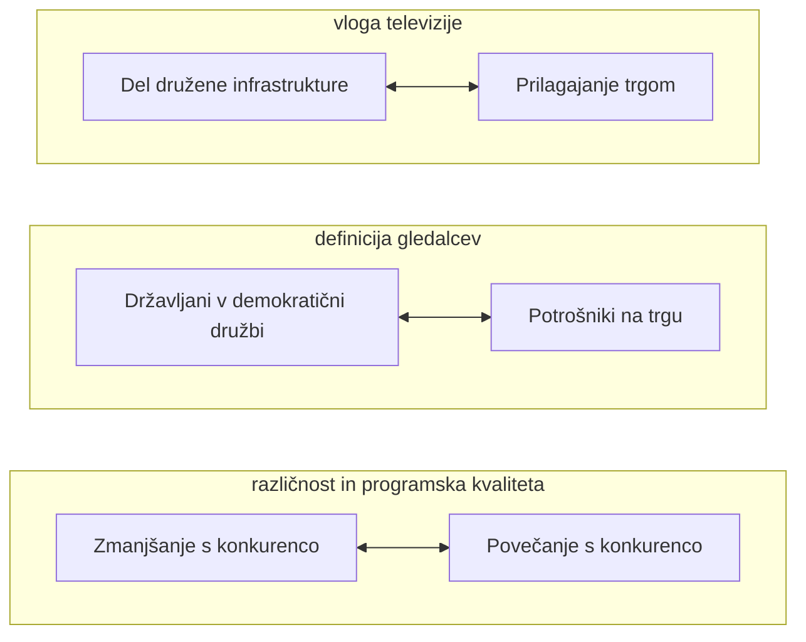

+++
title = "Mediji v družbi"
date = 2023-10-01T07:07:07+01:00
draft = false
math = true
mermaid = true

summary = "Zapiski za predmet Mediji v družbi za zimski semester prvega letnika FERI MK MAGISTERIJ."
summary_enable = true
summary_style = "subtitle"
+++

## Mediji, platforme in poslanstvo medijev

Ta predmet je nekakšna nadgradnja predmeta Mediji in demokracija. Vsebina predmeta zajema: medije, politično komuniciranje, družbene institucije, javnost, državljana in ideologijo v družbenem komuniciranju.

- **Mediji** - kaj je medij, zakaj ne rečemo nečemu medij, ampak platforma, razlika med kanalom.
- **Politično komuniciranje**
- **Družbene institucije** - kaj nečemu daje lastnost institucije.
- **Javnost** - so naslovniki našega sporočila, ko se nekomu obračamo s sporočilom.
- **Državljan** - kakšna so pričakovanja državljanov, potrošnikov.
- **Ideologija v družbenem komuniciranju**

### Medij in platforma - razlika

**Medij** se nanaša na organizacijo ali institucijo, ki ustvarja, zbira, obdeluje in distribuira vsebine, kot so novice, članki, slike, avdio in video posnetki ter druge medijske vsebine. Medijske organizacije, kot so televizije, radijske postaje, časopisi, revije in spletni portali, imajo običajno urejen proces ustvarjanja in distribucije vsebin ter opravljajo novinarsko delo.

**Platforma** pa se nanaša na tehnično infrastrukturo ali sistem, ki omogoča interakcijo med različnimi uporabniki, ustvarjalci vsebin in njihovo ciljno publiko. Te platforme ponujajo prostor za gostovanje, deljenje in dostop do vsebin, vendar običajno ne ustvarjajo lastnih vsebin. Primeri platform vključujejo družabna omrežja, video delitvene storitve, blogerske platforme in podobno.

**Razlika**: glavna razlika med medijem in platformo je v tem, da medij običajno ustvarja lastne vsebine in opravlja novinarsko delo, medtem ko platforma ponuja prostor za gostovanje in deljenje vsebin, ki jih ustvarjajo drugi. Medijske organizacije pogosto uporabljajo različne platforme za distribucijo svojih vsebin, kar omogoča širši dostop do občinstva.

### Teme predmeta

- Medijske institucije v družbenem razvoju.
- Politično komuniciranje v lokalnem in globalnem okolju.
- Identiteta: spol, rasno in nacionalna identiteta.
- Družbene skupine in sloji: depriviligirane družbene skupine.
- Družbena odgovornost v množičnih medijih.
- Etične dileme v medijih.
- Tehnologija in globalizacija.

**Medijske institucije v družbenem razvoju** - medij preko nekih določenih platform, medij kot institucija. Zakaj nečemu rečemo, da je institucija?

**Politično komuniciranje v lokalnem in globalnem okolju** - kakšne so značilnosti vsakega?

**Identiteta, spol, rasno in nacionalna identiteta** - kaj je medijski (televizijski) produkt? Film, oglas, televizijski prispevek. Medijski produkti vplivajo na to, kako doživljamo sebe. Filmi, serije, ki jih gledamo, se zaznamujejo v medijski prostor in občinstvu, in vidimo sebe v vsebinah, ki jih spremljamo. Ene risanke, ki so bile aktualne pred 20 leti, danes več niso tako aktualne. V današnji luči nekatere vsebine več niso primerne, npr. zaradi rase, spola - npr. rasistični heci v Tomu in Jerryju.

**Družbene skupine in sloji** - so predstavljeni v širši komunikaciji, nekaj nas lahko nagovori preko filma, spletnih vsebin, oglasov.

**Etične dileme v medijih** - če mi naredimo neko vsebino na YouTubu, smo dokaj svobodni. Pri članku za 24ur pa moramo biti bolj odgovorni - v medijskih hišah avtorji, novinarji nosijo določeno odgovornost. Kakšna pa je naša odgovornost, ko tržimo nekaj za družbeno omrežje?

Kaj nam je prinesla globalizacija, kaj pomeni globalizacija znotraj medijskih produkcij, v odnosu do občinstva? Katere so globalne medijske hiše? Sky News, Al Jazeera, BBC News, CNN. Kateri je bil prvi javni RTV servis nasploh? BBC. Kdo so javni servisi v Sloveniji? Lokalna televizija Slovenija. Kateri je bil prvi javni RTV servis v Evropi?

### Kako definiramo medij?

Po SSKJ je medij komunikacijsko sredstvo, zlasti časopisje, radio in televizija, namenjeno informiranju širše javnosti.

Če povzamemo, se mediji nanašajo na široko paleto komunikacijskih kanalov, ki javnosti posredujejo informacije in zabavo, vključno s tiskanimi, televizijskimi in digitalnimi platformami.

### Kakšno poslanstvo naj nosi medij?

Poslanstvo medija je služenje javnosti, sledenje lastni integriteti, ponujanje informacij in novic potrošnikom ter posredovanje verodostojnih informacij v komuniciranju. Zagotavljanje kakovostnih informativnih, izobraževalnih in razvedrilnih vsebin. Prav tako globalnim spletnim platformam in vplivnikom ni treba poskrbeti za preverjanje dejstev, upoštevanje različnih mnenj ter za posredovanje verodostojnih informacij, kar ostaja glavno poslanstvo javnih medijev.

Skratka, glavno poslanstvo medijev je zagotavljanje informacij, novic, zabave in tudi nadzor nad vlado, institucijami in drugimi akterji v družbi, oblikovanje javnega mnenja in spodbujanje boljšega razumevanja sveta ter spodbujanje kritičnega in obveščenega državljanstva.

### Ali moram poslušalcu/gledalcu ponuditi to, kar si sam želi?

Ne, moramo poskrbeti za dobro širše družbe in ponuditi raznoliko paleto vsebine, ki je v skladu z javnim interesom.

Paleto vsebine morate občinstvu ponuditi tudi glede na to, kar hoče, odvisno od vaših ciljev kot medijskega ustvarjalca ali producenta. Medtem ko je pomembno razumeti potrebe in želje občinstva, je pomembno upoštevati tudi lastne vrednote, etiko in poslanstvo organizacije.

### Kako doseči večjo programsko raznolikost?

Prevzete oddaje prilagodimo lokalni skupnosti, da s tem poskrbimo za bolj heterogen program.

---

## Mediji kot institucija

Javnost ima do medijev določena pričakovanja - da delujejo v skladu z normami družbe. Mediji nosijo posebno poslanstvo, so predmet regulacije in zakonodaje, v ospredju pa je tudi javni interes - da mediji služijo javnosti (medij ima torej posebno vlogo).

Medijske institucije se spreminjajo, te spremembe pa temeljijo na različnih vidikih: so družbene (spreminjala se je vloga medijev), politične (nastanek nadnacionalnih skupnosti, držav; mediji so tudi globalne institucije) in tehnološke (raven produkcije in konzumpcije). Spreminja se tudi razumevanje "nacionalne" javnosti (mediji v odnosu do skupnosti v nekem nacionalnem okolju) - vprašanje je, kaj je nacionalna javnost za medije - je povezana z okoljem ali identiteto?

Medij kot institucija se nanaša na organiziran sistem ali entiteto, ki ima vlogo posrednika pri prenosu informacij, novic, zabave ali drugih vsebin med ustvarjalci vsebin in ciljno publiko. Mediji so ključni igralci v družbi, saj oblikujejo javno mnenje, informirajo ljudi o dogodkih in ustvarjajo platforme za izražanje različnih stališč.

### Značilnosti medijskih institucij

Nekatere ključne značilnosti medijskih institucij vključujejo:

- **Proizvodnja in distribucija vsebin** - mediji proizvajajo in distribuirajo različne vrste vsebin, kot so novice, članki, fotografije, video posnetki, radio oddaje, filmi, in druge oblike zabave.
- **Posredovanje informacij** - mediji delujejo kot posredniki informacij med dogodki in javnostjo. Njihova naloga je zagotoviti ažurne, točne in relevantne informacije.
- **Ustvarjanje javnega mnenja** - mediji lahko vplivajo na oblikovanje javnega mnenja s tem, kako poročajo o določenih temah ali dogodkih.
- **Platforma za izražanje** - medijske institucije zagotavljajo prostor za izražanje različnih stališč, idej in mnenj, kar je ključnega pomena za demokratično družbo.
- **Oglaševanje** - oglaševanje je pomemben del medijske industrije, saj omogoča financiranje medijskih vsebin in storitev.
- **Profesionalne etične smernice** - medijske institucije pogosto sledijo določenim profesionalnim etičnim smernicam in standardom, ki zagotavljajo kakovostno novinarstvo ter spoštovanje zasebnosti in integritete posameznikov.

Pomembno je poudariti, da medijske institucije igrajo ključno vlogo pri oblikovanju družbenega dialoga in so odgovorne za ravnanje z informacijami na etičen in odgovoren način.

Medijska institucija se nanaša na posamezno organizacijo ali entiteto znotraj širšega medijskega sistema. Medtem ko medijski sistem opisuje celoten okvir, ki zajema vse organizacije, tehnologije, zakonodajo in druge elemente, medijska institucija osredotoča na posamezno enoto znotraj tega sistema. Medijska institucija je lahko na primer posamezna televizijska postaja, radijska postaja, časopisna hiša, spletni portal ali druga organizacija, ki ustvarja, obdeluje ali distribuira medijske vsebine. Vsaka od teh institucij ima svoje specifične značilnosti, vključno z lastnim načinom delovanja, novinarskimi standardi, ciljno publiko in poslovnimi modeli.

Pomembno je razumeti, da so medijske institucije gradniki medijskega sistema. Skupaj sestavljajo medijsko krajino in so odgovorne za ustvarjanje vsebin ter vzdrževanje določenega medijskega okolja. Na ravni medijske institucije se lahko analizira lastništvo, uredniško politiko, profesionalne standarde in druge specifične vidike delovanja določene medijske organizacije.

### Medij kot institucija (upravljanje TV, SŽF)

Izhajamo iz tega, da medijska institucija odseva mnenje celotne javnosti - delovanje medijskih institucij je odsev pričakovanja celotne javnosti, pa tudi odsev pričakovanja drugih družbenih institucij. Mediji ponujajo tisto, kar si javnost želi, kar pa je dvorezen meč - ali si javnost želi, ali pa oni sooblikujejo okuse. Mediji so povezani z različnimi družbenimi skupinami (javnostjo).

> **Primer**
>
> Osamosvojitev Slovenije - bile so različne politične spremembe in medijska sporočila so začutila medijsko okolje. Medijske institucije s pomočjo različnih medijskih sporočil kreirajo neko javno mnenje in v vseh različnih obdobjih odslikavajo tisto, kar družbeno okolje odraža v danem času. Nekaj je bilo nekdaj v medijskem sporočilu neprimerno, npr. LGBT, zaradi nekih sprememb in ozaveščanja v družbi. Danes pa je to dosti bolj sprejeto.
>
> Poleg medijskih institucij imamo tudi druge institucije, torej tudi šolske, politiko itd.

---

## Demokratična participacija in mediji

Novi mediji in participacija v demokratičnih procesih - demokratičen pomen se kaže z novimi mediji v participaciji.

### Vprašanja regulacije medijev v javnem interesu

Medijski diskurz se spreminja - npr. nekatere reklame in risanke, ki so bile nekdaj primerne, danes niso več primerne. Npr. da so nekdaj pralni prašek oglaševali tako, da je ženska prala perilo, ker je bilo to žensko opravilo. Podobno velja za družbene spremembe v okviru migracij - danes smo bolj globalizirani, kot pred 30 leti. Morda se nam zdi daleč to, kar je danes v Izraelu zaradi vojne, ampak po drugi strani zaradi globalizacije, potovanj, migracij, ekonomskega trga, kar je danes enostavno, je pa kar blizu in tudi na nas lahko vpliva - npr. v smislu izobraževanja (Erasmus), z ekonomskega vidika zaradi vojne se nek potencialni trg zruši in se tudi to občuti, prav tako tudi uvoz/izvoz nekih izdelkov. Mediji so tudi del političnih sprememb. Tehnološke spremembe so izjemno zaznamovale medijski svet - imamo lahko nove načine posredovanja medijskih vsebin, vendar medijske vsebine v svojem bistvu so se lahko kar spremenile.

Za nas je pomembna informacija tista, ki se je zgodila sredi Mariborskega trga, sredi Ljubljane, ali dogodek v New Yorku? Za nas bi bil najbližji verjetno dogodek najbližje blizu nas, torej Mariborski trg - informacije na lokalnem območju, npr. vreme. Nekaj, kar se dogaja v nacionalnem okolju, je pomembno, ampak smo mi s tem malo povezani - regionalno in nacionalno okolje je za nas precej v zraku. Moramo dobiti precej razlag, zakaj je to za nas pomembno. Npr. študentski protest sredi Ljubljane bi bil za nas pomemben, ker smo del te skupnosti. Na drugi strani protest upokojencev sredi Maribora bi bil pa za nas pomemben, ker bi nekaj mogli izvedeti o avtom prek tega mogoče.

Kdaj je nekaj javnost? Je skupnost ljudi, zbranih v pošiljateljevem dojemanju nekega sporočila. Neka skupina postane javnost, ko postanejo naslovniki nekega našega sporočila. Ko oblikujemo neko sporočilo, prispevek, oglas, si producenti, ustvarjalci predstavljajo, kdo je občinstvo, in to občinstvo postane javnost v glavi producenta.

Mediji so razumljeni v sklopu širših problemov:

- **Družbene** spremembe
- **Politične** spremembe - *spremembe prispevale k drugačnemu razmerju.*
- **Tehnološke** spremembe - *na področju prenosa informacij predvsem.*
- **"Nacionalna" javnost** - *še vedno je vprašanje neko.*

### Prejšnji regulatorni model

Prejšnji/stari regulatorni model se je razvil v drugačnih pogojih: industrializacija, demokratizacija, oblikovanje nacionalnih držav, medijski model (one-to-many) ustrezen za aktualno okolje.

Zgodilo se je zaradi industrializacije, ki je pomenila, da se je spremenil naš način bivanja, potrošnje in delovanja. Demokratizacija - v zadnjih 30 letih so se različna okolja, države začele odpirati v smislu nekih demokratičnih sprememb. Demokratizacija je prinesla kar nekaj sprememb in oblikovanja držav. Vsaka regulacija se sprejema na nacionalni ravni in predvideva, kakšni so cilji države, ki jih želi regulacija spremljati.

One-to-many je bil ustrezen za določeno obdobje. Ta stari model je pripeljal do nekih idealov, ki so oblikovali nek medijski model. Ideal družbe je, da imamo medij, ki sledi potrebam, ki jih družba ima. Obstajajo določene potrebe, ki jih trg enostavno ne zadovolji - če pustimo vse medijske vsebine trgu, določene vsebine ostanejo spregledane.

- **Industrializacija** - *razvoj izjemno hitrega tempa.*
- **Demokratizacija** - *odpirala se je družba, odprti trgi, ki so bili svobodni.*
- **Oblikovanje nacionalnih držav** - *npr. Slovenija - mediji so imeli ob osamosvojitvi drugačno podobo.*
- **Medijski model (one-to-many)** ustrezen za aktualno okolje - *medijski model za aktualno okolje.*

Stari model je pripeljal do idealov/modelov: javni servis, nepristranskost, univerzalnost dostopa, nacionalni interes za radiotelevizijo in telekomunikacije.

Stari model je pripeljal do javnega televizijskega servisa. Ideal nepristranskosti je zahteval neko regulacijo, da imamo vsebine, ki sledijo nekim idealom, da bi imeli vsi v družbi dostop do nekih vsebin, ne glede na njihov socialni, zdravstveni status, geografske bariere - to daje univerzalnost dostopa.

### Spremembe

Spremembe: multikulturnost, globalizacija. Kaj je univerzalna ideja v radioteleviziji? Kaj je nacionalni interes? Elitistične ideje: kaj je dobro za večino?

- **Multikulturnost** - *iz razkroja v razcvet, sledili in spodbujali so jo.*
- **Globalizacija** - *še veliko bolj v vzponu zaradi medijev.*

Spremembe, ki so se zgodile, so nas pripeljale v družbo globalizacije in seveda medijske hiše se morajo odzvati na te spremembe. To pomeni, da se zavedajo vloge v globalnem svetu in svetu, ki bi rad sožitje različnih kultur. Kako pa to idejo preoblikovati v medijske vsebine? V raznolikem svetu in različnih interesih, ki jih imamo, najti nek univerzalni interes zanimiv za vse - ampak imamo vsebine in stvari in interese, ki so različni za vsakega. Kako oblikovati vsebino, ki bo imela neko univerzalno idejo?

**Kaj je nacionalni interes?** Ali je to, da ščitimo državo, ali da ščitimo resnicoljubnost državljanov? Kaj je prej - interes države ali interes posameznika (naša pravica do verodostojne informacije)? Ta dilema je med tem, da če medij dobi informacijo, ki bi posredno škodila državi, bi državi kot neki skupnosti (politični) škodilo, in ne bi posredovali javnosti, ali pa bi jo posredovali javnosti? Ali je tu v prednosti to od države ali resnica posameznikov?

Mi imamo v globalnem okolju veliko žvižgačev, ki ne ščitijo države kot skupnosti, ampak bi radi povedali resnico državljanom, takšna kot je. Npr. ali je pametno ljudem posredovati neke informacije, če so resnice npr., da so ne-zemljani med nami.

### Novi mediji in državljanstvo

Novi mediji in državljanstvo: učinkovitost novih medijev, potencial novih medijev, interaktivnost, svoboda pri odstranjevanju časovnih ovir.

Še vedno nekdo odloči, kaj je informacija. Portali, družbena omrežja vzamejo le majhen del in oni odločijo, kaj je tisto, kar je dobro za večino, in kako izbrati informacije. Kdo mora odločiti? Ali je prav, da kdo to za nas odloči? Mediji izberejo iz selekcije vsebino in interpretirajo - ali pri medijih nekdo odloča, kaj dati na splet in na portal.

Npr. za vojno v Izraelu smo dobili informacije prek družbenih omrežij, npr. Facebook, TikTok, Twitter. Te informacije pa so bile od medijskih institucij, kot tudi od navadnih ljudi. Ko smo zvedeli za to informacijo o vojni, je še zmeraj nekdo, ki filtrira informacije za nas - in kako filtrira te informacije za nas? Obstaja neka skupina ljudi, ki posreduje informacije, ki bi bile "dobre" za nas.

Hitro dobimo vprašanje, kakšna pa je učinkovitost nekih novih medijev. Potencial današnjih družbenih medijev in interaktivnosti je super. Zavedamo se, da novi mediji omogočajo veliko poti in neko podporo demokraciji in državljanstvu.

- **Učinkovitost novih medijev**
- **Potencial novih medijev** *(vključevanje, interaktivnost)*
- **Interaktivnost**
- **Svoboda pri odstranjevanju časovnih ovir** *(časovni in geografski vidik nista relevantna)*

### Podpora demokraciji preko novih medijev

#### 1. Omogočanje informacij (dostop do informacij)

- Državljani **potrebujejo** informacije za sodelovanje v **političnem procesu**.
- **Cenejši dostop** do informacij.
- **Odstranitev ovir**.
- Družbe postajajo vse bolj **kompleksne**, interesi/potrebe državljanov vse bolj fragmentirani.
- Odstranjena **selekcija informacij**.
- **Agenda-setting** (zmanjšana v primerjavi s konvencionalnimi mediji).

Informacije so pomembne po tem, kako in čemu sodelovati političnemu sistemu. Tukaj je lažji in cenejši dostop do nekih informacij, čeprav naš čas je strošek - družbena omrežja prodajajo naš čas in pozornost, in kot državljan se zavedamo, da smo dragoceno blago.

Odstranitev različnih ovir, npr. nekih geografskih. Odprtost nekih javnih institucij naslavlja problem - vrata so odprta in govorimo o nekih digitalnih dostopih. Potrebe državljanov so bolj fragmentirane - ali so naše ciljne javnosti večje ali manjše, ali je več ali manj uporabnikov, gledalcev določenih storitev? Načeloma jih je manj, ker je več portalov, tv programov, platform, omrežij, ki poskušajo čim bolj naslavljati naše potrebe, in ker izbiramo različne vsebine, poskušajo vse njih zastopati. Zanimanj in interesov imamo ljudje polno in so različni. Novi mediji bi naj odstranili selekcijo informacij in bi naj bili mi tisti, da zbiramo, kar bi radi želeli - to je npr. Netflix. Ali izberemo nek izdelek, film na osnovi neke ocene?

Zagotovo je selekcija na naši strani, vendar ni celovita. Nekdo za nas postavlja informacije v neki vrstni red. Npr. vojna v Izraelu je bila čez vikend top novica. Nekdo je to za nas postavil v skupek top novic. Podobno kot je bilo nekdaj top novica vojna v Ukrajini - prve informacije so nas presenetile, dotaknile, prizadele, danes pa vidimo le še zelo malo teh informacij o vojni v Ukrajini. Ideja novih medijev pa je, da mi izberemo vrstni red in kaj je za nas pomembno. So pa nevarnosti - nek quality kontrol. Če je nekih lažnih novic veliko in kakovost vsebin, kdo prepozna in ali mi verjamemo in vemo, če imamo dostop do kakovostnih vsebin.

- *Mehanizmi za "quality control"*
- *Verodostojnost in točnost informacij*
- *Moč določenih skupin (diskusije, forumi)*
- *Zaščita potrošnika/uporabnika*
- *Izbor vsebin*

> **Primer: ali so informacije točne in gotove?**
>
> Če smo dobili neko informacijo prek portala 24ur, uredništvo odgovarja za informacije. Npr. da je direktor BBC-ja odstopil in guverner, zaradi napake novinarja. V času vojne je politika na vzhodu prepoznala kemijsko orožje. Politika je prepričevala javnost, da je nevarnost kemijskega orožja in da treba uničiti oporišča. Novinar pa je objavil prispevek, v katerem je citiral strokovnjaka, ki je delal z vlado, ki mu je povedal, da ni dovolj informacij, da gre za kemijsko orožje, ki bi ga tam v vojni posredovali. Novinar je objavil prispevek in v tem prispevku je podal informacije tega vira, da ni dovolj informacij s strani vlade, da res gre za kemijsko orožje. Potem pa se je zgodilo, da so čez nekaj ur našli kemika, ki je dal informacijo, mrtvega. Guverner in direktor so odstopili. Niso dobili toliko virov, da bi lahko potrdili oz. ovrgli neke informacije. Ker niso sledili profesionalnim standardom, ali je informacija resnična, če je kemijsko orožje ja ali ne, so odstopili. Vprašanje, ali je imel novinar dovolj informacij, da je lahko zatrdil dan članek.
>
> Na družbenih omrežjih pa je danes odgovornost zelo siva cona, za razliko od teh medijskih hiš, kjer je uredništvo odgovorno.
>
> V kolikšni meri je moč tako izrazita, da lahko zamegli neko verodostojnost in točnost in zaščito potrošnika uporabnika, ali je potrošnik zaščiten? Če je nekaj objavljeno na RTV, imamo pravico do popravka, da se mora uredništvo z medij opravičiti oz. dostaviti verodostojne informacije. Zaščita potrošnika uporabnika je omejena. Izbor vsebin je, kar je super, da mi lahko izbiramo vsebine. Smo pa mi le en majhen delež uporabnikov, ki smo kritični do vsebin, na drugi strani kaki starejši so zelo nekritični do nekih informacij. Imamo mogoče mladi več razumevanja za neke stvari, kako delujejo.

#### 2. Ozaveščanje

Če imamo dostop do profilov ministrov, predsednikov, imamo mogoče občutek moči, da jim lahko nekaj posredujemo.

- Povezava med **demokratično komunikacijo** in **družbenim učenjem**.
- **Diskusijske skupine** ponujajo **prostor** za ozaveščanje (odstranjene časovne in prostorske ovire in poceni) (primeri različnih posamičnih tem, ki zanimajo državljana).
- **Direktna povezava** med državljani in politiki, uradniki...

*Vprašanje relevantnosti tem v diskusijskih skupinah, verodostojnost, nizka stopnja odgovornosti politikov/uradnikov, da predstavijo probleme državljanov.* Moramo pa se zavedati relevantnosti tem neke skupine.

Vprašanje verodostojnosti: ali verjamemo sporočilu oz. informaciji, ki nam je bila posredovana? Nizka stopnja odgovornosti: o nizki stopnji lahko govorimo, ko so koraki do državljanov vsečni.

#### 3. Oblikovanje (formiranje) želja

- Oblikovanje ekstremnih želja, ki ne prispevajo k dobrobiti družbe.
- Povezava med virtualno identiteto uporabnikov in realno identiteto je nejasna (v okviru regulacije, razvoj občinstva).

**Nevarnosti**: oblikovanje ekstremnih želja. Meja med virtualnim in resničnim okoljem je tudi tanka in nejasna.

> **Primer**
>
> Lani v Srbiji je deček, ki je poklical šolo (in grozil z napadom). Postavil vprašanja o digitalni identiteti, kaj nam omogoča digitalno okolje. Obstajajo neke nevarnosti - ene stvari, ki jih povemo v živo, bomo npr. pomislili dvakrat, kot pa ko smo v digitalnem svetu.

### Ključni problemi pri podpori demokracije preko novih medijev

Ključni problemi, ki jih razumemo pri nekem aktivnem državljanstvu, ki soustvarja demokracijo pri novih medijih:

1. **Pristranskost**
2. **Regulacija** - regulacija, ki je površna.
3. **Dostop** - vprašanje dostopa - ali imamo enako mero dostopa do določenih skupin in aktivnosti?

### Zakaj državljani v sodobni družbi želijo sodelovati/komunicirati drug z drugim?

- **Homo politicus** (koncept, po katerem on/ona prostovoljno sodeluje z drugimi, javno zadovoljevanje splošnega dobra).
- **Državljani (mediji)**
- **Potreba po tehnološkem napredku** (temelji na sodelovanju posameznikov v družbi).

Temeljna ideja homopolitikusa - ideja izhaja iz koncepta oz. razumevanja, da vsak posameznik želi funkcionirati v nekem okolju zaradi nekega splošnega dobra. Ta ideja je postala skozi leta mogoče malo manj jasna. Ne moremo pa mimo tega, da komuniciramo kot deli skupnosti in zadovoljujemo splošno dobro. Ideja družbe temelji na tem, da želimo kreirati okolje za splošno dobro.

Državljani moramo, da se bomo opredelili do nekih problemov, da bomo šli na volitve - zato želimo tudi komunicirati.

Potreba po tehnološkem napredku: sodelovanje temelji na komuniciranju. Brez komunikacije družba ne deluje, in mediji so tisti, ki imajo največjo moč komuniciranja zaradi njihove težnje po množičnem sporočanju.

**Vprašanje demokracije preko novih medijev**: kako zagotoviti nepristranskost, kako regulirati to okolje, kako omogočiti dostop.

Komuniciranje je temeljna podlaga za družben razvoj - v največji meri nam ga želijo omogočati mediji, ki pa so omejeni s poslanstvom javnega interesa.

*Vprašanje regulacije - kako sledijo tudi kodeksom, problem so informacijski mehurčki, saj ne dobijo dveh pogledov. Vloga medijev je drugačna, saj si državljani želijo sodelovati z namenom javnega dobra.*

---

## Medijski sistemi

Izhodišče poglavja je delo Hallina in Mancinija (*Comparing Media Systems*), pa tudi Gurevitch in Curran (*Mass Media and Society*, 2005). Študije medijev iz ZDA izhajajo iz pristopa razumevanja medijev iz nekega komercialnega sveta, v katerega se vključujejo. Britanci imajo poseben pogled na medije - mediji naj bi imeli neko posebno vlogo v družbi.

Zakaj mediji služijo različnim ciljem in se pojavljajo v različnih oblikah v različnih državah?

**Medijski sistem** je kompleksen okvir organizacij, institucij, zakonodaje, tehnologije in drugih elementov, ki sodelujejo pri proizvodnji, distribuciji in konzumiranju medijskih vsebin v določeni družbi. Ta sistem ima ključno vlogo pri oblikovanju medijske krajine in vpliva na to, kako ljudje dostopajo do informacij ter kako se oblikuje javno mnenje.

Medijski sistem vključuje več ključnih komponent:

- **Medijske organizacije** - to so podjetja ali institucije, ki ustvarjajo, obdelujejo in distribuirajo medijske vsebine. Sem spadajo televizije, radijske postaje, tiskani mediji, spletni portali in druge medijske platforme.
- **Novinarstvo in urejanje** - novinarji in uredniki so ključni akterji v medijskem sistemu. Skrbijo za zbiranje, preverjanje in predstavljanje informacij v obliki novic ter oblikujejo medijsko vsebino.
- **Lastništvo** - vprašanje lastništva medijskih organizacij je ključno. Koncentracija lastništva lahko vpliva na pluralnost in raznolikost medijskega pokrajine.
- **Zakonodaja in regulacija** - državna zakonodaja in regulacija igrata vlogo pri določanju pravil in standardov, ki jih morajo medijske organizacije upoštevati. To vključuje etične smernice, zakone o varovanju zasebnosti, zakone o svobodi tiska in podobno.
- **Tehnologija** - razvoj tehnologije močno vpliva na medijski sistem. Spletni mediji, družabna omrežja, digitalno oddajanje in druge tehnološke inovacije spreminjajo način, kako ljudje dostopajo do medijskih vsebin.
- **Avdienco** - medijski sistem je odvisen od občinstva, ki porablja medijske vsebine. Spremembe v obnašanju potrošnikov in demografske spremembe vplivajo na uspeh medijskih organizacij.

Skupaj tvorijo medijski ekosistem, ki ima pomemben vpliv na oblikovanje informacijskega prostora in družbene dinamike v določeni skupnosti ali družbi. Razumevanje medijskega sistema je ključno za analizo vpliva medijev na družbo.

Ko mi obravnavamo medijski sistem oz. oblikujemo medijski model odznotraj medijskega sistema, se zavedamo, da mediji služijo različnim namenom in so v različnih oblikah. Mediji služijo različnim ciljem glede na politično, kulturno in finančno stanje države. Tudi v zgodovini so mediji služili različnim ciljem - mediji so del okolja, v katerem bivajo, in četudi jih poskušamo obravnavati in preučevati ločeno, so okuženi od sistema in okolja, v katerem delujejo. Zrcalijo razumevanje sveta, kot ga vidi družba. Vprašanje politične korekcije je danes popolnoma drugačna, kot je bila 20 let nazaj - nekatere vsebine, ki so bile nekdaj odprto gledane, so danes lahko nedopustne, se gleda na njih slabo z drugačnim razumevanjem, in podobno velja tudi obratno.

- Sistem pravil, kako v odnosu do drugih medijskih institucij delujejo medijske organizacije.
- Medijski sistemi so v različnih državah v različnih oblikah - odvisni so od svojega širšega družbenega okolja, niso statične tvorbe, spreminjajo se tudi skozi čas, vplivajo tudi zgodovinske okoliščine.
- Watergate - povezanost medijskih organizacij in političnih institucij; kaj je javni interes?/nacionalna varnost?

*Obstajajo neki skupni cilji, ki jih želijo mediji doseči. V drugačnih družbenih kontekstih so drugačni odnosi. Niso statične tvorbe - družbena stanja se zrcalijo na medije, zgodovinska, časovna in družbena perspektiva vplivajo na medije. Različne države - različen vpliv na medije, ker so zaznamovane z različnimi vidiki.*

Smo danes bolj politično korektni? Če omenjamo določene skupine in rase, smo danes bolj previdni. Stanje politične korekcije je šlo daleč, smo bolj pazljivi. Podobno s spolom. V različnih časovnih okoljih se mediji pojavljajo in služijo tem ciljem. Mediji zrcalijo ta vidik. Nekaj je bilo nekdaj dostopno, nekaj ne, in danes obratno - npr. LGBT, reprezentacija črncev.

Medijski sistemi niso statične tvorbe; spreminjajo se skozi čas. Mediji služijo različnim ciljem, prav tako so pa v različnem časovnem okolju - naša pričakovanja kot občinstvo se spreminja. Imamo medije, ki oblikujejo prostor in čas, v katerem bivajo. Težko jih je umestiti v neke sisteme. Kljub temu pa se je to tudi poskusilo.

### Dimenzije medijskih sistemov

Ena raziskava med državami je postavila nekaj dimenzij, ki določajo, kako vidimo medijski model znotraj medijskega sistema. Na tak način so poskušali poiskati skupne točke medijem. Trije vidiki so: razvoj množičnih medijev, novinarski profesionalizem in vloga države.

#### 1. Razvoj množičnih medijev

Ta dimenzija zajema razlike v nakladah, zgodovino tiska, vlogo tiska v političnem in družbenem življenju ter množični/elitni tisk.

Drug vidik je zgodovina tiska - čemu se je tisk razvil, kaj je potreboval, da smo prišli do tega, da je tisk postal relevanten in vsakdanji. V določenih državah so mediji imeli vpliv pri družbenih in državnih spremembah, npr. Zedinjena Slovenija - gibanja so bila obravnavana in prepoznana v medijih. Pomembna razlika je med državami, ali so medije jemali nekaj, kar je množično, ali elitno. V Evropi se je medije v zgodovini prepoznalo kot nekaj elitnega.

**Pismenost, razvitost okolja - gospodarstva** (pojavijo se razlike v nakladah):

- Zgodovina tiska izhaja iz različnih potreb v družbi - tisk je odigral neko vlogo.
- Razvil se je iz političnih idej (Evropa) ali kot odziv na zahteve trga (ZDA) - razlika med množičnim (potreba po širitvi trga) in elitnim tiskom (vezan na ideje, razsvetljenstvo, izobraženstvo).

Naklade - konkurenca ima različne teme, odvisno od št. naroda; manjši je trg, manjše so možnosti za vzpostavljanje izvrstne produkcijske poti - to vpliva na naklado. Zgodovina tiska - nastajal je v različnih okoljih, okoliščine vplivajo na širšo družbeno situacijo, ta pa na tisk. Vloga tiska - okoliščine potem vplivajo na vlogo tiska.

#### 2. Politični paralelizem

Ta dimenzija pomeni, da poskušamo ocenjevati, kakšna je povezanost medijske organizacije s politično strukturo (bolj ali manj tesno), kako se strankarski tisk kaže kot odraz političnega paralelizma, ter kakšne so zgodovinske vezi s političnimi strankami.

Razumemo, da so to zelo ločene meje glede delovanja - povezovanje medijev in politike je na eni strani star poročen par, ki ne more en brez drugega. Ali imajo mediji neko pomembno vlogo v strankarskih medijih? Kako so dojeti? Vezi s političnimi strankami - mediji v mnogih državah so povezani s političnimi vejami. V zgodovini so bili določeni mediji pobudniki določenih političnih strank, npr. v zgodovini Slovenije.

- **Povezanost** - povezani so s političnimi akterji, bolj ali manj tesno, kar zaznamuje odnos.
- **Strankarski tisk** - boljše poimenovanje je strankarska občila, pomen je v tem, kako jih dojemamo - kot medije ali kot strankarske akterje. Tukaj gre za razlike med državami. Na koncu je pomembno vprašanje, ali občinstvo prepozna, da gre za takšen tisk.
- **Zgodovinske vezi** - kako intenzivne so, kakšno je razmerje, so mediji nastali iz njih, je šlo zgolj za svojo smer? Kjer je bilo močno politično okolje, so bile močne povezave. Primer: na vzhodu so mediji sodelovali pri odpiranju države - kljub temu niso bili dojeti kot politika, ampak kot svoj akter.

- strankarski mediji - bolje, da vemo njihovo naklonjenost, lastništvo stranke, orientacijo... še ne pomeni, da so informacije manj korektne - temelj vsem so profesionalni novinarski standardi (nekaj drugega je rubrika komentarji).
- zgodovinske vezi s političnimi strankami.

#### 3. Novinarski profesionalizem

Ta dimenzija zajema stopnjo, do katere novinarji uživajo avtonomijo pri svojem delovanju, stopnjo, do katere so lahko razvili določene norme in standarde delovanja, ki so ločeni od drugih družbenih področij, in stopnjo, do katere novinarji vidijo sebe in kot jih vidi družba, kot "watch dog" - koliko služijo interesom javnosti.

To pomeni, da četudi v nekih idealnih razmerah razumemo, da so novinarji neodvisni, avtonomni, da jih sistemi ščitijo, da imajo avtonomnost, je vendarle to dostikrat veljavno samo na papirju, ne v praksi. V nekaterih državah je avtonomnost višja, pri nekaterih pa ne. Če pogledamo neko javno televizijo - zagotovo so take institucije izjemno pomembne za medijski prostor, in če se zavedamo, da je potrebno plačevati naročnino za te medije, bo nekdo še vedno določal, kakšna bo avtorska struktura, koliko bo naročnina. V parlamentarnem sistemu kdo in na kak način imenuje generalne direktorje RTV Slovenije? Ali ima tu parlament kakšno besedo vsaj v nekem delu? Zagotovo ima posredno. V večini držav parlamentarnega sistema - odvisno od monarhije. Naj bo imenovanje guvernerjev BBC-ja, sprejemanje zakonodaje, bo imel nek glavni vpliv. V kraljevi monarhiji je to bil npr. kralj. Umetnost, izobraževanje, tudi področje novinarstva znotraj medijev ima določene zakonitosti in kako razvijajo to - v skandinavskih državah so neke stvari bolj pragmatične.

Standardi v novinarstvu so padli, poklic se je razvrednotil zaradi sprememb. Nekdaj je bilo malo mest - da si imel pogovorno oddajo, si rabil polno znanje. Komentatorji na televiziji na določenem področju so potrebovali ogromno izkušenj in znanja. Danes ni več tako. Interes za medijsko delo se je zmanjšal. Eden od razlogov je, da so se standardi znižali, ker je medijev polno, ponudb več, sistemske zahteve in plačilo pa se je znižalo. Raziskovalnega novinarstva več ni - nekdaj, ko si kot novinar delal dokumentarec, se je delalo npr. dolgo. Danes je vlaganje v raziskovanje manjše, težnja je po hitrih informacijah, kot pa verodostojnosti informacij. News room pokaže, kako medijska organizacija dela - če je medijev veliko in se bojujejo za gledalce in oglaševalce, je na strani produkcije ta tekma velika. Novinarji, kako vidijo sebe in kako vidijo drugi? Danes so medijske hiše tekmujejo v družbenih omrežjih in mislijo, da če je dosegla na družbenem omrežju neka informacija dovolj like-ov, je to za njih aktualno. Watch dog - kako mediji koristijo javnosti.

Slaba novica je dobra novica za medije. BBC piše pristransko, mogoče za nekatere, na kar ima vpliv mogoče država, za katero medij dela.

*Avtonomija: slediš javnemu interesu, ne omejuje te nič, razen da ne škodiš drugim. Pomeni neko odgovornost.*
*Norme in standardi: je medijsko okolje in delovanje tako razvito, da so si postavili pravila, ki jim sledijo; nekaj, kar se spodobi, kljub temu da ni zapisano (določene smernice). Organizacije si jih same postavijo.*
*Watch dog: raven posameznika, kako dojemamo medijske ustvarjalce, ki si težko pridobijo zaupanje.*

Profesionalni medijski in novinarski standardi so jasno zapisani - npr. Guardian ima izrazito vlogo, ima kodeks, vsaka hiša v Veliki Britaniji to ima. Nihče ne zahteva, da kodeks imaš. Če novinarji objavijo nekaj, kar ni preverjeno, se pritoži tisti, ki je oškodovan - samo tu kodeks ne igra take vloge. Majhna vloga države, ker je prepuščenost trgu - kaj želi gledat, če so bedarije, bodo bedarije. Odvisno je tudi od zrelosti trga. Visoka stopnja pismenosti - nekaj, kar je bilo pomembno na medijskem trgu v VB, so bili brezplačniki. Tisk je bil brezplačen in to kakovosten tisk, ker je bila potreba po tem. Sama težnja s strani občinstva je, da so tudi pripravljeni. Medijska industrija se je lahko razvijala.

#### 4. Vloga države

Medijski sistemi se močno razlikujejo po vlogi/intervenciji države, prav tako pa se razlikuje finančna podpora elektronskim medijem in tisku (naročnina), ki je zelo različna po državah.

*Nekje cenzurirajo, nekje finančna podpora, čeprav večinoma financirajo samo tisk, da ga ohranijo. Naročnina - drugačna, nekje letna, mesečna...*

- Razlika glede na stopnjo intervencije države (ki nastavi kadre).
- Generalnega direktorja BBC je imenovala kraljica - pomemben videz objektivnosti, nestrankarskosti in apolitičnosti.
- Finančna podpora elektronskim medijem in tisku (naročnina).

Medijski sistemi se razlikujejo glede intervencije države. V določenih državah je regulacija grozna, glede medijskega lastništva, povezave politike, finančne omejitve. Ta vloga je lahko pozitivna, npr. finančna pomoč, lahko pa je slaba, npr. neko omejevanje.

RTV ima oglase in prispevke iz gospodinjstev prebivalcev Slovenije. BBC kot javna televizija ima vir dohodkov oz. financiranje iz naročnine, ki jo imajo vsa gospodinjstva (98 %), 2 % pa komercialno (oglasi, lastne serije).

Imamo dualni sistem, kjer je pomembna vloga radijev, televizij. V Ameriki pa imamo komercialni medijski sistem, kjer javne televizije tudi obstajajo. Ne vidimo javnih televizijskih radijskih sistemov. V Sloveniji smo lastniki javnega servisa Slovenci. V Ameriki pa so nosilci licenc univerze, podjetja. V skandinavskih državah medijskemu sistemu poskušajo pomagati tako, da financirajo tisk preko davkov.

### Trije ključni modeli

Na podlagi teh treh dimenzij (razvoj množičnih medijev, politični paralelizem, novinarski profesionalizem in vloga države) so opredelili tri ključne modele medijskih sistemov, glede na stičišče kulturnih medijev v razvoju, postavljene glede na predhodne kriterije:

1. **Mediteranski ali polariziran pluralistični model** (Francija, Grčija, Italija, Portugalska, Španija) - sem spadajo države Južne Evrope (tudi Slovenija).
2. **Severnoevropski ali demokratično korporacijski model** (Avstrija, Belgija, Danska, Finska, Nemčija, Norveška, Švedska, Švica) - severna in srednja Evropa.
3. **Severnoatlantski ali liberalni model** (VB, ZDA, Kanada, Irska) - Britanija, ZDA, Kanada.

| Dimenzija | Mediteranski model | Severnoevropski model | Severnoatlantski model |
|---|---|---|---|
| Tiskana industrija | nizke naklade, elitistično usmerjen tisk | visoke naklade, zgodnji razvoj množičnega tiska | srednje naklade, zgodnji razvoj komercialnega tiska |
| Politični paralelizem | visok politični paralelizem, komentatorsko usmerjeno novinarstvo | zunanji pluralizem, zgodovinsko močan strankarski tisk, premik k nevtralnemu komercialnemu tisku | nevtralen komercialen tisk, k informacijam usmerjeno novinarstvo, notranji pluralizem (razen v VB) |
| Profesionalizacija | šibkejša profesionalizacija, instrumentalizacija | močna profesionalizacija, institucionalizirana samoregulacija | močna profesionalizacija, neinstitucionalizirana samoregulacija |
| Vloga države | močna intervencija države, subvencije tisku, obdobja cenzure | močna intervencija države, a z zaščito svobode tiska, močan javni servis, subvencije tisku (Skandinavija) | tržno usmerjeno (razen močnega javnega radiotelevizijskega servisa v VB in na Irskem) |

#### Mediteranski model

Katere so značilnosti medijskega trga, ki sodi sem? Tisk se je razvil iz literature, ne iz trga - ni bil namenjen množicam, ampak je bil kot umetnost namenjen samo določenim posvečenim skupinam in posameznikom. Nizka stopnja profesionalizma v novinarstvu - bil je bolj poudarek na ekspresionizmu, manj na profesionalnih standardih. Visoka stopnja paralelizma - povezovanje s strankami, okoljem, ki je imelo ambicije, npr. samostojnost države - to je bilo tesno povezano z idejo, ki jo je razvijal tisk. Močna intervencija države v medijski sektor, npr. glede dodelitve statusov, pravil, medijske regulacije. Nizka avtonomija novinarjev - zakaj je bilo zgodovinsko tako? Cerkev je tu imela moč, država in javnost pa majhno moč in vpliv. Država in Cerkev sta igrali vlogo pri razvoju medijev. Sem sodi Slovenija.

- **Tisk** se je razvil iz **literature**, ne trga.
- **Nizke naklade**, elitistično usmerjen tisk.
- **Nizka** stopnja **profesionalizma** v novinarstvu.
- **Visoka** stopnja **političnega paralelizma**.
- **Močna intervencija države** v medijski sektor.
- **Strankarski tisk** igral **pomembno vlogo**.
- Nizka avtonomija novinarjev.
- **Zgodovinski razlogi medijskega sistema:** vloga Cerkve, močna vloga države in slabotna vloga trga.

*Mediteranski vidik razvoja medijev, kjer so nizke naklade, obdobje nizke pismenosti, tisk je usmerjen elitistično, izjemno nizka stopnja profesionalizma v novinarstvu, vendar visoka stopnja politike. Nizka avtonomija, saj se je razvil iz tiska (pisatelji, pesniki).*

#### Severnoevropski model

Tu je ideja zgodnjega kapitalizma - trgovska središča so igrala pomembno vlogo. Zgodnji razvoj tiska v srednji Evropi je bil zaradi trgovanja, ponudbe blaga in storitev. To je zahtevalo pridobivanje informacij in vzpodbudilo razvoj tiska in pismenosti. Zgodnji razvoj liberalnih gibanj, kot je svoboda tiska. Verska in politična nastanitev - države so bile prisiljene pluralnost sprejeti kot neko dodatno moč.

- Začetki sodobnega tiska v **trgovskih središčih** (Amsterdam, Frankfurt).
- Zgodnji razvoj tiska v severni Evropi zaradi **trgovanja**, ki je zahteval pretok informacij.
- **Višja stopnja pismenosti**.
- Zgodnji razvoj **liberalnih institucij**, kot je svoboda tiska (uradno prvič priznana svoboda tiska na Švedskem, 1766).
- **Verska in politična razdelitev zahtevala razvoj različnih jezikov, ideologij** - prispevek k pluralni družbi. *Razvil se je zaradi trgovanja.*

#### Severnoatlantski model

Tukaj je temeljil razvoj medijev na komercialnih medijih - prvi oglas je bil za pralno milo. Razvoj medijskih vsebin je temeljil na komercialnih dejavnostih. Komercialni tisk se je začel v Ameriki. Dominacija komercialnih medijev je zaznamovala okolje. Nizka stopnja političnega paralelizma - ker je interes konglomeratov, ki so imeli vpliv, politika nima toliko vpliva - ni nekih monopolnih medijskih družb, ki zajemajo en trg. Velika Britanija je v določenih primerih izjema - ima mehanizme, ki bi znižale vpliv politike. Določene aktivnosti, kot je medijska regulacija, medijski nadzor je izrazito centralističen v VB. V Sloveniji imamo več regulatorjev, v VB pa je en regulator, kjer se jih je več združilo pod enega, in odločajo določila za delež lastne produkcije, britanske produkcije, število ponovitev. Prvo sprejmejo kriterije, te pa spremljajo, koliko so bili izpolnjeni. Je tudi raznolikost žanrov pomembna. Zelo veliko z zornega kota elementov je nekih mehanizmov, ki kažejo, da so določila določena. Visoka stopnja profesionalizma je tudi prisotna.

- Zgodnji razvoj **komercialnih medijev**.
- Komercialni tisk začel v **ZDA**, kasneje razvil **radiotelevizijski sistem**, ki je bil izrazito komercialen (prvi manjši PBS v ZDA leta 1967).
- **Dominacija** komercialnih medijev.
- **Nizka** stopnja **političnega paralelizma** (VB v določenih pogledih izjema).
- **Relativno visoka** stopnja novinarskega profesionalizma (čeprav ni tako razvit kot v korporacijskem modelu).
- **Majhna vloga države**.
- **Visoka** stopnja pismenosti, predstavniške politične institucije.
- **Zgodovinsko:** ni aristokratskega nadzora nad umetnostjo in kulturo; izvirata iz trga.

*Amerika se je izjemno hitro razvijala, dominirajo komercialni mediji, majhna vloga države.*

### Medijski sistem v Sloveniji

Med določenimi medijskimi sistemi se pojavljajo tudi podobnosti. Ko medijske sisteme analiziramo, imamo polno držav, ki so vključene v te modele. Upoštevamo politično zgodovino in kulturo, upoštevamo, da so določene politične in zgodovinske poteze vplivale na medije, kakšni so danes.

Kako vidite medijski sistem v Sloveniji? Slovenija spada v prvi medijski sistem oz. mediteranski model.

*Medij kot institucija - kar si moramo prebrat: v odnosu do uporabnikov in širše skupnosti na drugi strani institucije odsevajo tudi druge družbene institucije - zdravstvo, šolstvo... Mediji ne rabijo tako delovat, ampak nemogoče čisto mimo iti.*

---

## Globalizacija in nacionalni medijski sistemi

Globalizacija je nekaj, s čimer se srečujemo v vsakdanjem življenju, čeprav se tega pogosto sploh ne zavedamo.

> **Globalizacija**
>
> Pojem "globalno" obstaja že več kot 400 let, sam pojem "globalizacija" pa se v takšni obliki, kot ga poznamo danes, uporablja šele od zgodnjih 60. let dalje. O konceptu ni enotnega soglasja - pod globalizacijo razumemo transnacionalizacijo kapitalskih trgov, rast nadnacionalnih političnih in ekonomskih organizacij (npr. UNESCO, EU), migracije ter pojav univerzalnih kulturnih in potrošniških vzorcev.

Lep primer globalizacije je izmenjava Erasmus, kjer se študenti iz različnih držav znajdejo na istem mestu, delijo izkušnje in kulturo ter s tem soustvarjajo neko skupno, nadnacionalno izkušnjo. Podoben primer je tudi pojav, ko generacije po vsem svetu odraščajo ob istih vsebinah - na primer risanka Kapitan Gatnik (Captain Underpants), ki jo poznajo otroci na različnih koncih sveta in ustvarja neke vrste skupno generacijsko kulturo, ne glede na to, iz katere države prihajajo.

### Globalizacija kot proces

> **Globalizacija kot proces (Waters, 2001)**
>
> Globalizacija je družbeni proces, v katerem geografske meje izgubljajo pomen v korist ekonomskih, družbenih in kulturnih dogovorov, ljudje pa se vse bolj zavedajo umikanja teh meja in delujejo usklajeno z drugimi.

Globalizacija ni nekaj statičnega, temveč gre za proces, ki se nenehno odvija. Dober primer tega je pandemija, ki je pokazala, kako se lahko soočamo z nadnacionalnimi izzivi, hkrati pa je prinesla tudi nove priložnosti - na primer izvedbo seminarjev in sestankov na daljavo, ki so postali del vsakdana ne glede na to, v kateri državi se udeleženci nahajajo. Globalizacija se kaže tudi na kulturni ravni, na primer pri modi in oblačenju, načinu preživljanja prostega časa ter glasbi.

> **Kulturne implikacije fenomena globalizacije**
>
> Globalizacija prinaša spremembe v družbeno-kulturnem procesu ter v oblikah življenja.

To pomeni, da se spreminjajo tudi vsakdanje prakse in navade - na primer, med pandemijo je prišlo do sprememb pri prodaji določenih izdelkov, saj so se potrošniške navade prilagodile novim razmeram. Podobno globalizacija vpliva na medijsko ponudbo, kjer danes brez težav najdemo korejske serije, japonski anime ali podcaste, ki prihajajo iz povsem drugih kulturnih okolij, prav tako pa vpliva tudi na glasbo, ki jo poslušamo.

O globalizaciji obstajata dva pogleda:

> **"Zahodna dominacija" vs. večsmerni proces**
>
> Prvi pogled globalizacijo razume kot prevladujoč, enosmeren prenos mnenj in vrednot - torej iz zahodnega sveta proti ostalim delom sveta. Drugi pogled pa globalizacijo razume kot večsmeren proces, v katerem kultura ne teče zgolj iz centra proti periferiji, temveč tudi obratno - iz periferije proti centru.

### Učinki globalizacije

> **Učinki globalizacije**
>
> Oslabitev kulturne kohezije znotraj posameznih nacionalnih držav ter decentraliziran in heterogen razvoj kulture.

To pomeni, da se kulturni centri, ki so nekoč veljali za edine relevantne točke ustvarjanja trendov, danes decentralizirajo. London ali MTV sta bila zgodovinsko gledano taka kulturna centra, danes pa se pomen vse bolj seli tudi na manjše skupnosti, ki pridobivajo na relevantnosti in vplivu.

### Kulturna homogenizacija in heterogenizacija

Mediji imajo pomembno vlogo tako pri homogenizaciji kot pri ustvarjanju raznolikih medijskih izkušenj. Kljub globalizaciji pa nacionalna politična ekonomija še vedno igra ključno vlogo pri strukturiranju medijske industrije v posamezni državi.

> **Primer**
>
> Prva licenčna televizijska oddaja v Sloveniji je bila kviz Milijonar, ki ga je vodil Jonas, licenco zanj pa je za visoko ceno kupila Pop TV. Licenčni formati imajo natančno določena pravila - od osvetlitve, gibov in znakov voditelja do trenutkov vključevanja občinstva - poleg tega pa morajo biti prilagojeni (lokalizirani) lokalnemu okolju. Zanimiva je razlika med ameriškimi in evropskimi merili pri izbiri voditeljev: ameriški producenti pogosto izbirajo voditelje predvsem na podlagi videza (na primer pri CNN), medtem ko je pri evropskih producentih bolj v ospredju zaupanje. Znana je anekdota, ko so ameriški producenti zaradi izbire neizkušenega, a atraktivnega voditelja isti sogovornik med intervjujem po pomoti vprašali isto vprašanje dvakrat.

Katere licenčne televizijske formate poznamo? Med njimi so različni kvizi, oddaja Slovenija ima talent ter različne resničnostne oddaje ("reality show" formati).

Homogenizacija pomeni uporabo trendov, ki povezujejo občinstvo - to so ravno licenčni formati.

### Medijski sektor

Elektronski mediji so se v zadnjih desetletjih močno preoblikovali, na kar so vplivali trije ključni dejavniki:

- **Nove distribucijske tehnologije** - razvoj tehnologije je prinesel nove možnosti za distribucijo vsebin.
- **Ekonomski pritisk k liberalizaciji sektorja** - liberalizacija zaradi večje učinkovitosti in pojava globalnih medijskih igralcev.
- **Ideološki premik k neoliberalizmu** - odmik od državnega poseganja v medijski sektor.

Nova tehnologija je prinesla nove priložnosti za ustvarjanje in distribucijo vsebin. Liberalizacija je odpravila številne ovire - na primer nekdanjo zahtevo po britanskem državljanstvu za producente v britanskih medijih. Posledično so nastali globalni igralci, kot je Disney, ki lahko presegajo meje posameznih nacionalnih trgov, kar je pripeljalo tudi do nastanka velikih medijskih konglomeratov, ki lahko postanejo monopolisti. Pop TV je na primer na slovenski trg vstopila leta 1995.

### Nacionalni medijski sistemi

V zadnjem času se ponovno postavlja vprašanje vloge javnih (radijskih in televizijskih) sistemov, hkrati pa poteka tudi deregulacija medijskih sistemov. Postavlja se vprašanje, ali nacionalni javni servis (RTV) sploh še potrebujemo v takšni obliki, kot ga poznamo, glede na to, da platforme, kot je Voyo, prevzemajo vlogo, ki jo je nekoč imel javni servis. Kakšen je torej namen javnega televizijskega servisa? Eno od stališč pravi, naj trg pove, kaj si želimo in kako si to želimo.

---

## Medijski konglomerati, formati in regulacija medijev

### Spremembe k tržno usmerjenim politikam

Medijski sistemi so v zadnjih desetletjih doživeli več sprememb k tržno usmerjenim politikam:

- **Privatizacija ali prodaja komunikacijskih sredstev**
- **Liberalizacija** - torej začetek konkurence obstoječim monopolom na radiotelevizijskem trgu.
- **Korporacijski model delovanja javnih servisov** - primer je BBC. Za primerjavo: v 80. letih je bilo v 17 državah Zahodne Evrope na voljo le 4 komercialnih kanalov, kar kaže, kako zelo se je trg od takrat spremenil - podobne spremembe so kasneje sledile tudi v Srednji in Vzhodni Evropi.

Globalizacijo lahko razumemo kot proces, kjer se geografske meje umikajo na področju družbe, delovanja in kulture. V večini je globalizacija zahodna dominacija, četudi obstaja tudi obraten tok - torej gre za večsmerni proces. Z liberalizacijo trga na njem pridejo tudi drugi, novi akterji, zato se postavlja vprašanje, kako naj javni nacionalni servisi sploh preživijo - odgovor mnogih je sledenje korporacijskemu modelu delovanja.

Med učinke globalizacije štejemo oslabljeno kulturno povezanost ter spremenjeno dojemanje kulturne identitete mladih - proces globalizacije namreč zaznamuje mnogo družbenih okolij (na primer v Ameriki obstajajo zelo različne skupnosti glede na raso, spol ipd.). Globalizacija spreminja odnos med kulturami na način, da se meje med njimi zabrišejo - če želimo ohraniti kulturno identiteto, moramo na tem delati, sicer to namesto nas naredi globalizacija sama. Ali se mladi sploh še zavedajo, od kod izvirajo? To je odvisno od posameznika - nekateri si želijo ohraniti identiteto, drugi gredo raje naprej z globalizacijo in za to ne skrbijo toliko.

Zanimiv pojav so tudi **fandomi** - organizirane skupine oboževalcev, ki med sabo aktivno sodelujejo preko družbenih omrežij in spleta (na primer oboževalci Taylor Swift, ki jih povezuje tako glasba kot spremljanje njenega življenja).

Globalizacija sicer ni vedno slaba - vse se ne dogaja zgolj v enem centru (na primer v Ljubljani in ne v Mariboru), temveč se, če to okolje omogoča, v določenih okoljih vidi tudi vpliv od drugod, kar se kaže v raznolikosti vsebin. Pomembno vlogo pri homogenizaciji igrajo mediji - politična ekonomija namreč določa povezanost znotraj medijske industrije in narekuje trende; dominanten producent na globalni ravni je na primer Disney. Podoben primer povezovanja je tudi Pro Plus - Pop TV je pomemben igralec na slovenskem trgu, njegovo lastništvo pa določa tudi sestrsko podjetje na Hrvaškem.

> **Primer**
>
> BBC vsakih 10 let zapiše t. i. "chart of communication", ki določa način delovanja BBC-ja za določeno obdobje - torej ali in v kakšni obliki nek medij vpliva na določeno vlogo. Vloga BBC-ja je: informiranje; ponujanje vsebin, ki so v javnem pomenu, za razliko od drugih medijev; produkcija dokumentarcev z izobraževalnim namenom; ponujanje vsebin otrokom; zagotavljanje, da ni socialne izključenosti - torej da vse te vsebine dobijo vsi ne glede na socialni status. Prvi direktor BBC-ja je dejal, da je vloga medija izobraževanje in (v nekoliko večji meri) zabava - gre torej za program, ki ga trg sam po sebi ne bi ponudil.

Trend medijskih sistemov kaže na to, da mediji dostavljajo predvsem tisto, kar ljudje želijo, v skladu s tem pa se dogajajo tudi spremembe k tržno usmerjenim politikam - četudi gre za javni servis, njegovo delovanje pogosto vseeno sledi nekim korporacijskim logikam. Pri upravljanju televizije moramo vedeti, da imamo na trgu različne akterje, ki pa ne morejo delovati po povsem enakih pravilih - tako javna televizija kot na primer Pop TV se namreč borita za isti oglaševalski kolač. Javna podjetja imajo pri tem nek kooperacijski vidik delovanja - ko se mediji povezujejo, to sicer prinese učinkovitejšo produkcijo, hkrati pa tudi tveganje nastanka monopolov.

### Medijski konglomerati

> **Medijski konglomerati**
>
> Dostop do velikih trgov (geografsko in kulturno); velika oglaševalska sredstva; dostop do nacionalnih političnih elit.

Medijski konglomerati predstavljajo nekakšno nelegalno konkurenco javnim servisom - imajo dostop do velikih trgov in s tem spreminjajo kulturno okolje tam, kjer naslavljajo svoje občinstvo. Zaradi dostopa do večjih trgov imajo možnost dostopati tudi do oglaševalskih trgov na svetovni ravni, kar jim prinaša večjo medijsko moč, saj imajo gledalce in oglase na globalni ravni. Za nastanek konglomeratov gre torej za dva cilja: dostop do čim večjega trga (večji doseg občinstva pomeni tudi več oglaševalskih sredstev) in dostop do nacionalnih političnih elit, ki so pogosto zainteresirane, da določene vsebine vseeno omejijo.

### Medijski formati

> **Medijski formati**
>
> Razvoj medijskih formatov (soap opere, pogovorne oddaje, kvizi, resničnostne oddaje); pojav formatov hibridne sinteze globalnega in lokalnega (homogenizacija/heterogenizacija).

Vidik medijskih formatov se je zaradi globalizacije in trendov precej spremenil - marsikateri šov ali oddaja je danes pravzaprav produkt globalizacije.

> **Primer**
>
> Prva licenčna oddaja na slovenskem trgu je bila Milijonar. Produkcija je bila draga, vendar se je pričakovala velika gledanost - in izkazala se je za uspešno, saj se še danes razvija naprej. Uspešnost licenčnega formata je odvisna predvsem od tega, ali je upoštevano lokalno medijsko okolje, torej kdo ga dejansko spremlja - če je načrt (izbira voditelja, občinstva in vprašanj) dobro premišljen, formula za lokalno okolje deluje. Ko postavimo na urnik licenčne oddaje, ki nas zaznamujejo na trgu, imamo posledično manj prostora za lastno produkcijo - to zato, ker pri lastni produkciji ni neke že preverjene formule delovanja, ki bi zagotavljala prodajo. Če se oddaja finančno ne izide, jo lahko tudi predčasno prekinejo.

Ni zanemarljivo dejstvo, da tudi globalna licenca oziroma format ne bi deloval, če ne bi imel nekaterih prilagojenih elementov - na primer izbire vprašanj ali občinstva glede na lokalno okolje. Za uspešen produkt je torej pomembna kombinacija lokalnega in globalnega vidika: medijske organizacije in vsebine so na eni strani posledica širših trendov, na drugi strani pa so tudi same del teh razmer in se jim ustrezno prilagajajo (transformirajo). Ker medijske organizacije iščejo ustrezen delež posameznikov, imamo posledično vse več komercialnih vsebin. Posledice v nacionalnem okolju so lahko tako dobre kot slabe - na primer dobre novice in prakse iz tujega okolja - saj ne gre za povsem enosmeren proces.

Skratka: mediji so gonilna sila globalizacije (predvsem zaradi tehnološkega razvoja), hkrati pa so tudi sami transformirani zaradi spremenjenih razmer - to se kaže v komercializaciji, nastanku multimedijskih konglomeratov, novih formatih ter posledicah, ki jih to prinaša v nacionalnem okolju. Gre za tesno povezavo, kjer mediji delujejo kot gonilna sila za globalizacijo, perspektiva globalizacijskih trendov pa se kaže tako v tehnološkem, socialnem, kulturnem kot tudi političnem smislu.

### Splošni razlogi za regulacijo komunikacij

Ko govorimo o medijskih sistemih in trendih, ki jih zaznamujejo, se moramo zavedati, da vsi akterji delujejo v okolju, v katerem veljajo določena pravila in regulacije. Z globalizacijo je vse manj pravil glede tega, kakšna naj bo produkcija, format ali vsebina - na eni strani so se torej postavila pravila, na drugi strani pa se je pojavil trend, zaradi katerega je nazadnje prišlo do deregulacije. Ni samoumevno, da bi določeni akterji, vsebine in organizacije funkcionirali, če bi bili povsem prepuščeni trgu - če želimo funkcionirati v demokratični družbi, kjer se spodbuja svoboda posameznika, moramo postaviti nekatera pravila oziroma omejitve te svobode, saj se zavedamo, da trg sam po sebi ne bi zagotovil demokratičnih pravil - družba namreč ne bi funkcionirala demokratično, če bi jo v celoti prepustili trgu (na primer, ali bi bile vse politične stranke enako predstavljene brez nekih pravil - če pogledamo Pop TV, so lani v studiu zastopanost imele le določene stranke, ne vse).

Razlogi za regulacijo komunikacij so torej:

- **Demokratične, socialne in kulturne potrebe družbe** - če želimo demokracijo, moramo imeti odprte kanale komuniciranja; kulturne potrebe pomenijo svobodo govora na način, da se omogoča razširjanje kulture. Sem spada tudi vključevanje manjšin in vrednot - če pogledamo javno radiotelevizijo, je slovenskih filmov, ki jih gledamo, zelo malo, ker jih je res dobrih malo, a so za razvoj kulturne identitete določene vsebine kljub temu potrebne. Takšne demokratične, kulturne in socialne potrebe se same od sebe ne bi uresničile, če ne bi bilo regulacije.
- **Omogočanje in zaščita svobode izražanja**
- **Omejevanje sovražnega govora / nestrpnosti**
- **Omogočanje pluralizma in raznolikosti vsebin** - pluralizem namreč lahko pomeni tudi to, da imamo 100 kanalov, ki pa vsi govorijo iste, ideološke stvari. V Sloveniji so meje pluralizma precej zabrisane, saj pogosto ne vemo, kdo dejansko financira določen medij. Po ustavi imamo v Sloveniji tudi zahtevo, da moramo vsebino ponuditi tudi za madžarsko in italijansko manjšino.
- **Zaščita pravic ranljivih družbenih skupin** - na primer otrok, starejših ali slušno oviranih; tega ne smemo prepustiti trgu.
- **Zaščita pravic uporabnikov / potrošnikov** - vsebine za mladoletnike (do 18. leta) na primer obstajajo samo zaradi regulacije.
- **Urejanje dostopa do omejenih virov** - vključno s pravico dostopa do javnih informacij.
- **Zagotavljanje tehnične kakovosti** - standardi produkcije so se sicer v zadnjih 10 letih razvoja precej znižali.
- **Omogočanje / varstvo konkurence** - torej antimonopolni zakon, ki preprečuje, da bi kdo imel prevelik tržni delež.
- **Omogočanje gospodarskega razvoja in rasti**

Pri regulaciji gre torej za različne interese - politične, pa tudi interese medijskih institucij, ki stremijo k določeni svobodi delovanja.

### Tipi regulacije

Poznamo tri tipe oziroma vrste regulacije:

- **Regulacija** - določanje pravil delovanja v dejavnosti s strani od države pooblaščenega organa, torej regulatorja. V nekaterih državah so ti organi bolj, v drugih manj vpleteni pri določanju pravil. V Sloveniji na primer regulira Ministrstvo za kulturo, ki postavlja pravila.
- **Samoregulacija** - kadar si pravila delovanja postavlja dejavnost (industrija) sama in tudi sama skrbi za njihovo udejanjanje (primer je Velika Britanija). Prednost samoregulacije je, da si medijska industrija lahko sama reče, katere vsebine je na primer treba pripraviti za madžarsko skupnost - predvideva se namreč, da je določene aktivnosti mogoče izpeljati tudi s samoregulacijo. Samoregulacija je lahko učinkovita, smiselna in naravna, a za to potrebuje vizionarje in zelo usposobljene medijske lastnike. Odvisna je od kulture in politike v posamezni državi - večja je običajno v bolj razvitih državah; v Veliki Britaniji so se na primer dogovorili za določena pravila, s katerimi dokažejo, da vsi delujejo v enakem "bazenu" - postavili so standarde, vezane na upoštevanje raznolikih vsebin ipd.
- **Koregulacija** - ko pravila postavi država v sodelovanju z industrijo, za njihovo udejanjanje pa nato skrbi industrija sama, regulator pa le spremlja delovanje sistema in poseže le, kadar je to nujno (če sistem v celoti ne deluje, lahko koregulacijo odpravi, če pa posamezni akterji ne spoštujejo pravil, jih lahko k temu prisili s sankcijami). Skupaj določijo pravila, ki naj bi zadostila določenim ciljem, na primer zaščiti potrošnikov ali manjšin - takšna regulacija mora obstajati, da je ponudba vsebin bolj raznolika.

Pristopi k regulaciji so pogosto vezani na nacionalna okolja, hkrati pa tudi na tip industrije - v grobem imamo medijsko zakonodajo, ki se dotika posameznih sektorjev.

### Regulacija tiska

Tisk velja za manj regulirano vrsto medija - gre bolj za svobodo izražanja lastnika. V Sloveniji poznamo vpis v razvid medijev in pravico do odgovora ter popravka, sicer pa so ostanki regulacije usmerjeni predvsem v preprečevanje navzkrižne koncentracije lastništva in varstvo pluralnosti medijev. Za tisk so značilne manjše vstopne ovire in manjši zagonski stroški, poleg tega tisk ne potrebuje dostopa do omejenih naravnih virov. Prisotno je tudi prepričanje, da se bralci motečim dejavnikom (šokantnosti, žaljivosti ipd.) lažje izognejo sami - če jim naslov ni všeč, lahko preprosto nehajo brati, saj tisk ni tako vsiljiv kot na primer radio ali televizija.

Kljub temu moramo pri tisku slediti določenim pravilom. V Veliki Britaniji na primer obstaja komisija oziroma organ, na katerega se lahko pošlje pritožba - če je objavljena sporna ali napačna novica, mora medij plačati kazen in podati opravičilo; če bi se to dogajalo na tedenski ravni, bi to močno načelo reputacijo danega medija, saj bi kazalo na njegovo neetičnost, površnost in nekorektnost - to so torej "ostanki" regulacije. Manjše vstopne ovire veljajo predvsem za tisk in spletne medije.

Za razliko od tiska se je televizija veliko močneje regulirala - razlog za to izhaja iz izkušenj druge svetovne vojne, ki je pokazala, kolikšno moč ima lahko radio. K temu so pripomogli tudi mednarodni dogovori, ki so vplivali na razmeroma enoten medijski prostor. Zelo težko je namreč ustvariti eno vsebino, ki bi enako funkcionirala v več različnih državah (na primer v Srbiji, Sloveniji, Angliji ali na Nizozemskem) - te namreč naslavljajo globalno občinstvo, ki ga poskušajo doseči z nekimi splošnimi normami. Drug razlog je evropska tradicija, po kateri naj bi mediji varovali javno dobro in ponujali tisto, česar trg sam ne bi mogel ponuditi. Med razlogi za močnejšo regulacijo avdiovizualnih medijev tako najdemo skupni trg, mednarodni trg ter moč vizualnih vsebin. Skupno lahko rečemo, da je regulacije manj usmerjene proti avdiovizualnim medijem - to sicer omogoča hitrejši vstop na trg, a hkrati tudi težji obstanek na njem ter hitrejše izogibanje neželenim vsebinam s strani uporabnikov.

### Regulacija radiodifuzije

Za radiodifuzijo (radio in televizijo) so značilni naslednji razlogi za regulacijo:

- **Dostop do omejenih naravnih virov** - torej radijskega spektra.
- **Tehnične zahteve in standardi**
- **Mednarodni dogovori**
- **EU regulacija** - z idejo vzpostavitve enotnega televizijskega trga.
- **Evropska tradicija javnih RTV servisov**
- **Moč vizualnih podob in zvokov**, pogosto v živo - prepričanje je, da ima to poseben, večji vpliv na občinstvo.
- **Pogosto je najpomembnejši vir informacij**
- **Univerzalnost v dosegu** - doseže namreč vse, tudi manj izobražene gledalce oziroma poslušalce.
- **Ima posebno mesto v vsakdanjem življenju ljudi in v družbi**

Vsebine, ki so predstavljene v živo, so natančno preštudirane, pravila igre pa jasno postavljena - televizija ima torej svoja pravila in mora delovati bolj pristno kot drugi mediji. Univerzalnost v dosegu pomeni, da poskuša doseči prav vse mogoče skupnosti, kar odpira vprašanje, kako mora biti zasnovana struktura vsebine - ali naj bo preprosta ali bolj premišljena in zahtevna, da doseže čim širšo skupnost? Vsebina mora biti bolj preprosta, da doseže več ljudi, hkrati pa mora imeti tudi večji čustveni naboj, kar pa lahko vodi tudi v manipulacijo in ustvarjanje neke čustvene povezanosti z občinstvom. Nazadnje ima radiodifuzija tudi posebno mesto v javnem življenju ljudi - vse to so razlogi, zaradi katerih se postavljajo določena pravila regulacije. Na ravni EU obstaja zakonodaja, ki pa je Slovenija za zdaj še ne upošteva v celoti - močnejši kot je vpliv na gledalce, večja je posledično tudi potreba po regulaciji.

---

## Vpliv medijev na politično delovanje in etika medijskega upravljanja

### Mediji in politično delovanje

Pomembno vlogo ima vprašanje, kako lahko opredelimo medijsko ravnanje v luči nekih moralnih norm. Zavedati se moramo, da imajo mediji pomembno vlogo pri političnem delovanju - primer je danes Izrael. Ko govorimo o velikih konfliktih ali gospodarskih pomislekih, mediji igrajo vlogo informatorja in tistega, ki kroji javno mnenje. Pri tem poznamo merljive in nemerljive indikatorje - nemerljivi indikator je na primer to, kako se giblje javno mnenje v smislu reševanja določenih problemov.

Mediji so pri svojem delovanju omejeni z zakonskimi, neformalnimi političnimi in ekonomskimi silami. Konflikt v Ameriki je pomenil prvo televizijsko vojno, afera Watergate, v Parizu pa je prišlo do napada na satirični dnevnik Charlie Hebdo - CNN je na primer nastal prav zaradi vojne. Veliki mednarodni konflikti so predstavljali prelomnice v delovanju medijev in novinarstva - novinarstvo se je zaradi njih pogosto spremenilo (na primer, ko je pred leti ameriška vojska posredovala skupaj z britanskimi vojaki na vzhodu, se je uvedel t. i. žurnalizem, ki je tesno sodeloval z vojaškimi oporišči). Situacije, ki so na nek način nacionalne, pomenijo tudi spremembo delovanja za medijske organizacije - okvire in meje njihovega polja delovanja namreč določa država. Vsi zakoni se implementirajo takrat, ko se država vplete v dano zadevo skozi zakonodajo. Tam, kjer gre za velike države, ki predstavljajo pomembne velesile, je zagotovo tudi njihova vloga v odnosu do medijev precej drugačna.

**Politični imidž** pomeni vtis, ki ga ustvarjajo (predvsem volilne) kampanje. Z njim je povezan padec pomena političnih strank ter profesionalizacija političnega komuniciranja. Mediji v družbi namreč ne krojijo zgolj medijske podobe navzven, temveč tudi neko politično podobo. Pri političnih kampanjah so študenti v okviru projektov analizirali, kako se je v obliki predvolilnih kampanj kreiral politični imidž - hitro se je pokazalo, kako pomembni so obrazi, ki pred stranko stopajo v ospredje. Politična stranka pri tem izgublja na pomenu, v ospredje pa prihajajo posamezne osebnosti. Moramo se zavedati, da smo iz večstrankarskega sistema vstopili v sistem, kjer je strank sicer še vedno več, a se skozi leta kaže, da posamezniki pridobivajo na pomenu, stranke pa ga izgubljajo - pokazale so se torej nove oblike, v katerih pridejo do izraza vloge posameznikov. V zadnjih 20-30 letih se je tako v Sloveniji kot tudi globalno vzpostavila profesionalna struktura, ki poskrbi za to, da je politično komuniciranje uspešno in doseže želeni namen. Vpliv medijev na občinstvo je pri tem različen - v enem obdobju je izrazito velik, po drugi strani pa je analiza vpliva medijev in javnega mnenja skozi zadnja leta šla skozi več faz. Ni jasnega stališča o tem, v kolikšni meri nek določen medij vpliva na primer na nakup neke obleke ali avta - torej na stvari, ki so manj otipljive.

Kampanje imajo pri tem veliko vlogo. Način, kako predstavijo kampanje, je nadzorovan in reguliran - v kampanjah se profilirajo kulturne osebnosti, zato je politično komuniciranje izjemno pomembno (in vse bolj profesionalizirano), mediji pa takrat služijo tudi z oglasi.

### Teorije medijskih učinkov

Skozi zgodovino raziskovanja medijskih vplivov so se razvile štiri glavne teorije oziroma modeli, ki na različne načine razlagajo, kako mediji vplivajo na občinstvo:

1. **Model hipodermične igle** - gre za neposreden in močan vpliv, kjer mediji s svojimi sporočili "vbrizgajo" sporočilo neposredno v "krvni pretok javnosti". Znan primer je radijska oddaja Orsona Wellesa iz leta 1939 (Vojna svetov), kjer je javnost sporočilo dobesedno ponotranjila.
2. **Teorija množične družbe** - množični mediji igrajo vlogo pri odtujeni javnosti, homogenizaciji družbe in pasivizaciji posameznikov, ki naj bi si želeli neko kolektivno identiteto. Ta teorija se torej bolj zavzema za to, da množični mediji vplivajo na odtujeno javnost, jo poskušajo homogenizirati in ji vsiliti neko skupnost, saj naj bi bili posamezniki pasivni.
3. **Model minimalnih učinkov** - mediji po tem modelu delujejo predvsem kot utrditev že obstoječih vrednot in norm, ne pa kot sredstvo spreminjanja prepričanj; medosebni stik ima pri tem večji vpliv kot mediji sami, bralec pa ni pasivna "goba" za sprejemanje vplivov, temveč aktiven posameznik. Ta skupina raziskovalcev se torej zavzema za to, da uporabniki niso pasivni, temveč imajo aktivno vlogo - to je najbližje sedanjemu razumevanju stanja, v katerem je danes povezana družba: medijsko občinstvo sicer zbira kopico sporočil od medijev, vendar mu ta sporočila pomagajo predvsem krepiti že obstoječe misli. Na platformah lahko namreč od tisočih izberemo tisti manjši segment vsebin, ki so nam blizu - sporočila, s katerimi se lažje povežemo in jih ponotranjimo, ne pa nujno tistih, ki bi izzivala naša obstoječa stališča.
4. **Teorija "agenda setting"** - gre za vlogo in moč medijev pri izbiranju in oblikovanju novic ter za povezavo med medijskim pokrivanjem dogodka in tem, kar pride v javnost (torej kdo pravzaprav oblikuje javno "agendo"). Raziskovalci se ukvarjajo s tem, da je povezava med medijskim pokrivanjem, dogodkom in javnostjo - izbira določene vsebine in teme namreč podaja neki vrstni red. Če na primer odpremo 24ur.com, je med 50 novicami le okoli 4 najbolj vidne - glede na velikost in izpostavljenost prispevka občinstvu tako dani dogodek pripisujemo vrednost. Mediji torej služijo temu, da opredelijo, kako pomembni so posamezni dogodki in dogajanja, vprašanje pa je, kdo pravzaprav oblikuje to javno agendo. Pogosto se zgodi, da so osrednji dogodki v različnih medijih enaki.

Če povzamemo: prva teorija izkazuje, da imajo mediji izjemno močan vpliv; druga, da igrajo veliko vlogo pri družbeni odtujenosti; tretja, da nismo pasivneži, temveč imamo vrednote, ki nam jih mediji lahko le utrdijo (naša stališča so torej bolj polarizirana, sprejemamo predvsem tisto, kar že želimo, zato jih mediji le še utrjujejo); četrta pa, da mediji ustvarjajo javno mnenje.

### Družbena gibanja in mediji

Družbena gibanja so tesno povezana z mediji - gibanja namreč potrebujejo medije, mediji pa jih vidijo kot potencialni vir novic. Ko se ukvarjamo z vplivom medijev, se moramo zavedati, da morajo biti raziskave temeljito narejene - na primer, kako lahko vsebina vpliva na nasilnost posameznikov. Pogosto so povezovali gledanje nasilnih vsebin in risank z nasiljem pri otrocih, zato moramo vedno pogledati tudi to, kako temeljito je bila raziskava sploh narejena.

Mediji imajo v družbi pomembno vlogo, saj kreirajo naše okolje in dojemanje sveta, po drugi strani pa obstajajo tudi družbena gibanja, ki medije potrebujejo za svoje delovanje. Ko poskušamo umestiti medije v širši družbeni kontekst, moramo odločiti, kaj je relevantno in kako prispevati vsebine, ki krepijo družbeni razvoj - to je izjemno zahtevno. Uporabniki morajo znati presoditi, kaj je vsebinsko relevantno in kdaj so stvari zgolj površinsko predstavljene, zato je pri tem del odgovornosti tudi na strani uporabnikov samih. Da mediji sploh lahko delujejo v nekem okolju, se morajo v vsakem trenutku ukvarjati z nekaterimi dilemami, kot so družbene norme - gibanja namreč potrebujejo medije, saj se brez njih težko razvijejo, mediji pa jih vidijo kot vir novic. Na eni strani gre za že uveljavljene prakse informiranja, na drugi strani pa se ta funkcija izražanja kaže tudi na povsem drug način.

### Dileme in etičnost v medijskem upravljanju

Medijska organizacija pri svojem delovanju uporablja različne pristope - tip medija, vezan na geografsko in javno poslanstvo, opredeljuje, kako naj mediji oblikujejo svoj program. Kot uporabniki želimo relevantne in kakovostne vsebine, zato se tudi od komercialnih in zasebnih medijev pričakuje, da pokrivajo določen segment ter se usmerijo tudi v neko širšo idejo oziroma vsebino, ki je aktualna v družbi. Vprašanje je torej, kakšno je osrednje poslanstvo medija, kakšna je konkurenca v okolju, kakšni so gledalci in kako medij vidi odnos med konkurenco in medijskimi produkti - vse to se sčasoma prenese v dileme, s katerimi se mora medijska organizacija soočiti (obsega namreč različne pristope, ki so tudi posledica njenega temeljnega družbenega poslanstva in organizacijske kulture, ki ji sledi medijska korporacija; medijska politika pa obsega kulturne vrednote, ki jim medijska organizacija sledi - o osrednjem poslanstvu TV, o naravi konkurence, o gledalcih ter o odnosih med konkurenco in kvaliteto, kar vse skupaj določa medijske produkte).

Pri tem je treba sprejemati odločitve, ki niso zgolj rutinske. Etika odraža družbene norme o tem, kaj je moralno prav in kaj ne - pri tem ne obstaja univerzalno sprejet etični kodeks v medijih, saj lahko vsaka medijska organizacija sprejme svoj lastni etični kodeks (nekateri, na primer Guardian, so si ga postavili, drugi mediji pa svojega etičnega kodeksa sploh nimajo). Vsak dan medije čakajo odločitve in pomisleki, ki so etične in moralne narave - pomembna je občutljivost do tega, kako neke vsebine postavimo in kaj imamo pred očmi, ko objavljamo prispevke, prav tako pa je pomembno tudi to, kaj počnemo na družbenih omrežjih.

V medijskem upravljanju gre za odgovornost do samega sebe - ali bomo pri delu na področju medijev sledili svoji integriteti in ideologiji, torej temu, kar sami menimo, da je prav. Druga odgovornost je do javnosti - če meni nekaj ustreza, to še ne pomeni, da je to tudi v interesu javnosti (nekatere novice in drugi mediji na primer ponujajo vsebine, ki ne izkazujejo, da so v družbeni javnosti). Naslednja je odgovornost do lastnikov - najprej sicer sledimo lastni vesti in javnosti, ki ji je namenjen naš prispevek, nato pa moramo gledati tudi na odgovornost organizacije, v kateri delamo (če napišemo kaj narobe ali napačno, bo to pustilo madež na dani organizaciji).

> **5 etičnih dolžnosti v medijih (Christians et al., 1997, Media ethics)**
>
> 1. **Odgovornost do samega sebe** - integriteta medijskih profesionalcev, da sledijo lastni vesti; vprašanje je, do katere stopnje greš, torej vprašanje lastne vesti, ki ji sledimo.
> 2. **Odgovornost do javnosti** - upoštevati je treba interese javnosti.
> 3. **Odgovornost do lastnikov in do organizacije** - če kdo od zaposlenih naredi napako, odgovarjajo tudi uredniki.
> 4. **Odgovornost do stroke** - na prvem mestu je odgovornost do samega sebe, kar pomeni, da po svoji najboljši meri slediš standardom, ki veljajo v stroki.
> 5. **Odgovornost do družbe** - zavedanje, da lahko vsak korak in vsak produkt prispeva k temu, ali gre družba naprej ali nazaj - da smo vsaj za delček bolj človeški, solidarni ... ali pa ravno obratno.

Standardi so sicer jasni, težava pa je, ker se strokovnih standardov ne upošteva vedno. V smislu raziskovanja tipa medijev, vsebine in seveda družbe se postavlja vprašanje, ali smo dovolj odgovorni - ali naš prispevek spremeni družbo na bolje ali na slabše. Kaj če bi zaradi naših prispevkov skupnost šla požigat zgradbe, ali pa bi to spremenilo družbo na boljše?

Sprejemanje etičnih odločitev je zapleten proces, na katerega vpliva mnogo dejavnikov: etične odločitve imajo daljnosežne posledice (odločitve namreč vplivajo na druge v organizaciji in v širši družbi), imajo več alternativ (zaradi časovne stiske je natančno pretehtanje pogosto onemogočeno), dajejo mešane rezultate (prednosti in slabosti), večina etičnih odločitev ima negotove posledice, poleg tega pa imajo etične odločitve tudi osebne implikacije, saj so pogojene z vrednotami, stališči in osebnimi značilnostmi posameznika. Medij namreč konstruira družbeno realnost - prispeva k temu, kako vidimo svet in kakšnim reakcijam to sledi. Zaradi časovne stiske, ker želimo biti prvi, se vedno postavlja vprašanje, ali lahko dane informacije objavimo - moramo vedeti, da ima ta odločitev več alternativ in da lahko objavimo na način, ki povzroči čim manj škode. Na eni strani je lahko zgodba odmevna, na drugi strani pa slaba, saj se zavedamo, da bi lahko s tem nekoga po krivem obtožili in mu s tem povzročili težave. Po drugi strani pa lahko, če določene novice ne objavimo, izgubimo tudi finančna sredstva.

> **Primer**
>
> Bomo objavili, da je zaradi McDonald'sa na tržaškem morala biti opravljena črpanje želodca? Novica je pomembna za javnost, a če jo bomo objavili, lahko oglaševalec McDonald's od nas odstopi in delovna mesta bi bila izgubljena. Težko je presoditi - če smo odvisni od oglaševalcev, kot je McDonald's, jih lahko izgubimo. Po drugi strani pa, če bomo novico prikrili in jo bo nekdo drug objavil, bomo izgubili tudi javnost, ki nas spremlja, ker bo videla, da nismo iskreni - posledično pa lahko oglaševalci od nas odstopijo tudi zato, ker naše vsebine nihče ne gleda. Z objavo novice torej lahko ogrozimo svojo službo, a vedno je treba pretehtati, kaj je bolj pomembno.

V upravljanju medijev obstajajo štiri ključna področja, ki se soočajo z etičnimi odločitvami:

1. **Trženje javnosti in tržišču**
2. **Dilema v programu** - vsak izmed nas ima neko prepričanje, vprašanje pa je, kako lahko presežemo konflikt med prepričanjem zaposlenega in tistim, za kar se zavzema organizacija (delamo lahko na primer v službi nekoga, ki se z našimi prepričanji glede rase, vere ali spola ne strinja).
3. **Etika v informativnem in aktualnem programu** - obstaja problem resnice in natančnosti, pravica do zasebnosti, zaupnost virov ter pritiski oglaševalcev. Na primer: predsednik vlade nima ravno pravice do zasebnosti glede lastnega zdravja - na prvem mestu je moja pravica kot novinarja, da obveščam javnost, čeprav je pod krinko lahko tudi nacionalna varnost.
4. **Etika v oglaševanju** - odgovornost do javnosti, do moralnih načel posameznikov, do tekmecev, do oglaševalcev in do podjetja. Dileme so prisotne na vsakem koraku - delo v "news roomu" je lahko izjemno zanimivo, a hkrati tudi stresno; to je pač način življenja, ki terja svoj davek.

Na eni strani mora medij gledalcem ponuditi takšne vsebine, ki bodo gledljive, na drugi strani pa mora presoditi, kaj narediti, če ve, da nekaj ni prav, organizacija pa od njega vseeno nekaj pričakuje - kopica vprašanj glede teh tem prinaša stalne pritiske, ki jih je ogromno.

### Dileme radiotelevizijske politike

Pri radiotelevizijski politiki obstajajo nekatere osrednje dileme. Nemogoče je ločiti poslovno politiko od televizijske politike in televizijskega programa - organizacijska politika je namreč močno povezana s programsko, spremenjeno medijsko okolje pa določa okvire delovanja organizacije (to močno zaznamuje tudi programske vsebine). Na eni strani je delovanje na trgu, na drugi strani pa program - oboje je zelo povezano. Bolj kot imamo krute tekmece, težje nam je.

Pojavlja se tudi dilema med konkurenco in kvaliteto - ali gre pri tem za večjo raznolikost? Kultura namreč oblikuje potrošnikov okus, tržne sile pa določajo kulturo, zato trg zadosti tistim potrebam in željam, ki jih sam ustvari. Ni nujno, da več kanalov ali produktov pomeni tudi večjo raznolikost - če imamo na primer 5 novih portalov, so ti sicer lahko drugačni, ni pa nujno, da to prispeva k dejanski raznolikosti. Če neka vsebina ne bi imela gledalcev, ne bi obstala na trgu - vodje zato pogosto preoblikujejo okus javnosti tako, da si ga sami želijo (na primer, kako je znamka Gucci sama poskrbela za konkurenco s tem, da je oblikovala cenovne skupine in različne demografske skupine).

> **Primer**
>
> Pop TV je bil sprva zgolj Pro Plus - nastal je kot skupen program večih regionalnih centrov in kanalov, kar je omogočilo pokritje večjega tržnega deleža Slovenije in ustvarilo medijsko hišo Pro Plus, ki je postala Pop TV. Pop TV takrat ni imel konkurence. Naenkrat pa je začel nastajati Kanal A, ki mu Pop TV ni želel prepustiti tržnega deleža, zato je Pop TV kupil Kanal A. Kanal A naj bi vseboval vsebine, ki so ostale od Pop TV-ja - Američani so takrat želeli program, kamor bi dali vse vsebine, ki so ostajale viška, zato so se odločili za Kanal A, ki je bil sprva "gajba" televizije. Čez nekaj let so ga ukinili in ga poimenovali Kanal A - takrat se je Pop TV zavedel, da mora oblikovati tak okus, da ga bo lahko zapolnil z vsebinami, ki jih je ponujal.

Radiotelevizijska politika mora omogočati razvoj in jasno delovanje organizacije. Pri tem so tri ključna vprašanja, na treh ravneh:

1. **Kako definirati TV** - ali jo definiramo kot del družbene infrastrukture in pomembno družbeno institucijo, ali kot akterja na svobodnem trgu?
2. **Ali gledalce definiramo kot državljane** v demokratični družbi, ali izključno kot potrošnike na trgu?
3. **Ali programska raznolikost upada s konkurenco**, ali pa konkurenca pomeni povečanje programske raznolikosti?

Vloga televizije se torej prepoznava med tem, ali jo vidimo znotraj neke družbene infrastrukture ali vezano na trg - torej ali potrošnik potrebuje oglaševalce.

Vse te dileme lahko ponazorimo na treh oseh: vloga televizije (del družbene infrastrukture nasproti prilagajanju trgu), definicija gledalcev (državljani v demokratični družbi nasproti potrošnikom na trgu) ter različnost in programska kvaliteta (zmanjšanje s konkurenco nasproti povečanju s konkurenco).

---

## Mediji kot institucija, medijski sistemi in temeljni pojmi radiodifuzije

### Utrjevanje stališč in filtrirane vsebine

Mediji nam na eni strani ponudijo tisto, kar si želimo gledati, ob enem pa nas s svojimi prefinjenimi pristopi tudi zaznamujejo v tem, kar mislimo. Družbena omrežja, ki nas vse bolj zapolnjujejo, s pomočjo oziroma dosega družbenih medijev naša stališča precej manj spreminjajo, kot bi morda pričakovali. Vse dosedanje raziskave so pokazale, da več časa, kot namenimo medijem, bolj si krepimo svoje stališče.

> **Primer**
>
> Bolj krepimo tisto, v kar smo že prepričani. Imamo na primer dve skupini, ki sta okrepljeni s svojimi stališči, sta pa zato med sabo bolj polarizirani. Nekdo, ki na primer podpira Andrewa Tatea, bo na drugi strani nastrojen proti LGBT skupnosti. Gledamo torej predvsem tisto, kar nam je blizu, in se pogovarjamo s tistimi, s katerimi se lažje strinjamo.

### Mediji kot institucija

Ko govorimo o institucijah, se moramo vprašati, kako mediji delujejo kot institucija v javnem interesu - zakaj je nekaj drugače, če prodajamo avtomobile, kot če ponujamo informativni program? Zakaj torej veljajo drugačna pravila kot na svobodnem trgu in zakaj jih ekonomska pravila ne vzdržijo v celoti? Kaj medij naredi drugače od drugih delov gospodarstva? Medij namreč spada v medijsko industrijo, medijska industrija pa hkrati posluje tudi kot poslovni subjekt - vendar imajo poslovni subjekti na tem področju nekatere posebnosti, ki jih velja preučevati.

### Medijski sistemi

Medijski sistem sestavljajo elementi, ki opredelijo nek medijski sistem. Moramo se zavedati, da mediji delujejo znotraj družbenega sistema, znotraj pravil in norm, ki vplivajo na medijsko okolje - obstajajo torej stičišča in neke skupne točke ter pogoji, zaradi katerih so se določeni mediji razvili prav v določenih državah. V nekaterih državah je na primer pismenost, v drugih pa je razvoj trga tisti, ki je zaznamoval razvoj medijev. Kam bi torej uvrstili Slovenijo in zakaj? To je pomembno vprašanje za kritično razmišljanje o lastnem medijskem sistemu.

### Globalizacija in medijska industrija

Vprašati se moramo tudi, kako opredelimo globalizacijo v povezavi z medijskim sektorjem in medijsko družbo - kateri trendi globalizacije so vplivali na medijsko industrijo oziroma na poslovni del medijev in produkcijo. Produkcija so pri tem medijski formati, ko pa govorimo o medijski industriji, je ta vezana tudi na monopole, povezovanje v družbi in nastanek konglomeratov v medijih - v Evropi na primer deluje okoli 400 velikih broadcasterjev. V Sloveniji je to na primer RTV. Ko govorimo o broadcasterjih, govorimo torej o medijskih ustanovah, ki ponujajo medijske vsebine.

### Temeljni pojmi radiodifuzije

- **Radio televizija** - oddajanje zvočnih sporočil preko radijskih valov. Govorimo o programu, ustanovi, ki program predvaja - broadcaster je torej nekdo, ki spada na področje radiotelevizije, program pa sestavlja, producira in predvaja.
- **Radiodifuzija** - telekomunikacijska struktura.
- **TV kanal in televizijski program** - znotraj televizijskega kanala gre za prenos televizijskega programa, televizijski program pa so vsebine, ki se predvajajo na kanalu.
- **Primetime** - čas, ko je največja gledanost, torej čas, ki izkazuje najbolj gledan čas, a ta ni enak za vse programe, saj se vsak program razlikuje po publiki. Ko rečemo primetime za TV Slovenija, je to enako kot primetime za celoten nacionalni program. Pri nacionalnih programih so to tisti termini, ki so najbolj gledani, pri regionalnih in lokalnih TV programih pa je primetime pogosto že do sedmih, ker gledalci pričakujejo lokalne informacije prav v tem terminu. Gledanost se torej spreminja od zgodnjega dne do večera, in sicer različno glede na posamezen medij.
- **Komercialni medij** - medij, ki se financira večinoma s pomočjo potrošnikov in sponzorstev. Komercialni mediji so vsi zasebni mediji, čeprav so lahko tudi zasebni mediji nekomercialni. Nekomercialni mediji so v večini Evrope prepoznani kot mediji, ki naslavljajo določene družbene skupine. Imamo torej javne medije in komercialne medije (ki so zasebni), znotraj zasebnih pa imamo lahko tudi nekomercialne medije - na primer Radio Študent ni nekomercialen medij po lastništvu, ima pa tudi financiranje s strani oglaševanja.

Trendi na področju broadcasterjev v Evropi kažejo, da se ti vse bolj povezujejo v konglomerate - v Evropi jih je okoli 400, od tega jih ima 20 kar 20 % celotnega trga, kar bi lahko že opredelili kot monopol.

Razlikovati moramo tudi med radiotelevizijo in **publisherjem** - s tem izrazom izražamo predvajatelja televizijskih vsebin. V televiziji so to večinoma iste televizijske hiše, imamo pa tudi take v sistemu, ki program predvsem predvajajo in ga sami ne producirajo. Netflix na primer velik del programov producira sam, ima pa tudi druge vsebine, ki jih le predvaja.

---

## Slovar temeljnih pojmov

### Medij, platforma in institucija

- **Medij** - nanaša se na organizacijo ali institucijo, ki ustvarja, zbira, obdeluje in distribuira vsebine, kot so novice, članki, slike, avdio in video posnetki ter druge medijske vsebine. Medijske organizacije, kot so televizije, radijske postaje, časopisi, revije in spletni portali, imajo običajno urejen proces ustvarjanja in distribucije vsebin ter opravljajo novinarsko delo.
- **Platforma** - nanaša se na tehnično infrastrukturo ali sistem, ki omogoča interakcijo med različnimi uporabniki, ustvarjalci vsebin in njihovo ciljno publiko. Te platforme ponujajo prostor za gostovanje, deljenje in dostop do vsebin, vendar običajno ne ustvarjajo lastnih vsebin - primeri so družabna omrežja, video delitvene storitve, blogerske platforme in podobno.
- **Razlika** - glavna razlika med medijem in platformo je v tem, da medij običajno ustvarja lastne vsebine in opravlja novinarsko delo, medtem ko platforma ponuja prostor za gostovanje in deljenje vsebin, ki jih ustvarjajo drugi. Medijske organizacije pogosto uporabljajo različne platforme za distribucijo svojih vsebin, kar omogoča širši dostop do občinstva.

**Institucija** - medij kot institucija se nanaša na organiziran sistem ali entiteto, ki ima vlogo posrednika pri prenosu informacij, novic, zabave ali drugih vsebin med ustvarjalci vsebin in ciljno publiko. Mediji so ključni igralci v družbi, saj oblikujejo javno mnenje, informirajo ljudi o dogodkih in ustvarjajo platforme za izražanje različnih stališč. Med ključne značilnosti medijskih institucij štejemo:

- **Proizvodnja in distribucija vsebin** - mediji proizvajajo in distribuirajo različne vrste vsebin, kot so novice, članki, fotografije, video posnetki, radio oddaje, filmi in druge oblike zabave.
- **Posredovanje informacij** - mediji delujejo kot posredniki informacij med dogodki in javnostjo, njihova naloga pa je zagotoviti ažurne, točne in relevantne informacije.
- **Ustvarjanje javnega mnenja** - mediji lahko vplivajo na oblikovanje javnega mnenja s tem, kako poročajo o določenih temah ali dogodkih.
- **Platforma za izražanje** - medijske institucije zagotavljajo prostor za izražanje različnih stališč, idej in mnenj, kar je ključnega pomena za demokratično družbo.
- **Oglaševanje** - oglaševanje je pomemben del medijske industrije, saj omogoča financiranje medijskih vsebin in storitev.
- **Profesionalne etične smernice** - medijske institucije pogosto sledijo določenim profesionalnim etičnim smernicam in standardom, ki zagotavljajo kakovostno novinarstvo ter spoštovanje zasebnosti in integritete posameznikov.

Pomembno je poudariti, da medijske institucije igrajo ključno vlogo pri oblikovanju družbenega dialoga in so odgovorne za ravnanje z informacijami na etičen in odgovoren način. Medijska institucija se nanaša na posamezno organizacijo ali entiteto znotraj širšega medijskega sistema, medtem ko medijski sistem opisuje celoten okvir, ki zajema vse organizacije, tehnologije, zakonodajo in druge elemente - medijska institucija je torej osredotočena na posamezno enoto znotraj tega sistema (na primer posamezna televizijska postaja, radijska postaja, časopisna hiša, spletni portal ali druga organizacija, ki ustvarja, obdeluje ali distribuira medijske vsebine). Vsaka od teh institucij ima svoje specifične značilnosti, vključno z lastnim načinom delovanja, novinarskimi standardi, ciljno publiko in poslovnimi modeli. Skupaj medijske institucije sestavljajo medijsko krajino in so odgovorne za ustvarjanje vsebin ter vzdrževanje določenega medijskega okolja - na ravni medijske institucije se tako lahko analizira lastništvo, uredniško politiko, profesionalne standarde in druge specifične vidike delovanja določene medijske organizacije.

### Medijski sistem

Medijski sistem je kompleksen okvir organizacij, institucij, zakonodaje, tehnologije in drugih elementov, ki sodelujejo pri proizvodnji, distribuciji in konzumiranju medijskih vsebin v določeni družbi. Ta sistem ima ključno vlogo pri oblikovanju medijske krajine in vpliva na to, kako ljudje dostopajo do informacij ter kako se oblikuje javno mnenje. Medijski sistem vključuje več ključnih komponent:

- **Medijske organizacije** - podjetja ali institucije, ki ustvarjajo, obdelujejo in distribuirajo medijske vsebine (televizije, radijske postaje, tiskani mediji, spletni portali in druge platforme).
- **Novinarstvo in urejanje** - novinarji in uredniki so ključni akterji v medijskem sistemu, saj skrbijo za zbiranje, preverjanje in predstavljanje informacij ter oblikujejo medijsko vsebino.
- **Lastništvo** - vprašanje lastništva medijskih organizacij je ključno, saj lahko koncentracija lastništva vpliva na pluralnost in raznolikost medijskega pokrajine.
- **Zakonodaja in regulacija** - državna zakonodaja in regulacija igrata vlogo pri določanju pravil in standardov, ki jih morajo medijske organizacije upoštevati (etične smernice, zakoni o varovanju zasebnosti, zakoni o svobodi tiska ipd.).
- **Tehnologija** - razvoj tehnologije močno vpliva na medijski sistem - spletni mediji, družabna omrežja, digitalno oddajanje in druge tehnološke inovacije spreminjajo način, kako ljudje dostopajo do medijskih vsebin.
- **Občinstvo** - medijski sistem je odvisen tudi od občinstva, ki porablja medijske vsebine; spremembe v obnašanju potrošnikov in demografske spremembe vplivajo na uspeh medijskih organizacij.

Skupaj te komponente tvorijo medijski ekosistem, ki pomembno vpliva na oblikovanje informacijskega prostora in družbene dinamike v določeni skupnosti ali družbi - razumevanje medijskega sistema je ključno za analizo vpliva medijev na družbo.

### Regulacija medijskega sektorja

Regulacija se nanaša na postopek ustanavljanja pravil, predpisov ali zakonodaje, ki določajo, kako naj se določeno področje ali dejavnost v družbi izvaja. Cilj regulacije je zagotoviti red, varnost, poštenost in učinkovitost v določenem sektorju. V kontekstu medijskega sistema medijska regulacija pomeni postavljanje pravil in standardov za delovanje medijskih organizacij in drugih akterjev na medijskem področju. Regulacija medijskega sektorja lahko zajema različna področja:

- **Vsebine** - določa standarde za vsebine, ki se prikazujejo v medijih, kar lahko vključuje omejitve glede nasilja, obscenosti, sovražnega govora, varovanja otrok in drugih vidikov.
- **Lastništvo** - regulacija lastništva postavlja omejitve glede koncentracije lastništva v medijskem sektorju, da se ohrani pluralnost in raznolikost informacij.
- **Zasebnost** - vključuje pravila za varovanje zasebnosti posameznikov in omejitve glede uporabe osebnih podatkov v medijskih vsebinah.
- **Etika** - postavlja etične smernice za novinarje in medijske organizacije ter določa, kako ravnati v določenih situacijah.
- **Konkurenca** - regulacija lahko ureja konkurenco med medijskimi organizacijami, da se prepreči monopol in spodbuja konkurenca.
- **Financiranje** - določa pravila glede financiranja medijev, na primer pravila glede oglaševanja, državnih dotacij ali drugih virov financiranja.

Regulacija medijskega sektorja se običajno izvaja s strani države ali posebnih regulativnih agencij. Cilj je zagotoviti, da medijski sektor deluje v javnem interesu, varuje pravice posameznikov, spodbuja pluralnost mnenj in ohranja visoke standarde novinarstva ter etike - vendar pa se postopki in obseg regulacije močno razlikujejo med različnimi državami in pravnimi sistemi.

### Radiotelevizija in radiodifuzija

Razlika med radiotelevizijo in radiodifuzijo je povezana s tem, kako se prenašajo in distribuirajo avdio in video vsebine - oba izraza se pogosto uporabljata v kontekstu medijev, zlasti v zvezi z oddajanjem (angl. broadcasting), a ju lahko razločimo na naslednji način:

- **Radiotelevizija** - se nanaša na kombinacijo radijskega in televizijskega oddajanja. Vključuje tako zvočne (radijske) kot slikovne (televizijske) prenose, torej pokriva tako avdio kot tudi video vsebine, in se pogosto uporablja za opisovanje organizacij ali oddaj, ki proizvajajo obe vrsti vsebin. Beseda "televizija" poudarja vizualni vidik, medtem ko "radio" označuje zvočni vidik.
- **Radiodifuzija** - se nanaša na širjenje avdio in/ali video vsebin prek elektromagnetnih valov (radijskih valov ali televizijskih signalov). Lahko vključuje tako radijsko oddajanje (zvok brez slike) kot tudi televizijsko oddajanje (zvok in slika), izvaja pa se lahko prek zraka (z uporabo anten pri oddajnikih) ali prek kabelske infrastrukture. Beseda "difuzija" izvira iz latinske besede, ki pomeni "širjenje" ali "razpršitev".

V praksi se izraza radiotelevizija in radiodifuzija včasih uporabljata izmenično, saj oba izraza naslavljata distribucijo medijskih vsebin prek elektromagnetnih valov. Kljub temu radiotelevizija bolj poudarja dvojni vidik - zvok in slika - medtem ko radiodifuzija bolj splošno opisuje proces širjenja zvoka in/ali slike prek radijskih ali televizijskih valov.

### Komercialni kanal

Komercialni kanal se nanaša na televizijski ali radijski kanal, ki ustvarja dohodek z oglasi, sponzorstvi in drugimi oblikami oglaševanja. Glavni cilj komercialnih kanalov je ustvarjanje dobička s prodajo oglasnega prostora med oddajanjem vsebin - ti kanali se financirajo pretežno s prihodki iz oglaševanja, ki se pojavlja med programi. Med ključne značilnosti komercialnih kanalov štejemo:

- **Oglasni prihodki** - glavni vir dohodka za komercialne kanale so oglasi; oglasni prostor se prodaja oglaševalcem, ki želijo doseči ciljno občinstvo televizijskega ali radijskega programa.
- **Sponzorstva** - poleg klasičnih oglasov lahko komercialni kanali pridobivajo dohodke tudi s sponzorstvi, kjer podjetja finančno podprejo določene programe ali oddaje in v zameno dobijo ekskluzivne pravice za oglaševanje v povezavi s temi vsebinami.
- **Dobro zasnovane oddaje** - komercialni kanali pogosto posegajo po programih, ki privabljajo veliko gledalcev ali poslušalcev, saj to omogoča višje cene oglasov; uspešne oddaje pritegnejo večje občinstvo, kar poveča privlačnost za oglaševalce.
- **Programski pristop** - kljub komercialnemu financiranju se komercialni kanali trudijo zagotoviti raznoliko in privlačno vsebino za svoje občinstvo, saj je njihov cilj zadovoljiti gledalce ali poslušalce in hkrati privabiti oglaševalce.
- **Ciljna usmerjenost** - oglaševalcem omogočajo ciljanje svoje ciljne skupine z izbiro določenih časovnih pasov, programov ali vrst vsebin, ki najbolje ustrezajo njihovemu tržnemu cilju.

Pomembno je opozoriti, da komercialni kanali svojim gledalcem in poslušalcem omogočajo dostop do vsebin brez neposrednih naročnin ali plačil - financirajo se predvsem z dobičkom, ki izhaja iz oglaševalskega modela. To je nasprotje nekaterim drugim modelom, kot je na primer javni medijski servis, ki se deloma ali v celoti financira z naročninami ali javnimi sredstvi.

### Poslovni subjekt

Poslovni subjekt se nanaša na organizacijo, podjetje ali enoto, ki deluje s ciljem ustvarjanja dobička, opravljanja gospodarskih dejavnosti ali izvajanja drugih poslovnih funkcij. Poslovni subjekti lahko vključujejo različne oblike, kot so podjetja, korporacije, samostojni podjetniki, zadrugi, družbe z omejeno odgovornostjo (d.o.o.) in druge organizacijske strukture, ki se vključujejo v poslovne dejavnosti. Med ključne značilnosti poslovnega subjekta štejemo:

- **Upravljanje** - poslovni subjekti imajo svoje organe upravljanja, ki sprejemajo odločitve in usmerjajo poslovanje (direktorji, upravni odbori, lastniki in drugi odgovorni za vodenje organizacije).
- **Cilj ustvarjanja dobička** - večina poslovnih subjektov ima glavni cilj ustvarjanja dobička, kar pomeni, da organizacija želi preseči stroške svojih dejavnosti in ustvariti presežek, ki lahko gre lastnikom ali se reinvestira v poslovanje.
- **Pravna oseba** - poslovni subjekti so pogosto pravne osebe, kar pomeni, da imajo določeno pravno osebnost, ločeno od svojih lastnikov - to pravno ločevanje omogoča organizaciji, da sklepa pogodbe, ima lastno odgovornost in lahko sodeluje v pravnih postopkih.
- **Dejavnosti in produkti** - poslovni subjekti se vključujejo v različne gospodarske dejavnosti, od proizvodnje in trgovine do storitev v informacijskih tehnologijah, proizvajajo produkte ali zagotavljajo storitve, ki jih ponujajo trgu.
- **Konkurenca** - poslovni subjekti se pogosto znajdejo v konkurenci z drugimi podjetji, ki delujejo v isti panogi - konkurenca spodbuja inovacije in izboljšave v učinkovitosti.
- **Odgovornost** - stopnja odgovornosti poslovnega subjekta je odvisna od njegove pravne strukture; na primer, družbe z omejeno odgovornostjo (d.o.o.) ponujajo omejeno odgovornost za lastnike, medtem ko so lastniki samostojnih podjetnikov osebno odgovorni za obveznosti svojega poslovanja.

Poslovni subjekti so temelj gospodarskega sistema, saj prispevajo k ustvarjanju delovnih mest, ekonomski rasti in inovacijam v družbi - to velja tudi za medijsko industrijo, saj medijske organizacije hkrati delujejo kot poslovni subjekti.

### Nacionalna javnost

"Nacionalna javnost" se nanaša na skupino ljudi znotraj določene države, ki ima skupne interese, vrednote in identiteto ter je kot taka prepoznana na nacionalni ravni. Pojem opisuje kolektivno zavedanje in povezanost ljudi znotraj določenega nacionalnega okvira ter vključuje njihov občutek pripadnosti k skupni družbi. Med ključne značilnosti nacionalne javnosti štejemo:

- **Skupna kultura** - nacionalna javnost deli skupno kulturo, ki vključuje jezik, tradicijo, običaje, umetnost in vrednote; te elemente pogosto uporabljajo za izražanje svoje identitete in pripadnosti.
- **Skupna država** - nacionalna javnost je povezana s specifično državo ali politično entiteto; pogosto se prepoznava skozi koncept nacionalne države, kjer ljudje delijo skupno politično strukturo.
- **Patriotizem** - člani nacionalne javnosti pogosto izražajo patriotska čustva, ki se kažejo v ponosu na svojo državo, zgodovino in dosežke.
- **Skrb za skupno dobro** - pripadniki nacionalne javnosti običajno delijo zavzetost za skupno dobro in blaginjo svoje družbe.
- **Medsebojna povezanost** - ljudje znotraj nacionalne javnosti se dojemajo kot povezani, ne le preko geografskih meja, temveč tudi skozi skupno zgodovino in usodo.
- **Medijska pripadnost** - nacionalna javnost se pogosto odraža v medijski krajini, kjer se informacije, novice in kultura usmerjajo k specifični državi in njeni javnosti.

Pomembno je razumeti, da koncept nacionalne javnosti ni enoten in se lahko različno interpretira glede na kontekst, politične razmere in druge dejavnike. Prav tako se v sodobnem svetu pojavljajo različni izzivi, ki vplivajo na to, kako ljudje dojemajo svojo pripadnost nacionalni javnosti, kot so globalizacija, migracije in digitalna povezanost.

### Novi mediji in dimenzije medijskih sistemov

Med ključne funkcije novih medijev štejemo dostop do informacij, ozaveščanje ter oblikovanje (javnega mnenja in vsebin). Ko primerjamo medijske sisteme med seboj, lahko upoštevamo naslednje dimenzije: razvoj medijskih sistemov, politični paralelizem, novinarski profesionalizem ter vlogo države.

### Teorija agenda-setting

**Agenda setting** (nastavljanje dnevnega reda) je teorija medijskih študij, ki se osredotoča na vpliv medijev pri določanju tega, o čem ljudje razpravljajo in kaj je pomembno v družbi. Gre za proces, v katerem mediji izbirajo določene teme, dogodke ali vprašanja, ki jih predstavljajo v svojih poročilih, s tem pa vplivajo na javno pozornost in zavedanje. Med ključne značilnosti agenda settinga štejemo:

- **Izbira tem** - medijske organizacije aktivno izbirajo, katere teme ali dogodki bodo predstavljeni v njihovih novicah ali drugih medijskih vsebinah.
- **Poudarek na določenih vsebinah** - z dajanjem poudarka na določenih vsebinah mediji postavljajo te teme v ospredje javnega razmišljanja, kar pomeni, da ljudje postanejo bolj pozorni na izbrane vsebine.
- **Vpliv na javno mnenje** - ko mediji določijo dnevni red in dajo poudarek določenim temam, to vpliva na to, kako ljudje dojemajo družbene probleme in oblikujejo svoje mnenje.
- **Določanje prioritet** - medijsko nastavljanje dnevnega reda določa prioritete v družbi, saj določene teme postanejo bolj izpostavljene, medtem ko druge izgubijo pozornost.
- **Interakcija med mediji in javnostjo** - proces agenda settinga ni enosmeren; javnost lahko odgovori na medijsko predstavljanje dnevnega reda s svojim zanimanjem in odzivi, kar lahko ponovno vpliva na medijsko poročanje.

Agenda setting teorija temelji na predpostavki, da mediji ne samo odražajo družbenih tem, ampak tudi aktivno sodelujejo pri oblikovanju tega, kar ljudje dojemajo kot pomembno. Teorijo sta leta 1972 predstavila Maxwell McCombs in Donald Shaw na podlagi raziskav, ki so pokazale, da so teme, ki se pojavljajo v medijih, pogosto tudi tiste, ki postanejo pomembne za javnost.
