+++
title = "Operacijski sistemi"
date = 2021-10-01T07:07:07+01:00
draft = false
math = true
mermaid = true
tags = ["2. letnik", "zimski semester"]
categories = ["RIT UNI"]

summary = "Zapiski za predmet Operacijski sistemi za zimski semester drugega letnika FERI RIT UNI."
summary_enable = true
summary_style = "subtitle"
+++

## Namen operacijskega sistema

Operacijski sistem (OS) je specialna programska oprema, ki zagotavlja vmesnik med uporabnikom in strojno opremo računalnika. Strojna oprema je sama po sebi neuporabna - komponente morajo biti nadzorovane s strani nekoga, ki uporabnikove želje pretvori v strojni jezik, ki ga komponente razumejo, rezultat pa nato pretvori nazaj v uporabniku razumljiv jezik. To nalogo opravlja OS.

### Slojevita zgradba OS

OS je zgrajen slojevito - od uporabniku najbolj prijaznega sloja (lupina) do strojni opremi najbližjega sloja (gonilniki). Uporabnik redko stopi v neposreden stik s samim jedrom ali strojno opremo, temveč komunicira preko lupine oz. uporabniškega vmesnika.

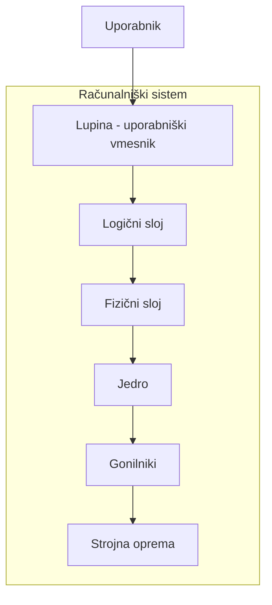

- **Logični sloj** je usmerjen in prilagojen uporabniku.
- **Fizični sloj** je prilagojen strojnim komponentam računalnika.
- **Jedro** je minimalni nabor funkcij, ki jih OS potrebuje, da računalniški sistem sploh deluje. Če na računalnik naložimo samo jedro, bo ta deloval (za vsakdanjo uporabo pa precej okorno) - vsebuje vse minimalne funkcije, da sistem teče. Del logičnega sloja je tudi del jedra, vse ostale funkcije pa so namenjene olajšanju dela uporabniku.

Ker OS-i danes tečejo na zelo različnih računalniških sistemih, so tudi njihova jedra med seboj različna.

Moderni OS-i niso nikoli neposredno povezani s strojno opremo. Če računalniku dodamo nov disk ali vstavimo USB ključek, nam OS-a ni treba na novo naložiti - OS s strojno opremo komunicira posredno, preko gonilnikov.

### Osnovne naloge OS

1. **Vmesnik med uporabnikom in računalniškim sistemom** - ukazni jezik, okenske izbire.
2. **Nabor koristnih uslužnostnih rutin** - vodenje ure realnega časa, upravljanje s pomnilnikom, upravljanje s posli in procesi, zaščita.
3. **Množica pomagal za razvoj programov in upravljanje s projekti** - niso neposredno del OS, a izkoriščajo njegove uslužnostne rutine (npr. urejevalniki, prevajalniki, nalagalniki).

#### 1. Vmesnik med uporabnikom in strojno opremo

Lupina (uporabniški vmesnik) je vmesnik, ki ga OS ponuja uporabniku, ki želi na računalniškem sistemu rešiti neko nalogo. Med prenosom podatkov med strojno komponento in uporabnikom OS ves čas pretvarja jezik - enkrat v smeri, ki je razumljivejša uporabniku, drugič v smeri, ki je razumljivejša strojni komponenti.

#### 2. Nabor koristnih uslužnostnih rutin

Strojne komponente same po sebi ne delujejo usklajeno - OS nadzoruje njihovo delovanje, jim dodeljuje naloge in skrbi, da se komponente med seboj ne motijo (npr. da neka komponenta ne bi posegala po delu pomnilnika, rezerviranem za drug proces). Dostop do vhodno-izhodnih naprav in dodeljevanje pomnilnika sta primera takšnih uslužnostnih rutin - OS torej deluje kot upravitelj strojnih komponent.

**Gonilniki in krmilniki.** Ko OS komunicira s strojno opremo, najprej pokomunicira z gonilnikom, ta pa nato s krmilnikom (controller), ki dejansko izvede nalogo (npr. branje ali zapisovanje na disk). Rezultat se nato po isti poti vrne nazaj do uporabnika.

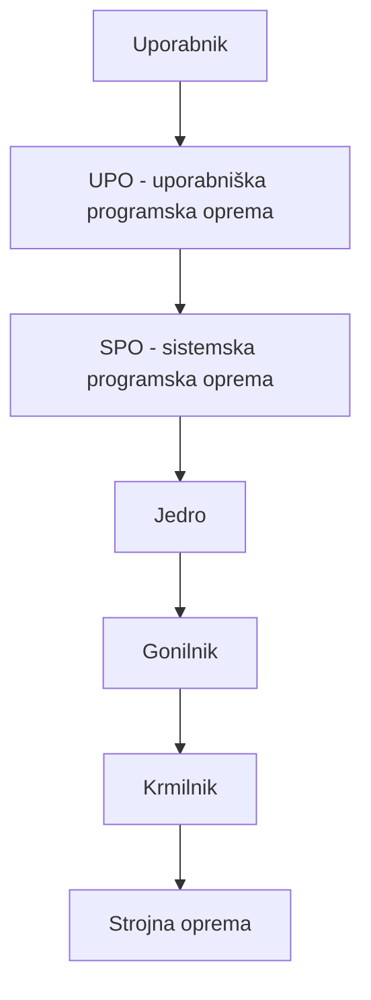

Navadni uporabniki torej do OS večinoma pridejo posredno - preko uporabniške programske opreme (UPO), ta pa preko sistemske programske opreme (SPO), ki šele dejansko uporablja storitve OS.

OS v delovanje sistema vnaša tudi določeno zakasnitev - vsaka njegova aktivacija nekoliko podaljša izvajanje procesa, zato morajo biti njegovi postopki izjemno kratki, aktivirati pa se mora res samo takrat, ko je to nujno potrebno. OS pogosto deluje tako, da strojni opremi naroči, naj nekaj naredi, počaka na rezultat in ga nato vrne uporabniku.

#### 3. Množica pomagal za razvoj programov in upravljanje s projekti

Gre za orodja, ki niso neposredno del OS, a izkoriščajo njegove uslužnostne rutine - urejevalniki, prevajalniki, nalagalniki. V Linuxu lahko z urejevalnikom posegamo celo po jedru - da se taka sprememba dejansko uveljavi (začne uporabljati), pa je potreben prevajalnik.

## Zgradba računalniških sistemov

### Von Neumannova arhitektura in sistemsko vodilo

Von Neumannova arhitektura temelji na skupnem sistemskem vodilu, preko katerega so povezane vse komponente računalniškega sistema. Dve najpomembnejši enoti sta procesor (CPU) in delovni pomnilnik (RAM) - vse, kar se dogaja v von Neumannovi arhitekturi, poteka med tema dvema enotama.

Programček je zaporedje ukazov. Da ga lahko izvajamo, ga moramo iz sekundarnega pomnilnika (SSD, HDD) z nalagalnim programom prenesti v delovni pomnilnik. V delovnem pomnilniku programski števec kaže na naslednjo inštrukcijo, ki se bo izvajala. Procesor pri tem dela v dvotaktnem ciklu - izvrši in dostavi: prebere ukaz, ugotovi, koliko operandov potrebuje, operande pretoči vase, jih izvrši in posodobi programski števec.

Vse ostale komponente (diskovni, tiskalniški in mrežni krmilnik, pomnilniški krmilnik, V/I krmilnik ...) visijo na istem skupnem sistemskem vodilu:


### Podvodila sistemskega vodila

Sistemsko vodilo delimo na tri podvodila, od katerih vsako prenaša svojo vrsto informacij:

- **Naslovno podvodilo** - po njem se pretakajo pomnilniški naslovi. Ima \(n\) linij (1 linija = 1 bit informacije), zato lahko po njem naslovimo \(2^n\) različnih lokacij. Širina naslovnega vodila torej opredeljuje logični naslovni prostor procesorja - procesor na vodilo oddaja logične naslove, ti pa se morajo pretvoriti v dejanske fizične naslove delovnega pomnilnika. Logični naslovni prostor je navadno precej večji od dejanske količine RAM-a v sistemu (vodila so danes širša od 32 bitov).
- **Podatkovno podvodilo** - ima \(m\) linij (običajno večkratnik števila 8); po tem se procesorji tudi poimenujejo (8-bitni, 16-bitni, 64-bitni ...). Pove, koliko bitov informacije se lahko naenkrat pretoči v procesor ali iz njega - vedno se prenese celotna širina podatkovnega vodila, čas prenosa pa je pri tem vedno enak, ne glede na to, ali dejansko potrebujemo vseh 64 bitov ali le 8.
- **Upravno-nadzorno podvodilo** - po njem potujejo kontrolne informacije, najpomembnejši sta **beri** (iz naslova v pomnilniku preberemo podatke in jih pretočimo na mesto, povezano na upravno vodilo) in **piši** (podatke s podatkovnega vodila zapišemo na pomnilniško lokacijo).

### Prekinitve

Ker ima računalnik z enim procesorjem lahko naenkrat v izvajanju samo en proces, bi bilo zelo neučinkovito, če bi OS na vrsto prišel šele, ko bi se izvajanje programa v celoti zaključilo. Zato OS svoje delovanje v veliki meri gradi na **prekinitvah** (angl. *interrupts*) - v neki točki izvajanja procesor prekine trenutni proces, servisira dogodek, nato pa se izvajanje nadaljuje, kot da se ni nič zgodilo:


Ob prekinitvi se zgodi naslednje:

1. Procesor prekine trenutno izvajanje programa.
2. V sklad (poseben del pomnilnika) se shranita programski števec in vsebina vseh registrov - shrani se celotno stanje prekinjenega programa.
3. Začne se izvajati ustrezna prekinitvena rutina, ki servisira dogodek.
4. Ko se rutina zaključi, se programski števec in registri obnovijo na stanje pred prekinitvijo.
5. Program se nadaljuje, kot da se ni nič zgodilo - prekinitve so zelo hitre, saj mora biti izvajanje OS čim krajše.

Prekinitve so **asinhrone** - ne vemo vnaprej, kdaj se bodo zgodile - in imajo različne prioritete: prekinitev z višjo prioriteto lahko prekine prekinitev z nižjo prioriteto. Prekinitve lahko tudi maskiramo (onemogočimo, ignoriramo), kar pa je lahko nevarno. Ločimo dve vrsti prekinitev:

#### Strojne prekinitve

Vzrok strojne prekinitve je dogodek na strojni opremi - npr. premik miške. Strojna komponenta procesorju prek enega vodila sporoči, da se je nekaj zgodilo (dogodek / ni dogodka), po drugem, posebnem vodilu pa gredo še dodatne informacije o dogodku (npr. kam se je miška premaknila). Če profesor med predvajanjem predstavitve premakne miško, se izvajanje diaprojekcije prekine, izvede se prekinitvena rutina za miško, nato pa se diaprojekcija nadaljuje.

Podobno kot pri triaži v urgentni ambulanti velja pravilo prioritete: če imamo tri paciente (urezan prst, odrezan prst, odrezana roka), bomo najprej obravnavali tistega z resnejšo poškodbo - tretji pacient (odrezana roka) bo prekinil obravnavo drugega pacienta (odrezan prst), vsi podatki o dotedanji obravnavi drugega pacienta pa ostanejo shranjeni, tako da lahko oskrbo kasneje nadaljujemo točno tam, kjer smo jo prekinili.

Med procesorjem in strojno opremo je posebna komponenta - **prekinitveni krmilnik**. Nanj so vezane naprave, krmilnik pa je z enim vodilom povezan na procesor. Prekinitveni krmilnik običajno obvladuje 16 linij, oštevilčenih IRQ0-IRQ15, pri čemer ima IRQ0 najvišjo prioriteto (nanj je vezana sistemska ura - najpomembnejša strojna prekinitev v računalniškem sistemu, ki tika z določeno frekvenco in lahko prekine vse ostale prekinitve), IRQ15 pa najnižjo:

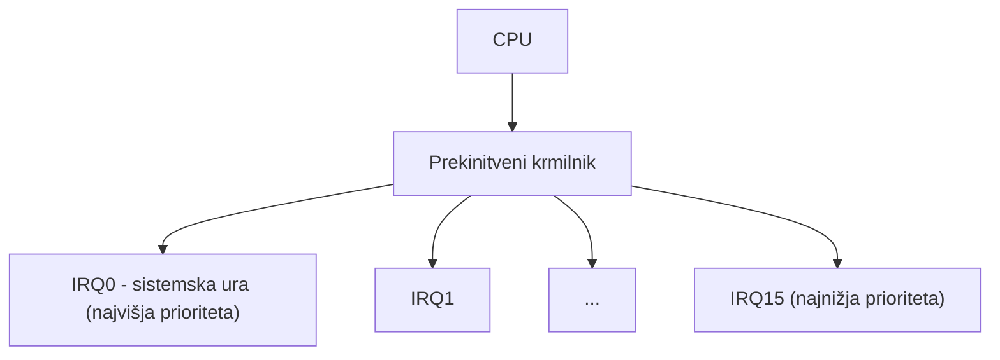

En prekinitveni krmilnik lahko na ta način ureja prioritete le za 16 naprav. Če želimo vezati več naprav, problem rešimo z ALI-vrati (OR), na katera lahko vežemo več komponent na isto linijo - a preko njih lahko hkrati deluje le ena od vezanih naprav; če bi želeli sočasno uporabiti dve, se njuni zahtevi postavita v vrsto in izvedeta ena za drugo.

Da procesor ve, katero prekinitveno rutino naj začne izvajati, mu pomaga posebna tabela v RAM-u - **prekinitveni vektorji**. Gre za oštevilčeno polje, v katerem je na določenem mestu (npr. na mestu 113 za miško) shranjen naslov ustrezne prekinitvene rutine; vnosi se v RAM zapišejo ob zagonu (bootanju) OS. Ob bootanju si OS za lastne potrebe (podatkovne strukture, prekinitvene rutine ...) rezervira del RAM-a, preostanek pa je uporabniški prostor, namenjen programom in opravilom uporabnika.

#### Programske prekinitve

Za razliko od strojnih programske prekinitve ne potrebujejo prekinitvenega krmilnika - sprožijo jih sistemski klici (pozivi nadzorniku), ki jih OS prestreže in prepozna kot prekinitev. Uporabniška programska oprema (UPO) namreč ne sme nikoli dostopati neposredno do strojne opreme. Primer: ko v urejevalniku besedil shranjujemo dokument, pride v UPO do operacije piši, kar sproži programsko prekinitev - izvajanje UPO se prekine, nadzor prevzame prekinitvena rutina OS, ki nato iz BIOS-a aktivira ustrezno rutino za dejanski zapis podatkov na disk. OS ta prekinitveni mehanizem izkorišča zelo pogosto.

### Način izvajanja procesorja

Procesor lahko deluje v dveh načinih, med katerima preklaplja s pomočjo enega samega bita:

- **Uporabniški način** - t. i. restriktivni način, v katerem se običajno izvaja UPO. Če bi program v uporabniškem načinu poskusil npr. neposredno pisati na disk, bi procesor to javil kot napako (nedovoljen poseg).
- **Nadzorniški način** - t. i. privilegiran način, v katerem se izvajajo sistemske rutine, SPO (npr. gonilniki) in večina rutin OS - tu je dovoljeno storiti karkoli.

Med izvajanjem programa lahko ta prehaja med obema načinoma - npr. ko shranjujemo dokument, programček iz uporabniškega načina preide v nadzorniški način, ko je datoteka shranjena, pa preide nazaj. Sistemski status pri tem ni enako kot uporabniški račun (navaden uporabnik, administrator ...) - gre za dve ločeni stvari.

### Neposredni dostop do pomnilnika (DMA)

Brez posebnega mehanizma bi za vsak prenos podatkov med periferno napravo in RAM-om (ali obratno) moral skrbeti procesor sam, kar bi pomenilo nenehno prekinjanje CPU in veliko izgubo časa. Zato uvedemo **krmilnik DMA** (Direct Memory Access), ki prenos podatkov med napravo in delovnim pomnilnikom opravi namesto procesorja - ta lahko medtem počne nekaj drugega (npr. izvaja drugo prekinitveno rutino):


Krmilniku DMA podamo naslov naprave, pomnilniški naslov ter podatke, ki jih želimo prenesti - pri tem gre prenos mimo procesorja. Pomembna omejitev: krmilnik DMA in CPU ne moreta hkrati zasedati sistemskega vodila, zato DMA deluje po enem od dveh načinov:

- **Prikrito** (*cycle-stealing*) - krmilnik DMA "krade" procesorjeve cikle: v vsakem ciklu preveri, ali je vodilo prosto, in če je, ga zasede, prenese eno besedo podatkov ter ga sprosti. Postopek se ob naslednjem prostem ciklu ponovi.
- **V nizih** (*burst*) - krmilnik DMA zasede vodilo, prenese vse podatke naenkrat in šele nato vodilo sprosti. Prenos je hitrejši, a lahko za ta čas povsem zaustavi procesor, saj ta medtem ne more uporabljati vodila.

### Pomnilnik in pomnilniška hierarhija

OS je zadolžen tudi za nemoteno in pravilno izrabo pomnilnika - skrbi, da procesi dobivajo pomnilnik (proces si pomnilnika ne more prilastiti sam, mora zanj prositi OS, ki mu ga dodeli), poleg tega pa pomnilnik tudi ščiti, da en proces ne posega po delih pomnilnika drugega procesa. Pri tem si pomaga z dvema strojnima pripomočkoma:

**Parnostni bit** (*parity bit*). Bajt ima 8 bitov, na strojnem nivoju pa se mu doda še en, deveti bit, ki se ne uporablja za hranjenje informacije, temveč nadzoruje preostalih osem bitov. Glede na dogovorjeno (liho ali sodo) parnost se deveti bit nastavi tako, da je skupno število enic v bajtu liho oz. sodo. Če se ob branju izkaže, da parnost ni pravilna, to pomeni, da je bila informacija verjetno pokvarjena - s parnostnim bitom lahko torej napako zaznamo, ne moremo pa z njim ugotoviti, kje točno je prišlo do napake, niti je popraviti.

**Enote za upravljanje s pomnilnikom** (*memory management units*, MMU). Te enote skupaj z OS skrbijo za določeno število procesov - ena npr. za prvih 50 procesov, druga za naslednjih 50 - in poskrbijo, da ima vsak proces dodeljen svoj rezervirani prostor, izven katerega ne sme posegati. Procesor izda logični naslov, ustrezna MMU pa ta logični naslov pretvori v dejanski fizični naslov v pomnilniku:

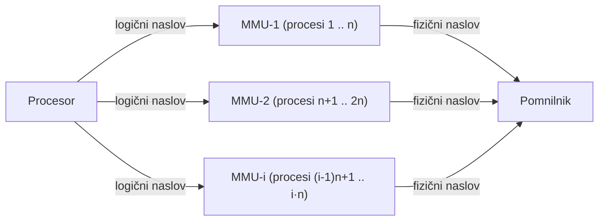

**Predpomnjenje** (*caching*) temelji na podobni ideji kot hashing: informacija je tipično shranjena v nekem (počasnejšem) pomnilnem sistemu, ob uporabi pa se kopira v hitrejši pomnilni sistem - en nivo više v pomnilniški hierarhiji. Iskanje poteka najprej v predpomnilniku; če podatka tam ni, ga poiščemo v osnovnem viru, kopijo pa shranimo v predpomnilnik za poznejšo uporabo. Dostop do RAM-a je npr. hitrejši kot dostop do diska - ko OS bere podatke z diska, jih shrani tudi v RAM, pri tem pa po principu *read ahead* prebere malo več podatkov, kot je bilo dejansko zahtevano. Če bodo ti podatki kmalu spet potrebni, jih OS poišče najprej v RAM-u, kar je hitreje, kot če bi jih moral znova prebrati z diska. Pravilo torej je: podatke, s katerimi delamo, shranimo en nivo više v hierarhiji (če delamo v RAM-u, jih shranimo v predpomnilnik; če delamo v predpomnilniku, jih shranimo v registre).

Učinkovitost posameznih nivojev hranilnega prostora se med seboj zelo razlikuje:

| Nivo | Ime | Kapaciteta | Dostopni čas (ns) | Pasovna širina (MB/s) | Upravlja |
|---|---|---|---|---|---|
| 1 | Registri | kB | ~0,2 | > 100 000 | Prevajalnik |
| 2 | Predpomnilnik | MB | ~10 | > 10 000 | HW |
| 3 | Delovni pomnilnik | GB | 70 | > 5 000 | OS |
| 4 | Disk | TB | 5 000 000 | > 150 | OS |

Nižji kot je nivo, manjša je kapaciteta, a večja hitrost - in obratno.

### Strojna zaščita

V večuporabniškem in večprogramskem okolju mora OS zagotoviti, da so podatki zaščiteni (pred uničenjem, izgubo, zlorabo) in da napaka v kakšnem programu ne sme zrušiti delovanja celotnega računalniškega sistema. Za to uporablja štiri strojne pripomočke:

- **Izvajanje z dvema stanjema** - procesor deluje v uporabniškem ali nadzorniškem načinu (glej zgoraj).
- **V/I zaščita** - vhodno-izhodni posegi so privilegirane operacije, izvajajo se lahko le v nadzorniškem načinu.
- **Zaščita delovnega pomnilnika** - parnostni bit ščiti sam pomnilnik pred napakami, enote MMU pa ščitijo pred nedovoljenimi posegi drugih programov.
- **Zaščita procesorja** - preprečuje, da bi se računalniški sistem "obesil" (npr. zaradi neskončne zanke). Gre za poseben števec na strojnem nivoju, ki se ob vsakem urinem ciklu dekrementira. Ko števec pride do 0, se sproži strojna prekinitev, izvede se strojna rutina in OS prevzame kontrolo ter lahko situacijo razreši.

## Vrste OS

OS-i se izvajajo na zelo različnih računalniških sistemih in si zato niso enaki - nudit pa morajo vsaj vmesnik, preko katerega lahko uporabnik strojnim komponentam pošilja ukaze, in izvajalno okolje, v katerem lahko zažene svoje programe. OS-e delimo glede na štiri ključe, pri čemer vsak OS dobi svojo "etiketo" iz vsakega izmed njih:

1. **Število uporabnikov, ki sistem uporabljajo istočasno** - enouporabniški / večuporabniški OS.
2. **Število programov, ki se izvajajo sočasno** - enoprogramski / večprogramski OS.
3. **Način dostopa do računalnikovih funkcij** - paketni / interaktivni OS.
4. **Realnočasovnost** - realnočasovni / nerealnočasovni OS.

### 1. ključ - število uporabnikov

Med **enouporabniške** OS sodijo tudi tisti, ki sploh ne nudijo pojma uporabnika (userja) - računalniški sistem lahko uporablja največ en uporabnik. Da gre za pravi **večuporabniški** sistem, mora OS omogočati ustvarjanje več uporabnikov z različnimi imeni, gesli in pravicami, pri čemer mora biti računalniški sistem pri polni funkcionalnosti uporaben več uporabnikom hkrati. Windows v tem smislu ni čisto večuporabniški OS - čeprav lahko ustvarimo več uporabnikov, jih ne more več hkrati dejansko uporabljati računalnika. Linux in Unix pa sta pravi večuporabniški OS, za kar pa je treba zaslon eksportirati na svojo napravo.

### 2. ključ - večprogramski OS in multiprogramiranje

**Enoprogramski** OS omogočajo izvajanje samo enega programa naenkrat. **Večprogramski** OS (sopomenka: *multiprogramski*) pa omogočajo, da se več procesov in programov izvaja navidezno sočasno - če imamo na voljo le en procesor, to dosežemo z delitvijo časovnih rezin: najprej se za kratek čas izvaja proces D, nato se sproži časovna prekinitev in na vrsto pride proces C, itd. Ker so rezine zelo kratke, na prvi pogled res izgleda, kot da se procesi izvajajo sočasno - resnično sočasno izvajanje pa je mogoče le, če imamo na voljo več procesorjev oz. jeder. **Stopnja multiprogramiranja** pove, koliko procesov se (kvazi)sočasno izvaja - če imamo en sam procesor, se dejansko izvaja le en proces naenkrat, ostali pa čakajo na svojo rezino.

Pravo multiprogramiranje (več programov si hkrati deli RAM in CPU) zahteva štiri nujne strojne dodatke, ki smo jih spoznali že v prejšnjem razdelku: zaščito delovnega pomnilnika, privilegirane ukaze, prekinitveni način delovanja ter uro realnega časa in časovnih intervalov. Brez teh štirih pripomočkov pravi večprogramski OS ni mogoč. Večina OS je danes večprogramskih.

### 3. ključ - paketni in interaktivni OS

Pri **paketnih** OS uporabnik vse svoje zahteve zbere v eno tekstovno datoteko (paket, posel), v kateri zapiše, kaj vse naj se izvede in s katerimi parametri - OS nato paket prestreže in ga izvede v celoti, pri čemer uporabnik med izvajanjem ne dobi takojšnjega povratnega odziva. Čeprav imamo danes predvsem **interaktivne** OS, pri katerih uporabnik OS-u poda zahtevo in takoj dobi odziv, paketno delo (npr. izvajanje skript) še vedno omogočajo tudi sodobni OS. Linux in Windows sta tako interaktivna kot tudi paketna.

Interaktivnost ni vezana na konkretno vrsto vmesnika - tudi okenski (grafični) način sam po sebi še ne pomeni interaktivnosti, saj se npr. premik datoteke iz ene mape v drugo v ozadju še vedno izvede s kodo na bolj primitivnem nivoju. Pri ukaznem načinu uporabnik vpiše ukaz in pritisne enter - niz se posreduje OS-u, kjer ga prestreže ukazni tolmač (npr. bash), ta niz razbije na posamezne besede in preveri sintaktično pravilnost. Če je ukaz sintaktično pravilen, se začne izvajati in uporabnik dobi (pozitiven) odziv, sicer pa dobi povratno informacijo o napaki.

V večuporabniškem okolju interaktivnost dosežemo z deljenjem časovnih rezin med uporabniki - vsakemu uporabniku dodelimo njegovo rezino ter njemu pripadajočo programsko opremo (npr. prvi program uporabnika 1, nato ena časovna rezina za uporabnika 2 z njegovim prvim programom, itd.).

### 4. ključ - realnočasovnost

**Realnočasovni** OS imajo pri svojih nalogah poleg same izvedbe tudi skrajni rok, do katerega mora biti neka naloga končana, in si morajo razporejanje opravil organizirati tako, da ta rok ujamejo. **Nerealnočasovni** OS takšnih skrajnih rokov nimajo - klasična Windows in Linux med realnočasovne OS ne sodita.

### Mrežni in porazdeljeni OS

**Porazdeljeni računalniški sistem** je množica ohlapno povezanih procesorjev, ki si ne delijo niti pomnilnika niti sistemske ure - vsak procesor ima svoj lasten pomnilnik. Procesorji so fizično povezani (v različnih mrežnih topologijah) in komunicirajo preko komunikacijske linije; take procesorje imenujemo tudi mesto (*site*), vozlišče, računalnik, stroj ali gostitelj (*host*).

**Mrežni OS** zagotavlja okolje, v katerem se uporabniki zavedajo množice med seboj povezanih strojev in lahko dostopajo do oddaljenih virov - se prijavijo na oddaljen stroj ali prenesejo podatke z oddaljenega stroja na lokalnega. Vsi moderni OS (Linux, Windows ...) so mrežni OS.

**Porazdeljeni OS** gre še korak dlje: uporabniki do oddaljenih virov dostopajo na popolnoma enak način kot do lokalnih, migracijo podatkov in procesov med posameznimi mesti pa v celoti nadzoruje sam porazdeljeni OS. Če uporabnik zahteva 1 MB RAM-a, ga bo dobil - vseeno pa mu je (in tega niti ne ve), ali ta RAM pride iz vozlišča 1, 2 ali 3.

### Delitev OS glede na jedro

Glede na to, kako je zgrajeno in implementirano jedro, ločimo tri skupine OS:

- **Monolitna jedra** (*monolithic kernels*) - vsi servisi OS (datotečni sistem, IPC, razvrščanje, upravljanje s pomnilnikom, gonilniki ...) tečejo v jedrnem prostoru, torej v nadzorniškem načinu, jedro pa je v grobem implementirano kot ena velika funkcija. Prednost je dobra učinkovitost (hitrost), slabosti pa odvisnost med sistemskimi komponentami ter kompleksnost in posledično težje vzdrževanje. Primeri: Unix, Linux, BSD, Multics.
- **Mikro jedra** (*microkernels*) - minimalističen pristop, kjer so v jedrnem prostoru le najnujnejše stvari (IPC, virtualni pomnilnik, razvrščanje), vse ostalo (gonilniki, datotečni sistem, uporabniški vmesnik, omrežje ...) pa teče v uporabniškem prostoru, vsako kot svoja ločena funkcija/proces. Prednost je večja stabilnost zaradi manj servisov v jedrnem prostoru, slabost pa veliko število sistemskih klicev in preklopov konteksta, zaradi česar so mikrojedra počasnejša, so pa bolj primerna za nadgrajevanje. Primeri: Mach, L4, AmigaOS, Minix, K42.
- **Hibridna jedra** (*hybrid kernels*) - kombinirajo prednosti obeh pristopov: hitrost in preprosto zasnovo monolitnih ter modularnost in stabilnost mikro jeder. Primeri: Windows NT, NetWare, BeOS.

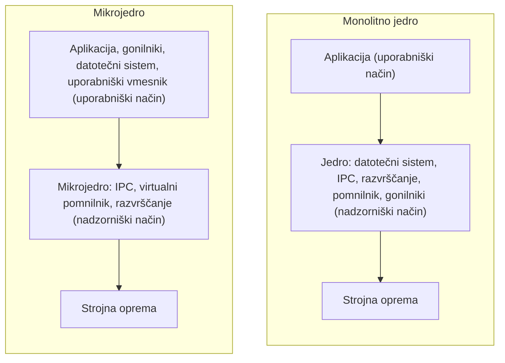

## Upravljanje s posli in procesi

### Posel

Izraz **posel** (*job*) izvira iz paketnih OS - ko je uporabnik želel na računalniškem sistemu izvesti neko nalogo, se je reklo, da je naložil izvedbo nekega posla. Posel si lahko predstavljamo kot tekstovno datoteko, v kateri je zapisano zaporedje korakov (program, parametri, nastavitve okolja za vsak korak), ki naj se izvedejo - uporabnik je to datoteko nekoč dobesedno "podtaknil" računalniškemu sistemu.

Pomen izraza se razlikuje glede na vrsto OS:

- pri **interaktivnih OS** velja posel == proces,
- pri **distribuiranih OS** posel pomeni več nezahtevnih opravil (*task*), ki so sočasno v pomnilniku.

Na splošno lahko iz enega posla nastane več procesov, iz procesov pa več niti.

### Izvrševanje posla pri paketnih OS

Posel pri paketnem OS gre skozi štiri faze:

1. **Vnos posla v računalniški sistem** - uporabnik pripravi posel in ga podtakne OS-u; na vhodu ga prestreže posebna rutina OS, **nadzornik poslov**, ki ga vpiše v vhodno vrsto poslov.
2. **Čakanje posla v vhodni vrsti poslov** - nad vrsto bdi **razvrščevalnik poslov**, ki odloča, kdaj bo posel prišel na vrsto (pravila razvrščanja so npr. FCFS - prvi pride, prvi je postrežen, zunanje statične prioritete, ali najkrajši posli najprej).
3. **Obdelava posla** - posel se obdeluje korak za korakom, v zaporedju, navedenem v poslu.
4. **Končanje posla** - zaključek je lahko normalen (vsi koraki uspešno zaključeni) ali nenormalen (prekinjen zaradi napake).

Pri **interaktivnih OS** veljata glede na zgornji potek dve manjši razliki:

- **Vnos posla** - posel (ki je tu v obliki niza, ne paketa) prestreže **ukazni tolmač** (npr. bash), ne nadzornik poslov.
- **Čakanje posla** - čakanja in razvrščanja v vrsti ni, saj se posel začne izvajati takoj - takoj se pokliče nalagalnik, ki prične izvajati ukaz.

Pri interaktivnih OS vnos posla namesto nadzornika poslov prestreže **ukazni tolmač**, ki interaktivne ukaze interpretira in iz niza razpozna sam ukaz ter morebitne dodatne parametre. Ko je ukaz prepoznan, ukazni tolmač takoj pokliče **nalagalnik**, ki program pripravi za izvajanje - nivo posla, vhodne vrste poslov in razvrščanja poslov, ki jih poznamo pri paketnih OS, pri interaktivnih OS niso jasno vidni oz. ne obstajajo v enaki obliki.

### Sistemsko odvisne in sistemsko neodvisne rutine OS

Rutine OS lahko delimo tudi glede na to, kako tesno so povezane s strojno opremo:

- **Sistemsko odvisne rutine OS** neposredno upravljajo s strojnim nivojem računalniškega sistema - odvisne so od platforme, na kateri OS teče, nahajajo se na nižjem, fizičnem sloju OS, zbrane pa so v jedru OS.
- **Sistemsko neodvisne rutine OS** so preostale rutine, namenjene prijaznejšemu, zanesljivejšemu in varnejšemu obnašanju računalniškega sistema - od strojne opreme so odmaknjene in so bliže logičnemu sloju.

Upravljanje s posli je primer sistemsko neodvisne rutine OS.

## Proces

### Definicija

**Proces** je program, ki je naložen v pomnilnik in pripravljen za izvajanje - gre torej za pravilno naložen program (izvedljivo programsko kodo), ki potrebuje le še prost procesor. Proces == opravilo (*task*). V večprogramskem okolju je hkrati aktivnih več procesov.

Pomembno je razlikovati: če je program shranjen na disku (sekundarnem pomnilniku), ga moramo najprej naložiti v RAM, šele takrat mu rečemo proces - v računalniškem sistemu torej tečejo procesi in niti, ne pa dejanski (shranjeni) programi.

### Zgradba procesa

Proces sestoji iz petih sestavin - dveh statičnih in treh dinamičnih:

- **Statični sestavini** - **programska sekcija** (koda) in **podatkovna sekcija** - se ob nalaganju prekopirata iz izvedljivega modula (EXE datoteke).
- **Dinamične sestavine** - nastanejo šele ob nalaganju procesa: **vrednost programskega števca**, **vsebina registrov CPU** in **sklad** (vsak proces ob nalaganju dobi svojo podatkovno strukturo - sklad - kamor se shranjujejo njegovi podatki).

Proces ima svoj življenjski cikel, v katerem prehaja med različnimi stanji.

### Stanja procesa

Nad procesom skozi ves njegov življenjski cikel - od kreiranja do zaključka - bdi **razvrščevalnik procesov**. Proces lahko nastane na tri načine: (1) z izvajanjem določenega koraka posla, (2) kot potomec že izvajanega procesa (starš ustvari potomca), ali (3) kot ena od rutin OS, ki se v računalniškem sistemu prav tako izvaja kot proces.

Proces pozna tri glavna stanja - **aktivno** (pripravljenost), **izvajanje** in **blokiranje/čakanje**:

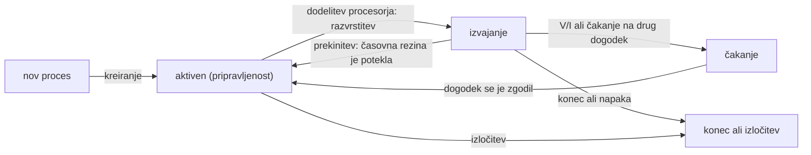

Ko je proces kreiran, gre v aktivno vrsto (je pripravljen na izvajanje). Razvrščevalnik procesov mu nato dodeli procesor in preide v stanje izvajanja. Med izvajanjem se lahko zgodi eno od naslednjega: proces zaključi oz. naleti na napako (gre v konec/izločitev), poteče mu časovna rezina (vrne se v aktivno vrsto) ali pa zahteva dostop do periferije oz. čaka na kak drug dogodek (gre v stanje čakanja). Ko se pričakovani dogodek zgodi (npr. so podatki, na katere je proces čakal, pripravljeni), razvrščevalnik proces iz čakalne vrste vrne nazaj v aktivno vrsto. Kako konkretno proces prehaja med stanji, je odvisno od procesa do procesa.

### Procesov nadzorni blok (PCB)

**PCB** (*process control block*) je sistemsko odvisna interna podatkovna struktura za vodenje informacij o procesu. Vsak proces ima svoj PCB, ki se nahaja v RAM-u (v delu, ki je rezerviran za OS - procesi v uporabniškem delu RAM-a ne smejo posegati po delu, namenjenem OS-u; zaradi hitrosti so lahko te strukture tudi v predpomnilniku). PCB med drugim vsebuje:

- številko procesa (PID) - OS procese med seboj loči po tej številki, ne po imenu,
- procesovo stanje,
- programski števec in vsebino registrov - shranita se, kadar proces zamenja stanje, da ju je kasneje mogoče obnoviti,
- prioriteto - običajno določeno s številko (npr. na Unixu 0 pomeni najvišjo, 31 pa najnižjo prioriteto),
- meje pomnilnika in tabelo strani - groba informacija, kateri del pomnilnika je dodeljen kateremu procesu,
- seznam odprtih zbirk - povezave, ki jih ima proces odprte z drugimi računalniškimi sistemi,
- podatke za obračunavanje - statistiko (npr. število V/I operacij, napake pri dostopu do pomnilnika ...), ki jo razvrščevalnik procesov uporablja pri odločanju, kateri proces bo prišel na vrsto.

Aktivna vrsta procesov (in druge čakalne vrste) je realizirana kot kazalčno povezan seznam PCB-jev - en PCB ima kazalec na naslednjega, ta na tretjega itd., po tem seznamu pa se sprehaja razvrščevalnik procesov:


### Preklop konteksta

**Preklop konteksta** (*context switch*) pomeni zamenjavo izvajanja dveh procesov in ažuriranje njunih PCB-jev - gre torej za:

1. izvajanje nekega procesa (npr. s PID-om #BCA23),
2. zaključek (ali potek časovne rezine) tega procesa,
3. shranitev stanja prvega procesa (ažuriranje njegovega PCB-ja - programski števec, podatki ...) ter branje in nalaganje podatkov drugega procesa iz njegovega PCB-ja,
4. začetek izvajanja drugega procesa (npr. s PID-om #A123).

Preklop konteksta ni zastonj - vsakič, ko kaki rezini poteče čas, preklop pomeni dodatno režijo in troši procesorski čas.

## Nit

**Motivacija.** Predstavljajmo si izračun in tisk plačnih lističev, ki ga lahko razdelimo na tri podnaloge: branje (D1), računanje (D2) in tiskanje (D3). V enoprogramskem okolju vzporedno izvajanje ni mogoče - vsak korak se lahko začne šele, ko se zaključi prejšnji, strojna oprema pa je zato slabo izkoriščena. V večprogramskem okolju bi te tri podnaloge lahko izvajali kot tri ločene procese, s čimer bi dosegli vzporednost in boljšo izrabo strojne opreme - naletimo pa na tri probleme:

1. **Sinhronizacija procesov** - plačnega lističa npr. ne moremo natisniti, če še ni izračunan.
2. **Delo z istimi podatki v RAM-u** - procesom je sicer prepovedano dostopati do pomnilniškega prostora drugih procesov, a D1, D2 in D3 morajo vsi delati z istimi podatki. Rešitev je skupni (rezervirani) pomnilnik, do katerega imajo dostop (ključ) vsi trije sodelujoči procesi.
3. **Izmenjevanje procesov oz. preklapljanje konteksta** - najtežji problem: če D1, D2 in D3 implementiramo kot ločene procese, ki se ves čas izmenjujejo, dobimo ogromno število preklopov konteksta, kar povzroča veliko izgubo procesorskega časa. Ta problem je bil glavna motivacija za razvoj niti.

**Nit** je lahek proces. Niti uvedemo, ko skupno nalogo nekega procesa razdelimo na podnaloge - za vsako podnalogo uvedemo nit. Nit je konstrukt s programsko sekcijo - je ena podnaloga procesa, namenjena reševanju določene naloge (del kode znotraj procesa). Vsaka nit dobi svoj programski števec in svojo podatkovno strukturo, v kateri beležimo, kje se ta nit trenutno nahaja, vse niti istega procesa (opravila) pa si delijo skupno podatkovno sekcijo - to je podatkovna sekcija procesa, iz katerega so niti nastale:

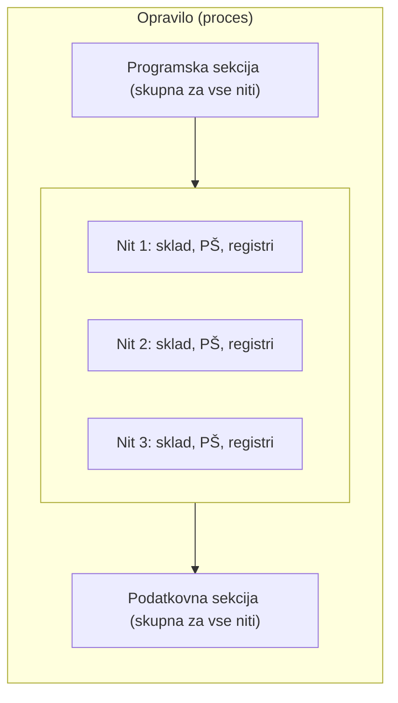

Nit je "lahek" proces, ker njena podatkovna struktura (**TCB**) vsebuje precej manj podatkov kot PCB "težkega" (navadnega) procesa. Nit gre skozi ista stanja kot proces in med njimi prehaja na enak način, le da je preklop med nitmi znotraj istega procesa veliko hitrejši kot preklop med dvema (ločenima) procesorjema/procesoma - prav zato, ker je PCB procesa precej večji od TCB-ja niti. Vsak proces ima svoj PCB, njegove niti pa si ta PCB delijo, dodatno pa ima vsaka nit še svoj lasten TCB. Unix niti nima - vse rešuje na nivoju procesa.

Niti so v OS lahko implementirane na dva načina:

- **Podprte v jedru OS** (npr. Windows) - prednost je, da se, če se ena nit zablokira, blokira le ta izbrana nit, ostale niti istega procesa pa se lahko izvajajo nemoteno; slabost je, da je zaradi tega, ker se OS zaveda niti, preklapljanje med njimi nekoliko počasnejše.
- **Realizirane na uporabniškem nivoju s posebnimi knjižnicami** (npr. Unix) - OS se niti ne zaveda, pozna le procese. Prednost je hitrejše preklapljanje med nitmi (OS nad njim nima nadzora), slabost pa, da OS ob blokadi ene niti tega ne zazna in misli, da je blokiran kar celoten proces.

## Komunikacija med procesi

Komunikacija je smiselna le med **sodelujočimi procesi**, ki si izmenjujejo skupne (iste) podatke - med komunikacijo je nujna tudi sinhronizacija skupnih akcij. Ločimo dva načina komunikacije:

- **Skupni pomnilniški vmesnik** - potreben je poseben, posebej implementiran del pomnilnika, v katerega sodelujoči procesi hranijo podatke (primer: problem proizvajalec-potrošnik).
- **Pošiljanje sporočil** - to podpira večina OS, ki nudijo možnost medprocesne komunikacije (IPC), bodisi znotraj istega računalniškega sistema bodisi preko omrežja med različnimi sistemi. Ločimo dve vrsti:
    - **Neposredno pošiljanje sporočil** - oba procesa morata biti hkrati aktivna (budna), OS pa nastopa kot vmesnik in sinhronizator. Funkciji: `send(Prejemnik, msg)`, `receive(Pošiljatelj, msg)`.
    - **Posredno pošiljanje sporočil** - prejemnik potrebuje nabiralnik (priključek oz. vrata), ki je rezerviran in pod nadzorom OS. Pošiljatelj mora biti aktiven, prejemniku pa ni treba biti aktivnemu niti se sploh izvajati - podobno kot poštar v nabiralnik pusti pošto, tudi če nas ni doma, mi pa jo preberemo, ko smo na voljo. Funkciji: `send(Nabiralnik, msg)`, `receive(Nabiralnik, msg)`.

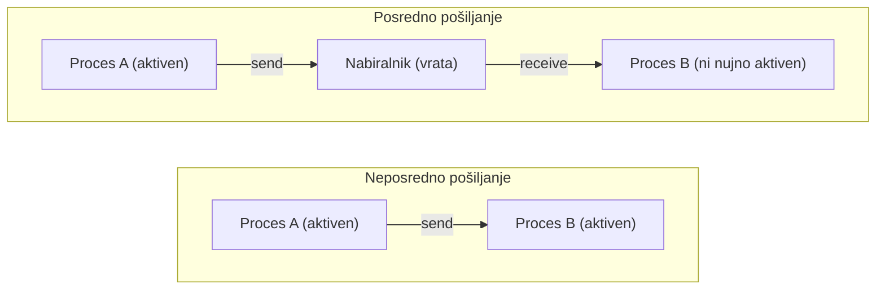

Tretji način medprocesne komunikacije je **klic oddaljene procedure** (RPC - *remote process call*).

## Razvrščanje procesov

### Definicija problema

Narava uporabniških programov je ciklična - proces izmenično potrebuje in ne potrebuje procesorja (CPU zahteve se izmenjujejo z zahtevami za V/I enote). Večina procesov potrebuje procesor le za zelo kratek čas, le malo procesov pa ga potrebuje dolgo. Kadarkoli se procesor sprosti, nastane problem razvrščanja - kateri proces izmed vseh, ki kandidirajo za procesor, bo prišel na vrsto naslednji.

Razvrščamo v štirih situacijah (vedno ko procesorja dodelimo novemu procesu):

1. proces se je zaključil,
2. proces gre iz stanja izvajanja v stanje čakanja (npr. je sprožil V/I akcijo),
3. proces gre iz stanja izvajanja v aktivno stanje (npr. zaradi zunanje prekinitve),
4. proces gre iz stanja čakanja v aktivno stanje (npr. se je izvedla zahteva, na katero je čakal).

Situaciji 1 in 2 sodita v **neprekinjevalno razvrščanje** - proces je sam, prostovoljno zapustil procesor, nihče ga ni prekinil. Situaciji 3 in 4 sodita v **prekinjevalno razvrščanje** - proces smo na silo prekinili, ker je moral biti procesor namenjen nečemu drugemu; v prekinjevalnem načinu vsakič, ko se aktivna vrsta spremeni, prekinemo proces, ki se je dotlej izvajal.

Za razvrščanje skrbita dve rutini OS:

- **razvrščevalnik procesov** - izvaja razvrščanje, torej odloči, kateri proces bo prišel na vrsto,
- **dispečer** - izbranemu procesu dejansko dodeli CPU (izvede preklop konteksta).


### Kriteriji za razvrščanje

Splošno najboljšega razvrščevalnega algoritma ni - posamezen algoritem se izkaže za najboljšega glede na konkretno **programsko breme** (skupek poslov/procesov, ki jih mora računalniški sistem obdelati). Uspešnost algoritma pri danem bremenu spremljamo z zmogljivostnimi indeksi:

1. **Izkoriščenost CPU** - želimo si jo okrog 90-95 % (100 % ni v redu, saj nekaj procesorskega časa potrebuje tudi sam OS).
2. **Prepustnost** - količina dela, ki ga CPU opravi v neki časovni enoti (npr. koliko procesov ali poslov na sekundo) - želimo si jo čim višjo.
3. **Obračalni čas** - čas od začetka do konca izvajanja nekega procesa (meri se pri paketnih OS).
4. **Odzivni čas** - čas od izdaje zahteve do prvega odziva oz. rezultata (meri se pri interaktivnih OS).
5. **Čakalni čas** - čas, ki ga proces prebije v aktivni vrsti, čakajoč na procesor.

Boljši razvrščevalni algoritem je tisti z visoko izkoriščenostjo CPU in prepustnostjo ter nizkim obračalnim (odzivnim) in čakalnim časom. (Ti kriteriji bodo podrobneje obravnavani na enem od poznejših predavanj - tukaj so samo na kratko omenjeni.)

### Vrednotenje algoritmov

Uspešnost razvrščevalnih algoritmov lahko ocenjujemo na tri načine:

1. **S pomočjo analitičnih modelov** - deterministični in verjetnostni.
2. **S pomočjo simulacijskih modelov oz. simulatorjev** - izvajanja procesov dejansko ne izvedemo, temveč ga le simuliramo in merimo; če smo z rezultati zadovoljni, gremo lahko naprej v tretjo fazo.
3. **S pomočjo merilnikov oz. meritev** - merilniki se priklopijo na sistemsko vodilo in neposredno spremljajo, kaj se dogaja v računalniškem sistemu.

Razvrščevalnih algoritmov je lahko neskončno mnogo, v nadaljevanju pa si poglejmo nekaj glavnih.

### FCFS oz. FIFO

**FCFS** (*first come, first served*, tudi FIFO) je tipičen algoritem za enoprogramske OS - proces, ki je prvi prišel v aktivno vrsto, bo prvi prišel na vrsto obdelave. Smiseln je le v neprekinjevalnem načinu: v prekinjevalnem načinu namreč ne bi nič spremenili, saj bi se prekinjen proces, ker je prvi prišel v vrsto, vseeno spet izbral prvi. Gre za enega najstarejših algoritmov, za kritične procese pa je v uporabi še danes.

**Zgled.** Imamo breme štirih procesov, ki vsi pridejo v sistem ob času 0: P1 (31 ms), P2 (15 ms), P3 (4 ms), P4 (3 ms).

```mermaid
gantt
    dateFormat X
    axisFormat %s
    section CPU
    P1 :p1, 0, 31s
    P2 :p2, after p1, 15s
    P3 :p3, after p2, 4s
    P4 :p4, after p3, 3s
```

Iz Ganttovega diagrama lahko izračunamo zmogljivostne indekse (pri tem predpostavimo, da preklop konteksta ne stane nič časa, kar v resnici ni res):

- izkoriščenost CPU je 100 % (procesor je delal ves čas, 53 ms),
- prepustnost: \( T = \dfrac{4\ \text{procesov}}{53\ \text{ms}} \),
- povprečni obračalni čas: \( T = \dfrac{1}{4}(31+46+50+53)\ \text{ms} \),
- povprečni čakalni čas: \( T = \dfrac{1}{4}(0+31+46+50)\ \text{ms} \) (P1 se začne izvajati takoj, zato čaka 0 ms; P2 mora počakati, da se izvede P1, torej 31 ms, itd.).

FCFS je zelo odvisen od vrstnega reda, v katerem procesi prihajajo - ta vrstni red je lahko zelo neugoden, kar povzroči **učinek konvoja**: če imamo en procesorsko zelo zahteven proces (tovornjak) in veliko kratkih, V/I intenzivnih procesov (avtomobile), morajo vsi kratki procesi čakati, da dolgi proces enkrat zapusti procesor, kar njihove čase močno poslabša.

### Najkrajši posli najprej (SJF)

Algoritem **SJF** (*shortest job first*) daje prednost procesom, ki potrebujejo procesor krajši čas - s tem se povprečni čakalni in obračalni (odzivni) časi skrajšajo; v smislu minimizacije povprečnega čakalnega časa je ta algoritem celo optimalen. Težava je, da moramo vnaprej oceniti, koliko časa bo posamezen proces trajal - to oceno lahko poda uporabnik na nivoju posla (tvega preveč optimistično ali preveč pesimistično oceno), ali pa jo oceni OS na podlagi zgodovine (prejšnjih intervalov uporabe CPU za ta proces). SJF obstaja v neprekinjevalni in prekinjevalni različici.

**Zgled (neprekinjevalni način).** Enako breme kot prej, vsi procesi pridejo ob času 0: razvrščevalnik iz aktivne vrste vsakič izbere tistega, ki ima trenutno najkrajši čas izvajanja, in ga izvede od začetka do konca:

```mermaid
gantt
    dateFormat X
    axisFormat %s
    section CPU
    P4 :p4, 0, 3s
    P3 :p3, after p4, 4s
    P2 :p2, after p3, 15s
    P1 :p1, after p2, 31s
```

**Zgled (prekinjevalni način).** Tokrat procesi ne prihajajo vsi hkrati: P1 (31 ms, prihod ob 0), P2 (15 ms, prihod ob 14), P3 (4 ms, prihod ob 7), P4 (3 ms, prihod ob 12). Vsakič, ko v vrsto prispe nov proces s krajšim preostalim časom od trenutno izvajanega, se trenutni proces prekine in prednost dobi krajši:

```mermaid
gantt
    dateFormat X
    axisFormat %s
    section CPU
    P1 :p1a, 0, 7s
    P3 :p3, after p1a, 4s
    P1 :p1b, after p3, 1s
    P4 :p4, after p1b, 3s
    P2 :p2, after p4, 15s
    P1 :p1c, after p2, 23s
```

Potek: ob času 0 začne teči P1 (sam v vrsti). Ob času 7 prispe P3 (4 ms) - krajši je od preostanka P1 (24 ms), zato P1 prekinemo (opravil je 7 ms, preostane mu 24 ms) in izvedemo P3 v celoti (7 → 11). Ob 11 je vrsti spet samo P1, ki se nadaljuje. Ob času 12 prispe P4 (3 ms) - P1 spet prekinemo (preostane mu 23 ms), izvede se P4 (12 → 15). Ob času 14 sicer prispe še P2 (15 ms), a ker ima P4 ob tem trenutku krajši preostanek (1 ms), se P4 najprej dokonča. Ob 15 izmed čakajočih (P1: 23 ms, P2: 15 ms) krajši čas potrebuje P2, zato teče do konca (15 → 30), nazadnje pa se do konca izvede še P1 (30 → 53).

### Razvrščanje na podlagi prioritete (HSFS)

Poleg **notranje prioritete** (ki izhaja iz lastnosti samega procesa - npr. pri SJF so "krajši" procesi implicitno bolj prioritetni) procesom lahko določimo tudi **zunanjo prioriteto**, ki jo procesu dodeli operater oz. uporabnik. Algoritem **HSFS** (*highest priority first served*) vedno izbere proces z najvišjo prioriteto - lahko je neprekinjevalen ali prekinjevalen (podobno kot pri primeru s pacienti z različno težkimi poškodbami iz prejšnjih predavanj).

Težava razvrščanja na podlagi prioritet je **neskončno dolgo blokiranje oz. pomanjkanje** (*starvation*) - če v sistem ves čas prihajajo procesi z višjo prioriteto, nek proces z nižjo prioriteto morda nikoli ne pride na vrsto. Rešitev je **postopek staranja**: če proces dolgo časa ni prišel na vrsto, mu OS postopoma zvišuje prioriteto, dokler končno ne pride na vrsto.

### Krožna prioriteta (Round Robin, RR)

Algoritem **RR** je nujen pri interaktivnih OS. Procesi se izbirajo po pravilu FCFS, vendar se vsak izvaja le eno **časovno rezino (kvantum)** - ko rezina poteče, sledi preklop konteksta: star proces (če se ni prej zaključil) se uvrsti nazaj v aktivno vrsto, izvajati pa se začne naslednji proces v vrsti.

Časovna rezina je dolga nekaj milisekund, njena dolžina pa močno vpliva na delovanje algoritma:

- zelo dolga časovna rezina - RR se približa algoritmu FCFS,
- zelo kratka časovna rezina (reda mikrosekund) - približamo se t. i. **algoritmu delitve procesorja**, kjer ima vsak uporabnik občutek, da ima na voljo svoj lasten CPU, ki pa je n-krat počasnejši od dejanskega.

Dolžina časovne rezine torej vpliva na število preklopov konteksta in posledično na čas, porabljen za režijo. Če je dolžina časovne rezine \( q \) in je v sistemu \( n \) procesov, velja, da med dvema zaporednima izvajanjema istega procesa mine čas:

\[
(n - 1) \times q
\]

### Razvrščanje z več vrstami (multilevel queue)

Pri razvrščanju z **več vrstami** procese najprej razdelimo v ločene vrste glede na njihovo naravo (npr. interaktivni/ospredje in paketni/ozadje procesi), nato pa vsaka vrsta dobi svojo stalno prioriteto in lahko uporablja svoj lastni razvrščevalni algoritem:

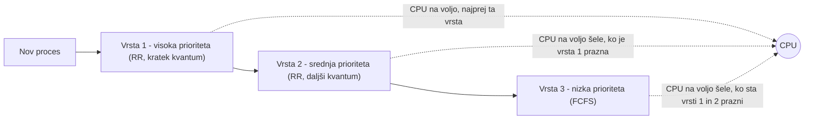

Proces se razvrsti v eno izmed vrst ob prihodu (glede na vrsto posla) in ostane v njej do konca izvajanja - med vrstami ni prehajanja, zato gre za **statično** razvrščanje. Med vrstami velja stroga prioriteta: proces iz nižje vrste dobi CPU šele, ko so vse vrste z višjo prioriteto prazne, kar lahko pri slabi izbiri parametrov privede do pomanjkanja procesov v nižjih vrstah.

### Dinamično prehajanje med vrstami (multilevel feedback queue)

Nadgradnja prejšnjega pristopa dovoljuje, da proces med izvajanjem **prehaja med vrstami** - s tem razvrščevalnik dinamično prilagaja prioriteto glede na dejansko obnašanje procesa. Tipična izvedba: vsak proces začne v vrsti z najvišjo prioriteto in najkrajšim kvantumom; če se v dodeljenem kvantumu ne zaključi, se premakne v naslednjo vrsto z nižjo prioriteto in daljšim kvantumom:

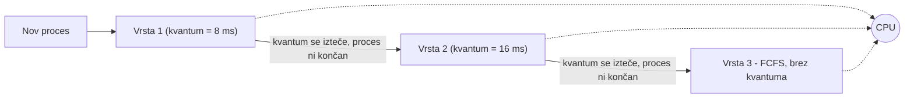

Procesorsko zahtevni procesi tako postopoma "potonejo" v nižje vrste z daljšimi kvantumi (manj preklopov konteksta), kratki interaktivni procesi pa ostanejo v zgornji vrsti in dobijo CPU hitro, kar zagotavlja dober odzivni čas. Parametri algoritma (število vrst, dolžina kvantumov po vrstah, način napredovanja med vrstami) so prilagodljivi in jih določi OS.

### Razvrščevalni algoritmi v Linuxu

Linux loči med realnočasovnimi in navadnimi procesi:

- **SCHED_FIFO** - realnočasovno razvrščanje brez kvantuma: proces teče, dokler se ne zaključi, se ne zablokira ali ga ne prekine proces z višjo prioriteto.
- **SCHED_RR** - realnočasovna različica krožne prioritete - enako kot SCHED_FIFO, le da ima vsak proces na voljo časovno rezino.
- **SCHED_OTHER** - privzeti algoritem za navadne (nerealnočasovne) procese.

Starejše različice jedra (do verzije 2.6) so za SCHED_OTHER uporabljale t. i. **O(1) razvrščevalnik** - procese je razvrščal v strukturo s polji aktivnih in iztečenih procesov, urejenih po prioriteti, z bitno masko za hitro iskanje neprazne vrste najvišje prioritete, zaradi česar je bil čas izbire naslednjega procesa neodvisen od njihovega števila (od tod ime O(1)). Od jedra 2.6.23 naprej je ta pristop zamenjal **popolnoma pravičen razvrščevalnik (CFS - Completely Fair Scheduler)**, ki procese hrani v **rdeče-črnem drevesu**, urejenem po porabljenem procesorskem času - vedno izbere proces z najmanj porabljenega časa (skrajno levo vozlišče), kar zagotavlja, da imajo vsi procesi dolgoročno enakomeren dostop do CPU.

### Razvrščevalni algoritmi v Windows

Windows uporablja prioritetno razvrščanje s 32 nivoji prioritete, razdeljenimi v dva razreda:

- **realnočasovni razred** (nivoji 16-31) - fiksne prioritete, namenjene procesom s strogimi časovnimi zahtevami,
- **spremenljivi razred** (nivoji 0-15) - OS prioriteto procesa dinamično prilagaja (npr. jo začasno zviša procesu, ki pride iz ozadja v ospredje, ali po prebujanju iz čakanja na V/I), znotraj vsakega nivoja pa se procesi razvrščajo krožno (RR).

## Dvonivojsko in trinivojsko razvrščanje poslov

### Dvonivojsko razvrščanje

Pri **dvonivojskem razvrščanju** poslov ločimo razvrščanje poslov od razvrščanja procesov:

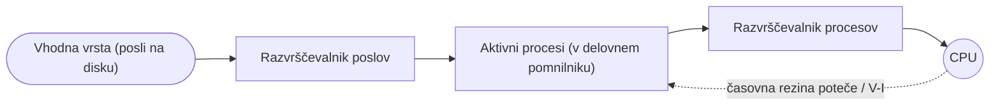

**Razvrščevalnik poslov** izbira med posli, čakajočimi v vhodni vrsti na disku, in jih sprejme med aktivne procese v delovnem pomnilniku - s tem določa **stopnjo multiprogramiranja** (koliko procesov je hkrati naloženih v pomnilniku). **Razvrščevalnik procesov** nato med že aktivnimi procesi izbira, kateri bo dobil CPU (to je razvrščanje, obravnavano v prejšnjem poglavju).

### Trinivojsko razvrščanje

Če je procesov v pomnilniku preveč (npr. ker mnogi čakajo na počasno V/I), lahko stopnja multiprogramiranja postane previsoka in sistem se upočasni. Rešitev je dodaten, **vmesni razvrščevalnik**, ki nadzoruje trenutno stopnjo multiprogramiranja in lahko aktiven proces začasno odstrani iz pomnilnika (ga **odloži**), s čimer sprosti prostor za druge procese, kasneje pa ga spet vrne med aktivne:

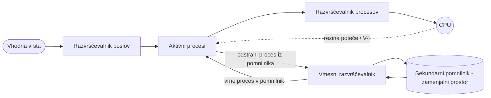

Odloženi proces lahko OS obravnava na dva načina:

- **podatke pusti v delovnem pomnilniku** - hitreje ga je spet aktivirati, a še vedno zaseda pomnilnik, zato ne reši težave s prostorom,
- **podatke prestavi v zamenjalni prostor (swap) na sekundarnem pomnilniku** - sprosti delovni pomnilnik v celoti, a je ponovna aktivacija počasnejša, ker je proces treba prenesti nazaj.

## Sinhronizacija med procesi

### Problem kritičnega odseka

Kadar več procesov (ali niti) dostopa do skupnih podatkov, lahko pri sočasnem izvajanju pride do **tekmovalnega pogoja** (*race condition*) - končni rezultat je odvisen od vrstnega reda izvajanja, kar lahko povzroči nepravilno delovanje. Klasičen zgled je problem **proizvajalca in porabnika**: proizvajalec vstavlja elemente v skupni medpomnilnik, porabnik pa jih jemlje iz njega; če oba hkrati (brez sinhronizacije) spreminjata skupno spremenljivko, ki šteje število elementov v medpomnilniku, lahko zaradi prepletanja strojnih ukazov štetje postane napačno.

Del kode, kjer proces dostopa do skupnih podatkov, imenujemo **kritični odsek**. Vsak proces mora pred vstopom vanj izvesti **vstopni protokol** in po izhodu **izstopni protokol**, tako da rešitev problema kritičnega odseka izpolnjuje tri pogoje:

1. **medsebojno izključevanje** - če je en proces v svojem kritičnem odseku, noben drug proces ne sme hkrati izvajati svojega kritičnega odseka,
2. **napredovanje** - če noben proces trenutno ni v kritičnem odseku, se odločitev, kateri proces bo vanj vstopil naslednji, ne sme odlašati v nedogled, in v to odločanje smejo biti vključeni le procesi, ki čakajo na vstop,
3. **omejeno čakanje** - mora obstajati zgornja meja, kolikokrat lahko drugi procesi vstopijo v svoj kritični odsek, preden je zahtevi čakajočega procesa ugodeno (preprečuje izstradanje).

### Petersonova rešitev

**Petersonova rešitev** rešuje problem kritičnega odseka za dva procesa (\(P_0\) in \(P_1\)) s pomočjo dveh skupnih spremenljivk: polja zastavic `zastavica[i]` (ali proces \(i\) želi vstopiti v kritični odsek) in spremenljivke `na_vrsti` (kateri proces je na vrsti za vstop):

```
# proces Pi (drugi proces je Pj, i != j)
repeat
    zastavica[i] := true
    na_vrsti := j
    while (zastavica[j] and na_vrsti = j) do nič

    # kritični odsek

    zastavica[i] := false

    # preostanek programa
until false
```

Proces, preden vstopi v kritični odsek, najavi svojo namero (`zastavica[i] := true`) in vljudno prepusti prednost drugemu (`na_vrsti := j`); čaka le, če drugi proces tudi želi vstopiti in je dejansko on na vrsti. Rešitev izpolnjuje vse tri pogoje, a deluje izključno za natanko dva procesa.

### Bakery algoritem

**Bakery algoritem** (algoritem "pekarne") posploši idejo na poljubno število \(n\) procesov po zgledu sistema za izdajo številk v pekarni: vsak proces, preden vstopi v kritični odsek, si vzame svojo zaporedno številko, nato pa na vrsto pride tisti s trenutno najnižjo številko:

```
# proces Pi
repeat
    izbira[i] := true
    zaporedna_številka[i] := max(zaporedna_številka[0], ..., zaporedna_številka[n-1]) + 1
    izbira[i] := false

    for j := 0 to n-1 do
        while izbira[j] do nič
        while zaporedna_številka[j] != 0 and
              (zaporedna_številka[j], j) < (zaporedna_številka[i], i) do nič

    # kritični odsek

    zaporedna_številka[i] := 0

    # preostanek programa
until false
```

Primerjava `(zaporedna_številka[j], j) < (zaporedna_številka[i], i)` pomeni: proces z nižjo zaporedno številko gre naprej, ob enaki številki (do katere lahko pride, ker si procesi številke določajo neatomarno) pa odloča nižji identifikator procesa (PID) - s tem je vrstni red vedno enolično določen, kar algoritmu zagotavlja izpolnjevanje vseh treh pogojev problema kritičnega odseka tudi za poljubno število procesov.

### Strojni pripomočki za sinhronizacijo

Poleg programskih rešitev (Peterson, Bakery algoritem) lahko za zagotavljanje medsebojnega izključevanja uporabimo tudi strojne mehanizme:

- **Nadzorovanje prekinitev** - proces na začetku kritičnega odseka onemogoči prekinitve, na koncu pa jih ponovno omogoči; dokler so prekinitve onemogočene, procesa ne more prekiniti noben drug proces. Rešitev je smiselna v **enoprocesorskih** sistemih in le za zelo kratke kritične odseke (hitri posegi), saj se medtem ignorirajo vse prekinitve (npr. tudi premik miške). V **večprocesorskih** sistemih je neuporabna - vsi procesorji bi morali prekinitve onemogočiti sočasno, kar bi bilo zaradi sporočanja med njimi časovno zelo potratno, poleg tega bi med usklajevanjem lahko prišlo do izgube prekinitev.
- **Atomarni (nedeljivi) strojni ukazi** - procesorji imajo na voljo posebne ukaze, ki jih ni mogoče prekiniti (trajajo en sam dostavno-izvršilni cikel):
  - **preveri_in_postavi** (*test-and-set*) - preveri vrednost logične spremenljivke in jo nato postavi na novo vrednost, vse v enem nedeljivem koraku,
  - **izmenjaj** (*swap*) - zamenja vrednosti dveh spremenljivk oz. registrov.

  Ta dva ukaza (ki ju strojno podpira procesor) sta osnova za implementacijo učinkovitejših sinhronizacijskih mehanizmov tudi v večprocesorskih sistemih.

### Semaforji

**Semafor** je najbolj razširjen sinhronizacijski mehanizem - celoštevilska spremenljivka, katere vrednost ureja dostop do kritičnega odseka. Do semaforja nikoli ne dostopamo neposredno, temveč izključno preko dveh atomarnih (nedeljivih) operacij:

```
čakaj(S):        signaliziraj(S):
while S ≤ 0       S := S + 1;
  do no_op;
S := S - 1;
```

Ti dve operaciji postavljamo paroma okrog kritičnega odseka - `čakaj` na vstopu, `signaliziraj` na izstopu:

```
repeat
    čakaj(izključi)
    kritični odsek
    signaliziraj(izključi)
    preostanek programske sekcije
until false
```

Ločimo dva tipa semaforjev:

- **binarni semafor** - zavzame le vrednosti 0 (zaprto, "rdeče") in 1 (odprto, "zeleno"); uporablja se neposredno za medsebojno izključevanje,
- **števni semafor** - lahko šteje poljubno število hkratnih dostopov, uporaben je, kadar imamo več instanc istega vira (npr. semafor za 5 tiskalnikov inicializiramo na vrednost 5 - vsak proces, ki začne tiskati, ga dekrementira, šesti proces pa mora počakati, da se eden od petih sprosti).

Zgornja osnovna implementacija je t. i. **vrtavka** (*busy waiting*) - proces, ki čaka na zaprt semafor, ves čas aktivno preverja njegovo vrednost v zanki in s tem zaseda procesor brez koristnega dela. V enoprocesorskih sistemih je to še posebej neučinkovito (edini procesor ne naredi ničesar koristnega, dokler se ne izteče časovna rezina čakajočega procesa).

Učinkovitejša implementacija se temu izogne tako, da proces, ki naleti na zaprt semafor, sam **zapusti procesor** in se uvrsti v vrsto blokiranih procesov:

```
type S = record {semafor}
    vrednost: integer;
    L: list of procesi;
end;

čakaj(S):        S.vrednost := S.vrednost - 1;
                 if S.vrednost < 0 then begin
                    dodaj ta proces P v S.L;
                    blokiraj;    {block}
                 end;

signaliziraj(S): S.vrednost := S.vrednost + 1;
                 if S.vrednost ≤ 0 then begin
                    odstrani proces P iz vrste S.L;
                    sprosti(P);   {wakeup}
                 end;
```

Vrsta blokiranih procesov `L` je realizirana kot kazalčno povezan seznam PCB-jev. Operacija `signaliziraj` ob prebujanju običajno izbere proces po pravilu FIFO (tistega, ki je čakal najdlje). Semaforji sami po sebi zagotavljajo le pogoj medsebojnega izključevanja - za preostala dva pogoja problema kritičnega odseka (napredovanje, omejeno čakanje) mora poskrbeti programer z ustrezno implementacijo.

### Navzkrižno blokiranje (popolni zastoj)

Nepazljiva uporaba semaforjev lahko povzroči **popolni zastoj** (*deadlock*, navzkrižno blokiranje) - stanje, v katerem se noben od vpletenih procesov ne more več izvajati naprej, ker vsak čaka na vir, ki ga trenutno drži drug čakajoč proces (podobno kot pri dveh ljudeh za mizo, od katerih vsak drži en pribor in čaka na drugega, da izpusti svojega).

Zgled z dvema semaforjema `S` in `Q` (npr. dostop do baze podatkov in do tiskalnika):

```
Proces Pi                    Proces Pj
čakaj(S);
                              čakaj(Q);
čakaj(Q);   ← zastoj          čakaj(S);   ← zastoj
  ⋮                             ⋮
signaliziraj(S);             signaliziraj(Q);
signaliziraj(Q);             signaliziraj(S);
```

Proces \(P_i\) najprej zasede `S`, nato pride do preklopa; proces \(P_j\) medtem zasede `Q`. Ko \(P_i\) znova pride na vrsto, poskuša zasesti še `Q`, ki pa je zaseden - zablokira se. Enako se zgodi \(P_j\), ko poskusi zasesti `S`. Oba procesa zdaj čakata drug na drugega v nedogled. Do zastoja lahko pride zaradi same zasnove OS ali zaradi nerodne implementacije sinhronizacije s strani programerja; moderni OS zastoje praviloma rešujejo s pristopi za odkrivanje in odpravljanje zastojev (IDC).

### Zagotavljanje atomarnosti operacij nad semaforjem

Da sta operaciji `čakaj` in `signaliziraj` sami res nedeljivi, moramo poskrbeti za sinhronizacijo tudi znotraj njiju:

- v **enoprocesorskih** sistemih med izvajanjem teh dveh (kratkih) operacij preprosto onemogočimo prekinitve in jih po izvedbi spet omogočimo,
- v **večprocesorskih** sistemih onemogočanje prekinitev ne zadostuje, zato `čakaj` in `signaliziraj` obravnavamo kot svoja lastna kritična odseka in ju zaščitimo z enim izmed programskih mehanizmov (npr. Bakery algoritmom).

### Monitorji

**Monitor** je visokonivojski sinhronizacijski gradnik, ki deluje podobno kot razred - vsebuje lokalne spremenljivke (dostopne izključno preko njegovih lastnih procedur) in množico procedur, ki jih lahko kličejo procesi od zunaj:

```
type monitorjevo_ime monitor
    deklaracija spremenljivk
    procedure P1(...);
        begin ... end;
    procedure P2(...);
        begin ... end;
        ⋮
    procedure Pn(...);
        begin ... end;
    begin
        inicializacijski del
    end.
```

Medsebojno izključevanje je pri monitorju privzeto zagotovljeno (vstopni sinhronizacijski del kode avtomatsko vgradi prevajalnik) - znotraj monitorja lahko naenkrat izvaja kodo le en proces.

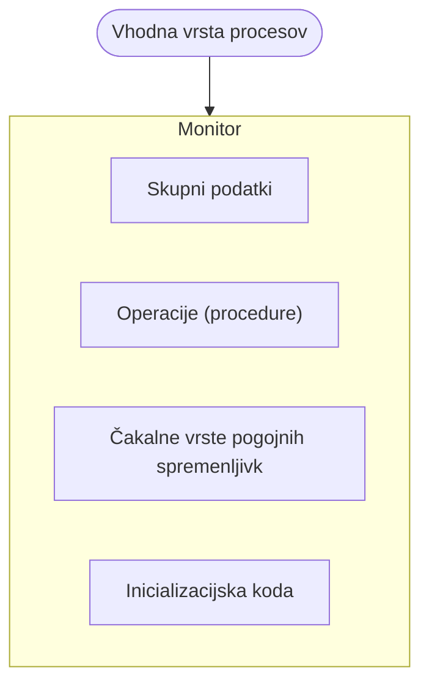

Osnovna različica monitorja ima lahko težavo: proces lahko znotraj monitorja "obvisi", ker ne more nadaljevati (npr. proizvajalec znotraj monitorja naleti na poln medpomnilnik), medtem pa noben drug proces (npr. potrošnik, ki bi medpomnilnik sprostil) ne more vstopiti v monitor, ker je ta zaseden. Rešitev so **pogojne spremenljivke** - do njih lahko dostopamo le preko dveh atomarnih operacij, ki se prav tako imenujeta `čakaj` in `signaliziraj`, a imajo drugačen pomen kot pri semaforjih (pogojna spremenljivka nima shranjene vrednosti, temveč je zgolj čakalna vrsta). Če je proces blokiran na pogojni spremenljivki, se sploh ne šteje, da zaseda monitor.

Ko proces s klicem `signaliziraj` prebudi na pogojni spremenljivki blokiran proces, se pojavi vprašanje, kateri od obeh naj dobi prednost v monitorju:

- **rešitev po Hoareju** - prednost takoj dobi ravnokar zbujeni (prej blokirani) proces, proces, ki je klical `signaliziraj`, pa počaka,
- **rešitev po Hansenu** - proces, ki je klical `signaliziraj`, se najprej izvede do konca (oz. do izhoda iz monitorja) in šele tedaj zbudi čakajoči proces.

Za problem proizvajalca in porabnika je smiselnejša rešitev po Hansenu.

## Upravljanje s pomnilnikom

### Definicija problema

Pri upravljanju s pomnilnikom naletimo na več problemov:

- naslovni prostor CPU ni nujno v celoti pokrit s fizičnim pomnilnikom - **logični naslovni prostor** je običajno bistveno večji od dejanske količine RAM-a, OS pa mora omogočiti izvajanje programov, ki so po velikosti lahko večji, kot je razpoložljivega RAM-a,
- proces je v pomnilniku lahko naložen **nesklenjeno** (deli procesa niso nujno zaporedni), vendar mora CPU kljub temu videti naslovni prostor procesa kot sklenjen - za to skladnost poskrbi OS,
- procesom je treba onemogočiti poseg izven njihovega lastnega naslovnega prostora (**zaščita**),
- upravljanje s pomnilnikom mora biti hitro in učinkovito.

### Osnovni princip upravljanja s pomnilnikom

RAM je sestavljen iz več pomnilniških modulov, vsak s svojo kapaciteto. Pri **preprostih konfiguracijah** za prevajanje naslova zadostuje **naslovna logika**, ki iz naslova, ki ga pošlje procesor, določi, kateri pomnilniški modul je naslovljen in kateri naslov znotraj tega modula je mišljen (npr. z delitvijo bitov naslova na zgornji in spodnji del):

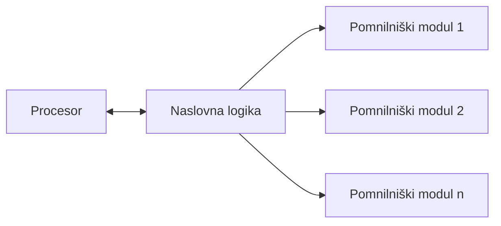

Moderni računalniški sistemi so bistveno bolj zapleteni, zato gola naslovna logika ne zadostuje - potrebujejo strojno-programski kompleks za upravljanje s pomnilnikom, pri čemer je programski del tega kompleksa implementiran znotraj OS.

### Odlaganje procesov

Do situacije, ko je treba sprostiti pomnilnik, pride iz dveh razlogov: izvajamo proces, za katerega trenutno ni dovolj prostega pomnilnika, ali pa je stopnja multiprogramiranja postala previsoka, zaradi česar je zmogljivost sistema upadla. Rešitev je **odlaganje procesov** - proces začasno prestavimo iz delovnega pomnilnika na **odlagalni prostor**, ki je običajno implementiran na sekundarnem pomnilniku (disku):

```mermaid
flowchart LR
    os8a_mem["Pomnilnik (RAM) - OS + uporabniški prostor"] -->|odlaganje Pi| os8a_disk[("Pomožni pomnilnik - odlagalni prostor")]
    os8a_disk -->|vlaganje Pj| os8a_mem
```

Odlaganje in vlaganje procesa sta časovno zelo draga, saj je dostopni čas do RAM-a reda velikosti 70 ns, do diska pa bistveno počasnejši - čas odlaganja/vlaganja se zato pogosto prišteje k času preklopa konteksta. OS v tipičnih sistemih odlagalni prostor implementira na enega od dveh načinov: Windows ima posebno odlagalno zbirko (datoteko), Unix sistemi pa posebno odlagalno particijo, namenjeno izključno odlaganju. Preden proces odložimo, moramo vedno preveriti, v kakšnem stanju se nahaja - procesa, ki je trenutno v komunikacijskem stanju, ne smemo odložiti. Vsaka zahteva po dodelitvi ali sprostitvi pomnilnika gre skozi sistemske klice, saj mora imeti OS ves čas popoln nadzor nad dogajanjem v RAM-u.

### Upravljanje s stalnimi particijami

Najpreprostejši način upravljanja s pomnilnikom za večprogramske OS je delitev delovnega pomnilnika na **stalne particije**. Razdelitev je stalna in se izvede že ob namestitvi OS - vsaka kasnejša sprememba zahteva ponovno namestitev. Vsaka particija dobi svojo oznako in lastnosti (npr. prioriteto), proces pa se lahko nahaja le v eni particiji in med izvajanjem prevzame njeno prioriteto; v kateri particiji naj se program izvaja, določi uporabnik. Nalagalnik je procese v posamezno particijo nalagal sklenjeno (zaporedno).

Prednost tega pristopa je izredno malo režijskih posegov OS, zato je upravljanje hitro. Slabost pa je slaba izkoriščenost računalniških virov: če bi proces potreboval prostor v particiji, ki je že polna, se ni smel izvesti v kateri drugi (sicer prosti) particiji - kljub zadostni skupni količini prostega RAM-a ga ni bilo mogoče izkoristiti. Ta slabost je spodbudila razvoj bolj sofisticiranih načinov upravljanja s pomnilnikom.

### Zunanja in notranja razdrobljenost

Pri vsakem upravljanju s pomnilnikom (ne glede na pristop) naletimo na dva stalna problema:

**Zunanja razdrobljenost** nastane, ker se procesi nalagajo in zaključujejo ob naključnih trenutkih - v pomnilniku zato sčasoma nastanejo prosti odseki, raztreseni med zasedenimi (podobno kot luknjast sir). Tudi če je skupna količina prostega pomnilnika zadostna, lahko velik proces ne najde dovolj velikega sklenjenega prostega odseka. Do tega problema pride ne glede na izbrano strategijo nalaganja. Poznamo tri osnovne strategije:

- **prvo prileganje** - OS preišče proste odseke po vrsti in izbere prvega, ki je dovolj velik; zaradi razdrobljenosti po tem pravilu sčasoma izgubimo približno tretjino pomnilnika,
- **najboljše prileganje** - izbere se prosti odsek, ki je po velikosti najbližje potrebam procesa (po vstavitvi ostane najmanj neporabljenega prostora),
- **najslabše prileganje** - izbere se največji prosti odsek (ideja je, da bo preostanek po vstavitvi še vedno dovolj velik za morebitne druge procese).

Problem zunanje razdrobljenosti bi teoretično lahko rešili z **zgoščevanjem** (defragmentacijo) - vse procese bi začasno odložili na odlagalni prostor, nato pa jih nazaj v RAM zapisali sklenjeno, brez vmesnih praznih mest. V praksi je ta operacija časovno tako potratna, da je neuporabna, zato se zgoščevanje dejansko ne izvaja.

**Notranja razdrobljenost** nastane, ker OS procesu namenoma dodeli nekoliko več pomnilnika, kot ga je dejansko zahteval (cel prosti odsek oz. kasneje cel okvir) - majhnih preostalih prostih odsekov se namreč ne izplača voditi v tabeli prostega pomnilnika, saj je verjetnost, da bi vanje kdaj kaj vstavili, majhna, bi pa OS vseeno izgubljal čas z njihovim preverjanjem ob vsakem iskanju prostora za nov proces. Cena te rešitve je izguba nekaj sicer razpoložljivega pomnilnika.

### Delitev na strani (paging)

Skupna ideja vseh modernih načinov upravljanja s pomnilnikom je, da proces razrežemo na manjše dele, ki jih nato ločeno naložimo v RAM - za razliko od starih sistemov, ki so proces vedno nalagali sklenjeno, od najnižjega do najvišjega naslova, kar je bil njihov glavni problem (in vzrok razdrobljenosti).

Pri **delitvi na strani** (*paging*) logični naslovni prostor razrežemo na enako velike dele, imenovane **strani** (*page*) - te so tipično velike nekaj kB (npr. 4 kB v Windowsu) in so fiksne velikosti. Fizični pomnilnik razdelimo na enako velike **okvirje** (*frame*) - izraz "stran" torej uporabljamo za dele logičnega naslovnega prostora, "okvir" pa za ustrezne dele RAM-a. Vsaka stran se naloži sklenjeno v poljuben prost okvir, zaradi česar so strani istega procesa po fizičnem pomnilniku lahko popolnoma razmetane - procesor pa kljub temu ves čas "misli", da je njegov naslovni prostor sklenjen, saj naslavlja izključno logični naslovni prostor.

Ob prevajanju in povezovanju programa (nastanku .exe datoteke) prevajalnik in povezovalnik pripravita kodo tako, kot bi se izvajala od logičnega naslova 0 naprej; nalagalnik nato posamezne strani dejansko naloži v proste okvirje v RAM-u. Vsak proces ob nalaganju dobi svojo **tabelo strani** (preslikovalno tabelo), ki jo napolni nalagalnik - ta tabela se nahaja v RAM-u, iz PCB-ja procesa pa imamo nanjo kazalec. Vsaka vrstica tabele strani pove, v kateri okvir je naložena pripadajoča stran, poleg tega pa hrani dodatne bite (med njimi bit veljavnosti).

Logični naslov, dolg \(n\) bitov, je sestavljen iz dveh delov: **številke strani** \(p\) (zgornjih \(n-m\) bitov) in **odmika znotraj strani** \(d\) (spodnjih \(m\) bitov). Če je npr. \(n = 32\) in so strani velike 4 kB (\(2^{12}\) B), je \(m = 12\) in \(n - m = 20\).

### Pretvorba logičnega naslova v fizični naslov

```mermaid
flowchart LR
    os8c_cpu["CPU"] --> os8c_log["logični naslov (p, d)"]
    os8c_log --> os8c_pt["Tabela strani"]
    os8c_pt --> os8c_frame["okvir (f)"]
    os8c_frame --> os8c_phys["fizični naslov (f, d)"]
    os8c_phys --> os8c_mem["Delovni pomnilnik"]
```

Strojni pripomočki ob vsakem dostopu do pomnilnika naslov razdelijo na \(p\) in \(d\). Številka strani \(p\) služi kot indeks v tabelo strani pripadajočega procesa, kjer se najprej preveri bit veljavnosti - če stran ni veljavna, se ujame napaka in izvede ustrezna prekinitvena rutina. Če je stran veljavna, se iz tabele prebere številka okvirja \(f\), iz katere se izračuna začetek tega okvirja v RAM-u; na koncu se temu naslovu samo prišteje še odmik \(d\) in dobimo fizični naslov iskanega bajta. Odmika ni treba posebej preverjati, saj je z \(m\) biti navzgor strogo omejen in nikoli ne "pade čez" mejo strani.

### Tabela okvirov

Poleg tabele strani (ki jo ima vsak proces svojo) OS vzdržuje tudi **tabelo okvirov** - eno samo, skupno tabelo za ves fizični pomnilnik, s po eno vrstico za vsak okvir v RAM-u. Zanj hrani podatek, ali je okvir prost ali zaseden, in če je zaseden, kateremu procesu (PID-u) pripada. S pomočjo te tabele ima OS ves čas popoln pregled nad tem, kateri deli pomnilnika so prosti in kateri zasedeni.

### Pohitritev z asociativnim pomnilnikom (TLB)

Osnovna izvedba delitve na strani podvoji dostopni čas do pomnilnika, saj je za vsak dostop potrebni dve branji RAM-a - eno za branje tabele strani (ki je sama v RAM-u) in eno za dejanski podatek. Rešitev je strojna: vpeljemo **asociativni pomnilnik** (hiter predpomnilnik, znan tudi kot TLB), v katerega shranimo kopije nekaterih vrstic tabele strani (od nekaj deset do nekaj tisoč vrstic: številka strani, številka okvirja in dodatni biti). Posebnost asociativnega pomnilnika je, da se iskana številka strani naenkrat primerja z vsemi vpisi hkrati.

```mermaid
flowchart LR
    os8d_cpu["CPU"] --> os8d_p["številka strani (p)"]
    os8d_p --> os8d_tlb{"Iskanje v TLB (asociativni pomnilnik)"}
    os8d_tlb -->|zadetek| os8d_frame["okvir (f)"]
    os8d_tlb -->|zgrešitev| os8d_pt["Tabela strani v RAM-u"]
    os8d_pt --> os8d_frame
    os8d_pt -.->|vpis kopije vrstice| os8d_tlb
    os8d_frame --> os8d_phys["fizični naslov (f, d)"]
    os8d_phys --> os8d_mem["Delovni pomnilnik"]
```

Če je iskana stran v TLB-ju (zadetek), okvir dobimo takoj; če je ni (zgrešitev), gremo po podatek v tabelo strani v RAM-u in kopijo te vrstice po navadi zapišemo tudi v TLB za morebitno kasnejšo ponovno uporabo (če je TLB že poln, eno od obstoječih vrstic zamenjamo). Verjetnost zadetka je danes praviloma nad 90 %, kar dostopni čas, ki bi bil brez TLB-ja dvakraten, zmanjša na približno 1,1-kratnik - torej le okoli 10 % povečanje. Brez asociativnega pomnilnika bi bila delitev na strani zaradi podvojenega dostopnega časa praktično neuporabna.

### Zaščita pomnilnika in solastniške strani

Vsaki strani so poleg bita veljavnosti pridruženi še dodatni biti za zaščito: samo branje, branje in pisanje, samo izvajanje (če ta bit ni postavljen, se ob poskusu izvajanja kode na dani strani sproži prekinitev), ter **bit spremembe** (*dirty bit*) - ta se ob nalaganju strani postavi na 0, strojna oprema pa ga postavi na 1, brž ko proces na to stran kaj zapiše. Ker tabele strani niso nujno alocirane v svoji največji možni velikosti, imajo sodobni procesorji tudi poseben register z dolžino tabele strani.

OS podpira tudi **solastniške strani** - več procesov si lahko deli eno in isto fizično stran (npr. skupno kodo brskalnika): en proces jo dejansko naloži v okvir, preostali procesi pa si ta okvir le zabeležijo v svoji lastni tabeli strani (s postavljenim bitom solastništva). Solastniške strani se smejo med izvajanjem le brati - njihovo spreminjanje je strogo prepovedano, saj bi sicer sprememba vplivala na vse procese, ki si stran delijo.

### Segmentiranje

**Segmentiranje** je po zasnovi zelo podobno delitvi na strani, le da logičnega naslovnega prostora ne razrežemo šablonsko na enako velike kose, temveč na **smiselne podenote** - **segmente**. Segmenti nastanejo že na izvornem nivoju (npr. en segment je glavni program, drugi funkcija 1, tretji funkcija 2 ...) in jih določi prevajalnik oz. sistemska programska oprema; podatke o njih shrani v izvedljivo datoteko. Za razliko od strani so segmenti lahko poljubno velikih - njihove velikosti vnaprej ne poznamo. Segment se v fizični pomnilnik naloži sklenjeno, v poljuben prost del pomnilnika - posamezni segmenti istega procesa so po RAM-u lahko razmetani enako kot strani pri pagingu.

Namesto tabele strani ima vsak proces **tabelo segmentov**, ki jo napolni nalagalnik in se nahaja v RAM-u (PCB nanjo kaže s kazalcem). Poleg dodatnih bitov za zaščito in bita veljavnosti vsebuje vsaka vrstica še nalagalni naslov (osnovo - kje je segment naložen v RAM-u) in dolžino segmenta. OS vedno podpira bodisi paging bodisi segmentiranje - nikoli obojega hkrati.

Pretvorba logičnega naslova je na začetku enaka kot pri pagingu: naslov je sestavljen iz številke segmenta \(s\) (zgornji biti) in odmika \(d\) znotraj segmenta (spodnji biti). Razlika je v dodatnem koraku: ker strani vedno uporabljajo enako velikost \(2^m\) in zato odmik nikoli ne more "pasti čez" mejo strani, pri segmentih tega ne moremo privzeti - segmenti so lahko poljubno veliki, zato moramo pred seštevanjem eksplicitno preveriti, ali je odmik manjši od dolžine segmenta:

```mermaid
flowchart LR
    os9a_cpu["CPU"] --> os9a_log["logični naslov (s, d)"]
    os9a_log --> os9a_st["Tabela segmentov"]
    os9a_st --> os9a_valid{"Segment veljaven?"}
    os9a_valid -->|ne| os9a_err["Prekinitev - terminacija procesa"]
    os9a_valid -->|da| os9a_bound{"odmik d < dolžina segmenta?"}
    os9a_bound -->|ne| os9a_err2["Napačen naslov - terminacija procesa"]
    os9a_bound -->|da| os9a_phys["fizični naslov = osnova + d"]
    os9a_phys --> os9a_mem["Delovni pomnilnik"]
```

Če segment ni veljaven, procesor sproži strojno prekinitev, OS pa proces terminira. Če je segment veljaven, a odmik presega njegovo dolžino, gre prav tako za napako (poseg izven segmenta) in proces se terminira. Šele če je odmik znotraj dovoljene dolžine, se fizični naslov izračuna kot vsota osnove segmenta in odmika. Asociativni pomnilnik, zaščita (dodatni biti za branje/pisanje/izvajanje, umazani bit), register z dolžino tabele segmentov in solastniški segmenti delujejo po povsem enaki logiki kot pri pagingu - le besedo "stran" povsod nadomestimo z "segment".

### Ostranjevanje vs. segmentiranje

Oba moderna pristopa k upravljanju s pomnilnikom imata svoje prednosti in slabosti:

- **preverjanje, ali odmik pade izven meje** - pri pagingu je nepotrebno (vse strani so enako velike, zato odmik nikoli ne pade čez), pri segmentiranju pa je nujno (segmenti so poljubno veliki) in porabi dodaten procesorski čas,
- **zunanja razdrobljenost** - pojavlja se pri obeh pristopih, a je pri pagingu obvladljiva, saj so prazni "koti" vedno večkratniki velikosti enega okvirja in vanje vedno nekaj spravimo; pri segmentiranju so prosti prostori različnih velikosti, zato zunanja razdrobljenost ostaja resen problem,
- **notranja razdrobljenost** - pri segmentiranju je načeloma ne vnaša samo segmentiranje (proces dobi natanko toliko prostora, kot ga segment potrebuje), pri pagingu pa jo uvaja sam princip delitve na enako velike strani (zadnja stran procesa je redko kdaj točno polna),
- **razdelitev logičnega naslovnega prostora** - paging reže naslovni prostor povsem mehansko na enako velike kose, zato lahko podatki, ki logično sodijo skupaj, pri izvajanju povzročajo več "premetavanja" (več režije); segmentiranje po drugi strani reže naslovni prostor na smiselne enote, znotraj katerih so povezani podatki res skupaj, kar pomeni manj premetavanja.

Ker vsak pristop reši drugačen nabor problemov, nekateri procesorji (npr. Intel) prednosti obeh združijo: logični naslovni prostor najprej razdelijo na segmente, nato pa vsak segment dodatno na strani. Logični naslov je v tem primeru sestavljen iz treh delov: številke segmenta, številke strani in odmika znotraj strani.

### Virtualni pomnilnik

**Virtualni pomnilnik** je navidezna razširitev fizičnega pomnilnika - prostor, ki je sicer na sekundarnem pomnilniku, a procesorju "izgleda", kot da ima računalnik na voljo delovni pomnilnik v velikosti celotnega virtualnega naslovnega prostora. Virtualni pomnilnik upravljamo na enak način kot RAM (bodisi s pagingom bodisi s segmentiranjem - če fizični pomnilnik uporablja enega od pristopov, mora enakega ponujati tudi virtualni), smiselno pa je, da je po velikosti večji od fizičnega pomnilnika. Program se najprej v celoti naloži v virtualni pomnilnik.

Virtualni pomnilnik je danes standardna sestavina računalniških sistemov, uveden pa je bil zato, ker je nalaganje celotnega programa v fizični pomnilnik pogosto potratno:

- **veliko programske kode je namenjene izjemnim situacijam** - von Neumannova arhitektura predpostavlja, da je cel program naložen v pomnilniku, a pri resnih programih je lahko tudi polovica kode namenjene lovljenju redkih napak oz. izjem, ki se morda nikoli ne izvedejo - potratno jih je imeti ves čas naložene, namesto da bi jih naložili šele, ko jih dejansko potrebujemo,
- **predimenzionirane podatkovne strukture** - če je v kodi rezervirano polje za 200 vrstic, dejansko pa jih uporabimo le 7, je nesmiselno imeti v RAM-u ves čas naloženih vseh 200,
- **princip lokalnosti** - med izvajanjem programa se naslednji dostopi praviloma nahajajo blizu trenutne lokacije (programski števec se giblje lokalno); dovolj je torej imeti v RAM-u naložen le tisti manjši del, kjer se trenutno "nahajamo", ob skoku na drug del kode pa naložimo le ta del.

Nalagalnik najprej naloži program v celoti v virtualni (sekundarni) pomnilnik. Ker ga po von Neumannovi arhitekturi lahko izvajamo le, ko je v fizičnem pomnilniku, potrebujemo vmesni mehanizem, ki iz virtualnega pomnilnika v RAM sproti nalaga le tiste dele, ki jih trenutno potrebujemo (in po potrebi nepotrebne dele vrača nazaj):

```mermaid
flowchart LR
    os9b_vp[("Virtualni pomnilnik (sekundarni pomnilnik)")] -->|nalaganje potrebnih strani| os9b_ram["Delovni pomnilnik (RAM)"]
    os9b_ram -->|izmet nepotrebnih strani| os9b_vp
```

Korist je dvojna: za vsak proces porabimo manj delovnega pomnilnika, zato jih lahko hkrati naložimo več (višja stopnja multiprogramiranja), poleg tega pa lahko izvajamo tudi programe, ki so teoretično večji od razpoložljivega fizičnega pomnilnika. Virtualni pomnilnik je brez **nalaganja na zahtevo** v osnovi neuporaben - ti dve tehniki sta nujno povezani. Ločimo **čisto nalaganje na zahtevo** (v RAM se ob zagonu naloži samo tabela strani procesa, morebiti prva stran, vse ostalo pa šele ob dejanski potrebi) in **nečisto nalaganje na zahtevo** (vnaprej se v RAM naloži že nekaj strani procesa, ne le ena).

### Nalaganje strani na zahtevo

Ko procesor izda logični naslov, se najprej preveri bit veljavnosti pripadajoče strani. Če je stran veljavna (že naložena v RAM-u), se izvajanje nadaljuje brez posebnosti. Če stran ni veljavna, pride do strojne prekinitve - **napake strani** - ob kateri mora OS ugotoviti, ali gre za dejansko napako naslavljanja ali zgolj za stran, ki še ni naložena v RAM, a sicer v virtualnem pomnilniku obstaja (to loči po tem, ali je na mestu manjkajočega naslova zapisan veljaven naslov na disku ali naključna vrednost):

```mermaid
flowchart TB
    os9c_cpu["CPU izda logični naslov"] --> os9c_check{"Bit veljavnosti strani"}
    os9c_check -->|veljavna| os9c_done["Nadaljuj z izvajanjem"]
    os9c_check -->|neveljavna| os9c_trap["Strojna prekinitev - napaka strani"]
    os9c_trap --> os9c_os["OS preveri naslov manjkajoče strani"]
    os9c_os --> os9c_valid2{"Veljaven naslov v VP?"}
    os9c_valid2 -->|ne| os9c_err["Dejanska napaka naslavljanja - terminacija"]
    os9c_valid2 -->|da| os9c_locate["Poišči manjkajočo stran na sekundarnem pomnilniku"]
    os9c_locate --> os9c_free{"Prost okvir na voljo?"}
    os9c_free -->|da| os9c_load["Naloži stran v prost okvir"]
    os9c_free -->|ne| os9c_replace["Zamenjava strani - izberi žrtev"]
    os9c_replace --> os9c_load
    os9c_load --> os9c_update["Posodobi tabelo strani in tabelo okvirov"]
    os9c_update --> os9c_resume["Obnovi izvajanje ukaza"]
    os9c_resume --> os9c_cpu
```

Celoten postopek ima sedem korakov: (1) procesor izda logični naslov, (2)-(3) ob neveljavni strani pride do prekinitve in OS v jedru poišče manjkajočo stran na sekundarnem pomnilniku, (4) stran se dodeli prostemu okviru v RAM-u (ali se sproži zamenjava strani, če prostega okvirja ni), (5) tabela strani (in tabela okvirov) se ustrezno posodobi, (6) izvajanje ukaza se obnovi na mestu, kjer je bilo prekinjeno - saj se prekinitev ne zgodi sredi izvajanja enega ukaza, zato mora programski števec ostati na istem ukazu, (7) procesor znova izda isti logični naslov, tokrat pa je stran že veljavna. Znotraj enega samega ukaza se lahko (pri ukazih z več operandi) zgodi tudi večkratna napaka strani, a je to v praksi redko. Napaka strani vsekakor pomeni veliko časovno izgubo, zato se ji želimo čim bolj izogibati.

### Zamenjava strani

Nalaganje na zahtevo poteka brez težav, dokler OS v seznamu prostih okvirov najde prost okvir. Ko prostih okvirov zmanjka, je treba izvesti **zamenjavo strani** - eno od že naloženih strani (žrtev) je treba iz RAM-a odstraniti, da se sprosti okvir za manjkajočo stran (podobno kot v polni kinodvorani enega od gledalcev prosimo, naj se umakne, da lahko sede novi gledalec):

```mermaid
flowchart LR
    os9d_victim["Izberi žrtev (stran v RAM-u)"] --> os9d_dirty{"Bit spremembe = 1?"}
    os9d_dirty -->|da| os9d_write["Zapiši žrtev nazaj v virtualni pomnilnik"]
    os9d_dirty -->|ne| os9d_discard["Žrtev se zavrže (kopija že v VP)"]
    os9d_write --> os9d_freeok["Okvir postane prost"]
    os9d_discard --> os9d_freeok
    os9d_freeok --> os9d_load["Vanj naloži manjkajočo stran"]
```

Podatki žrtve so ves čas varni, saj njena kopija že obstaja v virtualnem pomnilniku - žrtev je zato nazaj v virtualni pomnilnik treba zapisati le, če je bila med izvajanjem spremenjena (bit spremembe postavljen na 1); sicer kopije ni treba na novo zapisovati. Po zamenjavi je treba posodobiti tako vrstico za (zdaj prosto, pa takoj znova zasedeno) stran kot vrstico za žrtev v tabeli strani - če ima sistem tudi asociativni pomnilnik, je treba ažurirati še njegove podatke. OS lahko žrtev išče med stranmi vseh trenutno tekočih procesov (**globalna zamenjava**) ali, kar je pogosteje, le med stranmi enega samega procesa (**lokalna zamenjava**). Kateri algoritem uporabiti za izbiro žrtve, je ločena tema.

### FIFO algoritem

Najpreprostejši algoritem zamenjave strani je **FIFO** - za žrtev vedno izberemo tisto stran, ki je v pomnilniku najdlje časa, ne glede na to, kako pogosto ali nedavno je bila dejansko uporabljena.

**Zgled.** Imamo pomnilnik s 4 okvirji, vsi so na začetku prosti, referenčni niz (zaporedje naslovov strani, ki jih zahteva CPU) pa je 6, 7, 5, 1, 4, 0, ...

| Korak | Referenca | Napaka strani? | Stanje okvirov (FIFO vrsta, najstarejši prvi) |
|---|---|---|---|
| 1 | 6 | da | 6 |
| 2 | 7 | da | 6, 7 |
| 3 | 5 | da | 6, 7, 5 |
| 4 | 1 | da | 6, 7, 5, 1 |
| 5 | 4 | da (zamenjamo 6) | 7, 5, 1, 4 |
| 6 | 0 | da (zamenjamo 7) | 5, 1, 4, 0 |

Pri peti referenci (stran 4) so vsi okviri že zasedeni, zato FIFO za žrtev izbere stran 6, ki je bila v pomnilniku najdlje (naložena prva); pri šesti referenci (stran 0) enako zamenja stran 7 (naslednjo najstarejšo). Za celoten referenčni niz 6, 7, 5, 1, 4, 0, 5, 6, 3, 2, 1, 4, 7, 0, 2, 4, 3, 1, 5, 0 (20 referenc, 4 okviri) FIFO skupaj naredi 18 napak strani - zelo blizu najslabšemu možnemu rezultatu.

Posebnost FIFO algoritma je **Beladyjeva anomalija**: pri nekaterih referenčnih nizih se število napak strani ob *povečanju* velikosti pomnilnika (več okvirjev) paradoksalno *poveča*, namesto da bi se zmanjšalo. To lastnost med obravnavanimi algoritmi izkazuje izključno FIFO.

### Optimalni algoritem

**Optimalni algoritem** za žrtev izbere tisto stran, ki je v prihodnosti ne bomo potrebovali najdlje časa (oz. je sploh ne bomo več potrebovali). Za isti referenčni niz kot zgoraj (6, 7, 5, 1, 4, 0, 5, 6, 3, 2, 1, 4, 7, 0, 2, 4, 3, 1, 5, 0; 4 okviri) optimalni algoritem naredi le 13 napak strani - precej manj kot FIFO (18), kar lepo ponazori, zakaj FIFO ni posebej učinkovit.

Težava optimalnega algoritma je, da bi za njegovo izvedbo morali vnaprej poznati prihodnje zahteve procesa, kar v praksi ni izvedljivo. Algoritma zato ni mogoče implementirati - uporablja se izključno kot teoretična zgornja meja (najboljši možen rezultat), s katero primerjamo učinkovitost dejanskih, uporabnih algoritmov. V praksi si zato pomagamo s približki optimalnemu algoritmu.

### LRU algoritem

**LRU** (*least recently used*) je prvi in najbolj znan tak približek: za žrtev izbere stran, ki že najdlje časa ni bila uporabljena (torej gleda nazaj, v preteklost, za razliko od optimalnega algoritma, ki bi moral gledati naprej). LRU ne povzroča Beladyjeve anomalije. Za njegovo delovanje potrebujemo strojno podporo v obliki **referenčnega bita**, ki se strojno postavi na 1, brž ko je stran naslovljena, OS pa ga mora periodično znova počistiti. Obstajata dve tipični implementaciji:

- **skupek referenčnih bitov** - namesto enega samega referenčnega bita ima vsaka stran na voljo npr. 8-bitno zgodovino. V rednih časovnih intervalih (npr. vsakih 100 ms) OS pogleda, ali je bila stran v tem intervalu naslovljena; vrednost postavi v najnižji bit, preostale bite pa pomakne v levo (starejši podatki torej potujejo proti višjim bitom). Zgled 8-bitnega registra `1001 0001` pomeni, da je bila stran uporabljena v zadnjem intervalu, pred 4 intervali in pred 7 intervali. Za žrtev izberemo stran z najmanjšo vrednostjo tega registra (torej tisto, ki je bila nazadnje uporabljena najdlje v preteklosti),
- **algoritem še ene možnosti** (*second chance*) - vsaka stran ima samo en sam referenčni bit, ki se postavi na 1, brž ko je stran po nalaganju uporabljena. Žrtev iščemo po pravilu FIFO: če ima trenutno najstarejša stran referenčni bit prižgan (1), ji damo "še eno možnost" - bit ji počistimo na 0 in jo obravnavamo, kot da je bila pravkar znova naložena (preidemo na naslednjo najstarejšo stran); žrtev postane prva stran, pri kateri je referenčni bit enak 0.

### Števni algoritmi (LFU in MFU)

Druga skupina približkov optimalnemu algoritmu šteje, kolikokrat je bila posamezna stran dostopana:

- **LFU** (*least frequently used*) - za žrtev izbere stran z najmanjšim števcem dostopov, saj naj bi najmanj uporabljena stran hkrati pomenila tudi najdlje neuporabljeno stran. Ta predpostavka pa ne drži tik po koncu neke inicializacijske faze programske opreme - stran, ki je bila intenzivno uporabljena le na začetku in je nato dejansko ne potrebujemo več, bo zaradi visokega števca kljub temu obdržana v pomnilniku,
- **MFU** (*most frequently used*) - za žrtev nasprotno izbere stran z največjim števcem dostopov; logika je, da je najbolj uporabljena stran verjetno že "opravila svoje" (dlje v pomnilniku, več priložnosti za dostope), medtem ko ima stran z nizkim števcem (torej na novo naložena stran) svojo uporabo verjetno še pred seboj.

### Algoritem z zamikom

Pri **algoritmu z zamikom** izbrane žrtve ne izločimo takoj, temveč jo le označimo kot žrtev, novo stran pa naložimo v prost okvir, ki ga je sprostila žrtev, izbrana v enem od *prejšnjih* ciklov zamenjave - dejanski izmet iz pomnilnika je torej zamaknjen za en (ali več) ciklov. Prednosti tega pristopa:

- žrtev se na disk prepiše šele ob prvi priložnosti, ne nujno takoj v trenutku izbire,
- če bi žrtev ponovno potrebovali, preden je dejansko izločena, je še vedno v pomnilniku in je ni treba znova nalagati - le ponovno jo "aktiviramo".

S tem zamikom se izognemo nekaterim neugodnim situacijam, ki bi se pri osnovnem FIFO-ju pokazale kot dodatne napake strani - če bi stran po enem koraku znova potrebovali, jo imamo še vedno naloženo in je ni treba ponovno nalagati.

## Zbirčni sistemi

### Osnovni pojmi

Podatke trajno hranimo na **sekundarnih pomnilnikih** (neizbrisljivih pomnilniških medijih), zapisane v **zbirkah** (datoteka, *file*). Podatke znotraj zbirke lahko obravnavamo na dva načina:

- kot **skupek fizičnih zapisov** - golo zaporedje ničel in enic ter način zapisa na pomnilnem mediju (koliko bajtov kaj zaseda, ne pa, kaj ti bajti dejansko pomenijo),
- kot **skupek logičnih zapisov** - interpretacija podatkov na uporabniškem nivoju (npr. da prvih 8 bitov pomeni dan v mesecu).

Za pretvorbo med fizičnim načinom zapisa in logičnim pogledom uporabnika na podatke skrbi OS. Pri obravnavi podatkov je torej treba ločiti dve vprašanji: kako so podatki organizirani (struktura fizičnih zapisov) in kako do fizično zapisanih podatkov dostopamo.

Zgled: za evidenco prisotnosti bi za vsakega študenta beležili ime (30 B), priimek (50 B), datum zadnje prisotnosti (10 B), oceno (1 B) in komentar (129 B) - skupaj 220 B na zapis. Če na te podatke gledamo kot na skupek fizičnih zapisov, nas zanima zgolj njihova velikost (zaporedje ničel in enic); če gledamo na skupek logičnih zapisov, pa nas zanima pomen - da npr. prvih 30 bajtov vedno predstavlja ime.

**Zbirčni sistem** definira pravila oz. načine za trajno hranjenje podatkov, vzpostavlja ustrezne podatkovne strukture in predpisuje programske funkcije za delo z njimi. Pomembno je ločiti: zbirčni sistem (*file sistem*) ni isto kot OS - OS sam po sebi ni zbirčni sistem, temveč je zbirčni sistem le skupek pravil (nekakšna "knjiga navodil"), ki opisuje, kako se bodo podatki shranjevali na podatkovni tok; OS nudi podporo za delo z nekim (enim ali več) zbirčnim sistemom.

### Organizacija zbirk in atributi

Organiziranost podatkov v zbirkah vidimo skozi **logični nivo** - zbirkam so predpisane lastnosti, s čimer je enoumno opredeljen način uporabe podatkov. Najpogostejši atributi zbirke (odvisni od zbirčnega sistema):

- **simbolično ime** - ime datoteke, kot ga pozna uporabnik (npr. `vaja_1`),
- **tip zbirke** - ta transformacija je pri DOS-ovskih zbirčnih sistemih (npr. Windows) skrita v končnici imena (npr. `.png`, `.exe`); pri Unixu je tip zbirke skrit v tzv. magičnem številu, zakodiranem znotraj same datoteke, ki ga znajo prebrati programi, ki to število poznajo. OS ni nujno, da razume vse tipe podatkov - razume le najpogosteje uporabljene, za ostale pa je potreben specifičen program, ki pozna njihovo strukturo,
- **lokacija** - diskovni naslov, kjer je zbirka na nekem nosilcu shranjena, pomembno pa je tudi, kje znotraj direktorijske strukture se nahaja,
- **velikost zbirke** - odvisno od zbirčnega sistema merimo v bajtih ali v nekih blokih,
- **zaščita zbirke** - preprostejši zbirčni sistemi posebne zaščite nimajo, naprednejši pa ponujajo zaščito na več nivojih (npr. na nivoju uporabnikov),
- **datumi** - kreiranja, spreminjanja.

Te atribute specificira zbirčni sistem, OS pa poskrbi, da jih dejansko hrani - na enega od dveh načinov:

```mermaid
flowchart TB
    os10a_file["Zbirka (podatki)"] --> os10a_choice{"Kje OS hrani atribute zbirke?"}
    os10a_choice -->|v glavi zbirke| os10a_header["Glava zbirke (dodaten del pred podatki, na nosilcu)"]
    os10a_choice -->|v direktoriju| os10a_dir["Direktorij / kazalo (posebna zbirka na nosilcu)"]
```

Pri prvi rešitvi se ob shranjevanju zbirke zgradi dodana **glava** (del zbirke, ki ji je dodan na začetku, na sekundarnem pomnilniku), kamor se shranijo atributi. Druga, bolj sprejeta rešitev je, da so ti podatki shranjeni v **direktoriju** (mapa, kazalo - izrazi so sopomenke) - posebni zbirki, ki hrani podatke o drugih zbirkah, podobno kot ena tabela, kjer vsaka vrstica hrani atribute ene zbirke. Pomembno: direktorij se vedno nahaja na podatkovnem nosilcu (disku), nikoli v RAM-u.

### Fizični zapisi in blokiranje

Fizični zapisi na podatkovnem nosilcu (spomnimo se zgradbe magnetnega diska: cilinder, steza, sektor) so običajno daljši od logičnih stavkov (zapisov) znotraj zbirke. Da to uskladimo, uporabljamo **blokiranje** - več logičnih stavkov združimo v **blok**, ki se nato kot celota zapiše (ali prebere) kot en sam fizični zapis. Število logičnih zapisov, zbranih v enem bloku, imenujemo **faktor blokiranja**; dolžina blokov se od zbirke do zbirke razlikuje.

Fizični zapis se tipično začne zapisovati na začetku ene podenote podatkovnega nosilca (npr. sektorja pri diskih) - lahko se razteza čez več podenot, nov fizični zapis pa mora vedno znova začeti na začetku nove podenote. Ta koncept (podobno kot pri pagingu) povzroča **notranjo (interno) razdrobljenost zbirk** - s spreminjanjem faktorja blokiranja lahko na to razdrobljenost vplivamo.

```mermaid
flowchart LR
    os10b_l1["logični zapis 1 - 220 B"] --> os10b_blok["fizični blok - faktor blokiranja 3 = 660 B"]
    os10b_l2["logični zapis 2 - 220 B"] --> os10b_blok
    os10b_l3["logični zapis 3 - 220 B"] --> os10b_blok
    os10b_blok --> os10b_sect["2 sektorja - 2 x 512 B = 1024 B"]
```

**Zgled.** Sektorji na disku so veliki 512 B, en logični zapis (npr. zapis o enem študentu) pa 220 B. Če izberemo faktor blokiranja 3 (v en fizični blok združimo 3 logične zapise), je velikost fizičnega bloka \(3 \times 220\ \text{B} = 660\ \text{B}\); ker je to več kot en sektor, za zapis enega bloka potrebujemo 2 sektorja (\(2 \times 512\ \text{B} = 1024\ \text{B}\)). Izguba (notranja razdrobljenost) na en zapisan blok znaša \(1024\ \text{B} - 660\ \text{B} = 364\ \text{B}\). S spreminjanjem faktorja blokiranja lahko to izgubo optimiziramo.

### Operacije OS za delo z zbirkami

Najznačilnejše operacije, ki jih OS implementira za delo z zbirkami:

- **kreiranje zbirke** - iskanje praznega prostora in vpis atributov v kazalo,
- **pisanje v zbirko** - potrebujemo kazalec, ki kaže, kam znotraj zbirke pisati,
- **branje iz zbirke** - potrebujemo kazalec, od kod znotraj zbirke brati; ker lahko isto zbirko beremo ali vanjo pišemo, OS ne vodi dveh ločenih kazalcev, temveč en sam - **kazalec trenutnega položaja**, glede na katerega se izvede branje ali pisanje,
- **repozicioniranje v zbirki** (iskanje) - premik tega kazalca na poljubno lokacijo,
- **brisanje zbirke** - zbriše se le vnos (vrstica) iz kazala, podatki pa ves čas ostanejo zapisani na podatkovnem nosilcu. Tudi pri formatiranju magnetnega diska se podatki ne izbrišejo takoj - zaradi lastnosti magnetnega polja je treba disk formatirati približno 7-krat, da se podatki dejansko ne morejo več obnoviti,
- **krajšanje zbirke** - dejansko gre zgolj za spremembo dolžine zbirke,
- **ostale operacije** - preimenovanje zbirke, razširjanje zbirke in **kopiranje zbirke**, ki je najdražja izmed naštetih operacij, saj je treba najprej ustvariti novo zbirko, nato pa vse podatke iz izvorne zbirke prekopirati na novo mesto.

### Tabela odprtih zbirk

Ker je dostop do kazala na disku bistveno počasnejši od dostopa do RAM-a, bi bilo potratno ob vsaki operaciji znova posegati po kazalo. Zato OS ob prvem odpiranju zbirke prebere njene osnovne atribute iz kazala (oz. glave zbirke) in jih prepiše v **tabelo odprtih zbirk**, ki se nahaja v RAM-u - vsaka vrstica te tabele vsebuje podatke za eno odprto zbirko, dostop do njih pa je tako bistveno hitrejši.

V večprogramskem okolju lahko do iste zbirke dostopa več procesov hkrati, zato ima vsak proces svojo **lokalno tabelo odprtih zbirk** (PCB procesa vsebuje kazalec nanjo), v kateri so le podatki, lastni temu procesu (npr. kazalec trenutnega položaja, dostopni atributi); preostali, nespremenljivi atributi so shranjeni v eni sami, **skupni (globalni) tabeli odprtih zbirk**:

```mermaid
flowchart LR
    os11a_pcb["PCB procesa"] --> os11a_loc["Lokalna tabela odprtih zbirk"]
    os11a_loc --> os11a_glob["Skupna tabela odprtih zbirk - v RAM-u"]
    os11a_glob --> os11a_dir[("Kazalo (na disku)")]
```

### Metode dostopa

Do podatkov v zbirki lahko dostopamo na dva načina:

- **zaporedni (sekvenčni) dostop** - za dostop do trenutnega zapisa moramo najprej prebrati vse predhodne zapise,
- **naključni (neposredni) dostop** - lahko dostopamo neposredno do kateregakoli zapisa (npr. takoj do stotega zapisa).

Način dostopa je odvisen od treh dejavnikov: vrste podatkovnega nosilca (npr. tračne in kasetne enote podpirajo izključno zaporedni dostop, vrteči se nosilci, kot so diski, pa podpirajo oba načina), vrste OS (starejši sistemi, npr. stari Unix, so podatke v zbirkah organizirali kot zaporedje znakov in podpirali le zaporedni dostop; novejši sistemi podpirajo oba) in načina, kako so podatki dejansko zapisani v zbirki.

Funkcije OS pri tem podpirajo dva različna pogleda na podatkovne nosilce - v obeh je mogoč tako zaporedni kot naključni dostop:

- **fizični pogled** - gledamo na podenote podatkovnega nosilca, ne glede na to, kateri zbirki pripadajo (funkciji `beri_naslednjo_podenoto()` za zaporedni in `beri_n-to_podenoto()` za naključni dostop),
- **logični pogled** - gledamo na logične zapise znotraj zbirke (funkciji `beri_naslednji_zapis_zbirke()` za zaporedni in `beri_n-ti_zapis_zbirke()` za naključni dostop).

### Struktura kazal

OS podpirajo razdelitev diskovnega prostora na **particije** (volumne) - vsak disk ima vsaj eno particijo. Particija ima dvonivojsko zgradbo: vsebuje interno kazalo in množico zbirk. Poznamo dve varianti realizacije particij - več particij je lahko na enem disku, lahko pa je ena sama particija raztegnjena čez več diskov:

```mermaid
flowchart TB
    subgraph os11b_disk1["Disk 1"]
        os11b_parta["Particija A - kazalo + zbirke"]
        os11b_partb["Particija B - kazalo + zbirke"]
    end
    subgraph os11b_disk23["Disk 2 + Disk 3"]
        os11b_partc["Particija C - kazalo + zbirke (razteza čez več diskov)"]
    end
```

**Kazalo** je simbolna tabela s podatki (atributi) o zbirkah v pripadajoči particiji - v praksi gre pravzaprav za posebno zbirko znotraj particije, njegova struktura pa je odvisna od tipa zbirčnega sistema. Najznačilnejše operacije OS za delo s kazali so: tvorba kazala oz. podkazala (podkazalo je tudi samo zbirka), preimenovanje kazala, brisanje kazala (dovoljeno praviloma le, če je prazno), iskanje zbirk (zahteva branje kazala, bodisi z linearnim preiskovanjem bodisi s preiskovanjem s sekljanjem), tvorjenje zbirke (vanj je treba vpisati eno novo vrstico), brisanje in preimenovanje zbirke (poseg v kazalo, sprememba podatkov) ter pregled kazala.

### Enonivojsko in dvonivojsko kazalo

Pri **enonivojskem kazalu** so vse zbirke vpisane v istem, enem samem kazalu. Problem nastane pri velikem številu zbirk - kazalo postane nepregledno, iskanje zbirk je zamudno, vsako zbirko pa je treba tudi enoumno poimenovati (enako ime se ne sme ponoviti - novo zbirko z že obstoječim imenom `lol.txt` bi morali preimenovati npr. v `lol(1).txt`):

```mermaid
flowchart TB
    subgraph os11c_eno["Enonivojsko kazalo"]
        os11c_k["Kazalo"] --> os11c_f1["lol.txt"]
        os11c_k --> os11c_f2["nvn.txt"]
        os11c_k --> os11c_f3["kaj.jpg"]
    end
```

Pri **dvonivojskem kazalu** zgornji nivo (**glavno kazalo**) vsebuje imena podkazal posameznih uporabnikov (ali tematik), spodnji nivo (**podkazalo**) pa pripada posameznemu uporabniku:

```mermaid
flowchart TB
    subgraph os11d_dvo["Dvonivojsko kazalo"]
        os11d_glavno["Glavno kazalo"] --> os11d_u1["Podkazalo - user1"]
        os11d_glavno --> os11d_u2["Podkazalo - user2"]
        os11d_u1 --> os11d_f1["lol.txt"]
        os11d_u1 --> os11d_f2["nvn.jpg"]
        os11d_u2 --> os11d_f3["lol.txt"]
        os11d_u2 --> os11d_f4["hej.png"]
    end
```

Prednost te sheme je lažje poimenovanje zbirk (isto ime, npr. `lol.txt`, se lahko ponovi v različnih podkazalih - enoumnost imena velja le znotraj posameznega uporabniškega podkazala) in hitrejše preiskovanje kazala. Slabost je oteženo deljenje (solastništvo) iste zbirke med več uporabniki - za skupne programe in podatke se zato uvede dodatno sistemsko podkazalo, do katerega ima dostop vsak uporabnik, do zbirke v njem pa pridemo preko ustrezne iskalne poti.

### Kazala z drevesno strukturo in acikličnim grafom

**Kazalo z drevesno strukturo** je posplošitev dvonivojske sheme - vsako podkazalo lahko znova vsebuje svoja podkazala, s čimer nastane poljubno globoko drevo (ob tem ločimo koncepte menjaj kazalo, trenutno kazalo ter absolutno in relativno pot). Brisanje podkazala je dovoljeno le, če je prazno (ali pa, odvisno od izvedbe, vedno - rekurzivno). Slabost drevesne strukture je, da ne omogoča solastništva zbirk - ker do vsake zbirke vodi natanko ena pot, zbirka ne more hkrati pripadati dvema podkazaloma.

To rešuje **kazalo s strukturo acikličnega grafa**, ki solastništvo omogoča z dvema vrstama povezav:

- **simbolične povezave** - v kazalu (oz. podkazalu) shranimo le kazalec na zbirko, ki je dejansko shranjena drugje,
- **trde povezave** (*hard link*) - isti zapis o zbirki preprosto ponovimo v več podkazalih (zbirke se pri tem ne kopira, gre za kazalec na isto zbirko). Trde povezave so lažje izvedljive, a težje za vzdrževanje.

```mermaid
flowchart TB
    os11e_root["Glavno kazalo"] --> os11e_u1["Podkazalo - user1"]
    os11e_root --> os11e_u2["Podkazalo - user2"]
    os11e_u1 --> os11e_shared["skupna.txt (solastniška zbirka)"]
    os11e_u2 -.->|simbolična / trda povezava| os11e_shared
```

Ker ima pri tej strukturi lahko ena sama zbirka več dostopnih poti (imen), se zaplete vprašanje, kdaj dejansko sprostiti prostor, ki ga solastniška zbirka zaseda. Poznamo tri možnosti:

1. zbirko zbrišemo takoj, ko je zbrisana katerakoli povezava do nje,
2. zbirko zbrišemo le, če je brisanje zahtevano preko izvirnega (originalnega) vpisa v podkazalo,
3. zbirko dejansko zbrišemo šele, ko so izbrisane vse povezave do nje - to lahko izvedemo bodisi z referenčnim seznamom povezav, priključenim k zbirki, bodisi s števcem povezav, ki ga hranimo v njeni glavi (vsako brisanje povezave ta števec zmanjša za 1, zbirko pa dejansko izbrišemo, ko doseže 0).

### Atributi zbirk za zaščito

Zaščito pred nedovoljeno uporabo vzpostavimo z atributi zbirk na nivoju kazal - gre za pravice branja, pisanja, izvajanja, dodajanja, brisanja in pregledovanja. Zaščita na osnovi identitete uporabnikov bi za vsako podkazalo in zbirko zahtevala poln **seznam dostopov** (seznam uporabnikov za vsako vrsto dostopa), kar je obsežno in težko vzdrževati, zato se v praksi redko uporablja.

Namesto tega se uveljavi skrčena varianta z vnaprej predpisanimi vrstami uporabnikov - Unix na primer uporabnike deli na tri skupine: **lastnik**, **skupina** (uporabniki z isto skupino kot lastnik) in **ostali** (vsi preostali). Vsaki od teh skupin lahko določimo drugačen nivo zaščite (npr. samo branje ali samo pisanje), kar se v praksi izvede z 9 biti za zaščito (tri trojice bitov RWX - branje, pisanje, izvajanje - za lastnika, skupino in ostale); za urejanje teh pravic se uporabljata ukaza `chmod` (sprememba pravic) in `chgrp` (sprememba skupine).

### Izvedbe zbirčnega sistema

OS podporo za izvedbo, preiskovanje in uporabo zbirčnega sistema vgradi v več slojev:

```mermaid
flowchart TB
    os11f_app["Aplikacija"] --> os11f_liocs["Logični zbirčni (V/I) sistem - LIOCS"]
    os11f_liocs --> os11f_mod["Moduli za organizacijo podatkov"]
    os11f_mod --> os11f_bios["Fizični zbirčni (V/I) sistem - BIOS"]
    os11f_bios --> os11f_drv["Gonilniki V/I naprav"]
    os11f_drv --> os11f_phys["Fizični podatkovni nosilci"]
```

Sloj **LIOCS** nadzira delo z zbirkami in nudi usluge v zvezi s kazali (npr. branje atributov zbirke). **Moduli za organizacijo podatkov** glede na zahtevano metodo dostopa preračunajo fizični naslov podatka. Sloj **BIOS** nato aktivira ustrezne gonilnike V/I naprav, jim posreduje fizične naslove in vrsto posega. Prenos podatkov s fizičnega nosilca je nato običajno pod nadzorom krmilnika DMA, zato OS pri samem prenosu podatkov ne sodeluje.

Zgled: če želimo iz zbirke prebrati 1000 bajtov, OS ob prvem odpiranju zbirke najprej preveri v kazalu, ali zbirka obstaja in ali jo glede na njene atribute sploh smemo brati; sloj modulov za organizacijo podatkov nato preračuna diskovni naslov, od koder bomo brali, aktivirajo pa se tudi funkcije BIOS-a, ki pokličejo primeren gonilnik; krmilnik DMA nato poskrbi za dejanski prenos podatkov na ustrezno lokacijo v pomnilniku.

Zbirčni sistem se v sistemsko hierarhijo **pripne** (*mount*) - bodisi ob zagonu računalnika (za stalne nosilce podatkov) bodisi ob vstavljanju izmenljivega medija (npr. USB-ključka), na t. i. točki pripenjanja; obstajajo tudi sistemski ukazi za eksplicitno pripenjanje določenega zbirčnega sistema, OS pa ob pripenjanju preveri njegovo pravilnost. Ob odpiranju zbirke OS zanjo kreira **nadzorni blok za zbirko** (FCB - *file control block*), vanj prepiše ustrezne atribute iz kazala; ta lokalna struktura se nahaja v delovnem pomnilniku, PCB procesa pa vsebuje kazalce na vse FCB-je, ki jih je izbrani proces odprl, FCB pa je povezan tudi s skupno tabelo odprtih zbirk.

Fizični zapisi zbirke so na podatkovnem nosilcu lahko izvedeni na več načinov - kot sklenjen zapis, kazalčni seznam ali indeksna namestitev zbirk. Pri **sklenjenem zapisu** so zbirka oz. njeni fizični bloki shranjeni preko zaporednih podenot nosilca (npr. sektorjev). Prednosti so omogočen neposreden (naključni) dostop do podatkov (v kazalu hranimo le, kje se zbirka začne in kje konča) in optimalen povprečni dostopni čas, saj sklenjen zapis minimizira premikanje bralno-pisalne glave med cilindri. Slabosti sta slaba izkoriščenost diskovnega prostora zaradi zunanje razdrobljenosti in dejstvo, da podaljševanje zbirk slej ko prej ni več mogoče (naslednja podenota je lahko že zasedena). Možne rešitve podaljševanja zbirk:

1. vnaprej rezerviramo večji prostor, kot je trenutno zahtevan - posledično uvedemo notranjo razdrobljenost, prostora za nadaljnje podaljšave pa lahko kljub temu prej ali slej zmanjka,
2. **nova dodelitev** - poiščemo dovolj velik prost del prostora in vanj prepišemo celotno zbirko - zelo velika režija,
3. zbirki dodelimo več ločenih, a vsako zase sklenjenih diskovnih območij (OS si mora voditi informacijo o vseh teh območjih) - s tem izgubimo neposredni dostop, saj zbirka ni več v celoti shranjena na enem mestu.

### Zapis v obliki kazalčnega seznama

Namesto nalaganja zbirke sklenjeno lahko prostor razdelimo na manjše kose in te ločeno shranjujemo (podobna ideja kot pri pagingu). Pri **zapisu v obliki kazalčnega seznama** zbirko oz. njene fizične bloke shranimo v poljubne proste sektorje, ki jih sklenemo s kazalčnimi povezavami - v kazalo shranimo kazalec na prvi sektor (običajno tudi na zadnjega), preostali kazalci pa so del samih sektorjev (vsak sektor poleg podatkov vsebuje tudi kazalec na naslednji sektor iste zbirke):

```mermaid
flowchart LR
    os12a_kazalo["Kazalo: TEST -> sektor 5"] --> os12a_s5["Sektor 5 (podatki + kazalec)"]
    os12a_s5 --> os12a_s2["Sektor 2 (podatki + kazalec)"]
    os12a_s2 --> os12a_s9["Sektor 9 (podatki + kazalec)"]
    os12a_s9 --> os12a_s11["Sektor 11 (konec)"]
```

Prednost tega pristopa je, da je zunanja razdrobljenost obvladljiva - v proste podenote lahko vedno nekaj shranimo, zato disk bistveno bolje izkoristimo. Slabosti so štiri: dostopni časi niso optimalni (razdrobljeni podatki pomenijo več premikanja bralno-pisalne glave), neposreden (naključni) dostop do podatkov ni mogoč - na voljo je le zaporeden dostop, saj do vsakega naslednjega dela zbirke lahko pridemo šele prek kazalca v prejšnjem delu; poleg tega je shema ranljiva na izgubo kazalcev (če se en sektor skvari, izgubimo dostop do vseh nadaljnjih delov zbirke od te točke naprej), kazalci pa tudi sami zasedajo diskovni prostor.

### Omilitev problema kazalcev: grozdi in tabela FAT

Problem kazalcev omilimo na dva načina:

- **uvedba grozdov** - za najmanjšo diskovno podenoto namesto enega sektorja vzamemo **grozd** (tipično \(2^n\) zaporednih sektorjev). Ker je podenota zdaj večja, potrebujemo bistveno manj kazalcev, kar zmanjša izgubo diskovnega prostora zaradi kazalcev - cena je nekoliko slabše izkoriščen disk zaradi notranje razdrobljenosti (zadnji, delno zaseden grozd zbirke izgubi preostanek prostora, podobno kot zadnja stran pri pagingu),
- **tabela namestitve zbirk (FAT)** - kazalce namesto razpršenih po samih sektorjih zberemo v eno samo tabelo, ki ima toliko vrstic, kolikor je grozdov na podatkovnem nosilcu. V i-ti vrstici hranimo podatek o i-tem grozdu: ali je prost, ali pripada neki zbirki (in če da, kazalec na naslednji grozd te iste zbirke), ali je pokvarjen in izločen iz uporabe.

Tabela FAT se zapiše na začetek particije; za manjšo ranljivost na izgubo kazalcev se hrani tudi njena kopija (običajno na koncu particije) - statistično gledano se hkrati skvari le ena od obeh kopij, zato lahko z drugo kopijo branje zbirke še vedno nadaljujemo (podatke izgubljenega grozda samega pa seveda obnoviti ne moremo, saj jih tabela FAT ne hrani - hrani le kazalce). Problem, ki kljub tabeli FAT ostaja, je zaporedni dostop (velja za magnetne diske) - to je strukturna omejitev sheme, ki je s tabelo FAT ne moremo odpraviti; zanjo potrebujemo povsem drugačno strukturo.

### Indeksna namestitev zbirk

Pri **indeksni namestitvi** za vsako zbirko uvedemo **indeksni blok**, v katerega zberemo vse kazalce na podenote (grozde) te zbirke - kazalci torej niso več del samih podatkovnih sektorjev, temveč so zbrani na enem mestu. V kazalo shranimo le kazalec na pripadajoči indeksni blok; ta je (podobno kot kazalo samo) shranjen na podatkovnem nosilcu, ne v RAM-u:

```mermaid
flowchart LR
    os12b_kazalo["Kazalo: TEST -> indeksni blok"] --> os12b_idx["Indeksni blok"]
    os12b_idx --> os12b_g1["Grozd podatkov 1"]
    os12b_idx --> os12b_g2["Grozd podatkov 2"]
    os12b_idx --> os12b_g3["Grozd podatkov 3"]
    os12b_idx --> os12b_gn["Grozd podatkov n"]
```

Prednosti: zunanja razdrobljenost je obvladljiva, poleg tega je mogoč tudi neposreden (naključni) dostop do podatkov - iz indeksnega bloka lahko neposredno skočimo na poljuben podatek zbirke, kar je velika prednost pred kazalčno povezano shemo. Slabosti: dostopni časi še vedno niso optimalni (treba je prebrati indeksni blok, poleg tega lahko bralno-pisalni dostop do razdrobljenih podatkov po disku porabi nekaj časa), kazalci še vedno zasedajo prostor, prisotna pa je tudi ranljivost na izgubo indeksnega bloka - če ga izgubimo, izgubimo podatke o celotni zbirki. Za razliko od tabele FAT (ki je ena sama, skupna za ves nosilec) ima pri indeksni namestitvi **vsaka zbirka svoj indeksni blok**.

### Večnivojski indeksi

Stalna dolžina indeksnega bloka je nesmiselna, saj so zbirke različnih velikosti - zato poznamo več možnih realizacij:

- **kazalčno povezana shema** - indeksni blok razdelimo na dele, od katerih vsak zasede natanko eno podenoto (grozd); deli so med seboj povezani s kazalci (ista ideja kot pri kazalčnem seznamu zbirk, le da je zdaj "zbirka", ki jo tako shranjujemo, sam indeksni blok). Vsaka podenota indeksnega bloka vsebuje N kazalcev na grozde s podatki ter en kazalec na naslednjo podenoto indeksnega bloka, v kazalu pa imamo kazalec na prvo podenoto indeksnega bloka. Pristop je primeren za majhne zbirke (hiter dostop), za velike zbirke pa postane neučinkovit, saj je treba pred iskanim podatkom prebrati ogromno razdrobljenih delov indeksnega bloka,
- **večnivojski indeksi** - za velike zbirke je bolje indeksni blok razbiti na dva ali več nivojev. Najnižji nivo kaže na grozde zbirke, višji nivoji pa kažejo na ustrezne indeksne bloke nižjih nivojev:

```mermaid
flowchart TB
    os12c_zun["Zunanji indeksni blok (N kazalcev)"] --> os12c_ib1["Indeksna podenota 1 (N kazalcev)"]
    os12c_zun --> os12c_ib2["Indeksna podenota 2 (N kazalcev)"]
    os12c_zun --> os12c_ibn["Indeksna podenota N"]
    os12c_ib1 --> os12c_d1["grozdi podatkov"]
    os12c_ib2 --> os12c_d2["grozdi podatkov"]
    os12c_ibn --> os12c_dn["grozdi podatkov"]
```

Pri **dvonivojski shemi** kazalce, uporabljene v indeksnem bloku pri kazalčno povezani shemi, zberemo in zložimo v nov, t. i. **zunanji indeksni blok**, ki ga v celoti shranimo v eno samo podenoto nosilca. Če v eno podenoto lahko shranimo N kazalcev, en kazalec iz zunanjega indeksnega bloka kaže na podenoto z N kazalci na grozde - maksimalna velikost zbirke je zato \(N \times N \times \text{velikost grozda}\). **Trinivojska shema** je posplošitev dvonivojske: če je zunanji indeksni blok prevelik za eno podenoto, uvedemo še dodaten nivo (zunanji zunanji indeksni blok), kar poveča maksimalno velikost zbirke na \(N \times N \times N \times \text{velikost grozda}\) (shemo lahko analogno razširimo na še več nivojev).

### Kombinirana shema (Unix inode)

Za majhne zbirke je kazalčno povezana shema hitrejša, za velike pa je potreben večnivojski pristop - zato **kombinirana shema** za majhne (kratke) zbirke uporabi neposredne (direktne) kazalce na podatke, za velike (dolge) zbirke pa večnivojsko (posredno) shemo, s čimer optimalno shrani oboje. Ta pristop je uvedel Unix s svojim zbirčnim indeksnim blokom, imenovanim **inode** - poleg kazalcev inode hrani tudi način (dovoljenja), lastnike, časovne oznake, velikost in število blokov zbirke.

```mermaid
flowchart LR
    os12d_inode["inode (13 neposrednih kazalcev + posredni, dvojno posredni, trojno posredni kazalec)"] --> os12d_direct["neposredni podatki (do 13 x 4 kB)"]
    os12d_inode --> os12d_ind["posredni blok --> podatki"]
    os12d_inode --> os12d_dind["dvojno posredni blok --> posredni bloki --> podatki"]
    os12d_inode --> os12d_tind["trojno posredni blok --> dvojno posredni bloki --> ... --> podatki"]
```

Zgled (FreeBSD Unix): inode ima 13 neposrednih kazalcev, minimalna velikost podenote (grozda) je 4 kB, maksimalna velikost zbirke pa 512 G. Prvih \(13 \times 4\ \text{kB}\) podatkov zbirke je dosegljivih neposredno (zelo hitro); za vse, kar presega to velikost, se uporabijo vedno globlje posredne sheme (posredna, dvojno posredna, trojno posredna) - vsaka naslednja raven omogoči naslavljanje bistveno večjih zbirk. S tem principom lahko optimalno shranimo tako majhne kot zelo velike zbirke.

### Upravljanje s prostim diskovnim prostorom

OS si mora voditi tudi **seznam prostega diskovnega prostora**, da ve, kam lahko shrani nove podatke. Poznamo dve generalni realizaciji takšnega seznama:

- **bitni vektor** - vsaki podenoti (grozdu) na nosilcu priredimo natanko en bit (npr. 0 pomeni prost grozd, 1 pa zaseden grozd); iskanje prostega prostora je tako iskanje ničelnih bitov v tem vektorju (npr. v zaporedju `011101001` iščemo 0-bite),
- **kazalčno povezan seznam** - ista ideja kot pri tabeli FAT: OS ima kazalec na prvi prosti grozd, v vsakem prostem grozdu pa je kazalec na naslednji prosti grozd. Osnovna različica ni posebej učinkovita, zlasti če je prostih grozdov veliko, zato jo pohitrimo na enega od dveh načinov: v prvem prostem grozdu hranimo kazalce na N prostih grozdov, v zadnjem od njih pa spet kazalce na naslednjih N prostih grozdov (in tako naprej); ali pa v prvi prosti grozd vpišemo število vseh prostih grozdov, ki mu v zaporedju neposredno sledijo, v naslednji prosti grozd za tem zaporednim odsekom pa spet enak podatek za naslednji odsek - s tem lahko iz enega samega branja ugotovimo, koliko zaporednih prostih mest je na voljo.

## Delo s sekundarnim pomnilnikom

### Razvrščanje zahtev za disk

V enoprogramskem okolju razvrščanja zahtev za disk ne potrebujemo, saj z diskom dela natanko en proces. V večprogramskem okolju pa lahko z diskom hkrati želi delati več procesov (ali niti) - nastanejo **zahteve za disk**, med katerimi mora **diskovni razvrščevalnik** odločiti, katero postreči prej (podoben problem kot pri razvrščanju procesov za CPU, le da tu razvrščamo zahteve za dostop do diska):

Naslednja razlaga velja za magnetne diske. Breme, s katerim vrednotimo razvrščevalne algoritme, je referenčni niz - zaporedje številk cilindrov, na katere želimo pozicionirati bralno-pisalni mehanizem (rotacijsko zakasnitev pri tem zanemarimo). Kriterij uspešnosti je čas, ki ga merimo posredno prek skupne dolžine premikov bralno-pisalnega mehanizma - več in daljši kot so premiki, dlje časa porabimo, zato si želimo čim krajšo skupno pot. Uspešnost je odvisna tudi od velikosti diska (števila vseh cilindrov).

V vseh primerih, ki sledijo, uporabimo isti zgled: disk ima 200 cilindrov (0-199), bralno-pisalni mehanizem je na začetku na 39. cilindru, referenčni niz zahtev pa je 63, 112, 178, 13, 62, 4, 93, 150 (v tem vrstnem redu prihoda v vrsto).

### FCFS (kdor prej pride, prej melje)

Pri algoritmu **FCFS** izvršimo zahteve v natanko tistem vrstnem redu, v katerem so prišle v vrsto:

| Korak | 1 | 2 | 3 | 4 | 5 | 6 | 7 | 8 |
|---|---|---|---|---|---|---|---|---|
| Cilinder | 63 | 112 | 178 | 13 | 62 | 4 | 93 | 150 |
| Premik | 24 | 49 | 66 | 165 | 49 | 58 | 89 | 57 |

Skupna dolžina premikov znaša \(24+49+66+165+49+58+89+57 = 557\) cilindrov. FCFS je pošten (noben proces ni prikrajšan), ni pa optimalen - bralno-pisalni mehanizem s tem veliko "skače" po disku sem in tja, kar povzroči veliko število (in dolžino) premikov.

### SSTF (najkrajši pomik najprej)

Algoritem **SSTF** (*shortest seek time first*, podobna ideja kot SJF pri razvrščanju procesov) vedno izvrši tisto zahtevo, ki je cilindrsko najbližja trenutni legi bralno-pisalnega mehanizma:

| Korak | 1 | 2 | 3 | 4 | 5 | 6 | 7 | 8 |
|---|---|---|---|---|---|---|---|---|
| Cilinder | 62 | 63 | 93 | 112 | 150 | 178 | 13 | 4 |
| Premik | 23 | 1 | 30 | 19 | 38 | 28 | 165 | 9 |

Skupna dolžina premikov znaša \(23+1+30+19+38+28+165+9 = 313\) cilindrov - precej manj kot pri FCFS (557). Slabost algoritma je možnost **pomanjkanja** (*starvation*): če v sistem ves čas prihajajo nove zahteve, ki so bližje trenutni legi mehanizma kot neka oddaljena, že čakajoča zahteva, slednja morda ne pride na vrsto skoraj nikoli, saj SSTF vedno najprej postreže tisto, ki je trenutno najbližje.

### SCAN (prebirni algoritem)

Razvrščevalnik pri algoritmu **SCAN** navidezno preiskuje disk od enega konca do drugega - bralno-pisalni mehanizem navidezno premika za en cilinder naprej, in kadar naleti na dejansko zahtevo, se mehanizem dejansko pomakne na tisto lokacijo. Ko prebiranje doseže rob diska (cilinder 0 ali 199), se smer prebiranja obrne.

Za naš zgled (začetna smer proti cilindru 0): mehanizem najprej postreže 13 in 4, se pomakne do roba (0), nato obrne smer in postreže še 62, 63, 93, 112, 150 in 178, vse do nasprotnega roba (199). Skupna dolžina premikov je tako vsota razdalje od začetne lege do bližjega roba in celotne širine diska: \(39 + 199 = 238\) cilindrov. SCAN je bistveno boljši od FCFS in ne trpi za pomanjkanjem kot SSTF, zato velja za edino smiselno realizacijo "dvigalnega" pristopa pri današnjih (magnetnih) diskih.

### C-SCAN (ciklično prebiranje)

**C-SCAN** je podoben algoritmu SCAN, le da bralno-pisalni mehanizem vedno giblje v isto smer - ko doseže rob diska, se sunkovito (brez postrežbe vmesnih zahtev) vrne na nasprotni konec in prebiranje v isti smeri nadaljuje. Za naš zgled: mehanizem postreže 13 in 4, doseže rob 0, "skoči" na nasprotni rob 199, nato pa v isti smeri (padajoče) postreže še 178, 150, 112, 93, 63 in 62. Algoritem temelji na predpostavki, da je premik glave od enega konca diska do drugega hitrejši od katerega koli drugega premika - ta predpostavka pri današnjih diskih ni realna, zato se C-SCAN v praksi ni uveljavil (strojna oprema te ideje ni podprla).

### Moderni algoritmi razvrščanja

Sodobni sistemi uporabljajo drugačne pristope:

- **Native Command Queuing (NCQ)** - OS se z razvrščanjem zahtev za disk sploh ne ukvarja, temveč ima to funkcionalnost (lastne programčke za razvrščanje) vgrajeno disk sam (novejši SATA diski); OS diску le dodeljuje časovne rezine posameznim procesom,
- **Deadline scheduler** (razvrščevalnik s skrajnim rokom) - zahteve razvrsti v dve ločeni vrsti, eno za branje, drugo za pisanje; zahteve za branje dobijo prednost pred pisanjem. Vsaka zahteva ima postavljen skrajni rok (*deadline*), do katerega mora biti njena izvedba najkasneje sprožena - pri branju je ta prag 500 milisekund, pri pisanju 5 sekund (kar ne pomeni, da se pisanje v 5 sekundah tudi zaključi, le da se mora do takrat začeti). Prepustnost podatkov pri tem algoritmu ni najboljša, je pa učinkovit,
- **Completely Fair Queuing (CFQ)** - vse V/I zahteve posameznega procesa združi v skupino in vsakemu procesu dodeli časovno rezino, znotraj katere ta obdeluje svoje zahteve za disk (ni nujno, da v tej rezini konča vse svoje zahteve).

### Razvrščanje pri SSD diskih

Pri SSD diskih je dostopni čas do katere koli pomnilne enote enak, zato razvrščanje, ki temelji na fizični bližini cilindrov, ne prinaša nobene koristi: algoritmi na nivoju "dvigala" (SCAN, C-SCAN) ne prinesejo nič, prav tako ne SSTF (do vsakega dela diska pridemo enako hitro), smiselnost CFQ pa je prav tako vprašljiva. Smiselna algoritma pri SSD-jih sta deadline scheduler (predvsem za strežniške sisteme) in FIFO, ki velja za najboljšo izbiro za splošnonamenske računalniške sisteme danes.

### Upravljanje z diski

Magnetni diski se izdelujejo v neformatirani obliki - formatirajo jih šele uporabniki: ob formatiranju se na disk vpiše struktura stez in sektorjev, informacije o sektorjih pa se generirajo v obliki, standardizirani za določen tip medija. Na formatiran disk se nato vpišejo struktura zbirčnega sistema (particije s kazali) in **nalagalni blok**, ki skrbi za zagon začetnega nalagalnika in nalaganje OS. Ob formatiranju se tvorita tudi seznam prostega diskovnega prostora in spisek pokvarjenih grozdov.

### Upravljanje z odlagalnim prostorom

Spomnimo se odlaganja procesov: velikost potrebnega **odlagalnega prostora** je odvisna od delovanja OS - predvsem od tega, kaj in katere dele procesa dejansko odlaga. Odlagalni prostor lahko realiziramo na dva načina:

- **kot posebno zbirko v običajnem zbirčnem sistemu** - prednost je prilagodljivost in enostavno razširjanje odlagalnega prostora, slabost pa počasnejše delovanje, saj uporablja standardne (splošnonamenske) mehanizme za delo z zbirkami,
- **kot posebno particijo na disku** - prednosti in slabosti so obratne kot pri prvi možnosti: hitrejši dostop, a manj prilagodljivo in težje razširljivo.

OS naj bi odlagalni prostor nadzoroval različno glede na vrsto vsebine: strani s programsko kodo (običajno fiksne velikosti) naj bi obravnaval drugače kot strani s podatki (ki so po velikosti spremenljive).
