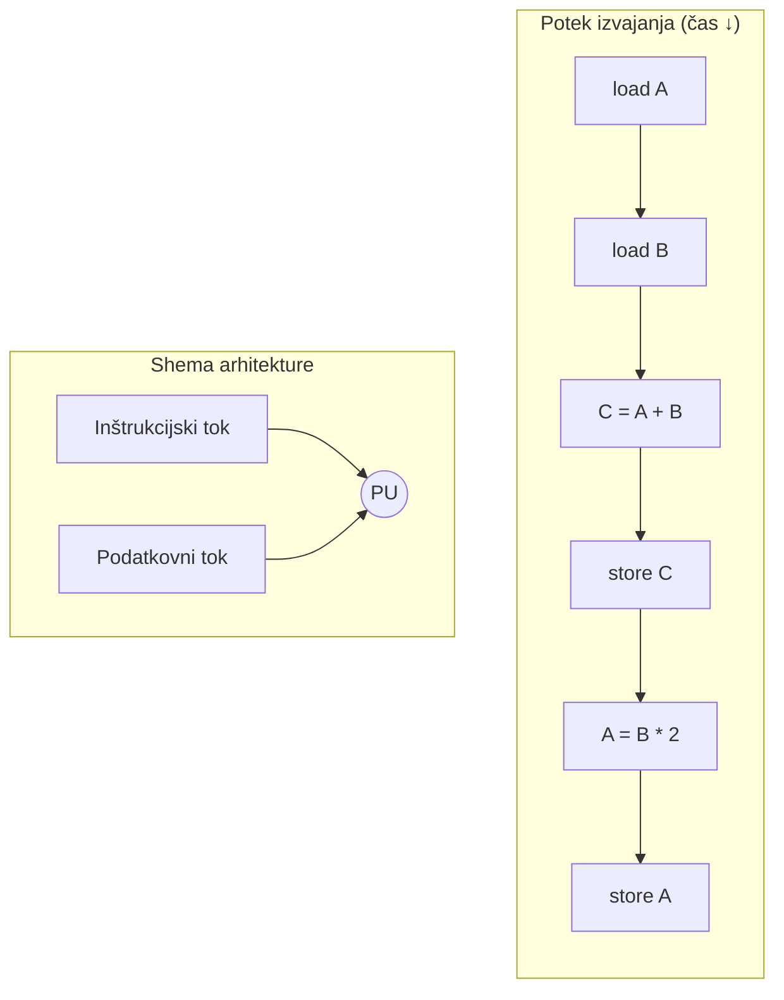
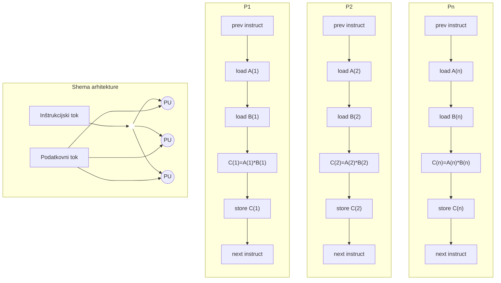
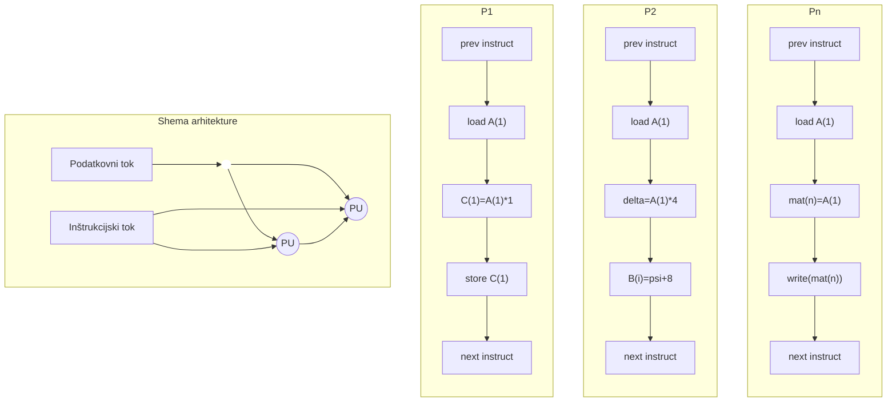
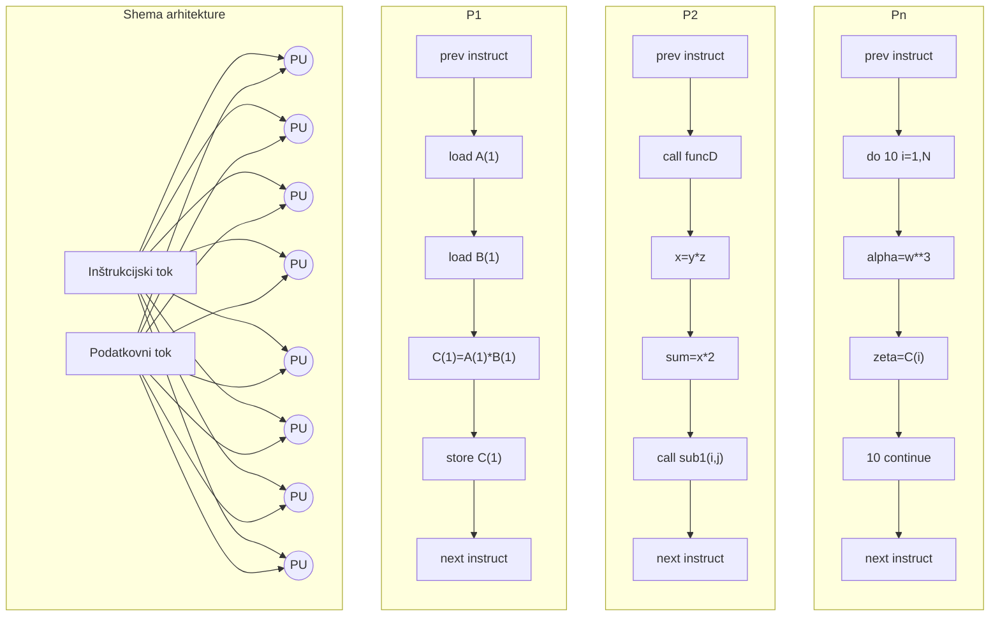
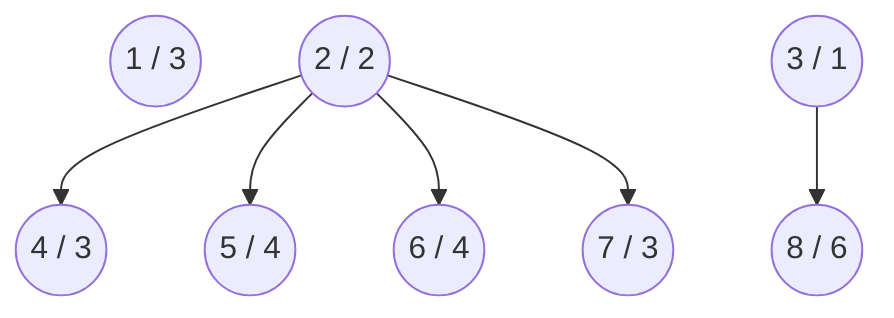

+++
title = "Paralelno in porazdeljeno računanje"
date = 2022-10-07T07:07:07+01:00
draft = false
math = true
mermaid = true
tags = ["3. letnik", "zimski semester"]
categories = ["RIT UNI"]

summary = "Zapiski za predmet Paralelno in porazdeljeno računanje za zimski semester tretjega letnika FERI RIT UNI."
summary_enable = true
summary_style = "subtitle"
+++

## Paralelno in porazdeljeno računanje

Pri paralelizmu gre za razmišljanje o prostorski in časovni zahtevnosti problema - želimo poiskati načine, da bodo algoritmi čim bolj učinkoviti. Velike probleme zato poskušamo razdeliti na manjše probleme, kar je pomemben princip **deli in vladaj** (angl. *divide and conquer*). Pri tem delimo tako podatke kot naloge - postopku delitve problema pravimo **particioning**.

### Paralelni računalniki

Ideja paralelizacije obstaja že od začetka razvoja računalnikov. Zamisel je bila, da bi se stvari izvajale sočasno oz. da lahko več strojev, ki delajo hkrati, opravi več dela. Vsi današnji računalniki so tako z vidika strojne opreme paralelni:

- več funkcijskih enot,
- več izvajalnih enot/jeder,
- več niti, podprtih s strojno opremo.

Naši računalniki imajo torej že danes več funkcijskih enot, ki jih uporabljajo za računanje.

Procesorja imata lahko način skupnega pomnilnika, kjer si delita neke podatke. Pri tem je treba razmišljati tudi o segrevanju - električni signal, ki potuje po kablu, kabel segreje, zato je treba razmišljati tudi o prostoru, kjer se superračunalnike hrani in vzdržuje, da se ne pregrejejo (za gretje prostorov se npr. izkorišča odvečna toplota, saj se procesorji in računalniki pri delovanju grejejo). Zaradi tega podjetja, kot je Google, selijo svoje podatkovne centre na sever.

Primer: IBM-ov procesor BG/Q ima 18 jeder (in 16 enot predpomnilnika L2) - vprašanje je, kako čim bolje izkoristiti procesor in njegova jedra za reševanje naših problemov in nalog. Jedra delujejo neodvisno, ker ima vsako svoj predpomnilnik.

### Superračunalniki

**Superračunalniki** imajo več tisoč procesorjev in uporabljajo **masivno paralelno procesiranje**. Ponavadi tečejo na operacijskem sistemu Linux, njihova zmogljivost pa se meri v številu operacij s plavajočo vejico na sekundo (**FLOPS** - floating point operacija na sekundo; obstajajo tudi druge metrike). Dandanes se premikamo iz PFLOPS ($10^{15}$) na EFLOPS ($10^{18}$) - koliko je pravzaprav $2^{64}$? In koliko flopsov "zmorejo" človeški možgani?

Najzmogljivejši superračunalnik na svetu je bil v letih 2018 in 2019 **Summit** v ZDA, ki ima 2.397.824 procesorskih jeder v skupni zmogljivosti 143,5 petaflopsov (podatek iz novembra 2018 oz. novembra 2019). Leta 2020 pa je najzmogljivejši postal japonski **Fugaku**, ki dosega 415,5 petaflopsov (skoraj trikrat več kot Summit) - nameščen je v centru RIKEN Center for Computational Science (R-CCS) v mestu Kobe na Japonskem.

V Sloveniji imamo superračunalnik **VEGA**, ki ima kar nekaj vozlišč, namenjenih uporabi. Če vsako jedro zaganja svoj program, lahko na superračunalniku hkrati zaganjamo zelo veliko programov. Superračunalniki so med sabo povezani v omrežju, poleg tega pa jih pogosto povezuje tudi vodilo **InfiniBand**, ki omogoča še dodatno, hitrejšo povezavo med računalniki.

**Masivno paralelno računanje** pomeni, da uporabnik želi nek problem zagnati večkrat - svoj program predamo **razvrščevalniku** (angl. *scheduler*) z ukazom, naj program zažene npr. 1000-krat, razvrščevalnik pa nato sam določi, na katera vozlišča bo posamezne zagone razporedil, da se naloga reši. Do vozlišč, kjer zadeve dejansko tečejo, kot uporabniki navadno nimamo neposrednega dostopa - dostop imamo običajno samo do osnovnega (prijavnega) vozlišča.

Računalnika z zmogljivostjo enega **EFLOPS** trenutno (še) ni, vendar če združimo (zmnožimo) več računalnikov skupaj, to zmogljivost dosežemo.

Sistemi pogosto poskušajo posnemati vzorce iz narave, npr. evolucijske algoritme in razne zakonitosti v naravi, pa tudi delovanje človeških možganov - to poskušamo prenesti v računalništvo, npr. s konceptom nevronskih mrež.

---

### Gruče in omrežno računalništvo

**Gruče** (angl. *clusters*) so poseben tip superračunalnika - velika porazdeljena računalniška gruča sestoji iz vozlišč, ki so med seboj povezana v lokalno omrežje (LAN). Ker so vozlišča povezana lokalno, stvari delujejo hitreje, kot če bi bila povezana preko širšega območja (angl. *wide area network*), kjer lahko pride do večjih zamikov. Vozlišča v gruči lahko obravnavamo kot samostojne sisteme, so pa vsa nadzorovana z isto programsko opremo in običajno opravljajo enake naloge oz. v ozadju rešujejo isti problem (čeprav to v praksi ni vedno tako).

**Omrežno računalništvo** (angl. *grid computing*) je prav tako poseben tip superračunalnika, kjer se računalniki (vozlišča) nahajajo na različnih lokacijah in so povezani z omrežjem (npr. z internetom ali drugim omrežjem). Vsako vozlišče v omrežju lahko opravlja različno opravilo, omrežje pa je ponavadi večnamensko in uporablja porazdeljeno procesiranje - zmogljivost računalnika je razpršena po več lokacijah. Ločimo dve zvrsti: zmogljive med seboj povezane računalnike, ki tvorijo superračunalniško omrežje, ter mnogo neodvisnih računalnikov, povezanih z internetom, ki skupaj tvorijo neformalen ad-hoc superračunalnik.

Če imamo *n* vozlišč, ki so vsako z vsakim povezana, je število vseh povezav v grafu enako $n(n-1)/2$.


Obstaja pa tudi topologija, kjer je vsak računalnik povezan samo s svojima sosedoma (obroč oz. cikel) - težava te topologije je, da se ob izpadu enega računalnika omrežje prekine.


Za rešitev tega problema se v obroč dodajo bližnjice, tako da lahko vozlišče, ki mora komunicirati z nekim drugim vozliščem, ki ni njegov neposredni sosed, hitreje skoči do želenega vozlišča.


Vsako vozlišče lahko opravlja svojo nalogo, **razvrščevalnik** pa skrbi, da naloge razvrsti posameznim vozliščem. Če povežemo več računalnikov skupaj, lahko rešujemo večje probleme - kadar problem zahteva veliko prostora in je časovno zahteven, nam povezava več računalnikov omogoči, da čas zmanjšamo, saj problem razdelimo na več računalnikov in s tem porazdelimo tudi prostorsko zahtevnost. S paralelnim procesiranjem tako večje probleme rešujemo dosti hitreje, kot če bi jih reševala samo ena naprava.

Kadar več vozlišč skupaj rešuje porazdeljen problem, lahko pride do izpada enega izmed njih, zaradi česar ne moremo rešiti tistega dela problema. Ta problem se rešuje tako, da se ob izpadu vozlišča njegova naloga (oz. njegov del problema) prenese na neko drugo vozlišče, ki ga reši namesto njega - pri tem si pogosto pomagamo s tem, da se rešitev oz. delna rešitev sproti zapisuje v datoteke, iz katerih je razvidno, do kod je bil del problema izpadlega vozlišča rešen, tako da se lahko od tam naprej problem na drugem vozlišču reši do konca. V naravi namreč ni nič 100-odstotno zanesljivo - računalniki in stroji se lahko pokvarijo.

Nekaj osnovnih pojmov: **proces** je program v izvajanju, **posel** (angl. *job*) se nanaša na to, kako posle razvrstiti med vozlišča, **opravilo** (angl. *task*) pa pomeni, da je naloga razdeljena na manjša opravila.

### Zakaj uporabljati paralelno računanje

Osnovna ideja je izkoristiti masovni paralelizem - npr. sliko lahko razdelimo na manjše kose (piksle) in vsak delček obdelujemo posebej na svojem vozlišču, tako da več vozlišč rešuje sliko hkrati in s tem pridobimo na času. Podobno velja za statistiko časovno zahtevnega algoritma, ki bi ga za pridobitev statistike morali pognati večkrat - s paralelizmom pridemo do rezultatov dosti hitreje, kot če bi program vsakič reševal samo en procesor.

Glavni razlogi za uporabo paralelnega računanja so torej prihranek časa oziroma denarja ter zmožnost reševanja kompleksnejših problemov, saj je svet sam po sebi masivno paralelen, zato so simulacije in modeliranja naravno primerna za paralelno procesiranje. Ker so paralelni programi namenjeni paralelni opremi, je poganjanje zaporednih (serijskih) programov na modernih računalnikih pogosto izguba računske moči.

Na področju **znanosti in inženirstva** se paralelno računanje uporablja za boljše modeliranje napovedi podnebnih sprememb in vremena, boljše razumevanje nastanka vesolja, razumevanje jedrske fizike, modeliranje celic za genetiko in biotehnologijo ter simuliranje možganskih funkcij. Na področju **industrije in ekonomije** pa gre predvsem za delo z masovnimi podatki, podatkovnimi bazami in podatkovnim rudarjenjem, umetno inteligenco, spletnimi iskalnimi pogoni, finančnim in ekonomskim modeliranjem ter menedžmentom nacionalnih in multinacionalnih korporacij. Pogosto želimo pri tem posneti tudi principe iz narave - podobno kot možgane in globoko učenje, ki se uporabljata pri nevronskih mrežah in umetni inteligenci.

Pri **zaporednem (sekvenčnem) programiranju** je programer osredotočen predvsem na algoritem, strojna oprema pa ga zanima le malo ali skoraj nič. Pri **paralelnem programiranju** pa mora programerja zanimati tudi računalniška arhitektura - pomembna je topologija omrežja, vrsta računalnikov in procesorjev ter vrsta mrežnih povezav, saj vse to vpliva na načrtovanje in razvoj paralelnega algoritma oziroma programa. Paralelno programiranje se uporablja predvsem takrat, kadar imamo omejen pomnilnik ali smo časovno omejeni - npr. če nas zanima frekvenca besed v veliki količini besedila: če je besedila malo, bo osebni računalnik s sekvenčnim programom povsem zadostoval, če pa gre za več terabajtov informacij, postane to za osebni računalnik prostorsko in časovno prevelik zalogaj, zato je paralelno programiranje nujno.

---

### Von Neumannova arhitektura in Flynnova taksonomija

**Von Neumannova arhitektura** je danes najbolj razširjena arhitektura računalnikov in jo sestavljajo pomnilnik, krmilna enota, aritmetično-logična enota ter vhodno/izhodne naprave - podatki se prenašajo med CPU-jem in glavnim pomnilnikom. Paralelno računalništvo sledi enaki osnovni ideji več enot. Pri pisanju programa vedno upoštevamo, za kakšno napravo ga pišemo, pri čemer nas zanima predvsem, kakšen je tok podatkov in kako se premika tok inštrukcij. V računalniku ločimo dve neodvisni dimenziji: **inštrukcijski tok** in **podatkovni tok**, ti dve dimenziji pa imata lahko eno izmed dveh možnih stanj - **single** ali **multiple**.

**Flynnova taksonomija** na podlagi teh dveh dimenzij definira štiri možne klasifikacije večprocesorskih arhitektur računalnikov:

- **SISD** (Single Instruction stream, Single Data stream) - enoprocesorski (enojedrni) računalniki, kjer en inštrukcijski tok deluje na enem podatkovnem toku.
- **SIMD** (Single Instruction stream, Multiple Data stream) - vektorski računalniki oz. paralelno procesiranje, kjer imamo en inštrukcijski tok in več podatkovnih enot, pri čemer vsaka procesna enota dela svoj del in obdeluje svoj podatek.
- **MISD** (Multiple Instruction stream, Single Data stream) - cevovodni računalniki, kjer se en podatek naloži v več procesnih enot, vsaka izmed njih pa ta podatek krmili s svojim inštrukcijskim tokom.
- **MIMD** (Multiple Instruction stream, Multiple Data stream) - več-računalniški oz. večprocesorski sistemi, kjer ima vsaka procesna enota svoj inštrukcijski in svoj podatkovni tok.

Spodaj so za vsako od štirih klasifikacij prikazane shema arhitekture (potek inštrukcijskega in podatkovnega toka do procesnih enot) ter potek izvajanja inštrukcij v času za posamezne procesorje.

**SISD** - en inštrukcijski tok deluje na enem podatkovnem toku, zato se vse inštrukcije na edini procesni enoti izvajajo zaporedno, ena za drugo:



**SIMD** - en inštrukcijski tok hkrati upravlja več procesnih enot, od katerih vsaka obdeluje svoj del podatkov po isti inštrukciji:



**MISD** - več inštrukcijskih tokov zaporedno obdeluje isti podatkovni tok, pri čemer vsaka procesna enota podatek krmili s svojim, drugačnim inštrukcijskim tokom:



**MIMD** - vsaka procesna enota ima svoj lasten inštrukcijski in svoj podatkovni tok, zato lahko vsak procesor hkrati izvaja popolnoma drugačen program na drugačnih podatkih:



Pri obravnavi grafov (npr. topologij omrežij) se pogosto srečamo tudi s pojmom **diameter grafa** - to je najdaljša izmed najkrajših poti med poljubnima dvema vozliščema v grafu. Pri popolnoma povezanem grafu (kjer je vsako vozlišče direktno povezano z vsakim drugim) je diameter enak 1, saj do katerega koli drugega vozlišča pridemo po eni sami povezavi. Če vozlišča niso vsa neposredno povezana med sabo, je lahko diameter večji - npr. če moramo za pot med dvema vozliščema prehoditi dve povezavi, je diameter grafa enak 2. Pri diametrih vedno gledamo najkrajšo pot med izbranima vozliščema.

### Amdahlov zakon in omejitve paralelnega programiranja

**Amdahlov zakon** trdi, da je pohitritev paralelnega programa obratno sorazmerna z deležem kode, ki je ne moremo paralelizirati. Če bi imeli na voljo neomejeno število procesorjev, bi bila pohitritev enaka:

\[
\text{pohitritev} = \frac{1}{1 - P}
\]

kjer P predstavlja delež kode, ki jo je mogoče paralelizirati. Če v enačbo vpeljemo tudi število procesorjev N, dobimo natančnejšo formulo:

\[
\text{pohitritev} = \frac{1}{\frac{P}{N} + S}
\]

kjer S predstavlja delež zaporedne (nujno sekvenčne) kode. Tudi če bi imeli na voljo neskončno število procesorjev, je pohitritev omejena, saj do neke mere z dodajanjem procesorjev sicer raste, nato pa doseže maksimum, ne glede na to, koliko procesorjev še dodamo - to velja še posebej takrat, kadar je delež zaporedne kode razmeroma velik. Zato si vedno želimo, da bi program paralelizirali čim bolj, kolikor se le da.

Znan primer: če je 95 % kode mogoče paralelizirati (5 % pa ostane zaporedne), pohitritev z naraščajočim številom procesorjev sicer strmo raste, a se pri zelo velikem številu procesorjev ustavi pri pohitritvi okrog 20-kratnika, ne glede na to, koliko procesorjev še dodamo - kot pravi znan rek: *"You can spend a lifetime getting 95% of your code to be parallel, and never achieve better than 20x speedup no matter how many processors you throw at it!"*


\[
\text{pohitritev} = \frac{T_1}{T_p}
\]

\[
\frac{1}{\frac{0.95}{N} + 0.05} \xrightarrow{N \to \infty} \frac{1}{0.05} = 20
\]

Poleg pohitritve moramo pri paralelnem programiranju upoštevati tudi druge dejavnike:

- **Kompleksnost** - paralelne aplikacije so kompleksnejše od svojih zaporednih različic v vseh vidikih razvoja: pri načrtovanju, implementaciji, razhroščevanju, izboljševanju in vzdrževanju. Grafične kartice (GPU) so npr. hitre, vendar operacije, ki jih izvajajo, so enostavnejše kot pri CPU-ju (npr. uporabljajo manjši double). Na CPU-ju imamo na voljo ogromno funkcij, kot so generatorji naključnih števil. Ko paralelni program zaženemo večkrat in izpisujemo vrednosti niti, bo izpis vsakič drugačen, saj bo enkrat ena nit operacije opravila prej kot druga.
- **Prenosljivost** - zahvaljujoč vmesnikom, kot sta MPI in OpenMP, prenosljivost danes ne predstavlja več tako velike težave kot nekoč. Še vedno pa obstajajo težave s prenosljivostjo zaporednih programov, ki se lahko nanašajo tudi na paralelne - na prenosljivost lahko vpliva tudi operacijski sistem in strojna oprema.
- **Režijski čas** (angl. *overhead*) - čas, ki ni koristen za dejansko računanje. Paralelno programiranje sicer skrajša čas izvajanja programa, a porabi več procesorskega časa in pogosto tudi več pomnilnika kot zaporedna različica. Pri kratkih programih lahko režijski čas znatno vpliva na skupni čas izvajanja, zato se ga splača paralelizirati le, kadar to prinese resnično korist - če se program izvede v dveh minutah, ga bomo raje pognali na lastnem računalniku, če pa bi za izvedbo potreboval več mesecev, se splača vložiti nekaj ur dela, da se ga naloži na strežnik za paralelizacijo.

### Skalabilnost

**Skalabilnost** je zmožnost pohitritve paralelnih sistemov, sorazmerna s količino dodanih virov. Ločimo dva tipa skaliranja:

- **Močno skaliranje** - skupna velikost problema ostane nespremenjena ob dodajanju procesorjev; ponavadi si želimo, da bi bil problem rešen hitreje. Popolno (idealno) skaliranje pomeni, da je paralelen problem v primerjavi z zaporednim programom rešen v $\frac{1}{P}$ časa - če problem razdelimo na n procesorjev, bo rešen n-krat hitreje.
- **Šibko skaliranje** - velikost problema je sorazmerno odvisna od števila uporabljenih procesorjev, torej problem povečujemo skupaj s številom procesorjev, ki jih dodajamo. Želimo si rešiti večji problem v enakem času. Popolno skaliranje tu pomeni, da večji problem na Px procesorjih teče natanko toliko časa kot zaporedni program.

---

### Skupni pomnilnik

Na **skupni pomnilnik** gledamo kot na vse, kar imajo procesorji na voljo skupaj - glavna značilnost je zmožnost dostopa vseh procesorjev do celotnega pomnilnika, ki je na voljo preko globalnega naslovnega prostora. Več procesorjev deluje neodvisno, si pa deli skupne pomnilniške vire, sprememba, ki jo v pomnilniku povzroči en procesor, pa je vidna vsem ostalim procesorjem. Prednost skupnega pomnilnika je enostavnost programiranja in hitro ter enotno deljenje podatkov med opravili, saj za nas pravilno delovanje pomnilnika zagotavlja strojna oprema. Slabost pa je pomanjkanje skalabilnosti z naraščanjem števila procesorjev ter problem skladnosti predpomnilnika - če dva procesorja želita sočasno dostopati do pomnilnika, morata do njega dostopati zaporedno (razen če imamo v ozadju več pomnilniških bank s paralelnim dostopom, kar omogoča multiplekser). Pri 64-bitnem računalniku so naslovi veliki $2^{64}$ (natančneje nekje med 48 in 52 bitov).

Kar zadeva nivoje predpomnilnika: L1 ima za vsako jedro ločene podatke, L2 ima prav tako svoj predpomnilnik za vsako jedro, L3 pa je skupni predpomnilnik za vsa jedra. Kadar procesor ažurira spremenljivko, ki je tudi v predpomnilniku, se lahko uporabi pristop pisanja nazaj (angl. *write-back*, sprememba se v glavni pomnilnik zapiše kasneje, mesto pa se označi z dirty bitom) ali pristop pisanja skozi (angl. *write-through*, sprememba se takoj zapiše tudi v glavni pomnilnik).

Ločimo dva tipa skupnega pomnilnika:

- **UMA** (Uniform Memory Access, enoten pomnilniški dostop) - večinoma sestoji iz simetričnih večprocesorskih naprav (angl. *symmetric multiprocessor machines*, SMP). Vsi procesorji so identični in imajo enak dostop ter enak dostopni čas do pomnilnika. Če je pri tem ohranjena tudi skladnost predpomnilnika, tak sistem imenujemo cache-coherent UMA (CC-UMA).


- **NUMA** (Non-Uniform Memory Access, neenoten pomnilniški dostop) - pogosto nastane s povezovanjem dveh ali več simetričnih večprocesorskih naprav (SMP), kjer ena SMP naprava lahko dostopa tudi do pomnilnika druge. Vsak procesor ima svoj pomnilnik, do pomnilnika drugih procesorjev pa lahko dostopa tudi, vendar je pot do njega časovno (in s tem tudi "cenovno") dolga - zato je dostop neenoten. Procesorji imajo torej različen dostopni čas do pomnilnikov, dostop preko povezav pa je počasen. Če je pri tem ohranjena skladnost predpomnilnika, govorimo o CC-NUMA.


Pri grafičnih procesnih enotah (GPU) je procesorjev ogromno, težava pa je, kako naj poteka komunikacija med posameznimi pomnilniki - teh procesorjev je sicer polno, so pa operacije, ki jih izvajajo, enostavnejše.

### Porazdeljeni pomnilnik

Pri **porazdeljenem pomnilniku** gre za sisteme, ki potrebujejo komunikacijsko omrežje za povezavo medprocesorskega pomnilnika - vsak procesor ima lasten pomnilnik in deluje neodvisno, skupni pomnilnik za vse procesorje pa ne obstaja. Programiranje na takšnih sistemih pomeni organizacijo programa kot seznama neodvisnih nalog, ki med seboj komunicirajo preko sporočil, dobra (morda celo najboljša) izbira pa je algoritem, v katerem so podatki razdeljeni v majhne enote, ki med sabo komunicirajo čim manj. Komunikacija torej poteka preko sporočil, kar prinaša prednost boljše skalabilnosti - odvzem ali dodajanje procesorjev ni problem, saj lahko vsaka CPU enota rešuje svoj del problema neodvisno.


Vmes med procesorji in pomnilnikom imamo stikalo, ki določi, kateri procesor komunicira s katerim pomnilnikom (oz. s katero drugo procesorsko enoto) - taka stikala so pogosto celo dražja od samega pomnilnika in procesnih enot. Danes imamo poleg glavnega procesorja pogosto tudi dodatne procesorje, ki skrbijo za vhodno-izhodne enote in povezavo do zunanjih pomnilniških enot (krmilnik DMA).

Prednosti porazdeljenega pomnilnika so, da ni tekmovanja med vodili ali stikali, da lahko procesorji uporabljajo polno pasovno širino svojega pomnilnika brez motenj ostalih procesorjev, da število procesorjev ni omejeno (velikost sistema je omejena zgolj z omrežjem) ter da ni problema s skladnostjo predpomnilnika. Slabosti pa so, da je medprocesorska komunikacija veliko težja, saj mora procesor izmenjati sporočila z drugim procesorjem, da pridobi njegove podatke, pri čemer lahko nastaneta dva dodatna režijska časa - pri pošiljanju in ob prejemanju sporočila. Pošiljatelj in prejemnik se morata pred komunikacijo med sabo tudi uskladiti, za kar potrebujemo ustrezen vmesnik. Pri **asinhroni komunikaciji** pošiljatelj sporočilo pošlje, prejemnik pa ga prejme, ko lahko (podobno kot nabiralnik, iz katerega pošto poberemo, ko imamo čas).

### Hibridni porazdeljeni-skupni pomnilnik

Največji računalniki na svetu pogosto uporabljajo obe vrsti arhitekture hkrati - komponenta skupnega pomnilnika je lahko skupna pomnilniška naprava in/ali grafična procesna enota (GPU), komponenta porazdeljenega pomnilnika pa je omrežje več takšnih skupnih pomnilnikov oz. GPU naprav; za prenos podatkov iz enega računalnika v drugega so potrebne omrežne komunikacije. Tudi sama povezava GPU in CPU je že neke vrste hibrid, saj gre za dve enoti, ki sta med sabo povezani, delita pa si nek skupni pomnilnik. Prednost hibridnega pristopa je povečana skalabilnost, slabost pa povečana programska kompleksnost.

Podoben sistem v ozadju uporablja tudi **računalništvo v oblaku** (angl. *cloud computing*) - pri oblačnih storitvah ponudniku navadno povemo, koliko pomnilnika, procesorjev in grafičnih kartic potrebujemo, ta pa nam v okviru paketov to zagotovi.

---

### Modeli paralelnega programiranja

Poznamo več modelov paralelnega programiranja, ki jih uporabljamo v splošni rabi. Ti modeli obstajajo kot abstrakcija nad strojno opremo in pomnilniško arhitekturo - niso specifični za določeno vrsto stroja ali pomnilniško arhitekturo, zato se lahko vsak izmed njih teoretično izvaja na kateri koli strojni opremi (npr. lahko implementiramo skupni pomnilnik na porazdeljeni pomnilniški arhitekturi, ali obratno - vmesnik za izmenjavo sporočil MPI na skupni pomnilniški arhitekturi).

**Model skupnega pomnilnika brez niti** je najpreprostejši model paralelnega programiranja - imamo en proces na vsak procesor. Procesi oz. naloge si delijo skupni naslovni prostor, v katerega pišejo in ga berejo asinhrono. Za nadzor dostopa do skupnega pomnilnika, reševanje sporov ter preprečevanje tveganih stanj (angl. *race conditions*) in smrtnih objemov (angl. *deadlocks*) se uporabljajo zaklepanja oz. semaforji, ki določajo, katera nit oz. proces sme pisati v določeno pomnilniško lokacijo - do smrtnega objema pride, kadar en proces čaka na drugega, ta pa hkrati čaka na prvega. Prednost tega modela je, da imajo vsi procesi enak dostop do skupnega pomnilnika in ni treba izrecno določati komunikacije med nalogami, pomanjkljivost pa je, da je z vidika učinkovitosti težje upravljati lokalnost podatkov.

**Model z nitmi** je vrsta modela skupnega pomnilnika, pri katerem lahko en "težki" proces vsebuje več "lahkih", sočasnih poti izvajanja (niti). Znotraj enega vozlišča pri tem upoštevamo, da ima to lahko več jeder, izkoristimo pa tudi razpoložljivi pomnilnik. S programskega vidika izvedba z nitmi običajno vsebuje knjižnico podprogramov, ki se kličejo iz paralelne različice izvorne kode, ter množico navodil prevajalniku, vgrajenih bodisi v zaporedno bodisi v paralelno izvorno kodo - paralelnost torej definira programer, prevajalnik pa mu pri tem včasih pomaga. Poznamo več različic tega modela: POSIX niti, OpenMP, Java niti, CUDA niti za GPU in druge. Zgodovinsko so imeli Windows in Unix sistemi vsak svoj način ustvarjanja niti, zato je bilo treba isto kodo pisati ločeno za vsak sistem.

**OpenMP** je danes eden najpogostejših modelov za programiranje z nitmi - za dele kode, ki jih želimo paralelizirati (najpogosteje zanke), uporabimo ustrezne direktive (npr. `#include` za OpenMP). Vse niti imajo pri OpenMP dostop do istega (skupnega) pomnilnika, podatki pa so lahko skupni ali zasebni - do skupnih podatkov lahko dostopajo vse niti, do zasebnih pa le nit, ki jih ima v lasti. Prenos podatkov je za programerja pregleden, sinhronizacija pa je večinoma implicitna.

**Porazdeljeni pomnilnik oz. model pošiljanja sporočil** obravnava aplikacijo kot zbirko neodvisnih procesov, vsak s svojim lastnim pomnilnikom - procesi med seboj komunicirajo preko pošiljanja in prejemanja sporočil, pri čemer pošiljatelj in prejemnik skupaj poskrbita za prenos podatkov iz lokalnega pomnilnika enega v lokalni pomnilnik drugega. Pri pošiljanju sporočil pogosto pride do potrebe po sinhronizaciji med procesoma, da si lahko izmenjata podatke. V praksi je pomembna tudi velikost sporočil - velika sporočila so časovno zahtevnejša, po drugi strani pa je tudi veliko število majhnih sporočil časovno potratno, zato je treba najti kompromis, pri katerem velika sporočila razbijemo na manjša, a ne na premajhne pakete.

Standardni vmesnik za pošiljanje sporočil je **MPI** (Message Passing Interface). Osnovna zgradba MPI programa v jeziku C (t. i. "Hello World" primer) izgleda približno takole:

```c
#include <mpi.h>
#include <stdio.h>

int main(int argc, char** argv) {
    // inicializacija MPI okolja
    MPI_Init(NULL, NULL);

    // pridobimo število procesov
    int world_size;
    MPI_Comm_size(MPI_COMM_WORLD, &world_size);

    // pridobimo rank (zaporedno številko) procesa
    int world_rank;
    MPI_Comm_rank(MPI_COMM_WORLD, &world_rank);

    // pridobimo ime procesorja
    char processor_name[MPI_MAX_PROCESSOR_NAME];
    int name_len;
    MPI_Get_processor_name(processor_name, &name_len);

    // izpis pozdravnega sporočila
    printf("Hello world from processor %s, rank %d out of %d processors\n",
           processor_name, world_rank, world_size);

    // zaključek MPI okolja
    MPI_Finalize();
}
```

Pri MPI ločimo tudi **rank** posameznega procesa - če namesto konstante `MPI_ANY_SOURCE` uporabimo konkreten rank, natančno vemo, od koga smo prejeli rezultat (oz. komu ga moramo poslati nazaj); če pa nas ne zanima, od koga podatek prejmemo, uporabimo `MPI_ANY_SOURCE`. Kadar želi npr. master proces svojim slave procesom poslati podatke, za to običajno uporabimo `for` zanko.

Prednosti modela pošiljanja sporočil so **prenosljivost** (izvaja se na večini vzporednih računalniških okolij), **univerzalnost** (model ni odvisen oz. je le minimalno odvisen od osnovne paralelne opreme) ter **preprostost** (model podpira izrecen nadzor pomnilniških referenc, kar olajša razhroščevanje).

**Model paralelnih podatkov**, znan tudi kot model razdeljenega globalnega naslovnega prostora (angl. *Partitioned Global Address Space*, PGAS), obravnava naslovni prostor globalno. Nabor podatkov je ponavadi urejen v strukturo, kot je niz ali kocka, sklop nalog pa deluje na različnih delih iste podatkovne strukture - naloge izvajajo enako operacijo na svoji particiji podatkov. Med implementacijami tega modela najdemo Coarray Fortran, Unified Parallel C (UPC), Global Arrays, X10 in Chapel.

**Hibridni model** združuje več prej omenjenih modelov, npr. komunikacijo med CPU in GPU.

**SPMD** (Single Program Multiple Data) je visokonivojski model programiranja, ki se lahko zgradi na podlagi kombinacije prej omenjenih modelov. Vse naloge izvajajo kopijo istega programa hkrati (ta je lahko model z nitmi, pošiljanje sporočil, model paralelnih podatkov ali hibridni model), pri čemer lahko vse naloge uporabljajo različne podatke - ni nujno, da vsaka naloga izvede celoten program, temveč lahko samo del programa. Model SPMD, ki uporablja pošiljanje sporočil ali hibridno programiranje, je najpogosteje uporabljen model paralelnega programiranja za gručo z več vozlišči. SPMD ne moremo neposredno uvrstiti v Flynnovo taksonomijo, saj ta obravnava toke inštrukcij, pri SPMD pa vse krmilimo z enim visokonivojskim programom.

**MPMD** (Multiple Program Multiple Data) je prav tako visokonivojski model, ki se lahko zgradi na podlagi kombinacije prej omenjenih modelov - gre za večnivojski model, kjer imamo več programov, ki nek problem rešujejo skupaj (naloge lahko izvajajo različne programe hkrati, pri čemer je vsak izmed teh lahko eden od štirih že omenjenih modelov, vse naloge pa lahko uporabljajo tudi različne podatke). MPMD ni tako pogosto uporabljen kot SPMD, je pa lahko primernejši za določene tipe problemov - za reševanje ene same naloge se pogosteje uporabi SPMD.

---

### Koraki v paralelizaciji

Pri paralelizaciji problema sledimo naslednjim korakom: razumeti problem in program (sekvenčni), razcepljanje (angl. *partitioning*), komunikacija, sinhronizacija ter obravnava podatkovnih odvisnosti.

**Razumeti problem in program** - najprej vzamemo sekvenčni program in ga moramo dobro razumeti. Ugotoviti moramo, ali se program sploh lahko paralelizira: obstajajo namreč problemi, ki se ne dajo paralelizirati, problemi, ki se dajo paralelizirati v celoti, in problemi, ki se dajo paralelizirati le delno. Identificirati moramo glavne točke programa, kjer se izvaja večina dela, in jih najprej paralelizirati, prav tako pa tudi točke, ki so nesorazmerno počasne ali zavirajo paralelizacijo programa, ter pri njih poskusiti spremeniti program ali uporabiti drug algoritem. Identificirati je treba tudi inhibitorje paralelizacije, ki so najpogosteje podatkovne odvisnosti, po potrebi raziskati tudi druge algoritme ter izkoristiti optimizirano paralelno programsko opremo in visoko optimizirane matematične knjižnice, ki jih ponujajo vodilni proizvajalci (npr. IBM-ov ESSL, Intel-ov MKL, AMD-jev AMCL).

**Razcepljanje oz. dekompozicija** (angl. *partitioning/decomposition*) pomeni, da problem razbijemo na (diskretne) "kose" dela, ki jih je mogoče razdeliti na več nalog - vsaka naloga pri tem dobi približno enako dela. Ločimo dva pristopa:

- **Dekompozicija domene** - razdelijo se podatki, ki so povezani s problemom.
- **Funkcionalna dekompozicija** - problem se razcepi na podlagi dela (računanja), ki ga je treba opraviti.

Primeri funkcionalne dekompozicije so npr. modeliranje ekosistemov (kjer vsak procesor obravnava en nivo prehranjevalne verige), obdelava signala (kjer vsak procesor obravnava en del podatkovnega toka) ali modeliranje podnebja (kjer ločeni procesi modelirajo npr. atmosfero, hidrologijo, ocean in kopno/površje, ki med sabo komunicirajo).

Pogosta shema porazdelitve dela je vzorec **master/slave** - master proces (ki lahko, a ne nujno, tudi sam računa, odvisno od svoje zmogljivosti) svojim slave procesom (delavcem) dodeljuje opravila. Za to se pogosto uporabljata dve `for` zanki - ena, s katero master prejema rezultate, in druga, s katero slave procesi prejemajo opravila.

### Komunikacija

Nekateri problemi se lahko razčlenijo in izvedejo paralelno praktično brez potrebe po delitvi podatkov med nalogami - takšne probleme imenujemo **trivialno paralelni** (angl. *embarrassingly parallel*), saj zahtevajo malo ali nič komunikacije (npr. metoda končnih elementov, MKE oz. FEM, pri reševanju določenih inženirskih problemov). Večina paralelnih aplikacij pa ni tako preprostih in zahtevajo izmenjavo podatkov med nalogami.

Pri načrtovanju komunikacij med opravili je treba upoštevati več pomembnih dejavnikov: komunikacijsko režijo, razmerje med zakasnitvijo in pasovno širino, vidnost komunikacij, sinhrone proti asinhronim komunikacijam, obseg komunikacij, njihovo učinkovitost ter splošno režijo in zahtevnost.

---

### Zahtevne komunikacije

Pri razcepljanju problema moramo upoštevati dva pomembna dejavnika: **čas procesiranja** in **čas komunikacije**. Kadar uporabljamo model skupnega pomnilnika, so podatki že v pomnilniku, zato je čas komunikacije majhen; pri porazdeljenem sistemu pa čas komunikacije ni zanemarljiv in ga moramo nujno upoštevati. Ko imamo veliko količino podatkov, s katerimi želimo nekaj narediti, hitro presežemo zmogljivosti pomnilnika enega samega računalnika, zato problem porazdelimo med več vozlišč, povezave med njimi pa si lahko predstavljamo kot usmerjen neciklični graf (DAG).

**Komunikacijska režija** - komunikacija med nalogami praktično vedno pomeni določeno režijo: strojni cikli in viri, ki bi jih sicer lahko uporabili za računanje, se namesto tega porabijo za pakiranje in posredovanje podatkov. Preden se sporočilo pošlje, ga je treba razbiti na pakete, poleg dejanskih podatkov pa moramo vedno priložiti tudi dodatne bite (za kar v ozadju poskrbi operacijski sistem). Komunikacije pogosto zahtevajo tudi sinhronizacijo med nalogami, zaradi česar naloge namesto z delom porabljajo čas s čakanjem, razpoložljiva pasovna širina omrežja pa je lahko zasičena zaradi konkurenčnega komunikacijskega prometa. Idealno bi bil čas komunikacije enak nič, kar pa v praksi ni izvedljivo - celotno procesiranje ne more iti zgolj v preračunavanje.

**Latenca proti pasovni širini** - latenca je čas, potreben za pošiljanje minimalnega (0-bajtnega) sporočila od točke A do točke B, običajno izražen v mikrosekundah; pasovna širina pa je količina podatkov, ki jih je mogoče prenesti na enoto časa, običajno izražena v MB/s, GB/s, TB/s in podobno. Pošiljanje velike količine majhnih sporočil povzroči veliko latenco, ki predstavlja glavni faktor preobremenitve komunikacije, zato je pogosto učinkoviteje majhna sporočila pakirati v večja, s čimer se poveča učinkovita komunikacijska pasovna širina - hkrati pa preveliki paketi tudi niso idealni, saj njihovo pošiljanje traja dlje, ta čas pa ni izkoriščen za sprotno preračunavanje že prispelih delov podatkov. Pri tem si pogosto pomagamo tudi z **agregacijo**, kjer povežemo več manjših, med sabo povezanih kosov problema v večje množice, s čimer zmanjšamo število potrebnih komunikacij in povečamo delež dejanskega računanja.

**Vidnost komunikacije** - pri modelu pošiljanja sporočil so komunikacije eksplicitne in na splošno zelo vidne ter pod neposrednim nadzorom programerja. Pri modelu s skupnimi podatki pa so komunikacije pogosto transparentne za programerja, še posebej če je skupni pomnilnik implementiran na porazdeljeni pomnilniški arhitekturi - programer morda niti ne more natančno vedeti, kako komunikacije med nalogami dejansko potekajo.

**Sinhrone proti asinhronim komunikacijam** - sinhrone komunikacije zahtevajo usklajevanje med nalogami, ki si delijo podatke (bodisi izrecno kodirano bodisi pregledno za programerja), in se pri tem **blokirajo** - naloga mora počakati, da se komunikacija zaključi, preden lahko nadaljuje z delom. Pri sinhronem načinu odjemalci med sabo niso blokirali drug drugega, saj se je vsak povezal, opravila se je izmenjava podatkov in šele nato je sledila naslednja komunikacija - potek dogodkov je zato pregleden, saj vemo, kdo je kaj poslal in kdo je kaj prejel nazaj.

Pri **asinhronih komunikacijah** pa lahko opravila prenašajo podatke neodvisno drug od drugega in se pri tem **ne blokirajo**, saj je med opravljanjem komunikacije mogoče opravljati tudi drugo delo - računanje s prepletanjem komunikacije ima zato največjo korist prav pri uporabi asinhronih komunikacij. Pri asinhronem načinu ima vozlišče dvosmerni tok, saj lahko hkrati prejema in oddaja - npr. če master pošilja podatke, ni vnaprej jasno, kdaj bodo odjemalci začeli pošiljati stvari nazaj masterju. Prednost asinhronega načina je, da lahko pošiljatelj pošlje sporočilo nekemu drugemu vozlišču, medtem ko prvo vozlišče še računa nalogo, ki mu jo je master poslal prej - slabost pa je, da ne vemo vnaprej, katera komunikacija bo izvedena prej in katera pozneje, zaradi česar so izpisi (kdaj kdo kaj prejme oz. pošlje) pri asinhronem načinu pogosto pomešani in nepregledni. Če isti paralelni program zaženemo dvakrat, je zato pri asinhronem načinu lahko izpis v vsaki od izvedb popolnoma drugačen, saj se vrstni red prejemanja in pošiljanja sporočil vsakič lahko razlikuje.

**Obseg komunikacije** - katere naloge morajo med seboj komunicirati, je ključnega pomena že v fazi načrtovanja paralelne kode. Ločimo obseg **točka-do-točke**, kjer ena naloga podatke pošilja, druga pa jih sprejema, in **kolektivni obseg**, ki zajema izmenjavo podatkov med več kot dvema nalogama hkrati, pogosto opredeljenima kot člana iste skupine oz. kolektiva. Med kolektivnimi vzorci komunikacije ločimo **broadcast** (ena naloga isti podatek pošlje vsem ostalim), **scatter** (ena naloga različne dele podatka razpošlje po ostalih nalogah), **gather** (podatki iz več nalog se zberejo pri eni nalogi) in **reduction** (podatki iz več nalog se zberejo pri eni nalogi, pri čemer se nad njimi izvede tudi neka operacija, npr. seštevanje).

Pri **broadcastu** en proces vsem ostalim pošlje isto sporočilo (celo polje) - gre za eno od standardnih kolektivnih komunikacijskih tehnik, ki se pogosto uporablja za pošiljanje uporabniškega vnosa ali konfiguracijskih parametrov vsem procesom v paralelnem programu. Ker so v modelih, kot je OpenMP, vsa vozlišča med sabo enakovredna, bo tudi master sam sebi poslal isto sporočilo. Sporočilo se pri tem lahko širi tudi hierarhično (npr. prvi proces pošlje sporočilo dvema procesoma, ta dva ga pošljeta naslednjima dvema, ta štirje naslednjim osmim itd.), kar je lahko učinkoviteje kot pošiljanje vsakemu posebej. Ustrezna funkcija v MPI ima prototip:

```c
MPI_Bcast(
    void* data,
    int count,
    MPI_Datatype datatype,
    int root,
    MPI_Comm communicator)
```

Lep opis, kaj kateri argument pomeni, je zapisan na spletni strani: [mpitutorial.com - MPI Broadcast and Collective Communication](https://mpitutorial.com/tutorials/mpi-broadcast-and-collective-communication/)

Pri **scatterju** se naloga razdeli na manjše kose, ki se razpošljejo posameznim procesom (master pri tem kopijo pošlje tudi sam sebi) - ključna razlika od broadcasta je, da vsak prejemnik dobi drugačen del podatkov, sporočila pa se razpošljejo po vrstnem redu glede na rang procesa (npr. prvi del podatkov prejme proces z rangom 0, drugi del proces z rangom 1 itd.). Prototip funkcije v MPI:

```c
MPI_Scatter(
    void* send_data,
    int send_count,
    MPI_Datatype send_datatype,
    void* recv_data,
    int recv_count,
    MPI_Datatype recv_datatype,
    int root,
    MPI_Comm communicator)
```

Lep opis, kaj kateri argument pomeni, je zapisan na spletni strani: [mpitutorial.com - MPI Scatter, Gather, and Allgather](https://mpitutorial.com/tutorials/mpi-scatter-gather-and-allgather/)

**Gather** je po delovanju nasprotje scatterja - pobere elemente vsakega procesa in jih združi v enem (root) procesu, pri čemer se elementi uredijo po rangu procesa, iz katerega so prišli. **Reduction** pa je podobno nasprotje broadcasta - gre za način komunikacije, ki podatke iz več procesov združi v eno celoto. Funkcija `MPI_Reduce` združi vrednosti, ki jih pošljejo posamezni procesi, z dano operacijo redukcije (npr. seštevanjem), rezultat pa se shrani v procesu, ki je določen kot root.


Zanimivo vprašanje, ki se poraja: če bi komunikacijo scatter ali gather zamenjali tako, da bi master vsakemu odjemalcu poslal (oz. od njega prejel) enako količino podatkov s posameznimi point-to-point sporočili, bi bil tak način počasnejši? Odgovor je ne - oba pristopa sta si po hitrosti enakovredna.

**Učinkovitost komunikacije** - programer mora ugotoviti in izbrati implementacijo, ki jo je za dani model potrebno uporabiti, saj je lahko npr. ena izvedba MPI hitrejša na določeni strojni opremi kot druga (kar se pridobi predvsem z izkušnjami). Prav tako je treba izbrati ustrezno vrsto komunikacije - kot že omenjeno, lahko asinhrone komunikacije izboljšajo celotno učinkovitost programa. Pomembno vlogo igra tudi omrežje, saj različne platforme uporabljajo različna omrežja (npr. ethernet, InfiniBand ...), ki delujejo različno dobro - izbira platforme s hitrejšim omrežjem lahko močno vpliva na učinkovitost komunikacije in na izvajanje bremena.

Za razvrščanje procesov in niti med procesorje skrbi razvrščevalnik (angl. *scheduler*) - razvrščanje (angl. *scheduling*) v grobem pomeni sestavljanje urnika, po katerem naloge s svojimi časi izvajanja razporedimo med razpoložljive procesorske enote tako, da čim bolje izkoristimo paralelnost, ki nam jo te enote omogočajo.

Na kratko je bilo omenjeno tudi **kvantno računanje** kot področje, ki prav tako temelji na velikem številu povezav, a v okviru tega predmeta ni predmet izpitnih vprašanj.

---

### Sinhronizacija

Pri delu z nitmi je pogosto treba na določenem mestu izvajanje ustaviti oz. uskladiti - **načrtovanje zaporedja opravil** našega bremena je pomembna, lahko celo kritična zahteva pri implementaciji paralelnih programov in ima lahko pomemben vpliv na uspešnost programa. Ločimo tri tipe sinhronizacije:

- **Bariere (zapore)** - običajno vključujejo vsa opravila. Vsako opravilo opravlja svoje delo, dokler ne doseže bariere/zapore, kjer se ustavi. Ko zadnje opravilo doseže bariero, so vsa opravila sinhronizirana. Od bariere naprej se lahko zgodijo različne stvari - pogosto je treba opraviti serijski del, v drugih primerih pa se opravila samodejno sprostijo in nadaljujejo z izvajanjem.
- **Zaklepanja (ključavnice) oz. semaforji** - lahko vključujejo poljubno število opravil, uporabljajo pa se predvsem za zaporeden (zaščiten) dostop do globalnih podatkov ali odseka kode - za kritično sekcijo namreč potrebujemo semafor. Samo eno opravilo lahko naenkrat uporablja (lasti) ključavnico/semafor/zastavico - prvo opravilo, ki jo pridobi, jo "nastavi" (angl. *set*) in lahko nato varno (serijsko) dostopa do zaščitenih podatkov ali kode. Druga opravila lahko poskušajo pridobiti ključavnico, vendar morajo počakati, da jo opravilo, ki si jo lasti, ponovno sprosti.
- **Sinhrona komunikacija** - vključuje samo tista opravila, ki izvajajo komunikacijsko operacijo. Ko opravilo opravi komunikacijsko operacijo, je potrebna neka oblika usklajevanja z drugimi opravili, ki sodelujejo v komunikaciji - npr. preden lahko opravilo izvede operacijo pošiljanja, mora najprej prejeti potrditev od sprejemnika, da je lahko prične s pošiljanjem.

Kot ponazoritev sinhronizacije brez uporabe posebnih strojnih inštrukcij lahko omenimo **Petersonov algoritem** - gre za algoritem sočasnega programiranja za medsebojno izključevanje (angl. *mutual exclusion*), ki dveh ali več procesom omogoča deljenje enkrat uporabljivega vira brez konflikta, pri čemer za komunikacijo uporablja izključno skupni pomnilnik. Formuliral ga je Gary L. Peterson leta 1981. Osnovna ideja je, da si dva opravila (procesa) želita uporabiti zaklepanje brez posebne strojne inštrukcije, zato si znotraj kode zapišeta dve pravili, po katerih dostopata do skupnega vira:

```c
// Mutual Exclusion for Two Threads
void mut_excl(int me /* 0 or 1 */) {
    static int loser;
    static int interested[2] = {0, 0};
    int other; /* local variable */

    other = 1 - me;
    interested[me] = 1;
    loser = me;
    while (loser == me && interested[other])
        ;

    /* critical section */
    interested[me] = 0;
}
```

Podrobnosti algoritma si ni treba zapomniti na pamet, dobro pa je razumeti osnovno idejo, kako lahko dva procesa dosežeta medsebojno izključevanje zgolj s skupnim pomnilnikom.

### Podatkovna odvisnost

Med programskimi stavki obstaja **odvisnost**, kadar vrstni red izvrševanja stavkov vpliva na rezultate programa. **Podatkovna odvisnost** izhaja iz večkratne uporabe istih pomnilniških lokacij, ki jih uporabljajo različna opravila - take odvisnosti so pomembne za vzporedno programiranje, saj so eden od primarnih zaviralcev paralelizma. Kadar kodo izvajamo sekvenčno, se podatkovnim odvisnostim ni treba izogibati, pri paralelizaciji pa jih je treba prepoznati in razrešiti - najpogosteje tako, da sporni del kode postavimo v kritično sekcijo.

Prvi zgled - zanka s podatkovno odvisnostjo:

```c
for (i = 1; i < N; i++) {
    P[i] = P[i-1] * 1.17;
}
```

Vrednost `P[i-1]` mora biti izračunana pred izračunom vrednosti `P[i]`, zato je paralelizacija te zanke ovirana oz. otežkočena. Če ima opravilo 2 nalogo izračunati `P[i]`, opravilo 1 pa `P[i-1]`, je za pravilen izračun vrednosti `P[i]` potrebno: pri arhitekturi s **porazdeljenim pomnilnikom** - da opravilo 2 pridobi vrednost `P[i-1]` od opravila 1, potem ko opravilo 1 konča izračun; pri arhitekturi s **skupnim pomnilnikom** - da opravilo 2 prebere vrednost `P[i-1]`, potem ko jo opravilo 1 posodobi.

Drugi zgled - podatkovna odvisnost, kjer ni zanke:

```
opravilo 1          opravilo 2
-----------          -----------
x = 2;               x = 4;
...                   ...
y = x * x;            y = x * x * x;
```

Tudi v tem primeru je paralelizacija ovirana, saj je vrednost `y` odvisna od tega, katero opravilo je nazadnje shranilo vrednost `x` - pri arhitekturi s **porazdeljenim pomnilnikom** je vrednost `y` odvisna od tega, če in kdaj se vrednost `x` uporabi v komunikaciji med opravili, pri arhitekturi s **skupnim pomnilnikom** pa od tega, katero od opravil vrednost `x` nazadnje shrani.

Kako ravnamo s podatkovnimi odvisnostmi, je torej odvisno od arhitekture: pri arhitekturi s porazdeljenim pomnilnikom komunikacijo uredimo na podlagi sinhronizacijskih točk, pri arhitekturi s skupnim (deljenim) pomnilnikom pa poskrbimo za sinhronizacijo branja in pisanja med opravili.

### Izravnava obremenitev

**Izravnava obremenitev** (angl. *load balancing*, tudi uravnoteženje) je praksa porazdelitve približno enakih količin dela med procesnimi enotami (PE), tako da so vse PE ves čas v uporabi oz. zasedene - šteje se lahko za minimizacijo časa mirovanja opravil in je pomembna za učinkovitost paralelnih programov, saj bo v primeru, ko so vse naloge podvržene sinhronizacijski točki, najpočasnejša naloga določila celotno zmogljivost sistema.

Način, kako doseči izravnavo obremenitev, je odvisen od narave problema:

- Kadar lahko programsko breme enakomerno razdelimo vnaprej, to storimo **statično** - npr. pri matričnih/vektorskih operacijah, kjer vsaka PE opravlja podobno delo, enakomerno razdelimo podatkovni niz med PE, pri zankah, kjer je delo v vsaki iteraciji podobno, pa enakomerno razdelimo iteracije po PE. Če uporabljamo heterogeno mešanico računalnikov z različnimi zmogljivostmi, si lahko pomagamo z orodji za analizo zmogljivosti, da odkrijemo morebitna neravnovesja v obremenitvi in delo ustrezno prilagodimo.
- Kadar vnaprejšnja enakomerna razdelitev ni mogoča ali smiselna (npr. pri problemu trgovskega potnika, kjer ne vemo vnaprej, kako velik del prostora bo posamezna veja preiskovanja zahtevala), uporabimo **dinamično** razporejanje dela - npr. s pomočjo vrste opravil, v katero problem razdelimo na manjše kose; ko posamezna PE konča svoje delo, iz čakalne vrste prejme nov del. Slabost dinamičnega pristopa je, da vnaprej ne vemo, kako velik del pomnilnika bo posamezna veja zasedla. Nekatere vrste problemov namreč povzročajo neravnovesja v obremenitvah, tudi če so podatki sicer enakomerno porazdeljeni med PE - v takih primerih je morda treba oblikovati algoritem, ki tovrstna neravnovesja med izvajanjem programa sam zazna in jih obravnava.

### Primer razvrščanja opravil na procesorje

Kot ponazoritev razvrščanja opravil si oglejmo konkreten primer usmerjenega grafa opravil (DAG) z desetimi opravili (n1-n10), ki jih želimo razporediti na tri procesorje (P1, P2, P3). Povezave med opravili v grafu predstavljajo podatkovne odvisnosti (preden lahko izvedemo neko opravilo - "otroka" - mora biti do konca izvedeno opravilo, od katerega je odvisno - "starš"), utež na posamezni povezavi pa pove, koliko časovnih enot znaša komunikacija med tema dvema opraviloma, če ju izvajamo na različnih procesorjih.

Poleg grafa imamo na voljo tudi tabelo **computation costs**, ki za vsako opravilo pove, koliko časovnih enot potrebuje za izvedbo na posameznem od treh procesorjev:

| Opravilo | P1 | P2 | P3 |
|---|---|---|---|
| 1 | 14 | 16 | 9 |
| 2 | 13 | 19 | 18 |
| 3 | 11 | 13 | 19 |
| 4 | 13 | 8 | 17 |
| 5 | 12 | 13 | 10 |
| 6 | 13 | 16 | 9 |
| 7 | 7 | 15 | 11 |
| 8 | 5 | 11 | 14 |
| 9 | 18 | 12 | 20 |
| 10 | 21 | 7 | 16 |

Npr. opravilo n1 na procesorju P3 potrebuje 9 enot, na procesorju P2 bi potrebovalo 16 enot, na procesorju P1 pa 14 enot - izbira procesorja za posamezno opravilo torej neposredno vpliva na to, kako dolgo se bo opravilo izvajalo.

Pri sestavljanju Ganttovega diagrama (razporeda opravil na procesorje v času) veljata dve temeljni pravili:

- **Če sta dana opravila na različnih procesorjih, čas komunikacije med njima upoštevamo; če sta na istem procesorju, tega časa ne upoštevamo.** Komunikacija med opravili namreč predstavlja strošek le takrat, kadar morata podatki dejansko potovati med dvema ločenima procesorjema - če se obe opravili izvajata na istem procesorju, so podatki že na mestu.
- **Preden lahko izvedemo neko opravilo ("otroka"), mora biti do konca izvedeno opravilo, od katerega je odvisno ("starš").** Poleg tega se čas, potreben za komunikacijo med staršem in otrokom, začne šteti šele, ko se izvajanje starša dejansko zaključi - komunikacija torej ne teče vzporedno z izvajanjem starša, temveč šele po njem.

Na primeru: opravilo n1 razporedimo na procesor P3, kjer se izvede v 9 enotah. Opravilo n3 prav tako razporedimo na P3 - ker gre za isti procesor kot n1, čeprav je utež povezave med n1 in n3 v grafu enaka 12, tega časa komunikacije ne upoštevamo, n3 pa se lahko na P3 izvede takoj po zaključku n1. Enako velja za opravilo n5, ki ga prav tako postavimo na P3, takoj za n3.

Opravilo n4 pa razporedimo na procesor P2 - ker gre za drug procesor kot pri n1, moramo tokrat upoštevati čas komunikacije med n1 in n4, ki znaša 9 enot in se začne šteti šele, ko se n1 na P3 zaključi. Šele po preteku teh 9 enot se lahko n4 na P2 začne izvajati, njegova izvedba pa nato (glede na tabelo, P2 stolpec) traja še 8 enot - skupaj torej 17 enot, preden je n4 zaključen.

Podobno bi tudi opravilo n6 (ki ga postavimo na P2) po komunikacijskem času z n1 (14 enot) teoretično lahko začelo teči prej, kot se n4 zaključi - ker pa procesor lahko hkrati izvaja samo eno opravilo, se mora n6 na P2 kljub temu, da bi bilo prek komunikacije "na vrsti" prej, začeti izvajati šele takrat, ko je izvajanje n4 na istem procesorju zaključeno.

Komunikacija med n1 in n2 (ki ga postavimo na procesor P1) znaša 18 enot, kar je največ med neposrednimi povezavami iz n1 - to nazorno pokaže, da izbira, na kateri procesor postavimo posamezno opravilo, ni odvisna zgolj od tega, kako hitro se opravilo samo izvede, temveč tudi od tega, koliko nas bo stala komunikacija z opravili, od katerih je odvisno.

Proti koncu grafa se pri opravilih n7, n8, n9 in n10 zgodba ponovi na enak način: preden lahko izvedemo n10, morajo biti zaključena vsa opravila, od katerih n10 neposredno ali posredno zavisi, komunikacijski čas do n10 pa se všteva glede na to, na katerih procesorjih so bila ta opravila razporejena. V grafu je npr. neposredna komunikacija med n7 in n10 ovrednotena na 17 enot, med n8 in n10 pa na 11 enot - ker pa je n8 v razporedu na svojem procesorju zaključen kasneje kot n7, se dejanski razmik med zaključkom n7 in začetkom n10 v Ganttovem diagramu izkaže za večji, kot bi glede na samo utež povezave (17 enot) pričakovali, saj na končni razpored vpliva tudi to, kdaj se sprosti procesor, na katerem je razporejen n8.

Postopek za preostala opravila v grafu sledi enaki logiki: za vsako opravilo najprej preverimo, ali so vsi njegovi starši že zaključeni, nato pa glede na to, ali je opravilo na istem procesorju kot njegov starš, prištejemo (ali ne prištejemo) ustrezen komunikacijski čas, preden lahko opravilo dejansko začnemo izvajati.

### Vaje - razvrščanje opravil

Za vajo si oglejmo še en, enostavnejši primer grafa opravil - tokrat brez upoštevanja komunikacijskih stroškov med opravili. Vsako opravilo je označeno kot **id / čas** (čas pove, koliko časovnih enot opravilo potrebuje za izvedbo), povezave v grafu pa predstavljajo podatkovne odvisnosti (starš mora biti zaključen, preden se lahko začne izvajati otrok):



Opravilo 1 je neodvisno (nima staršev niti otrok), opravilo 2 je starš opravilom 4, 5, 6 in 7, opravilo 3 pa je starš opravilu 8. Če imamo na voljo dovolj procesnih enot, lahko več opravil izvajamo vzporedno - v tem primeru lahko opravilo 1, opravilo 2 (s svojimi otroki) in opravilo 3 (s svojim otrokom) razporedimo na tri ločene procesorje in jih začnemo izvajati hkrati.

Spodaj je prikazan začetek razporeda (Ganttovega diagrama) na treh procesorjih (PE1, PE2, PE3): na PE1 teče samo opravilo 1/3, na PE2 si sledijo opravila 2/2, 4/3 in 5/4, na PE3 pa opravili 3/1 in 8/6. Opravili 6/4 in 7/3 v tem delu razporeda še nista postavljeni - ker sta oba otroka opravila 2 (ki se zaključi ob času 2), ju lahko razporedimo takoj, ko se na kakšnem procesorju sprosti mesto:

```mermaid
gantt
    dateFormat X
    axisFormat %s
    section PE1
    1/3 :t1, 0, 3s
    section PE2
    2/2 :t2, 0, 2s
    4/3 :t4, after t2, 3s
    5/4 :t5, after t4, 4s
    section PE3
    3/1 :t3, 0, 1s
    8/6 :t8, after t3, 6s
```



*Opravili 6/4 in 7/3 v zgornjem razporedu še nista uvrščeni - ker sta oba otroka opravila 2/2 (ki se zaključi ob času 2), ju lahko razporedimo takoj, ko se na kakšnem procesorju sprosti mesto.*
