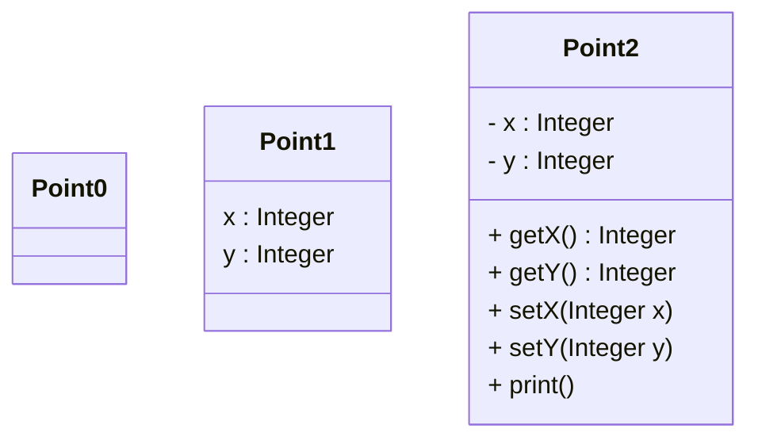
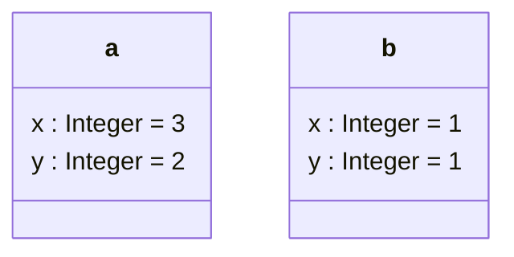

+++
title = "Programiranje 2"
date = 2026-02-03T07:07:07+01:00
draft = false
math = true
mermaid = true

summary = "Zapiski za predmet Programiranje 2 za poletni semester prvega letnika FERI RIT UNI."
summary_enable = true
summary_style = "subtitle"
+++

## Uvod v objektno orientirano programiranje

**Objekt** - ograjuje stanje in obnašanje. Vsak objekt ima neko stanje, katero zapišemo z instančnimi spremenljivkami. 

**Razred** - šablona za ustvarjanje objektov. Specificirajo kako objekti izgledajo, kakšno imajo strukturo in obnašanje

- **Stanje** oz. **strukturo objektov** opišemo s spremenljivkami, ki jim pravimo **spremenljivke objekta** ali tudi **instančne spremenljivke (angl. instance variables)**, obnašanje pa s sporočili oz. z **metodami (angl. methods)**. 
	
- Pravimo tudi, da je objekt množica metod, ki si delijo stanje.

- Vsak objekt, ki pripada istemu razredu ima enako strukturo, enake instančne spremenljivke, vendar se med sabo razilkujejo v vrednostih teh instančnih spremenljivk. Vsi objekti nekega razreda se znajo odzivat na enaka sporočila (imajo definirane iste metode).

- Opis strukture in metod zapišemo v razred. Razred je šablona po kateri ustvarimo objekte.
	
> [!WARNING] 
> Objektna spremenljivka je nekaj drugega kot spremenljivka objekta!!! Objektna spremenljivka je namreč objekt, ki pa ga sestavljajo neke instančne spremenljivke (spremenljivke objekta).

---

### Definicija razreda

Razred definiramo z rezervirano besedo `class` za katero sledi ime našega razreda (identifikator, ki naš razred enolično določi). Razred bo specificiralo stanje in obnašanje:
- Stanje opišemo z **instančnimi spremenljivkami**, ki jih običajno zaščitimo (z besedico `private`). To bo pomenilo, da bodo lahko do teh (zaščitenih) instančnih spremenljivk lahko dostopale samo metode tega razreda, medtem ko pa iz glavnega main programa pa ne bomo mogli dostopati do teh podatkov.

```cpp
class X {
private:
    // podatki (instančne spremenljivke)

public:
    // metode
};
```

- **Instančne spremenljivke** bomo zapisovali v privaten del (`private`). To bodo skrite komponente tega razreda.
- Javne komponente (`public`) pa bodo **metode** tega razreda, na katere bodo se objekti tega razreda znali odzivat. Te metode pa bodo dostopale do podatkov.

- Definicija razreda – zapišemo v vključitveno datoteko
	- Implementacija metod sledi v cpp datoteki, ki mora vključit vključitveno datoteko
- Implementacija razreda – glavna datoteka 
- Z razredom definiramo nov tip (ADT), ki se obnaša podobno kot vgrajeni tip. Lahko ustvarjamo več spremenljivk takšnega tipa, katerim pravimo objektne spremenljivke oz. objekti
- Dosežemo **Kapsuliranje oz. ograjevanje**. To pomeni, da določene komponente izvozimo (so javne), druge komponente so skrite oz. privatne 
V razredu opišemo strukturo in obnašanje. Kakšno strukturo bodo imeli objekti nekega objekta in kako se bodo obnašali oz. na kakšna sporočila bodo se znali odzivat

---

### Ustvarjanje objekta

- Kreiramo lahko spremenljivke takšnega razreda (tipa) 
- Spremenljivko razreda imenujemo **objektna spremenljivka** ali **objekt**

Primer datoteke `example.cpp`:

```example.cpp
X o;
```

Spremenljivka `o` je **objekt tipa `X`**.

Objekt `o` je **primerek razreda** `X` oziroma objektna spremenljivka razreda `X`.  
To pomeni, da je objekt nekaj, kar je ustvarjeno na podlagi definicije razreda `X`.

V razredu `X` bomo navedli instančne spremenljivke (stanje objekta), katere pa bomo obdali (ogradili) z metodami. Metode ograjujejo stanje. Do stanja ne bomo mogli tako priti direktno, ampak samo preko metod.

Z razredom povemo kako bodo izgledali objekti, kakšno strukturo in stanje bodo imeli in na kakšna sporočila se bodo odzivali. Sam razred ne ustvari objektov, z deklaracijami spremenljivk (objektov) pa mi potem ustvarimo objekt. V našem primeru torej objekt  `o` je **primerek razreda** `X`.

---

### Definicija razreda

Primer: 
Želimo imeti aplikacijo s točkami in radi bi računali razdalje med točkami. Potrebovali bi razred točka. Kako morajo zgledati točke in kako objekti točke, kakšno strukturo in kakšno stanje imajo?

Za dvodimenzionalne točke bomo potrebovali opis z `x` in `y` koordinato. To pomeni, da bo vsak objekt tega razreda vseboval koordinato.

- V datoteko Point.h zapišemo razred, ki ga poimenujemo z besedo `Point`. 
- Vsaka točka bo opisana s koordinatama `x` in `y`, ki pa bosta tipa `int`. Ker želimo podatke skrivat (podatki morajo biti privatne komponente), zapišemo pod private (podatka `x` in `y` bosta instančni spremenljivki in bosta določali strukturo naših objektov)
- Sedaj se moramo vprašat na kakšna sporočila bodo ti objekti tega razreda se znali odzivat (metode objekta). Metode so del razreda s katerimi lahko mi dostopamo do instančnih spremenljivk! 
- Dostopali bomo do instančnih spremenljivk `x` in `y` (metodi `getX` in `getY`)
- `setX` in `setY` bosta imela nalogo, da nastavita `x` in `y` komponento. Dobila (`setX` in `setY`) bosta nek vhodni podatek in nastavila instančno spremenljivko `x` in `y`.
- Metoda `print()` bo pa izpisala našo točko

#### 1. Korak - Definicija razreda Point.h

```Point.h
class Point {
private:
    int x, y;
public :
    int getX();
    Int getY();
    void setX(int x); //parametre (parameter x v tem primeru), običajno poimenujemo enako kot instančne spremenljivke, saj imajo parametri prednost pred instančnimi spremenljivkami
    void setY(int y);
    void print();
};
```

Objekti razreda Point bodo imeli dve instančni spremenljivki `x` in `y`, znali pa se bodo odzivat na sporočila `getX`, `getY`, `setX`, `setY` in `print`.

S to končano definicijo razreda pa še nismo ustvarili nobenega objekta. Z definicijo razreda smo samo naredili strojček, ki bo znal izdelovati objekte. Ko bomo zahtevali, da se objekt razreda Point ustvari bo prevajalnik šel pogledat kako izgleda stanje tega razreda, kakšno strukturo imajo objekti takega razreda (instančne spremenljivke) in na kakšna sporočila (metode) se bodo znali odzivat.

Z UML notacijo razrede zapišemo v škatlicah. UML notacija ni odvisna od programskega jezika ampak je samo vizualna predstavitev razredov in njihovih medsebojnih povezav.



- Z minusom (`-`) povemo, da gre za privatne komponente razreda
- S plusom (`+`) povemo, da gre za javne komponente razreda

#### 2. Korak - Implementacija razreda 

Definicija razreda se zapiše v datoteko `.h`:

```Point.h
class Point{
private :
    int x, y;
public :
    int getX();
    int getY();
    void setX(int x);
    void setY(int y);
    void print();
}
```

Implementacija razreda se zapiše v datoteko `.cpp`:

```Point.cpp
include <iostream>
include "Point.h"

int Point::getX() {
    return x;
}
int Point::getY() {
    return y;
}
void Point::setX(int x) {
    this->x=x;
}
void Point::setY(int y) {
    this->y=y;
}

void Point::print() {
    std::cout << "(" << x << "," << y << ")" << std::endl;
}
```

Ker `x` predstavlja tako formalni parameter kot tudi instančno spremenljivko, ni priporočljivo uporabljati `using namespace std`; raje ga ne bomo uporabljali, četudi v majhnih vajnih programih ne predstavlja problema! Namespace namreč poskuša razreševati primere, ko imamo identifikator, ki označuje različne zadeve. Npr. da imamo programsko kodo, kateri bi dodali programsko kodo nekega drugega programerja. V primeru, da bi ta v svojem programu uporabil identifikatorje, ki so enaki našim, bi se ti identifikatorji med sabo tepli in prišlo bi do problemov pri zagonu programa - identifikatorje bi morali ročno spreminjati. **Namesto tega zato uporabljamo operacijo globalnega dosega (`std::`)**.

#### 3. Korak - Ustvarjanje objektov

```example.cpp
// Example01.cpp
#include <iostream>
#include "Point.h"

int main() {
    Point a;
    Point b;
    a.setX(3);
    a.setY(2);
    b.setX(1);
    b.setY(1);
    std::cout << a.getX() << std::endl;
    std::cout << a.getY() << std::endl;
    //b.x=10;
    a.print();
    b.print();
    return 0;
}
```

Vsi objekti razreda `Point` imajo enako strukturo in obnašanje - imajo komponenti `x` in `y`, ter metode `getX`, `getY`, `setX`, `setY` in `print`.

Objektu `a` pošljemo sporočilo `setX` z vrednostjo 3. Prevajalnik bo šel v definicijo razreda in ugotovil, da imamo metodo `setX(int x)`. Formalni parameter `x` bo povezal z vrednostjo 3. V implementaciji razreda (2. korak) bo vrednost 3 nastavil na instančno spremenljivko `x`.

Naslednje sporočilo - objektu `a` pošljemo sporočilo `setY` z dejanskim parametrom 2, `a` je primerek razreda `Point`. Prevajalnik gre pogledat v definicijo, imamo metodo `setY` in jo lahko izvedemo. Ta metoda nastavi instančno spremenljivko `y` na vrednost 2.

Podobno naredimo za instanco razreda (objekt) `b`, kjer s `setX` in `setY` nastavimo vrednosti instančnima spremenljivkama `x` in `y`.

Objektu `a` pošljemo sporočilo `getX` (`a.getX()`). `a` je primerek razreda `Point`. Gremo v definicijo razreda `Point`, imamo notri metodo `getX`, ki vrne vrednost 3 - vrednost spremenljivke `x` objekta `a`. Podobno objektu `a` pošljemo še sporočilo `getY`, ki vrne vrednost instančne spremenljivke `y` objekta `a`, torej 2.

V programu imamo lahko več objektov. Z njihovimi identifikatorji jih ločimo med sabo, tako da lahko mi, kot tudi prevajalnik, vemo, do vrednosti katerega objekta želimo dostopati (objekta `a` ali objekta `b` - v našem primeru).

Na koncu lahko še tako objektu `a` kot `b` pošljemo sporočilo `print()`. Ta izpiše točki - za objekt `a` bomo dobili izpis `(3,2)`, za objekt `b` pa `(1,1)`.

Objekta `a` in `b` sta si enaka po strukturi (oba imata `x` in `y` ter enake metode), razlikujeta pa se po **vrednostih** teh instančnih spremenljivk:



**Primeri sprememb našega programa:**

```cpp
b.x = 10;
```

V primeru, da bi poskusili dostopati direktno do instančnih spremenljivk (ki so skrite - `private`), bo prevajalnik javil napako in nam povedal, da je `x` private! Do njega bomo lahko dostopali le preko metod.

```example.cpp
#include <iostream>
#include "Point.h"

int main() {
    Point a;
    Point b;
    /*
    a.setX(3);
    a.setY(2);
    b.setX(1);
    b.setY(1);
    */
    std::cout << a.getX() << std::endl;
    std::cout << a.getY() << std::endl;
    //b.x=10;
    a.print();
    b.print();
    return 0;
}
```

V primeru, da bi zakomentirali del, s katerim bi instančnim spremenljivkam `x` in `y` dodelili neko vrednost, bi mi sicer ustvarili objekta `a` in `b`, vendar bi za metode `getX`, `getY` in `print` dobili neke popolnoma naključne vrednosti instančnih spremenljivk, saj jim vrednosti nismo dodelili.

---

- Skrivanje komponente (data hiding) razreda dosežemo z določilom private. 
- Komponento izvozimo z določilom public.
- Vse komponente, ki so skrite lahko načrtovalec razreda poljubno spreminja ne da bi to vplivalo na programsko kodo, ki uporablja ta razred. 
- Ograjevanje (kapsuliranje) je eno izmed temeljev OOP, saj omogoča enostavnejšo spreminjanje in vzdrževanje programov.

- Kratke metode lahko zapišemo kar v definicijo razreda (vključitvena datoteka). Prevajalnik jih bo obravnaval kot vrinjene (inline) metode. 

```Point.h
class Point{
private :
    int x, y;
public :
    int getX() {return x;}
    int getY() {return y;}
    void setX(int x) {this -> x=x;}
    void setY(int y) {this -> y=y;}
    void print();
}
```

- Razred lahko definiramo tudi s ključno besedo `struct`.
- Če razred definiramo s `struct` in ne podamo določil (private) so vse komponente **javne**. 
- Če razred definiramo s `class` in ne podamo določil (public) so vse komponente **skrite**.

```Point.h
struct Point{
    int getX();
    int getY(); 
    void setX(int x);
    void setY(int y);
    void print();
private :
    int x, y;
}
```

---

### Konstruktorji in destruktorji

- Potrebujemo mehanizem za inicializacijo in brisanje objekta.
- **Konstruktor** je metoda, ki se **pokliče ob kreiranju objekta** in rezervira pomnilniški prostor ter inicializira podatke.
- **Destruktor** je metoda, ki se **pokliče ob brisanju objekta** in sprosti pomnilniški prostor.
- Konstruktor in destruktor določata **življenjsko dobo objekta**.

```Point.h
class Point {
private:
    int x, y;
public:
    Point();                // default constructor
    Point(const Point& t);  // copy constructor
    Point(int xy);          // conversion constructor
    Point(int x, int y);    // other constructor
    ~Point();                // destructor
    // methods
    int getX();
    int getY();
    void print();
    double distance(Point t);
};
```

- **Konstruktor** in **destruktor** imata isto ime, kot je ime razreda.
- **Destruktor** ima pred imenom še znak `~` (tilda).
- Konstruktorji in destruktorji ne vračajo vrednosti in ne smejo imeti definiranega tipa metode (niti tipa `void`), prav tako nimajo `return` stavka.
- Konstruktorji imajo lahko več parametrov, medtem ko destruktorji nimajo parametrov.
- Dinamično rezervirani pomnilniški prostor (`new`) moramo sprostiti sami (`delete`), ostali pomnilniški prostor se sprosti avtomatsko.
- Po principu prekrivanja funkcij (overloading) lahko definiramo več konstruktorjev, a le en destruktor.

Npr. če imamo funkcijo `f`: `int f();`, `int f(int x);`, `int f(int x, int y);` - vedno lahko pokličemo funkcijo `f` in prevajalnik bo vedel, katero funkcijo kličemo na podlagi argumentov. Npr. `f(5)` - vemo, da kličemo funkcijo `f` z enim argumentom (`int f(int x)`). Enako velja za konstruktorje - iz argumentov se bo natančno vedelo, za kateri konstruktor gre.

- **Privzeti konstruktor** je konstruktor brez argumentov (običajno ga uporabljamo, ko delamo polje nekih objektov).
- **Kopirni konstruktor** tvori objekt iz že obstoječega. Njegov argument je referenca na že obstoječ objekt tega razreda. Kopirni konstruktor naredi kopijo (klon) obstoječega objekta. Uporabljamo ga, ko bomo nek objekt poslali kot formalni parameter neke metode.
- **Pretvorbeni konstruktor** tvori nov objekt iz drugega podatkovnega tipa (npr. pretvorba iz celega števila v točko).
- **Ostali konstruktorji** imajo drugačne argumente in nimajo posebnega imena - npr. konstruktor za ustvaritev točke, ki sprejme dva podatka `x` in `y` ter nastavi instančne spremenljivke.
- Če ju programer ne zapiše, prevajalnik priskrbi privzeti in kopirni konstruktor ter destruktor.

Destruktorji nimajo argumentov, zato lahko obstaja samo en destruktor.

V primeru, da privzeti in kopirni konstruktor ne opravljata nobenega dodatnega dela, ju ne pišemo, saj ju priskrbi prevajalnik. Primer:

```Point.h
class Point {
private:
    int x, y;
public:
    int getX();
    int getY();
    void setX(int x);
    void setY(int y);
    void print();
};
```

```example.cpp
#include <iostream>
#include "Point.h"

int main() {
    Point a;     // privzeti konstruktor
    Point b(a);  // kopirni konstruktor - ustvari objekt b tako, da klonira objekt a

    /*
    a.setX(3);
    a.setY(2);
    b.setX(1);
    b.setY(1);
    */

    std::cout << a.getX() << std::endl;
    std::cout << a.getY() << std::endl;
    //b.x=10;
    a.print();
    b.print();
    return 0;
}
```

Kopirnega konstruktorja mi nismo zapisali, vendar bo program še vedno deloval - drugi objekt (`b`) bo kopija točke `a`.

```Point.cpp
#include <iostream>
#include <cmath>
#include "Point.h"

Point::Point() : x(0), y(0) {
}
Point::Point(const Point& t) : x(t.x), y(t.y) {
}
Point::Point(int xy) : x(xy), y(xy) {
}
Point::Point(int x, int y) {
    this->x=x;
    this->y=y;
}
Point::~Point() {
}
int Point::getX() {
    return x;
}
int Point::getY() {
    return y;
}
void Point::print() {
    std::cout << "(" << x << ", " << y << ") " << std::endl;
}
double Point::distance(Point t) {
    return std::sqrt((double)(x - t.x)*(x - t.x)+(y - t.y)*(y - t.y));
}
```

`Point::Point() : x(0), y(0) {}` je **privzeti konstruktor**, `Point::Point(const Point& t) : x(t.x), y(t.y) {}` je **kopirni konstruktor**, `Point::Point(int xy) : x(xy), y(xy) {}` je konstruktor za **pretvorbo** celega števila v točko, `Point::Point(int x, int y)` je konstruktor, ki sprejme dva parametra, `Point::~Point()` je **destruktor**, `double Point::distance(Point t)` pa je metoda, ki računa razdaljo med dvema točkama.

#### Inicializacijski seznam

**Inicializacijski seznam** (angl. *initialization list*) pomeni, da takoj za imenom konstruktorja (za oklepajema `()`) zapišemo dvopičje in seznam instančnih spremenljivk, ki dobijo vrednosti, zapisane v oklepaju - npr. da instančni spremenljivki `x` in `y` postavimo na nič. Ko prevajalnik ustvari objekt, konstruktor poskrbi za to, da se objekt ustvari - nato se ustvari pomnilniška lokacija za `x`, zatem pa se ta lokacija za `x` že inicializira na vrednost 0, podobno na enak način tudi `y`. Z inicializacijskim seznamom mi istočasno objekt ustvarimo, ter ga že inicializiramo!

Seveda bo delal tudi ta zapis:

```cpp
Point::Point() {
    x=y=0;
}
```

Vendar bi tu konstruktor razreda `Point` povedal, da imajo vsi objekti tega razreda `x` in `y`. Ustvarili bi celico `x` in `y`, nato pa bi morali dostopati do `x` in `y`, ter jima priredili vrednost 0. Ta dostop je odveč! Ustvarjanje prostora ter inicializacija prostora bi bila izvedena ne v enem, ampak v dveh korakih, kar je manj učinkovito.

Podobno lahko konstruktor z dvema parametroma zapišemo tudi z inicializacijskim seznamom:

```cpp
Point::Point(int x, int y) : x(x), y(y) {
}
```

Način zapisa z inicializacijskim seznamom je implementacijsko učinkovitejši - **hitrejši**!

```Point.cpp
...
Point::Point() : x(0), y(0) {
}
Point::Point(const Point& t) : x(t.x), y(t.y) {
}
Point::Point(int xy) : x(xy), y(xy) {
}
Point::Point(int x, int y) : x(x), y(y) {
}
...
```

> [!WARNING] 
> Kopirni konstruktor vedno prenašamo po referenci!

---

### Primer s konstruktorji

```example.cpp
// Example02.cpp
#include <iostream>
#include "Point.h"

int main() {
    Point a;      // konstruktor, ki nima parametra (privzeti k.)
    Point b(5);   // pretvorbeni k.
    Point c(4,3); // k. z dvema parametroma
    Point d(c);   // kopirni k.
    a.print();
    b.print();
    c.print();
    d.print();
    std::cout << a.distance(c) << std::endl;
    //std::cout << a.distance(5) << std::endl;
    return 0;
}
```

Privzeti konstruktor nastavi `x` in `y` na 0 (objekt `a`). Število 5 pretvorimo v točko - pretvorbeni konstruktor (objekt `b`: `x=5, y=5`). `c` je ustvarjen s konstruktorjem, ki sprejme dva parametra (`x=4, y=3`). `d` je nov objekt, ki je kopija `c`-ja (objekt `d` je enak objektu `c`).

Radi bi izračunali tudi razdaljo med `a` in številom 5:

```cpp
//std::cout << a.distance(5) << std::endl;
```

Ta metoda pa prejme točko, mi pa smo notri poslali celo število! Tu bi prevajalnik moral javiti napako. Ker pa smo mi zapisali pretvorbeni konstruktor (iz celega števila pretvorba v točko), bo prevajalnik število 5 najprej pretvoril v točko `(5,5)` in nato izračunal razdaljo med točko `a` `(0,0)` in točko `(5,5)`.

Lahko imamo tudi polje objektov:

```cpp
Point arr[3]; // imamo polje treh točk
for (int i=0; i<3; i++)
    arr[i].print();
```

Vsak element tega polja je točka. Za vsak element polja se pokliče privzeti konstruktor, zato bo izpisalo `(0,0)`, `(0,0)`, `(0,0)` - imeli pa bomo 3 različne objekte.

---

### Alokacije

- **Statična** alokacija
- **Avtomatična** alokacija
- **Dinamična** alokacija

**Statična alokacija:** pomeni, da je neka spremenljivka (objekt) živa za ves čas izvajanja programa. Ne uporabljamo je pogosto. Nimamo vpliva na življenjsko dobo spremenljivke oz. objekta - od trenutka, ko se program začne, do trenutka ko se program konča, je spremenljivka živa in obstaja.

**Avtomatična alokacija:** spremenljivke imamo v telesu funkcij ali gnezdenih funkcij (znotraj blokov `{}`). Programer nima kontrole nad življenjsko dobo teh spremenljivk - žive so od njihove definicije pa do konca bloka, v katerem so. Po zaključenem bloku se uničijo. To so drugače imenovane lokalne spremenljivke.

**Dinamična alokacija:** programer samostojno odloča, kdaj se bo nek objekt ustvaril in kdaj brisal. Za to uporabljamo operatorja `new` in `delete`.
- Z operatorjem `new` bomo poklicali nek konstruktor - `new` pa bo vrnil naslov na objekt, ki se je ustvaril.
- Z operatorjem `delete` se pokličejo destruktorji in naslov do teh objektov se izbriše.

```example.cpp
std::cout << "Dynamic allocation" << std::endl;
Point* e = new Point();     // poklicali smo privzeti konstruktor
Point* f = new Point(5);    // poklicali smo pretvorbeni konstruktor
Point* g = new Point(2,3);  // konstruktor z dvema parametroma
Point* h = new Point(*g);   // kopirni konstruktor
e->print();
f->print();
g->print();
h->print();
delete e;
delete f;
delete g;
delete h;
```

`e` je **kazalec** na `Point`. `e` **ni objekt**! `e` je samo kazalec na objekt.

`e` je neka celica, v kateri imamo shranjen naslov. Ta naslov smo dobili od operatorja `new`, ko je ta ustvaril objekt (ob `new` se je poklical konstruktor, ki je vrnil ta objekt). Do tega objekta ne moremo dostopati direktno, lahko pa preko kazalca `e`.

Ker je `g` kazalec, kopirni konstruktor pa kazalcev ne sprejema (sprejema le referenco na objekt), smo morali `g` dereferencirati (pretvoriti v objekt), da smo ga lahko poslali kopirnemu konstruktorju (`*g`).

> [!WARNING]
> Z dereferenciranjem kazalca pridemo do objekta (`*e`).
>
> `*e.print();` → **NAROBE** - operator dereferenciranja ima namreč manjšo prioriteto kot operator dostopa do komponente.
>
> `(*e).print();` → **PRAV** - z oklepajem damo vedeti, da mora dereferenciranje imeti prednost.

Vsem objektom (`e`, `f`, `g`, `h`) pošljemo sporočilo `print()`, vendar preko kazalca. `delete e; delete f; delete g; delete h;` pa pokličejo ustrezne destruktorje.

Dinamična alokacija se dogaja na kupici (angl. *heap*), medtem ko se avtomatična in statična alokacija dogajata na skladu (angl. *stack*).

---

### Pravila dobrega programiranja

- Dovolj kratke metode zapišemo znotraj definicije razreda. 
- Za vidnost komponent vedno navedimo določili `public` in `private`. 
- Zaradi večje preglednosti v razredu navedimo določili `public` in `private` le enkrat. 
- Če kopirni konstruktor in destruktor ne opravljata nobenega dodatnega dela ga naj priskrbi prevajalnik! **JIH NE PIŠEMO SAMI**!

### Napake programiranja

- Razred ali struktura se ne zaključi s podpičjem. (MORAMO DODATI `;`)
- Definicija izhodnega tipa za konstruktor ali destruktor. 
- Vračanje vrednosti iz konstruktorja ali destruktorja s stavkom `return`. (nimajo return stavka!!!)
- Ne definiramo privzetega konstruktorja, če smo definirali druge konstruktorje. 
- Definicija destruktorja z argumenti. 
- Doseganje privatnih komponent razreda.
