+++
title = "Programiranje 2"
date = 2021-03-07T07:07:07+01:00
draft = false
math = true
mermaid = true
tags = ["1. letnik", "poletni semester"]
categories = ["RIT UNI"]

summary = "Zapiski za predmet Programiranje 2 za poletni semester prvega letnika FERI RIT UNI."
summary_enable = true
summary_style = "subtitle"
+++

## Uvod v objektno orientirano programiranje

**Objekt** - ograjuje stanje in obnašanje. Vsak objekt ima neko stanje, katero zapišemo z instančnimi spremenljivkami. 

**Razred** - šablona za ustvarjanje objektov. Specificirajo kako objekti izgledajo, kakšno imajo strukturo in obnašanje

- **Stanje** oz. **strukturo objektov** opišemo s spremenljivkami, ki jim pravimo **spremenljivke objekta** ali tudi **instančne spremenljivke (angl. instance variables)**, obnašanje pa s sporočili oz. z **metodami (angl. methods)**. 
	
- Pravimo tudi, da je objekt množica metod, ki si delijo stanje.

- Vsak objekt, ki pripada istemu razredu ima enako strukturo, enake instančne spremenljivke, vendar se med sabo razilkujejo v vrednostih teh instančnih spremenljivk. Vsi objekti nekega razreda se znajo odzivat na enaka sporočila (imajo definirane iste metode).

- Opis strukture in metod zapišemo v razred. Razred je šablona po kateri ustvarimo objekte.
	
> [!WARNING] 
> Objektna spremenljivka je nekaj drugega kot spremenljivka objekta!!! Objektna spremenljivka je namreč objekt, ki pa ga sestavljajo neke instančne spremenljivke (spremenljivke objekta).

---

### Definicija razreda

Razred definiramo z rezervirano besedo `class` za katero sledi ime našega razreda (identifikator, ki naš razred enolično določi). Razred bo specificiralo stanje in obnašanje:
- Stanje opišemo z **instančnimi spremenljivkami**, ki jih običajno zaščitimo (z besedico `private`). To bo pomenilo, da bodo lahko do teh (zaščitenih) instančnih spremenljivk lahko dostopale samo metode tega razreda, medtem ko pa iz glavnega main programa pa ne bomo mogli dostopati do teh podatkov.

```cpp
class X {
private:
    // podatki (instančne spremenljivke)

public:
    // metode
};
```

- **Instančne spremenljivke** bomo zapisovali v privaten del (`private`). To bodo skrite komponente tega razreda.
- Javne komponente (`public`) pa bodo **metode** tega razreda, na katere bodo se objekti tega razreda znali odzivat. Te metode pa bodo dostopale do podatkov.

- Definicija razreda – zapišemo v vključitveno datoteko
	- Implementacija metod sledi v cpp datoteki, ki mora vključit vključitveno datoteko
- Implementacija razreda – glavna datoteka 
- Z razredom definiramo nov tip (ADT), ki se obnaša podobno kot vgrajeni tip. Lahko ustvarjamo več spremenljivk takšnega tipa, katerim pravimo objektne spremenljivke oz. objekti
- Dosežemo **Kapsuliranje oz. ograjevanje**. To pomeni, da določene komponente izvozimo (so javne), druge komponente so skrite oz. privatne 
V razredu opišemo strukturo in obnašanje. Kakšno strukturo bodo imeli objekti nekega objekta in kako se bodo obnašali oz. na kakšna sporočila bodo se znali odzivat

---

### Ustvarjanje objekta

- Kreiramo lahko spremenljivke takšnega razreda (tipa) 
- Spremenljivko razreda imenujemo **objektna spremenljivka** ali **objekt**

Primer datoteke `example.cpp`:

```example.cpp
X o;
```

Spremenljivka `o` je **objekt tipa `X`**.

Objekt `o` je **primerek razreda** `X` oziroma objektna spremenljivka razreda `X`.  
To pomeni, da je objekt nekaj, kar je ustvarjeno na podlagi definicije razreda `X`.

V razredu `X` bomo navedli instančne spremenljivke (stanje objekta), katere pa bomo obdali (ogradili) z metodami. Metode ograjujejo stanje. Do stanja ne bomo mogli tako priti direktno, ampak samo preko metod.

Z razredom povemo kako bodo izgledali objekti, kakšno strukturo in stanje bodo imeli in na kakšna sporočila se bodo odzivali. Sam razred ne ustvari objektov, z deklaracijami spremenljivk (objektov) pa mi potem ustvarimo objekt. V našem primeru torej objekt  `o` je **primerek razreda** `X`.

---

### Definicija razreda

Primer: 
Želimo imeti aplikacijo s točkami in radi bi računali razdalje med točkami. Potrebovali bi razred točka. Kako morajo zgledati točke in kako objekti točke, kakšno strukturo in kakšno stanje imajo?

Za dvodimenzionalne točke bomo potrebovali opis z `x` in `y` koordinato. To pomeni, da bo vsak objekt tega razreda vseboval koordinato.

- V datoteko Point.h zapišemo razred, ki ga poimenujemo z besedo `Point`. 
- Vsaka točka bo opisana s koordinatama `x` in `y`, ki pa bosta tipa `int`. Ker želimo podatke skrivat (podatki morajo biti privatne komponente), zapišemo pod private (podatka `x` in `y` bosta instančni spremenljivki in bosta določali strukturo naših objektov)
- Sedaj se moramo vprašat na kakšna sporočila bodo ti objekti tega razreda se znali odzivat (metode objekta). Metode so del razreda s katerimi lahko mi dostopamo do instančnih spremenljivk! 
- Dostopali bomo do instančnih spremenljivk `x` in `y` (metodi `getX` in `getY`)
- `setX` in `setY` bosta imela nalogo, da nastavita `x` in `y` komponento. Dobila (`setX` in `setY`) bosta nek vhodni podatek in nastavila instančno spremenljivko `x` in `y`.
- Metoda `print()` bo pa izpisala našo točko

#### 1. Korak - Definicija razreda Point.h

```Point.h
class Point {
private:
    int x, y;
public :
    int getX();
    Int getY();
    void setX(int x); //parametre (parameter x v tem primeru), običajno poimenujemo enako kot instančne spremenljivke, saj imajo parametri prednost pred instančnimi spremenljivkami
    void setY(int y);
    void print();
};
```

Objekti razreda Point bodo imeli dve instančni spremenljivki `x` in `y`, znali pa se bodo odzivat na sporočila `getX`, `getY`, `setX`, `setY` in `print`.

S to končano definicijo razreda pa še nismo ustvarili nobenega objekta. Z definicijo razreda smo samo naredili strojček, ki bo znal izdelovati objekte. Ko bomo zahtevali, da se objekt razreda Point ustvari bo prevajalnik šel pogledat kako izgleda stanje tega razreda, kakšno strukturo imajo objekti takega razreda (instančne spremenljivke) in na kakšna sporočila (metode) se bodo znali odzivat.

Z UML notacijo razrede zapišemo v škatlicah. UML notacija ni odvisna od programskega jezika ampak je samo vizualna predstavitev razredov in njihovih medsebojnih povezav.

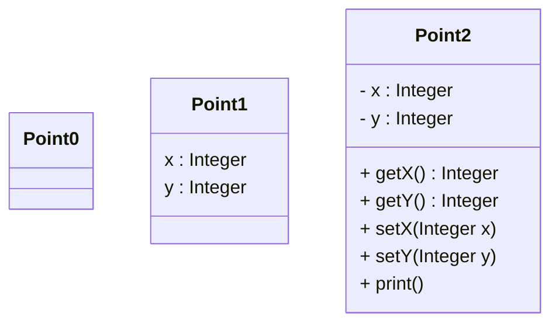
```mermaid
classDiagram

class Point0

class Point1 {
    x : Integer
    y : Integer
}

class Point2 {
    - x : Integer
    - y : Integer

    + getX() Integer
    + getY() Integer
    + setX(Integer x)
    + setY(Integer y)
    + print()
}
```

- Z minusom (`-`) povemo, da gre za privatne komponente razreda
- S plusom (`+`) povemo, da gre za javne komponente razreda

#### 2. Korak - Implementacija razreda 

Definicija razreda se zapiše v datoteko `.h`:

```Point.h
class Point{
private :
    int x, y;
public :
    int getX();
    int getY();
    void setX(int x);
    void setY(int y);
    void print();
}
```

Implementacija razreda se zapiše v datoteko `.cpp`:

```Point.cpp
include <iostream>
include "Point.h"

int Point::getX() {
    return x;
}
int Point::getY() {
    return y;
}
void Point::setX(int x) {
    this->x=x;
}
void Point::setY(int y) {
    this->y=y;
}

void Point::print() {
    std::cout << "(" << x << "," << y << ")" << std::endl;
}
```

Ker `x` predstavlja tako formalni parameter kot tudi instančno spremenljivko, ni priporočljivo uporabljati `using namespace std`; raje ga ne bomo uporabljali, četudi v majhnih vajnih programih ne predstavlja problema! Namespace namreč poskuša razreševati primere, ko imamo identifikator, ki označuje različne zadeve. Npr. da imamo programsko kodo, kateri bi dodali programsko kodo nekega drugega programerja. V primeru, da bi ta v svojem programu uporabil identifikatorje, ki so enaki našim, bi se ti identifikatorji med sabo tepli in prišlo bi do problemov pri zagonu programa - identifikatorje bi morali ročno spreminjati. **Namesto tega zato uporabljamo operacijo globalnega dosega (`std::`)**.

#### 3. Korak - Ustvarjanje objektov

```example.cpp
// Example01.cpp
#include <iostream>
#include "Point.h"

int main() {
    Point a;
    Point b;
    a.setX(3);
    a.setY(2);
    b.setX(1);
    b.setY(1);
    std::cout << a.getX() << std::endl;
    std::cout << a.getY() << std::endl;
    //b.x=10;
    a.print();
    b.print();
    return 0;
}
```

Vsi objekti razreda `Point` imajo enako strukturo in obnašanje - imajo komponenti `x` in `y`, ter metode `getX`, `getY`, `setX`, `setY` in `print`.

Objektu `a` pošljemo sporočilo `setX` z vrednostjo 3. Prevajalnik bo šel v definicijo razreda in ugotovil, da imamo metodo `setX(int x)`. Formalni parameter `x` bo povezal z vrednostjo 3. V implementaciji razreda (2. korak) bo vrednost 3 nastavil na instančno spremenljivko `x`.

Naslednje sporočilo - objektu `a` pošljemo sporočilo `setY` z dejanskim parametrom 2, `a` je primerek razreda `Point`. Prevajalnik gre pogledat v definicijo, imamo metodo `setY` in jo lahko izvedemo. Ta metoda nastavi instančno spremenljivko `y` na vrednost 2.

Podobno naredimo za instanco razreda (objekt) `b`, kjer s `setX` in `setY` nastavimo vrednosti instančnima spremenljivkama `x` in `y`.

Objektu `a` pošljemo sporočilo `getX` (`a.getX()`). `a` je primerek razreda `Point`. Gremo v definicijo razreda `Point`, imamo notri metodo `getX`, ki vrne vrednost 3 - vrednost spremenljivke `x` objekta `a`. Podobno objektu `a` pošljemo še sporočilo `getY`, ki vrne vrednost instančne spremenljivke `y` objekta `a`, torej 2.

V programu imamo lahko več objektov. Z njihovimi identifikatorji jih ločimo med sabo, tako da lahko mi, kot tudi prevajalnik, vemo, do vrednosti katerega objekta želimo dostopati (objekta `a` ali objekta `b` - v našem primeru).

Na koncu lahko še tako objektu `a` kot `b` pošljemo sporočilo `print()`. Ta izpiše točki - za objekt `a` bomo dobili izpis `(3,2)`, za objekt `b` pa `(1,1)`.

Objekta `a` in `b` sta si enaka po strukturi (oba imata `x` in `y` ter enake metode), razlikujeta pa se po **vrednostih** teh instančnih spremenljivk:

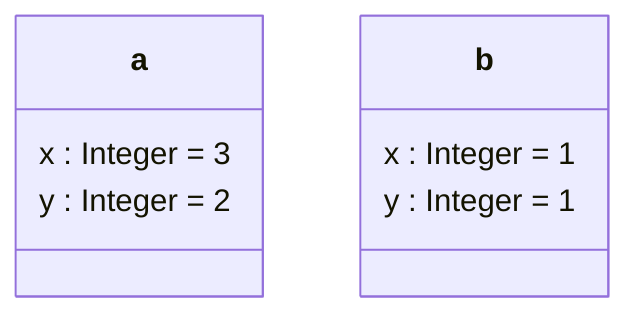
```mermaid
classDiagram
    class a {
        x : Integer = 3
        y : Integer = 2
    }
    class b {
        x : Integer = 1
        y : Integer = 1
    }
```

**Primeri sprememb našega programa:**

```cpp
b.x = 10;
```

V primeru, da bi poskusili dostopati direktno do instančnih spremenljivk (ki so skrite - `private`), bo prevajalnik javil napako in nam povedal, da je `x` private! Do njega bomo lahko dostopali le preko metod.

```example.cpp
#include <iostream>
#include "Point.h"

int main() {
    Point a;
    Point b;
    /*
    a.setX(3);
    a.setY(2);
    b.setX(1);
    b.setY(1);
    */
    std::cout << a.getX() << std::endl;
    std::cout << a.getY() << std::endl;
    //b.x=10;
    a.print();
    b.print();
    return 0;
}
```

V primeru, da bi zakomentirali del, s katerim bi instančnim spremenljivkam `x` in `y` dodelili neko vrednost, bi mi sicer ustvarili objekta `a` in `b`, vendar bi za metode `getX`, `getY` in `print` dobili neke popolnoma naključne vrednosti instančnih spremenljivk, saj jim vrednosti nismo dodelili.

---

- Skrivanje komponente (data hiding) razreda dosežemo z določilom private. 
- Komponento izvozimo z določilom public.
- Vse komponente, ki so skrite lahko načrtovalec razreda poljubno spreminja ne da bi to vplivalo na programsko kodo, ki uporablja ta razred. 
- Ograjevanje (kapsuliranje) je eno izmed temeljev OOP, saj omogoča enostavnejšo spreminjanje in vzdrževanje programov.

- Kratke metode lahko zapišemo kar v definicijo razreda (vključitvena datoteka). Prevajalnik jih bo obravnaval kot vrinjene (inline) metode. 

```Point.h
class Point{
private :
    int x, y;
public :
    int getX() {return x;}
    int getY() {return y;}
    void setX(int x) {this -> x=x;}
    void setY(int y) {this -> y=y;}
    void print();
}
```

- Razred lahko definiramo tudi s ključno besedo `struct`.
- Če razred definiramo s `struct` in ne podamo določil (private) so vse komponente **javne**. 
- Če razred definiramo s `class` in ne podamo določil (public) so vse komponente **skrite**.

```Point.h
struct Point{
    int getX();
    int getY(); 
    void setX(int x);
    void setY(int y);
    void print();
private :
    int x, y;
}
```

---

### Konstruktorji in destruktorji

- Potrebujemo mehanizem za inicializacijo in brisanje objekta.
- **Konstruktor** je metoda, ki se **pokliče ob kreiranju objekta** in rezervira pomnilniški prostor ter inicializira podatke.
- **Destruktor** je metoda, ki se **pokliče ob brisanju objekta** in sprosti pomnilniški prostor.
- Konstruktor in destruktor določata **življenjsko dobo objekta**.

```Point.h
class Point {
private:
    int x, y;
public:
    Point();                // default constructor
    Point(const Point& t);  // copy constructor
    Point(int xy);          // conversion constructor
    Point(int x, int y);    // other constructor
    ~Point();                // destructor
    // methods
    int getX();
    int getY();
    void print();
    double distance(Point t);
};
```

- **Konstruktor** in **destruktor** imata isto ime, kot je ime razreda.
- **Destruktor** ima pred imenom še znak `~` (tilda).
- Konstruktorji in destruktorji ne vračajo vrednosti in ne smejo imeti definiranega tipa metode (niti tipa `void`), prav tako nimajo `return` stavka.
- Konstruktorji imajo lahko več parametrov, medtem ko destruktorji nimajo parametrov.
- Dinamično rezervirani pomnilniški prostor (`new`) moramo sprostiti sami (`delete`), ostali pomnilniški prostor se sprosti avtomatsko.
- Po principu prekrivanja funkcij (overloading) lahko definiramo več konstruktorjev, a le en destruktor.

Npr. če imamo funkcijo `f`: `int f();`, `int f(int x);`, `int f(int x, int y);` - vedno lahko pokličemo funkcijo `f` in prevajalnik bo vedel, katero funkcijo kličemo na podlagi argumentov. Npr. `f(5)` - vemo, da kličemo funkcijo `f` z enim argumentom (`int f(int x)`). Enako velja za konstruktorje - iz argumentov se bo natančno vedelo, za kateri konstruktor gre.

- **Privzeti konstruktor** je konstruktor brez argumentov (običajno ga uporabljamo, ko delamo polje nekih objektov).
- **Kopirni konstruktor** tvori objekt iz že obstoječega. Njegov argument je referenca na že obstoječ objekt tega razreda. Kopirni konstruktor naredi kopijo (klon) obstoječega objekta. Uporabljamo ga, ko bomo nek objekt poslali kot formalni parameter neke metode.
- **Pretvorbeni konstruktor** tvori nov objekt iz drugega podatkovnega tipa (npr. pretvorba iz celega števila v točko).
- **Ostali konstruktorji** imajo drugačne argumente in nimajo posebnega imena - npr. konstruktor za ustvaritev točke, ki sprejme dva podatka `x` in `y` ter nastavi instančne spremenljivke.
- Če ju programer ne zapiše, prevajalnik priskrbi privzeti in kopirni konstruktor ter destruktor.

Destruktorji nimajo argumentov, zato lahko obstaja samo en destruktor.

V primeru, da privzeti in kopirni konstruktor ne opravljata nobenega dodatnega dela, ju ne pišemo, saj ju priskrbi prevajalnik. Primer:

```Point.h
class Point {
private:
    int x, y;
public:
    int getX();
    int getY();
    void setX(int x);
    void setY(int y);
    void print();
};
```

```example.cpp
#include <iostream>
#include "Point.h"

int main() {
    Point a;     // privzeti konstruktor
    Point b(a);  // kopirni konstruktor - ustvari objekt b tako, da klonira objekt a

    /*
    a.setX(3);
    a.setY(2);
    b.setX(1);
    b.setY(1);
    */

    std::cout << a.getX() << std::endl;
    std::cout << a.getY() << std::endl;
    //b.x=10;
    a.print();
    b.print();
    return 0;
}
```

Kopirnega konstruktorja mi nismo zapisali, vendar bo program še vedno deloval - drugi objekt (`b`) bo kopija točke `a`.

```Point.cpp
#include <iostream>
#include <cmath>
#include "Point.h"

Point::Point() : x(0), y(0) {
}
Point::Point(const Point& t) : x(t.x), y(t.y) {
}
Point::Point(int xy) : x(xy), y(xy) {
}
Point::Point(int x, int y) {
    this->x=x;
    this->y=y;
}
Point::~Point() {
}
int Point::getX() {
    return x;
}
int Point::getY() {
    return y;
}
void Point::print() {
    std::cout << "(" << x << ", " << y << ") " << std::endl;
}
double Point::distance(Point t) {
    return std::sqrt((double)(x - t.x)*(x - t.x)+(y - t.y)*(y - t.y));
}
```

`Point::Point() : x(0), y(0) {}` je **privzeti konstruktor**, `Point::Point(const Point& t) : x(t.x), y(t.y) {}` je **kopirni konstruktor**, `Point::Point(int xy) : x(xy), y(xy) {}` je konstruktor za **pretvorbo** celega števila v točko, `Point::Point(int x, int y)` je konstruktor, ki sprejme dva parametra, `Point::~Point()` je **destruktor**, `double Point::distance(Point t)` pa je metoda, ki računa razdaljo med dvema točkama.

#### Inicializacijski seznam

**Inicializacijski seznam** (angl. *initialization list*) pomeni, da takoj za imenom konstruktorja (za oklepajema `()`) zapišemo dvopičje in seznam instančnih spremenljivk, ki dobijo vrednosti, zapisane v oklepaju - npr. da instančni spremenljivki `x` in `y` postavimo na nič. Ko prevajalnik ustvari objekt, konstruktor poskrbi za to, da se objekt ustvari - nato se ustvari pomnilniška lokacija za `x`, zatem pa se ta lokacija za `x` že inicializira na vrednost 0, podobno na enak način tudi `y`. Z inicializacijskim seznamom mi istočasno objekt ustvarimo, ter ga že inicializiramo!

Seveda bo delal tudi ta zapis:

```cpp
Point::Point() {
    x=y=0;
}
```

Vendar bi tu konstruktor razreda `Point` povedal, da imajo vsi objekti tega razreda `x` in `y`. Ustvarili bi celico `x` in `y`, nato pa bi morali dostopati do `x` in `y`, ter jima priredili vrednost 0. Ta dostop je odveč! Ustvarjanje prostora ter inicializacija prostora bi bila izvedena ne v enem, ampak v dveh korakih, kar je manj učinkovito.

Podobno lahko konstruktor z dvema parametroma zapišemo tudi z inicializacijskim seznamom:

```cpp
Point::Point(int x, int y) : x(x), y(y) {
}
```

Način zapisa z inicializacijskim seznamom je implementacijsko učinkovitejši - **hitrejši**!

```Point.cpp
...
Point::Point() : x(0), y(0) {
}
Point::Point(const Point& t) : x(t.x), y(t.y) {
}
Point::Point(int xy) : x(xy), y(xy) {
}
Point::Point(int x, int y) : x(x), y(y) {
}
...
```

> [!WARNING] 
> Kopirni konstruktor vedno prenašamo po referenci!

---

### Primer s konstruktorji

```example.cpp
// Example02.cpp
#include <iostream>
#include "Point.h"

int main() {
    Point a;      // konstruktor, ki nima parametra (privzeti k.)
    Point b(5);   // pretvorbeni k.
    Point c(4,3); // k. z dvema parametroma
    Point d(c);   // kopirni k.
    a.print();
    b.print();
    c.print();
    d.print();
    std::cout << a.distance(c) << std::endl;
    //std::cout << a.distance(5) << std::endl;
    return 0;
}
```

Privzeti konstruktor nastavi `x` in `y` na 0 (objekt `a`). Število 5 pretvorimo v točko - pretvorbeni konstruktor (objekt `b`: `x=5, y=5`). `c` je ustvarjen s konstruktorjem, ki sprejme dva parametra (`x=4, y=3`). `d` je nov objekt, ki je kopija `c`-ja (objekt `d` je enak objektu `c`).

Radi bi izračunali tudi razdaljo med `a` in številom 5:

```cpp
//std::cout << a.distance(5) << std::endl;
```

Ta metoda pa prejme točko, mi pa smo notri poslali celo število! Tu bi prevajalnik moral javiti napako. Ker pa smo mi zapisali pretvorbeni konstruktor (iz celega števila pretvorba v točko), bo prevajalnik število 5 najprej pretvoril v točko `(5,5)` in nato izračunal razdaljo med točko `a` `(0,0)` in točko `(5,5)`.

Lahko imamo tudi polje objektov:

```cpp
Point arr[3]; // imamo polje treh točk
for (int i=0; i<3; i++)
    arr[i].print();
```

Vsak element tega polja je točka. Za vsak element polja se pokliče privzeti konstruktor, zato bo izpisalo `(0,0)`, `(0,0)`, `(0,0)` - imeli pa bomo 3 različne objekte.

---

### Alokacije

- **Statična** alokacija
- **Avtomatična** alokacija
- **Dinamična** alokacija

**Statična alokacija:** pomeni, da je neka spremenljivka (objekt) živa za ves čas izvajanja programa. Ne uporabljamo je pogosto. Nimamo vpliva na življenjsko dobo spremenljivke oz. objekta - od trenutka, ko se program začne, do trenutka ko se program konča, je spremenljivka živa in obstaja.

**Avtomatična alokacija:** spremenljivke imamo v telesu funkcij ali gnezdenih funkcij (znotraj blokov `{}`). Programer nima kontrole nad življenjsko dobo teh spremenljivk - žive so od njihove definicije pa do konca bloka, v katerem so. Po zaključenem bloku se uničijo. To so drugače imenovane lokalne spremenljivke.

**Dinamična alokacija:** programer samostojno odloča, kdaj se bo nek objekt ustvaril in kdaj brisal. Za to uporabljamo operatorja `new` in `delete`.
- Z operatorjem `new` bomo poklicali nek konstruktor - `new` pa bo vrnil naslov na objekt, ki se je ustvaril.
- Z operatorjem `delete` se pokličejo destruktorji in naslov do teh objektov se izbriše.

```example.cpp
std::cout << "Dynamic allocation" << std::endl;
Point* e = new Point();     // poklicali smo privzeti konstruktor
Point* f = new Point(5);    // poklicali smo pretvorbeni konstruktor
Point* g = new Point(2,3);  // konstruktor z dvema parametroma
Point* h = new Point(*g);   // kopirni konstruktor
e->print();
f->print();
g->print();
h->print();
delete e;
delete f;
delete g;
delete h;
```

`e` je **kazalec** na `Point`. `e` **ni objekt**! `e` je samo kazalec na objekt.

`e` je neka celica, v kateri imamo shranjen naslov. Ta naslov smo dobili od operatorja `new`, ko je ta ustvaril objekt (ob `new` se je poklical konstruktor, ki je vrnil ta objekt). Do tega objekta ne moremo dostopati direktno, lahko pa preko kazalca `e`.

Ker je `g` kazalec, kopirni konstruktor pa kazalcev ne sprejema (sprejema le referenco na objekt), smo morali `g` dereferencirati (pretvoriti v objekt), da smo ga lahko poslali kopirnemu konstruktorju (`*g`).

> [!WARNING]
> Z dereferenciranjem kazalca pridemo do objekta (`*e`).
>
> `*e.print();` → **NAROBE** - operator dereferenciranja ima namreč manjšo prioriteto kot operator dostopa do komponente.
>
> `(*e).print();` → **PRAV** - z oklepajem damo vedeti, da mora dereferenciranje imeti prednost.

Vsem objektom (`e`, `f`, `g`, `h`) pošljemo sporočilo `print()`, vendar preko kazalca. `delete e; delete f; delete g; delete h;` pa pokličejo ustrezne destruktorje.

Dinamična alokacija se dogaja na kupici (angl. *heap*), medtem ko se avtomatična in statična alokacija dogajata na skladu (angl. *stack*).

---

### Pravila dobrega programiranja

- Dovolj kratke metode zapišemo znotraj definicije razreda. 
- Za vidnost komponent vedno navedimo določili `public` in `private`. 
- Zaradi večje preglednosti v razredu navedimo določili `public` in `private` le enkrat. 
- Če kopirni konstruktor in destruktor ne opravljata nobenega dodatnega dela ga naj priskrbi prevajalnik! **JIH NE PIŠEMO SAMI**!

### Napake programiranja

- Razred ali struktura se ne zaključi s podpičjem. (MORAMO DODATI `;`)
- Definicija izhodnega tipa za konstruktor ali destruktor. 
- Vračanje vrednosti iz konstruktorja ali destruktorja s stavkom `return`. (nimajo return stavka!!!)
- Ne definiramo privzetega konstruktorja, če smo definirali druge konstruktorje. 
- Definicija destruktorja z argumenti. 
- Doseganje privatnih komponent razreda.


---

## Privzete vrednosti parametrov in vmesnik razreda

### Primer: razred za kompleksna števila

Kompleksno število ima dve komponenti - **realno (`real`)** in **imaginarno (`imag`)** komponento. V razredu ju predstavimo kot instančni spremenljivki, da ju zaščitimo (`private`).

Konstruktorji lahko imajo tudi **privzete vrednosti parametrov**. Primer:

```Complex.h
class Complex {
private:
    double real, imag;
public:
    Complex();                        // privzeti konstruktor
    Complex(double r, double i = 0);  // pretvorbeni konstruktor s privzeto vrednostjo
    void print();
    Complex plus(Complex& c);
};
```

`Complex(double r, double i = 0)` je konstruktor z enim obveznim in enim privzetim parametrom. Če podamo samo prvi parameter (npr. `Complex(5)`), bo imaginarna komponenta samodejno dobila vrednost 0 - ta konstruktor deluje hkrati kot **pretvorbeni konstruktor** (iz realnega števila v kompleksno število).

> [!WARNING]
> Ker imamo konstruktor, ki sprejme enega ali dva parametra, moramo zapisati tudi privzeti konstruktor (brez parametrov) sami! Privzeti konstruktor nam prevajalnik priskrbi **samo**, če ne zapišemo **nobenega** konstruktorja. Takoj ko zapišemo en konstruktor, moramo, če ga še vedno potrebujemo, zapisati tudi privzetega.

Kopirnega konstruktorja in destruktorja v tem primeru ne pišemo, saj ne opravljata nobenega dodatnega dela - priskrbi ju prevajalnik.

```Complex.cpp
Complex::Complex() : real(0), imag(0) {
}
Complex::Complex(double r, double i): real(r), imag(i) {
}
void Complex::print() {
    std::cout << "(" << real << ", " << imag << "i)" << std::endl;
}
Complex Complex::plus(Complex& c) {
    Complex temp(real+c.real, imag+c.imag);  // novo kompleksno število - nov objekt!
    return temp;
}
```

Metoda `plus` sešteje realno in imaginarno komponento objekta, ki je prejel sporočilo (`this`), s komponentama parametra `c`, rezultat pa vrne kot **povsem nov objekt**.

**Vmesnik razreda** (angl. *class interface*) predstavljajo vse javne (`public`) komponente razreda. Uporabnik razreda mora poznati le ta vmesnik (katere metode lahko kliče), podrobnosti o implementaciji zanj niso pomembne.

### Nevarnost prenosa po referenci brez `const`

Oglejmo si klic `c1.plus(i).print()`, kjer je `c1 = (1, 1i)` in `i = (0, 1i)`. Pričakovan izpis je nov objekt `(1, 2i)`, `c1` in `i` pa naj bi ostala nespremenjena.

Ker je parameter `c` v metodi `plus(Complex& c)` prenesen **po referenci** (brez `const`), lahko telo metode nehote spremeni objekt, ki smo ga poslali kot argument (npr. z ostanki testne kode, kot je `c.imag = 0;`). Takrat bi se `i` dejansko spremenil (postal `(0, 0i)`), čeprav bi od metode `plus` pričakovali samo izračun vsote, ne pa tudi spreminjanja vhodnih podatkov:

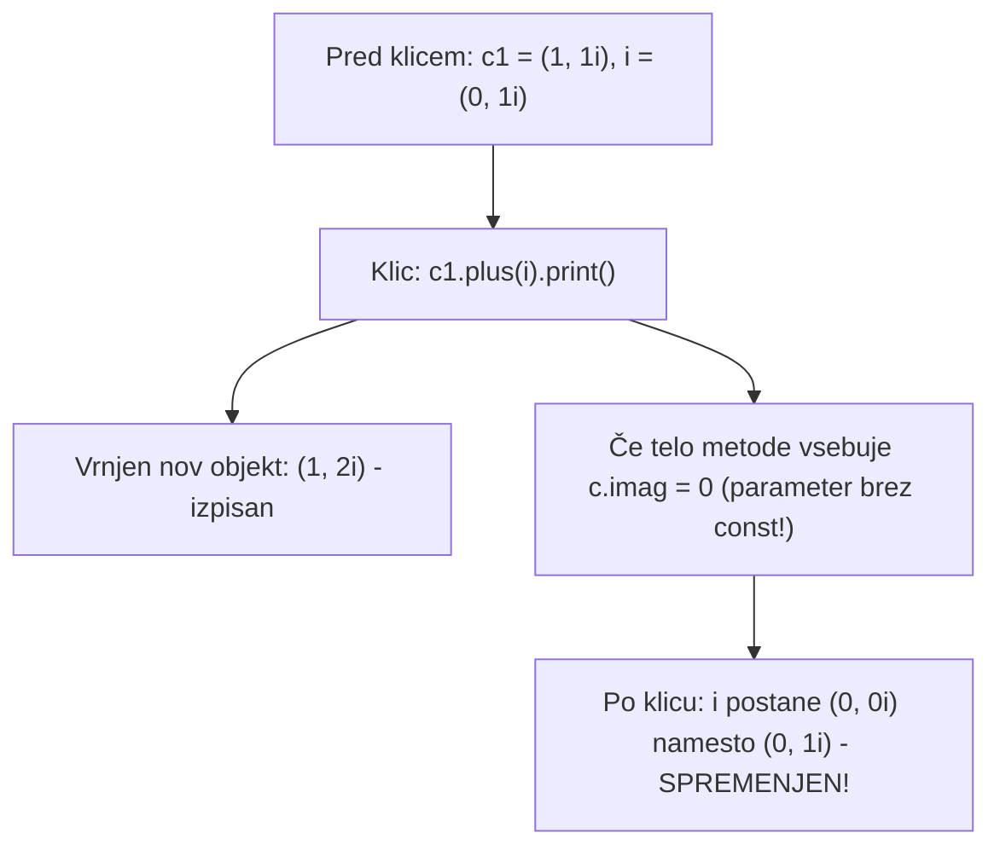
```mermaid
flowchart TB
    pp1a_before["Pred klicem: c1 = (1, 1i), i = (0, 1i)"] --> pp1a_call["Klic: c1.plus(i).print()"]
    pp1a_call --> pp1a_new["Vrnjen nov objekt: (1, 2i) - izpisan"]
    pp1a_call --> pp1a_bug["Če telo metode vsebuje c.imag = 0 (parameter brez const!)"]
    pp1a_bug --> pp1a_after["Po klicu: i postane (0, 0i) namesto (0, 1i) - SPREMENJEN!"]
```

**S prenosom po referenci si lahko nehote pokvarimo objekte, ki jih pošljemo kot parametre!** Rešitev je, da pred parameter, ki ga ne želimo spreminjati, zapišemo besedico `const` - takrat bo prevajalnik javil napako, če bi telo metode poskušalo ta objekt spremeniti:

```Complex.h
Complex plus(const Complex& c) const;
```

```Complex.cpp
Complex Complex::plus(const Complex& c) const {
    Complex temp(real+c.real, imag+c.imag);
    return temp;
}
```

S tem povemo, da metoda `plus` prejme konstanten objekt po referenci (učinkovito, brez kopiranja), vendar ga v telesu metode ne sme spreminjati.

---

## Konstantne spremenljivke in objekti

- **Konstantna spremenljivka** (`const int i = 1;`) - vsebine te celice ne smemo spreminjati.
- **Konstanten objekt** - objekt, katerega stanja (instančnih spremenljivk) ne moremo spreminjati. Definiramo ga z določilom `const` pred definicijo objektne spremenljivke (npr. `const Complex i(0,1);`).
- **Konstantna metoda** je metoda, ki ne spreminja stanja objekta. Definiramo jo tako, da za argumenti metode (za oklepajem) navedemo določilo `const`.

> [!WARNING]
> **Konstantnim objektom lahko pošiljamo samo konstantne metode!** Nekonstantne objekte pa lahko pošiljamo tako konstantnim, kot tudi nekonstantnim metodam.

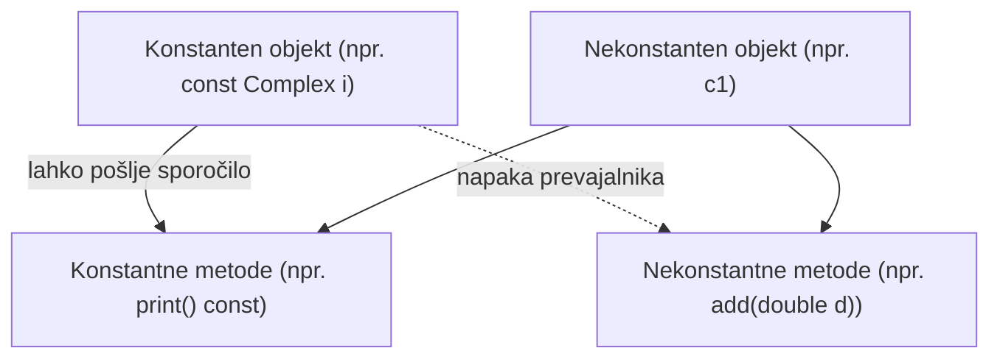
```mermaid
flowchart TB
    pp1b_const["Konstanten objekt (npr. const Complex i)"] -->|lahko pošlje sporočilo| pp1b_constm["Konstantne metode (npr. print() const)"]
    pp1b_const -.->|napaka prevajalnika| pp1b_nonconstm["Nekonstantne metode (npr. add(double d))"]
    pp1b_nonconst["Nekonstanten objekt (npr. c1)"] --> pp1b_constm
    pp1b_nonconst --> pp1b_nonconstm
```

### Primer

```Complex.h
class Complex {
private:
    double real, imag;
public:
    Complex();
    Complex(double r, double i = 0);
    void print() const;                    // konstantna metoda
    Complex plus(const Complex& c) const;   // konstantna metoda, konstanten parameter
    void add(double d);                     // NI konstantna - spreminja stanje objekta
};
```

```Complex.cpp
void Complex::print() const {
    std::cout << "(" << real << ", " << imag << "i)" << std::endl;
}
Complex Complex::plus(const Complex& c) const {
    Complex temp(real+c.real, imag+c.imag);
    return temp;
}
void Complex::add(double d) {  // realni komponenti prišteje vrednost d
    real += d;
}
```

`add` spreminja vrednost komponente `real`, zato **ni** konstantna metoda in je ne moremo klicati nad konstantnimi objekti - prevajalnik bi javil napako.

```example.cpp
Complex c1(1,1);
const Complex i(0,1);   // i je konstanten objekt - njegovo stanje se ne sme spreminjati

c1.add(10);     // OK - c1 ni konstanten, add ni konstantna metoda -> c1 postane (11,1i)
//i.add(1);     // NAPAKA - i je konstanten, add pa ni konstantna metoda

i.plus(c1).print();   // OK - plus je konstantna metoda, i ostane nespremenjen
//c1.plus(i).print(); bi prav tako delovalo - v plus je i (konstanten objekt) poslan
//po referenci kot konstanten parameter in se znotraj metode ne spreminja
```

Ker metoda `plus` sprejme parameter kot konstanten objekt (`const Complex& c`), ki se sicer prenaša po referenci (ni kopiranja), vendar znotraj metode ostaja konstanten, deluje tudi klic s konstantnim objektom kot parametrom - prevajalnik zagotovi, da se ta objekt v telesu metode ne bo spremenil.

Splošno pravilo: metode, ki ne spreminjajo stanja objekta, praviloma vedno označimo kot konstantne - tako jih lahko uporabljamo tako za sporočila konstantnim, kot tudi nekonstantnim objektom.

---

## Razredne (statične) spremenljivke in metode

Včasih želimo imeti podatek, ki je **skupen vsem objektom nekega razreda** (npr. števec, koliko objektov tega razreda smo že ustvarili). Hraniti kopijo takega podatka v vsakem objektu posebej bi bilo potratno in nerodno za vzdrževanje (ob vsaki spremembi bi morali posodobiti vse objekte).

- Podatek, ki je skupen vsem objektom, imenujemo **razredna spremenljivka** (angl. *class variable*) ali **statični podatek**. Definiramo jo z določilom `static`.
- Metode, ki operirajo nad razrednimi spremenljivkami, imenujemo **razredne (statične) metode**.
- Razredne spremenljivke obstajajo, še preden ustvarimo kateri koli objekt razreda (tudi če noben objekt še ne obstaja).

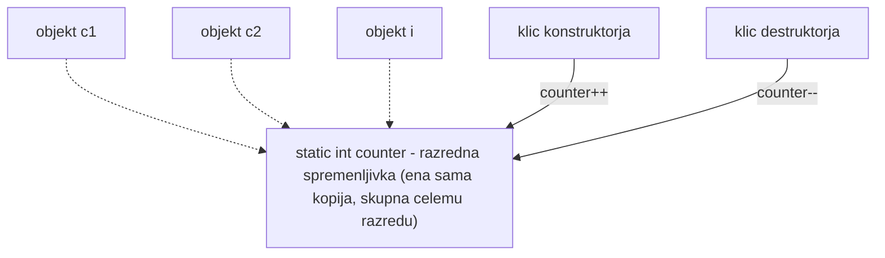
```mermaid
flowchart TB
    pp1c_counter["static int counter - razredna spremenljivka (ena sama kopija, skupna celemu razredu)"]
    pp1c_c1["objekt c1"] -.-> pp1c_counter
    pp1c_c2["objekt c2"] -.-> pp1c_counter
    pp1c_i["objekt i"] -.-> pp1c_counter
    pp1c_ctor["klic konstruktorja"] -->|counter++| pp1c_counter
    pp1c_dtor["klic destruktorja"] -->|counter--| pp1c_counter
```

```Complex.h
class Complex {
private:
    double real, imag;
    static int counter;     // razredna spremenljivka - števec objektov
public:
    Complex();
    Complex(double r, double i = 0);
    Complex(const Complex& c);   // kopirni konstruktor MORAMO zapisati sami!
    ~Complex();                   // destruktor MORAMO zapisati sami!
    void print() const;
    Complex plus(const Complex& c) const;
    static int getCounter() {   // razredna metoda
        return counter;
    }
};
```

> [!WARNING]
> Takoj ko v razredu uporabimo razredno spremenljivko, moramo kopirni konstruktor in destruktor zapisati **sami**! Ko namreč uničimo objekt, moramo v destruktorju števec ustrezno zmanjšati.

Razredne spremenljivke **ne moremo** inicializirati v definiciji razreda (`.h` datoteki), ampak samo v implementaciji (`.cpp` datoteki):

```Complex.cpp
int Complex::counter = 0;   // inicializacija razredne spremenljivke - samo tukaj!

Complex::Complex() : real(0), imag(0) {
    counter++;
}
Complex::Complex(double r, double i) : real(r), imag(i) {
    counter++;
}
Complex::Complex(const Complex& c) : real(c.real), imag(c.imag) {
    counter++;
}
Complex::~Complex() {
    counter--;
}
```

Vsak konstruktor (privzeti, pretvorbeni, kopirni) poveča števec za 1, destruktor pa ga ob uničenju objekta zmanjša za 1.

**Razredna metoda** (npr. `getCounter()`) lahko dostopa **samo** do razrednih spremenljivk, ne pa tudi do instančnih spremenljivk - prevajalnik bi javil napako, če bi poskusili dostopati npr. do `real`. Razredna metoda je po privzeto konstantna in jo zato lahko kličemo tudi nad konstantnimi objekti.

```example.cpp
std::cout << Complex::getCounter() << std::endl;  // razredno metodo lahko kličemo neposredno na razredu
Complex c1(1,1);
const Complex i(0,1);
std::cout << c1.getCounter() << std::endl;   // ali na objektu
std::cout << i.getCounter() << std::endl;    // deluje tudi za konstanten objekt
```

Ker iz notacije `objekt.getCounter()` ne moremo takoj razbrati, ali gre za navadno ali razredno metodo, raje uporabljamo zapis z imenom razreda: `Complex::getCounter()`. S tem jasno povemo, da je `getCounter` razredna metoda.

Lahko imamo tudi **konstantne razredne spremenljivke** (vrednost je skupna in nespremenljiva za cel razred), vendar jih, tako kot navadne razredne spremenljivke, inicializiramo v `.cpp` datoteki, ne v definiciji razreda.

---

## Kazalec `this`

Metoda ima poleg eksplicitnih parametrov vedno še en **implicitni parameter** - kazalec na objekt, ki je prejel sporočilo. Ta kazalec dosežemo z rezervirano besedo **`this`**.

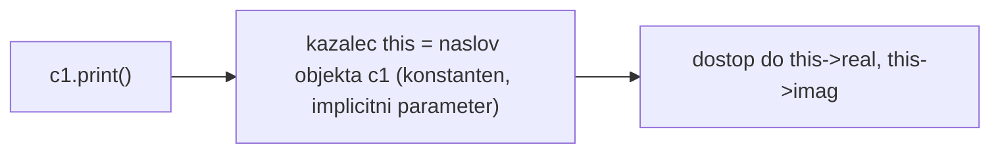
```mermaid
flowchart LR
    pp1d_call["c1.print()"] --> pp1d_this["kazalec this = naslov objekta c1 (konstanten, implicitni parameter)"]
    pp1d_this --> pp1d_access["dostop do this->real, this->imag"]
```

- `this` vedno kaže na objekt, ki je prejel sporočilo, in ga programer ne more spremeniti (`this` je sam **konstanten kazalec**).
- `this` lahko dostopa tako do instančnih, kot tudi do razrednih spremenljivk objekta.
- **`this` ne obstaja v razrednih (statičnih) metodah** - te namreč niso vezane na noben konkreten objekt.
- `this` uporabljamo samo znotraj nestatičnih metod razreda; zunaj metod kazalec `this` ne obstaja.

```cpp
void Complex::print() const {
    std::cout << "Object address: " << this << "=(" << this->real << ", " << this->imag << "i)" << std::endl;
}
```

Pomembna je tudi razlika med **konstantnim kazalcem** in **kazalcem na konstanto**:

- `int* const` - **konstanten kazalec**: kazalec vedno kaže na isto celico, tega kazalca ne smemo spreminjati, lahko pa spreminjamo vrednost, na katero kaže.
- `const int*` - **kazalec na konstanto**: imamo kazalec na neko konstanto - vrednosti, na katero kaže, ne smemo spreminjati, lahko pa spreminjamo, kam kazalec kaže.
- `const int* const` - **konstanten kazalec na konstanto**: ne smemo spreminjati niti kazalca niti vrednosti, na katero kaže.

Kazalec `this` je primer konstantnega kazalca (`Complex* const`) - vedno kaže na isti objekt (tistega, ki je prejel sporočilo), tega pa ne moremo spremeniti.


---

## Objekti kot člani razredov (vsebovanje)

Instančna spremenljivka je lahko poljubnega tipa (`int`, `double`, `float` itd.), **torej tudi tipa razreda** - instančna spremenljivka je lahko objekt (npr. tipa `Complex` ali `Point`). Takrat govorimo o **vsebovanju** oz. **agregaciji/kompoziciji** (*aggregation/composition*): neka instančna spremenljivka je objekt in ta objekt je vsebovan v nekem drugem objektu.

Ločimo dve vrsti vsebovanja:
- **Šibko vsebovanje (agregacija)**
- **Močno vsebovanje (kompozicija)**

### Primer: barvna točka (CPoint)

Radi bi imeli **barvno točko**, ki vsebuje navadno točko (`Point`) in njeno barvo.

```CPoint.h
class CPoint {
private:
    Point p;      // kompozicija - p je primerek razreda Point
    int color;
public:
    CPoint();
    CPoint(int x, int y, int c);
    void print() const;
};
```

```CPoint.cpp
CPoint::CPoint() : p(), color(0) {
}
CPoint::CPoint(int x, int y, int c) : p(x, y), color(c) {
}
void CPoint::print() const {
    p.print();                                   // najprej izpišemo točko p
    std::cout << "color=" << color << std::endl; // nato še barvo
}
```

Pri privzetem konstruktorju se najprej pokliče privzeti konstruktor razreda `Point`, ki instančno spremenljivko `p` nastavi na privzete vrednosti. Konstruktor s tremi parametri pokliče konstruktor razreda `Point` s koordinatama `x` in `y`, instančno spremenljivko `color` pa nastavi na tretji parameter.

> [!WARNING]
> Do instančnih (privatnih) spremenljivk vsebovanega objekta (npr. `x` in `y` razreda `Point`) **ne moremo dostopati direktno** - niti iz razreda `CPoint`! Dostopamo lahko le preko **javnih metod** tega objekta (npr. `p.print()`, `p.getX()`).

**Omejitev tega pristopa**: ker sta `Point` in `CPoint` popolnoma ločena, nepovezana razreda, metod, ki pričakujejo objekt tipa `Point`, ne moremo klicati z objektom tipa `CPoint` (npr. `c2.distance(p1)` ne deluje, saj `CPoint` sploh nima metode `distance`). To omejitev reši **dedovanje** (glej naslednje poglavje).

### UML notacija vsebovanja

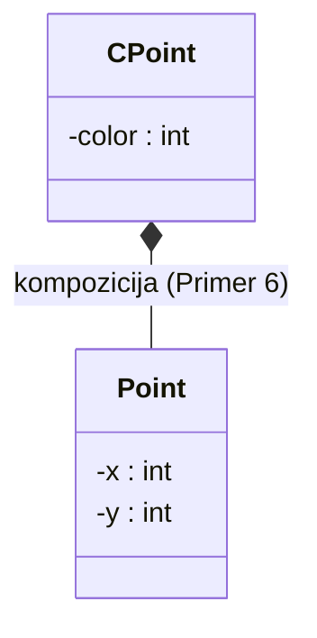
```mermaid
classDiagram
    CPoint *-- Point : kompozicija (Primer 6)
    class CPoint {
        -color : int
    }
    class Point {
        -x : int
        -y : int
    }
```

- **Kompozicijo** (močno vsebovanje) v UML označimo s **polno (črno) škatlico**.
- **Agregacijo** (šibko vsebovanje) označimo z **belo (prazno) škatlico**.

### Bistvena razlika: kaj se zgodi ob brisanju objekta

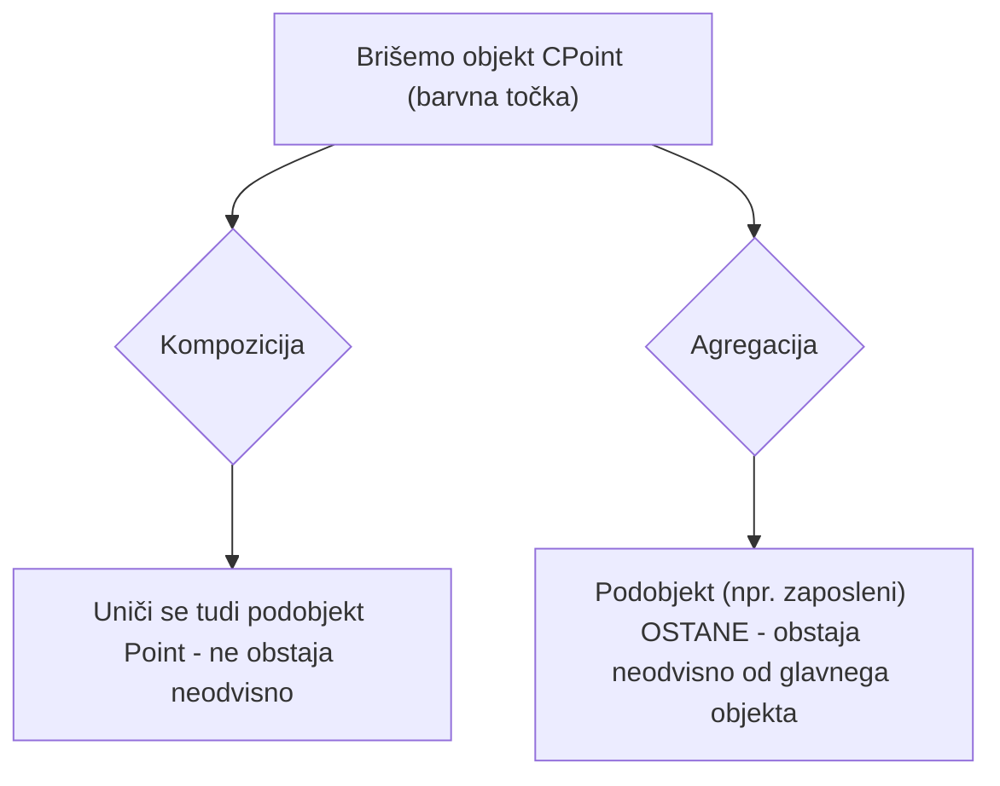
```mermaid
flowchart TB
    pp2b_del["Brišemo objekt CPoint (barvna točka)"] --> pp2b_comp{"Kompozicija"}
    pp2b_del --> pp2b_agg{"Agregacija"}
    pp2b_comp --> pp2b_comp_r["Uniči se tudi podobjekt Point - ne obstaja neodvisno"]
    pp2b_agg --> pp2b_agg_r["Podobjekt (npr. zaposleni) OSTANE - obstaja neodvisno od glavnega objekta"]
```

- Pri **kompoziciji** ob uničenju glavnega objekta uničimo tudi vse njegove podobjekte. Primer: hotel s 100 sobami - če porušimo hotel, uničimo tudi vse njegove sobe (sobe brez hotela ne obstajajo).
- Pri **agregaciji** podobjekt ob uničenju glavnega objekta **ostane**. Primer: podjetje vsebuje zaposlene - če podjetje gre v stečaj (uničimo objekt podjetje), zaposleni (ljudje) še vedno obstajajo, samo niso več del tega podjetja.

Obe varianti sta za svoje primere uporabni - izbira je odvisna od tega, ali podobjekt lahko obstaja neodvisno od glavnega objekta ali ne.

---

## Dedovanje

**Dedovanje** je najpomembnejši koncept OOP.

- Dedovanje omogoča **inkrementalni razvoj programov** - pri razvoju programske opreme iz nadrazredov podedujemo lastnosti, torej strukturo in obnašanje.
- Programer zapiše le **specifične lastnosti**, ki se razlikujejo od tistih v nadrazredih.
- Dedovanje med razrede uvede **tranzitivno relacijo** in jih uredi v hierarhijo glede na njihove splošne in specifične lastnosti (če `C` deduje od `B`, `B` pa od `A`, potem `C` deduje tudi vse, kar ima `A`).

### Od vsebovanja k dedovanju

Pri primeru s točko in barvno točko smo se vprašali: ali je barvna točka **točka** (relacija **is-a**), ali barvna točka **vsebuje** točko (relacija **has-a**)? V primeru 6 smo se odločili za vsebovanje, kar pa je bila **napačna izbira** - pravilneje bi rekli, da **je barvna točka točka** (ima pa še dodatno lastnost - barvo). To pomeni, da bo barvna točka **podedovala** vso strukturo in obnašanje od točke, ima pa lahko tudi nekaj dodatnega, specifičnega obnašanja.

- **Nadrazred** (*superclass*) ali **bazni razred** (*base class*) - razred, od katerega dedujemo.
- **Podrazred** (*subclass*) ali **izpeljani razred** (*derived class*) - razred, ki deduje.
- **Izpeljava** (*derivation*) je lahko **enkratna** (*single inheritance*) ali **večkratna** (*multiple inheritance* - razred deduje od več nadrazredov hkrati). Java pozna samo enkratno dedovanje.

V programu povemo, da je razred `B` podrazred razreda `A`, z zapisom:

```cpp
class B : public A { /* ... */ };
```

### Specializacija in generalizacija

Če se po hierarhiji pomikamo **navzdol** (iz nadrazreda v podrazred), govorimo o **specializaciji**. Če se pomikamo **navzgor** (iz podrazreda v nadrazred), govorimo o **generalizaciji**.

Primeri nadrazredov in podrazredov:

| Nadrazred | Podrazred |
|---|---|
| Oseba | Student |
| Student | PodiplomskiStudent |
| Lik | Trikotnik |
| Štirikotnik | Pravokotnik |

Pri tem bi bilo **narobe** uporabiti vsebovanje namesto dedovanja (npr. oseba ne vsebuje študenta - **študent je oseba**, ki ima poleg vseh lastnosti osebe tudi svoje specifične lastnosti, npr. status študenta).

> [!WARNING]
> **Pravilo substitucije**: kjerkoli pričakujemo objekt nadrazreda, lahko varno uporabimo objekt podrazreda (saj ima ta objekt vse lastnosti nadrazreda, poleg še nekaj svojih specifičnih). Obratno **ne velja** - objekta nadrazreda ne moremo varno uporabiti tam, kjer se pričakuje objekt podrazreda (manjkajo mu specifične lastnosti podrazreda).

### Primer 7: Point in CPoint z dedovanjem

```Point.h
class Point {
private:
    int x, y;
public:
    Point();
    Point(int x1, int y1);
    int getX() const;
    int getY() const;
    void print() const;
    double distance(const Point& p) const;
};
```

```CPoint.h
class CPoint : public Point {   // CPoint je podrazred razreda Point
private:
    int color;
public:
    CPoint();
    CPoint(int x, int y, int c);
    void print() const;
};
```

```CPoint.cpp
CPoint::CPoint() : Point(), color(0) {
}
CPoint::CPoint(int x, int y, int c) : Point(x, y), color(c) {
}
```

Razred `CPoint` je podedoval vso strukturo in obnašanje razreda `Point` (instančni spremenljivki `x`, `y` ter metode `getX`, `getY`, `print`, `distance`). Edino, kar je v razredu `CPoint` potrebno spremeniti/dodati, je metoda `print()`, saj ta mora izpisati tudi barvo.

> [!WARNING]
> Pri redefiniciji metode `print()` v podrazredu ni dovolj, da znotraj nje zapišemo samo `print();` - to bi klicalo **samo sebe** (rekurzivni klic, neskončna zanka)! Za klic metode nadrazreda moramo uporabiti **`Point::print();`** - s tem eksplicitno povemo, da kličemo `print()` iz razreda `Point`.

```CPoint.cpp
void CPoint::print() const {
    Point::print();                                // klic metode nadrazreda
    std::cout << "color=" << color << std::endl;   // dodatno izpišemo še barvo
}
```

Ker so instančne spremenljivke `x` in `y` v razredu `Point` **privatne**, do njih (tudi iz podrazreda `CPoint`) ne moremo dostopati direktno - samo preko javnih metod (`getX()`, `getY()`):

```cpp
// NAPAČNO - x in y sta privatna v razredu Point, CPoint do njiju ne more direktno dostopati:
//std::cout << "(" << x << ", " << y << ") color=" << color << std::endl;

// PRAVILNO - dostop preko javnih metod nadrazreda:
std::cout << "(" << getX() << ", " << getY() << ") color=" << color << std::endl;
```

Po pravilu substitucije sedaj deluje tudi naslednja koda, saj `CPoint` podeduje metodo `distance` od razreda `Point`:

```cpp
Point p1(3,4);
CPoint c1(1,2,3);
std::cout << p1.distance(c2) << std::endl;  // deluje - c2 je varno uporabljen kot Point
std::cout << c1.distance(p1) << std::endl;  // deluje tudi obratno, saj CPoint podeduje distance
```

---

## Določilo protected

Ograjevanje (skrivanje) elementov razreda (instančnih spremenljivk in metod) implementiramo s tremi določili:

- **`private`** (privatni) - dostopni samo znotraj metod istega razreda.
- **`public`** (javni) - dostopni od kjer koli.
- **`protected`** (zaščiteni) - dostopni znotraj metod istega razreda **in tudi znotraj metod vseh izpeljanih (pod)razredov**, od zunaj (npr. iz `main`) pa ne.

Če torej želimo, da lahko metode podrazreda direktno dostopajo do instančnih spremenljivk nadrazreda (brez vmesnih getterjev `getX()`/`getY()`), instančne spremenljivke nadrazreda definiramo kot `protected` namesto `private`:

```Point.h
class Point {
protected:          // namesto private
    int x, y;
public:
    Point();
    Point(int x, int y);
    int getX() const;
    int getY() const;
    void print() const;
    double distance(const Point& p) const;
};
```

```CPoint.cpp
void CPoint::print() const {
    std::cout << "(" << x << " " << y << ") color=" << color << std::endl;  // sedaj deluje! x, y sta protected
}
```

---

## Virtualne metode (polimorfizem)

### Problem: kazalci na nadrazred

Oglejmo si primer, kjer ustvarimo kazalca na objekta `p1` (primerek razreda `Point`) in `c1` (primerek podrazreda `CPoint`), oba kazalca pa sta tipa `Point*`:

```cpp
Point p1(3,4);
CPoint c1(0,0,0);

Point* p_p1 = &p1;
Point* p_c1 = &c1;   // kazalec tipa Point* kaže na objekt podrazreda CPoint!

p_p1->print();   // (3, 4)
p_c1->print();   // (0, 0) -- BARVA SE NE IZPIŠE! Pričakovali bi "(0, 0) color=0"
```

Čeprav `c1` **je** primerek razreda `CPoint`, se pri klicu `p_c1->print()` pokliče metoda `Point::print()`, ne `CPoint::print()`!

### Statični in dinamični tip

Vsak kazalec/objekt ima:
- **Statični tip** - tip, ki je zapisan v deklaraciji (npr. `p_c1` je deklariran kot `Point*`). Prevajalnik ta tip pozna že v času **prevajanja**.
- **Dinamični tip** - dejanski tip objekta, na katerega kazalec v resnici kaže (npr. `c1` je dejansko `CPoint`). Ta tip je znan šele v času **izvajanja**.

Prevajalnik v času prevajanja ne more vedeti, na kateri (dinamični) tip bo kazalec dejansko kazal - to je lahko odvisno tudi od pogojnih stavkov, zank itd., ki se izvedejo šele med izvajanjem programa.

Privzeto (brez določila `virtual`) prevajalnik metodo **poveže že v času prevajanja, glede na statični tip** kazalca - temu pravimo **statična vezava**. Zato se je pri `p_c1->print()` klicala metoda `Point::print()`, saj je statični tip `p_c1` enak `Point*`.

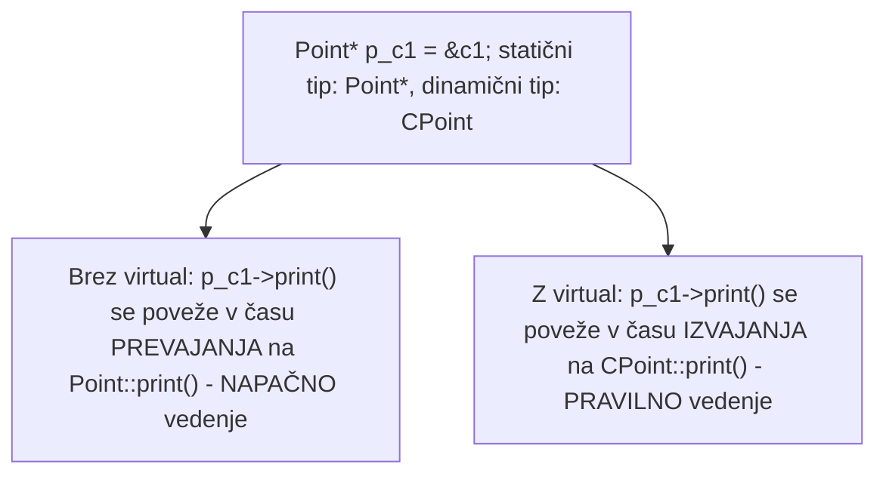
```mermaid
flowchart TB
    pp2d_decl["Point* p_c1 = &c1; statični tip: Point*, dinamični tip: CPoint"] --> pp2d_novirt["Brez virtual: p_c1->print() se poveže v času PREVAJANJA na Point::print() - NAPAČNO vedenje"]
    pp2d_decl --> pp2d_virt["Z virtual: p_c1->print() se poveže v času IZVAJANJA na CPoint::print() - PRAVILNO vedenje"]
```

### Določilo `virtual`

Če metodo v nadrazredu označimo kot **`virtual`**, se bo klic te metode (in vseh njenih redefinicij v podrazredih) vezal šele **v času izvajanja, glede na dejanski (dinamični) tip objekta** - temu pravimo **dinamična vezava**. Program bo deloval pravilno, bo pa (zaradi vezave v času izvajanja) nekoliko počasnejši.

**Virtualne metode** imenujemo tudi **polimorfne metode** - zanje velja, da se na isto sporočilo objekti različnih (pod)razredov odzovejo vsak na svoj način.

```Point.h
class Point {
protected:
    int x, y;
public:
    Point();
    Point(int x, int y);
    int getX() const;
    int getY() const;
    virtual void print() const;    // virtual zapišemo SAMO v definiciji razreda (.h)!
    double distance(const Point& p) const;
};
```

```CPoint.h
class CPoint : public Point {
protected:
    int color;
public:
    CPoint();
    CPoint(int x, int y, int c);
    void print() const;   // ker je print() virtualna že v nadrazredu, je samodejno virtualna tudi tukaj
};
```

> [!WARNING]
> Določilo `virtual` zapišemo **samo v definicijo razreda** (`.h` datoteko), **nikoli v implementacijo** (`.cpp` datoteko)! Ko neko metodo v nadrazredu označimo kot virtualno, so s tem **vse njene redefinicije v podrazredih prav tako samodejno virtualne** (podrazredu `virtual` ni treba ponovno zapisati, čeprav je dovoljeno zaradi preglednosti). Redefinirana metoda se mora z virtualno metodo nadrazreda ujemati v signaturi (enako ime, število in tipi argumentov ter enak tip rezultata). Če podrazred virtualne metode ne redefinira, se pokliče ustrezna metoda nadrazreda.

S to spremembo bo klic `p_c1->print()` pravilno poklical `CPoint::print()` in izpisal tudi barvo.

### Virtualni destruktor

Podobna težava se pojavi pri **destruktorjih**, ko objekt brišemo preko kazalca na nadrazred:

```cpp
Point* p_c1 = &c1;   // c1 je objekt CPoint, ustvarjen dinamično (new)
delete p_c1;
```

Če destruktor **ni** virtualen, se ob `delete p_c1` pokliče **samo** `~Point()` - destruktor `~CPoint()` se sploh ne pokliče (del objekta, specifičen za `CPoint`, ostane neuničen)!

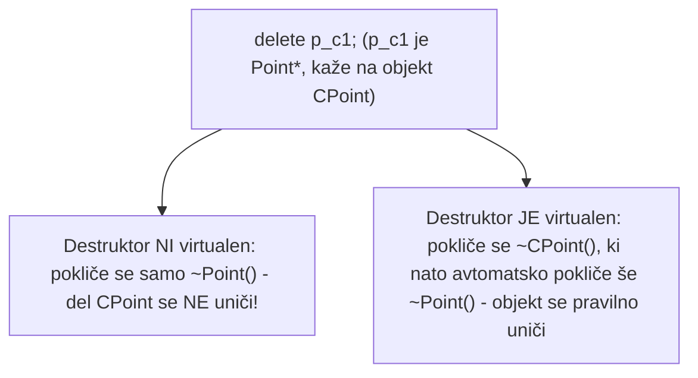
```mermaid
flowchart TB
    pp2e_del["delete p_c1; (p_c1 je Point*, kaže na objekt CPoint)"] --> pp2e_novirt["Destruktor NI virtualen: pokliče se samo ~Point() - del CPoint se NE uniči!"]
    pp2e_del --> pp2e_virt["Destruktor JE virtualen: pokliče se ~CPoint(), ki nato avtomatsko pokliče še ~Point() - objekt se pravilno uniči"]
```

Rešitev je enaka kot pri drugih metodah - destruktor nadrazreda označimo kot `virtual`:

```Point.h
virtual ~Point();   // virtualni destruktor
```

> [!WARNING]
> **V razredu, ki ima katero koli virtualno metodo, vedno definiramo tudi virtualni destruktor!**

Ko je destruktor virtualen, se ob `delete` najprej pokliče destruktor dinamičnega tipa (`~CPoint()`), ta pa nato **samodejno** pokliče še destruktor svojega nadrazreda (`~Point()`) - objekt se tako v celoti pravilno uniči, v obratnem vrstnem redu, kot so se klicali konstruktorji.

### Pogoste napake

- Klicanje metode, ki ni konstantna, s konstantnim objektom.
- Spreminjanje podatkov objekta v konstantni metodi.
- Uporaba kazalca `this` in nestatičnih podatkov v razrednih (statičnih) metodah - kazalec `this` tam ne obstaja!
- Obravnavanje objekta nadrazreda, kot da je objekt podrazreda (npr. `c1 = p1;`, kjer bi objektu podrazreda `CPoint` priredili objekt nadrazreda `Point`, ki nima vseh lastnosti podrazreda - npr. nima barve) - **narobe**. Obratno (objekt podrazreda priredimo spremenljivki nadrazreda, npr. `p1 = c1;`) je varno, saj podrazred vsebuje vse, kar ima nadrazred.
- Pri redefiniciji metode nadrazreda v podrazredu je običajno, da v njej pokličemo metodo nadrazreda (npr. `Point::print();`) in nato opravimo še nekaj dodatnega dela - napačno je, da metoda v podrazredu kliče samo sebe.
- Redefinirana virtualna metoda v izpeljanem razredu nima istega izhodnega tipa in istih argumentov kot v nadrazredu.


---

## Abstraktni razredi

### Posplošitev brez skupnega objekta

Pri načrtovanju programa iščemo potrebne razrede za dani problem in jih poskušamo uvrstiti v hierarhijo (relacija nadrazred-podrazred). Naslednji korak je poiskati še neidentificirane razrede, ki so **posplošitev (generalizacija)** danih razredov.

Npr. če imamo razrede `Avto`, `Ladja`, `Letalo` itd., teh razredov samih po sebi ne moremo uvrstiti v relacijo nadrazred-podrazred (avto ni poseben primer letala). Lahko pa jim najdemo skupen nadrazred, npr. `Vozilo` - s tem naredimo posplošitev oz. generalizacijo, ne da bi iskali neko neposredno relacijo med danimi razredi, ampak smo poiskali, ali obstaja nek skupni nadrazred zanje.

Postopek generalizacije nas lahko pripelje do takšnih razredov, za katere vemo, da njihovih objektov **ne bomo kreirali**. Taki razredi so le podatkovne strukture, ki lahko hranijo objekte različnih svojih podrazredov - uvedemo jih zato, da bomo lahko vsem objektom, ki so primerki različnih podrazredov, pošiljali enako sporočilo, objekti pa se bodo nanj odzvali vsak na svoj (polimorfen) način.

Primer: nadrazred `Lik` za podrazrede `Krog`, `Kvadrat`, `Trikotnik` - vsi ti so liki, vendar `Lik` sam po sebi ne more imeti implementirane metode za izračun ploščine (ne vemo izračunati "ploščine lika" na splošno - vemo le izračunati ploščino kroga, kvadrata, trikotnika posebej). Objekta razreda `Lik` zato ne bomo nikoli ustvarili, čeprav ta razred v hierarhiji potrebujemo.

### Abstraktni in konkretni razredi

- Razredom, za katere ne bomo ustvarjali instanc (primerkov) objektov, pravimo **abstraktni razredi** (*abstract classes*). V hierarhiji jih imamo samo zato, da lahko v neki podatkovni strukturi hranimo vse primerke objektov njihovih podrazredov.
- Ostalim razredom (za katere objekte ustvarjamo) pravimo **konkretni razredi** (*concrete classes*).
- Metode, ki jih v abstraktnem razredu ne znamo implementirati (npr. izračun ploščine lika), imenujemo **abstraktne metode** ali tudi **čisto virtualne metode** (*pure virtual*). Abstraktne metode zato nimajo implementacije (telesa metode).
- V C++ to zapišemo kot `tip ImeFun(Args) = 0;` - s tem povemo, da je telo te metode enako 0 (ker ga ne znamo implementirati) in da je metoda abstraktna.

> [!WARNING]
> **Če ima nek razred vsaj eno abstraktno metodo, je ta razred prav tako abstrakten!** Če podrazred te abstraktne metode ne implementira, ostane abstrakten tudi podrazred sam. Šele razred, ki implementira **prav vse** abstraktne metode svojih nadrazredov, je **konkreten razred** - samo zanj lahko kreiramo objekte in jim pošiljamo sporočila (saj se ti objekti znajo odzvati na vsa sporočila).

Objektov abstraktnih razredov ne moremo ustvarjati, saj se takšni objekti ne bi znali odzvati na vsa sporočila (manjka jim implementacija vsaj ene metode).

### Primer 9: Animal, Dog, Cat, Cow

```Animal.h
class Animal {   // abstraktni razred
public:
    virtual ~Animal() {}
    virtual void voice() const = 0;   // abstraktna metoda
};
```

```Cat.h
class Cat : public Animal {
public:
    void voice() const {
        std::cout << "meow" << std::endl;
    }
};
```

Podobno sta definirana razreda `Dog` (izpiše `"bark"`) in `Cow` (izpiše `"moo"`) - oba dedujeta od `Animal` in implementirata metodo `voice()`.

```main.cpp
Animal* zoo[4];
zoo[0] = new Dog;
zoo[1] = new Cat;
zoo[2] = new Dog;
zoo[3] = new Cow;
for (int i=0; i < 4; i++)
    zoo[i]->voice();     // izpiše: bark, meow, bark, moo
for (int i=0; i<4; i++)
    delete zoo[i];
```

Ker je `Animal` nadrazred vseh štirih podrazredov, lahko vse te objekte (čeprav so različnih konkretnih tipov) shranimo v isto polje kazalcev `Animal*`. Ker je metoda `voice()` virtualna, se bo za vsak objekt v času izvajanja pravilno poklicala njegova lastna (podrazredna) implementacija.

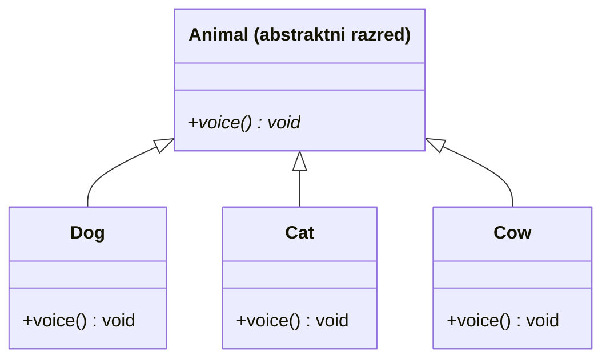
```mermaid
classDiagram
    class Animal["Animal (abstraktni razred)"] {
        +voice()* void
    }
    Animal <|-- Dog
    Animal <|-- Cat
    Animal <|-- Cow
    class Dog { +voice() void }
    class Cat { +voice() void }
    class Cow { +voice() void }
```

V UML notaciji abstraktne razrede in abstraktne metode označimo s **poševno (ležečo) pisavo** (*italic*).

> [!WARNING]
> Ker ne vemo vnaprej, ali bomo podrazrede uporabljali direktno ali preko kazalcev na nadrazred, za metodo vedno uporabimo `virtual`. Če je metoda v nadrazredu virtualna, je virtualna tudi v vseh podrazredih. V primeru, da ima razred virtualno metodo, mora biti virtualen tudi njegov destruktor.

---

## Primerjava agregacije in kompozicije

### Primer 10: agregacija (Company, Employee)

Imamo podjetje (`Company`), ki zaposluje delavca (`Employee`). V primeru, da bi podjetje šlo v stečaj (bi bil objekt uničen), delavca ne smemo uničiti - gre za primer **agregacije**.

```Employee.h
class Employee {
private:
    std::string name;
public:
    Employee(std::string name) : name(name) {
        std::cout << "Employee::constructor" << std::endl;
    }
    virtual ~Employee() {
        std::cout << "Employee::destructor" << std::endl;
    }
    virtual const std::string& toString() const {
        return name;
    };
};
```

```Company.h
class Company {
private:
    std::string name;
    Employee* ptrEmployee;  // kazalec na drug razred => AGREGACIJA!
public:
    Company(std::string cname, Employee* ename) : name(cname), ptrEmployee(ename) {
        std::cout << "Company::constructor" << std::endl;
    }
    virtual ~Company() {
        std::cout << "Company::destructor" << std::endl;
    }
    virtual const std::string& toString() const {
        return name;
    };
    virtual void employed() const {
        std::cout << ptrEmployee->toString();
    }
};
```

> [!WARNING]
> **Če imamo kot instančno spremenljivko kazalec na nek drug razred, gre za primer agregacije!** Ko bomo izbrisali objekt razreda `Company`, bomo izbrisali samo kazalec `ptrEmployee`, ne pa tudi objekta, na katerega ta kazalec kaže.

```main.cpp
Employee* ptrEmp = new Employee("John");     // zunanji (prvi) blok
{
    Company c("SmartCo", ptrEmp);            // notranji (drugi) blok
    c.employed();
    std::cout << " works for company " << c.toString() << std::endl;
}   // tukaj se objekt c uniči - izpiše se Company::destructor
std::cout << "Company doesn't exist anymore" << std::endl;
std::cout << "But, employee " << ptrEmp->toString() << " still exists!" << std::endl;
delete ptrEmp;   // šele tukaj se uniči objekt Employee
```

Ko se zaključi notranji blok, se objekt `c` (razreda `Company`) uniči, vendar **objekt, na katerega kaže `ptrEmployee`, ostane** - zaposleni (`John`) še vedno obstaja in lahko do njega še vedno dostopamo preko kazalca `ptrEmp`.

### Primer 11: kompozicija (House, Room)

Imamo hišo (`House`), ki vsebuje sobe (`Room`) - v tem primeru sob ne implementiramo preko kazalca, ampak direktno kot instančne spremenljivke tipa `Room`. Gre za **kompozicijo**.

```Room.h
class Room {
private:
    std::string name;
public:
    Room(std::string name) : name(name) {
        std::cout << "Room::constructor" << std::endl;
    }
    virtual ~Room() {
        std::cout << "Room::destructor" << std::endl;
    }
    virtual void print() const {
        std::cout << "Room " << name << std::endl;
    }
};
```

```House.h
class House {
private:
    std::string name;
    Room kitchen, livingRoom, bedroom;   // direktno vsebovani objekti => KOMPOZICIJA!
public:
    House(std::string name) : name(name), kitchen("Kitchen1"), livingRoom("living room 1"), bedroom("TV bedroom") {
        std::cout << "House::constructor" << std::endl;
    }
    virtual ~House() {
        std::cout << "House::destructor" << std::endl;
    }
    virtual void print() const {
        std::cout << "House name: " << name << std::endl;
        kitchen.print();
        livingRoom.print();
        bedroom.print();
    }
};
```

> [!WARNING]
> Preden se lahko ustvari objekt razreda `House`, se morajo najprej (preko inicializacijskega seznama) poklicati **trije konstruktorji razreda `Room`** - konstruktorji vsebovanih objektov se vedno pokličejo **pred** konstruktorjem objekta, ki jih vsebuje!

```main.cpp
{
    House h1("My home");
    h1.print();
}   // tukaj se h1 uniči - najprej House::destructor, nato trije Room::destructor
std::cout << "House and rooms don't exist any more!" << std::endl;
```

### Vrstni red klicanja konstruktorjev in destruktorjev

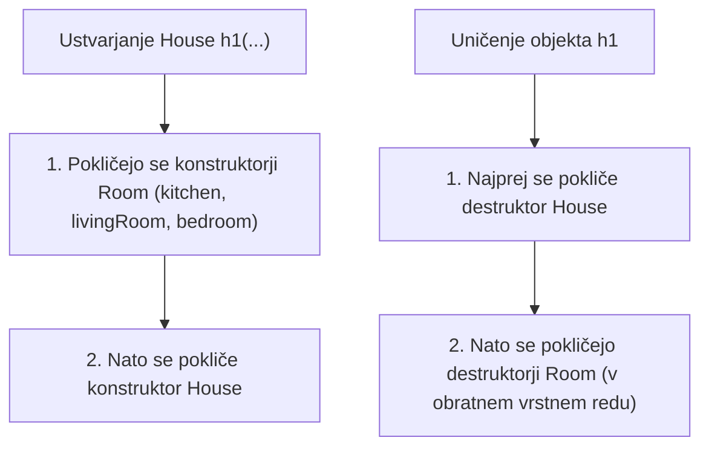
```mermaid
flowchart TB
    pp3c_ctor["Ustvarjanje House h1(...)"] --> pp3c_r1["1. Pokličejo se konstruktorji Room (kitchen, livingRoom, bedroom)"]
    pp3c_r1 --> pp3c_h1["2. Nato se pokliče konstruktor House"]
    pp3c_dtor["Uničenje objekta h1"] --> pp3c_h2["1. Najprej se pokliče destruktor House"]
    pp3c_h2 --> pp3c_r2["2. Nato se pokličejo destruktorji Room (v obratnem vrstnem redu)"]
```

Konstruktorji vsebovanih objektov se torej pokličejo **pred** konstruktorjem glavnega objekta, destruktorji pa v **obratnem** vrstnem redu - najprej destruktor glavnega objekta, nato destruktorji vsebovanih objektov.

### Povzetek razlik

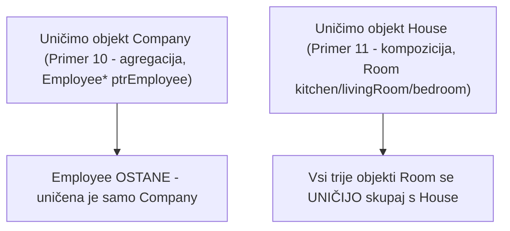
```mermaid
flowchart TB
    pp3b_del1["Uničimo objekt Company (Primer 10 - agregacija, Employee* ptrEmployee)"] --> pp3b_res1["Employee OSTANE - uničena je samo Company"]
    pp3b_del2["Uničimo objekt House (Primer 11 - kompozicija, Room kitchen/livingRoom/bedroom)"] --> pp3b_res2["Vsi trije objekti Room se UNIČIJO skupaj s House"]
```

Bistvo tako agregacije kot kompozicije je enako - gre za vsebovanje (nek objekt vsebuje primerek drugega objekta). Bistvena razlika se pokaže šele, ko ta (glavni) objekt uničimo:

- Pri **agregaciji** (vsebovani objekt dosegamo preko **kazalca**) se podobjekt ob uničenju glavnega objekta **ohrani**.
- Pri **kompoziciji** (vsebovani objekt je **direktna** instančna spremenljivka) se podobjekt ob uničenju glavnega objekta **prav tako uniči**.

---

## Naštevni tip: `enum` in `enum class`

Tipe v C++ delimo na:
- **primitivne tipe** - že vgrajeni tipi (`int`, `double`, `float`, `bool` itd.), ki jih programer samo uporablja in jih ne more razstaviti na podkomponente.
- **sestavljene tipe** - te lahko razstavimo na podkomponente (npr. točka, sestavljena iz komponent `x` in `y`). Sestavljene tipe lahko programer ustvarja sam.

C++ pa omogoča, da programer ustvari tudi svoj **primitiven** tip z **naštevanjem vrednosti** - takšnemu tipu pravimo **naštevni tip** (*enumeration type*), posamezni vrednosti pa **enumerand**.

Naštevni tip definiramo z `enum` in seznamom identifikatorjev, ki predstavljajo njegove vrednosti:

```cpp
enum BarvaKarte {srce, karo, pik, kriz};   // C++ identifikatorjem samodejno dodeli vrednosti 0, 1, 2, 3
enum StevEnum { ena=1, dva=2, tri=3, stiri=4, pet=5, sest=6, sedem=7, osem=8, devet=9, deset=10 };  // vrednosti lahko tudi sami priredimo
```

```cpp
struct Karta {
    BarvaKarte barva;
    StevEnum stev;
};
Karta mojaKarta;
mojaKarta.barva = karo;
mojaKarta.stev = dva;

std::cout << (mojaKarta.barva+1 == mojaKarta.stev) << std::endl;
```

> [!WARNING]
> Zgornja primerjava se **prevede in izvede** (vrne `true`), ker C++ naštevnim vrednostim samodejno dodeli celoštevilsko vrednost in ju tako lahko implicitno pretvori v `int`. To je **logično narobe**, saj sta `barva` (tipa `BarvaKarte`) in `stev` (tipa `StevEnum`) **povsem različna tipa**, ki predstavljata nekaj drugega - samo ker se njuni celoštevilski vrednosti ujemata, primerjava med njima nima smisla! Čeprav nam C++ to dovoli, tega ne smemo uporabljati.

C++11 uvede **`enum class`** (nabor vrednosti z lastnim dosegom), kjer:
- **ni dovoljena implicitna pretvorba v `int`**,
- **ni možna primerjava med različnimi naštevnimi tipi**.

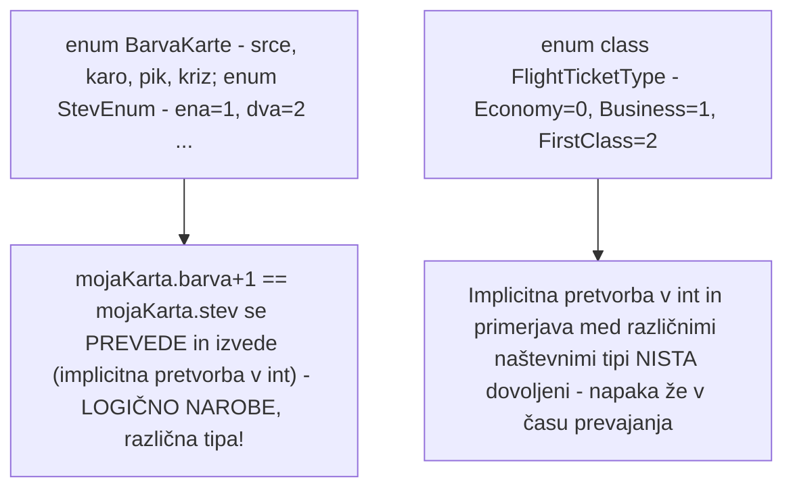
```mermaid
flowchart TB
    pp3d_enum["enum BarvaKarte - srce, karo, pik, kriz; enum StevEnum - ena=1, dva=2 ..."] --> pp3d_bug["mojaKarta.barva+1 == mojaKarta.stev se PREVEDE in izvede (implicitna pretvorba v int) - LOGIČNO NAROBE, različna tipa!"]
    pp3d_class["enum class FlightTicketType - Economy=0, Business=1, FirstClass=2"] --> pp3d_safe["Implicitna pretvorba v int in primerjava med različnimi naštevnimi tipi NISTA dovoljeni - napaka že v času prevajanja"]
```

```cpp
enum class FlightTicketType {
    Economy = 0,
    Business = 1,
    FirstClass = 2
};
```

### Primer 12: dedovanje in vsebovanje skupaj (FlightTicket)

Primer, ki združuje dedovanje, kompozicijo in agregacijo hkrati - letalska vozovnica.

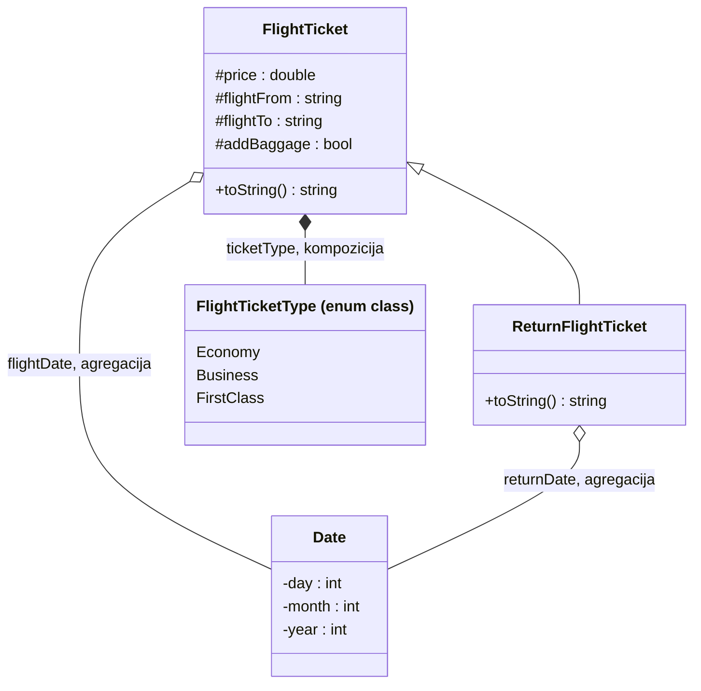
```mermaid
classDiagram
    FlightTicket <|-- ReturnFlightTicket
    FlightTicket *-- FlightTicketType : ticketType, kompozicija
    FlightTicket o-- Date : flightDate, agregacija
    ReturnFlightTicket o-- Date : returnDate, agregacija
    class FlightTicket {
        #price : double
        #flightFrom : string
        #flightTo : string
        #addBaggage : bool
        +toString() string
    }
    class ReturnFlightTicket {
        +toString() string
    }
    class FlightTicketType["FlightTicketType (enum class)"] {
        Economy
        Business
        FirstClass
    }
    class Date {
        -day : int
        -month : int
        -year : int
    }
```

- `FlightTicket` je **nadrazred** razreda `ReturnFlightTicket` (vozovnica povratne karte doda samo instančno spremenljivko `returnDate` in na novo redefinira metodo `toString()`).
- `FlightTicket` **vsebuje** instančno spremenljivko tipa `FlightTicketType` **direktno** (ne preko kazalca) - gre torej za **kompozicijo**.
- `FlightTicket` vsebuje tudi kazalec `Date* ptrFlightDate` - gre za **agregacijo** (datum leta lahko obstaja neodvisno od vozovnice).
- `ReturnFlightTicket` ima poleg podedovanega še dodatno agregacijsko povezavo na `Date` (`returnDate` - datum povratnega leta).

```Date.h
class Date {
private:
    int day;
    int month;
    int year;
public:
    Date();                          // privzeti konstruktor: day(1), month(1), year(1971)
    Date(int d, int m, int l);
    virtual ~Date();
    int getDay() const;
    void setDay(int day);            // z validacijo: dan mora biti med 1 in 31
    int getMonth() const;
    void setMonth(int month);        // z validacijo: mesec mora biti med 1 in 12
    int getYear() const;
    void setYear(int year);
    const std::string toString() const;      // npr. "17.3.2020"
    bool isEqual(const Date& date) const;     // primerja dan, mesec in leto
};
```

```Date.cpp
void Date::setDay(int day) {
    if (day < 1 || day > 31) {
        std::cout << "Wrong day: " << day << std::endl;
        this->day = 1;
    }
    this->day = day;
}
const std::string Date::toString() const {
    std::stringstream ss;              // stringstream - niz, ki ga obravnavamo kot tok (podobno kot cin)
    ss << day << "." << month << "." << year;
    return ss.str();
}
bool Date::isEqual(const Date& second) const {
    if (day==second.day && month == second.month && year == second.year)
        return true;
    else
        return false;
}
```

```FlightTicket.h
enum class FlightTicketType {
    Economy = 0,
    Business = 1,
    FirstClass = 2
};

class FlightTicket {
protected:
    double price;
    std::string flightFrom;
    std::string flightTo;
    bool addBaggage;
    FlightTicketType ticketType;    // kompozicija
    Date* ptrFlightDate;            // agregacija
    static int numberOfFirstClass;  // razredna spremenljivka
public:
    FlightTicket();
    FlightTicket(const FlightTicket& t);
    FlightTicket(double price, std::string ff, std::string ft, bool bag, FlightTicketType type, Date* p_date);
    virtual ~FlightTicket();
    // get/set metode za vse zgornje podatke (getPrice, setPrice, getFlightFrom, ...)
    virtual double getTotalPrice() const;
    virtual std::string toString() const;
    virtual bool isEqual(const FlightTicket& drugi) const;
    static int GetNumberOfFirstClass();   // razredna metoda
};
```

Razred `FlightTicket` ima za vsak protected podatek pripadajoča getter/setter metodi, poleg tega pa še virtualne metode `getTotalPrice()`, `toString()` in `isEqual()`, ki jih bo podrazred `ReturnFlightTicket` deloma redefiniral, ter razredno spremenljivko `numberOfFirstClass` s pripadajočo razredno metodo `GetNumberOfFirstClass()`.

Implementacija razredov `FlightTicket.cpp` in `ReturnFlightTicket` sledi v naslednjem nizu predavanj.


---

## Šablone (parametrični polimorfizem)

### Problem: monomorfni sistem tipov

Veliko algoritmov je splošnih (generičnih) in neodvisnih od dejanskih podatkov - npr. sortiranje podatkov (ne glede na to, ali gre za cela števila, datume ali osebe) ali delo s skladom, vrsto, drevesi. Oglejmo si dve funkciji za izpis vrednosti polja, ki delujeta povsem podobno, razlikujeta pa se le v tipu argumentov, nad katerimi operirata:

```cpp
void printArray (int* arr, int n) {
    for (int i=0; i < n; i++)
        cout << arr[i] << endl;
}
void printArray (char* arr, int n) {
    for (int i=0; i < n; i++)
        cout << arr[i] << endl;
}
```

Razen tipa vhodnih argumentov sta si ti dve funkciji po notranjem zapisu popolnoma enaki. **Monomorfen sistem tipov**, kjer ima vsaka konstanta, spremenljivka, parameter in rezultat funkcije **določen tip**, sili programerja, da zapiše ločeno funkcijo za vsak tip posebej - kar je nerodno (gre za kopiranje in prilagajanje iste kode) in povečuje možnost napak (če v eni funkciji odkrijemo napako, jo moramo popraviti v vseh kopijah).

> [!WARNING]
> **Generični kazalci (`void*`) niso dobra rešitev** tega problema! Potrebujemo močnejši mehanizem, ki bo olajšal delo programerju - **polimorfizem**: sposobnost abstrakcije (funkcije, metode, procedure), da sprejme argumente, ki so različnega tipa.

### Vrste polimorfizma

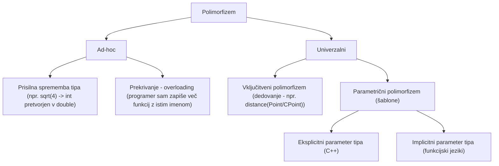
```mermaid
flowchart TB
    pp4a_poli["Polimorfizem"] --> pp4a_adhoc["Ad-hoc"]
    pp4a_poli --> pp4a_univ["Univerzalni"]
    pp4a_adhoc --> pp4a_prisilna["Prisilna sprememba tipa (npr. sqrt(4) -> int pretvorjen v double)"]
    pp4a_adhoc --> pp4a_prekrivanje["Prekrivanje - overloading (programer sam zapiše več funkcij z istim imenom)"]
    pp4a_univ --> pp4a_vkljucitveni["Vključitveni polimorfizem (dedovanje - npr. distance(Point/CPoint))"]
    pp4a_univ --> pp4a_parametricni["Parametrični polimorfizem (šablone)"]
    pp4a_parametricni --> pp4a_eksp["Eksplicitni parameter tipa (C++)"]
    pp4a_parametricni --> pp4a_imp["Implicitni parameter tipa (funkcijski jeziki)"]
```

- **Ad-hoc polimorfizem**: **prisilna sprememba tipa** (npr. `sqrt(4)` - argument tipa `int` se samodejno pretvori v `double`, saj `sqrt` pričakuje `double`), in **prekrivanje** (*overloading*) - zgornji primer `printArray`, kjer je moral programer sam zapisati dve ločeni funkciji z istim imenom.
- **Univerzalni polimorfizem**:
  - **vključitveni polimorfizem** (dedovanje) - že obravnavan primer, kjer je metoda `distance` lahko sprejela tako objekt tipa `Point` kot tipa `CPoint` (**POGOJ: tipa morata biti v relaciji nadrazred-podrazred!** Prednost je, da smo zapisali samo eno metodo `distance`; slabost je, da ta pristop deluje samo za razrede, ki so v tej relaciji).
  - **parametrični polimorfizem** (šablone) - abstrakcijo (funkcijo, metodo, proceduro) parametriziramo tudi glede na tip. Delimo ga na **eksplicitni parameter tipa** (C++ - to predavanje) in **implicitni parameter tipa** (sklepanje o tipu, funkcijski jeziki - učimo se v višjih letnikih).

### Šablone funkcij

Da bi lahko zapisali **eno samo funkcijo**, ki bi znala operirati nad poljubnim tipom (celimi števili, znaki, datumi ...), moramo svojo abstrakcijo **parametrizirati glede na tip** - to naredimo s **šablono** (*template*):

```cpp
template <typename T>
void printArray (T* arr, int n) {
    for (int i=0; i < n; i++)
        cout << arr[i] << endl;
}
```

Za rezervirano besedico **`template`** znotraj trikotniških oklepajev `<>` zapišemo rezervirano besedico **`typename`** (v starejših različicah C++ se uporablja tudi `class`, vendar je `typename` boljša izbira, saj s tem jasneje ločimo, da gledamo tip in ne razred) ter **ime parametra tipa** (v našem primeru `T`).

```cpp
int a[] = {1, 2, 3, 4};
char b[] = "math";
printArray(a, 4);
printArray(b, 5);
```

Prevajalnik iz glavnega programa ugotovi, da mora funkcijo `printArray` **zgenerirati (instancirati)**. Pri klicu `printArray(a, 4)` opazi, da nima konkretne (nešablonske) funkcije, ki bi sprejela polje celih števil, ima pa šablono te funkcije - zato `T` zamenja z `int` in sam generira funkcijo `void printArray(int* arr, int n)`. Podobno pri klicu `printArray(b, 5)` iz šablone generira funkcijo za tip `char`.

### Primer 15: šablona in konkretna funkcija z istim imenom

```cpp
// šablona, ki sprejme dve vrednosti poljubnega tipa T in vrne večjo
template < typename T >
T max( T a, T b ) {
    return a>b ? a : b;
}

// konkretna (nešablonska) funkcija max - POZOR, tukaj namenoma vrača zmnožek!
float max(float a, float b) {
    return a*b;
}

int main() {
    double x=1, y=1, res;
    res = max(x-1, y+2.5);   // max(0, 3.5) - double, iz šablone
    std::cout << res << std::endl;

    int i = 1;
    int k = max(i, 3);       // max(1, 3) - int, iz šablone
    std::cout << k << std::endl;

    float a = 1.1, b=2.2;
    float c = max(a,b);      // float - obstaja KONKRETNA funkcija max(float,float)!
    std::cout << c << std::endl;
    return 0;
}
```

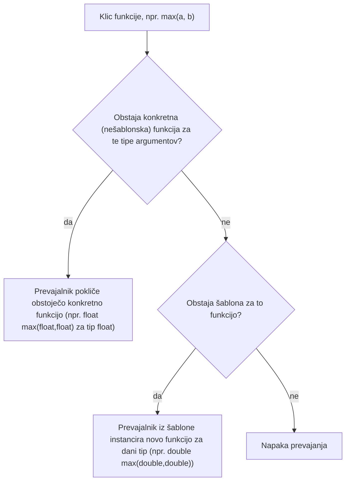
```mermaid
flowchart TB
    pp4b_call["Klic funkcije, npr. max(a, b)"] --> pp4b_check{"Obstaja konkretna (nešablonska) funkcija za te tipe argumentov?"}
    pp4b_check -->|da| pp4b_concrete["Prevajalnik pokliče obstoječo konkretno funkcijo (npr. float max(float,float) za tip float)"]
    pp4b_check -->|ne| pp4b_tmpl{"Obstaja šablona za to funkcijo?"}
    pp4b_tmpl -->|da| pp4b_instance["Prevajalnik iz šablone instancira novo funkcijo za dani tip (npr. double max(double,double))"]
    pp4b_tmpl -->|ne| pp4b_error["Napaka prevajanja"]
```

Pri prvih dveh klicih (`double`, `int`) prevajalnik ne najde konkretne funkcije `max` za te tipe, zato iz šablone **instancira** novo funkcijo (`double max(double,double)`, `int max(int,int)`) - ti dve funkciji torej vrneta **večjo** vrednost. Pri tretjem klicu (`float`) pa prevajalnik **najde obstoječo konkretno funkcijo** `float max(float,float)`, zato šablone sploh ne uporabi - ta funkcija zato nepričakovano vrne **zmnožek**, ne večje vrednosti! Prevajalnik torej **glede na tipe argumentov** ugotovi, ali naj pokliče že obstoječo konkretno funkcijo ali pa naj iz šablone instancira novo.

### Instanciranje šablon: implicitno in eksplicitno

### Primer 16: implicitno in eksplicitno instanciranje

```cpp
template < typename T >
int spaceOf ( T x ) {
    int bytes = sizeof(x);
    return bytes/4 + (bytes%4>0);
}

int main() {
    int x1=199;
    double x2=2.99;
    // implicitno instanciranje šablone
    std::cout << spaceOf(x1) << std::endl;   // T=int, ugotovljen iz argumenta x1
    std::cout << spaceOf(x2) << std::endl;   // T=double, ugotovljen iz argumenta x2
    return 0;
}
```

Pri **implicitnem instanciranju** šablone prevajalnik iz vhodnih argumentov ugotovi, kakšnega tipa je parameter `T` - programerju ob klicu funkcije ni treba ničesar posebej navajati.

Funkcijo `spaceOf` pa lahko zapišemo tudi tako, da sprejme **tip** namesto spremenljivke (brez vhodnih parametrov):

```cpp
template < typename T >
int spaceOf () {
    int bytes = sizeof(T);
    return bytes/4 + (bytes%4>0);
}

int main() {
    // eksplicitno instanciranje šablone
    std::cout << spaceOf<int>() << std::endl;
    std::cout << spaceOf<double>() << std::endl;
    return 0;
}
```

Ker ta različica funkcije nima vhodnih parametrov, prevajalnik ne more sklepati, kakšnega tipa naj bo `T` - zato moramo tip **eksplicitno** navesti odznotraj trikotniških oklepajev ob klicu funkcije: `spaceOf<int>()`. Taka notacija (`<>`) tudi takoj pove bralcu kode, da gre pri klicu za šablono.

> [!WARNING]
> Brez argumentov in brez eksplicitno navedenega tipa (`spaceOf()`) bi prevajalnik javil napako, saj ne bi mogel vedeti, kakšnega tipa je parameter `T`.

Eksplicitni zapis tipa lahko kombiniramo tudi s podajanjem argumenta: `spaceOf<int>(x1)`, `spaceOf<double>(x2)` - s tem prevajalniku olajšamo branje kode (takoj je jasno, da gre za šablono), čeprav bi tip lahko ugotovil tudi sam iz argumenta.

**Popolno in nepopolno eksplicitno instanciranje** - primer s funkcijo, ki sprejme dva podatka različnih tipov (`T1`, `T2`):

```cpp
template < typename T1, typename T2 >
void f ( T1 v1, T2 v2 ) {
    std::cout << v1 << " " << v2 << std::endl;
}

int main() {
    f(2.2,1);              // implicitno: T1=double, T2=int (ugotovljeno iz argumentov)
    f<double,int>(2.2,1);  // popolno eksplicitno: oba tipa navedena
    f<double>(2.2,1);      // nepopolno eksplicitno: naveden samo T1, T2 ugotovljen iz argumenta (int)
    f<int,int>(2.2,1);     // nepopolno eksplicitno: oba tipa navedena kot int, 2.2 se pretvori v int
    return 0;
}
```

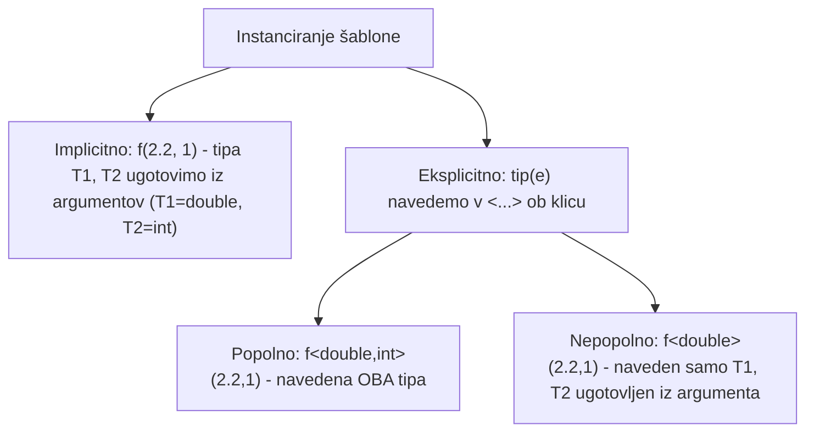
```mermaid
flowchart TB
    pp4c_inst["Instanciranje šablone"] --> pp4c_impl["Implicitno: f(2.2, 1) - tipa T1, T2 ugotovimo iz argumentov (T1=double, T2=int)"]
    pp4c_inst --> pp4c_expl["Eksplicitno: tip(e) navedemo v &lt;...&gt; ob klicu"]
    pp4c_expl --> pp4c_full["Popolno: f&lt;double,int&gt;(2.2,1) - navedena OBA tipa"]
    pp4c_expl --> pp4c_partial["Nepopolno: f&lt;double&gt;(2.2,1) - naveden samo T1, T2 ugotovljen iz argumenta"]
```

### Parameter šablone kot vrednost

Šablono lahko parametriziramo ne samo glede na **tip**, ampak tudi glede na **vrednost**:

```cpp
template < int N, typename T >
T power ( T v ) {
    T res = v;
    for ( int i=1; i<N; i++ )
        res *= v;
    return res;
}

int main() {
    std::cout << power<3>(2) << std::endl;      // N=3 (eksplicitno), T=int (iz argumenta 2) -> int power<3>(int)
    std::cout << power<5, int>(1.2) << std::endl;  // N=5, T=int (eksplicitno, 1.2 se pretvori v int)
    std::cout << power<5>(1.2) << std::endl;    // N=5 (eksplicitno), T=double (iz argumenta 1.2)
    return 0;
}
```

Vrednostni parameter `N` (tipa `int`) je dodan poleg tipovnega parametra `T` - z njim npr. določimo, na koliko bomo neko vrednost potencirali. `N` moramo vedno navesti eksplicitno (ne more se ga sklepati iz argumentov funkcije, saj ne nastopa kot njen parameter), medtem ko `T` lahko ostane implicitno izpeljan iz dejanskega argumenta.

### Definicija šablone

Šablono lahko definiramo na **tri načine**:

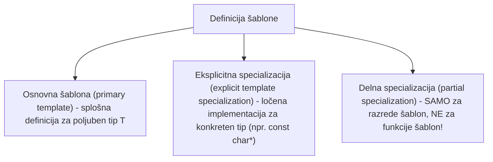
```mermaid
flowchart TB
    pp4d_def["Definicija šablone"] --> pp4d_primary["Osnovna šablona (primary template) - splošna definicija za poljuben tip T"]
    pp4d_def --> pp4d_explicit["Eksplicitna specializacija (explicit template specialization) - ločena implementacija za konkreten tip (npr. const char*)"]
    pp4d_def --> pp4d_partial["Delna specializacija (partial specialization) - SAMO za razrede šablon, NE za funkcije šablon!"]
```

### Primer 17: specializacija šablone

```cpp
// osnovna šablona (primary template)
template < typename T >
bool less ( T v1, T v2 ) {
    return v1 < v2;
}

int main() {
    int i1=1, i2=2;
    bool l1 = less(i1,i2);              // true - celi števili
    bool l2 = less(1.2,3.4);            // true - decimalni števili
    bool l3 = less("abcd","abcx");      // NAPAČNO! primerja se naslova (kazalca), ne vsebine niza
    bool l4 = less(&i1, &i2);           // primerja se naslova spremenljivk, ne njunih vrednosti!
    std::cout << l1 << " " << l2 << " " << l3 << " " << l4 << std::endl;  // 1 1 0 0
    return 0;
}
```

Osnovna šablona deluje pravilno za cela in decimalna števila, pri nizih znakov (`const char*`) in kazalcih pa primerja **naslove**, ne dejanskih vrednosti, na katere ti kazalci kažejo - zato dobimo napačen (nepričakovan) rezultat.

Za tip `const char*` zato napišemo **eksplicitno specializacijo** šablone, ki niza primerja z `strcmp` (iz knjižnice `<cstring>`):

```cpp
// eksplicitna specializacija šablone (explicit template specialization)
template<>
bool less<const char*> (const char* v1, const char* v2) {
    return strcmp(v1,v2) < 0;
}
```

Po tej specializaciji bo `less("abcd","abcx")` pravilno vrnil `true`, saj je niz `"abcd"` po vrednosti res manjši od `"abcx"`.

Za splošen primer kazalca na poljuben tip bi radi podobno napisali **delno specializacijo** šablone, ki bi primerjala dereferencirani vrednosti (`*v1 < *v2`) namesto naslovov:

```cpp
// delna specializacija (partial specialization) - NE DELUJE za funkcije šablon!
template< typename T>
bool less<T*> (T* v1, T* v2){
    return *v1 < *v2;
}
```

> [!WARNING]
> Za to kodo bo prevajalnik javil napako! **Delna specializacija je dovoljena samo pri šablonah razredov** (funkcijo pretvorimo v razred), **ne pa tudi pri šablonah funkcij** - pri funkcijah bi namreč prišlo do prekrivanja (*overloading*), kar povzroča težave. Namesto delne specializacije bi v tem primeru za kazalce morali zapisati **eksplicitno specializacijo** posebej za vsak konkreten tip kazalca.

### Povzetek

- Delnih specializacij nimamo za šablone funkcij, ampak samo za razrede šablon.
- Iz šablone prevajalnik naredi instanco funkcije - to instanciranje je lahko implicitno ali eksplicitno.
- Pri implicitnem instanciranju iz vhodnih argumentov ugotovimo, za kakšne parametre šablone gre.
- Eksplicitno instanciranje je bolj priporočljivo - pri njem v trikotniške oklepaje eksplicitno zapišemo tip oz. vrednost parametrov.
- Šablono lahko definiramo kot osnovno šablono, eksplicitno specializacijo šablone ali delno specializacijo šablone (ki pa deluje samo nad razredi šablon).


---

## Ponovitev kazalcev

Kazalci oz. reference so abstrakcija pomnilniških naslovov. **Kazalec** oz. **referenca** je pomnilniška lokacija, v kateri je zapisan naslov pomnilniške lokacije, kjer je shranjena neka vrednost. Vrednost kazalca (reference) je torej pomnilniški naslov.

Na naslovu, kamor kaže kazalec (referenca), pa je lahko vrednost poljubnega tipa, tako osnovnega kot sestavljenega - imamo torej opravka tudi s kazalci na polja, kazalci na strukture, kazalci na objekte, kazalci na funkcije in tudi s kazalci na kazalce.

Tako kot vsaka spremenljivka je tudi kazalec spremenljivka določenega tipa. Če imamo spremenljivko tipa `int`, bo v pomnilniški celici, kjer je ta spremenljivka shranjena, ležala neka vrednost iz območja `int`. Če pa gre za kazalec na `int`, gre za spremenljivko (tipa kazalec), katera ima na svojem pomnilniškem naslovu (celici) naslov neke druge celice, kjer se nahaja podatek tipa `int`.

> [!WARNING]
> Programski jeziki običajno definirajo posebno vrednost (`NULL`, `nullptr`), ki ne predstavlja pomnilniškega naslova, temveč pove, da kazalec ne kaže na nobeno vrednost. V C++ imamo vrednost `NULL`, ki je dejansko enaka `0` (ima vrednost `int 0`). Veliko bolj primerna pa je uporaba rezervirane besedice **`nullptr`**, saj besedica `NULL` lahko predstavlja tudi podatek, ki je `false`, zaradi česar lahko pride do prekrižanja in nepravilnega delovanja programa. Pri uporabi `nullptr` pa točno povemo, da se to navezuje na kazalec, ki ne kaže na nobeno pomnilniško vrednost.

Najpomembnejša operacija nad kazalci je operacija dostopa do vrednosti, na katero kazalec kaže oz. **dereferenciranje** (*dereferencing*). Tako kot so npr. za spremenljivke tipa `int` zaloga vrednosti podatki med -32767 in 32767, ter da nad takimi vrednostmi lahko izvajamo operacije kot so seštevanje, odštevanje, množenje in deljenje, so pri kazalcih zaloga vrednosti pomnilniški naslovi, njihova glavna operacija, katero lahko nad njimi izvajamo, pa je dostop do vrednosti (dereferenciranje).

### Razlika med kazalci in referenco

Razlika med kazalcem in referenco je majhna, vendar zelo pomembna. S pomočjo kazalcev dejansko upravljamo s pomnilniškimi lokacijami in pri tem delu moramo biti zelo pazljivi. Zato določenih operacij, kot npr. **kazalčna aritmetika**, ki jih lahko izvajamo nad kazalcem, nad referenco ne dovolimo. Nadalje, določene operacije, kot npr. **dereferenciranje**, se nad referenco izvedejo vedno (implicitno), medtem ko nad kazalcem ne.

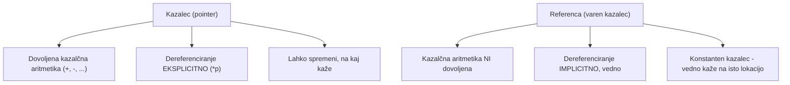
```mermaid
flowchart TB
    pp5a_title["Kazalec (pointer)"] --> pp5a_arit["Dovoljena kazalčna aritmetika (+, -, ...)"]
    pp5a_title --> pp5a_deref["Dereferenciranje EKSPLICITNO (*p)"]
    pp5a_title --> pp5a_change["Lahko spremeni, na kaj kaže"]
    pp5a_ref["Referenca (varen kazalec)"] --> pp5a_noarit["Kazalčna aritmetika NI dovoljena"]
    pp5a_ref --> pp5a_implicit["Dereferenciranje IMPLICITNO, vedno"]
    pp5a_ref --> pp5a_const["Konstanten kazalec - vedno kaže na isto lokacijo"]
```

Reference so torej **kazalci, ki ne dovoljujejo kazalčne aritmetike** - ravno iz tega razloga jim pravimo tudi **varni kazalci** (*safe pointers*).

Tipičen programski jezik, ki pozna reference, je **Java**, ki kazalcev sploh ne omogoča. V C++ je razlika med kazalcem in referenco še manjša: **referenca je samo konstanten kazalec** (vedno kaže na isto lokacijo), pri katerem se dereferenciranje izvede implicitno. Prav tako v C++ reference **niso vrednosti prvega razreda** - ne moremo ustvariti polja referenc, kazalcev na reference, niti referenc na tip `void` (`void&`).

---

## Primer 13: kazalci na kazalce in naslovi v pomnilniku

```cpp
int a = 10;
int b = 20;
int* p_a = &a;
int** p_p_a = &p_a;
```

V glavnem programu imamo dve spremenljivki `a` in `b` tipa `int`. Prevajalnik v pomnilniku prvo prosto celico rezervira za spremenljivko `a` in vanjo zapiše vrednost 10 (npr. na naslov `0x23ff74`), nato pa podobno za `b` (naslov `0x23ff70`, vrednost 20). Prevajalnik si pri tem tudi zapomni, da mora vrednost na tem naslovu interpretirati kot vrednost tipa `int`.

Spremenljivka `p_a` je kazalec na `int` - prevajalnik ji nameni naslednjo prosto celico (`0x23ff6c`), vanjo pa zapiše pomnilniški naslov spremenljivke `a` (`0x23ff74`). Ker je `p_a` tipa `int*`, bo lahko vseboval samo naslove tistih spremenljivk, ki vsebujejo vrednost tipa `int`.

Spremenljivka `p_p_a` je **kazalec na kazalec na `int`** - inicializiramo jo z naslovom kazalca `p_a` (`0x23ff6c`), prevajalnik pa ji nameni celico na naslovu `0x23ff68`.

```mermaid
flowchart LR
    pp5b_ppa["p_p_a (int**) na naslovu 0x23ff68, vsebuje 0x23ff6c"] --> pp5b_pa["p_a (int*) na naslovu 0x23ff6c, vsebuje 0x23ff74"]
    pp5b_pa --> pp5b_a["a (int) na naslovu 0x23ff74, vsebuje 10"]
```

```cpp
std::cout << "a " << &a << " " << a << std::endl;
// izpis: a 0x23ff74 10
```

Z zapisom `&a` dobimo *address of* `a`, torej naslov v pomnilniku (naslov celice), kjer se nahaja spremenljivka `a`. S samim zapisom identifikatorja `a` pa dobimo vrednost spremenljivke `a` (10).

```cpp
std::cout << "p_a " << &p_a << " " << p_a << " " << *p_a << std::endl;
// izpis: p_a 0x23ff6c 0x23ff74 10
```

`&p_a` vrne naslov pomnilniške celice, na kateri se nahaja sam kazalec `p_a` (`0x23ff6c`). Zapis `p_a` vrne dejansko vrednost, ki se nahaja v tej celici - ker gre za kazalec, bo to pomnilniški naslov, na katerega ta kazalec kaže (`0x23ff74`, naslov spremenljivke `a`). Z operacijo **dereferenciranja** (`*p_a`) pa pridemo do dejanske vrednosti, ki se nahaja na naslovu, na katerega kazalec kaže - torej do vrednosti spremenljivke `a` (`10`).

```cpp
std::cout << "p_p_a " << &p_p_a << " " << p_p_a << " " << *p_p_a << " " << **p_p_a << std::endl;
// izpis: p_p_a 0x23ff68 0x23ff6c 0x23ff74 10
```

Podobno pri kazalcu `p_p_a`: `&p_p_a` vrne naslov od `p_p_a` (`0x23ff68`), zapis `p_p_a` vrne vrednost kazalca `p_p_a` (to je naslov od `p_a`, torej `0x23ff6c`). Ker gre za dvojni kazalec, lahko dereferenciranje izvedemo dvakrat: z enim dereferenciranjem (`*p_p_a`) pridemo do vrednosti, ki se nahaja v celici, ki hrani kazalec `p_a` - to je naslov od `a` (`0x23ff74`). Z **dvojnim** dereferenciranjem (`**p_p_a`) pa pridemo do vrednosti, ki se nahaja na tem naslovu - torej do vrednosti spremenljivke `a` (`10`).

### Prenos po referenci in prenos po vrednosti

```cpp
struct Node {
    int el;
    Node* ptrNext;
};

void insertAtBeginning(Node*& start, int n) {
    Node* ptrTemp = new Node;
    ptrTemp->el = n;
    ptrTemp->ptrNext = start;
    start = ptrTemp;
}
```

Struktura `Node` (sestavljena podatkovna struktura, enosmerno povezan seznam) je sestavljena iz dveh komponent - vrednosti tipa `int` in kazalca na naslednji `Node`.

```cpp
Node* ptrStart = nullptr;
insertAtBeginning(ptrStart, 3);
insertAtBeginning(ptrStart, 2);
insertAtBeginning(ptrStart, 1);
```

```mermaid
flowchart TB
    pp5c_step1["start = nullptr"] --> pp5c_step2["insertAtBeginning(start, 3): start -> 3 -> nullptr"]
    pp5c_step2 --> pp5c_step3["insertAtBeginning(start, 2): start -> 2 -> 3 -> nullptr"]
    pp5c_step3 --> pp5c_step4["insertAtBeginning(start, 1): start -> 1 -> 2 -> 3 -> nullptr"]
```

Funkcija `insertAtBeginning` sprejme kazalec na začetek seznama **po referenci** (`Node*& start`). To je potrebno, saj se bo z dodajanjem novega elementa na začetek seznama spremenilo tudi stanje samega kazalca `start` (nov element postane nov začetek seznama) - ta sprememba mora biti vidna tudi v glavnem programu.

```mermaid
flowchart TB
    pp5d_ref["insertAtBeginning(Node*&amp; start, ...) - PRENOS PO REFERENCI"] --> pp5d_refwhy["Potrebno, da je sprememba kazalca start vidna tudi v glavnem programu (nov element postane nov začetek seznama)"]
    pp5d_val["print(Node* start) - PRENOS PO VREDNOSTI"] --> pp5d_valwhy["Dovolj, saj znotraj funkcije samo beremo seznam - spremembe kazalca start naj se NE vidijo v glavnem programu"]
```

> [!WARNING]
> **Prenos po referenci uporabimo vedno takrat, kadar želimo, da se neka sprememba vidi tudi v glavnem programu.** Prenos po referenci pa se ne uporablja vedno - v primeru, ko ne želimo, da se neka sprememba vidi tudi v glavnem programu, uporabljamo prenos po vrednosti. Tak primer je npr. izpis nekih podatkov (funkcija `print`).

```cpp
void print(Node* start) {       // prenos PO VREDNOSTI - dovolj, saj seznam samo beremo
    while (start) {
        std::cout << start->el << " ";
        start = start->ptrNext;
    }
    std::cout << std::endl;
}
```

Funkcija `print` prejme kazalec na `Node` **po vrednosti**. Dokler kazalec kaže na nek pomnilniški naslov (ni `nullptr`), se izvaja zanka `while`, ki izpisuje elemente seznama in se pri tem pomika po seznamu naprej. Če bi `print` sprejel kazalec po referenci, bi se sprememba kazalca (pomik do konca seznama) odražala tudi v glavnem programu - ob drugem klicu `print(ptrStart)` bi dobili prazen izpis, saj bi `ptrStart` po prvem klicu že kazal na `nullptr`. Ker funkcija sprejme kazalec **po vrednosti**, se ta sprememba v glavnem programu ne pozna in lahko `print` kličemo večkrat zaporedoma.

Funkcijo `print` lahko zapišemo tudi z uporabo **pomožnega kazalca**, s čimer se izognemo spreminjanju vhodnega parametra `start` samega:

```cpp
void print(Node* start) {
    Node* temp = start;
    while (temp) {
        std::cout << temp->el << " ";
        temp = temp->ptrNext;
    }
    std::cout << std::endl;
}
```

V tem primeru se skozi zanko premika samo pomožni kazalec `temp`, kazalec `start` pa od začetka do konca ostane nespremenjen - za ta primer ni pomembno, ali bi prenašali po vrednosti ali referenci, saj se `start` tako ali tako ne spreminja.

---

## Primer 14: vzorec Kompozitum (Composite)

Imamo razreda pravokotnik (`Rectangle`) in krog (`Circle`). Ta dva razreda ne moreta biti drug drugemu nadrazred (krog ni pravokotnik, pravokotnik ni krog), prav tako ne moremo imeti vsebovanja (krog ne vsebuje pravokotnika, pravokotnik ne vsebuje kroga). Lahko pa poiščemo skupen abstrakten nadrazred **lik** (`Shape`), ki bo imel koordinatno izhodišče (`x`, `y`) ter abstraktni metodi za izračun ploščine (`area`) in izpis (`print`) - teh namreč za lik na splošno ne znamo implementirati. Poleg dveh abstraktnih metod ima razred `Shape` še eno konkretno (ne abstraktno) metodo `relMove`, ki premakne izhodišče lika - to metodo lahko definiramo že v abstraktnem razredu, saj poznamo koordinatno izhodišče za vsak lik.

```Shape.h
class Shape {   // abstraktni razred
protected:
    int x, y;
public:
    Shape() : x(0), y(0) {}
    Shape(int x, int y) : x(x), y(y) {}
    virtual double area() const = 0;   // abstraktna konstantna metoda
    virtual void print() const = 0;    // abstraktna konstantna metoda
    virtual void relMove(int dx, int dy) {
        x+=dx;
        y+=dy;
    }
};
```

```Circle.h
class Circle : public Shape {
private:
    int r;
public:
    Circle() : Shape(), r(0) {
    }
    Circle(int x, int y, int r) : Shape(x, y) , r(r) {
    }
    double area() const {
        return 3.14*r*r;
    }
    void print() const {
        std::cout << "Circle(" << x << ", " << y << ", " << r << ")" << std::endl;
    }
};
```

```Rectangle.h
class Rectangle : public Shape {
private:
    int w, h;
public:
    Rectangle() : Shape(), w(0), h(0) {
    }
    Rectangle(int x, int y, int w, int h) : Shape(x, y), w(w), h(h) {
    }
    double area() const {
        return w*h;
    }
    void print() const {
        std::cout << "Rectangle(" << x << ", " << y << ", " << w << ", " << h << ")" << std::endl;
    }
};
```

Razreda `Circle` in `Rectangle` sta oba podrazreda razreda `Shape`, podedujeta njuni instančni spremenljivki `x`, `y` in metodo `relMove`, konkretno pa implementirata (redefinirata) abstraktni metodi `area` in `print`.

### Povezovanje likov v seznam - Composite

Želimo si, da bi lahko naše like povezali v enosmerno povezan seznam. Iz nadrazreda `Shape` izpeljemo še en podrazred `Composite`, ki bo podedoval vse lastnosti nadrazreda `Shape`, poleg tega pa bo imel še **dva kazalca**: enega na razred `Shape` (lahko kaže na primerke razreda `Circle`, `Rectangle` ali `Composite`), drugega pa na razred `Composite` (kazalec na naslednik - naslednji element seznama).

```mermaid
classDiagram
    class Shape["Shape (abstraktni razred)"] {
        #x : int
        #y : int
        +area()* double
        +print()* void
        +relMove(dx int, dy int) void
    }
    Shape <|-- Circle
    Shape <|-- Rectangle
    Shape <|-- Composite
    Composite o-- Shape : ptrShape, agregacija
    Composite o-- Composite : ptrNext, agregacija
    class Circle { -r : int }
    class Rectangle { -w : int -h : int }
    class Composite["Composite (enosmerno povezan seznam)"] { +add(Shape* s) void }
```

```Composite.h
class Composite : public Shape {
private:
    Shape* ptrShape;
    Composite* ptrNext;
public:
    Composite(Shape* s = nullptr);
    void add(Shape* s);
    double area() const;
    void print() const;
    void relMove(int x1, int y1);
    void deleteRec();
};
```

```Composite.cpp
Composite::Composite(Shape* s) : Shape(), ptrShape(s), ptrNext(nullptr) {
}

void Composite::add(Shape* s) {
    if (!ptrShape) ptrShape = s;
    else {
        if (!ptrNext) ptrNext = new Composite(s);
        else ptrNext->add(s);
    }
}

double Composite::area() const {
    if (!ptrNext) return ptrShape->area();
    else return ptrShape->area() + ptrNext->area();
}

void Composite::print() const {
    if (ptrShape) ptrShape->print();
    if (ptrNext) ptrNext->print();
}

void Composite::relMove(int x1, int y1) {
    if (ptrShape) ptrShape->relMove(x1, y1);
    if (ptrNext) ptrNext->relMove(x1, y1);
}

void Composite::deleteRec() {
    if (ptrShape) delete ptrShape;
    if (ptrNext) ptrNext->deleteRec();
}
```

- **`add(Shape* s)`**: če `ptrShape` še ni zaseden, nov lik shranimo vanj. Če je `ptrShape` že zaseden, preverimo `ptrNext` - če ta še ne obstaja, ustvarimo nov `Composite` z novim likom, sicer pa klic `add` **rekurzivno** prepustimo naslednjemu elementu seznama.
- **`area()`**: če ni naslednika, vrnemo samo ploščino trenutnega lika, sicer pa rekurzivno seštejemo ploščino trenutnega lika in ploščine vseh naslednjih (`ptrNext->area()`).
- **`print()`** in **`relMove()`** delujeta po podobnem rekurzivnem principu - obdelata trenutni lik in nato (če obstaja) prepustita delo naslednjemu elementu seznama.
- **`deleteRec()`** rekurzivno pobriše vse like in vse elemente seznama (pomembno za pravilno sproščanje dinamično alociranega pomnilnika).

```main.cpp
Rectangle r1(0,0,10,10);
Circle c1(0, 0, 10);
r1.print();
c1.print();
std::cout << "area of a circle    = " << c1.area() << std::endl;
std::cout << "area of a rectangle = " << r1.area() << std::endl;

Composite c;
c.add(new Rectangle(1,1,1,10));
c.add(new Circle(1,1,1));
c.print();

Composite cc;
cc.add(new Circle(2,2,2));
cc.add(&c);                      // v kompozitum lahko dodamo tudi drug kompozitum!
cc.print();
std::cout << "area of a composite = " << cc.area() << std::endl;  // 3.14*2*2 + 1*10 + 3.14*1*1
cc.relMove(10,10);
cc.print();

c.deleteRec();
cc.deleteRec();
```

Ker je `Composite` sam podrazred `Shape`, lahko v `Composite` dodamo poljuben lik - tudi **drug `Composite`** (gnezdeni seznami likov). To je bistvo vzorca **Kompozitum**: tako posamezni lik kot celotna skupina likov (kompozitum) se navzven obnašata enako - obema lahko pošljemo sporočila `area()`, `print()` ali `relMove()`, in oba se nanje pravilno odzoveta (za kompozitum rekurzivno, za vse like, ki jih vsebuje).

## Šablone razredov

### Problem: generični sklad z void* kazalci

Podobno kot pri šablonah funkcij si tudi tu želimo zapisati **eno samo** implementacijo sklada (*Stack*), ki bi znala hraniti podatke poljubnega tipa (cela števila, znake, realna števila ...). Jezik C++ za to ponuja **polimorfni kazalec `void*`** - tip `void` je na vrhu hierarhije tipov, saj prevajalnik o njem ne ve ničesar: kazalec `void*` lahko pretvorimo v katerikoli tip, za pravilnost te pretvorbe pa je v celoti odgovoren programer.

### Primer 18: sklad z void* (nevarna rešitev)

```Stack.h
typedef void* T;   // vsak element sklada je kazalec na void

class Stack {
private:
    int top;
    T* impl;   // polje kazalcev na void
public:
    Stack(int n=5) : top(-1), impl(new T[n]) {
    }
    ~Stack() {
        delete[] impl;
    }
    bool empty() const {
        return top == -1;
    }
    void push(T el) {
        impl[++top] = el;
    }
    T pop() {
        return impl[top--];
    }
};
```

Sklad implementiramo kot polje kazalcev tipa `T` (ki je le drugo ime za `void*`). Konstruktor privzeto ustvari sklad za 5 elementov, vrh sklada (`top`) pa postavi na `-1` (prazen sklad). `push` na sklad doda **naslov** poljubnega podatka, `pop` pa vrnjeni element (kazalec `void*`) samo vrne - njegove pravilne interpretacije *ne pozna*.

```main.cpp
Stack myStack(10);
char plus = '+';
char c = 'c';

myStack.push(&plus);
myStack.push(&plus);
myStack.push(&c);

while (!myStack.empty()) {
    std::cout << *(char*)myStack.pop() << " ";
}
```

Ker smo na sklad vstavljali naslove spremenljivk tipa `char`, moramo vrnjeni kazalec `void*` pri branju najprej pretvoriti v `char*`, nato pa ga še **dereferencirati**, da pridemo do dejanske vrednosti. Izpis zanke (v obratnem vrstnem redu glede na vstavljanje) je `c + +`.

Težava nastane, če na **isti sklad** dodamo tudi naslov spremenljivke drugega tipa:

```cpp
int a = 65;
double b = 1.23;
myStack.push(&plus);
myStack.push(&plus);
myStack.push(&c);
myStack.push(&a);     // 1. sprememba: dodamo še int
myStack.push(&b);     // 2. sprememba: dodamo še double

while (!myStack.empty()) {
    std::cout << *(char*)myStack.pop() << " ";
}
```

Program se še vedno prevede in izvede **brez napake**, saj je kazalec `void*` mogoče pretvoriti v katerikoli tip - vendar je rezultat napačen. Pri branju zanka vedno pretvori vrnjeni kazalec v `char*` in ga dereferencira kot znak, zato namesto vrednosti `65` dobimo znak `A` (ASCII koda 65), namesto vrednosti spremenljivke `b` pa nek nesmiseln znak.

> [!WARNING]
> Z generičnim kazalcem **`void*`** nam je uspelo simulirati parametrični polimorfizem, vendar je pri tem **programer v celoti odgovoren za pravilno delovanje programa** - mora natančno vedeti, kaj in kje je na skladu shranjeno, sicer pride do težko odkrivanih napak. Uporabo polimorfnega kazalca `void*` zato ne priporočamo - priporočljiva pot so **šablone**, s katerimi razred ali funkcijo parametriziramo glede na tip ali vrednost.

```mermaid
flowchart TB
    pp6a_push["push(&plus), push(&plus), push(&c) - vse na sklad shranimo kot void*"] --> pp6a_pop["pop() vrne T (void*) - programer ga MORA ročno pretvoriti nazaj v pravi tip"]
    pp6a_pop --> pp6a_cast["(char*)myStack.pop() nato *dereferenciranje - deluje SAMO, če je bil na skladu res char"]
    pp6a_push2["Če na isti sklad dodamo tudi &a (int) ali &b (double)"] --> pp6a_wrong["pop() vrnjeni void* še vedno pretvorimo v (char*) - prevajalnik ne javi napake, rezultat pa je NAPAČEN (int/double interpretiran kot ASCII znak)"]
```

### Primer 19: šablona razreda Stack (varna rešitev)

```Stack.h
template <typename T>
class Stack {
private:
    int top;
    T* impl;
public:
    Stack(int n=5) : top(-1), impl(new T[n]) {
    }
    ~Stack() {
        delete[] impl;
    }
    bool empty() const {
        return top == -1;
    }
    void push(T el) {
        impl[++top] = el;
    }
    T pop() {
        return impl[top--];
    }
};
```

Razred je videti skoraj enako kot Primer 18, le da je sedaj parametriziran glede na poljuben tip `T` (ki ga za razliko od `void*` prevajalnik **pozna**). Polje `impl` tako dejansko hrani vrednosti tipa `T`, ne kazalcev na `void`. **Vsi podatki na istem skladu morajo biti istega tipa `T`** (za razliko od Primera 18, kjer je bil lahko en sklad poln različnih tipov).

```main.cpp
Stack<char> myStack1(10);   // vedno je potrebno eksplicitno instanciranje
myStack1.push('+');
myStack1.push('+');
myStack1.push('c');
while (!myStack1.empty()) {
    std::cout << myStack1.pop() << " ";
}
std::cout << std::endl;

Stack<int> myStack2;
myStack2.push(1);
myStack2.push(2);
myStack2.push(3);
while (!myStack2.empty()) {
    std::cout << myStack2.pop() << " ";
}
```

Izpis: `3 2 1` in `c + +`.

> [!WARNING]
> Pri šablonah funkcij smo poznali **implicitno** in eksplicitno (popolno/nepopolno) instanciranje - prevajalnik je tip parametra lahko ugotovil iz vhodnih argumentov. **Šablone razredov poznajo samo eksplicitno instanciranje** - zapis `Stack myStack1(10);` ne bi deloval, pravilno je treba zapisati `Stack<char> myStack1(10);`.

Iz šablone prevajalnik generira **ločen, tipsko varen razred** za vsak uporabljen tip (v zgornjem primeru `Stack<char>` in `Stack<int>`) - in za razliko od Primera 18 pri branju ni potrebno nobeno ročno pretvarjanje ali dereferenciranje, saj `pop()` že vrača podatek pravega tipa `T`.

```mermaid
flowchart TB
    pp6b_fn["Šablone funkcij: implicitno ALI eksplicitno instanciranje"]
    pp6b_cls["Šablone razredov: VEDNO eksplicitno instanciranje"]
    pp6b_cls --> pp6b_ex1["Stack&lt;char&gt; myStack1(10); - prevajalnik generira razred Stack&lt;char&gt;"]
    pp6b_cls --> pp6b_ex2["Stack&lt;int&gt; myStack2; - prevajalnik generira razred Stack&lt;int&gt;"]
    pp6b_cls --> pp6b_err["Stack myStack(10); - NAPAKA, tip T manjka"]
```

Če šablone ne bi imeli, bi moral programer posebej napisati razred `Stack` za cela števila, razred `Stack` za realna števila, razred `Stack` za znake itd. - razlikovali bi se samo po vhodnem in izhodnem tipu podatka.

### Definicija in specializacija šablone razreda

Šablono razreda, podobno kot šablono funkcije, lahko definiramo na tri načine: kot **osnovno šablono** (*primary template*), **eksplicitno specializacijo** (*explicit template specialization*) ali **delno specializacijo** (*partial specialization*). Za razliko od šablon funkcij (kjer delna specializacija ni dovoljena - glej Primer 17) je pri **šablonah razredov delna specializacija dovoljena**, saj lahko vsako funkcijo prestavimo v metodo razreda, s čimer se izognemo prekrivanju (*overloading*), ki je bilo težava pri funkcijah.

Delna specializacija šablone razreda `template<typename T> class C` je mogoča za naslednje oblike parametra `T`:

- `const T` (konstanten tip T)
- `T*` (kazalec na tip T)
- `T&` (naslov oz. referenca na tip T)
- `T[]` (polje tipa T)
- `type (*)(T)` (kazalec na funkcijo, ki sprejme podatek tipa T in vrne poljuben tip `type`)
- `T(*)()` (kazalec na funkcijo brez argumentov, ki vrača tip T)
- `T(*)(T)` (kazalec na funkcijo, ki sprejme in vrača podatek tipa T)

### Primer 20: specializacija šablone razreda C\<T\>

```C.h
#include <cstring>

// osnovna šablona (primary template)
template < typename T >
class C {
public:
    bool less (const T& v1, const T& v2) {
        return v1<v2;
    }
};

// eksplicitna specializacija (explicit template specialization)
template<>
class C<const char*> {
public:
    bool less (const char* v1, const char* v2) {
        return strcmp(v1,v2)<0;
    }
};

// delna specializacija (partial specialization)
template< typename T >
class C<T*> {
public:
    bool less (T* v1, T* v2) {
        return *v1 < *v2;
    }
};
```

```main.cpp
int i1 = 1;
int i2 = 2;
C<int> o1;
C<double> o2;
C<const char*> o3;
C<int*> o4;
std::cout << o1.less(i1, i2) << " ";
std::cout << o2.less(1.2, 3.4) << " ";
std::cout << o3.less("abcd", "abcx") << " ";
std::cout << o4.less(&i1, &i2) << std::endl;
// o2=o1;   // NAPAKA - o1 in o2 sta različnih, nesorodnih tipov
```

Tako kot pri Primeru 17 nas zanima, ali je vrednost prvega argumenta manjša od vrednosti drugega. Objekta `o1` (`C<int>`) in `o2` (`C<double>`) nastaneta iz **osnovne šablone** in pravilno vrneta `true`. Za niza (`const char*`) osnovna šablona ne deluje pravilno, saj bi primerjala **naslova**, ne vsebine nizov - zato uporabimo **eksplicitno specializacijo** z `strcmp`. Za kazalce na poljuben tip (`int*`) pa - za razliko od Primera 17, kjer to pri šablonah funkcij ni bilo mogoče - uporabimo **delno specializacijo** `C<T*>`, ki kazalca pred primerjavo **dereferencira**. Končni izpis je `1 1 1 1`.

```mermaid
flowchart TB
    pp6c_call["C&lt;T&gt; o; o.less(v1, v2);"] --> pp6c_check{"Kateri tip T?"}
    pp6c_check -->|"T = int, double, ..."| pp6c_primary["Osnovna šablona: return v1 &lt; v2;"]
    pp6c_check -->|"T = const char*"| pp6c_explicit["Eksplicitna specializacija: strcmp(v1, v2) &lt; 0"]
    pp6c_check -->|"T = kazalec (npr. int*)"| pp6c_partial["Delna specializacija C&lt;T*&gt;: return *v1 &lt; *v2;"]
    pp6c_primary --> pp6c_note["Delna specializacija DELUJE samo pri šablonah razredov (pri šablonah funkcij iz Primera 17 ni delovala)"]
    pp6c_explicit --> pp6c_note
    pp6c_partial --> pp6c_note
```

> [!WARNING]
> Čeprav `o1` in `o2` nastaneta iz **iste** (osnovne) šablone, sta zaradi različnih vrednosti parametra `T` na koncu **različna, nesorodna tipa** (`C<int>` in `C<double>`) - zato prirejanje `o2 = o1;` ni dovoljeno in povzroči napako prevajanja.

### Instanciranje šablon razredov

Šablone razredov poznajo - za razliko od šablon funkcij, ki poznajo tako implicitno kot eksplicitno (popolno/nepopolno) instanciranje - **samo eksplicitno instanciranje**. Kljub temu pa je pri šablonah razredov mogoče tudi **nepopolno eksplicitno instanciranje**, in sicer zaradi **privzetih argumentov** (*default arguments*), ki jih šablone funkcij **ne morejo** imeti, šablone razredov pa jih lahko imajo tako za tip kot za vrednost:

```cpp
// privzeti argumenti - možni samo pri šablonah razredov
template<typename T = double, int N = 5>
class A {
    T arr[N];
};

int main() {
    A<int, 10> p1;   // popolno eksplicitno instanciranje: T=int, N=10
    A<int> p2;       // nepopolno: T=int, N=privzeta vrednost 5
    A<> p3;          // nepopolno: T=privzeti double, N=privzetih 5
    // A p3;         // NAPAKA! trikotniška oklepaja <> je treba zapisati VEDNO, tudi če uporabimo vse privzete vrednosti
    return 0;
}
```

### Izračun v času prevajanja: iteracija in vejitev

Šablone so v jeziku C++ tako močan mehanizem, da z njimi lahko izračunamo **vsako izračunljivo funkcijo že v času prevajanja** - seveda pod pogojem, da so vsi potrebni podatki znani že takrat. Za to potrebujemo tri konstrukte: **vejitev** (razvejanje med več definicijami), **zanko** (ponavljanje) in **sekvenco** (zaporedje ukazov).

- **Vejitev** dosežemo s **specializacijo šablone** (prevajalnik se glede na parameter odloči, ali bo uporabil osnovno šablono, eksplicitno ali delno specializacijo - glej Primer 20).
- **Iteracijo (zanko)** dosežemo z **rekurzijo šablone** (šablona znotraj svoje definicije kliče samo sebe z drugačnim parametrom).
- **Sekvenca** je preprosto klic (instanciranje) šablone.

### Primer 21: izračun fakultete s šablonami

```Example21.cpp
template<int N>
struct Fact {
    enum {RET = N * Fact<N-1>::RET};
};

template<>
struct Fact<0> {
    enum {RET = 1};
};

int main() {
    std::cout << Fact<5>::RET << std::endl;
    return 0;
}
```

Osnovna šablona `Fact<N>` **rekurzivno** kliče samo sebe s parametrom `N-1`, dokler prevajalnik ne pride do **eksplicitne specializacije** `Fact<0>`, ki rekurzijo ustavi (`RET = 1`). Za `Fact<5>` prevajalnik v času prevajanja zgenerira razrede `Fact<5>`, `Fact<4>`, `Fact<3>`, `Fact<2>`, `Fact<1>` in `Fact<0>`, znotraj vsakega od njih pa izračuna vrednost enumeratorja `RET`.

```mermaid
flowchart TB
    pp6d_f5["Fact&lt;5&gt;::RET = 5 * Fact&lt;4&gt;::RET"] --> pp6d_f4["Fact&lt;4&gt;::RET = 4 * Fact&lt;3&gt;::RET"]
    pp6d_f4 --> pp6d_f3["Fact&lt;3&gt;::RET = 3 * Fact&lt;2&gt;::RET"]
    pp6d_f3 --> pp6d_f2["Fact&lt;2&gt;::RET = 2 * Fact&lt;1&gt;::RET"]
    pp6d_f2 --> pp6d_f1["Fact&lt;1&gt;::RET = 1 * Fact&lt;0&gt;::RET"]
    pp6d_f1 --> pp6d_f0["Fact&lt;0&gt;::RET = 1 (eksplicitna specializacija, konec rekurzije)"]
    pp6d_f0 --> pp6d_result["Celoten izračun (= 120) se izvede v ČASU PREVAJANJA - v času izvajanja se samo izpiše že izračunana vrednost"]
```

> [!WARNING]
> `std::cout << Fact<5>::RET` izpiše vrednost `120`, pri tem pa se **v času izvajanja programa ne izvede nobeno računanje** (torej ne `5*4*3*2*1`) - celoten izračun je opravil že prevajalnik, v času izvajanja se samo izpiše vrednost, ki je bila izračunana vnaprej.

### Parametri šablone: šablona kot parameter

Šablono lahko parametriziramo s tipom, z vrednostjo, pri šablonah razredov pa tudi z **drugo šablono** (čeprav je to v praksi bolj redko):

```cpp
template < typename T >
class Array { /* ... */ };

template < typename T >
class List { /* ... */ };

// šablona kot parameter (2. parameter mora biti šablona, parametrizirana s tipom T)
template < typename T, template<typename T> class Container >
class Stack {
    Container<T> elem;
public:
    // operacije nad skladom
};

int main() {
    Stack<int, Array> s1;      // sklad celih števil, implementiran s poljem
    Stack<double, List> s2;    // sklad realnih števil, implementiran s povezanim seznamom
}
```

Sklad `Stack` je tako generičen ne samo glede na **tip podatkov**, ki jih hrani (parameter `T`), ampak tudi glede na **način implementacije** (parameter `Container`, ki mora biti sama šablona razreda, parametrizirana s tipom T - npr. `Array` ali `List`).

### Pregled: klasifikacija šablon

```mermaid
flowchart TB
    pp6f_vrste["Vrste šablon"] --> pp6f_fun["Šablone funkcij"]
    pp6f_vrste --> pp6f_raz["Šablone razredov"]
    pp6f_vrste --> pp6f_clan["Šablone članov (member templates - šablona je član nekega razreda)"]

    pp6f_def["Definicija šablone"] --> pp6f_osn["Osnovna šablona (primary template)"]
    pp6f_def --> pp6f_eksp["Eksplicitna specializacija"]
    pp6f_def --> pp6f_delna["Delna specializacija - SAMO pri šablonah razredov"]

    pp6f_inst["Instanciranje šablone"] --> pp6f_impl["Implicitno - SAMO pri šablonah funkcij"]
    pp6f_inst --> pp6f_eks["Eksplicitno"]
    pp6f_eks --> pp6f_pop["Popolno"]
    pp6f_eks --> pp6f_nepop["Nepopolno"]
    pp6f_nepop --> pp6f_sklep["Sklepanje o tipu parametra - pri šablonah funkcij"]
    pp6f_nepop --> pp6f_priv["Privzeti argumenti - SAMO pri šablonah razredov"]

    pp6f_param["Parametri šablone"] --> pp6f_tip["Tip (type parameters)"]
    pp6f_param --> pp6f_vred["Vrednost (non-type parameters)"]
    pp6f_param --> pp6f_sab["Šablona (template parameters) - SAMO pri šablonah razredov"]
```

Na šablonah temelji tudi **standardna knjižnica predlog (STL - Standard Template Library)**: s šablonami razredov so implementirane pogoste podatkovne strukture (vsebniki - *containers*: `vector`, `list`, `stack`, `queue`, `set` ...), s šablonami funkcij pa pogosti algoritmi (`find`, `replace`, `sort` ...).

## Statična, dinamična in fleksibilna polja

Glede na to, kdaj je določena množica (veljavnih) indeksov polja, ločimo tri vrste polj:

- **Statično polje** (*static array*) - množica indeksov je določena že v času prevajanja (meje polja določimo z literali ali s preprostejšimi izrazi, ki se ovrednotijo v času prevajanja). Velikosti po določitvi ni mogoče spreminjati.
- **Dinamično polje** (*dynamic array*) - množica indeksov se določi v času izvajanja, v trenutku, ko se spremenljivka polja ustvari (npr. glede na uporabnikov vnos). Ko je velikost enkrat določena, je prav tako ni več mogoče spreminjati.
- **Fleksibilno** ali prilagodljivo polje (*flexible array*) - množica indeksov sploh ni vnaprej določena, meje se lahko spreminjajo tudi kasneje, ko se nova vrednost priredi spremenljivki polja. Lep primer dinamičnega fleksibilnega polja je `std::vector`.

```cpp
// statično polje
int staticArr[5] = {1, 2, 3, 4, 5};
for (int i=0; i < 5; i++)
    std::cout << staticArr[i] << std::endl;

// dinamično polje
int size;
std::cin >> size;
int* dynamicArr = new int[size];
for (int i=0; i < size; i++) {
    dynamicArr[i] = (i+1)*10;
    std::cout << dynamicArr[i] << std::endl;
}
delete [] dynamicArr;

// fleksibilno polje
#include <vector>
std::vector<int> flexibleArr;
flexibleArr.push_back(100);
flexibleArr.push_back(200);
flexibleArr.push_back(300);
for (int el : flexibleArr)   // iterator
    std::cout << el << std::endl;
```

Fleksibilna polja realiziramo z **vektorji**, kjer z `push_back` vstavljamo nove elemente - velikost ni nikoli fiksna, saj jo lahko kadarkoli spreminjamo. Pri fleksibilnem polju se uporablja poseben tip zanke - **iterator** (`for (int el : flexibleArr)`), ki velja za vsak element fleksibilnega polja.

```mermaid
flowchart TB
    pp6e_static["Statično polje (int arr[5])"] --> pp6e_s1["Velikost znana že v času prevajanja"]
    pp6e_static --> pp6e_s2["Velikosti ni mogoče spreminjati"]
    pp6e_dynamic["Dinamično polje (new int[size])"] --> pp6e_d1["Velikost znana šele v času izvajanja, ko spremenljivka nastane"]
    pp6e_dynamic --> pp6e_d2["Po dodelitvi velikosti je ta fiksna - ni je več mogoče spreminjati"]
    pp6e_flex["Fleksibilno polje (std::vector)"] --> pp6e_f1["Velikost ni vnaprej določena"]
    pp6e_flex --> pp6e_f2["Meje se lahko spreminjajo kadarkoli (npr. push_back) - dostop prek iteratorja"]
```

### Poenostavitev primera FlightTicket z vektorjem

Kodo iz Primera 12 (poglavje o naštevnem tipu `enum`/`enum class`), kjer smo uporabljali **statično polje kazalcev** na `FlightTicket`, lahko poenostavimo z uporabo **fleksibilnega polja** (vektorja), saj nam tako vnaprej ni treba vedeti, koliko kart bomo potrebovali - prostor se bo po potrebi sam povečal.

```cpp
// prvotna različica s statičnim poljem kazalcev
FlightTicket* ptrFlights[3];
ptrFlights[0] = new FlightTicket(400, "Moskva", "Ljubljana", false, FlightTicketType::Economy, ptrDate1);
ptrFlights[1] = new ReturnFlightTicket(1000, "Hong Kong", "Washington", true, FlightTicketType::FirstClass, ptrDate2, ptrDate4);
ptrFlights[2] = new ReturnFlightTicket(800, "Vienna", "Chicago", false, FlightTicketType::Economy, ptrDate3, ptrDate5);

for (int i=0; i<3; i++)
    std::cout << ptrFlights[i]->toString() << std::endl;
for (int i=0; i<3; i++)
    delete ptrFlights[i];
```

```cpp
// poenostavljena različica s fleksibilnim poljem (vektorjem)
std::vector<FlightTicket*> flights;
flights.push_back(new FlightTicket(200, "Moskva", "Ljubljana", false, FlightTicketType::Economy, ptrDate1));
flights.push_back(new ReturnFlightTicket(600, "Honkong", "Washington", true, FlightTicketType::FirstClass, ptrDate2, ptrDate4));
flights.push_back(new ReturnFlightTicket(200, "Vienna", "Chicago", false, FlightTicketType::Economy, ptrDate3, ptrDate5));

for (FlightTicket* flight : flights)   // iterator
    std::cout << flight->toString() << std::endl;
for (FlightTicket* flight : flights)
    delete flight;
```

Obe različici dajeta enak rezultat, vendar pri drugi (z vektorjem) ob pisanju kode ni treba vnaprej vedeti, koliko letalskih kart bomo imeli - prostor za nove elemente se samodejno poveča, kadar ga zmanjka.

## Prekrivanje operatorjev

**Prekrivanje** (*overloading*) je primer ad-hoc polimorfizma: definiramo več funkcij ali operatorjev z enakim imenom, prevajalnik pa iz uporabe (klica) ugotovi, za katero funkcijo gre.

### Kontekstno neodvisno in kontekstno odvisno prekrivanje

```mermaid
flowchart TB
    pp7a_over["Prekrivanje (overloading) = ad-hoc polimorfizem - več funkcij/operatorjev z istim imenom"] --> pp7a_cpp["C++: KONTEKSTNO NEODVISNO prekrivanje - prevajalnik izbere funkcijo SAMO na podlagi ARGUMENTOV"]
    pp7a_over --> pp7a_ada["Ada: KONTEKSTNO ODVISNO prekrivanje - upošteva tudi kontekst (npr. kakšen tip mora funkcija vrniti)"]
    pp7a_cpp --> pp7a_err["int f(int) in double f(int) - NE GRE! V C++ se funkciji, ki se razlikujeta samo po vrnjenem tipu, štejeta za enaki"]
```

Pri **kontekstno neodvisnem prekrivanju** (C++) se prevajalnik odloči samo na podlagi **argumentov** klica - iz argumentov sam ugotovi, katero funkcijo želimo uporabiti. Če bi se dve funkciji razlikovali samo po vrnjenem tipu (npr. `int f(int)` in `double f(int)`), bi prevajalnik javil napako, saj taki funkciji po argumentih ne moreta razločiti.

Pri **kontekstno odvisnem prekrivanju** (Ada) pa prevajalnik poleg klica gleda tudi **kontekst** - npr. kakšnega tipa mora biti vrnjena vrednost, glede na to, kam bo ta vrednost shranjena. Tak jezik lahko loči tudi funkciji, ki se razlikujeta samo po vrnjenem tipu.

### Prekrivanje operatorjev in njegove omejitve

V jeziku C++ lahko prekrijemo tudi večino operatorjev (razen `.`, `::`, `?:` in `sizeof`) in jim damo nov pomen. Pri tem pa moramo ohraniti:

- **število argumentov** operatorja (operator, ki sprejme 2 argumenta, jih ne moremo spremeniti na 3 ali več),
- **asociativnost** operatorja (vrstni red izvajanja operatorjev z enako prioriteto v izrazu - npr. ali se `a+b+c` izvede kot `(a+b)+c` ali `a+(b+c)`),
- **prioriteto** operatorja (vrstni red izvajanja med operatorji različnih prioritet).

```mermaid
flowchart TB
    pp7b_ops["Pri prekrivanju operatorjev NE SMEMO spreminjati"] --> pp7b_n["Števila argumentov (operandov) operatorja"]
    pp7b_ops --> pp7b_a["Asociativnosti operatorja"]
    pp7b_ops --> pp7b_p["Prioritete operatorja"]
    pp7b_ops --> pp7b_new["Ne moremo definirati čisto NOVIH operatorjev"]
    pp7b_ops --> pp7b_not["Ne moremo prekriti operatorjev: . (dostop do komponente), :: (dostop do obsega), ?: (terciarni), sizeof"]
```

Nekateri operatorji so tudi **neasociativni**, kar pomeni, da jih ne smemo uporabljati skupaj v istem izrazu. Prav tako ne moremo definirati popolnoma **novih** operatorjev, ki jih C++ ne pozna.

### Primer 22: prekrivanje operatorja +

```Complex.h
class Complex {
private:
    double real, imag;
public:
    Complex();
    Complex(double r, double i = 0);
    ~Complex();
    void print() const;
    Complex plus(const Complex& snd) const;
    Complex operator+(const Complex& snd) const;
};
```

```Complex.cpp
Complex::Complex() : real(0), imag(0) {
}
Complex::Complex(double r, double i): real(r), imag(i) {
}
Complex::~Complex() {
}
void Complex::print() const {
    std::cout << "(" << real << ", " << imag << "i)" << std::endl;
}
Complex Complex::plus(const Complex& snd) const {
    Complex temp(real+snd.real, imag+snd.imag);
    return temp;
}
Complex Complex::operator+(const Complex& snd) const {
    Complex temp(real+snd.real, imag+snd.imag);
    return temp;
}
```

Metoda `plus` in operator `operator+` prejmeta **enake argumente** (konstantni objekt tipa `Complex`) - pravzaprav gre za **popolnoma isto implementacijo**, le da smo metodo `plus` preimenovali v `operator+`. S tem lahko metodo uporabljamo **v obliki operatorja**:

```main.cpp
const Complex i(0,1);
Complex c1(1,1);
Complex c2, c3, c4;

i.plus(c1).print();
i.operator+(c1).print();
(i+c1).print();
```

Vsi trije zapisi so popolnoma enakovredni in dajo enak rezultat - prevajalnik zapis `(i+c1)` sintaktično pretvori v `i.operator+(c1)`.

Podobno velja tudi za kazalce na objekt, le da moramo pri uporabi kazalca uporabiti notacijo `->`:

```cpp
Complex* ptrc = new Complex(1, 0);
ptrc->plus(c1).print();
ptrc->operator+(c1).print();
// (ptrc+c1).print();   // NAPAKA! to je kazalčna aritmetika, ne klic operator+ razreda Complex
(*ptrc+c1).print();     // kazalec moramo najprej dereferencirati
delete ptrc;
```

> [!WARNING]
> Zapis `(ptrc+c1)` **ne deluje** - `operator+` razreda `Complex` namreč pričakuje **objekt**, ne kazalca na objekt, zato bi se tu izvedla navadna **kazalčna aritmetika**. Da lahko uporabimo operator razreda, moramo kazalec najprej **dereferencirati** (`*ptrc+c1`).

### Pretvorbeni konstruktor in prirejanje

```cpp
c2 = c1 + i;     // deluje - c2.operator=(c1.operator+(i));
```

Čeprav operatorja prirejanja (`=`) v razredu `Complex` (še) nismo definirali, zgornji zapis deluje - v primeru, da programer ročno ne navede operatorja prirejanja, ga **priskrbi prevajalnik sam** (privzeti operator prirejanja po komponentah).

```mermaid
flowchart TB
    pp7c_a["i.plus(c1)"] --> pp7c_eq["enakovredno"]
    pp7c_b["i.operator+(c1)"] --> pp7c_eq
    pp7c_c["(i+c1)"] --> pp7c_eq
    pp7c_eq --> pp7c_note["Prevajalnik (i+c1) sintaktično pretvori v i.operator+(c1)"]
    pp7c_conv["Complex(double r, double i=0) - pretvorbeni konstruktor"] --> pp7c_ok1["c2 = c1 + 1; DELUJE - 1 se pretvori v Complex(1,0), kliče se c1.operator+(1)"]
    pp7c_conv --> pp7c_ok2["c3 = 2 + 1; DELUJE - to je navadno seštevanje celih števil (3), šele nato pretvorba v Complex"]
    pp7c_conv --> pp7c_fail["c4 = 1 + c1; NE DELUJE - prevajalnik bi moral klicati 1.operator+(c1), a 1 ni objekt in nima metod"]
    pp7c_fail --> pp7c_friend["Rešitev: prijateljska funkcija friend Complex operator+(double d, const Complex& snd) - globalna funkcija, ki ji ni treba biti metoda nobenega objekta"]
```

```cpp
c2 = c1 + 1;    // DELUJE - c2.operator=(c1.operator+(1));
c3 = 2 + 1;     // DELUJE - c3.operator=(3);
c4 = 1 + c1;    // NE DELUJE! poskuša se 1.operator+(c1), a 1 ni objekt tipa Complex
```

Zapis `c2 = c1 + 1` deluje, ker smo v `Complex.h` navedli **pretvorbeni konstruktor** `Complex(double r, double i = 0)` - vrednost `1` se najprej pretvori v `Complex(1,0)`, nato pa se kliče `c1.operator+(1)`. Zapis `c3 = 2 + 1` deluje, ker gre tu za **navadno seštevanje celih števil** (rezultat `3`), šele nato se ta vrednost z pretvorbenim konstruktorjem pretvori v objekt `Complex`. Zapis `c4 = 1 + c1` pa **ne deluje** - prevajalnik bi moral izvesti `1.operator+(c1)`, vendar `1` ni objekt tipa `Complex` in zanj se pretvorbeni konstruktor ne kliče (saj je `1` na **levi** strani operatorja).

### Prijateljske funkcije

Izven razreda **nimamo dostopa** do zasebnih (*private*) elementov razreda. V izjemnih primerih pa bi si vseeno želeli dostopati do njih - za to jezik C++ omogoča **prijateljske funkcije** (*friend functions*): funkcije, ki imajo dostop do zasebnih elementov razreda, čeprav **niso njegovi člani**. Funkcijo določimo za prijatelja z določilom **`friend`**; prototip prijateljske funkcije lahko v definiciji razreda zapišemo na poljubno mesto - določila za omejevanje dostopa (`private`, `protected`, `public`) nanj nimajo vpliva. Za prijatelja razreda lahko določimo tudi metodo drugega razreda (`friend void A::foo();`) ali kar celoten razred (`friend class A;`).

Težavo z zapisom `c4 = 1 + c1` rešimo s prijateljsko funkcijo, ki kot prvi parameter sprejme realno število, kot drugega pa objekt tipa `Complex`:

```Complex.h
class Complex {
    friend Complex operator+(double d, const Complex& snd);
private:
    double real, imag;
public:
    // ...
};
```

```Complex.cpp
// globalna funkcija - prijateljica razreda Complex
Complex operator+(double d, const Complex& snd) {
    Complex temp(d+snd.real, 0+snd.imag);
    return temp;
}
```

Ta operator ni metoda razreda `Complex` (zato ga ne pošiljamo objektom tega razreda), ampak **globalna funkcija**, ki pa mora biti **prijateljica** razreda `Complex`, da ima dostop do njegovih zasebnih spremenljivk. Po tej dopolnitvi se zapis `c4 = 1 + c1` izvede pravilno: namesto neuspešnega `1.operator+(c1)` se zdaj kliče `operator+(1, c1)`.

### Operator prirejanja mora vrniti referenco

```main.cpp
Complex c5, c6;
c4 = c1 + 1;
c5 = c4;
c6 = c5 = c4 + c1;   // NAPAKA, če operator= vrača void!
```

Pri **verižnem prirejanju** (`c6 = c5 = c4 + c1`) operator prirejanja uporabimo **večkrat zaporedoma**. Če naš operator prirejanja vrača `void`, se bo `c4` in `c1` sicer sešteli in rezultat shranil v `c5`, poskus prirejanja te `void` vrednosti v `c6` pa povzroči napako. **Operator prirejanja (`=`) zato nikoli ne sme vračati `void`, ampak vedno referenco na tisti tip, s katerim imamo opravka**:

```cpp
// NAPAČNO - vrača void
void Complex::operator=(const Complex& right) {
    this->real = right.real;
    this->imag = right.imag;
}

// PRAVILNO - vrača referenco nase
Complex& Complex::operator=(const Complex& right) {
    this->real = right.real;
    this->imag = right.imag;
    return *this;
}
```

Po tem popravku `operator=` vrne referenco na objekt, ki je prejel sporočilo prirejanja, zato lahko verižno prirejanje (`c6 = c5 = c4 + c1`) pravilno deluje.

### Prefiksni in postfiksni operator ++ in --

V jeziku C++ lahko inkrement zapišemo kot `i++` (**postfiksno**) ali `++i` (**prefiksno**) - prevajalnik ti dve različici loči po **številu argumentov**: prefiksni operator **nima argumentov**, postfiksni pa ima **en slepi (dummy) argument** tipa `int`.

```mermaid
flowchart TB
    pp7d_pre["Prefiksni operator: Complex&amp; operator++() - BREZ parametrov"] --> pp7d_prec["++c1 - prevajalnik to prevede v c1.operator++()"]
    pp7d_post["Postfiksni operator: Complex&amp; operator++(int dummy) - EN slepi parameter tipa int"] --> pp7d_postc["c1++ - prevajalnik to prevede v c1.operator++(int)"]
    pp7d_prec --> pp7d_note["Slepi (dummy) argument služi SAMO prevajalniku, da loči prefiksno od postfiksne različice - v telesu metode se ne uporablja"]
    pp7d_postc --> pp7d_note
```

```cpp
// prefiksni operator++
Complex& Complex::operator++() {
    this->real++;
    return *this;
}
// postfiksni operator++
Complex& Complex::operator++(int dummy) {
    this->real += 10;
    return *this;
}
```

```cpp
c1.print();
(++c1).print();   // c1.operator++()
(c1++).print();   // c1.operator++(int)
```

Pri klicu `++c1` prevajalnik pokliče prefiksno metodo `operator++()` brez argumentov (realna komponenta se poveča za `1`), pri `c1++` pa postfiksno metodo `operator++(int)` z enim slepim argumentom (realna komponenta se v našem primeru poveča za `10`, da je razlika med njima bolje vidna). Enak princip (prefiksna metoda brez argumentov, postfiksna z enim slepim argumentom tipa `int`) velja tudi za operator `--`:

```Point.h
class Point {
public:
    Point& operator++();      // prefiksni inkrement
    Point operator++(int);    // postfiksni inkrement
    Point& operator--();      // prefiksni dekrement
    Point operator--(int);    // postfiksni dekrement
    Point() { _x = _y = 0; }
    int x() { return _x; }
    int y() { return _y; }
private:
    int _x, _y;
};

Point& Point::operator++() {
    _x++;
    _y++;
    return *this;
}
Point Point::operator++(int) {
    Point temp = *this;
    ++*this;
    return temp;
}
```

Pri postfiksnem operatorju si moramo pred spremembo objekta **zapomniti njegovo prvotno stanje** (`temp = *this`) in to prvotno stanje tudi vrniti, saj se pri postfiksnem inkrementu v izrazu uporabi **stara** vrednost objekta, sam objekt pa se poveča šele **po** tem.

### Primer 23: šablone članov (member templates)

Razred včasih potrebuje metodo (pogosto prekrit operator), ki mora delovati nad **celo družino tipov** - takrat je lahko **element razreda sam šablona** (*member template*).

```Stack.h
template <typename T>
class Stack {
public:
    int top;
    T arr[10];
    Stack() : top(-1) {
    }
    void push(T value) {
        arr[++top] = value;
    }
    T pop() {
        return arr[top--];
    }
    template <typename T1>   // šablona člana
    Stack<T>& operator= (Stack<T1>& stack) {
        for (int i = 0; i <= stack.top; i++) {
            arr[i] = stack.arr[i];
        }
        top = stack.top;
        return *this;
    }
};
```

```Example23.cpp
int main() {
    Stack<int> s1, s2;
    Stack<float> s3;
    s2.push(2);
    s2.push(3);
    s2.push(4);
    s1 = s2;   // OK
    std::cout << s1.pop() << " " << s1.pop() << std::endl;
    s3 = s2;   // ERROR without member templates
    std::cout << s3.pop() << " " << s3.pop() << std::endl;
    return 0;
}
```

```mermaid
flowchart TB
    pp7e_tmpl["Šablona člana (member template): operator= sprejme sklad POLJUBNEGA tipa T1 in ga element po element pretvori v sklad tipa T"] --> pp7e_same["s1 = s2; (oba sklada so tipa int) - deluje tudi BREZ šablone člana"]
    pp7e_tmpl --> pp7e_diff["s3 = s2; (sklad tipa float = sklad tipa int) - deluje SAMO s šablono člana, ki pretvori vsak element iz int v float"]
    pp7e_diff --> pp7e_note["Brez šablone člana bi prevajalnik javil napako zaradi neujemanja tipov"]
```

Sklad `s1` je tipa `int`, sklad `s3` pa tipa `float`. Zapis `s1 = s2` (oba sklada sta tipa `int`) bi deloval tudi brez šablone člana, saj gre za isti tip. Zapis `s3 = s2` pa (sklad tipa `float` = sklad tipa `int`) **brez šablone člana ne bi deloval**, saj bi prevajalnik javil napako zaradi neujemanja tipov. S šablono člana `operator=` sprejme sklad **poljubnega** tipa `T1` in njegove elemente enega po enega (s pretvorbo iz `T1` v `T`) prepiše v trenutni sklad. Rezultat je izpis `4 3`, nato pa še `4 3` (iz pretvorjenega sklada `s3`, kjer sta vrednosti sedaj tipa `float`).

### Pravila dobrega programiranja

- Prijateljskih funkcij in razredov ne uporabljamo, če ni nujno - saj kršijo pravilo **ograjevanja** (enkapsulacije).
- Deklaracije prijateljskih funkcij in razredov v definicijah razredov zapišemo **kot prve**, pred vsemi določili za vidnost elementov (`private`, `protected`, `public`).

### Pogoste napake programiranja

- Poskušanje prekriti operator, ki ga **ni mogoče prekriti** (`.`, `::`, `?:`, `sizeof`), ali spreminjanje števila operandov operatorja.
- Napačna predpostavka, da je s prekritjem operatorjev `+` in `=` **samodejno prekrit tudi** operator `+=`. Če prekrijemo operator `+` in operator `=`, to **ne pomeni**, da smo s tem prekrili tudi operator `+=` - tega moramo prekriti **posebej**.

## Večkratno dedovanje

### Enkratno in večkratno dedovanje

Pri **enkratnem dedovanju** (*single inheritance*) je razred izpeljan iz **enega** nadrazreda - objekt podrazreda podeduje strukturo (instančne spremenljivke) in obnašanje (metode) tega nadrazreda. Ta koncept lahko razširimo na **večkratno dedovanje** (*multiple inheritance*), kjer je razred izpeljan iz **več** razredov hkrati.

Recimo, da imamo dva nadrazreda `A` in `B` ter en podrazred `C`, ki večkratno deduje od `A` in `B`. Kaj se zgodi, če imata tako razred `A` kot razred `B` definirano metodo `f` (ali instančno spremenljivko `d`), ta pa v podrazredu `C` ni redefinirana? Ker je implementacija večkratnega dedovanja precej zapletena, ga mnogo programskih jezikov sploh ne omogoča (npr. Java).

```mermaid
flowchart TB
    pp8a_single["Enkratno dedovanje (single inheritance) - razred izpeljan iz ENEGA razreda"] --> pp8a_multi["Večkratno dedovanje (multiple inheritance) - razred izpeljan iz VEČ razredov (npr. C deduje od A in B)"]
    pp8a_multi --> pp8a_problem["Če imata A in B obe metodo f (ali obe instančno spremenljivko d), kaj se zgodi v C, če f ni redefinirana?"]
    pp8a_problem --> pp8a_ordered["Urejeno dedovanje (ordered) - graf bi LINEARIZIRALI (npr. vrstni red A, B) - prevajalnik bi sam izbral prvo najdeno metodo"]
    pp8a_problem --> pp8a_unordered["Neurejeno dedovanje (unordered) - tako ima C++ - metodi f iz A in f iz B NIMATA prioritete - programer MORA eksplicitno navesti, katero želi"]
```

Ločimo **urejeno** in **neurejeno dedovanje** (*ordered vs. unordered inheritance*). Pri **urejenem dedovanju** se graf dedovanja **lineariziral** - npr. v vrstnem redu A, B, C: pri iskanju metode bi prevajalnik najprej iskal v razredu A, če je tam ne bi našel, bi jo iskal v nadrazredu B, nato pa še v razredu C. **C++ ima neurejeno dedovanje** - to pomeni, da metoda `f` iz razreda A in metoda `f` iz razreda B **nimata prioritete** ena pred drugo, zato se prevajalnik sam ne more odločiti, katero izmed njiju naj pokliče. **Programer mora sam eksplicitno povedati**, katero metodo (iz katerega nadrazreda) želi klicati.

### Primer 24: večkratno dedovanje in horizontalno prekrivanje

O študentu vodimo podatke (ime, fakulteta, na kateri študira, povprečna ocena), o asistentu pa podatke (ime, fakulteta, na kateri dela, predmet, ki ga vodi). Razreda `Student` in `Assistant` sta sicer nepovezana (med njima ni vsebovanja niti dedovanja), možen pa je razred `StudentAsistent`, ki je hkrati študent in asistent - ta razred bo **večkratno dedoval** od obeh.

```Student.h
class Student {
protected:
    std::string name;
    std::string faculty;
    double avgGrade;
public:
    Student(std::string n, std::string f, double g) : name(n), faculty(f), avgGrade(g) {
    }
    virtual ~Student() {
    }
    virtual void print() const {
        std::cout << "Student: " << name << " " << faculty << " " << avgGrade << std::endl;
    }
    virtual std::string department() const {
        return faculty;
    }
};
```

```Assistant.h
class Assistant {
protected:
    std::string name;
    std::string faculty;
    std::string subject;
public:
    Assistant(std::string n, std::string f, std::string s) : name(n), faculty(f), subject(s) {
    }
    virtual ~Assistant() {
    }
    virtual void print() const {
        std::cout << "Assistant: " << name << " " << faculty << " " << subject << std::endl;
    }
    virtual std::string department() const {
        return faculty;
    }
};
```

```StudentAssistant.h
class StudentAssistant : public Assistant, public Student {
public:
    StudentAssistant(std::string n, std::string f1, double g, std::string f2, std::string s) :
            Assistant(n, f2, s), Student(n, f1, g) {
    }
    virtual ~StudentAssistant() {
    }
    void print() const {
        std::cout << "Student-Assistant: " << Student::name << " " << Student::faculty << " "
                << avgGrade << " " << Assistant::faculty << " " << subject << std::endl;
    }
};
```

Pri razredu `StudentAssistant` povemo, da je izpeljan iz **dveh** razredov - `Student` in `Assistant` (vrstni red tu nima vpliva, saj imamo neurejeno dedovanje). Konstruktor prejme 5 vrednosti in pokliče konstruktorja obeh nadrazredov, obema pa posreduje isto vrednost `n` za ime.

```mermaid
flowchart TB
    pp8b_sa["StudentAssistant : public Assistant, public Student"] --> pp8b_dup["Podeduje VSE instančne spremenljivke obeh nadrazredov - tudi če je ime (name) v resnici isto, dobimo 2 LOČENI kopiji (Student::name in Assistant::name)"]
    pp8b_sa --> pp8b_amb["sa1.department() - NAPAKA, saj department obstaja v OBEH nadrazredih - prevajalnik ne ve, katero misliš"]
    pp8b_amb --> pp8b_fix["Rešitev: eksplicitno navedi nadrazred - sa1.Student::department() ali sa1.Assistant::department()"]
    pp8b_sa --> pp8b_ptr["Student* kazalec lahko kaže na StudentAssistant (izpeljan iz Student), NE pa na Assistant (nepovezan razred)"]
```

V metodi `print` razreda `StudentAssistant` **ne moremo** zapisati samo `name` oz. `faculty`, saj je razred `StudentAssistant` podedoval instančno spremenljivko `name` (in `faculty`) **dvakrat** - enkrat iz razreda `Student`, drugič iz razreda `Assistant` (čeprav gre v resnici za isto osebo z istim imenom!). Zato moramo pred imenom instančne spremenljivke zapisati še ime nadrazreda, iz katerega jo želimo (`Student::name` ali `Assistant::name`). Instančna spremenljivka `avgGrade` obstaja samo v nadrazredu `Student`, `subject` pa samo v nadrazredu `Assistant`, zato pri njiju tega ni treba navajati - prevajalnik ju najde samo v enem nadrazredu.

```main.cpp
Student s1("Mark", "FERI", 8.3);
Assistant a1("Mary", "FKKT", "Introduction to chemistry");
StudentAssistant sa1("John", "FNM", 10, "FERI", "Discrete math");

s1.print();
a1.print();
sa1.print();

Student* university[2];
university[0] = &s1;
university[1] = &sa1;
for (int i=0; i < 2; i++) {
    university[i]->print();
    std::cout << "Department: " << university[i]->department() << std::endl;
}
```

Polje `university` je tipa `Student*`, zato lahko vanj shranimo naslov objekta `s1` (primerek razreda `Student`) in naslov objekta `sa1` (primerek razreda `StudentAssistant`, ki je izpeljan iz `Student`) - **ne** pa tudi naslova objekta `a1` (primerek razreda `Assistant`, ki s `Student` ni povezan).

Če bi direktno zapisali `sa1.department()`, bi dobili napako, saj bo prevajalnik metodo `department` iskal v obeh nadrazredih (`Student` in `Assistant`) in jo našel v obeh, ne bo pa vedel, katero izmed njiju smo mislili. **Zato moramo pri klicu metod, ki se pojavijo v obeh nadrazredih, vedno eksplicitno navesti, iz katerega nadrazreda želimo klicati metodo nad našim objektom**:

```cpp
// std::cout << "Department: " << sa1.department() << std::endl;  // NAPAKA
std::cout << "Department Assistant: " << sa1.Assistant::department() << std::endl;
std::cout << "Department Student: " << sa1.Student::department() << std::endl;
```

> [!WARNING]
> Kazalca na `Assistant` ne moremo prestaviti v kazalec na `Student` - kazalec na `Student` lahko kaže samo na objekte, ki so primerki razreda `Student` ali so iz njega izpeljani (npr. `StudentAssistant`); kazalec na `Assistant` pa na objekte razreda `Student` kazati ne more, saj ta razreda med seboj nista povezana.

### Implementacija dedovanja: tabela metod

Namesto enega nadrazreda zdaj dedujemo od več nadrazredov hkrati, zato se pri implementaciji stvari nekoliko zapletejo. Oglejmo si najprej, kako prevajalnik sploh **predstavi** objekte v pomnilniku.

**Naivna predstavitev** - vsak objekt hrani lastno kopijo kazalcev na vse svoje metode (poleg svojih instančnih spremenljivk):

```mermaid
flowchart TB
    pp8c_naive["Naivna predstavitev: vsak objekt hrani SVOJO kopijo kazalcev na metode (seta, geta) poleg instančne spremenljivke - potratno"] --> pp8c_prob["Metode so za vse objekte razreda ENAKE - kopiranje kazalcev vsakemu objektu je nepotrebno"]
    pp8c_table["Tabela metod (dispatch table): metode so shranjene SKUPAJ, v eni skupni tabeli"] --> pp8c_dp["Vsak objekt hrani samo kazalec dp (dispatch pointer) na to skupno tabelo + svoje instančne spremenljivke"]
    pp8c_dp --> pp8c_call["Klic metode = en dodaten skok v tabelo metod - iskanje metode nadrazreda se zgodi v ČASU PREVAJANJA, zato je zelo hitro"]
```

Ker se metode, opisane v razredu, od objekta do objekta **ne spreminjajo** (so skupne vsem objektom tega razreda), je taka predstavitev zelo potratna (npr. za 1000 objektov bi imeli 1000 nepotrebnih kopij istih kazalcev). Zato se metode namesto tega **odpošljejo** (*dispatch*) v skupno **tabelo metod** (*dispatch table*), vsak objekt pa hrani samo svojo instančno spremenljivko in en kazalec **dp** (*dispatch pointer*) na to skupno tabelo. Dostop do spremenljivke in klic metode (`o1.a`, `o1.geta()`) se tako preslikata v `o1->a` oz. posredni klic prek tabele metod (`o1->dp[indeks]`) - strošek klica metode je torej le **en dodaten skok** v tabelo in dereferenciranje kazalca. Prevajalnik že v **času prevajanja** natančno ve, na katerem indeksu tabele je katera metoda shranjena, zato je ta dinamični klic metode zelo učinkovit.

### Implementacija večkratnega dedovanja

Pri **enkratnem dedovanju** (`class B : public A`) morajo biti v pomnilniku objekta najprej zapisane podedovane instančne spremenljivke nadrazreda `A`, šele nato lastne spremenljivke podrazreda `B` - vrstni red je zelo pomemben. Objekt potrebuje samo **en** dispatch pointer, ki kaže na (eno samo) skupno tabelo metod.

Pri **večkratnem dedovanju** pa en sam dispatch pointer ne zadošča - objekt namreč hkrati "pripada" več nadrazredom, vsak od njih pa ima svojo tabelo metod.

```mermaid
flowchart TB
    pp8d_multi["Večkratno dedovanje: objekt potrebuje VEČ dispatch pointerjev (dp1, dp2, ..., dpn) - enega za vsak podedovan nadrazred"] --> pp8d_layout["Spomin objekta: dp1, spr. B1, dp2, spr. B2, ..., dpn, spr. Bn, spr. A (lastne spremenljivke razreda A na koncu)"]
    pp8d_layout --> pp8d_adjust["Če kličemo metodo, podedovano od drugega nadrazreda (npr. preko dp2), je treba kazalec this USTREZNO PREMAKNITI (offset), da kaže na pravi del objekta"]
    pp8d_adjust --> pp8d_java["Zaradi te zapletenosti implementacije mnogi jeziki (npr. Java) večkratnega dedovanja ne podpirajo"]
```

Objekt razreda, ki večkratno deduje od `B1, ..., Bn`, v pomnilniku hrani **več dispatch pointerjev** (`dp1, dp2, ..., dpn`) - enega za vsak podedovan nadrazred, med njimi pa so vrinjene instančne spremenljivke posameznega nadrazreda, na koncu pa še lastne spremenljivke podrazreda. Ko kličemo metodo, ki je podedovana od "drugega" nadrazreda (preko `dp2`, `dp3` ...), je treba kazalec **`this`** ustrezno **premakniti** (za določen odmik oz. *offset*), da bo znotraj te metode kazal na pravi del objekta - sicer bi metoda, podedovana iz enega nadrazreda, nepravilno dostopala do instančnih spremenljivk drugega nadrazreda. Pri tem je treba paziti tudi, če taka metoda znotraj sebe kliče še kakšno drugo (morda redefinirano) metodo - takrat je treba kazalec `this` po potrebi premakniti **nazaj**.

Kljub temu dodatnemu premikanju kazalca `this` se iskanje metode nadrazreda zgodi že v **času prevajanja** - gre torej le za dodaten skok in prilagoditev kazalca, kar je še vedno zelo učinkovito. Zaradi zapletenosti te implementacije pa mnogo jezikov (npr. **Java**) večkratnega dedovanja sploh ne podpira.

### Primer 25: karo dedovanje in virtualno dedovanje

**Karo dedovanje** (*diamond inheritance*) nastopi, kadar imajo pri večkratnem dedovanju nadrazredi **skupen (nadaljnji) nadrazred**. Imamo razred `Person` (instančna spremenljivka `name`, metoda `print`), iz njega sta izpeljana razreda `Student` in `Assistant`, iz obeh pa je nato izpeljan razred `StudentAsistent`.

```mermaid
flowchart TB
    pp8e_person["Person (name)"] --> pp8e_student["Student"]
    pp8e_person --> pp8e_assistant["Assistant"]
    pp8e_student --> pp8e_sa["StudentAsistent"]
    pp8e_assistant --> pp8e_sa
    pp8e_sa --> pp8e_normal["Navadno (nevirtualno) dedovanje: StudentAsistent podeduje Person DVAKRAT (preko Student in preko Assistant) - 6 instančnih spremenljivk namesto 5, podvojeno ime"]
    pp8e_sa --> pp8e_virtual["Z VIRTUALNIM dedovanjem (virtual public Person): Person postane SKUPNI virtualni nadrazred - samo 1 kopija imena, 5 instančnih spremenljivk"]
    pp8e_virtual --> pp8e_ctor["Konstruktor virtualnega nadrazreda (Person) se ne kliče več samodejno iz Student/Assistant - najbolj izpeljan razred (StudentAsistent) ga MORA klicati EKSPLICITNO"]
```

Razred `StudentAsistent` podeduje vse, kar imata `Student` in `Assistant` (skupaj 6 instančnih spremenljivk), čeprav bi si želeli imeti samo 5 - instančno spremenljivko `name` namreč podeduje **dvakrat** (enkrat preko `Student`, drugič preko `Assistant`), čeprav gre v resnici za isto ime iste osebe. **Problem karo dedovanja je torej podvajanje instančnih spremenljivk** skupnega (dvakrat podedovanega) nadrazreda.

```Person.h
class Person {
protected:
    std::string name;
public:
    Person(std::string n) : name(n) {};
    virtual ~Person() {}
    virtual void print() const {
        std::cout << "Person: " << name << " " << std::endl;
    }
};
```

```Student.h
class Student : virtual public Person {
protected:
    std::string faculty;
    double avgGrade;
public:
    Student(std::string n, std::string f, double g) : Person(n), faculty(f), avgGrade(g) {
    }
    virtual ~Student() {
    }
    virtual void print() const {
        std::cout << "Student: " << name << " " << faculty << " " << avgGrade << std::endl;
    }
    virtual std::string department() const {
        return faculty;
    }
};
```

```Assistant.h
class Assistant : virtual public Person {
protected:
    std::string faculty;
    std::string subject;
public:
    Assistant(std::string n, std::string f, std::string s) : Person(n), faculty(f), subject(s) {
    }
    virtual ~Assistant() {
    }
    virtual void print() const {
        std::cout << "Assistant: " << name << " " << faculty << " " << subject << std::endl;
    }
    virtual std::string department() const {
        return faculty;
    }
};
```

V jeziku C++ se podvajanju izognemo z **virtualno izpeljavo** (*virtual inheritance*) - razred `B`, od katerega podrazred `A` (posredno) dvakrat deduje, označimo kot **`virtual`**: `class A : virtual public B {};`. Razred `B` (v našem primeru `Person`) nato imenujemo tudi **virtualni nadrazred** (*virtual base class*).

```StudentAssistant.h
class StudentAssistant : public Assistant, public Student {
public:
    StudentAssistant(std::string n, std::string f1, double g, std::string f2, std::string s) :
        Person(n), Student(n, f1, g), Assistant(n, f2, s) {}
    // Ko ima izpeljava razreda virtualne nadrazrede, se konstruktorji teh virtualnih
    // nadrazredov v vmesnih razredih (Student, Assistant) IGNORIRAJO - konstruktor
    // virtualnega nadrazreda je zato treba tukaj poklicati EKSPLICITNO.
    virtual ~StudentAssistant() {
    }
    void print() const {
        std::cout << "Student-Assistant: " << Student::name << " " << Student::faculty << " "
                << avgGrade << " " << Assistant::faculty << " " << subject << std::endl;
    }
};
```

**Z virtualno izpeljavo se konstruktor virtualnega nadrazreda (`Person`) ne kliče več samodejno** iz vmesnih razredov `Student` in `Assistant` - namesto tega ga mora **eksplicitno** klicati **najbolj izpeljan razred** (v našem primeru `StudentAssistant`). Zdaj bomo imeli samo **eno** skupno instančno spremenljivko `name` (podedovano prek skupnega virtualnega nadrazreda `Person`), skupno število instančnih spremenljivk razreda `StudentAssistant` pa se zmanjša s 6 na **5** (`name` enkrat, `faculty` še vedno dvakrat - ločeno v `Student` in `Assistant`, `avgGrade` enkrat, `subject` enkrat). Ker je `name` zdaj skupen, ga v metodi `print` lahko uporabimo brez navajanja nadrazreda, `faculty` pa (ker ni skupna) še vedno potrebuje eksplicitno kvalifikacijo (`Student::faculty`, `Assistant::faculty`).

Pomembna posledica virtualnega dedovanja je tudi, da `StudentAssistant` zdaj lahko **pretvorimo v `Person`** (kazalec `Person*` lahko kaže tudi na objekt `StudentAssistant`) - brez virtualnega dedovanja to ni mogoče, saj prevajalnik ne bi vedel, prek katere veje (prek `Student` ali prek `Assistant`) naj do skupnega dela objekta dostopa.

```main.cpp
Person o1("Anna");
Student s1("Mark", "FERI", 8.3);
Assistant a1("Mary", "FKKT", "Introduction to chemistry");
StudentAssistant sa1("John", "FNM", 10, "FERI", "Discrete math");

Person* society[4];
society[0] = &o1;
society[1] = &s1;
society[2] = &a1;
society[3] = &sa1;    // deluje SAMO z virtualnim dedovanjem Student in Assistant od Person
for (int i=0; i < 4; i++) {
    society[i]->print();
}
```

Brez virtualnega dedovanja bi zadnja vrstica (`society[3] = &sa1;`) povzročila napako prevajanja, saj prevajalnik ne bi znal pretvoriti objekta `StudentAssistant` v `Person`.

## Generično programiranje

Če funkcijo parametriziramo s funkcijo (torej je parameter funkcije kar druga funkcija), postane taka funkcija bolj splošna - **generična**. Namesto cele družine podobnih funkcij tako definiramo samo **eno** funkcijo, kar pomeni lažje vzdrževanje programa in večjo ponovno uporabnost kode. V jeziku C++ lahko v funkcijo prenesemo **kazalec na funkcijo**, generičnost pa dosežemo tudi z uporabo **šablon**.

### Primer 26: iskanje s kazalcem na funkcijo in funkcijskimi objekti

```cpp
bool condEq5 (int x) { return x==5; }
bool condRange100 (int x) {
    return (x>=0) && (x<=100);
}
int* find2 (int* pool, int n, bool (*c)(int) ) {
    int* p = pool;
    for ( int i = 0; i<n; i++ ) {
        if ( c(*p) ) return p;
        p++;
    }
    return nullptr;
}

int main() {
    int arr[] = {1, 3, 5, 7, 9};
    int* p = find2(arr, 5, condEq5);
    std::cout << p << " " << *p << " : an array element is at index: " << p-arr << std::endl;
    p = find2(arr, 5, condRange100);
    std::cout << p << " " << *p << " : an array element is at index: " << p-arr << std::endl;
    return 0;
}
```

V funkcijo `find2` pošljemo **kazalec na funkcijo** `c`. Ko kličemo `c(*p)`, se na njegovem mestu izvede dejanska funkcija, ki jo je uporabnik podal ob klicu (`condEq5` ali `condRange100`).

```cpp
// funkcijski tip (functional type), ker ima prekrit operator klica funkcije
class GreaterThan5 {
public:
    bool operator()(int x) { return x>5; }
};
int* find2 ( int* pool, int n, GreaterThan5 c ) {
    int* p = pool;
    for ( int i = 0; i<n; i++ ) {
        if ( c(*p) ) return p;   // c tukaj ni funkcija, ampak objekt, ki mu pošljemo sporočilo "klic funkcije"
        p++;
    }
    return nullptr;
}
```

Če ima nek razred prekrit **operator klica funkcije** `operator()`, tak razred imenujemo **funkcijski tip** (*functional type*), njegov primerek pa **funkcijski objekt** (*functional object*). Zapis `c(*p)` se zdaj v resnici prevede v `c.operator()(*p)`.

```cpp
// posplošitev s šablono
template < typename T, typename Comparator >
T* find2 ( T* pool, int n, Comparator c ) {
    T* p = pool;
    for ( int i = 0; i<n; i++ ) {
        if ( c(*p) ) return p;
        p++;
    }
    return 0;
}
// različni comparatorji
template < typename T, T N >
class Greater {
public:
    bool operator()(T x) { return x>N; }   // prekrit operator klica funkcije
};

int main() {
    int arr[] = {1, 3, 5, 7, 9};
    Greater<int,7> a;
    int* p = find2(arr, 5, a);                  // find2 je prekrita funkcija - ena sprejme kazalec, druga objekt
    p = find2(arr, 5, Greater<int,7>());        // klic privzetega konstruktorja
    std::cout << p << " " << *p << " : an array element is at index: " << p-arr << std::endl;
    return 0;
}
```

Zadnjo (najbolj splošno) različico `find2` dobimo s **šablono**, parametrizirano tako s tipom podatkov `T` kot s tipom primerjalnika `Comparator` - ta parameter je lahko tako kazalec na funkcijo kot funkcijski objekt, ki ga v `find2` pošljemo kot argument.

```mermaid
flowchart TB
    pp9a_fn["Primer 26: find2(pool, n, kazalec na funkcijo c) - funkcija kot parameter"] --> pp9a_obj["find2(pool, n, GreaterThan5 objekt) - funkcijski objekt (razred s prekritim operator())"]
    pp9a_obj --> pp9a_tmpl["template find2(T* pool, int n, Comparator c) - najbolj splošno: sprejme TAKO kazalec na funkcijo KOT funkcijski objekt"]
    pp9a_tmpl --> pp9a_note["Razred s prekritim operator() imenujemo funkcijski tip (functional type), njegov primerek pa funkcijski objekt (functional object)"]
```

## Izjeme

**Izjema** (*exception*) je naznanitev oz. signal, da se je pojavilo izjemno stanje - bodisi napaka bodisi kaj drugega (npr. deljenje z 0). Operacija, ki je sporočila izjemno stanje, je izjemo **dvignila, zbudila** ali **vrgla** (*throw*). Ko nastopijo izjemne okoliščine, se krmiljenje prenese v **nadzornika** (*exception handler*) - del programa, ki vsebuje natančen postopek okrevanja po izjemi. Če nadzornika ni v trenutnem bloku, se poišče nadzornik v oklepajočih blokih - pravimo, da se izjema **širi**.

C++ ima konstrukte za definiranje izjeme (navadno gre za objekt, izpeljan iz nekega razreda), naznanitev, da se je izjema pojavila (`throw`), in za definiranje nadzornikov (`try`/`catch`).

```mermaid
flowchart TB
    pp9b_normal["Operacija zazna izjemno stanje (npr. deljenje z 0)"] --> pp9b_throw["throw IzjemaObjekt; - operacija VRGLA (dvignila) izjemo"]
    pp9b_throw --> pp9b_search["Krmiljenje se prenese v NADZORNIKA (exception handler) - blok try/catch"]
    pp9b_search --> pp9b_found["Nadzornik v trenutnem bloku NAJDEN - izvede se catch, program se pobere iz napake"]
    pp9b_search --> pp9b_notfound["Nadzornika v trenutnem bloku NI - izjema se ŠIRI (propagate) v oklepajoče bloke"]
    pp9b_notfound --> pp9b_terminate["Če nadzornika ne najdemo NIKJER, se program PREKINE (terminate)"]
```

### Primer 27: izjeme pri deljenju z 0

```cpp
class DivideByZero {
private:
    std::string message;
public:
    DivideByZero() : message("ERROR: Division by zero") {
    }
    void print() {
        std::cout << message << std::endl;
    }
};

float divide(int numerator, int denominator) {
    if (denominator==0) throw DivideByZero();
    return (float)numerator/denominator;
}

void first() {
    int num1, num2;
    num1=1;
    num2=0;
    try {
        float res=divide(num1, num2);
        std::cout << "Result = " << res << std::endl;
    } catch (DivideByZero e) {
        e.print();
    }
}

int main() {
    first();
    return 0;
}
```

Če je imenovalec `0`, `divide` vrže izjemo `DivideByZero`. Programer mora za vsako funkcijo vedeti, ali ta vrže kakšno izjemo, in jo znati uloviti. V funkciji `first` izjemo ulovimo z nadzornikom (`try`/`catch`) - če `divide` vrne izjemo, se poišče ustrezen `catch`, znotraj njega pa se nad objektom `e` pokliče metoda `print`, ki izpiše sporočilo o napaki.

> [!WARNING]
> Če funkcija, ki vrže izjemo, **nima** zapisanega nadzornika (niti v nobenem oklepajočem bloku), se bo klical `terminate` in program se bo prekinil. S pomočjo izjem se torej lažje in bolj kontrolirano okrevamo po napakah, kot če bi se program kar sesul.

## Tipi izpeljav

Do sedaj smo vedno uporabljali **javno izpeljavo** (*public derivation*): `class A : public B {...};`. Poleg nje poznamo še **zaščiteno** (*protected*) in **privatno** (*private*) izpeljavo - v izpeljanih razredih namreč zaščitena in privatna izpeljava omejita dostop do zaščitenih in javnih elementov nadrazreda.

| Dostop v nadrazredu | Javna izpeljava | Zaščitena izpeljava | Privatna izpeljava |
|---|---|---|---|
| private | vedno nedostopno | vedno nedostopno | vedno nedostopno |
| protected | protected v podrazredu | protected v podrazredu | private v podrazredu |
| public | public v podrazredu | protected v podrazredu | private v podrazredu |

Pri **zaščiteni izpeljavi** se javni elementi nadrazreda v podrazredu obravnavajo kot **zaščiteni**. Pri **privatni izpeljavi** se javni in zaščiteni elementi nadrazreda v podrazredu obravnavajo kot **privatni**. Privatno in zaščiteno izpeljavo uporabljamo za **ponovno uporabo kode**.

```mermaid
flowchart TB
    pp9c_public["Javna izpeljava (public): public ostane public, protected ostane protected v podrazredu"] --> pp9c_ok["SUBSTITUCIJSKO NAČELO velja - podrazred JE podtip nadrazreda"]
    pp9c_protected["Zaščitena izpeljava (protected): javni elementi nadrazreda postanejo ZAŠČITENI v podrazredu"] --> pp9c_warn["Podrazred NI podtip nadrazreda! Uporablja se SAMO za ponovno uporabo kode"]
    pp9c_private["Privatna izpeljava (private): javni IN zaščiteni elementi nadrazreda postanejo PRIVATNI v podrazredu"] --> pp9c_warn
```

> [!WARNING]
> **V primeru privatne in zaščitene izpeljave podrazred NI podtip nadrazreda!** Ne moremo več uporabiti osnovnega načela, da lahko kjerkoli pričakujemo objekt nadrazreda, varno uporabimo objekt podrazreda - to načelo tukaj ne velja.

### Primer 28: Stack kot privatna izpeljava razreda List (ponovna uporaba kode)

```cpp
class Node {
private:
    int data;
    Node* ptrNext;
public:
    Node() : data(0), ptrNext(nullptr) {
    }
    ~Node() {
    }
    int getData() {
        return data;
    }
    Node* getNext() {
        return ptrNext;
    }
    void set(int d, Node* n) {
        data=d;
        ptrNext=n;
    }
};

class List {
private:
    Node* ptrStart;
public:
    List() : ptrStart(nullptr) {
    }
    ~List() {
    }
    void insertAtBeginning(int el) {
        Node* temp= new Node();
        temp->set(el, ptrStart);
        ptrStart=temp;
    }
    int deleteAtBeginning() {
        Node* temp = ptrStart;
        ptrStart=ptrStart->getNext();
        return temp->getData();
    }
    void print() {
        Node* temp = ptrStart;
        while (temp != nullptr) {
            std::cout << temp->getData() << " ";
            temp=temp->getNext();
        }
        std::cout << std::endl;
    }
};
```

```cpp
class Stack : private List {
public:
    Stack() : List() {
    }
    void push(int x) {
        insertAtBeginning(x);
    }
    int pop() {
        return deleteAtBeginning();
    }
};
```

```main.cpp
List l;
l.insertAtBeginning(5);
l.insertAtBeginning(4);
l.print();
l.insertAtBeginning(3);
l.print();
l.deleteAtBeginning();
l.print();
std::cout << "--------------------" << std::endl;

Stack myStack;
myStack.push(5);
myStack.push(4);
std::cout << myStack.pop() << std::endl;
std::cout << myStack.pop() << std::endl;

// List* ptrList = new Stack();  // error
```

Kodo, zapisano v razredu `List` (npr. `insertAtBeginning`), želimo uporabiti v razredu `Stack`, ki pa **ni poseben primer** seznama - sklad ni poseben primer lista, zato **ne želimo dedovati celega razreda javno**, ampak želimo dedovanje izkoristiti **samo za ponovno uporabo kode**. `Stack` je zato **privatna izpeljava** razreda `List` - metode iz `List` postanejo privatna koda razreda `Stack`, uporabljajo pa jih lahko samo objekti, ki so primerki razreda `Stack` (prek novih imen `push`/`pop`).

> [!WARNING]
> Zapis `List* ptrList = new Stack();` **ne deluje** - čeprav bi pri javnem dedovanju kazalec na nadrazred lahko kazal na objekt podrazreda, pri privatni izpeljavi to načelo **ne velja**.

### Primer 29: zaščitena in privatna izpeljava ter dostop podrazredov

```cpp
class A {
protected:
    int a;
public:
    A() : a(1) {};
    int get() { return a; }
    int methodA() { return 100;}
};

class B : protected A {
// class B : private A {
protected:
    int b;
public:
    B() : A(), b(2) {};
    int get() { return b+a; }
    int methodB() { return methodA() + 200;}
};

class C : private B {
protected:
    int c;
public:
    C() : B(), c(3) {};
    int get() { return c+b+a; }
    // int get() { return c+b; }
    int methodC() { return methodA() + 300;}
    // int methodC() { return methodB() + 300;}
};
```

```main.cpp
A a;
B b;
C c;
std::cout << a.get() << std::endl;
std::cout << b.get() << std::endl;
std::cout << c.get() << std::endl;
std::cout << "------------" << std::endl;
std::cout << a.methodA() << std::endl;
std::cout << b.methodB() << std::endl;
std::cout << c.methodC() << std::endl;
```

Razred `B` deduje vse od razreda `A`, vendar bodo vse podedovane metode in spremenljivke zdaj obravnavane kot **zaščitene** (protected izpeljava). V razredu `C`, ki je **privatna** izpeljava od `B`, bomo v metodi `get` lahko dostopali do podedovanih elementov nadrazredov `A` in `B` (saj so znotraj `C` dostopni kot zaščiteni/privatni), **podrazredi od `C` pa do njih ne bi imeli dostopa**, saj bi bili zanje (zaradi privatne izpeljave v `C`) nedostopni.

Če bi razred `B` namesto `protected A` deduje `private A`, bi se instančni spremenljivki iz razreda `A` v razredu `B` obravnavali kot **privatni** - to bi pomenilo, da v razredu `C`, ki je izpeljan iz `B`, ti dve instančni spremenljivki (in `methodA`) **ne bi bili več dostopni**. Zaščitene in privatne izpeljave torej spreminjajo dostop do podedovanih komponent - razred, ki deduje, bo te dedovane lastnosti obravnaval kot zaščitene oz. kot privatne.

## Parametri in argumenti

**Argument** je vrednost, ki jo prenesemo v funkcijo. **Formalni parameter** je identifikator, uporabljen v funkciji, ki predstavlja argument. **Dejanski parameter** je izraz, s katerim ob klicu funkcije dobimo argument. Argumente delimo na **zahtevane** (*required*) in **opcijske** (*optional*) - slednje naprej delimo na **privzete argumente** (*default arguments*) in **argumente spremenljive dolžine** (*variable length arguments*). Za implementacijo funkcij s spremenljivim številom argumentov v knjižnici `stdarg.h` najdemo makroje `va_start`, `va_arg` in `va_end`.

### Primer 30: argumenti spremenljive dolžine

```cpp
#include <iostream>
#include <stdarg.h>

// funkcija s spremenljivim številom argumentov (...)
int sum (int stev, ...) {
    va_list args;        // seznam argumentov spremenljive dolžine
    int arg;
    int k, vsota=0;
    va_start(args, stev);   // podamo zadnji parameter pred seznamom argumentov spremenljive dolžine
    for (k=0; k<stev; k++) {
        arg = va_arg(args, int);   // vzamemo en argument iz seznama argumentov spremenljive dolžine
        vsota += arg;
    }
    va_end(args);   // zaključimo uporabo seznama argumentov
    return vsota;
}

int main() {
    std::cout << sum(5, 10, 20, 30, 40, 50) << std::endl;
    std::cout << sum(3, 11, 12, 13) << std::endl;
    return 0;
}
```

S tremi pikicami (`...`) v seznamu formalnih parametrov označimo, da ima funkcija **spremenljivo število** parametrov. Prvi parameter funkcije `sum` pove, koliko parametrov bo sledilo. V telesu funkcije z `va_list` definiramo seznam argumentov spremenljive dolžine, z `va_start` podamo zadnji parameter pred tem seznamom (`stev`), do argumentov spremenljive dolžine dostopamo z `va_arg`, delo s seznamom pa zaključimo z `va_end`.

> [!WARNING]
> Ta (starejši, C-jevski) mehanizem se dandanes redkeje uporablja - namesto njega se raje uporablja dinamično polje, kot je `std::vector`.

### Vrstni red ujemanja parametrov

Pri ujemanju formalnih in dejanskih parametrov ločimo **ujemanje po vrstnem redu** (C++) in **ujemanje po imenu** (Ada - `potenca(x=>4, n=>2)`, kjer bi parametre lahko podali v poljubnem vrstnem redu). V jeziku C++ torej dejanske parametre podajamo po **vrstnem redu**, znotraj enega klica funkcije pa se ti lahko ovrednotijo **z leve proti desni** ali **z desne proti levi** - ta vrstni red je odvisen od **implementacije prevajalnika** in se med prevajalniki razlikuje!

```cpp
int max(int, int);
int f(int& n) {
    n++;
    return n;
}
int main() {
    int num = 2;
    int arr[6] = { 0, 1, 2, 30, 4, 5 };
    std::cout << max(f(num), arr[num]);
    return 0;
}
```

Pri povezovanju od leve proti desni se ta klic prevede v `max(3, arr[3])`, pri povezovanju od desne proti levi pa v `max(3, arr[2])` - rezultat je torej **različen** glede na uporabljeni prevajalnik!

> [!WARNING]
> Taki programi niso **prenosljivi** - programerji morajo paziti, da ne pišejo kode, katere rezultat je odvisen od (nedefiniranega) vrstnega reda ovrednotenja parametrov.

### Pravilo preseka

Prisilno spreminjanje tipov, prekrivanje in šablone lahko povzročijo **dvoumnosti** pri klicu funkcije. Zato morajo biti pravila za določitev izbrane funkcije natančno definirana. V jeziku C++ uporabljamo **pravilo preseka** (*intersection rule*), kategorije ujemanja pa so razvrščene po naslednjem vrstnem redu (od najboljše proti najslabši):

```mermaid
flowchart TB
    pp9d_order["Pravilo preseka: vrstni red kategorij ujemanja (od najboljše proti najslabši)"] --> pp9d_1["1. Natančno ujemanje tipov (tudi preko šablon) ali preproste pretvorbe (Tip v Tip&, Tip[] v Tip*, Tip v const Tip ...)"]
    pp9d_order --> pp9d_2["2. Numerično povišanje (char/short/enum v int, float v double)"]
    pp9d_order --> pp9d_3["3. Standardne pretvorbe (ostale numerične pretvorbe, pretvorbe kazalcev)"]
    pp9d_order --> pp9d_4["4. Programsko definirane pretvorbe"]
    pp9d_order --> pp9d_5["5. Ujemanje s parametri spremenljive dolžine (...)"]
    pp9d_5 --> pp9d_note["Znotraj posamezne kategorije prioritete NI - če se več funkcij ujema v isti (najboljši) kategoriji, je klic DVOUMEN"]
```

Za vsak parameter določimo množico funkcij, ki se najbolje ujemajo s tem parametrom, nato določimo **presek** teh množic - če je moč tega preseka **različna od ena**, je klic **dvoumen**. Izbrana funkcija se mora bolje ujemati vsaj z enim parametrom od ostalih funkcij.

### Primer 31: razreševanje prekrivanja

```cpp
void f(int) {
    std::cout << "Calling function f(int)" << std::endl;
}
void f(double) {
    std::cout << " Calling function f(double)" << std::endl;
}
void f(char*) {
    std::cout << " Calling function f(char*)" << std::endl;
}

int main() {
    f('a');     // f(int) - numerično povišanje
    f(0);       // f(int) - natančno ujemanje
    long a=5L;
    // f(a);    // DVOUMNO, long v int in long v double sta obe standardni pretvorbi
    f(double(a));  // dvoumnost odpravimo z eksplicitno pretvorbo
    return 0;
}
```

Klic `f('a')` se razreši v `f(int)` z **numeričnim povišanjem** znaka v `int`. Klic `f(0)` se razreši v `f(int)` z **natančnim ujemanjem**. Klic `f(a)` (kjer je `a` tipa `long`) pa je **dvoumen**, saj gre tako pretvorba `long` v `int` kot pretvorba `long` v `double` za **standardno pretvorbo** - znotraj iste kategorije ni prioritete, zato prevajalnik javi napako; dvoumnost odpravimo z eksplicitno pretvorbo.

### Pravilo preseka 2

Če je parametrov več, so pravila za preprečevanje dvoumnosti pri prekrivnih funkcijah še zahtevnejša:

```cpp
void f(int, double) {
    std::cout << "Calling function f(int, double)" << std::endl;
}
void f(double, double) {
    std::cout << "Calling function f(double, double)" << std::endl;
}
// void f(double, int) {
//     std::cout << "Calling function f(double, int)" << std::endl;
// }

int main() {
    // 1. parameter {f1} 2. parameter {f1, f2}: {f1} presek {f1, f2} = {f1}
    f('a', 1);   // f(int, double)
    return 0;
}
```

Za vsak parameter posebej pogledamo, katera funkcija (ali funkcije) se zanj najbolje ujema, nato naredimo **presek** teh množic. Pri klicu `f('a', 1)`: za prvi parameter (`'a'`) se najbolje ujema samo `f(int, double)` (množica `{f1}`), za drugi parameter (`1`) pa se enako dobro ujemata obe funkciji (množica `{f1, f2}`). Presek teh dveh množic je `{f1}` - moč preseka je `1`, zato klic ni dvoumen in se pokliče `f(int, double)`. Če bi imeli namesto tega samo funkciji `f(int, double)` in `f(double, int)`, bi bil presek za `f('a', 1)` **prazna množica** - prevajalnik v tem primeru ne bi vedel, katero funkcijo naj pokliče, in bi klic zavrnil kot dvoumen.

## Podatkovni tokovi (datoteke)

Za delo s podatkovnimi tokovi je treba vključiti knjižnice `iostream.h` (delo z zaslonom in tipkovnico), `iomanip.h` (manipulatorji z argumenti), `fstream.h` (delo z datotekami) in `strstream.h` (delo z nizi). Vsi razredi podatkovnih tokov vsebujejo isto instančno spremenljivko; `cin` in `cout` sta objekta teh razredov.

```mermaid
flowchart TB
    pp9f_ios["ios (osnovni razred)"] --> pp9f_istream["istream (vhodni tok)"]
    pp9f_ios --> pp9f_ostream["ostream (izhodni tok)"]
    pp9f_istream --> pp9f_iostream["iostream (vhodno-izhodni tok)"]
    pp9f_ostream --> pp9f_iostream
    pp9f_istream --> pp9f_ifstream["ifstream - SAMO branje datotek"]
    pp9f_ostream --> pp9f_ofstream["ofstream - SAMO pisanje datotek"]
    pp9f_iostream --> pp9f_fstream["fstream - branje IN pisanje datotek"]
```

V razredu `ifstream` so definirane metode za delo z datotekami, ki omogočajo samo **branje** (vhodne datoteke). V razredu `ofstream` so definirane metode, ki omogočajo samo **pisanje** (izhodne datoteke). V razredu `fstream` pa so definirane metode za delo z **vhodno-izhodnimi** datotekami. V razredih `istream` in `ostream` imamo prekrita operatorja `>>` in `<<`. Vsi razredi, ki predstavljajo podatkovne tokove, vsebujejo objekt razreda `streambuf` - izpeljani razredi `filebuf`, `strstreambuf` in `stdiobuf` imajo rezerviran **vmesnik** (*buffer*), kamor se s klicem ustreznih metod zapisujejo znaki, ki gredo v tok ali iz toka. Pri izpisu se tok znakov **ne izpiše takoj** v enoto, na katero pišemo, temveč se najprej shranjuje v vmesnik.

### Primer 32: branje in pisanje datotek

```cpp
#include <iostream>
#include <fstream>
#include <stdlib.h>

int main() {
    char ch;
    std::ifstream in;
    std::ofstream out;
    in.open("a.txt");
    out.open("b.txt");
    if (!in.good()) {
        std::cout << "File doesn't exist" << std::endl;
        return 0;
    }
    while (!in.eof()) {
        ch = in.get();
        if (ch == 'a' || ch == 'e' || ch == 'i' || ch == 'o' || ch == 'u')
            ch = '*';
        out.put(ch);
    }
    in.close();
    out.close();
    return 0;
}
```

Program odpre vhodno datoteko `a.txt` in izhodno datoteko `b.txt`, nato pa znak po znak prebira vhodno datoteko - vsak samoglasnik zamenja z znakom `*`, rezultat pa zapisuje v izhodno datoteko. Pred branjem preverimo, ali je bilo odpiranje vhodne datoteke uspešno (`in.good()`).

## Manipulatorji

Zapis `cout << hex << stevilo;` prevajalnik interpretira kot `cout.operator<<(hex)`, kjer je `hex` **manipulator** - funkcija, ki spremeni stanje toka (npr. način izpisa števil).

### Primer 33: manipulatorji

```cpp
#include <iostream>
#include <fstream>
#include <iomanip>

int main() {
    int n=10;
    std::cout << std::hex << n << std::endl;
    std::cout.operator<<(std::dec).operator<<(n).operator<<(std::endl);
    std::cout << std::dec << n << std::endl;

    std::ofstream output("square.txt", std::ios::out);
    output << " N | Square" << std::endl;
    output << "------------" << std::endl;
    for (int i=1; i<=n; i++) {
        output << std::setfill(' ');
        output << std::setw(2) << i;
        output << std::setw(5) << i*i;
        output << std::endl;
    }
    output.close();
    return 0;
}
```

Manipulatorja `hex` in `dec` spremenita bazo izpisa celih števil (šestnajstiško oz. desetiško). Manipulator `setfill` določi znak za zapolnitev, `setw` pa širino naslednjega izpisanega polja - z njima lahko lepo poravnano izpišemo tabelo kvadratov števil v datoteko.

## Overriding vs Overloading

Če hkrati uporabljamo **overloading** (prekrivanje) in **overriding** (redefiniranje), moramo biti izjemno previdni, saj lahko dobimo nepričakovane rezultate. Pri **overloadingu** definiramo več funkcij z istim imenom v istem dosegu - funkcije se morajo razlikovati v številu ali tipih argumentov; s tem vpeljemo neke vrste relacijo med metodami **istega** razreda, razrešuje pa se **v času prevajanja**, glede na pravilo preseka. Pri **overridingu** pa podrazred redefinira že obstoječo metodo iz nadrazreda in s tem omogoči specializirano obnašanje za objekte podrazreda - vpelje relacijo med metodami **nadrazreda in podrazreda**, razrešuje pa se **v času izvajanja** (dinamično, glede na dejanski tip objekta).

```mermaid
flowchart TB
    pp9e_overload["Overloading (prekrivanje): VEČ funkcij z ISTIM imenom v istem dosegu, razlikujejo se po številu/tipu argumentov"] --> pp9e_ov1["Razrešuje se v ČASU PREVAJANJA, glede na pravilo preseka"]
    pp9e_override["Overriding (redefiniranje): podrazred PONOVNO definira že obstoječo (virtualno) metodo nadrazreda"] --> pp9e_ov2["Razrešuje se v ČASU IZVAJANJA, glede na DINAMIČNI tip objekta, ki prejme sporočilo"]
    pp9e_ov1 --> pp9e_warn["POZOR: izbira prekrite (overloaded) različice glede na tip PARAMETRA se dogaja po STATIČNEM tipu - to lahko prikrije pričakovano redefinirano (virtualno) obnašanje!"]
    pp9e_ov2 --> pp9e_warn
```

> [!WARNING]
> Pri skupni uporabi obeh konceptov moramo biti izjemno pazljivi, saj lahko **overloading skrije redefinirano (virtualno) metodo**!

### Primer 34: prekrivanje glede na statični tip parametra

```cpp
class Point {
protected:
    int x, y;
public:
    Point() : x(0), y(0) {
    }
    Point (int x, int y) : x(x), y(y) {
    }
    ~Point() {
    }
    virtual bool equal(Point& p) {
        std::cout << "Method Point::equal(Point)" << std::endl;
        if ((this->x==p.x) && (this->y == p.y))
            return true;
        else
            return false;
    }
};

class CPoint : public Point {
private:
    int color;
public:
    CPoint() : Point(), color(0) {
    }
    CPoint(int x1, int y1, int b) : Point(x1, y1), color(b) {
    }
    ~CPoint() {
    }
    bool equal(Point& p) {
        std::cout << "Method CPoint::equal(Point)" << std::endl;
        return true;
    }

    bool equal(Point& cp) {
        std::cout << "Method CPoint::equal(CPoint)" << std::endl;
        if ( (this->x==cp.x) && (this->y == cp.y) &&
             (this->color == cp.color))
            return true;
        else
            return false;
    }
};
```

```main.cpp
Point* t1 = new Point(1,1);
Point* t2 = new CPoint(1,1,2);
CPoint* t3 = new CPoint(2,2,2);

std::cout << t1->equal(*t1) << std::endl;
std::cout << t1->equal(*t2) << std::endl;
std::cout << t1->equal(*t3) << std::endl;
std::cout << "--------------------" << std::endl;

std::cout << t2->equal(*t1) << std::endl;
std::cout << t2->equal(*t2) << std::endl;
std::cout << t2->equal(*t3) << std::endl;
std::cout << "--------------------" << std::endl;

std::cout << t3->equal(*t1) << std::endl;
std::cout << t3->equal(*t2) << std::endl;
std::cout << t3->equal(*t3) << std::endl;
std::cout << "--------------------" << std::endl;

delete t1;
delete t2;
delete t3;
```

V glavnem programu imamo tri kazalce - `t1` kaže na `Point`, `t2` kaže na `CPoint` (a je deklariran kot `Point*`), `t3` pa kaže na `CPoint` (in je deklariran kot `CPoint*`). Vedno se pokliče **redefinirana** metoda glede na **dinamični tip objekta**, ki prejme sporočilo (saj je `equal` virtualna) - to je **overriding**, ki se dogaja v času izvajanja.

**Pri parametrih** metode `equal` pa se gleda **statičen (deklariran) tip**, ne dinamični - to pomeni, da se bo pri klicu `t2->equal(*t3)` (kjer je `t2` deklariran kot `Point*`) vedno izbrala **prva** (bolj splošna) različica metode `equal(Point&)`, čeprav je dejanski (dinamični) tip argumenta `*t3` v resnici `CPoint`. Katera **preobložena** (*overloaded*) različica metode se bo izvedla, se torej odloči že v **času prevajanja** glede na statični tip parametra, medtem ko se **katero telo** redefinirane (virtualne) metode bomo izvedli, odloči šele v **času izvajanja**.

> [!WARNING]
> Ni dobro **mešati** prekrivanja (overloading) z redefiniranjem (overriding) - v času prevajanja namreč prevajalnik še ne ve, na kaj bo kazalec dejansko kazal, zato pri izbiri prekrite različice metode ne more upoštevati dinamičnega tipa argumentov.

## Razširitve jezika C++11 in C++14

Standard **C++11** (in nadgradnja **C++14**) je v jezik vnesel vrsto novosti, ki olajšajo pisanje krajše, varnejše in učinkovitejše kode - od novega načina sklicevanja na začasne vrednosti (ki omogoči **premikanje** namesto kopiranja), prek enotnega načina inicializacije in brezimenskih funkcij (**lambda izrazov**), do avtomatske izpeljave tipov in predlog s **poljubnim** številom parametrov.

### Lvalue, rvalue in rvalue reference

Vsak izraz v C++ je bodisi **lvalue** bodisi **rvalue**. **Lvalue** je vrednost, ki ima ime in trajen naslov v pomnilniku (npr. spremenljivka) - lahko ji priredimo novo vrednost. **Rvalue** pa je začasna vrednost brez imena (npr. literal, rezultat aritmetičnega izraza ali vrednost, ki jo vrne funkcija) - po izvedbi izraza, v katerem nastopa, običajno izgine.

```mermaid
flowchart TB
    pp10a_lvalue["Lvalue - ima IME in NASLOV v pomnilniku, lahko mu priredimo vrednost: spremenljivke"] --> pp10a_rvalue["Rvalue - ZAČASNA vrednost BREZ imena, ni mu mogoče prirediti: literal, rezultat izraza, vrnjena vrednost funkcije"]
    pp10a_rvalue --> pp10a_ref["Rvalue referenca (oznaka dve in): referenca, ki se lahko veže SAMO na rvalue - zazna začasne objekte"]
    pp10a_ref --> pp10a_use["Uporaba: ločimo premik (move) od kopiranja - če je objekt začasen, ga lahko 'oropamo' namesto kopiramo"]
```

C++11 je poleg klasične reference `T&` (ki jo odslej imenujemo **lvalue referenca**) vpeljal še **rvalue referenco**, z oznako `T&&`. Rvalue referenca se lahko veže samo na začasne vrednosti - to prevajalniku omogoči, da loči klic, kjer gre za **začasen** objekt (ki ga lahko varno "oropamo" njegovih virov), od klica, kjer gre za **obstoječ** objekt (ki ga moramo spoštljivo prekopirati).

### Premikalna semantika (move semantics)

Na rvalue referenci temelji **premikalna semantika** - namesto da bi pri predaji začasnega objekta (npr. iz funkcije) ta objekt v celoti prekopirali, lahko preprosto "premaknemo" njegove notranje vire (npr. kazalec na dinamično alociran pomnilnik) v nov objekt, izvirnika pa izpraznimo. S tem se izognemo nepotrebnemu kopiranju.

```mermaid
flowchart TB
    pp10b_copy["Kopirni konstruktor ArrayWrapper od const ArrayWrapper referenca other: alocira NOV pomnilnik, PREKOPIRA vse elemente - počasi"] --> pp10b_move["Premikalni konstruktor ArrayWrapper od ArrayWrapper rvalue referenca other: PREVZAME kazalec iz other, other.podatki postavi na nullptr - hitro, brez kopiranja"]
    pp10b_move --> pp10b_assign["Premikalni operator prirejanja: enako načelo - prevzame vire drugega objekta, izvorni objekt izpraznimo"]
    pp10b_assign --> pp10b_stdmove["std::move(x): x NE premakne takoj, ampak ga PRETVORI v rvalue referenco - 'dovoljenje' kličočemu, da ga lahko premaknemo"]
```

### Primer 35: ArrayWrapper - kopirni in premikalni konstruktor

```cpp
class ArrayWrapper {
private:
    int* podatki;
    int velikost;
public:
    ArrayWrapper(int n) : velikost(n) {
        podatki = new int[velikost];
    }

    // kopirni konstruktor - prekopira VSE elemente
    ArrayWrapper(const ArrayWrapper& other) : velikost(other.velikost) {
        podatki = new int[velikost];
        for (int i = 0; i < velikost; i++)
            podatki[i] = other.podatki[i];
        std::cout << "Kopirni konstruktor" << std::endl;
    }

    // premikalni konstruktor - prevzame kazalec, other izprazni
    ArrayWrapper(ArrayWrapper&& other) noexcept
        : podatki(other.podatki), velikost(other.velikost) {
        other.podatki = nullptr;
        other.velikost = 0;
        std::cout << "Premikalni konstruktor" << std::endl;
    }

    ~ArrayWrapper() {
        delete[] podatki;
    }
};
```

```main.cpp
ArrayWrapper a(100);
ArrayWrapper b = a;                  // kopirni konstruktor (a je lvalue)
ArrayWrapper c = std::move(a);       // premikalni konstruktor (std::move a "pretvori" v rvalue)
ArrayWrapper d = ArrayWrapper(50);   // premikalni konstruktor (začasen objekt je rvalue)
```

Pri `ArrayWrapper b = a;` se `a` uporabi kot lvalue (ima ime), zato se pokliče **kopirni** konstruktor. Pri `ArrayWrapper d = ArrayWrapper(50);` je desna stran začasen (brezimen) objekt - rvalue - zato prevajalnik samodejno izbere **premikalni** konstruktor. Funkcija `std::move(a)` sama po sebi ničesar ne premakne - samo pretvori `a` v rvalue referenco in s tem prevajalniku "dovoli", da pri naslednjem klicu izbere premikalno (in ne kopirno) različico.

> [!NOTE]
> Premikalni konstruktor in premikalni operator prirejanja naj bosta označena z `noexcept`, kadar ne moreta vreči izjeme - nekateri vsebniki standardne knjižnice (npr. `std::vector`) jih zaradi tega lahko varno uporabijo tudi pri notranjem preseljevanju elementov.

### Enotna inicializacija in razpon-for

C++11 je uvedel **enotno inicializacijo** (*uniform initialization*) - z zavitimi oklepaji `{}` lahko dosledno inicializiramo spremenljivke, tabele, objekte in vsebnike standardne knjižnice, ne glede na njihov tip.

```mermaid
flowchart TB
    pp10c_uniform["Enotna inicializacija: zavite oklepaje uporabimo za INICIALIZACIJO VSEH tipov - spremenljivk, tabel, razredov, vsebnikov STL"] --> pp10c_list["Seznam inicializatorjev (initializer_list): konstruktor lahko sprejme seznam vrednosti poljubne dolžine, npr. 1, 2, 3"]
    pp10c_uniform --> pp10c_member["Inicializacija členskih tabel in privzete vrednosti členov NEPOSREDNO v definiciji razreda (member initializers)"]
    pp10c_uniform --> pp10c_rangefor["Razpon-for (range-based for): for tip x v vsebniku - zanka čez VSE elemente vsebnika ali tabele brez indeksa"]
```

```cpp
int x{5};                          // enotna inicializacija spremenljivke
int polje[] {1, 2, 3, 4};          // enotna inicializacija tabele
std::vector<int> v {1, 2, 3};      // enotna inicializacija vsebnika (preko initializer_list)

class Tocka {
    int koordinate[3] {0, 0, 0};   // inicializacija člana-tabele neposredno v razredu
    int stevec = 0;                // privzeta vrednost člana neposredno v razredu
};

for (int element : polje)          // razpon-for: brez indeksa, čez VSE elemente
    std::cout << element << " ";
```

Konstruktor razreda lahko sprejme tudi parameter tipa `std::initializer_list<T>`, kar mu omogoči, da ob klicu z `{...}` sprejme poljubno število vrednosti istega tipa (podobno kot pri standardnih vsebnikih). **Razpon-for** (*range-based for*) zanka poenostavi sprehod čez tabelo ali vsebnik - ni ji treba ročno upravljati z indeksom ali iteratorjem.

### Lambda izrazi

**Lambda izraz** je brezimenska (anonimna) funkcija, ki jo definiramo neposredno na mestu uporabe - je krajša alternativa ločenemu definiranju funkcijskega objekta, kadar funkcijo potrebujemo samo enkrat (npr. kot primerjalnik).

```mermaid
flowchart TB
    pp10d_syntax["Lambda izraz: zajetje, parametri, puščica, tip vrnjene vrednosti, telo - BREZIMENSKA funkcija, definirana na mestu uporabe"] --> pp10d_empty["Prazno zajetje - brez dostopa do zunanjih spremenljivk"]
    pp10d_syntax --> pp10d_ref["Zajetje po referenci - VSE zunanje spremenljivke zajete PO REFERENCI"]
    pp10d_syntax --> pp10d_val["Zajetje po vrednosti - VSE zunanje spremenljivke zajete PO VREDNOSTI (kopija)"]
    pp10d_syntax --> pp10d_use["Uporaba: npr. kot primerjalnik v std::for_each, std::sort namesto ločenega funkcijskega objekta"]
```

Splošna oblika lambda izraza je `[zajetje](parametri) -> tip_vrnjene_vrednosti { telo }`. V **zajetju** (`[]`) povemo, katere zunanje spremenljivke sme telo lambde uporabljati: `[]` ne zajame nobene, `[&]` zajame vse zunanje spremenljivke po referenci, `[=]` pa vse po vrednosti (kot kopijo).

### Primer 36: štetje velikih črk z lambdo

```cpp
#include <algorithm>
#include <string>
#include <iostream>

std::string besedilo = "Programiranje V C++ Je Zabavno";
int stevec = 0;

std::for_each(besedilo.begin(), besedilo.end(), [&stevec](char znak) {
    if (isupper(znak))
        stevec++;
});

std::cout << "Stevilo velikih crk: " << stevec << std::endl;
```

Lambda v zgornjem primeru zajame zunanjo spremenljivko `stevec` **po referenci** (`[&stevec]`), zato lahko njeno vrednost tudi spreminja - šteje velike črke v vsakem znaku, ki ji ga preda `std::for_each`.

### Izpeljava tipov, override, final in nullptr

```mermaid
flowchart TB
    pp10e_auto["auto: prevajalnik SAM izpelje tip spremenljivke iz inicializacijske vrednosti"] --> pp10e_decltype["decltype od izraza: prevajalnik izpelje tip IZRAZA, ne da bi ga izvrednotil - uporabno za vrnjeni tip, odvisen od parametrov"]
    pp10e_decltype --> pp10e_trailing["Zaostajajoči vrnjeni tip (trailing return type): auto ime funkcije (parametri), puščica, decltype izraza - tip podamo ZA parametri"]
    pp10e_override["override: oznaka ob metodi - prevajalnik PREVERI, da res redefinira virtualno metodo nadrazreda (varnost pred tipkarskimi napakami)"] --> pp10e_final["final: oznaka, da metode ali razreda NI VEČ mogoče redefinirati ali podedovati"]
    pp10e_nullptr["nullptr: nov, TIPIZIRAN ničelni kazalec - nadomešča NULL in 0, odpravlja dvoumnosti pri prekrivanju funkcij"]
```

Ključna beseda `auto` prevajalniku prepusti, da sam izpelje tip spremenljivke iz njene inicializacijske vrednosti, `decltype(izraz)` pa izpelje tip podanega izraza, ne da bi ga dejansko izvrednotil - uporabno predvsem pri predlogah, kjer vrnjeni tip funkcije ni vnaprej znan. V takih primerih se uporabi **zaostajajoči vrnjeni tip** (*trailing return type*):

```cpp
template <typename T1, typename T2>
auto sestej(T1 a, T2 b) -> decltype(a + b) {
    return a + b;
}

auto x = sestej(2, 3.5);   // tip x je izpeljan iz decltype(a + b), torej double
```

Oznaka `override` ob definiciji metode prevajalniku pove, da ta metoda redefinira virtualno metodo nadrazreda - če takšna metoda v nadrazredu ne obstaja (npr. zaradi tipkarske napake v imenu ali parametrih), prevajalnik javi napako namesto da bi tiho ustvaril novo, nepovezano metodo. Oznaka `final` pa prepove nadaljnje redefiniranje metode oziroma dedovanje od razreda. Ključna beseda `nullptr` nadomešča staro makro `NULL` (oziroma dobesedno `0`) kot tipiziran ničelni kazalec - s tem odpravi dvoumnosti pri prekrivanju funkcij, ki imajo tako celoštevilsko kot kazalčno različico.

### Šablone s spremenljivim številom parametrov

C++11 omogoča predloge, ki sprejmejo **poljubno število** argumentov poljubnih tipov - t. i. **paket parametrov** (*parameter pack*), označen s tremi pikami (`...`).

```mermaid
flowchart TB
    pp10f_pack["Paket parametrov (parameter pack): predloga sprejme POLJUBNO število argumentov POLJUBNIH tipov - oznaka tri pike"] --> pp10f_recur["Funkcija adder: rekurzivno razčleni paket - obdela EN argument, nato kliče samega sebe z OSTANKOM paketa"]
    pp10f_recur --> pp10f_base["Bazni primer rekurzije: funkcija s praznim paketom ali enim argumentom - ustavi rekurzijo"]
    pp10f_base --> pp10f_sizeof["sizeof... od paketa: vrne ŠTEVILO argumentov v paketu"]
```

### Primer 37: adder - predloga s spremenljivim številom argumentov

```cpp
// bazni primer rekurzije - en sam argument
template <typename T>
T adder(T v) {
    return v;
}

// splošen primer - prvi argument + rekurziven klic na ostanku paketa
template <typename T, typename... Args>
T adder(T prvi, Args... ostali) {
    return prvi + adder(ostali...);
}
```

```main.cpp
int vsota = adder(1, 2, 3, 4, 5);          // vsota = 15
double vsota2 = adder(1.5, 2.5, 3.0);      // vsota2 = 7.0
```

Klic `adder(1, 2, 3, 4, 5)` se razreši v verigo rekurzivnih klicev - vsak klic obdela **prvi** argument in se rekurzivno pokliče z **ostankom** paketa (`ostali...`), dokler ne pridemo do baznega primera z enim samim argumentom, ki rekurzijo ustavi. Izraz `sizeof...(Args)` (če bi ga potrebovali) vrne število argumentov v paketu.

### default in delete

Ključni besedi `default` in `delete` omogočata eksplicitno upravljanje s privzetimi (posebnimi) metodami razreda - konstruktorjem brez argumentov, kopirnim/premikalnim konstruktorjem in operatorjem prirejanja.

```cpp
class Primer {
public:
    Primer() = default;              // eksplicitno zahtevamo privzeto implementacijo
    Primer(const Primer&) = delete;  // prepovemo kopiranje objektov tega razreda
};
```

Z `= default` prevajalniku povemo, naj ustvari svojo običajno (privzeto) različico metode, tudi če smo v razredu definirali druge konstruktorje, ki bi sicer to privzeto generiranje onemogočili. Z `= delete` pa eksplicitno **prepovemo** uporabo določene metode (npr. kopiranja) - poskus klica povzroči napako že v času prevajanja.

### C++14: nadaljnje izboljšave

C++14 je nadgradil C++11 z nekaj dodatnimi poenostavitvami.

```mermaid
flowchart TB
    pp10g_return["Izpeljava vrnjenega tipa za VSE funkcije, ne le lambde: auto fun(...) z return stavkom - tip se izpelje iz return stavka"] --> pp10g_vartmpl["Spremenljivke predloge (variable templates): predloga, ki definira SPREMENLJIVKO namesto funkcije ali razreda, za različne tipe"]
    pp10g_vartmpl --> pp10g_genlambda["Generične lambde: parameter lambde lahko ima tip auto - prevajalnik ustvari ločeno različico za vsak uporabljen tip"]
    pp10g_genlambda --> pp10g_accum["Primer: std::accumulate z generično lambdo kot operacijo - sešteje ali združi elemente vsebnika poljubnega tipa"]
```

V C++14 lahko `auto` kot vrnjeni tip uporabimo pri **poljubni** funkciji (ne le pri lambdah) - tip se izpelje neposredno iz njenega `return` stavka, brez potrebe po `decltype`. Nova je tudi **generična lambda**, pri kateri lahko parameter označimo s tipom `auto` - prevajalnik nato za vsak dejansko uporabljen tip ustvari svojo različico lambde.

### Primer 38: generična lambda s std::accumulate

```cpp
#include <numeric>
#include <vector>
#include <iostream>

std::vector<int> stevila {1, 2, 3, 4, 5};

auto mnozilnik = [](auto a, auto b) {
    return a * b;
};

int produkt = std::accumulate(stevila.begin(), stevila.end(), 1, mnozilnik);
std::cout << "Produkt elementov: " << produkt << std::endl;
```

Generična lambda `mnozilnik` ne določa konkretnega tipa parametrov `a` in `b`, zato jo `std::accumulate` lahko uporabi za poljuben vsebnik, ne glede na tip njegovih elementov - prevajalnik ob prevajanju sam ustvari ustrezno specializacijo za uporabljen tip (v tem primeru `int`).
