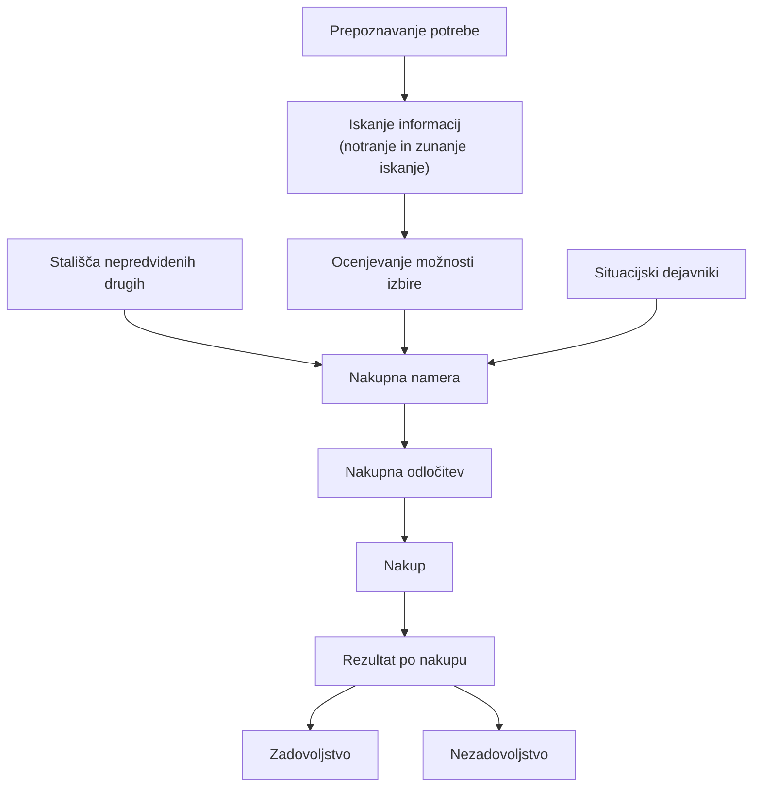

+++
title = "Psihologija vizualnih komunikacij"
date = 2024-03-06T07:07:07+01:00
draft = false
math = true
mermaid = true

summary = "Zapiski za predmet Psihologija vizualnih komunikacij za poletni semester prvega letnika FERI MK MAGISTERIJ."
summary_enable = true
summary_style = "subtitle"
+++

## Nakupno vedenje potrošnikov

### Potrošnik in kupec

**Kupec** je tisti, ki ima možnosti - mednje štejemo predvsem vire za nakup. Kupuje z namenom, da bi zadovoljil neke osebne ali skupne potrebe, vendar kupec ni nujno tudi potrošnik. Primer je čokolada, ki jo je kupil starš, uporabil (pojedel) pa jo je otrok - kupec in potrošnik tako nista ista oseba.

**Potrošnik** je oseba, ki ima možnosti, vire in sposobnosti za pridobitev in uporabo dobrin, ki jih ponuja trg, da bi zadovoljila osebne ali skupne potrebe. To so torej osebe, ki izdelek ali storitev na koncu dejansko uporabljajo.

**Potencialni potrošnik** je za marketing najbolj zanimiva kategorija - to so bodoči potrošniki, za katere je treba prilagoditi oglase in izdelke. Med potencialne potrošnike sodijo osebe, ki se še ne zavedajo potrebe po neki določeni dobrini (z oglasom jih je treba šele opomniti, npr. na kremo proti gubam), osebe, ki nimajo informacij o določenih izdelkih, osebe, ki trenutno kupujejo sorodne izdelke ali storitve pri konkurenci, ter osebe, ki trenutno nimajo dovolj finančnih sredstev za nakup (npr. za stanovanje), a bodo te vire morda imele čez nekaj let. Tudi potencialni potrošniki so za podjetja zelo zanimivi.

### Nakupna enota

Pri nakupu pogosto ne sodeluje samo ena oseba, ampak se odločamo v sodelovanju z drugimi - takrat govorimo o **nakupni enoti**. Nakupna enota je značilna predvsem za družinske nakupe. Znotraj nje obstajajo različne vloge, pri čemer lahko ena oseba prevzame več vlog, ali pa vsako vlogo prevzame druga oseba.

| Vloga | Opis |
| :--- | :--- |
| **Pobudnik** | Oseba, ki da spodbudo za nek izdelek oz. storitev. |
| **Vplivnež/mnenjski vodja** | Poda mnenje o nekem izdelku oz. storitvi. |
| **Odločevalec** | Ima finančno moč in moč, da sprejme oz. izvede končno nakupno odločitev. |
| **Kupec** | Dejansko izvede nakup. |
| **Potrošnik** | Storitev oz. izdelek na koncu uporablja. |

### Od česa je odvisno nakupno vedenje?

Vedenje je odziv na zaznavo. (Nakupno) vedenje je tako odvisno od notranjih predstav posameznika - torej kako mi razmišljamo o nečem - pa tudi od vplivov neposrednih zaznav iz fizičnega in socialnega okolja - torej kako bodo na neko stvar, ki bi jo imeli, gledali drugi.

### Vrste nakupnih procesov

- **Razširjen nakupni proces** - gre za poglobljeno razmišljanje o nakupu, kjer izbiramo vse potrebne informacije. Ta proces je značilen za drage, luksuzne izdelke, pri katerih smo kot kupci močno vpleteni (npr. nakup računalnika). Odločitev tu ne poteka v eni minuti, ampak najprej zbiramo informacije.
- **Zožen nakupni proces** - kupec preskoči fazo zbiranja informacij, nakup pa se opravi zelo hitro. Gre bodisi za pomanjkanje časa, bodisi za nek vsakdanji nakup (npr. pri nakupu mleka ne bomo veliko premišljevali, kje je cenejše ali dražje - pomembno bo predvsem, ali je 1,5-odstotno ali 3,5-odstotno).
- **Impulzivni nakup** - kupec se odloči za nakup, brez da bi prej premislil o potrebi po danem izdelku. Primer: stojimo na blagajni in med čakanjem vzamemo čokoladico, ki je na polici poleg.
- **Kompulzivni nakup** - kupec izdelek kupi zaradi občutka osamljenosti ali depresije - tako kot pri impulzivnem nakupu tudi tu ne gre za resnično potrebo po izdelku, ampak kupec z nakupom beži pred nečim, kar je seveda kratkoročno.

**Zasvojenost** je možganska motnja, za katero je značilno kompulzivno zasledovanje nagrajujočih dražljajev kljub škodljivim posledicam - zasvojeni smo lahko npr. z drogo, in čeprav vemo, da bodo posledice škodljive, jih kljub temu kompulzivno še naprej jemljemo.

### Potek razširjenega nakupnega procesa

Prepoznavanje potrebe se najpogosteje pojavi pri dražjih izdelkih, kot sta računalnik ali avto. Sledi iskanje informacij - torej kakšni so naši občutki in kaj o izdelku pravijo drugi. Nato ocenjujemo možnosti izbire (npr. lahko kupimo večji ali manjši avto). Pri nakupni nameri so pomembne situacije in stališča - na primer, ali nam je všeč prodajalna, kjer želimo kupiti, ali nam je všeč barva avta. Sledi nakupna odločitev, nato nakup, na koncu pa je še rezultat po nakupu - ali smo z nakupom zadovoljni ali ne.

Ožji nakupni proces je po teh fazah dosti ožji - mogoče so samo zadnje tri faze.


**Aktivno delo:** Preberi članek *"Kako povečati prodajo s pomočjo psihologije"* in podaj svoje ugotovitve.

**Ključna ideja:** uporaba vedenjske znanosti in kreativnosti lahko poveča vrednost nakupa brez spremembe cene ali izdelka.

**Primer**

Leta 2014 je **KFC** v Avstraliji s pomočjo ekipe vedenjskih znanstvenikov iz agencije Ogilvy Australia dosegel 56-odstotno povečanje prodaje krompirčka za en dolar. Ključ je bil v tem, da so isto ponudbo predstavili na različne načine, kar je vplivalo na zaznavanje vrednosti pri potrošnikih.

Pri kampanji so uporabili naslednje strategije:

- **Izogibanje izgubi** - ponudbo so predstavili kot časovno omejeno, kar je sprožilo strah pred zamudo.
- **Vzajemnost** - uporabili so koncept sodelovanja in občutka dolžnosti vrniti uslugo.
- **Izplačilo vrednosti** - poudarili so omejitve ponudbe, kot je le možnost prevzema (kar je že veljalo).
- **Sidranje** - omejitev nakupa na določeno število, kar je povečalo zanimanje za izdelek.
- **Družbeno normaliziranje** - sporočilo, da vsi uživajo v ponudbi, kar spodbuja posnemanje.

Po preizkušanju različnih sporočil na družbenih omrežjih sta se najbolje izkazali načeli vzajemnosti in sidranja, kmalu je sledila oglaševalska kampanja, ki je povzročila znatno rast prodaje. Prodaja krompirčka se je povečala za 56 %, prodaja štirih porcij naenkrat pa kar za 84 %. To je dokaz, da lahko pravilna uporaba psiholoških principov močno vpliva na vedenje potrošnikov in posledično na prodajo.


### Dejavniki nakupnega vedenja

Poznamo šest dejavnikov nakupnega vedenja: psihološke, osebne, sociološke, ekonomske, necenovne in situacijske dejavnike.

#### 1. Psihološki dejavniki

Psihološki dejavniki so povezani s posameznikovimi notranjimi procesi - torej s procesi, ki se dogajajo v nas kot osebah. K psihološkim dejavnikom štejemo pet različnih dejavnikov:

- **Potrebe** so razlog za začetek nakupnega procesa. Poznamo primarne biološke potrebe (hrana, voda, spanje, spolnost), primarne socialne potrebe (varnost, druženje, estetske potrebe, priznanje) ter sekundarne socialne potrebe (naši interesi, hobiji, navade in razvade, kot so priboljški ali cigareti).
- **Motivi** - motivacija je želja oz. razlog, da nekaj naredimo. Je glavni dejavnik postavljanja in doseganja ciljev - cilje si zastavimo, če imamo motivacijo. Glavni sprožilci motivacije so potreba po moči, potreba po dosežkih ter potreba po pripadnosti. Motivacija je lahko notranja ali zunanja: zunanji motivi izvirajo iz zunanjega sveta (npr. nagrade, kot sta diploma ali plača), notranji motivi pa iz naše notranjosti, iz notranjega zadovoljstva, če nekaj dosežemo. V psihologiji govorimo tudi o povezanosti motivacije z vpletenostjo - pri potrošnikih je vpletenost velika npr. pri nakupu daril ali kozmetičnih in modnih izdelkov, kjer se pri nakupu prepleta več motivov (recimo pri nakupu kozmetičnega izdelka, kot je krema).

image1 and image2

- **Samopodoba** je stališče oz. odnos do samega sebe. Tu ločimo dva jaza - dejanski jaz (kar dejansko smo) in idealni jaz (kar bi želeli biti). Samopodoba je za tržnike ključna, saj želijo ustvariti blagovne znamke, s katerimi bi se potrošniki poistovetili (npr. ure Longines, ki naj bi žensko naredile elegantno).

image3 and image4

image5 and image6

- **Osebnost** opredeljujejo telesna zgradba, temperament, interesi, stališča, sposobnosti, vrednote in značaj. Karizmatična oseba je npr. Tadej Toš.
- **Duševni procesi** so vsi notranji procesi, ki potekajo v določenem časovnem zaporedju in vodijo k določenemu izidu - pri človeku se kažejo navzven, čeprav jih pogosto ni mogoče neposredno opaziti. V psihologiji jih delimo na čustvene, motivacijske in kognitivne. Kognitivni procesi se nadalje delijo na zaznavanje, učenje in mišljenje - mišljenje je najvišji duševni proces.


**Aktivno delo:** Preberi članek *"Zakaj bi nov program zvestobe zaupali Maslowu?"* in podaj svoje ugotovitve.

**Ključna ideja:** uspešni programi zvestobe temeljijo na prepoznavanju osnovnih psiholoških potreb, kot jih opisuje Maslowova hierarhija potreb, kar vodi v bolj angažirane in zveste uporabnike.

**Primer**

Avtor opisuje svojo izkušnjo z menjavo banke zaradi sankcij proti Rusiji in raziskovanje novih aplikacij, ki vključujejo programe zvestobe. Opazi, da je včlanjen v nekatere programe zvestobe, ki jih sploh ne uporablja, kar ga vodi do razmišljanja o tem, zakaj se uporabniki odločajo za sodelovanje v teh programih in kako jih aktivirati.

Aktivnost uporabnikov je ključna za donosnost naložbe (ROI) - učinkovitost programa je odvisna od razumljivosti pravil in razmerja med aktivnostjo uporabnikov in vrednostjo ugodnosti. Enostavna in jasna pravila ter enostavno razumljivo razmerje med aktivnostjo in ugodnostmi so ključni za ohranjanje uporabniške aktivnosti.

Maslowova hierarhija potreb vključuje fiziološke in psihološke potrebe - za programe zvestobe so pomembne psihološke potrebe: pozornost, namen, pripadnost, kreativnost, intimnost, nadzor, status in varnost.

Adam Posner opisuje šest valut programov zvestobe:

- **Denar** - uporabniki želijo čim več neposredno nazaj za svoje nakupe.
- **Izkušnja** - želijo doživeti nekaj več, npr. posebne dogodke.
- **Prihranek časa** - manj časa za opravljanje aktivnosti, npr. prednostni termini.
- **Osebna raven** - posebne ugodnosti za posameznika, npr. ob rojstnih dnevih.
- **Odločitev** - uporabniki izbirajo ugodnosti glede na svoje preference.
- **Skupnost** - del skupnosti s skupnimi vrednotami in višjim ciljem.

Elementi uspešnega programa zvestobe so vedenje (vključuje transakcijske aktivnosti uporabnikov), zaupanje (program mora prihraniti čas in ponuditi posebna doživetja) ter pripadnost (uporabniki se počutijo povezane z blagovno znamko in dosegajo višje cilje preko programa). Povezava med Maslowovo hierarhijo in programi zvestobe poudarja, kako pomembno je naslavljanje psiholoških potreb uporabnikov za povečanje njihove aktivnosti in zvestobe.


#### 2. Osebni dejavniki

Osebni dejavniki so starost, stopnja v življenjskem ciklu družine, poklic in življenjski slog. Ko smo bili npr. stari 12 let, smo imeli povsem druge interese in nakupe, kot jih imamo danes, zato je za oblikovanje oglasnih sporočil pomembno poznati življenjski slog potrošnikov.

#### 3. Sociološki dejavniki

Sem sodijo kultura, tradicija, družina, referenčne skupine in mnenjski vodje.

**Kulturo** je treba poznati, saj se glede na njo razlikuje tudi to, kako naj bo blagovna znamka predstavljena - npr. znamka Starbucks mora poznati kulturo trga, kjer prodaja: pri nekaterih kulturah se kava toči za s seboj, pri drugih je poleg kave obvezen rogljiček, pri tretjih cigareta. Podobno morajo biti npr. ženske v oglasih za arabski trg predstavljene kot podrejene, ubogljive in odvisne, medtem ko so ženske iz zahodnega sveta v oglasih pogosteje predstavljene kot samostojne, močne in neodvisne.

**Tradicija** je druga pomembna lastnost, ki jo je treba poznati in upoštevati.

**Družino** ločimo na primarno družino (tisto, v kateri se rodimo) in družino, ki si jo ustvarimo sami.

**Referenčne skupine** so tiste, s katerimi se poistovetimo in sprejemamo njihova stališča - to so npr. naši kolegi ali naš razred.

**Mnenjski vodje** so posamezniki, ki vplivajo na nakupne odločitve - to je lahko kakšen strokovni prodajalec, partner, prijatelj ipd.

image7 and image8


**Aktivno delo:** Preberi članek *"Ramadan je najboljša marketinška priložnost leta v muslimanskem svetu"* in komentiraj.

Ramadan, deveti sveti mesec islamskega koledarja, poleg spiritualnosti prinaša tudi največjo marketinško priložnost v muslimanskem svetu. V tem obdobju se splošna potrošnja poveča za 53 %, predvsem za živila, gospodinjske pripomočke, potovanja, oblačila, kozmetiko, elektroniko in avtomobile. Kar 60 % potrošnikov med ramadanom porabi več, zlasti za hrano, in 57 % jih vse leto varčuje za ramadanske nakupe.

Marketing v tem času izkorišča radodarni duh meseca za grajenje blagovnih znamk - blagovne znamke, ki uspešno ujamejo esenco ramadana, si odprejo pot v srca muslimanskih potrošnikov. Vendar pa 64 % vernikov meni, da je pravi duh ramadana izgubljen in postal preveč potrošniški.

Nakup hrane in živil se med ramadanom poveča za 10 do 15 %, 71 % vernikov pa prizna, da za hrano porabijo več kot običajno - proizvajalci hrane in maloprodajne verige prepoznavajo svojo vsakoletno priložnost v ramadanskih promocijah, kjer so priljubljene količinske ponudbe, popusti in posebni paketi z darili.

Avtomobilska industrija je še posebej aktivna z najboljšimi ponudbami v letu, kar spodbuja kupce, da nakupe preložijo na ramadan - promocije vključujejo velike popuste, brezplačno registracijo, zavarovanje, servise in druge ugodnosti.

Ramadanski marketing ni omejen le na hrano in avtomobile, saj potovanja ob koncu ramadana (*»eid al fitr«*) prav tako predstavljajo pomembno kategorijo - večina potovanj se kupuje na spletu, kar dodatno spodbuja digitalno tržženje.

Marketing se prilagaja ramadanskim vzorcem dnevne rutine, kjer se družabno in poslovno življenje prehaja v nočne ure. Klasična medija, prodajno mesto in televizija, sta še vedno učinkovita, vendar digitalni in družbeni mediji pridobivajo vse večji pomen - čas, preživet na mobilnih telefonih in družbenih medijih, se poveča, kar tržnikom ponuja več možnosti za oglaševanje.

Ramadanska ikonografija in čustvena sporočila prevladujejo v kreativnih kampanjah, saj ironija in kritična distanca nista sprejemljivi. Ramadan je tako kljub svoji spiritualnosti in postu odlična marketinška priložnost, če blagovne znamke prepoznajo priložnosti in prilagodijo svoja sporočila ter medije temu svetemu mesecu.


##### Primer globalnega oglasa

Nekateri oglasi so narejeni tako, da nagovarjajo čim širši, globalni trg, brez prilagajanja posameznim kulturam:

- **Smirnoff** - *"Infamous since 1864"* - primer oglasa z vodko, narejenega za globalni trg. Mogoče je manj primeren za kakšne države, kjer ljudje ne pijejo alkohola.



- **Hisense/Gorenje** - *"The SuperConnected"* - oglas za pametni dom, prav tako narejen za globalni trg.



- **IKEA** - *"Poskusite to doma"* - globalni oglas, ki nagovarja vse različne skupine ljudi, ne le lokalnega okolja.



- **McDonald's** - oglas, predvajan v času nogometnega svetovnega prvenstva v kar 75 državah.



Prednosti globalnih oglasov so predvsem manjši strošek, saj se jih ni treba prilagajati za različne trge in države. Po drugi strani pa se z lokalnimi oglasi ljudje lahko bolje poistovetijo.

#### 4. Ekonomski dejavniki

Sem sodita dohodek in cena. **Dohodek** opredeli življenjski standard kupca in pove, koliko se ob spremembi cene spremeni povpraševanje po izdelku. **Cena** pa je kriterij dobrega nakupa - če plačamo več, naj bi bil izdelek boljši, vendar temu pogosto ni tako.

> **Primer**
>
> Kampanja za šampanjec Veuve Clicquot, kjer so želeli pokazati, da si znamko želijo tudi kupci z nižjim življenjskim standardom.



#### 5. Necenovni dejavniki

Sem sodijo kakovost, embalaža, blagovna znamka, plačilni pogoji, servis in garancija - npr. da nas po nakupu luksuznega izdelka še mesec dni po nakupu pokličejo in vprašajo, kako smo zadovoljni z izdelkom.

> **Primer**
>
> Blagovna znamka Cockta je spremenila videz embalaže iz rumeno-rdeče v modro barvo.

- **Cockta** - *"Nov izgled, legendarni okus."* - znamka je nakup ponudila v novi, elegantni in prestižni embalaži kot poklon ljudem različnih generacij.



- **Argeta** - prenovljena embalaža, ki naj bi bila "inovativna" do te mere, da jo lahko okusiš že z očmi.



#### 6. Situacijski dejavniki

Situacijski dejavniki so lahko povezani z izdelkom (kakšna je embalaža ali oglas), lahko pa gre tudi za odločitev na mestu samem - glede na to, kje je izdelek postavljen. Npr. na mestu, kjer je na plaži skakalnica v obliki plastenke Coca-Cole, bodo takšno pijačo v danem okolju kupili tudi posamezniki, ki je sicer običajno ne pijejo.

- Velika napihljiva **pločevinka Coca-Cole** in **Sprite-ov "tuš"** na plaži v Riu de Janeiru - primera, kako lahko situacija oz. okolje, v katerem je izdelek postavljen, vpliva na nakupno odločitev posameznika.

image9 and image10

- **Lenny Kravitz** v kampanji za Yves Saint Laurent razkrije svoje "zatočišče" - primer, kako je izdelek (dišava) umeščen v specifično, sanjsko okolje in situacijo.


### Primeri situacijskega oglaševanja

- **Snickers** - *"Bolje sit kot siten!"* - kampanja, situacijsko usmerjena tako, da niso tečni drugi, ampak si ti, ker si lačen (npr. sporočila na avtobusih in v pisarnah, prilagojena situaciji lakote).



### Destinacijski marketing

Destinacijski marketing je marketing, s katerim neka destinacija (npr. turistični kraj) trži samo sebe.

- **Turistično združenje Portorož** - kampanja *"Mi smo tu"*.



- **Terme Krka** - *"Punce, gremo me po svoje"*.




**Aktivno delo:** Upoštevajte dejavnike nakupnega vedenja (psihološke, osebne, sociološke, ekonomske, necenovne in situacijske) in označite profil kupca za naslednje izdelke/storitve: smuči Elan, dvodnevni izlet v Toscano, šampon proti ušem, iPhone, čokolada Milka, svetovalnica za partnerske odnose.


- **Smuči Elan** - bi bilo za nekoga, ki je športen tip in rad smuča, ki ima potrebo po druženju, glede na to, da se na smučanje običajno gre v skupinah, ki je v višjem dohodkovnem razredu, mogoče tudi za kakšnega posameznika, ki ima vzornike, ki uporabljajo smuči dane znamke.
- **Dvodnevni izlet v Toscano** - za osebe, ki rade potujejo, osebe, ki so mogoče v razmerju, ki so v paru, da gredo na izlet za valentinovo, obletnico ipd., za osebe, ki so premožnejše.
- **Šampon proti ušem** - za osebe, ki imajo uši, kakšne starše, ki imajo otroke v vrtcu ali šoli, da se uši lahko znebijo, če bi do tega prišlo, prav tako mogoče tudi za lastnike živali.
- **iPhone** - za ljubitelje in redne uporabnike znamke Apple, za posameznike iz višjega dohodkovnega razreda, za posameznike, ki jim je pomemben status, zaradi prijetne uporabniške izkušnje in kamere.
- **Čokolada Milka** - za ljubitelje sladkega, čokolade, za tiste, ki so žalostni ali veseli, mogoče za kakšne rojstne dneve, darila.
- **Svetovalnica za partnerske odnose** - za osebe v zvezi, mogoče tiste, katerim v razmerju kaj ne funkcionira, razmerje ne deluje, so osebe v sporu, za takšne, ki si to lahko tudi privoščijo - gre za razširjen nakupni proces, saj se odloča med poslovalnicami, pomemben je tudi značaj osebe, mogoče osebe, ki so bolj odprte.

### Spletno nakupovanje

Slovenci vedno več kupujemo v spletnih trgovinah, najpogosteje oblačila in obutev.

**Najpopularnejši izdelki v letu 2023:**

1. Samsung pametni telefon Galaxy A53
2. Pametni telefon Samsung Galaxy A54
3. Apple pametni telefon iPhone 13
4. Apple slušalke AirPods Pro (2. gen.)
5. Stihl motorna žaga MS 170
6. Urgent 717 - zaščitne delovne hlače do pasu
7. Apple pametni telefon iPhone 13 mini
8. Samsung pametni telefon Galaxy S22 5G (128 GB)
9. Samsung pametni telefon Galaxy S22 5G (256 GB)
10. Sony PlayStation 5 Digital Edition


**Aktivno delo:** Preberi članek *"Slovenci vedno več kupujemo v spletnih trgovinah; najpogosteje oblačila in obutev"* in podaj mnenje!

Valicon in Ceneje.si sta izvedla raziskavo E-commerce Report 2022 v sklopu tekmovanja Web Retailer Award 2022 in konference E-commerce Jam, ki potrjuje rast spletnega nakupovanja v Sloveniji. V raziskavi je sodelovalo 1.976 potrošnikov, med katerimi jih 76 % redno nakupuje prek spleta. Največ spletnih kupcev je iz generacije X (starejših od 45 let), ki najpogosteje kupujejo oblačila, obutev in modne dodatke. Povprečna vrednost nakupa je 100 evrov.

Največ nakupov opravimo v kategoriji oblačil in obutve (povprečna vrednost 82 evrov), sledijo elektronika (126 evrov) in izdelki za dom in vrt (181 evrov). Raste tudi segment živilskih trgovin, čeprav je še majhen.

Pandemija je vplivala na spremembo vedenja, saj vedno več nakupujemo v lokalnih spletnih trgovinah - le 10 % skupne vrednosti nakupov opravimo v tujini. Najpogosteje plačujemo s karticami in PayPalom (56 %), sledijo gotovina (30 %) in ostali načini (14 %).

Mobilni telefon postaja ključna naprava za spletno nakupovanje, saj je bilo 43 % nakupov opravljenih preko mobilnika, 50 % pa preko prenosnikov ali osebnih računalnikov. Raziskovalci menijo, da bo mobilni telefon še povečal svoj delež, kar zahteva prilagojenost trgovin za mobilne naprave.



**Aktivno delo:** Preberi članek *"Revolucija e-trgovine z umetno inteligenco: Nova era spletnega nakupovanja"* in podaj ugotovitve!

Google je pred prazniki predstavil tri nova orodja umetne inteligence (AI) za spletne kupce, kar nakazuje novo obdobje inovacij v spletni trgovini. Predstavljena orodja omogočajo enostavno iskanje daril, virtualno prilagajanje izdelkov ter izboljšano virtualno pomerjanje oblačil. Poleg Googla tudi Amazon in Alibaba uporabljata AI za optimizacijo prodaje in nakupov.

Nova Googlova orodja:

- **Ideje za darila z AI** - na podlagi uporabnikovih poizvedb orodje predlaga darila, ki so takoj na voljo za nakup.
- **Virtualna prilagoditev izdelkov** - uporabniki lahko vizualizirajo izdelek, prilagodijo njegove lastnosti in nato najdejo ustrezne ponudbe v Googlovem ekosistemu.
- **Virtualno pomerjanje oblačil** - orodje omogoča pomerjanje ženskih in moških oblačil z uporabo generiranih podob 40 oseb, ki se razlikujejo po postavi, višini in drugih lastnostih.

**Walmart** uporablja AI za prikazovanje izdelkov v virtualnem prostoru uporabnikovih domov in za virtualno pomerjanje oblačil, s čimer želi zmanjšati število vračil, ki so za spletne trgovce draga.

**Amazon** uporablja AI za izboljšanje hitrosti dostave in obdelave naročil - tehnologija SCOT (Supply Chain Optimization Technology) pomaga predvideti povpraševanje in optimizirati zaloge, robotika z AI v Amazonovih skladiščih pa pomaga pri pripravi paketov za odpremo in optimizaciji dostavne poti, kar olajša delo dostavljavcem.

Nova Googlova orodja še niso dostopna v Sloveniji - prva dva orodja sta na voljo v 120 državah, vendar ne v Sloveniji, tretje orodje pa je trenutno na voljo le v ZDA. Tehnološki napredek v e-trgovini s pomočjo umetne inteligence prinaša potrošnikom večje udobje, personalizacijo in hitrejše izpolnjevanje želja, medtem ko tehnološki velikani, kot so Google, Amazon in Walmart, tekmujejo za prevlado na tem področju.


**Navidezno/skrivno nakupovanje**


**Aktivno delo:** Preberi članka *"Je doba navideznega nakupovanja že mimo ali pa šele prihaja?"* in *"Ko zasijejo zvezde skrivnega nakupovanja"*.

**Je doba navideznega nakupovanja že mimo ali pa šele prihaja?**

Navidezno nakupovanje (ang. *mystery shopping*) se je začelo v 40-ih letih prejšnjega stoletja kot orodje za nadzor poštenosti zaposlenih. Danes je njegova vloga drugačna - pomaga podjetjem preverjati, ali storitve, ki jih nudijo strankam, ustrezajo standardom, ki so si jih sami zastavili. Vendar pa podjetja pogosto nimajo jasno opredeljenih standardov, kar otežuje učinkovito izvajanje navideznega nakupovanja.

Podjetja pogosto nimajo svojih specifičnih standardov, temveč izhajajo iz splošnih faz prodajnega procesa, kar otežuje preverjanje in omogoča subjektivnost. Sistem za zbiranje povratnih informacij strank (npr. NPS) ne zadostuje, saj ne vključuje vidika podjetja, kot je poskus zaključitve prodaje ali ponudba dodatnih izdelkov.

Navidezno nakupovanje je ključno za diagnostiko storitev, ki jih podjetje nudi - pokaže lahko, ali zaposleni izpolnjujejo standarde ali se trudijo zadržati stranke in izkazujejo dobro voljo, prav tako lahko razkrije, kako poteka storitev v različnih enotah in kako se primerja s konkurenco. Na podlagi ugotovitev iz navideznega nakupovanja lahko podjetja izboljšajo problematične dele storitve ali na novo razvijejo storitev, da se bolje poveže z resničnimi potrebami strank, kar povečuje operativno učinkovitost, izkušnjo strank (CX) in zadovoljstvo zaposlenih ter posledično vodi do večje zvestobe strank in konkurenčnosti.

Navidezno nakupovanje ni mimo, čeprav je njegov nadzorni vidik manj pomemben - ostaja ključno orodje za diagnostiko in monitoring storitev ter za zaščito blagovne znamke. Nujno pa je, da je strokovno izvedeno, vključuje kvalitativne vidike in prinaša tudi subjektivne vtise navideznih strank. Podjetja morajo oblikovati storitve v skladu s pričakovanji strank, vpletenjem zaposlenih in jasno opredelitvijo standardov, standarde storitve pa je treba posodobiti vsaki dve do tri leta, saj se vedenje in pričakovanja strank hitro spreminjajo.

**Ko zasijejo zvezde skrivnega nakupovanja**

Skrivno nakupovanje (ang. *mystery shopping*) je že dolgo uveljavljen način za ocenjevanje kakovosti storitev in odnosov s strankami - v Sloveniji se uporablja za pridobivanje anonimnih ocen, ki pomagajo podjetjem identificirati možnosti za izboljšave.

Veronica Boxberg Karlsson, ustanoviteljica MSPA Europe, je ugotovila, da se 68 % strank ne vrne zaradi slabega odnosa zaposlenih - to je ključno področje, na katerem podjetja lahko vplivajo in ga izboljšajo z uporabo skrivnih kupcev.

Trendi kažejo, da se skrivno nakupovanje širi na vse stične točke s strankami, vključno s spletnimi nakupi - pandemija je pospešila preverjanje spletnih nakupovalnih izkušenj. Uporablja se tudi v novih dejavnostih, kot so storitve dostave, transport, frizerske in kozmetične storitve ter preverjanje spoštovanja protikovidnih ukrepov.

Podjetje Skrivnostni nakup je leta 2016 začelo projekt *»Zvezda skrivnostnega nakupa«*, da bi pohvalili zaposlene, ki se najbolj trudijo za stranke - vključenih je približno 25 podjetij iz Slovenije in Hrvaške. Med kriznimi časi se je število prejemnikov priznanj zmanjšalo, vendar so prijazne nakupovalne izkušnje lahko konkurenčna prednost podjetij.

**Primer**

**M Tehnika** ocenjuje poslovalnice glede na uporabniško izkušnjo, kar vodi do dodatnega izobraževanja in izboljšanja nakupovalne izkušnje. **Petrol** je projekt uvedel na vseh prodajnih mestih in s tem pomaga izboljšati motivacijo zaposlenih ter zadovoljstvo strank. **Loterija Slovenije** s projektom motivira poslovne partnerje, ki so nagrajeni za prijaznost in visoke standarde poslovanja.

Skrivno nakupovanje ostaja pomembno orodje za izboljšanje storitev, povečanje zadovoljstva strank in motivacijo zaposlenih - podjetjem pomaga, da ostanejo konkurenčna in uspešna na trgu.


---

## Zaznavanje in pozornost

> **Primer**
>
> Sporen oglas za pralni prašek Ariel, kjer se oseba drogira z Ariel praškom. Ariel je s konkurenco zaključil malo drugače kot ostali oglaševalci pralnih praškov - namesto da bi oglaševal, kako izdelek super očisti perilo, je naredil oglas o tem, kako se ljudje "drogirajo" z Arielom. Oglas je bil sporen in so ga zato tudi prekinili.

### Kognitivni procesi pri predelavi oglasnih sporočil

Osnovni kognitivni procesi pri predelavi oglasnih sporočil so izpostavljenost, pozornost, zaznavanje, učenje, motivacija in odločanje. Oseba mora biti sporočilu najprej izpostavljena, mora biti nanj pozorna in ga mora znati prepoznati oz. zaznati. Nato sledi učenje, kjer informacijo shranimo v spominu, do nje pa nato razvijemo določen odnos. Pomemben je odnos, s katerim smo motivirani in oblikujemo nato odločitve za dejanja, ki so v skladu z našimi potrebami in željami.

#### Izpostavljenost

Izpostavljenost sporočilu je predpogoj za vse ostale kognitivne faze. Sporočilo se naredi za javnost fizično dostopno - brez izpostavljenosti sporočilu se ne more začeti nobena marketinška komunikacija.

> **Primer**
>
> Kozmetična znamka Motives - *"Customize and personalize. Get your perfect match."* - izpostavljenost sporočilu z ravnjo personalizacije izdelka.

#### Pozornost

Pozornost je proces, s katerim aktivno spremljamo omejeno količino vseh dražljajev in informacij. Takšnih, ki jih s čutili zaznamo, ali pa jih imamo že shranjene v našem dolgoročnem spominu. Pozornost vključuje zavedne, kot tudi nezavedne procese. Hkrati ne moremo biti pozorni na vse strani, zato se omejimo samo na nekatere (npr. pri filmih smo dostikrat osredotočeni na podnapise, ne moremo pa biti hkrati pozorni na celotno dogajanje filma).

**Dimenzije pozornosti:**

- **Obseg pozornosti** - količina nekih dražljajev, ki jih posameznik jasno zaznava, doživi - na koliko dražljajev smo lahko pozorni.
- **Trajanje pozornosti** - po določenem času nam pozornost pade, saj je trajanje pozornosti omejeno - ne moremo biti maksimalno pozorni na en dražljaj ves čas (tukaj govorimo o nihanju pozornosti).
- **Intenziteta** - količina pozornosti, ki jo prejme posamezni dražljaj. Obseg in intenziteta sta v obratnem sorazmerju - posamezni dražljaj dobi namreč manj pozornosti, glede na število dražljajev, na katere se mora oseba osredotočiti.

> **Primer**
>
> McDonald's je naredil oglasno sporočilo s prehodom za pešce v obliki pomfrija.

##### Pasivna in aktivna pozornost

**Pasivna pozornost** se pojavi nehote - človek postane na določen dražljaj pozoren brez nekega namena, pozornost nanj vzbudijo zunanji dejavniki. Takšna pozornost se pojavi precej spontano, brez ponavljajočih dogodkov - neke oglase opazimo mogoče zato, ker se dostikrat ponavljajo.

> **Primer**
>
> Plakat lokalnega rock radia *"Jebeš španske pop hite"*.

**Aktivna pozornost** je rezultat pozitivne motivacije. Ta vrsta pozornosti je dolgotrajna in najbolj učinkovita - človek je pozoren na dražljaje in predmete, ki jih sam išče v okolju. Dostikrat določena podjetja oglase objavijo tako, da se avtorji takoj ne razkrijejo, o čem oglas sploh govori.

- **McDonald's** - *"Eyes on the fries."* - kampanja za varnost v prometu (Don't eat and drive. Take a break.).

image12

- **Colgate** - oglasi za zobno nitko, kjer so hoteli dokazati, da bo hrana, ki bo ostala med zobmi, pritegnila dosti več pozornosti kot katera koli druga napaka (serija oglasov s pari, kjer eden od njiju v zobeh drži kos zobne nitke).

image13 14 15

### Primeri (ne)navadne pozornosti

- **"Frida mom"** - oglas so zaradi njegove spornosti prepovedali na podelitvi Oscarjev (superbowl), s čimer je prejel še več pozornosti, kot bi jo sicer.



- **Dogvertising (Pedigree)** - oglaševanje, ciljano na lastnike psov - Pedigree je na cesti prepoznaval pse in prilagodil oglasne deske psom, ki so hodili mimo.



- **Carlton (pivo)** - *"Big Ad"* - oglas vse do konca ne pove, o čem sploh govori, s čimer gledalca spodbudi, da nadaljuje z gledanjem.



- **Ryanair** - oglas za valentinovo, namenjen samskim ljudem, ki lahko za valentinovo ceneje potujejo. Za pritegnitev mlajše publike je bilo uporabljeno tudi oglaševanje na TikToku - če je vplivnež v oglasu bolj odvrne od nakupa (Aja, 2024).



- **Match** - oglas za valentinovo, namenjen uporabnikom spletnega zmenkarjenja.



- **Gea majoneza** - *"Za stisn't dobra."* - oglaševanje na TikToku, usmerjeno v pozornost najstnikov.



> **Primer**
>
> Oscar Mayer - *"This summer, all legs are #HotDogsForLegs."* - billboard, kjer so noge kopalcev ob bazenu oblikovane tako, da iz daleč spominjajo na hrenovke.
>
> image11

### Oblike pozornosti

Poznamo dve vrsti pozornosti glede na to, kako je sprožena: aktivno in pasivno (opisani zgoraj), glede na obliko sprožitve pa poznamo še:

- **Načrtna pozornost** - najbolj intenzivna oblika pozornosti. Nastopi, ko ljudje iščejo točno določene informacije, ki bi jim pomagale pri izbiri oz. odločitvi (npr. kupujemo nove športne copate in smo zato pozorni na oglasna sporočila, ki oglašujejo copate).
- **Vsiljena pozornost** - dražljaj se vsili v zavest, npr. kakšni močni optični ali slušni dražljaji. Tržniki dostikrat koristijo močne dražljaje, da bi pritegnili našo pozornost.
- **Spontana pozornost** - kombinacija aktivne in pasivne pozornosti. Ne koncentriramo se na en ozek dražljaj, ampak smo pripravljeni sprejemati tudi druge, nove dražljaje (npr. v trgovini, kjer je polno dražljajev z izdelki).

> **Primer**
>
> Times Square je zajela »pottermanija« - oglaševalska prevzetje Times Squara ob premieri *Harry Potter and the Cursed Child*, primer intenzivnosti dražljaja oz. vsiljene pozornosti.



- **Heineken** - *"Walk-in fridge"* - interaktiven oglas, kjer je bilo mogoče preizkusiti virtualni sprehod skozi hladilnik.



- **Nike** - *"Run for your life."*



- **Nike** - *"This is our beautiful game."* - velika nogometna žoga, ki podira avtobus nasprotne reprezentance.


> **Primer**
>
> Vsiljena pozornost - znamka piva Cristal je svoj izdelek vključila neposredno v filme (parodijo pustolovskih filmov).



**Primeri spontane pozornosti:**

- Oglaševalska akcija *"Všeč mi je, da lahko grem zvečer sama po mestu"* - teaser kampanja, ki bo imela finalno razkritje. Želijo, da se stvar začne širiti, na koncu pa se bo razkrilo, kdo je naročnik oglasa.

image16

- Kampanja *"Should you have to hide the real you to be accepted?"* (discriminatie.nl) - ozavešča o diskriminaciji.

image17

- Oglas za kruh *"Bread is life."*

image18

### Dražljaji

Dražljaji so energetski procesi, ki prenašajo sporočila. Naši čutni organi reagirajo na dražljaje z nekim vzburjenjem, ki se razširi po živčnih vlaknih do možganskih središč. V središčih pa nastane doživetje oz. občutek. Dražljaje dojemamo v medsebojnih odnosih in na podlagi naših izkušenj si jih razlagamo (npr. kakšen občutek se v nas vzpostavi, ko vidimo Coca-Colo - želi vzpostaviti občutek žeje, osvežitve, nečesa dobrega).

**Vrste pozornosti:**

- **Deljena pozornost** - omogoča upravljanje več nalog hkrati. Smo sicer pozorni na bolj (za nas) pomembno nalogo.
- **Budnost** - npr. v noči hodimo po ulici in spremljamo, če nas kdo zasleduje.
- **Iskanje** - iščemo točno določen ključen dražljaj, ki je za nas pomemben.
- **Selektivna pozornost** - izločimo nepomembno od pomembnega. Npr. se učimo in poleg poslušamo glasbo - učenje je tu pomembnejše od glasbe, ki jo v nekem trenutku tudi ignoriramo.

> **Primer**
>
> Udarna rdeča barva in postavitev dlani pritegneta pozornost v Calvin Kleinovem oglasu, kjer avtor ni izpisal polnega imena znamke - podobno je bil zasnovan tudi oglas za Durex, kjer ne veš takoj, kdo je naročnik, zato smo nanj dosti bolj pozorni.
>
> image19
>
> image20

### Zunanji dejavniki pozornosti

Zunanji dejavniki pozornosti so intenzivnost, prostornost, trajanje in pogostost, kontrast, modalnost in gibanje.

- **Intenzivnost dražljajev** - večja kot je intenzivnost (npr. glasen zvok, močna svetloba), več pozornosti vzbudi v nas, kot pa nek šibek dražljaj.
- **Prostornost dražljajev** - večje predmete opazimo hitreje.
- **Trajanje in pogostost dražljajev** - če dražljaji trajajo dlje časa ali se dogajajo zelo pogosto, smo nanje dosti bolj pozorni (npr. ponavljanje določenih oglasov ali besed v oglasu). Pomemben je tudi časovni interval - daljši kot je interval, manj pozorni smo na dane dražljaje.
- **Kontrast** - kontrast in spreminjanje dražljajev. Nekih enakomernih dražljajev dostikrat ne čutimo, dokler se ne spremenijo. Prav tako opazimo dražljaj, ki izstopa zaradi barve (npr. črno-bele fotografije, na katerih je nekaj barvnega, kar potem tudi bolj opazimo).
- **Modalnost** - oblika manifestacije dražljaja, torej kako se dražljaj modificira. Najbolj pritegnejo slušni dražljaji, nato vidni oz. vizualni, najmanj pa otipljivi dražljaji. Psihologi, ki sooblikujejo oglase, morajo imeti to v mislih. Pri barvah najbolj pritegnejo svetle barve.
- **Gibanje** - dražljaji, ki se gibajo, vzbudijo pozornost.

> **Primer**
>
> Oglasno sporočilo za banane (Derby) je igralo na to, da se banane premikajo in da je pri oglasu vse bolj glasno, s čimer bi pritegnili dosti več potrošnikov. Banane so sicer četrto najpomembnejše živilo na svetu - prva tri so riž, pšenica in koruza.
>
> 

- **Kraš** je s prenovljenimi izložbenimi okni v Ljubljani (*"Leti, leti ... Bajadera velikanka?"*) poskušal pritegniti pozornost tako, da je izgledalo, kot da je okno zlomljeno.

image21

- **Hyundai Veloster** - oglas so prepovedali, ker je znamka želela oglaševati, da ima avto vrata samo na eni strani.



**Primeri barve za vzbujanje pozornosti:**

- Maybelline - v oglasu je edina barvna stvar šminka, kar pritegne pozornost.

image22

- Coca-Cola - v črno-belem oglasu z Drakulo je edina barvna stvar rdeča pločevinka Coca-Cole, kar pritegne pozornost.



**Primeri znanih osebnosti v oglasih:**

Pozornost pritegnejo tudi oglasna sporočila, v katerih sodelujejo znane osebnosti. Podjetja dostikrat za svoje oglase vključijo tudi znane osebe - na slovenskem npr. Merkator z Janom Plestenjakom, Magnifico v Šparu, Lado Bizovičar za Hofer.

- **Warburtons** - *"It can wait."* - v oglasu malico pri delu prekine videoklic Georgea Clooneyja.



- **Cristiano Ronaldo** x Binance - *"The NFT Collection"*.



- **Nika Križnar** (slovenska smučarska skakalka) je obraz kampanje Zlatarne Celje 2024.

image23

### Notranji dejavniki pozornosti

Notranji dejavniki pozornosti so čustva, potrebe in motivi, izkušnje in znanje.

**Čustva** usmerjajo pozornost, podobno kot motivacija. Bolj smo pozorni na ljudi, dogodke in situacije, če so za nas pomembni - to je subjektivni dejavnik. Čustva vplivajo tudi na obseg pozornosti: močna čustva in afekti pozornost zožijo na nek določen vidik komunikacije. V stanju panike ali besa lahko določeno situacijo precej napačno ocenimo in delujemo nekonstruktivno. Močna čustva pa vplivajo tudi na nastanek iluzij.

> **Primer**
>
> Organizacija Innocence in Danger z oglasom ozavešča o problematiki pedofilije - o tej temi se v medijih pogosto malo govori, med drugim tudi zato, ker se želi zaščititi identiteto žrtev.
>
> image24

> **Primer**
>
> Kampanja BabyCanWait.com ozavešča o problematiki prezgodnje nosečnosti pri mladostnikih - organizacija je s tem želela izpostaviti tematiko, o kateri se v medijih dosti ne poroča. Pomembna so tu stališča.
>
> image25

Poleg čustev na pozornost vplivajo tudi **potrebe in motivi**, naše **izkušnje** ter **znanje**.

### Primeri uspešnih oglasov, ki pritegnejo pozornost iz Super Bowla

- **Pepsi** in **Coca-Cola** vsako leto tekmujeta za pozornost gledalcev tudi z oglasi med prenosom ameriškega Super Bowla.





- **Lesnina** je zaradi konkurence (IKEA) pri reklami izbrala Šwede, s čimer je naredila parodijo na Ikeo. Podobno je naredil tudi **Merkur**, ki je v oglasu s pomočjo vrtnarskih orodij navidezno sestavljal pohištvo iz Ikeje.







- **Samsung** - *"The Spider and the Window"* - oglas z nenavadno, presenetljivo glasbo in vsebino (posnetek iz perspektive pajka), drugačno od tega, na kar smo pri oglasih sicer vajeni.


- **Zavarovalnica Triglav** - *"Severina: Ko fantazija postane goljufija"* - ironičen oglas, ki na humoren način prikazuje fantazijske scenarije zavarovalniške prevare.



### Zaznavanje ali percepcija

Zaznavanje sporočil pomeni, da prejemnik dopusti sporočilu dostop do zavesti in ga sprejme v nadaljnje mentalno oz. duševno obravnavo. Gre za proces pridobivanja informacij, s katerimi ljudje selekcioniramo, organiziramo in interpretiramo dražljaje v nek pomen - dražljaji torej v tej fazi dobijo pomen.

Percepcija je eden izmed glavnih kognitivnih procesov, ki oblikujejo neko subjektivno sliko sveta v naši zavesti. Percepcija vključuje vid, sluh, vonj in dotik. Človeško telo s svojimi čutili vsako minuto zazna okoli 10.000 zaznav različnih pojavnih oblik. V oglaševalski industriji je zato pomembno, da sodelujejo sluh, vonj, vid in dotik.

- **Colgate** - *"Smile with strength."* - oglas za zobno pasto, ki vključuje tudi otip in vid (raztrgana povoj, stisnjena čeljust).
- **KFC** - *"Your chicken could never."* - billboard, na katerem se kos piščanca navidezno razteza čez okvir oglasnega panoja na stavbi, kar vpliva na zaznavanje na način, da bi ljudje postali lačni.



- **Crocs x Coca-Cola** - na natikače Crocs so natisnili logotip Coca-Cole, da bi gledalca "postali žejni".

image26

- **Paloma** - v sodelovanju s programom Svit (presejalni program za raka na debelem črevesu in danki) je ob 10. obletnici programa izdelala omejeno serijo WC papirja z natisnjenim logotipom in sloganom programa - toaletni papir kot nenavaden oglaševalski medij.

image27

- **Društvo Onkoman** - nad pisoarji so postavili table, ki pozivajo moške k samopregledu za preprečevanje raka na prostati (*"Ko boste doma slekli hlače, opravite samopregled mod. 30 sekund vam lahko reši življenje."*) - primer kontekstualno relevantne umestitve oglasnega sporočila.

image28

#### Motnje zaznavanja

Poznamo dve vrsti motenj zaznavanja: iluzije in halucinacije.

**Iluzije:**

- Nekaj vidiš, a vidiš narobe.
- Gre za napačno razlago oz. interpretacijo resničnega zunanjega dražljaja.
- So izredno pomembne v oglaševanju - velikokrat se jih poslužujejo oglaševalci (npr. tovornjak FedEx, kjer je med črkama "E" in "x" skrita puščica).

> **Primer**
>
> Oglas za pivo, ki je zasnovan tako, da spominja na žensko telo.
> 
> image29

**Halucinacije:**

- Vidiš nekaj, česar ni.
- Nastanejo zaradi dogajanja v našem organizmu - brez prisotnosti zunanjega dražljaja dojamemo zunanje okolje in ga interpretiramo.
- Npr. slišiš zvonjenje telefona, ampak zvonjenja sploh ni bilo.

**Dejavniki, ki sprožijo zmotne zaznave:**

1. **Nejasni dražljaji** - gre za šibke zunanje dražljaje; nekaj vidiš, a narobe presodiš.
2. **Dedno pogojene zaznave** - to so optične iluzije; nekaterih skupin dražljajev pri nekaterih ljudeh ne moremo zaznati (marsikdo ima npr. barvno slepoto ali pa namesto ravne črte vidi krivo črto).
3. **Posebna organska stanja** - smo pod vplivom droge ali alkohola, imamo visoko telesno temperaturo, duševne bolezni - takrat narobe zaznavamo dražljaje.
4. **Močna čustva** ali afekti - sem sodijo tudi pričakovanja, ki sprožijo vsakdanje halucinacije (npr. vidimo, da so se odprla vrata, čeprav se sploh niso, ker nekoga pričakujemo).
5. **Predsodki** - nekoga podcenjujemo ali precenjujemo (npr. na podlagi etnične pripadnosti nekomu pripišemo, da je storil tatvino, čeprav za to ni nobenih dokazov - klasičen primer, kako predsodki izkrivijo zaznavo).

image30

## Motivacija in vpletenost potrošnikov

### Motivacija

Motivacija spada med psihološke dejavnike in je zelo pomembna pri psihologiji vedenja potrošnikov. Motivacija je duševni proces, ki s pomočjo različnih motivov vodi vedenje ljudi in ga usmerja k določenim ciljem. Za tržnike je pomembno, da cilj vodi v nakup izdelkov ali storitev.

Motivacijski procesi lahko potekajo na dva načina:

1. **Zavestno** - s pomočjo naše volje.
2. **Podzavestno**.

Pri motivacijskem dejanju imajo največjo vlogo naše **potrebe** in **vrednote**, pomembne pa so tudi naše želje, ideali, nagoni ...

**Zavedna in nezavedna motivacija:**

Pri **zavedni motivaciji** se motivacije zavedamo. Točno vemo, kateri cilj želimo doseči in vemo, kaj nam bo cilj prinesel. Od motivacije in od volje je odvisen uspeh vsakega posameznika (v primerjavi z uspehom nekega drugega posameznika, ki nima te volje ali motivacije).

**Nezavedna motivacija** je motivacija, ki se je ne zavedamo. Približno vemo, kaj želimo doseči, ne vemo pa, zakaj - pravega cilja se ne zavedamo. Tudi nezavedni motivi spodbujajo nakupe, zato je tudi ta vrsta motivacije za tržnike pomembna. Ko psihologi pripravljajo oglasna sporočila, velikokrat ciljajo na nezavedno motivacijo ljudi.

> **Primer**
>
> Simbolika v izdelkih za kompromis samopodobe in superega - športni avtomobil kot zadovoljstvo moških (športni avtomobil za moške predstavlja cilj za uresničevanje superega).
>
> image31

**Motivacija na podlagi glasbenega učinka:**

- **Eurojackpot** - *"Sanje se lahko uresničijo v petek."* - oglas vzpodbuja motivacijo na podlagi glasbenega učinka, saj so slavnim pesmim spremenili besedilo.



- **Guinness** - *"Welcome back."* - pesem *Always on my mind* so spremenili in prilagodili za oglas za pivo, predvajal se je v času Covida.



- **Orchestra Game Changer** - kako Brazilce navdušiti za klasično glasbo? Z vključitvijo nogometa - primer motivacije s pomočjo športa, kako motivirati publiko za nekaj (klasično glasbo), za kar sicer ne bi vedeli, kako jo motivirati zase.



**Motivacija na podlagi znane osebe:**

- **Borotalco Men** - *"Bo Challe Salle uspel v 72-ih urah napisati nov hit?"* - primer dezodoranta Borotalco na podlagi znane osebe (Gašper Bergant in Challe Salle).



- **Decathlon** - *"The Breakaway"* - zaporniška kolesarska reprezentanca, šest zapornikov je sodelovalo v e-kolesarski kampanji. Slogan akcije: *"Nadomestite negativne misli s pozitivnimi. Šport je svoboda. Tudi takrat, ko ste ujeti med štirimi stenami."*



- **Barcaffe** - *"Dobra kava te zbudi. Najboljša te premakne."* - motivacija za prvi korak, prva jutranja skodelica kave.



### Potrebe

Kadar gre za neravnovesje v organizmu, čutimo neko potrebo. Neko pomanjkanje ali primanjkljaj povzroči potrebo.

Potrebe delimo glede na vloge, ki jih imajo v našem življenju:

- glede na vlogo: **primarne** (nujne, vezane na naš obstoj) in **sekundarne** (vse ostale);
- glede na nastanek: **pridobljene** in **prirojene**;
- glede na področje: **organske** (biološke in fiziološke) ter **psihološke** (socialne);
- glede na zavedanje: **zavestne** ali **nezavedne**.

Potrebe igrajo veliko vlogo pri vplivanju na to, kaj mi potrebujemo ali želimo. Pomembno je, da tržniki dobro poznajo potrebe svojih potrošnikov.

**Zadovoljevanje potreb - Maslowova motivacijska teorija:**

Med glavnimi skupinami potreb obstaja hierarhija - to je prioritetni seznam potreb po Maslowu. Višje potrebe se razvijejo šele takrat, ko so najnižje izpolnjene. Psihološko so za nas pomembnejše višje potrebe, saj nižje jemljemo kot samoumevne in ne dobimo nekega posebnega zadovoljstva, ko jih uresničimo.

Hierarhija od najnižje do najvišje: fiziološke potrebe, potreba po varnosti, potreba po pripadnosti, potreba po (samo)spoštovanju (skupaj *potrebe deficita*), nato samouresničitev in transcendenca (*potrebe biti*).

**Primeri oglasov, ki vzpodbujajo potrebe:**

- Kozarec za vino - *"I don't need inspirational quotes. I just need a damn glass of wine!"*

image32

- **Elena's** - *"Adiós Amor Adiós"* - mehiška znamka sladoleda, ki se oglašuje kot dodatna psihološka pomoč v primeru razhoda s partnerjem - sladoled ima toliko okusov, kolikor je faz v procesu žalovanja.



- Čokolada - *"All you need is love. But a little chocolate now and then doesn't hurt."* (Charles M. Schulz)

image33

- **Oculto** (optika, Ljubljana) - vsak človek ima načeloma le en par očal, znamka pa spodbuja, da bi očala postala modni dodatek in da bi jih ljudje imeli več, vsak par s svojim "karakterjem".

image34

- **Ghetaldus** (optika) - *"Nespretna? Morda samo potrebuješ nova očala. Da zadaneš ključavnico."* - cilj kampanje je, da bi v optiki več ljudi opravilo pregled vida.

image35


**Aktivno delo:** Navedite nekaj oglasov, ki močno vzpodbujajo potrebe!


- Heineken - ko si žejen.
- Merci čokolada - potreba po tem, da se nekomu zahvališ.
- Twix - potreba po tem, da si vzameš pavzo.
- Red Bull - potreba po energiji.
- Snickers - tešenje lakote.
- Nescafe - *"It all starts with a Nescafe."*

**Frustracija**

Frustracija je stanje oviranosti v motivacijski situaciji. Iz psihološkega vidika lahko pride do frustracij pri nakupovanju. Imamo lahko več ciljev, ki jih želimo doseči, a jih včasih ne moremo uresničiti hkrati - v tem primeru naše cilje rangiramo po pomembnosti. Frustracija nam oteži dostop do cilja ali pa ga popolnoma prepreči (npr. nek športnik se odreka vsemu, se popolnoma posveti cilju in na koncu mu ne uspe).

Frustracije delimo na:

1. **Objektivne** - so nepredvidene (npr. moramo na poslovni sestanek, na avtocesti pa se zgodi nesreča in obstojimo na cesti - nesreča je objektivna ovira).
2. **Subjektivne** - so frustracije, ki so v nas samih, so osebne ovire. V večini primerov predstavlja pomanjkanje volje glavno subjektivno oviro (npr. študent naredi vse izpite, ne naredi pa magistrske naloge).
3. **Socialne** - povezane so s področjem sociale (npr. direktor nam ponudi napredovanje, ki si ga želimo, a vemo, da bomo s tem izrinili najboljšega prijatelja).

> **Primer** 
> 
> Primer provokativnega oglasa za britansko vojsko, ki igra na frustracijo, gre za ustanovo, ki ne podpira kreativnosti ali odstopanj, govori pa o tem, če si v vojski lahko gej ali čustven
>
> image36

**Konflikt**

Konflikt se pojavi, ko imamo hkrati dve ali več potreb, ki jih ni mogoče hkrati zadovoljiti, med njimi pa se ne moremo odločiti (npr. *"To buy or not to buy?"*).

**Stres**

Na vse vrste motivacij negativno vpliva stres. Ko smo pod vplivom stresa, ne moremo dobro razmišljati in se dobro odločiti. Težko presodimo, kaj je prav in kaj ni. Vsako odločanje pod vplivom stresa dostikrat vodi do neuspeha.

### Vrednote

Podobno kot potrebe so tudi vrednote pomembne pri oblikovanju oglasnih sporočil. So zelo subjektivne - vsak izmed ljudi ima popolnoma drugačne vrednote (za nekoga je lahko vrednota ekonomska stabilnost, drugemu bo prioriteta nekaj drugega). Vrednote se delijo v različne kategorije:

| Kategorija vrednot | Vrednote in vrednostni objekti |
| :--- | :--- |
| Hedonistične | zabava, udobje |
| Fizične | šport, rekreacija |
| Statusne | moč, ugled, slava, družbeni položaj |
| Politične | oblast, politični uspeh |
| Ekonomske | dobiček, imetje, denar |
| Demokratične | svoboda, strpnost |
| Moralne | morala, poštenost |
| Družinske | dom, skrb za otroke |
| Delovne | delo, dosežki, poklicna kariera |
| Socialne | ljubezen, prijateljstvo |
| Patriotske | narodni ponos |
| Estetske | lepota |
| Kulturne | umetnost, kultura |
| Spoznavne | resnica, modrost, znanje |
| Ekološke | narava |
| Samoaktualizacijske | samouresničenje |
| Verske | odrešenje, vera, molitev |


**Aktivno delo:** Na podlagi razpredelnice opredeli zase top 5 vrednot.


- Socialne
- Hedonistične
- Estetske
- Kulturne
- Spoznavne

### Motivacija in čustva

Na našo motivacijo vplivajo tudi čustva. Vplivajo lahko pozitivno ali negativno - če so čustva pozitivna, motivacijo podpirajo, sicer jo zavirajo. V nekem negativnem (jeznem, žalostnem, potrtem) stanju ne moremo zbrati motivacije za nekaj - te stvari bomo opravili neuspešno.

### Vpletenost potrošnika

Vpletenost pomeni stopnjo interesa ali pomembnosti potrošnika, ki jo človek občuti ob določenem dražljaju v določeni situaciji. Stopnja vpletenosti sega od absolutnega pomanjkanja interesa za marketinške dražljaje pa vse do obsedenosti (npr. v trgovini ne zasledimo mačje hrane, ker doma nimamo mačke in smo popolnoma nezainteresirani).

Za **nizko vpletenost** je značilna inertnost - takrat se odločitve sprejemajo iz navade. Potrošnik nima motivacije, da bi preučil alternative.

Za **visoko vpletenost** je značilna močna intenzivnost, ki ima za posameznika velik pomen (npr. kupujemo sončna očala, zato bomo vse oglase glede na sončna očala dobro pregledali).

> **Primer**
>
> Oglasno sporočilo za luksuzne britanske avtomobile Aston Martin (rabljena vozila) - *"You know you're not the first, but do you really care?"* - močno so vpleteni potencialni kupci, ki se odločajo za nakup dražjih avtomobilov.
>
> image37

**Od česa je odvisna vpletenost potrošnika:**

1. **Značilnost potrošnika** - če nimamo neke potrebe, potem do vpletenosti ne bo prišlo. Najvišjo stopnjo vpletenosti človek začuti takrat, ko izdelek podpira značilnost potrošnika (njegovo lastno podobo).
2. **Značilnosti izdelka** - pomembne so, če lahko zadovoljijo posamezne potrebe (npr. če želimo dišati, bo izdelek - parfum Versace - zadovoljil našo potrebo).
3. **Situacijski dejavniki** - gre za različne situacije. Za povečanje vpletenosti po navadi pride pri modnih dodatkih, darilih in socialnih pritiskih (kaj bodo rekli drugi).

**Različne vrste vpletenosti:**

1. **Izdelčna vpletenost** - navezuje se na potrošnikovo zanimanje za nakup določenega izdelka. Velik pomen ima pospeševanje prodaje - je vrsta marketinškega promoviranja (npr. akcije 3+1 gratis, testne vožnje, degustacije ...).

    > **Primer**
    >
    > Renault *"Plug Inn"* aplikacija, ki omogoča polnjenje električnih avtomobilov, deluje kot AirBnB za električne avtomobile, saj obstaja premalo polnilnih postaj - zdaj si lahko avto polniš tudi pri nekomu doma in mu plačaš preko aplikacije, oglas spodbuja k nakupu električnih avtomobilov.
    >
    > image38

2. **Vpletenost z odgovorom** - potrošnika pripravi do tega, da o blagovni znamki ali oglasu razmišlja. Če primerjamo različne medije, na potrošnika najbolj vplivajo osebne prodaje (nekdo pride do tebe, se s tabo pogovarja, tam ne moreš pasivno stati in ne odgovarjati, moraš sodelovati), najmanj pa televizija (zahteva le pasivnega gledalca - o oglasu ne razmišljamo preveč, kontrole nad vsebino nimamo).
3. **Ego vpletenost** - navezuje se na pomembnost izdelka za potrošnikovo samopodobo. Določeni izdelki v družbi delujejo le kot statusni simboli, zato so potrošniki pripravljeni plačati višjo ceno, mislijo, da jih bodo ljudje v družbi zaradi njih bolje sprejeli.

    > **Primer**
    >
    > Tiffany's nakit, ki velja kot bolj luksuzen izdelek.
    >
    > image39

4. **Čustvena vpletenost** - podjetja igrajo na čustva.

    > **Primer**
    >
    > Unicefova reklama - *"He's starving. We're not. It's time to share."* - poziv k donacijam za lačne otroke.
    >
    > image40

Stopnja vpletenosti potrošnika vpliva na proces obdelave podatkov - torej na to, kako se bomo odločili o svojih stališčih, ali jih bomo oblikovali ali jih spreminjali. Pri tem ima velik vpliv tudi sporočanje od ust do ust.

> **Primer**
>
> **Duracell** je naredil oglas, v katerem je izdelek prikazan na samem začetku in na koncu oglasa, s čimer ponazori, da njihove baterije zdržijo do konca (deklica s plišastim medvedkom, ki predstavlja vojaka). Gre za močno čustveno zgodbo in inovativen oglas.



### Frekvenčna iluzija (Baader-Meinhofov fenomen)

Za ohranjanje zvestobe strank ter za pritegovanje njihove pozornosti in vpletenosti oglaševalci uporabljajo tudi psihološke metode, med katere sodi frekvenčna iluzija. Gre za dosledno oglaševanje izdelka, da se ta vtisne v spomin, zaradi česar ga nato vidimo skoraj povsod (npr. ko potrebujemo nov avto in nam nekdo predstavi novo znamko, jo nato opažamo povsod). Za izpeljavo oglaševanja s to psihološko metodo je treba isti izdelek v daljšem časovnem obdobju večkrat oglaševati, in sicer na tak način, da bodo se o njem ljudje pogovarjali, postali vanj vpleteni in se posledično odločili za nakup.

Z naraščanjem vpletenosti so potrošniki pripravljeni nameniti informacijam več pozornosti, zato lahko oglaševalci za močno vpletene potrošnike oblikujejo tudi bolj zapletena sporočila.

> **Primer**
>
> Znamka **Absolut Vodka** je v Ameriki skozi več let izvajala kampanjo frekvenčne iluzije s serijo podobno zasnovanih oglasov (vedno z isto obliko steklenice), s čimer je pritegnila pozornost in vplivala na čustva potrošnikov. Med drugim so opozarjali na varnost v prometu (*Absolut Security*), naredili smučarsko progo v obliki steklenice vodke (*Absolut Aspen*), bazen v obliki steklenice (*Absolut L.A.*), spreminjali okus in embalažo, oblikovano kot antično steklenico (*Absolut Original*, *Absolut Citron*), ter ob podelitvi filmske nagrade steklenico, sestavljeno iz filmskih trakov (*Absolut Achievement*). Eden od oglasov (*Absolut Impotence*) je oglaševalno serijo obrnil tudi v opozorilo - izpostavil je negativen učinek alkohola na moško potenco.
>
> gallery images 41-47

> **Primer**
>
> Oglas znamke **Protein World** (*"Are you beach body ready?"*) so zaradi vpliva na samopodobo žensk umaknili, potem ko je sprožil val protestov. Na plakatih so se kasneje začeli pojavljati tudi pripisi ljudi, ki so oglasu nasprotovali (npr. z vprašanji *"Are you a human?"*, *"Are you going to the beach?"*).
>
> image48 image49

Bolj vpleteni potrošniki so pripravljeni pogledati oglas tudi do konca, zato oglaševalci dostikrat oblikujejo sporočila, pri katerih naročnik ni takoj razviden.

> **Primer**
>
> Znamka **Vans** je z oglasom, pri katerem znamka ni takoj razvidna, želela pritegniti gledalce in bodoče potrošnike, da bi si oglas ogledali do konca in videli, kdo se pravzaprav oglašuje.



- **Bodyform** je prejel nagrado, ker je v oglasu menstrualno kri prikazal takšno, kot v resnici je, in ne modro, kot to počne večina oglasov.



### Ponavljanje v oglaševanju

Ponavljanje se v oglaševanju uporablja kot način, da si potrošnik oglas oz. blagovno znamko zapomni. Po eni strani lahko povzroči večjo prepoznavnost znamke, po drugi strani pa lahko postane preveč vsiljivo, zaradi česar se potrošnik za nakup izdelka ne bo odločil. Oglaševalci morajo zato uravnati, da je ponavljanja dovolj, a ne preveč.

> **Primer**
>
> Zavarovalnica **Triglav** je s ponavljajočo se kampanjo *"Generacije v Planici"* pri gledalcih gradila prepoznavnost znamke.



> **Primer**
>
> Osvežilna pijača **Lemon** (Parle Agro) je v Indiji oglaševala z geslom *"Thirsty?"*.



> **Primer**
>
> Aplikacija za zmenke **OkCupid** je s serijo plakatov *"DTF"* pritegnila pozornost z večkratnim ponavljanjem iste kratice, pri čemer je vsak plakat kratico razložil na svoj (nepričakovan) način.
>
> image50

---

## Spomin in učenje

### Pomnjenje in spomin

**Spomin** je zmožnost, da ohranimo in obnavljamo sprejete informacije, **pomnjenje** pa je proces, ki nam to omogoča. Dober spomin pomeni dobro ravnovesje med pomnjenjem in spominjanjem.

Glede na vrsto podatkov spomin delimo na tri dele:

- **Epizodični spomin** - spomin na pretekle dogodke iz našega življenja, torej stvari, ki smo jih dejansko doživeli (npr. spomin na to, kdaj smo dobili hišnega ljubljenčka).
- **Semantični spomin** - spomin, vezan na podatke, ki niso vezani na določen prostor in čas (npr. vse študijsko znanje).
- **Proceduralni spomin** - spomin za spretnosti in veščine (npr. vožnja s kolesom, hoja, govorica) - te veščine ostanejo v spominu tudi, če jih dolgo ne izvajamo.

### Proces pomnjenja

Proces pomnjenja sestavljajo tri stopnje: kodiranje, ohranjanje in obnavljanje.

#### 1. Kodiranje

Kodiranje je predelava podatkov za dolgoročno pomnjenje. Najbolje si zapomnimo izstopajoče in izrazite stvari, kar je pomembno tudi za oglaševalce, saj je oglaševanje močno povezano s psihologijo. Prav tako si lažje zapomnimo konkretne stvari, ki si jih lahko predstavljamo. Gradivo, ki ga prejmemo, čisto podzavestno organiziramo - miselni procesi izluščijo tisto, kar je za nas pomembno, se povežejo z že poznanimi pojmi in se nato uvrstijo v dolgoročni spomin.

#### 2. Ohranjanje v dolgoročnem spominu

Ohranjanje pomeni shranjevanje informacij in podatkov za prihodnost. Nanj vplivajo asociacije in pomen - da si stvari razložimo in razumemo, je ključno, da jih povežemo z asociacijami. Najhitreje pozabljamo stvari, ki so za nas nepomembne. Pri dolgoročnem spominu gre za količinske in kakovostne spremembe, na to, česa se bo oseba spomnila, pa vplivajo čustva, obseg ter običajnost (dobro poznane teme, znani vzorci) - letnice in imena pogosto znajo izginiti.

#### 3. Obnavljanje iz dolgoročnega spomina

Obnavljanje se dogaja na tri načine: s priklicem vsebine v spomin, s prepoznavanjem ter s prihrankom časa (pri ponovnem učenju porabimo manj časa, saj se nečesa, kar smo že prej spoznali, hitreje spomnimo). Pri obnovi se informacije, ki so bile shranjene v dolgoročnem spominu, vrnejo v kratkoročnega, kjer jih lahko ponovno preoblikujemo, obdelamo in iz njih naredimo odgovor, ki ga vrnemo nazaj v okolje.

> **Primer**
>
> Znamka **Mercedes-Benz** je v oglasu *"Chicken"* prikazala piščanca, ki kljub stresanju glave ne izgubi ravnotežja - s tem je ponazorila delovanje sistema MAGIC BODY CONTROL, ki avtomobil ohranja stabilnega ne glede na neravnine na cesti.



> **Primer**
>
> **McDonald's** je z oglasom *"Fancy a McDonald's?"* poskrbel, da si potrošniki izdelek zapomnijo in ga povežejo z znano frazo.



> **Primer**
>
> **Hofer** je s kampanjo *"Znižujemo cene - Dol dol dol"* z zapomljivim sloganom gradil prepoznavnost znamke.



### Tristopenjski model spomina

Tristopenjski model spomina ima tri stopnje: senzorni oz. trenutni spomin, kratkoročni oz. delovni spomin ter dolgoročni spomin.

- **Senzorni (trenutni) spomin** je vrsta spomina, ki za zelo kratek čas hrani informacije v takšni obliki, kot jih čutimo. Gre za prvo skladišče informacij iz okolja, njegova vloga pa je omogočanje povezovanja čutnih vtisov v celoto zaznav ter zbiranje informacij za nadaljnjo obdelavo. V senzornem spominu informacije ostanejo le nekaj sekund, nato pa jih nadomestijo druge oz. jih v trenutku pozabimo - lahko pa se njihova razpoložljivost podaljša tako, da se prične njihova začetna predelava.
- **Kratkoročni spomin** je vrsta spomina, v katerem je zbrana informacija, na katero smo pozorni in ki se preoblikuje tako, da dobi pomen. V tem spominu ne ohranimo vseh informacij, ampak le tiste, ki si jih želimo zapomniti. Kratkoročni spomin obdeluje informacije, ki prihajajo iz trenutnega spomina, jih poveže z izkušnjami ter jih obdela in organizira - zelo pomemben je za kasnejši priklic in predstavlja orodje mišljenja.
- **Dolgoročni spomin** je vrsta spomina, v katerem so shranjene naše izkušnje, dogodki, ki so se nam zgodili, občutki, čustva, predstave itd. Vse to je med seboj povezano in dobro organizirano, da lahko pride do obnove. Informacije se lahko ohranijo vse do konca življenja, njihov obseg pa je neomejen. V dolgoročnem spominu se shranijo podatki, ki smo se jih zavestno naučili in jih dolgo časa ponavljali, zaradi česar so se globoko zapisali v naše možgane. Če je informacija dovolj močna, je v nas vzbudila tudi močna čustva, zaradi česar se lahko iz kratkoročnega spomina prenese v dolgoročnega.

> **Primer**
>
> Kampanja **"Got milk?"** (*Imam mleko*) je za promocijo mleka uporabila nogometaša Davida Beckhama, igralko Kelly Preston in manekenko Christie Brinkley, ki so na oglasih imeli mlečne "brke". Nekaj let kasneje so znamke podobno kampanjo ponovile z otroki prvotnih igralcev - tako je npr. rastlinsko mleko Silk Nextmilk oglaševalo z Brooklynom Beckhamom, Ello Travolta in Sailor Brinkley-Cook, torej z novo generacijo z mlečnimi "brki".

### Pozabljanje

Pomnjenje in pozabljanje sta v obratnem odnosu - pomnjenje je vztrajanje spominskih sledi v možganih, njihovo propadanje pa je pozabljanje. Pozabljanje je proces izgubljanja ohranjenega gradiva, ki ga ne moremo več prepoznati ali priklicati, čeprav je bilo prej shranjeno - do njega ne moremo več priti. Čim večje je pomnjenje, tem manjše je pozabljanje in obratno.

Pozabljanje je naravni proces, ki omogoča, da nosimo s sabo in uporabljamo samo tiste informacije, ki so za nas in naše življenje pomembne in aktualne. Najhitrejše in največje je pozabljanje takoj potem, ko smo informacijo prejeli - informacije, ki za nas niso relevantne, najlažje pozabimo.

Pri možganskih poškodbah je lahko poškodovan semantični del spomina s podatki - lahko pozabimo, da sta Rdečo kapico napisala brata Grimm, veščin, kot je vezanje vezalk, pa ne pozabimo.

> **Primer**
>
> Tržniki so naredili čokoladice **Merci**, da se lahko z njimi nekomu zahvalimo. Podobno so želeli s pomoči bomboni **M&M** doseči, da bi se vsi ljudje njih zavedali in jih uporabljali kot "opravičilo". Tržnikom, ki so naredili reklamo za Merci, je uspelo, pri M&M pa ta ideja ni uspela.



### Predstavljanje - predstavni spomin

Oblike shranjevanja podatkov v spomin sta dve:

- **Besedna oblika** - je pogostejša, ni pa tako natančna kot slika. Zajema predvsem bistvene značilnosti nekega izvirnika, ki pa ni natrpan s podrobnostmi. Zanjo je značilno tudi, da je trajnejša, saj predstave prej zbledijo. Besedna oblika ni tako natančna.
- **Slika** (spominska ali domišljijska predstava) - gre za nek natančen posnetek zaznav, ki pa niso tako razločne, jasne in niso tako stabilne. Nastanejo s kombinacijo izkušenj iz preteklosti, kot celota pa ne ustrezajo stvarnosti.

> **Primer**
>
> Blagovna znamka **Milka** v svojem logotipu uporablja vijolično kravo z zvoncem - gre za primer besedne oblike shranjevanja, saj si zapomnimo bistvene značilnosti (barva, žival), ne pa vseh podrobnosti.

> **Primer**
>
> **Kanal A** se je predstavil v novi grafični podobi, ki je bolj minimalistična, vendar bolj učinkovita. Svojo novo grafično podobo so predstavljali na medijih, da bi jo gledalci opazili in da bi jim bila všeč.



> **Primer**
>
> **Coppertone Sunscream** je za reklamo za sončno kremo vzel kužka, ki je psičku (dekletcu) med igro na plaži povlekel kopalke - gre za primer slikovne, spominske predstave, ki je ostala v spominu potrošnikov vrsto let.



### Učenje

Učenje je vsaka sprememba v vedenju, informiranosti, znanju, razumevanju, stališčih, spretnostih ali zmožnostih, ki je trajna in ki je ne moremo pripisati fizični rasti ali razvoju podedovanih vedenjskih vzorcev.

Učenje je proces spreminjanja znanja ali vedenja zaradi izkušenj, ki ima trajni učinek. Ne gre samo za kopičenje nekih podatkov, ampak tudi za spremembo zaznavanja in tega, da doživljamo okolje, sebe drugače, kar vpliva na spremembo vedenja. Učimo se zaznavanja svojega okolja, obvladovanja svojega gibanja, reševanja problemov, učimo se, katera čustva v katerih situacijah doživljamo, kako jih izražamo in kako čustva obvladujemo. Učimo se tudi prepoznavanja svojih potreb, obvladovanja svojega vedenja, sporazumevanja z drugimi in reševanja konfliktov.

> **Primer**
>
> **Heinz** je razkril skrivnost svojega kečapa - naredili so oglas, v katerem so pokazali, kako se pravilno odpre njihova steklenica kečapa.



#### Teoriji učenja, pomembni za vedenje potrošnikov

- **Asociativno učenje** je učenje s pogojevanjem in pomeni, da se z večkratnim izpostavljanjem nekemu dražljaju in ustreznemu odgovoru na ta dražljaj dražljaj in odgovor nanj povežeta - lahko sodita skupaj ali pa ne. Sodi med vedenjske teorije.
- **Kognitivno učenje** poudarja, kako pomembni so notranji miselni procesi - zagovarja kreativnost in ustvarjalnost. Kognitivno učenje lahko definiramo kot učne procese, v katerih posamezniki pridobivajo in obdelujejo določene informacije, poudarek pa je na vplivu novih dražljajev. Za prodajalce izdelkov in storitev je pomembno, kakšne izkušnje imajo potrošniki z izdelki, ki so jih dali na trg oz. v uporabo - če so izkušnje pozitivne, se lahko pričakuje povečana pripadnost blagovni znamki in zvestoba blagovni znamki, kar poveča prodajo in dobiček, kar je želja vsakega proizvajalca.

> **Primer**
>
> **Bodyform** je razbil tabu o rdeči krvi, saj je večina drugih oglasov (za higienske vložke) predstavljenih z modro barvo krvi.
>
> image51

> **Primer**
>
> **Opel** je z oglasom (*"Yes of Corsa"*) prikazal prehod znamke Corsa na električno energijo.
>
> 

> **Primer**
> Podjetje **Big Bang** je naredilo oglas za učenje potrošnikov - želeli so navdušiti potrošnike nad uporabo njihovih naprav s ponavljanjem.
>
> 

### Priklic

Priklic je obnovitev in uporaba shranjene informacije. Priklic je zelo pomemben za oglaševalce, ker si želijo narediti blagovno znamko, oglas ali izdelek, ki se bo potrošnikom "stisnil" v spomin.

Povezave si lahko zamislimo kot drobne žice, v katerih so shranjene informacije - vsakič, ko na nekaj mislimo oz. ko o nečem govorimo, se te žice krepijo in debelijo. Ko med sabo povezujemo nove informacije, vzpostavljamo nove in nove vezave, ki jih je vedno več, in na ta način krepimo svoj spomin. S ponavljanjem krepimo spomin in spominske funkcije - vedno ko uporabimo kakšne miselne procese, se vedno bolj, kot je informacija povezana z drugimi, lažje informacijo priklicali v spomin. Ravno zaradi tega je pri učenju pomembno ponavljanje - zato določene oglase ponavljajo toliko krat, da si ob glasbi priklicujemo nek oglas v glavo. Zato so pomembne oglaševalske kampanje.

#### Priklicni nizi

Velike informacije ne izgubimo, pa kljub temu se zna zgoditi, da je te informacije težko uporabiti. Zato je pomembno, da imamo na razpolago neko geslo, nek ključ.

> **Primer**
>
> Pri **Applu** takoj vemo, da gre za iPhone, Steve Jobs itd. Seveda so asociacije odvisne od posameznika. Pri **Oplu** se spomnimo na kolo, avto, volan, pri **Adidasu** se spomnimo na šport, pri **Good Yearu** pa se spomnimo na gume.

image52, 53, 54, 55

#### Priklic informacij za nakupno odločanje

> **Primer**
>
> Znamka **Peugeot** je imela oglas s plakatom (*"Novo mesto v garaži prihrani za osupljivo."*), da bi povečala priklic.
>
> image56

Pomembno je tudi, da uporabnik sprejme novo spremembo logotipa znamke ali oglasa - dostikrat firme zato naredijo množične raziskave, da vidijo, ali so ljudje sprejeli njihove spremembe oz. ali so s tem pridobili več potrošnikov.

> **Primer**
>
> **Pepsi** je predstavil nov slogan - *"That's what I like."*
>
> image57

#### Vpliv slavnih oseb na priklic


**Aktivno delo:** Naštejte nekaj oglasov s slavnimi osebami, ki se jih spomnite! Zakaj povezava med slavno osebo in oglasom pripomore k priklicu? Naštejte nekaj oglasov, ki se jih spomnite na podlagi glasbe!


Oglasi s slavnimi osebami, ki se jih pogosto spomnimo: **Lay's** čips in Messi.



Zakaj povezava izdelka s slavno osebo privede do lažjega priklica informacij oz. povezave z izdelkom? Ker dosti ljudi v slavnih osebah vidi vzornike in se z njimi želi poistovetiti. V Sloveniji je bila popularna reklama z Lado Bizovičarjem za Hofer - pomembna je bila kombinacija slavne osebe in ponavljanja za lažje pomnjenje.

Oglasi, ki si jih zapomnimo na podlagi glasbe: **Activia** in Katy Perry (*"Hot n Cold"*), **Evrojackpot** z znano glasbo, **Karglas**.

> **Primer**
>
> **Tadej Pogačar** je postal obraz kampanje Tuš Express To Go za sendviče.
>
> 

Včasih se zgodi, da blagovna znamka želi sodelovanje z neko slavno osebo, ampak se oseba z izdelkom ne sklada

> **Primer**
>
> **Ilka Štuhec** je ambasadorka znamke Huawei.
>
> image59

Izdelki, ki podpirajo vrhunski šport, pogosto sodelujejo s športniki:

- **Filip Flisar** je sodeloval v oglasu za Defendyl-Imunoglukan Slovenija.



Oglas je bil hecen, imel je ponavljanje in glasbo, ki je pritegnila pozornost.



- **Serena Williams** je v oglasu nastopila kot superjunakinja (Wonder Woman), ki se bojuje s tenis-žogice izstreljujočim strojem.



- **A1** in **Jurij Zrnec** so polno prirodili, da je njihova priredba na oglas Serene Williams.



- **Katarina Čas** je postala ambasadorka znamke Renault (Austral).



Slavne osebe se uporabljajo precej na področju parfumov in krem, ker gre dostikrat za pomanjšanje samopodobe (npr. reklame z Jennifer Aniston za Aveeno, s Charlize Theron za Dior j'adore).

> **Primer**
>
> Znan glasbenik **Willie Nelson** je nastopil v oglasu za znamko Skechers.
>
> 

**Roger Federer** je po narodnosti Švicar, zato so ga povabili k oglaševanju čokolade Lindt - uporabljena sta bila humor in storytelling, oglas pa je imel več elementov, ključnih za priklic oglasnega sporočila.



Roger Federer je nastopil tudi v oglasu za tenis loparje znamke Wilson.



V oglasu za Bahame (*"Fly Away 2021"*) so uporabili avtorja glasbe, **Lennyja Kravitza**, ki je tudi sam z Bahamov - s tem so oglasu dodali storytelling element in ga naredili pozitivno sprejetega.



Tudi **James Bond** pije brezalkoholno pivo - Heineken je sklenil pogodbo z igralcem Jamesa Bonda, da so gledalcem omogočili, da lahko pijejo brezalkoholno pivo brez zadržkov.

image60

**Mc Hammer** je nastopil v oglasu za Cheetos, s čimer so uvedli dinamiko, znano osebnost in glasbo, ki bi priklicala oglas v spomin.



**Robbie Williams** je postal ambasador podjetja WW (Weight Watchers) - vzeli so znano osebo, pevca, in z njim naredili oglas, saj se je tudi on bojeval z odvečnimi kilogrami, s čimer se ukvarja dana firma.



> **Primer**
>
> Oglas Barcaffeja za turško kavo (*"Prava turška kava - pripravljena v minuti."*).
>
> 

**Brad Pitt** je nastopil v oglasu za znamko De'Longhi (*"Perfetto from bean to cup"*). Tu so se ljudje zgražali, da to ne paše, da so vzeli napačno osebo, ki ne predstavlja kavnih avtomatov. Druga stvar, ki ljudem ni bila všeč, pa je bila ta, da oglas ni pritegnil pozornosti in ni nič spominjalo na kavne avtomate.



- **BMW** je za oglas za električni avtomobil (*"Zeus & Hera"*) angažiral **Arnolda Schwarzeneggerja** in **Salmo Hayek**.

Najbolj zapomljivi oglasi bi naj bili tisti z dobro glasbo.

> **Primer**
>
> Oglas znamke **Argeta** - *"Life is what we make of it."*
>
> 

#### Bizarnost oglasov in priklic

> **Primer**
>
> **Skittles** je za materinski dan naredil oglas *"Umbilical Cord Mother's Day"*, v katerem so uporabili motiv popkovine.
>
> 

Ena skupina oglasov s svojo bizarnostjo vpliva na priklic - vrhunci na tem področju so Japonci.

#### Vpliv spornih oglasov na priklic

Na priklic vplivajo tudi sporni oglasi.

> **Primer**
>
> Oglas za podjetje **Tom Ford** je izkazal moško in žensko telo za oglaševanje svojih parfumov, npr. žensko telo za moški parfum.
>
> image61

Tudi če je oglas sporen, se zna zgoditi, da se o oglasu in firmi začne več govoriti in firma doživi prepoznavnost - firmi se zato bolj splača plačati kazen za sporen oglas, kot če ga ne bi bilo.

---

## Čustva, stališča, predsodki in stereotipi

### Čustva

Čustva oz. emocije so duševni procesi, ki izražajo človekov vrednostni odnos do zunanjega sveta ali do samega sebe. Pojavijo se ob dogodkih, objektih, osebah in pojavih, ki so za nas pomembni - čustva in razpoloženja so odzivi človeškega telesa na to, kako zaznavamo okolje.

Emocije oz. čustva in razpoloženja so odzivi človeškega telesa na zaznave iz okolja:

- **Miselni odzivi** - nasmeh, jok, veselje, žalost.
- **Odzivi vegetativnega živčevja** - solze, rdeča lica, potenje, povečan srčni utrip.

Tudi v oglaševanju se pogosto uporabljajo čustva.

> **Primer**
>
> Najlepši oglas Super Bowla 2021 je bil oglas znamke **Toyota** - *"Jessica Long Upstream"*.
>
> 

Tudi živali lahko vplivajo na naša čustva.

> **Primer**
>
> **Budweiser** - *"Lost Dog Puppy BestBuds"* (Super Bowl XLIX).
>
> 

### Afekti in razpoloženja

Afekte in razpoloženja ločimo glede na trajnost in intenzivnost.

- **Afekti** so zelo močna, vendar zelo kratka čustvena stanja, ki se pojavijo v določenem trenutku. Spremljajo jih izrazite telesne spremembe - če smo besni, je lahko npr. impulzivni nakup posledica afekta. Afekti odražajo celotno osebnost in zmanjšajo kritičnost ter razsodnost človeka, njegovega mišljenja in ravnanja.
- **Razpoloženja** so šibkejša, vendar dosti bolj dolgotrajna čustvena stanja. Kljub manjši intenzivnosti imajo zelo velik vpliv na naše vedenje in obnašanje. Razvijejo se zelo postopoma, dostikrat se ne zavedamo niti vzrokov. Nimajo lastnega objekta, tvorijo pa čustveno podlago našega doživljanja in obnašanja - spodbujajo ali zavirajo pojav določenih čustev.

#### Vpliv čustev in razpoloženja na vedenje potrošnikov

Čustva in razpoloženja vplivajo na nakupno vedenje potrošnikov: **čustva → razpoloženje → pozornost**.

Čustva in razpoloženja vplivajo na kognitivne procese in na vedenje posameznika - med sabo so prepletena in eno brez drugega ne moreta obstajati. Čustva vplivajo na razpoloženje, razpoloženje pa vpliva na pozornost. V skladu z razpoloženjem si tudi stvari zapomnimo - če smo dobre volje, si zapomnimo dobre stvari, če smo slabe volje, pa si prej zapomnimo slabe stvari.

> **Primer**
>
> Oglas znamke Mormonad (*"Feeling sour?"*) prikazuje limono z obrazom - vpliv razpoloženja na zaznavanje, pozornost in pomnjenje je zelo pomemben pri vplivanju na potrošnike.
>
> image62

### Čustva in motivacija

Vloga čustev je, da motivirajo, usmerjajo in aktivirajo vedenje - usmerjajo ga k ciljem, ki nas privlačijo. Motivacijski cilji so čustveno obarvani.

**Frustracije** vplivajo na pojavitev negativnih čustev, če pa so cilji izpolnjeni, pridejo v ospredje pozitivna čustva.

> **Primer**
>
> Kratek film *"Save Ralph"* opozarja na problematiko eksperimentiranja na živalih (testiranje kozmetike).
>
> 

Podobno tudi oglasi proti uporabi pirotehnike opozarjajo, da zaradi petard in raket trpijo živali (*"Si množični morilec?"*, *"Bi ubil prijatelja?"*, *"Zakaj povzročaš bolečino?"* - zaradi petard in raket letno umre na stotine ptic, psi izgubljajo življenja, mačke pa hudo trpijo).

slika63

> **Primer**
>
> **McDonald's** je z oglasom (t. i. *"Dead Dad"* oglas) prejel veliko negativnih kritik, saj je bil izdelek v oglasu nepovezan z ostalo zgodbo, kar je pri gledalcih vzbudilo negativna čustva.
>
> 


**Aktivno delo:** Preberi članek *"Čustva in zgodbe"* o čustvenem marketingu in komentiraj!

Tanja Stankovič piše o čustvenem marketingu, ki je ključen za vzpostavljanje povezave med blagovnimi znamkami in potrošniki ter gradnjo zvestobe in pripadnosti.

Alexander Novicov, ustanovitelj agencije IQD, poudarja pomen čustvene povezanosti med blagovno znamko in stranko - raziskave kažejo, da potrošniki blagovne znamke ocenjujejo na podlagi čustev in ne le logičnih informacij.

> **Primer**
>
> **Apple** je odličen primer podjetja, ki s čustvi gradi zvestobo. Blagovne znamke z jasnim namenom pridobijo *»ambasadorje«*, ki jih brezplačno promovirajo. Apple ima tako zveste oboževalce kot sovražnike, kar je v redu, saj blagovna znamka izstopa z jasnimi vrednotami.

Za ustvarjanje čustvene povezanosti je potrebna jasna vizija in avtentično komuniciranje - blagovne znamke morajo sporočati svoj namen in živeti svoje vrednote. Čustveno inteligentne blagovne znamke pridobijo zveste in zavzete stranke.

Čustveno nabito pripovedovanje zgodb ustvarja trajno povezavo med blagovno znamko in potrošnikom.

> **Primer**
>
> **Nike** ne promovira svojih izdelkov, ampak pripoveduje zgodbe o uspešnih športnikih. Podobno tudi **The Humble Co** gradi svojo blagovno znamko na jasnih vrednotah in ekološki ozaveščenosti.

Čustveni marketing, ki temelji na zgodbah in vrednotah, povečuje prodajo, prepoznavnost blagovne znamke in zvestobo strank. To potrjuje pomen ustvarjanja nepozabnih sporočil, ki temeljijo na čustvih, namesto zgolj na logiki in dejstvih.


### Stališča

Stališča so celote prepričanj, vrednostnih ocen in čustev v odnosu do različnih socialnih situacij in objektov, ki delujejo kot trajna pripravljenost za določen način vedenja.

> **Primer**
>
> Oglas znamke Seguros Canarias - *"When you use a mobile while you drive, your head is somewhere else."* - nagovarja stališča voznikov do hkratne vožnje vozila in uporabe telefona.

Stališča so naučena oz. pridobljena - naučimo se jih ali jih pridobimo skozi življenje, skozi proces socializacije. Ljudje med sabo prihajamo v konflikte zaradi razlik v stališčih. S stališči ugotavljamo, kakšno je mnenje potrošnikov, vpliv skupine na posameznika ter kakšne so razlike med ljudmi - z njimi določamo psihološke procese.

#### Sestavljenost oz. kompleksnost stališč

Stališča povezujejo med sabo tri temeljne duševne procese: spoznavnega, čustvenega ter motivacijskega. Sestavljenost oz. kompleksnost stališč gre za združitev treh konkretnih funkcij:

- **Kognitivna komponenta** - vsebuje znanje in informacije o pojavu ali dogodku, o katerem želimo ustvariti stališče. Temelji na znanju.
- **Afektivna oz. čustvena komponenta** - gre za pozitivna ali negativna čustva oz. občutenja (jeza, privlačnost, zaničevanje, obžalovanje). Temelji na čustvih. Kognitivna in afektivna komponenta sta v največ primerih usklajeni (npr. menimo, da je boks brutalen šport in ga zato ne maramo).
- **Konativna oz. motivacijska komponenta** - gre za težnjo posameznika, da bo deloval na določen način glede na objekt stališč. Ta komponenta se ukvarja s tem, ali bo oseba kupila določen izdelek, ali ga bo uporabila ali ne.

#### Razlika med stališči in podobnimi pojmi

- **Prepričanje** - imamo stališče do nečesa in prepričanje o nečem. Razlika je, da je prepričanje zasnovano na intelektualni komponenti, pri stališčih pa gre za to, da so zasnovana na človeških funkcijah - ko govorimo o prepričanju, se sklicujemo na argumente in dejstva.
- **Mnenja** - bolj specifična od stališč, bolj nestabilna in jih lažje spremenimo. Stališča predstavljajo integracijo več mnenj, ki jih dobimo od več ljudi - mnenja so predstopnja stališč, saj si na podlagi enega samega mnenja stališča še ne bomo mogli oblikovati.
- **Vrednote** - z vrednotami prevzemamo ideje ali situacije, ki predstavljajo nekaj pozitivnega, zaželenega (npr. solidarnost, družina). Vrednote so splošnejše od stališč in so izvor mnogih stališč.

#### Oblikovanje stališč

Stališča se oblikujejo s prevzemanjem od skupine in od družbe, kateri oseba pripada, in so povezana z osebnimi izkušnjami. Iz okolja po navadi, hote ali nehote, prevzamemo navade, običaje in vrednote. Pri oblikovanju stališč na podlagi osebnih izkušenj imajo pomembno vlogo dogodki, ki so bili za nas pomembni.

> **Primer**
>
> Oglas znamke Heinz - *"No one grows Ketchup like Heinz."* - skuša zgraditi pozitivno stališče do samega oglasa.
>
> image64

##### Pomembni dejavniki za oblikovanje stališč

- **Skupinska pripadnost** - skupinam, katerim oseba pripada, damo neko pomembnost pri oblikovanju stališč. Če se vedemo kot skupina, lahko dani skupini tudi pripadamo.
- **Primarne in referenčne skupine** - primarna skupina je družina, prijatelji; referenčne skupine pa vplivajo na posameznika, če ta priznava njihov vrednostni sistem.
- **Osebnostne lastnosti in značilnosti** - za oblikovanje stališč so pomembne tiste osebnosti, ki določajo posameznikovo samopodobo (npr. osebe z visoko stopnjo samozaupanja bodo želele imeti trdnejše stališče kot nekdo drug).
- **Informacije in znanje** - imajo pomembno vlogo pri oblikovanju stališč, po navadi na podlagi nekih izkušenj.

#### Spreminjanje stališč

Stališča je težko spreminjati, saj zaznavamo selektivno - zaznavamo stvari, ki so v skladu z našimi stališči, izogibamo pa se tistim stališčem, ki nam niso blizu ali se z njimi ne strinjamo. Podobno se usmerjamo tudi k skupinam in stališčem, ki veljajo za skupino. Stališča težko spreminjamo tudi zato, ker uporabljamo obrambne mehanizme, s katerimi poskušamo zmanjšati vrednost podatkov, ki niso v skladu z našimi stališči.

##### Kaj vpliva na spreminjanje stališč

Na spreminjanje stališč lahko vplivajo isti dejavniki, ki vplivajo na njihovo prvotno oblikovanje - npr. novi podatki in informacije, prehod iz ene skupine v drugo, ki ima drugačna stališča (npr. selitev iz mesta na podeželje), menjava faze ali sprememba osebne situacije. Če imamo do neke družbe negativno stališče, nam lahko ta izrazi neko priznanje, zaradi česar lahko o njej spremenimo mnenje.

> **Primer**
>
> Znano je "rivalstvo" med znamkama **Coca-Cola** in **Pepsi** - ko se je Pepsi za noč čarovnic "našemil" v Coca-Colo, je Coca-Cola na to odgovorila, da bi vsi želeli biti junaki. Podobno tekmovanje poteka tudi med **McDonald'som** in **Burger Kingom**.
>
> 
>
> 

- **McDonald's** je z božičnim oglasom poskušal spremeniti mnenje potrošnikov, da imajo tudi zdravo hrano.



- **Heineken** je naredil oglas za spreminjanje stališč o uporabniku - da tudi ženske pijejo pivo in moški koktajle.




**Aktivno delo:** Razložite vpliv stališča na vedenje v naslednjem primeru: potrošniki se morajo soočiti s skrbno načrtovanimi oglasnimi sporočili, ki jih poskušajo prepričati v učinkovitost novega pralnega praška ali novega modela avtomobila, da bi iz potencialnih postali aktualni kupci.


Pri pralnih praških vsaka znamka pogosto poskuša dokazati, da je njihov izdelek boljši od konkurenčnih, nov model avtomobila pa je dostikrat zelo drag in namenjen dvigu samopodobe.

> **Primer**
>
> Negativno stališče do pisanja sms-ov med prečkanjem ceste - oglas *"My friend saw the text. He didn't see the truck."* opozarja na nevarnost uporabe telefona v prometu. Oglaševanje je šokantno, saj takšni oglasi vplivajo na stališča in jih poskušajo spremeniti.

> **Primer**
>
> Negativno stališče do ubijanja živali - nemška organizacija Deutscher Tierschutzbund je z oglasom *"Fühl dich wie ein Schwein."* / *"Fühl dich wie ein Nerz."* / *"Fühl dich wie ein Pferd"* opozorila na trpljenje živali pri kastraciji prašičev brez anestezije in pri pridobivanju krzna.
>
> image65

> **Primer**
>
> Negativno stališče do drog - kampanji *"Life or Meth"* in *"If I Had Asked"* (Montana Meth Project) s šokantnimi sporočili (*"Before meth I had a daughter. Now I have a prostitute."*) opozarjata na posledice uživanja mamil.
>
> 
>
> 

- Modna znamka **Sisley** je v oglasu *"Fashion Junkie"* uporabila podobo, ki spominja na uživanje drog. Znamka je s tem sicer želela dati družbeno odgovornost, da bi ljudi odvrnila od drog, po drugi strani pa lahko takšen oglas pri nekaterih vzbudi tudi ravno nasproten učinek.

image66

> **Primer**
>
> Negativno stališče do kajenja - oglas (*"Women who smoke feed more than just milk to their children."*) opozarja na posledice kajenja za doječe matere, kampanja NHS (*"The average smoker needs over five thousand cigarettes a year."*) pa na to, koliko cigaret povprečen kadilec pokadi na leto.
>
> image67 and image 68

> **Primer**
>
> Kampanja Family Violence Partnership (*"When do charity shock-ads go too far?"*) je razpravljala o tem, kje je meja šokantnega oglaševanja v dobrodelne namene.
>
> 

Kadilci so nenehno bombardirani z grafičnimi slikami in besedili, ki jih poskušajo odvračati od kajenja - opozorila vodijo lestvico od pljučne bolezni do možganske kapi, raka in smrti, sporočene preko česarkoli, od sloganov do motečih slik. Šokantno oglaševanje naj bi namerno žalilo gledalce s kršenjem družbenih norm in osebnih idealov.

Večina kadilcev slik, kljub temu da so grafične, ne opazi oz. so pa po drugi strani nemoteče, saj so že toliko navajeni - po drugi strani pa jih nekateri celo zbirajo. Take stvari, kot so sličice, so preventiva predvsem za tiste, ki še ne kadijo.

Namen šokantnega oglaševanja je, da bi bili ljudje toliko šokirani, da ne bi želeli danega artikla (npr. cigaret) kupiti. Dostikrat pa šokantni oglasi znajo preveč targetirati konkretno osebo, da je za nekaj kriva, namesto da bi sporočila dejansko problematiko, ki jo želi kampanja sporočiti osebi in jo spremeniti - dosti oseb se noče z realnostjo sprijazniti in preklopi vstran od takih oglasov.

### Predsodki in stereotipi

Uvod v stereotipe: v Savdski Arabiji ženske do junija 2018 niso smele voziti - gre za ekstremno državo, kjer vlada ogromno stereotipov.

> **Primer**
>
> **Audi** je s kampanjo *"Audi welcomes women to the driver's seat in Saudi Arabia"* nagovoril to problematiko. Dodatna razlika med oglasi kultur, kot je bilo tukaj za Audi, je bila tudi uporaba glasbe in oblačil ljudi v oglasu.
>
> 

Stereotipi so predstopnja predsodkov, podobno kot so mnenja predstopnja pri stališčih.

**Stereotipi** nastanejo kot rezultat sklepanja, na osnovi informacij, ki so pomanjkljive - na osnovi tega vse skupaj združimo ljudi kot stereotip.

**Predsodki** pa so vrsta stališč, ki niso opravičena, niso argumentirana, ampak jih vseeno spremljajo intenzivne emocije. Predsodki so stališča, ki so zasnovana na nepreverjenih dejstvih, govoricah in informacijah.

> **Primer**
>
> Znamka French Connection je z oglasoma (*"Man should be brave."*, *"Eat meat. Dress well."*) prikazala spolne stereotipe.
>
> image69 and image70

#### Osnovni tipi občutkov pri predsodkih

Dominantna skupina je skupina, ki ima predsodke do manjšine:

- **Občutek superiornosti**
- **Manjvrednost manjšinske skupine** - občutek, da je manjšinska skupina po naravi drugačna in manjvredna od večine.
- **Lastna pravica do privilegijev, statusa** - občutek oz. prepričanje dominantne skupine o lastni pravici do moči, privilegijev in do nekega višjega, boljšega statusa.
- **Manjšina ogroža status, privilegije** - dominantna skupina ima občutek, da jo manjšinska skupina ogroža v njenih privilegijih, statusu in moči, zaradi česar se tako obnašajo.

> **Primer**
>
> **Loka kava** je bila izbrana za najboljši okus kave - z oglasom (*"Moraš jo izkusiti."*) so želeli podreti predsodke in sporočiti, da pametnih stvari ne moremo soditi le po mnenjih in embalaži, ampak jih moramo tudi sami preizkusiti in presoditi.
>
> 

#### Vrste predsodkov in stereotipov

- Spolni stereotipi in predsodki
- Etnični predsodki in stereotipi
- Rasni predsodki in stereotipi
- Religiozni predsodki in stereotipi
- Predsodki in stereotipi do manjšin
- Predsodki in stereotipi do LGBT
- Predsodki in stereotipi do duševno prizadetih
- Predsodki in stereotipi do starejših
- Predsodki in stereotipi do invalidov

> **Primer**
>
> **Dolce & Gabbana** je z oglasom, v katerem je Madonna prikazana med pospravljanjem tal, izpostavil predsodek o spolih.
>
> image71

#### Pogoji za nastanek predsodkov

- **Makrosocialni pogoji** - lahko so ekonomsko-politični (npr. sprememba družbene strukture) ali kulturno-normativni (npr. opravičujejo obnašanje zaradi kulture - opravičujejo, da se Arabci drugače obnašajo do žensk).
- **Mikrosocialni pogoji** - zgodnja socializacija, frustracije, krizne situacije.

> **Primer**
>
> Ameriški oglas Human Rights Commission (*"I should have the right to rent an available apartment, without being told it's not available to me. You DO have the right."*) se sooča z rasizmom.
>
> image72

**Vzroki za nastanek predsodkov:** znamka **Benetton** je naredila oglas, ki bi poudaril problem rasnih predsodkov, kjer so pokazali s črncem, da naj ne bi mogel nič narediti in bo samo za čiščenje, bel otrok pa bo lahko zdravnik in bo uspešen.

image73

Predsodki nastanejo z vzgojo in socializacijo - večina predsodkov ima svoje temelje že v otroštvu. Glavni dejavniki so družina, šola, sovrstniki, družba in mediji. Predsodki nastanejo največkrat zaradi frustracij, ki jih doživljajo posamezniki.

##### Razlage za oblikovanje predsodkov

1. **Prva razlaga** - človek ima v sebi nakopičeno jezo in bes ter ju preusmeri v stvari, ki jih on misli, da so krive za njegov neuspeh, in si oseba tu izbere grešne kozle, preko katerih izraža svoj bes, jezo in agresijo - ob tem targetira popolnoma napačne osebe za to.
2. **Druga razlaga** - gre za povezavo z avtoritarno osebnostjo. Za takšno osebnost je značilno, da ima zelo strogo disciplino - take osebe izkazujejo svojo moč s tem, da izrekajo ne-ljubezen ob nasprotovanju. Predsodki znajo izhajati že iz otroštva - take osebnosti se podrejajo tistim, ki imajo veliko družbeno moč, istočasno pa manipulirajo s tistimi, ki so pod njimi. Takšna oseba se avtoriteti hkrati podreja in se ji hkrati boji - potlačeno sovraštvo pa usmeri na druge.
3. **Tretja razlaga** - predsodki izhajajo iz strahu pred nečim novim. Tukaj lahko izvira iz frustracij iz otroštva - takšne osebe imajo bistveno več predsodkov.

> **Primer**
>
> Iskalni niz Google ob vpisu *"women should"* je nekoč ponujal predloge, kot so *"stay at home"*, *"be slaves"*, *"be in the kitchen"*, *"not speak in church"* - kar kaže, kako razširjeni so lahko spolni predsodki.



- Znamka **YMS** je s kampanjo *"Zareži v rutino"* spreminjanje stereotipov spremenila v trend.



- **A1** je s kampanjo *"Vajb za mlade"* (*"Ne definiraj, eksperimentiraj."*) mlade spodbujal, naj se ne definirajo z vnaprejšnjimi stereotipi.



### Kognitivni procesi v razvoju predsodkov

- **Generalizacija** - gre za pripisovanje nekih tipičnih lastnosti na osnovi ene ključne informacije.
- **Diferenciacija** - ker se nekdo od nas razlikuje, oblikujemo in posplošimo vse.
- **Identifikacija** - gre za uvrščanje in identificiranje posameznikov z njihovo skupinsko pripadnostjo (*"ker nekdo pripada neki skupini, je takšen"*).
- **Vrednotenje** - gre za prirejanje vrednostnih sodb.

> **Primer**
>
> Kampanja Fair@Work (*"I don't need to be ambitious. Only boys get to become bosses."*) opozarja na predsodke pri zaposlovanju in napredovanju žensk.
>
> image74

### 5 stopenj izražanja predsodkov (Allport, 1954)

Stopnje izražanja predsodkov so med sabo v hierarhičnem odnosu - na eni strani je izražanje družbeno organizirano in neodvisno od osebnih značilnosti, na drugi strani pa individualno oz. skupinsko in povezano z osebnimi značilnostmi:

1. **Opravljanje, šale in vici** - antipatija do drugih ljudi oz. skupin (npr. šale o blondinkah).
2. **Izogibanje** - izraža se v okviru nekih družbenih razlik do pripadnikov druge skupine - ustvarimo družbeno distanco do nekih ljudi (individualno ali skupinsko, tudi z določanjem družbenih oz. zakonskih norm, ki prepovedujejo druženje).
3. **Diskriminacija** - preprečevanje dostopa do splošnih dobrin nekaterim ogroženim skupinam (običajno s strani dominantne skupine); je že neposredno usmerjena proti pripadnikom drugih skupin in se kaže ob diskriminaciji do nekih dobrin.
4. **Nasilje** - stopnja, kjer je ogrožena integriteta nekega posameznika - izraža se fizično in psihično.
5. **Genocid** - fizično preganjanje, iztrebljanje celih skupin, narodov (npr. druga svetovna vojna).

### Predsodki in diskriminacija

Predsodki so skupek stališč in prepričanj o nekem posamezniku, ki so utemeljena na podlagi njegove pripadnosti k neki določeni skupini. Diskriminacija pa je posebno obnašanje do ljudi zaradi njihovih posebnosti, ki so označene kot drugačne.

Objekt diskriminacije doživlja:

- Negativno samopodobo
- Željo po neuspehu
- Samoizpolnjujočo se diskriminacijo

Človek zaradi diskriminacije lahko takoj razvije nižjo samopodobo in tako razvije občutke manjvrednosti, še posebej v povezavi z dominantno skupino. Človek mora izraziti neka čustva, in takšne osebe, ki so targetirane, so lahko na koncu jezne same nase. Posameznik, targetiran s predsodki, zna doživljati željo po neuspehu. Žrtve diskriminacije se pogosto začnejo obnašati z danimi predsodki in se z njimi identificirajo, ali pa se poistovetijo z agresorjem.

> **Primer**
>
> Kampanja Age Concern (*"Fight ageism. You are not getting any younger."*) opozarja na diskriminacijo starejših.
>
> image75


**Aktivno delo:** Preberi članek *"Prepovedani oglasi"*, ki govori med drugim tudi o stereotipih, in podaj svoj komentar.

Tanja Stankovič piše o novem zakonu v Veliki Britaniji, ki prepoveduje oglase s škodljivimi spolnimi stereotipi. Ta zakon je bil uveden 14. junija 2019 in ga je uvedel britanski organ za oglaševalske standarde (ASA).

ASA je po raziskavah ugotovil, da škodljivi spolni stereotipi v oglasih omejujejo človekov potencial in prispevajo k neenakosti v družbi. To ugotovitev podpira tudi direktor ASA, Guy Parker, ki je poudaril, da tovrstni stereotipi vplivajo na izbire, aspiracije in priložnosti ljudi.

Javni odzivi so deljeni: mnogi menijo, da je prepoved potrebna in pravočasna, saj oglasi pogosto uporabljajo stereotipe, ki vplivajo na našo podzavest, nasprotniki prepovedi pa trdijo, da je ta preveč radikalna.

ASA je že prej prepovedala oglase, ki vključujejo objektivizacijo, neprimerno seksualizacijo ali nezdrave suhe telesne podobe.

> **Primer**
>
> Oglas iz leta 2015 je prikazoval žensko v bikini kopalkah z vprašanjem *»Ali je tvoje telo pripravljeno na plažo?«*

Raziskave kažejo, da stereotipi oblikujejo naše dojemanje sveta in pričakovanja - v oglaševanju ženske pogosto prikazujejo v tradicionalnih vlogah, kot je kuhanje, medtem ko moške pogosto prikazujejo v vlogah, kot je popravljanje avtomobilov. To prispeva k nezavedni pristranskosti in zmanjšuje empatijo.

Po novem zakonu so prepovedani oglasi, ki prikazujejo moške ali ženske kot nesposobne zaradi njihovega spola, ali ki predpostavljajo, da so določene vloge ali lastnosti značilne samo za en spol. Oglasi še vedno lahko prikazujejo spolne stereotipe, vendar na način, ki ne spodbuja negativnih učinkov.

ASA obravnava pritožbe glede posameznih oglasov in ocenjuje, ali so nova pravila kršena na podlagi vsebine in konteksta - oglaševalci so imeli šest mesecev časa, da se pripravijo na nova pravila, Parker pa je izrazil zadovoljstvo z odzivom industrije na spremembe.

Nov zakon o prepovedi škodljivih spolnih stereotipov v oglasih je korak k večji enakopravnosti in zmanjšanju negativnih vplivov oglaševanja na družbo. ASA bo nadaljevala s spremljanjem in obravnavanjem pritožb, da bi zagotovila spoštovanje novih pravil.


> **Primer**
>
> Vintage oglas znamke Hardee's (*"Women don't leave the kitchen!"*) prikazuje zastarel spolni stereotip o vlogi žensk.


**Aktivno delo:** Ugotovi, kaj je narobe z naslednjima oglasoma. Zakaj ju je Britansko oglaševalsko razsodišče (ASA) prepovedalo?


Prvi oglas (Volkswagen) je bil spolno stereotipen, saj so bili moški prikazani kot tisti, ki uživajo, ženske pa zgolj kot opazovalke.



Drugi oglas (Philadelphia) je moške predstavljal kot neodgovorne, saj naj bi zaradi namaza pozabili na svoje otroke.



---

## Samopodoba

### Kaj je samopodoba

Samopodoba je celota predstav, stališč in sodb o samem sebi. Splošna samopodoba je sestavljena iz več področij:

- **Akademska samopodoba** - sem sodijo akademski dosežki, kako uspešen je nekdo na fakulteti, kako dober je na akademskem področju.
- **Samopodoba o sposobnostih in počutju** - tukaj so posebni talenti ter zaznava tako telesnega kot psihičnega zdravja.
- **Samopodoba o dosežkih** - tu so dosežki na delovnem mestu, kulturna izobraženost, osebna kontrola.
- **Telesna samopodoba** - prepričanje o svoji lastni telesni privlačnosti in kondiciji, primerjanje lastnega videza z drugimi ter prepričanje osebe o tem, kako jo vidijo drugi.
- **Medosebna oz. socialna samopodoba** - obsega zaznave in prepričanja o odnosih s pomembnimi bližnjimi, kot so prijatelji in družina.
- **Čustvena samopodoba** - zaznave in prepričanja o izražanju in obvladovanju lastnih čustev (ali smo dobro ali slabo razpoloženi, ali smo mirna oseba, ali se hitro vznemirimo).
- **Religiozna samopodoba** - lahko smo ateisti ali pa globoko verne osebe.

Splošna samopodoba je združitev vseh teh vrst samopodob.

### Dejavniki razvoja samopodobe

Na oblikovanje pozitivne ali negativne samopodobe vplivajo lastne izkušnje s samim seboj ter izkušnje z okoljem oz. odnosi z drugimi - kakšne izkušnje in odnose imamo z drugimi ljudmi in kako mi zaznamo, da nas oni vidijo. Pomembna je tudi nebesedna komunikacija drugih do nas - ali nas opazijo, se želijo družiti z nami, nas zavračajo, nam zaupajo ali ne.

Za človekovo samopodobo so pomembne izkušnje iz otroštva, npr. kaj se je dogajalo v družini in kako je družina gledala na nas. V zgodnjem otroštvu so najpomembnejši ljudje, ki nas vzgajajo, pozneje pa je pomembna socializacija - prijatelji, mediji, partnerji. Med dejavnike razvoja samopodobe tako sodijo:

- **Družina** - predstavlja vsakemu vzgled. Vzgojni stil (demokratičen ali bolj strikten) se nanaša na to, kako starši pristopajo k otrokom in najstnikom ter kako se vedejo do njih.
- **Šola** - drugi pomembni dejavnik v fazi razvoja samopodobe; učitelji nam lahko dajejo vzgled.
- **Mediji**
- **Vrstniki** - tisti, s katerimi se dostikrat želimo poistovetiti in ki vplivajo na nas.

### Pozitivna (zdrava) samopodoba

Kaj menimo o svoji lastni samopodobi je, če nas nihče ne opozori, precej nezavedno - vseeno pa je njena motivacijska vloga zelo visoka in pomembna, saj usmerja naše delovanje. Pozitivna samopodoba je zdrava samopodoba - zanjo je značilno, da ravnamo in kupujemo izdelke, ki so skladni s predstavo o nas. Zanjo je značilno tudi, da človek realno zaznava svojo osebnost, svoje sposobnosti in potrebe. Vsak izmed nas je drugačen in sebe moramo spoštovati ter ne smemo dovoliti, da bi nas drugi razvrednotili, prav tako pa ne smemo zanemarjati svojih sposobnosti. Zdrava samopodoba je pozitivna in nedomišljava - če gre človek v skrajnost domišljanja, je to prav tako slabo.

> **Primer**
>
> Lutki **Barbie in Ken** ponazarjata vpliv samopodobe na otroke - Barbie živi v popolnem svetu, ima popolne avtomobile, obleke, izgled in hišo ter ob sebi popolnega moškega, Ken pa je popoln, bogat moški z izklesanim telesom. Podoba lutk je precej nerealna, saj sta po obliki in svetu, v katerem živita, nerealni - s tem se samopodoba deklic lahko izpostavljenosti tem idealom niža.
>
> image76

**Vpliv samopodobe na mladostnike:** mladi so obdani z oglasi iz vseh smeri, ki jim lahko nižajo samopodobo (npr. izpostavljanje izklesanega telesa, kilogramov), kar lahko povzroča depresijo in bolezni, kot sta anoreksija in bulimija. Velik problem so tudi računalniško obdelane fotografije.

Za osebo z ustrezno (zdravo) samopodobo je značilno, da se zna zelo dobro spopasti s stresom in duševnimi obremenitvami - nekdo se s tem sicer spopade tudi tako, da ga boli glava ali da dobi herpes. Človek z dobro samopodobo lažje razvija in ohranja medoseben odnos z drugimi, saj je sočuten in ima razvito empatijo. Pomembno je tudi, da smo do neke mere neodvisni in da ne potrebujemo odobravanja drugih. Za svoja dejanja smo odgovorni in odgovornosti ne prelagamo na nekoga drugega - ko pridejo novi izzivi, jih sprejmemo in se od njih ne odstranimo. Pomembno je tudi, da si znamo postaviti visoke, a ne previsoke cilje, saj lahko v nasprotnem primeru pride do frustracij.

**Kako izboljšati in krepiti svojo samopodobo:** pomembno je, da gledamo na spremembe in novosti kot na priložnosti in izzive, ne kot na težave. Pomembno je tudi, da o sebi in drugih govorimo in mislimo dobro ter da poiščemo najboljše v človeku. Ko želimo samopodobo dvigniti na višjo raven, moramo razmišljati o tem, v čem smo boljši in na kaj smo ponosni, pomembno pa je tudi, da se ne primerjamo z drugimi.

### Izbira blagovne znamke glede na samopodobo

Katero blagovno znamko bomo izbrali, je odvisno od različnih "jazov":

- **Dejanski jaz** - to, kar dejansko smo, kaj mislimo o sebi.
- **Zaznani jaz** - to, kar jaz mislim, da sem.
- **Realni želeni jaz** - to, kar bi jaz želel biti in verjamem, da lahko sem.
- **Idealiziran želeni jaz** - to, kar bi jaz želel biti, vendar ne verjamem, da lahko sem.
- **Situacijski jaz** - vpliv situacije na blagovno znamko.
- **Družbeni jaz** - vpliv družbe in okolja na nas in na izbiro blagovne znamke.
- **Čustveni jaz** - pomeni človekovo čustveno stabilnost in trdnost ter vpliva na izbiro blagovne znamke.

Poleg podobe blagovne znamke je pomembna tudi podoba uporabnika blagovne znamke - vsak človek je individuum zase, ima svoja stališča, svoje navade in načine vedenja ter svojo podobo okolja, v katerem se giblje. To pomembno vpliva na blagovno znamko, ki jo bo izbral - pri tem ni pomembna le samopodoba oz. koncept samega sebe, ampak tudi druge okoliščine, npr. finančna sredstva.

Podoba uporabnika blagovne znamke je torej samopodoba oz. koncept samega sebe, pomembna pa je tudi skladnost blagovne znamke z osebnostjo uporabnika. Poleg tega so pomembne tudi realna, zunanja in idealna podoba osebe:

- **Realna podoba** je podoba, ki jo ima oseba glede na svoje realne izkušnje s samim seboj.
- **Zunanja podoba** je domnevna podoba - podoba, ki jo oseba domnevno naredi na druge ljudi.
- **Idealna podoba** je želja, kako si zamišljamo sami sebe - to so obleke, pohištvo, hiša, avto, ki jih imamo - torej predmeti, s katerimi odražamo predstavo samega sebe.

Z blagovno znamko izražamo svojo filozofijo do samega sebe in okolja. Največkrat težimo k temu, da ohranimo ali pa zvišujemo podobo o sebi tako, da kupimo izdelke ali storitve, za katere verjamemo, da se skladajo z našo samopodobo - izogibamo pa se tistim, ki se z njo ne skladajo.

> **Primer**
>
> **Garnier** prodaja kozmetiko za nego las ženskam, ki želijo zgledati, kot da bodo imele sijoče, močne lase.
>
> image77

> **Primer**
>
> **Lancôme** je imel v Veliki Britaniji prepovedan oglas, ker je pretiraval s fotografskimi spremembami - oglas je zavajal, saj je prikrival vse madeže in gube.
>
> image78

> **Primer**
>
> **Paco Rabanne** (Olympéa) je žensko prikazal kot boginjo, s čimer je želel, da bi ženske ob nakupu izdelka začutile, da so boginje - izdelek je oglaševal v stilu grške mitologije.
>
> 

### Samopodoba v oglasnih sporočilih

> **Primer**
>
> Kampanja **Betterme** (*"Wow to myself"*) sporoča, da naj vsak sprejme sebe takšnega, kot je - če človek lahko sprejme sebe takšnega, kot je, lažje doseže vse zadane cilje.
>
> https://www.adsoftheworld.com/media/digital/betterme_vowtomyself

> **Primer**
>
> **Calvin Klein** - Kate Moss, *"Nothing tastes as good as skinny feels."* - oseba, ki je reprezentirala znamko, je kazala, kako je lepo biti suh in kako se lahko ob tem dobro počutiš, kar je zelo močno slabo vplivalo na mlada dekleta.
>
> image79

Narejena je bila raziskava (*"Perceptions of Perfection: What the 'Ideal' Female Body Looks Like Across 18 Countries"*), v kateri so v 18 državah pokazali, kako naj bi zgledala popolna ženska - opazile so se razlike v idealih med državami.

image80

> **Primer**
>
> **Dove** je naredil paradoks na oglas Victoria's Secret, kjer so vsa dekleta suha in visoka - v svoj oglas (*"We see beauty all around us."*) je vključil ženske različnih videzov, s čimer je predstavil, da lepota izvira iz njihove notranjosti in ne iz zunanjosti.
>
> image81
>
> Dove je naredil tudi kampanjo, v kateri je opozoril, da pretirana obdelava fotografij žensk na družbenih omrežjih predstavlja veliko nevarnost, saj je veliko deklet nezadovoljnih s svojo podobo.
>
> 
>
> V sklopu kampanje so naredili tudi izdelke za otroke, saj so ugotovili, da so že majhni otroci nezadovoljni s svojim videzom. Dove je o problematiki telesne pozitivnosti spregovoril tudi skupaj s pevko Lizzo.

> **Primer**
>
> **Dolce & Gabbana** je v oglasu (Light Blue) poudarek namenil moškim telesom - motenj prehranjevanja je namreč vedno več tudi pri moških, ne le pri mladostnicah, kot je bilo to v preteklosti pogosteje izpostavljeno.
>
> 

> **Primer**
>
> **David Beckham** je za znamko H&M oglaševal spodnje perilo, s čimer je znamka nakazovala, da bi moški, ki kupujejo pri H&M, lahko zgledali kot on.
>
> 

> **Primer**
>
> **Southern Comfort** je naredil parodijo z oglasom *"Superheroji v kopalkah"*, v katerem so zapisali, da največji heroji ne nosijo vedno ogrinjala in maske, ampak kopalke in natikače, njihova supermoč pa ni nevidnost ali branje misli, temveč to, da jim je vseeno, kaj si drugi mislijo o njih.
>
> 

- Za oglas **Calvin Kleina** (Jeremy Allen White) je znamka **BRLO** naredila parodijo za pivo.





- Kampanja **Pipi** (*"Spomenik neisklesanom tijelu"*) je pod sloganom *"Boli me pipi"* postavila spomenik neizklesanemu telesu.



> **Primer**
>
> **Dove** je z oglasom *"A Seat in the Sun"* podaril zastonj stole za plažo za vse tipe teles.
>
> 

Boj proti lepotnim idealom je predstavljen tudi v obliki pesmi, ki prikazuje različnost teles skozi plastično kirurgijo.

> **Primer**
>
> **Christina Aguilera** - *"Beautiful"* (verzija iz leta 2022).
>
> 

- **Dove** je v okviru kampanje *"Keep Her Confident"* skupaj s teniško igralko Venus Williams na družbenih omrežjih spodbujal telesno samozavest deklet v športu.

image82

---

## Življenjski slog

Življenjski slog se nanaša na vzorec potrošnje, ki odseva človekovo izrabo časa (kako ga izrablja) in finančna sredstva (kako človek porabi svoj čas in življenjska sredstva). Življenjski slog se dostikrat nanaša tudi na stališča in mnenja, ki se ujemajo z vedenjskimi vzorci. V ekonomskem smislu je življenjski slog način razporeditve dohodka - kako razporedimo naš dohodek. Življenjski slog temelji na statusnem simbolu, glede na katerega si ljudje izbirajo svoj življenjski slog.

> **Primer**
>
> Blagovna znamka **Michael Kors** je namenjena premožnim posameznikom, ki dajo poudarek na blagovni znamki, imajo več denarja, so zaposleni na višjih položajih in posvečajo več pozornosti svojemu izgledu.
>
> image83

### Življenjski slog in vpliv na potrošnjo

Mi kot potrošniki se zelo redko svojih nakupov zavedamo - velikokrat delamo stvari podzavestno. Posamezniki, ki imajo neki dinamični, aktivni življenjski slog, bodo kupili instant kavo, ker nimajo časa sami skuhati sebi kave.

> **Primer**
>
> Oglaševalci se zavedajo življenjskega sloga posameznika in na podlagi tega promovirajo svoje izdelke. **Activia** npr. nagovarja potrošnika, da bodo z njihovim izdelkom bolj zdravo živeli.
>
> 

> **Primer**
>
> **Spar** (Super Foodies) nagovarja otroke, naj jedo več sadja in zelenjave.
>
> 

- Za znamko **Čokolino** so naredili proteinski čokolino ("Terminator na čokolinu").



- **Adidas** nagovarja osebe, ki se želijo ukvarjati s športom.

image84

- **Nike** želi podobno nagovarjati potrošnike k športu - športnika so pokazali, kako je močen in aktiven tudi ponoči, in da če želijo potrošniki biti taki, naj kupujejo njihove loparje.



- **Levi's** je znamka, ki precej stavi na življenjski slog. Kavbojke so nastale leta 1853 - najprej so bile namenjene kavbojem in filmskim zvezdnikom, kasneje pa so si jih oblačili tudi ameriški športniki.



> **Primer**
>
> **Coca-Cola** je z oglasom želela pokazati pomembnost življenjskega sloga - da je treba jesti, živeti itd. Pokažejo, kaj vse se je spremenilo, in da je Coca-Cola ena stvar, ki je ostala ista.
>
> 

> **Primer**
>
> **LG** je predstavil pametno hišo, ki omogoča prihranek časa in olajšanje stvari, kot je npr. preverjanje, ali je hiša zaklenjena ali ne.
>
> 

> **Primer**
>
> **NLB Šport mladim** - življenjski slog otrok in mladih je danes dostikrat takšen, da se ne gibajo dovolj. Danes se mladi bolj ukvarjajo z e-športom kot z dejanskim športom - dosti ljudi danes promovira fitnes in kozmetiko, gibanje v naravi pa je veliko manj. Odvisno je tudi od posameznika, kaj gleda na družbenih omrežjih in kaj mu algoritmi predlagajo.
>
> 

### Psihografija

Psihografija pomeni način opisovanja psiholoških značilnosti nekega potrošnika. Potrebna je zaradi tega, da lahko podatke uporabimo za to, da vidimo, zakaj nek potrošnik nekaj kupi, se ukvarja z nekimi aktivnostmi in zakaj spremljajo nekatere določene medije. Opisi potrošnikov temeljijo na raznoraznih dejavnostih - temeljijo na njihovih vrednotah, stališčih, prepričanjih. To vse dobro koristi prodajalcem, oglaševalcem in proizvajalcem oglasnih sporočil.

#### Psihografsko segmentiranje

Gre za segmentiranje glede na **osebne značilnosti, družbeni sloj** in **izražanje življenjskega sloga**.

Pri **osebnih značilnostih** je to v praksi najbolj pogost faktor v oglaševanju - prepričanje, da ljudje z različnimi osebnostnimi značilnosti kupujejo različne izdelke.

> **Primer**
>
> Kupci znamke **Audi** se lahko identificirajo kot neodvisni, uspešni, samozavestni. Kupci **Mercedesa** pa so bolj tradicionalni, konservativni in dajo poudarek na ugledu v družbi.

**Glede na družbeni sloj** družbeni sloj vpliva močno na posameznika pri tem, ko izbira izdelke, storitve, npr. pri nakupu avtomobilov, oblačil, pri opremi stanovanja, pri nakupu bivališča. Prav to je vzrok, da veliko podjetij oblikuje svoje izdelke ali storitve glede na to, da so izdelki ali storitve prilagojene točno določenemu družbenemu sloju. Tudi glede na sloj se izbirajo mediji - rumeni tisk največ berejo nižji sloji, višji sloj pa ima najraje bolj resne medije - o financah, knjige, kakšne izobraževalne narave tiskanih medijev.

Izdelki in storitve, ki jih ljudje kupujejo, s tem izrazijo svoj **življenjski slog** (npr. nekdo, ki nima dosti časa, kupi instant kavo - to dela nehote, da bi predstavil svoj življenjski slog, ampak ga s svojimi dejanji izrazi).

> **Primer**
>
> **Lesnina** - kako bi segmentirali kupce pohištva Lesnina? Imajo več denarja, finančno so stabilni.
>
> 

Lesninini "Švedi" so nastali kot kontra sporočilo Ikei.

### Presoja življenjskega sloga

Presoja življenjskega sloga temelji na treh sklopih:

- **Dejavnosti** - pri osebi so to dejavnosti, kot so delo, hobiji, počitnice, zabava, shopping, šport, članstva.
- **Interesi** - pri osebi so to tudi interesi, kot so družina, dom, hrana, moda, rekreacija, mediji.
- **Mnenja** - pri osebi so tudi mnenja, kot so o politiki, gospodarstvu, ekonomiji, družbenih dogajanjih, o prihodnosti in mnenja o samih izdelkih in podjetjih izdelkov.

> **Primer**
>
> **Coca-Cola** (*"Stay cool."*) in **Milk Life** (*"What 8 grams of protein looks like when you're playing above the rim."*) sta primera oglasov, ki nagovarjata dejavnosti in interese potrošnikov (druženje, šport).
>
> image85 and 86

> **Primer**
>
> Znamka **Marlboro** je prvotno ciljala na žensko publiko. Ker se ni dobro prodajala, so začeli ciljati na kavboje, in cela Amerika se je poistovetila s kavbojem - izdelki so se začeli dobro prodajati. Najprej so zagrabili mlade, nato pa vse starostne skupine.
>
> image87

> **Primer**
>
> Oglas za **Bentley Continental GT** (*"Lifestyle in Monaco"*) je z oglasnim sporočilom ciljal bogate in tiste, ki bi želeli biti bogati - če si bomo kupili njihov nakit ali avto, bomo spadali v višji sloj ljudi.
>
> 

> **Primer**
>
> Pivo **Peroni** (*"Live Every Moment"*) predstavlja življenjski slog Italijanov - sproščenost, druženje, in vsak, ki si bo privoščil njihovo pivo, bo doprinesel k videnemu življenjskemu slogu.
>
> 

> **Primer**
>
> Znamka **Boss** (*"Make bold moves with BOSS ALIVE."*) sporoča, da si morajo ženske, ki želijo biti sproščene in samozavestne, kupiti njihov parfum.
>
> 

> **Primer**
>
> **Paco Rabanne** (Pure XS) je namenjen moškim, ki si želijo pozornost s strani žensk.
>
> 

> **Primer**
>
> Običajni oglasi za pralni prašek so takšni, da bo perilo z danim praškom bolj belo - oglas znamke **Persil** (*"Black Snake"*) je popolnoma drugačen.
>
> 

> **Primer**
>
> **Red Bull** najbolj kaže življenjski slog potrošnika - cilja in sponzorira predvsem v smeri ekstremnih športov.
>
> 
>
> 

### Vedenjski dejavniki segmentiranja

Vedno bolj pogosto je segmentiranje ljudi glede na vedenje - npr. glede na stopnjo zvestobe, glede na pripadnost določenemu izdelku, glede na pripravljenost na nakup, kakšna so stališča do izdelkov, stopnja uporabe, koristi, ki nam jih nudi izdelek ali storitev.

> **Primer**
>
> Znamka **H&M** (*"H&M Move"*, z Jane Fondo in JaQuel Knightom) spodbuja gibanje in sovpada s športno kolekcijo oblačil.
>
> 

> **Primer**
>
> Oglas, ki vabi v telovadnico (*"Long time. No see?"*), s prikazom trebuha namiguje na spremembo telesa zaradi neaktivnosti.
>
> image88
>
> Podoben primer je tudi oglas za MyBody Gym, kjer moški debelega trebuha hrani ribe piranje v akvariju.
>
> image89


**Aktivno delo:** Kateri izmed naslednjih oglasov je najbolj vezan na življenjski slog potrošnika: 1) oglasno sporočilo za pohištvo, 2) oglasno sporočilo za ure Rolex, 3) oglasno sporočilo za MarketHub (Life + Style)?


Oglasno sporočilo na pohištvo ni vezano z življenjskim slogom potrošnika.



Oglasno sporočilo na ure Rolex (Steve Guerdat).



Oglasno sporočilo na MarketHub (*"Life + Style"*).



Izmed teh oglasov je najbolj ciljal na življenjski slog tretji oglas (MarketHub). Podobno je tudi ciljal drugi oglas za Rolex, ki pa je ciljal na neko zgodovino. Če bi se z življenjskim slogom želeli poistovetiti, je najbolje to storil tretji oglas.

---

## Uporaba telesa, spolnosti in nasilja v promocijske namene

Tudi oglasi, ki so izven mej našega okusa, so taki, ki si jih ogledamo in o njih dostikrat tudi govorimo. Zadaj za oglasi je polno poznavanj, skozi katere morajo avtorji oglasov iti, da dosežejo ciljno publiko.

Dosti oglasov, ki vključujejo spolnost in nasilje, so dostikrat tudi umaknjeni, vendar z oglasnimi sporočili oglaševalci kljub temu dosežejo svoj namen. Kljub temu da so oglasi katastrofalni po mejah okusa in se jih zgražamo, jih opazimo - dostikrat se oglaševalcem bolj splača narediti nek kontroverzen oglas, kot pa nekega po normah.

> **Primer**
>
> Blagovna znamka **American Apparel** je z oglasom namigovala na spolnost in posilstvo, zaradi česar je bil oglas umaknjen.
>
> image90
>
> Oglasna sporočila s spolnostjo želijo povečati priklic sporočila in vzbuditi čustvene reakcije.

> **Primer**
>
> **Calvin Klein** je pripravil veliko oglasnih sporočil s spolnostjo, da bi se osebe počutile bolj privlačne z njihovimi oblačili.
>
> image91

### Uporaba spolnosti v oglaševanju

Spolnost je lahko v oglaševanju prikazana na več načinov:

- **Golota** - pomanjkljivo oblečene osebe.
- **Spolno vedenje** - preko poz in gibov.
- **Fizična privlačnost** - pomembna je, ker z njo oglas pritegne pozornost.
- **Spolno namigovanje** - z besedami, kretnjami, da gledalci pomislijo na spolnost.
- **Nezaveden spolni namig** - gre za nek subtilen način, kjer preko predmetov namigujejo na spolnost.

> **Primer**
>
> Znamka **Stuart Weitzman** je v oglasu z manekenko Gigi Hadid uporabila golo telo.
>
> image92

> **Primer**
>
> **Victoria's Secret** je s panojem, ki je uporabljal goloto, dodatno pozornost pritegnil še s tem, da je zakriti del telesa (izpostavljen na mobilnem telefonu) pokazal šele preko QR kode.
>
> image93

> **Primer**
>
> Oglas za **Absolut vodko** (*"The vodka with nothing to hide."*) je pritegnil pozornost z golimi kmeti na polju, a ne zaradi samih modelov, temveč zaradi humorja.
>
> image94

> **Primer**
>
> Oglas za nefiltrirano pivo **Stella Artois** (*"Unfiltered - Beer, au naturel"*) je goloto uporabil na podoben, humorni način.
>
> 

### Spolnost v oglaševanju

> **Primer**
>
> Oglas za **Levi's** (*"501 First Time"*) gledalca usmerja v pričakovanje nečesa drugega, kot na koncu dejansko je.
>
> 

### Uporaba fizične privlačnosti

Največkrat so gledani ženski modeli, ki so fizično privlačni in vzbudijo pozornost - potrošniki, ki takšne oglase opazijo, občutijo mnogokrat, da jih oseba na portretu opazuje. Če so modeli privlačni, imajo potrošniki občutek, da bodo z izdelkom tudi sami atraktivni in privlačni.

> **Primer**
>
> Znamka spodnjega perila **Intimissimi** je za oglas izbrala fizično privlačno manekenko Irino Shayk.
>
> image95

### Spolno namigovanje

> **Primer**
>
> **Dolce & Gabbana** je z oglasom nakazoval na neko spolno vedenje, a ni dosegel tega, da bi se potrošniki zaradi njega vznemirili.
>
> image96
>
> image97
>
> Drug oglas znamke **Dolce & Gabbana** pa je pri potrošnikih vzbudil slabo percepcijo in vtis, da namiguje na možnost nasilja, zaradi česar je bil oglas umaknjen. 

> **Primer**
>
> Znamka **Nama** je s spolnim namigovanjem oglaševala tudi povsem vsakdanje popuste v trgovini.
>
> image98

> **Primer**
>
> **Burger King Brazilija** je ob svoji 70. obletnici pripravil kampanjo, v kateri je s spolnim namigovanjem prikazal razne fotografije starejših parov.
>
> image99

> **Primer**
>
> Vodka **Belvedere** (*"Unlike some people, Belvedere always goes down smoothly."*) je z verbalnim namigovanjem na spolnost želela vzbuditi pozornost potrošnikov.
>
> image100

#### Primer vizualnega in verbalnega namigovanja na spolnost

> **Primer**
>
> Oglas organizacije za doniranje organov (*"Becoming a donor is probably your only chance to get inside her."*) je z bizarnim in absurdnim stavkom namignil, da je doniranje organov edini način, kako priti v telo ženske na sliki. Gre za etično sporen in neprimeren oglas, je pa viden in potrošniki se o njem pogovarjajo, kar je bil tudi namen oglaševalca.
>
> image101

> **Primer**
>
> Znamka **SKIMS** je z izdelkom *"Ultimate Nipple Bra"* Kim Kardashian pritegnila veliko pozornosti - del zaslužka od prodaje modrcev naj bi podjetje vložilo v donacijo za reševanje planeta.
>
> https://www.usatoday.com/videos/entertainment/celebrities/2023/11/01/kim-kardashian-debuts-skims-ultimate-nipple-bra-with-built-in-fake-nipples/71407634007/

### Nezaveden spolni namig

Pri nezavednem spolnem namigu gre za subtilen način, kjer preko predmetov namigujejo na spolnost - včasih tudi s pomočjo besedilnega dela oglasa razumemo vizualni kontekst sporočila.

> **Primer**
>
> **Burger King** (*"She'll tell you size doesn't matter. She's lying."*) je s Paris Hilton, ki drži burger, namignil na spolnost preko velikosti izdelka.
>
> image102

> **Primer**
>
> **Burger King** je s sloganom *"It'll blow your mind away"* pri burgerju BK Super Seven Incher ponovno uporabil nezaveden spolni namig.
>
> image103

> **Primer**
>
> Znamka **Bags & More** je s podobo moškega, ki leze iz kovčka, oglaševala potovanje s trdim kovčkom - oglas je provokativen in je dobil polno kritik, so pa si ga potrošniki zapomnili.
>
> image104

> **Primer**
>
> **Hailey Bieber** je z ovitkom za telefon, ki je vključeval držalo za šminko oblike podobne hrani, dobila precej pozornosti zaradi namiga na spolnost.
>
> image105

> **Primer**
>
> Sladoled znamke **Creme d'Or** je z oglasom namigoval na spolnost - oglas je bil dober, a hkrati neprimeren, in je prejel precej pozornosti.
>
> 

> **Primer**
>
> Oglas za burgerje znamk **Carl's Jr.** in **Hardee's**, ki je kombiniral žensko telo in spolnost, je bil na začetku precej mešano sprejet, vendar so ga na koncu predvajali na Super Bowlu, prodaja burgerjev pa se je zaradi tega povečala.
>
> 


**Aktivno delo:** Kako je možno, da oglaševanje, ki kot glavno točko privlačnosti uporablja spolne apele in/ali celo nasilje ter nevarnost, deluje?


Ker se goloto redko kdaj vidi, ker se običajno to skriva in je gledana golota mnogokrat kot tabu tema. Pri oglasih je pomembno, da se o njih še veliko časa potem, ko pridejo ven, tudi govori. Oglaševalci zato dostikrat prestopijo rob, tudi če dobijo zaradi oglasa kazen, ker se jim to mnogokrat toliko bolj splača, ker pritegnejo z oglasom pozornost.


**Aktivno delo:** Zakaj oglaševanje z namigovanjem na spolnost deluje?


Najstarejši del človeških možganov predstavljajo tako imenovani plazilski možgani. Ti možgani nadzorujejo funkcije, ki so pogojene z našimi instinkti in nam omogočajo naše preživetje. Zato se posledično odzovemo na tri najpomembnejše potrebe - to so hrana, varnost in spolnost. Ta pozornost je aktivna ves čas in deluje podzavestno, razlog za to je nagonski. To si omogočimo s prehranjevanjem, izogibanjem nevarnosti in spolnostjo.

Razvoj tretjega sloja nad plazilskimi in sesalskimi možgani pa predstavlja možganska skorja ali neokorteks, ki omogoča povezovanje čustev in impulzev iz globljih delov možganov z mislečimi deli možganov. Najprej se podzavestno odzovemo, nato odzovemo, šele za zagonskimi potrebami pa pride na vrsto logično in čustveno vzbujeno razmišljanje.

Zaradi navedenih procesov, ki izhajajo že iz začetkov človeškega razvoja in njihovega primarnega odziva, deluje oglaševanje s spolnostjo in prikazom človeškega telesa.


**Aktivno delo:** Kakšen vpliv lahko imajo takšni oglasi na mladostnike in kakšen na otroke?


Za razvoj lastne identitete imajo takšni oglasi lahko močan vpliv na posameznike. Npr. pri otrocih in mladostnikih, ki se še razvijejo, dobijo lahko precej napačno predstavo pri takšnih oglasih. Dane oglase lahko otroci spravijo v podzavest in vzamejo stvari kot vzorce, ki niso pravilni. Pri mladostnikih pa lahko takšni oglasi predstavljajo problem pri njihovi lastni identiteti in samopodobi.

Oglaševalci vplivajo na otroke na njihovi kognitivni, afektivni in vedenjski ravni. Ko oglas lahko vpliva na vedenje otroka, bo to ostalo v njegovi podzavesti. Vplivalo bo tudi na vidike v prihodnosti, in tega se zavedajo tudi oglaševalci. Z oglasnimi sporočili oblikujejo potrošnika, ki si ga želijo v prihodnosti, zato jim je ključno, da oglase mogoče vidijo tudi otroci. S tem vplivajo nanje in na to, kaj je družbeno primerno, zaželeno in ustrezno.

---

## Ženska in moška podoba v oglaševanju

Ženska podoba je najpogosteje v oglaševanju predstavljena, ker na eni strani nagovarja ženske potrošnice, da sledijo nekim standardom in trendom, na drugi strani pa nagovarja tudi moške, saj je prikazana ženska estetika, ki je vizualno lepa in pritegne moške poglede. Ženske so pogosto predstavljene tudi kot objekti poželenja, zaradi česar so marsikdaj oglasi s tega področja, če so precej v skrajnosti, tudi prepovedani.

### Ženska podoba v oglasnih sporočilih

> **Primer**
>
> Parfum **Calvin Klein Obsession** je oglaševan izključno preko golega ženskega telesa.
>
> image106

### Moška podoba v oglasnih sporočilih

Moška podoba je v oglaševanju običajno manj predstavljena - moški niso predstavljeni v položajih, ki bi vzbujali nasilje, glede golote pa so predstavljeni veliko bolj nedolžno kot ženske.

> **Primer**
>
> Znamka solatnih prelivov **Knorr** je moškega prikazala v spodnjem perilu, poležečega ob solati (*"The only thing better than dressing is undressing."*).
>
> image107

> **Primer**
>
> Grški jogurt **Voskos** je z mišičastim moškim, ki je gol prekrit z jogurtom (*"I'd rather go naked than get fat."*), oglaševal svoj izdelek.
>
> image108

Kot stranski primer je bil na predavanju omenjen tudi glasbeni videospot *"Poison"* (iz serije Hazbin Hotel, 1. sezona, 4. epizoda).



> **Primer**
>
> **Calvin Klein** je pripravil oglas za hlače, katerega kampanja je bila hit tudi zaradi igralca Jeremyja Allena Whita, ki je za eno od svojih vlog prejel zlati globus.
>
> 

Oglasi z moškimi modeli so na splošno manj učinkoviti in se manj uporabljajo.

> **Primer**
>
> Parfum **Viktor & Rolf Spicebomb** je oglaševan preko golega, mišičastega moškega telesa.
>
> image109

---

## Dojemanje telesa v potrošniški družbi in oglaševanju

Posamezniki preko podob v različnih medijih ponotranjijo njihovo idealno postavo - dano postavo vzamejo za svojo. Tipičen primer tega je hujšanje. Oglaševalci se tega zelo dobro zavedajo in sledijo trendom idealov ter obljubljajo izdelke, ki prispevajo k pridobivanju danih idealov (npr. kozmetiko, ki naj bi nas pomladila). Oglaševalci pri tem sledijo smernicam kognitivnega stila, s čimer dosežejo zelo širok spekter potrošnikov.

**Statistika:**

- Po naravni danosti ima manj kot 5 % žensk telo, ki ga vidimo v oglasih.
- 47 % mlajših deklic želi shujšati zaradi podob v oglaševanju.

> **Primer**
>
> Znamka **Victoria's Secret** je s kampanjo *"I Love My Body"* oglaševala svoje perilo preko vitkih manekenk, prav tako pa tudi s kampanjo *"The Perfect Body"*.
>
> image110
>
>Na kampanjo Victoria's Secret je prišlo precej odzivov, saj so nekatera podjetja (npr. Dear Kate) v odgovor na kampanjo predstavila oglas z več različnimi rasami, ženskimi telesi in postavami, ki so dosti bolj naravne in realne.

> **Primer**
>
> Slovenska znamka **Lisca** je s kampanjo *"#proudtobeme"* predstavila žensko telo v vseh njegovih raznolikih oblikah.
>
> image111

Ne smemo pozabiti na dejstvo, da je veliko oglasov, ki vsebujejo ženske ali moške subjekte, zelo seksističnih in poniževalnih do žensk. Po navadi so ženske postavljene v neke podrejene ali ranljive položaje. Takšni oglasi prav gotovo zelo kršijo meje dobrega okusa, a so ljudem kljub temu všeč. Oglaševalci so ravno zaradi dobička, ki ga dobijo, pripravljeni tvegati, da kršijo meje dobrega okusa in na tak način pritegnejo, ali pa tudi odvrnejo občinstvo. V zadnjih letih je tudi veliko ozaveščanja na tem področju - obstaja veliko forumov in oblik, kjer lahko ljudje podajo svoja mnenja in nestrinjanje.

> **Primer**
>
> Energijska pijača **Devil** je s poljskim sloganom (*"Devil otworzy każdą ci puszkę"*) in cenzurirano golo prsjo pripravila oglas, ki krši meje dobrega okusa.
>
> image112

> **Primer**
>
> Znamka **EIS.de** je z oglasom (*"Make love for less!"*), ki namiguje na žensko spolovilo, prav tako prestopila meje dobrega okusa v oglaševanju.
>
> image113

---

## Agresija ali nasilje

**Agresijo** psihologi definirajo kot obnašanje, ki povzroči negativne rezultate drugim osebam. To se pogosto zgodi pod vplivom močnih emocij in afektov - gre za asocialno obnašanje.

Agresivnosti se naučimo od drugih oseb - posnemanje drugih oseb je ključno, naučimo pa se je načeloma od staršev in od medijev. Pomembno vlogo imajo tukaj mediji, saj se agresija preko medijev interpretira na dva načina: nekateri mediji vplivajo tako, da povečajo agresijo, saj dajo nek model, ki ga nato posnemamo, druga možnost pa je, da mediji agresijo zmanjšujejo, ker imaginacija nasilja zmanjšuje potrebo po nasilju. Večinoma deluje prvi model, torej gre za posnemanje, v manjši meri pa deluje tudi model, ki agresijo zmanjšuje.

> **Primer**
>
> Video z igralko Keiro Knightley prikazuje nasilje v družini.
>
>

> **Primer**
>
> Kampanja *"One photo a day in the worst year of my life"* z eno fotografijo na dan prikazuje najhujše leto v življenju osebe, ki doživlja nasilje.
>
> 

> **Primer**
>
> Kampanja organizacije Coalition Against Battered Women (*"Domestic Abuse"*) ozavešča o nasilju v družini.
>
> 

Največ nasilja se dogaja nad ženskami, gre običajno za nasilje doma, zato polno organizacij pripravlja kampanje, ki ozaveščajo o tem in poskušajo doseči, da bi ženske svoje agresorje prijavile.

