+++
title = "Računalniške arhitekture"
date = 2021-10-05T07:07:07+01:00
draft = false
math = true
mermaid = true
tags = ["2. letnik", "zimski semester"]
categories = ["RIT UNI"]

summary = "Zapiski za predmet Računalniške arhitekture za zimski semester drugega letnika FERI RIT UNI."
summary_enable = true
summary_style = "subtitle"
+++

## Digitalna logika

### Von Neumannov model računalnika

Klasični model računalnika sestavljajo tri osnovne komponente: centralna procesna enota (CPE), glavni pomnilnik (GP) in vhodno-izhodne naprave. V pomnilniku sta shranjena tako koda (program) kot podatki; da se program lahko izvede, ga mora nalagalnik (loader) najprej prekopirati v glavni pomnilnik.

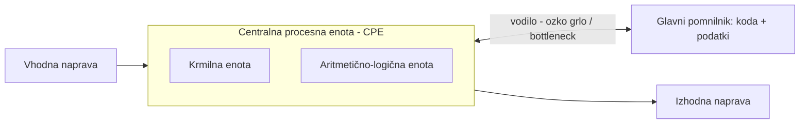

Glavna slabost Von Neumannove arhitekture je povezava (vodilo) med CPE in pomnilnikom - imenujemo jo **ozko grlo** (angl. *bottleneck*). Koda mora po tem istem vodilu potovati do CPE, kjer se izvede, nato pa se po njem vrnejo še rezultati. Razumevanje arhitekture računalnika zato omogoča pisanje učinkovitejših programov - pri programih, kjer je hitrost ključna (npr. gonilniki), je temu treba posvetiti posebno pozornost.

### Električni signali

Digitalni podatki in ukazi so v računalniku kodirani kot elektronski signali z dvema stanjema:

- **signal prisoten** - napetost med približno 2 V (oz. 4 V) in 5 V, logična vrednost 1 (true),
- **signala ni** - napetost med 0 in 1 V, logična vrednost 0 (false).

Na tem dvostanjskem kodiranju temelji binarni zapis podatkov in ukazov. Ker segrevanje poslabša napetostne nivoje (CPE oz. tranzistorji delujejo pod napetostjo), je računalnike treba hladiti.

### Boolova algebra

Matematično osnovo digitalne logike je postavil George Boole (1815-1864). Osnovne operacije Boolove algebre:

- in/AND: \( \wedge \), \( \& \), \( \cdot \)
- ali/OR: \( \vee \), \( + \)
- negacija/NOT: \( \neg \), \( \bar{A} \)
- negirani in/NAND
- negirani ali/NOR
- ekskluzivni ali/XOR: \( \oplus \)

### Izrazno polni nabor

Nabor operacij je **izrazno poln**, če lahko z njim izrazimo vse ostale Boolove operacije. En tak nabor je \( \{\text{in}, \text{ali}, \text{negacija}\} \) - a izkaže se, da zadostuje že en sam operator: **NAND** ali **NOR** sta vsak zase izrazno polna, saj z njima lahko sestavimo negacijo:

\[ \neg A \Leftrightarrow \neg(A\wedge A) \qquad \neg A \Leftrightarrow \neg(A\vee A) \]

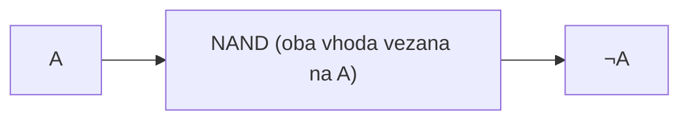

Pri tem si pomagamo z **De Morganovima zakonoma**:

\[ \neg(A\vee B) \Leftrightarrow (\neg A)\wedge(\neg B) \qquad \neg(A\wedge B) \Leftrightarrow (\neg A)\vee(\neg B) \]

### Logična vrata in pravilnostne tabele

**NOT** (IEC simbol "1"):

| vhod | izhod |
|---|---|
| 0 | 1 |
| 1 | 0 |

**NAND** (IEC simbol "&" z zankico na izhodu):

| v1 | v2 | izhod |
|---|---|---|
| 0 | 0 | 1 |
| 0 | 1 | 1 |
| 1 | 0 | 1 |
| 1 | 1 | 0 |

**NOR** (IEC simbol "≥1" z zankico na izhodu):

| v1 | v2 | izhod |
|---|---|---|
| 0 | 0 | 1 |
| 0 | 1 | 0 |
| 1 | 0 | 0 |
| 1 | 1 | 0 |

### Zgled: Boolova funkcija za prižiganje luči na stopnišču

Luč naj se prižge, če je pritisnjeno katero od dveh stikal:

\[ \text{Prizgi}(Stikalo_1,Stikalo_2)=Stikalo_1 \vee Stikalo_2 \]

Ker želimo funkcijo izvesti samo z vrati NAND, uporabimo izrazno polnost NAND-a:

\[ \text{Prizgi}(Stikalo_1,Stikalo_2)=\neg(\neg Stikalo_1 \wedge \neg Stikalo_2) = \neg\big(\neg(Stikalo_1\wedge Stikalo_1) \wedge \neg(Stikalo_2\wedge Stikalo_2)\big) \]

kar lahko preverimo z De Morganovim zakonom: \( \neg((\neg s_1 \vee \neg s_1)\wedge(\neg s_2 \vee \neg s_2)) = (s_1\wedge s_1)\vee(s_2\wedge s_2) = s_1 \vee s_2 \).

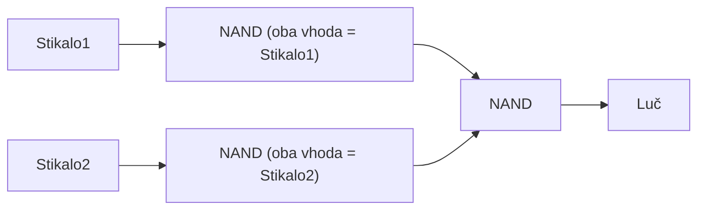

### Zgled: vsota produktov (sum of products)

Za funkcijo \( M(A,B,C) \), podano s pravilnostno tabelo:

| A | B | C | M |
|---|---|---|---|
| 0 | 0 | 0 | 0 |
| 0 | 0 | 1 | 0 |
| 0 | 1 | 0 | 0 |
| 0 | 1 | 1 | 1 |
| 1 | 0 | 0 | 0 |
| 1 | 0 | 1 | 1 |
| 1 | 1 | 0 | 1 |
| 1 | 1 | 1 | 1 |

izraz dobimo kot vsoto produktov (mintermov) za vse vrstice, kjer je \( M=1 \):

\[ M(A,B,C) = \bar{A}BC + A\bar{B}C + AB\bar{C} + ABC \]

Vezje: trije inverterji proizvedejo \( \bar{A},\bar{B},\bar{C} \), štiri 3-vhodna vrata AND izračunajo posamezne minterme, njihovi izhodi pa se združijo na enih vratih OR:

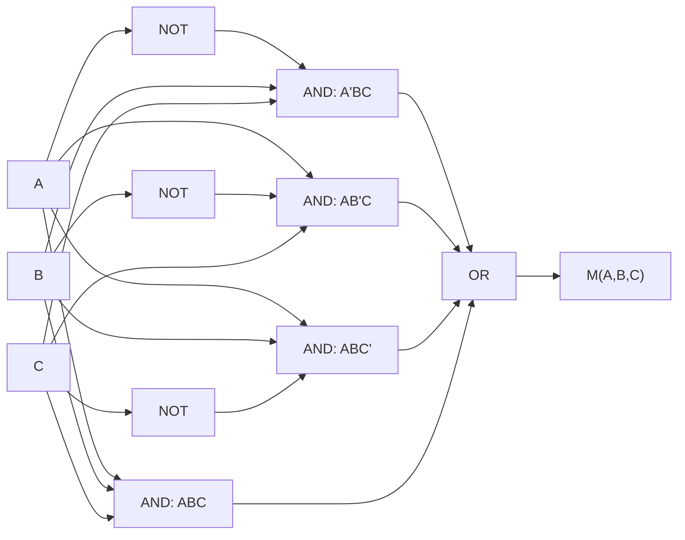

### Integrirano vezje (čip)

Zgodovinsko so logična vrata najprej gradili z elektronkami, ob koncu druge svetovne vojne pa se je pojavil tranzistor, kar je kasneje omogočilo razvoj integriranih vezij (čipov):

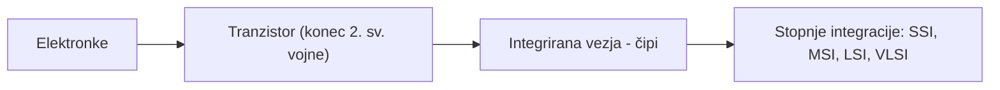

Glede na število vrat na čipu ločimo stopnje integracije **SSI, MSI, LSI** in **VLSI**. Zgled SSI čipov: **7400** (štiri 2-vhodna vrata NAND v enem 14-pinskem ohišju) in **7410** (tri 3-vhodna vrata NAND v enem 14-pinskem ohišju).

### Multiplekser

Multiplekser je vezje za izbiro, kateri od \( 2^n \) vhodnih signalov naj bo prisoten na (enem) izhodu - izbiro določajo n krmilni vhodi. Eden od aktivnih vhodov je tako "prepuščen" na izhod; v CPE s tem npr. povemo, kateri register naj bo aktiven.

Zgled 4-vhodnega multiplekserja z dvema krmilnima vhodoma (sel1, sel0):

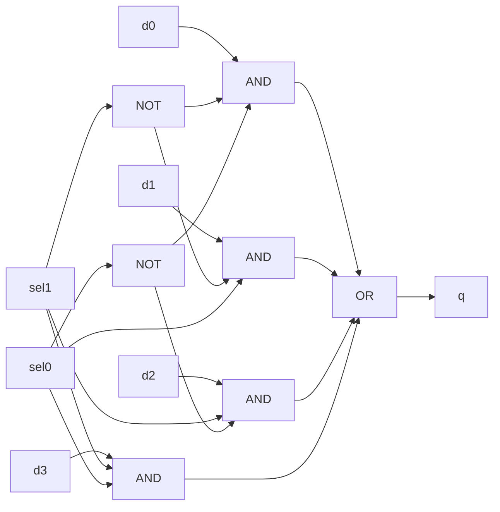

Vsak vhod \( d_i \) je peljan na svoja vrata AND skupaj z ustrezno kombinacijo krmilnih signalov (in njihovih negacij), tako da je v danem trenutku "odprt" natanko en AND, njegov izhod pa gre skozi skupna vrata OR na izhod q. Večje multiplekserje lahko sestavimo iz manjših (npr. 2/1 in 4/1 v 8/1, 16/1 ...).

### Dekodirnik

Dekodirnik (včasih imenovan tudi demultiplekser) opravlja obratno funkcijo kot multiplekser: eno vhodno vrednost preslika na enega od \( 2^n \) izhodov, ki ga določajo n krmilni vhodi - torej je eden od aktivnih izhodov odraz vhoda.

Zgled 3-vhodnega dekodirnika na 8 izhodov (a2, a1, a0):

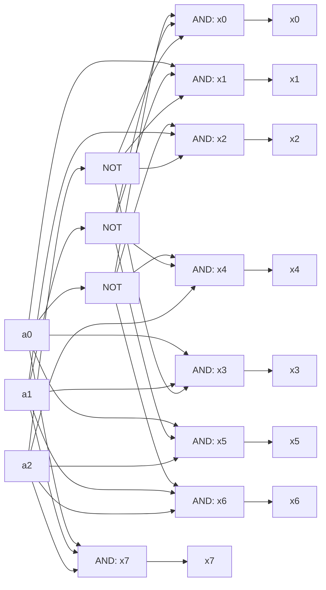

Vsaka izhodna veja \( x_i \) ima svoja vrata AND, ki sprejmejo ustrezno kombinacijo \( a_2,a_1,a_0 \) in njihovih negacij - natanko tisto kombinacijo, pri kateri binarni zapis i ustreza vhodu. Dekodirnike praviloma gradimo z nizkoaktivnimi vhodi/izhodi (manjša obremenitev, manjša zakasnitev), večje pa lahko sestavimo iz manjših.

### Polni seštevalnik (seštevalnik z vhodnim prenosom)

Ena osnovnih operacij, ki jih mora znati računalnik, je seštevanje binarnih števil. Pri seštevanju dveh bitov se lahko zgodi tudi prenos (*carry*) vrednosti na naslednje (višje) mesto. Polni seštevalnik (P.S.) sprejme tri vhode - sumanda \( a_i, b_i \) in vhodni prenos \( c_{in} \) - ter vrne vsoto s in izhodni prenos c:

\[ S=(A\oplus B)\oplus C_{in} \qquad C_{out}=(A\wedge B)\vee\big(C_{in}\wedge(A\oplus B)\big) \]

| A | B | C_in | S | C_out |
|---|---|---|---|---|
| 0 | 0 | 0 | 0 | 0 |
| 0 | 0 | 1 | 1 | 0 |
| 0 | 1 | 0 | 1 | 0 |
| 0 | 1 | 1 | 0 | 1 |
| 1 | 0 | 0 | 1 | 0 |
| 1 | 0 | 1 | 0 | 1 |
| 1 | 1 | 0 | 0 | 1 |
| 1 | 1 | 1 | 1 | 1 |

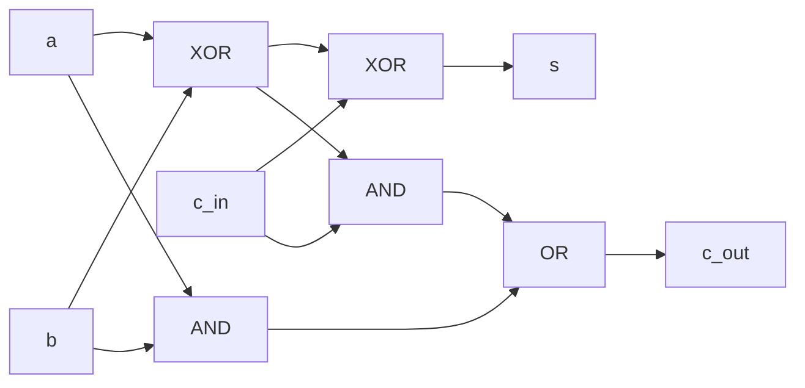

Za seštevanje n-bitnih števil povežemo n polnih seštevalnikov med seboj (prenos vsakega gre na vhod naslednjega).

### Dvojiška aritmetika - seštevanje

Osnovna pravila seštevanja dveh bitov:

\[ 0+0=0 \qquad 0+1=1 \qquad 1+0=1 \qquad 1+1=10\ (\text{enica gre v prenos}) \]

Zgled seštevanja večbitnih števil, \( 1010_2 (=10) + 1111_2 (=15) \):

```
  1 1      <- prenosi
  1 0 1 0
+ 1 1 1 1
---------
1 1 0 0 1   (= 25)
```

Računalnik (ALU) torej zna seštevati z verigo polnih seštevalnikov, množenje pa opravlja ločena enota (množilnik).

### Večbitni seštevalnik

V računalniku obstaja seštevalnik, odštevalnika pa ne - odštevanje implementiramo kot seštevanje z negiranim drugim sumandom: \( A-B=A+(-B) \). Množilnik pogleda predznaka in zmnoži absolutni vrednosti, delilnika pa (podobno kot odštevalnika) v računalniku ni.

Za seštevanje n-bitnih števil povežemo n polnih seštevalnikov v verigo - prenos (carry) vsakega seštevalnika gre na vhod naslednjega:

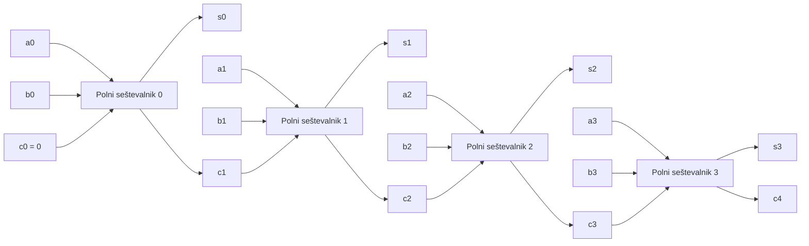

### Izvedba vezij s PLA

**PLA** (programirljivo logično polje) je vezje za izvedbo poljubne kombinacijske funkcije kot vsote produktov: vhodi (in njihove negacije) se peljejo na **AND-matriko**, ki tvori produktne člene (minterme), ti pa se preko programirljivih povezav ("fuses") združijo na **OR-matriki** v končne izhode.

Zgled: polni seštevalnik, izveden s PLA. Produktni člen \( ABC_{in} \) je skupen obema izhodoma - to je bistvo PLA pristopa, saj se produktni členi lahko delijo med več izhodi:

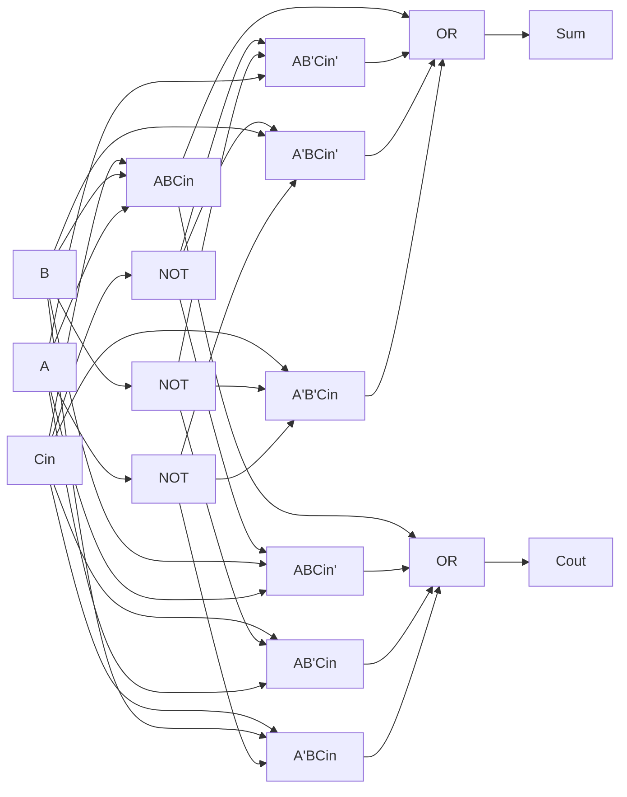

### Ura

Zaporedje in pravočasnost signalov sta ključnega pomena za pravilno delovanje elektronskega vezja - predhodni izhodi morajo biti pravilni in na voljo pravočasno za nadaljnjo obdelavo, poleg tega pa spreminjanje stanja med 0 in 1 ni trenutno. Zato uvedemo signal pravokotne oblike, imenovan **ura** (clock), ki poskrbi za usklajeno časovno zaporedje:

```
__|‾‾|____|‾‾|____|‾‾|____|‾‾|__
```

### Kombinacijska in sekvenčna vezja

- **Kombinacijsko vezje** - izhod je odvisen samo od trenutnih vhodnih signalov.
- **Sekvenčno vezje** - izhodni signal je odvisen od vhodov IN preteklega stanja vezja (končni avtomat, tj. avtomat prehajanja stanj). Stanje se hrani v RAM-u, registrih in predpomnilnikih - torej v elementih, ki znajo shraniti neko informacijo.

### Zadrževalnik (latch) in flip-flop

Zadrževalnik omogoči, da se informacija zadrži dlje časa - uporaben je za izvedbo (implementacijo) pomnilnika oz. registra.

**SR zadrževalnik**: signal S (*set*) postavi zadrževalnik v stanje 1, signal R (*reset*) pa v stanje 0. Sestavljen je iz dveh navzkrižno povezanih vrat NOR:

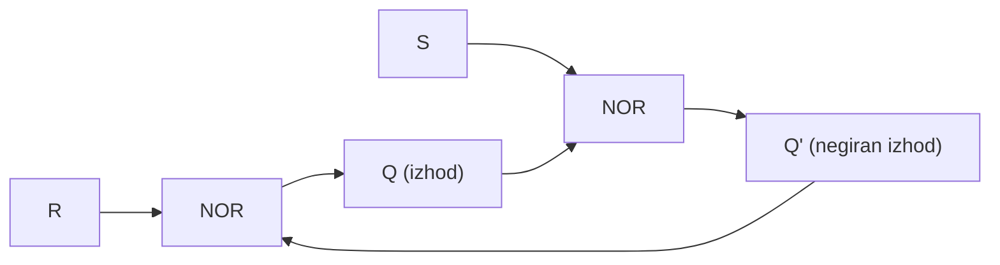

Funkcija SR zadrževalnika (\( Q_t \) - trenutno stanje, \( Q_{t+1} \) - novo stanje):

| Q_t | S_t | R_t | Q_t+1 |
|---|---|---|---|
| 0 | 0 | 0 | 0 |
| 0 | 0 | 1 | 0 |
| 0 | 1 | 0 | 1 |
| 0 | 1 | 1 | (ni dovoljeno) |
| 1 | 0 | 0 | 1 |
| 1 | 0 | 1 | 0 |
| 1 | 1 | 0 | 1 |
| 1 | 1 | 1 | (ni dovoljeno) |

Poznamo še **D zadrževalnik**, ki odpravi neprijetnost dveh vhodov (en sam podatkovni vhod D), ter **flip-flope**, ki stanje spremenijo šele ob spremembi (fronti) vhoda/ure.

### Izvedba pomnilnika

Pomnilnik je zgrajen kot mreža pomnilnih celic: **vrstični dekodirnik** izbere vrstico (naslov A0,A1,A2), **stolpčni dekodirnik** (hkrati multiplekser/demultiplekser) pa izbere stolpec (naslov A3,A4,A5) - presek vrstice in stolpca določi natanko eno celico, ki hrani en bit in ima svoje krmiljenje branja/pisanja:

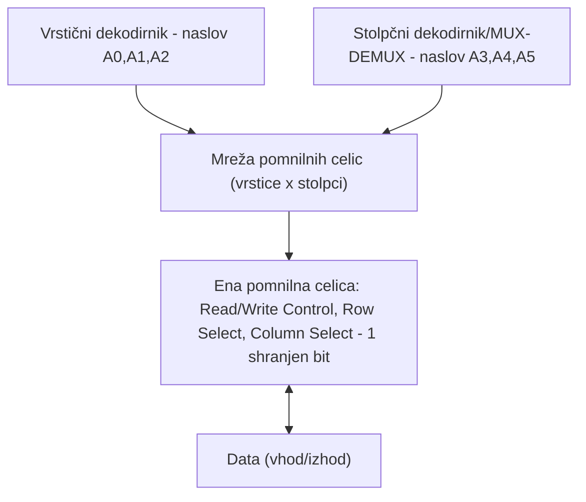

Zgled: mreža 8x8 celic ponuja 64 bitov prostora. Ker eno celo število (int) potrebuje 32 bitov, bi v ta prostor lahko shranili največ 2 celi števili.

### Tehnologije izvedbe digitalnih vezij

**TTL** (transistor-transistor logic, 1961) - uporablja se pri enostavnih sistemih.
- Prednosti: ob pojavu je predstavljala napredek, enostavno načrtovanje (mešanje in povezave ena-na-več), manjša občutljivost na statična praznjenja (kot CMOS).
- Slabosti: statična poraba, večja poraba (kot CMOS), asimetrija upornosti v stanjih (vodila).

**CMOS** (complementary metal-oxide-semiconductor, 1967) - uporablja se za mikroprocesorje, mikrokrmilnike, SRAM in digitalna vezja.
- Prednosti: majhna statična poraba (reda nA), odpornost na šum, omogoča VLSI.
- Slabosti: dinamična poraba (preklopno-tokovna špica, odvisna od frekvence), statična poraba (pri VLSI zaradi števila tranzistorjev).

Današnje naprave (npr. telefoni) uporabljajo CMOS. Kar je danes "novega", niso toliko tehnologije, kot materiali za izdelavo čipov - nekdaj predvsem silicij, danes tudi žlahtnejše kovine (srebro, zlato ipd.).

## Predstavitev podatkov

Podatki, namenjeni obdelavi, prenosu ali shranjevanju, morajo biti predstavljeni v primerni obliki glede na:

- **jezik** (slovenski, angleški ..., C++, zbirni jezik),
- **medij** (v glavi, na listu papirja, na DVD-ju, disku),
- **kodiranje/preslikavo** (skriti pomen besed ali besednih zvez, zapis v latinici, zapis z binarnim zaporedjem ipd.).

Sodobni računalnik podatke obdeluje v dvojiški (binarni) obliki.

### Številski sistemi

Običajno uporabljamo **desetiški sistem** (razlog: deset prstov na obeh rokah):

\[ 101_{(10)} = 1\cdot10^0 + 0\cdot10^1 + 1\cdot10^2 = 101 \]

Računalniki uporabljajo **dvojiški sistem**:

\[ 101_{(2)} = 1\cdot2^0 + 0\cdot2^1 + 1\cdot2^2 = 5_{(10)} \]

Pogost je tudi **šestnajstiški sistem**:

\[ 101_{(16)} = 1\cdot16^0 + 0\cdot16^1 + 1\cdot16^2 = 257_{(10)} \]

V računalniku so vsi podatki predstavljeni kot binarna kombinacija bitov določene bitne širine: **cela števila**, **znakovni podatki**, **realna števila** in **ostali (sestavljeni, kodirani) podatki**.

### Predstavitev celih števil

**Zapis s predznakom (sign-magnitude)**: prvi bit je rezerviran za predznak (0 - pozitivno, 1 - negativno število), preostali biti pa predstavljajo absolutno vrednost:

\[ +11_{(10)} = 0000\,0000\,0000\,1011_{(2)} \qquad -11_{(10)} = 1000\,0000\,0000\,1011_{(2)} \]

Slabosti: problem dvojne vrednosti ničle (+0 in -0), predznak je treba posebej upoštevati pri aritmetiki.

**Dvojiški komplement**: negativna števila predstavimo z dvojiškim komplementom - rešitev brez dvojne ničle in z enostavnejšo aritmetiko. Postopek pretvorbe negativnega števila:

1. Število pretvorimo v dvojiško število po običajnem postopku (kot pozitivno, brez upoštevanja predznaka).
2. Obrnemo vse bite (0 v 1 in 1 v 0).
3. Obrnjenemu številu prištejemo 1.

Zgled: pretvorba -118 v 8-bitni dvojiški komplement:

1. Dvojiško število 118 je \( 01110110 \).
2. Ko obrnemo vse bite, dobimo \( 10001001 \).
3. Ko obrnjenemu številu prištejemo 1, dobimo \( 10001001+1=10001010 \).

Torej je -118 v 8-bitnem dvojiškem komplementu enako \( 10001010 \).

Obseg vrednosti:
- osembitni dvojiški komplement: največja vrednost \( 01111111=2^7-1=127 \), najmanjša \( 10000000=-2^7=-128 \);
- šestnajstbitni dvojiški komplement: največja vrednost \( 0111111111111111=2^{15}-1=32767 \), najmanjša \( 1000000000000000=-2^{15}=-32768 \).

**Pretvorba bitnih širin**: pri povečevanju širine pozitivnim številom spredaj dodamo ničle, negativnim pa enice (razširitev predznaka) - npr. \( +18 \) je 8-bitno \( 00010010 \), 16-bitno \( 0000000000010010 \); \( -18 \) je 8-bitno \( 11101110 \), 16-bitno \( 1111111111101110 \). Pri krčenju bitne širine obstaja nevarnost izgube natančnosti.

**Odštevanje** izvedemo kot seštevanje z dvojiškim komplementom drugega sumanda: \( A-B=A+(-B) \) - prednost je, da potrebujemo samo vezja za seštevanje in negacijo.

### Predstavitev realnih števil

Realno število bi lahko predstavili 'klasično' binarno, s fiksno vejico - npr. \( 1001{,}1010_{(2)} = 2^4+2^0+2^{-1}+2^{-3} = 9{,}625_{(10)} \). Vprašanje je, kje v pomnilniku določimo mesto decimalne vejice:

- **fiksna vejica** - slabost: zelo omejen obseg;
- **plavajoča vejica** - slabost: zahtevnejša aritmetika (potreben je FPU).

**Standard IEEE 754** (sprejet leta 1985 s strani inštituta IEEE) je tehnični standard za aritmetiko s plavajočo vejico, ki ga uporablja večina strojnih enot s plavajočo vejico. Temelji na normalizaciji in implicitnem vodilnem bitu mantise; eksponent določa mesto vejice.

| del | 32-bitno število (float) | 64-bitno število (double) |
|---|---|---|
| predznak | 1 bit | 1 bit |
| eksponent | 8 bitov | 11 bitov |
| mantisa | 23 bitov | 52 bitov |
| odmik (bias) | 127 | 1023 |

Vrednost shranjenega števila izračunamo kot:

\[ (-1)^{\text{predznak}} \times 1{,}\text{mantisa} \times 2^{(\text{eksponent}-\text{odmik})} \]

IEEE-754 float lahko natančno predstavi vsa cela števila do \( 2^{24} \) (splošno do \( 2^{\text{št. bitov mantise}+1} \)).

Zgled dekodiranja 32-bitnega realnega števila \( 11000001\ 00011100\ 00000000\ 00000000 \):

- predznak: 1
- eksponent: \( 10000010_{(2)} = 130_{(10)} \)
- mantisa: \( 00111000000000000000000 \)

\[ (-1)^1 \times 1{,}00111_{(2)} \times 2^{130-127} = -1 \times 1{,}21875 \times 8 = -9{,}75_{(10)} \]

Obraten postopek - zapis števila -9,75 v 32-bitni obliki:

1. \( 9{,}75 \) v binarno obliko: \( 1001{,}11 \).
2. Normaliziramo: \( 1{,}00111 \times 2^3 \).
3. Preberemo mantiso in dodamo ničle: \( 00111000000000000000000 \).
4. Izračunamo eksponent in ga pretvorimo v binarno obliko: \( 127+3=130_{(10)}=10000010_{(2)} \).
5. Predznak za negativno število je 1.
6. 32-bitna predstavitev: \( 1100\,0001\,0001\,1100\,0000\,0000\,0000\,0000 \).

**Denormalizirana oblika**: eksponent ima vse bite 0, mantisa pa je različna od 0 - omogoča postopno slabšanje natančnosti za zelo majhne vrednosti.

**Posebne vrednosti**: dve ničli (+0 in -0, eksponent in mantisa sta 0), \( +\infty \) in \( -\infty \) (eksponent same enice, mantisa same ničle), ter **NaN** (Not a Number: eksponent same enice, mantisa različna od 0) - C++ v takem primeru pusti vrednost, ne vrne napake.

**Aritmetika s plavajočo vejico** se izvaja programsko (počasneje) ali s posebno enoto FPU. Ker so operacije med števili različnih bitnih širin zahtevne, ima Intelova FPU interno predstavitev števil s plavajočo vejico v 80-bitni obliki (80-bitni registri).

## Znaki in ostali podatki

### Predstavitev znakovnih podatkov

Znaki so v računalniku predstavljeni na več načinov - računalnik uporablja **kodne tabele** za preslikavo znakovnih podatkov v številske vrednosti. Pogoste tabele preslikav: **ASCII** (7 bitov), **ISO-8859-2** (8 bitov), **CP1250** (8 bitov), **UTF-8** (kodira Universal Character Set - UCS) idr.

Primeri preslikav za tabelo ASCII:

| znak | dec | binarno |
|---|---|---|
| A | 65 | 1000001 |
| B | 66 | 1000010 |
| C | 67 | 1000011 |
| ... | ... | ... |
| Z | 90 | 1011010 |

### Unicode

**Unicode** je standard za predstavitev in delo z znakovnimi podatki iz večine svetovnih pisav - kodira univerzalni znakovni nabor (UCS, ISO/IEC 10646). Leta 2017 je obsegal 1.114.111 znakov (hex 10FFFF). Vsebuje tudi navodila za obliko črk in njihove lastnosti (velika/mala črka ...).

Rast standarda skozi čas:

| različica | leto | definiranih znakov |
|---|---|---|
| Unicode 1.0 | 1991 | 7.161 |
| Unicode 5.0 | 2006 | 99.089 |
| Unicode 6.0 | 2010 | 110.000 |
| Unicode 11.0 | 2018 | 137.439 |

Unicode kodira črke evropskih (latinica, cirilica), azijskih (kitajske, tajske, korejske pismenke), afriških, ameriških in drugih pisav, poleg tega pa še številne druge znake in pomenke: karte, note, rimske števke, matematične znake, smeškote, geometrične like idr.

### UTF-8 kodiranje

Najbolj poznano kodiranje abecede Unicode je **UTF-8** - kodiranje s spremenljivo dolžino, kjer je vsaka črka iz nabora Unicode kodirana z 1 do 4 zlogi:

1. če je prvi bit 0, sledi sedem bitov za kodo - enako kot prvih 128 kod iz ASCII;
2. če je prvi bit 1, število vodilnih enic (do prvega 0) pove dolžino kode v bajtih.

| razpon Unicode | bajt 1 | bajt 2 | bajt 3 | bajt 4 | zgled |
|---|---|---|---|---|---|
| U+0000-U+007F | 0xxxxxxx | | | | '$' U+0024 → 00100100 → 0x24 |
| U+0080-U+07FF | 110yyyxx | 10xxxxxx | | | '¢' U+00A2 → 0xC2,0xA2 |
| U+0800-U+FFFF | 1110yyyy | 10yyyyxx | 10xxxxxx | | '€' U+20AC → 0xE2,0x82,0xAC |
| U+10000-U+10FFFF | 11110zzz | 10zzzzyy | 10yyyyxx | 10xxxxxx | npr. U+024B62 → 0xF0,0xA4,0xAD,0xA2 |

Zgled kodiranja/dekodiranja: Unicode znak 65 (A) → UTF-8 koda \( 01000001 \); obratno, UTF-8 koda \( 01000001 \) → znak št. 65.

### Pasti kodiranja UTF-8

- pri ASCII je dolžina zapisa fiksna, zato je izračun potrebnega prostora preprost; pri UTF-8 je dolžina spremenljiva, zato je izračun zahtevnejši;
- isto vrednost je možno kodirati z več različnimi kodami (npr. \( 0x00 = 0xC0\ 0x00 \)) - to je varnostna ranljivost (t. i. *overlong encoding*);
- treba je obravnavati izjeme pri napačnem kodiranju (bajta 0xFE, 0xFF);
- napačno dekodiranje pri prenosu lahko povzroči čudne interpretacije zapisanih znakov (pogosto vidno pri dokumentih).

Primerjava z **UTF-16**, ki vse znake kodira fiksno z dvema bajtoma (širše uporabljen v nekaterih sistemih, a porabi več pomnilnika): znak "A" je v UTF-16 predstavljen z 2 bajtoma (0 in 65), v UTF-8 pa z enim samim bajtom (65) - UTF-8 je torej za besedilo, pretežno sestavljeno iz ASCII znakov, učinkovitejši.

### Predstavitev ostalih podatkov

**Nizi**: v C++ se niz zaključi z znakom \0 (zaseda 1 zlog); alternativne (wide-char) predstavitve uporabljajo 4 zloge na znak.

**Sestavljeni podatkovni tipi** (običajno zaporedne lokacije v pomnilniku): nizi (polje znakov z zaključnim simbolom), datumi (tri celoštevilske vrednosti), čas (ure, minute, sekunde kot cela števila).

**Kodiranje** (preslikava v številsko vrednost, podobno kot pri znakovnih podatkih): čas kot število sekund od leta 1970, siva barva kot lestvica od bele do črne.

### Kompresirano kodiranje podatkov

Pri kodiranju podatkov želimo predstaviti informacijo, ki jo nosijo, s čim manj prostora - velikost idealne kode je enaka velikosti informacije, ki jo nosi.

**Izkustveno (hevristično) kodiranje**: manj pogosto uporabljeni znaki dobijo daljšo kodo.

- **Morsejeva koda** (telegraf): npr. E = \( - \), T = \( \text{‒} \), I = \( -\, - \), Z = \( \text{‒‒}\,-\,- \), 5 = \( -\,-\,-\,-\,- \).
- **Huffmanovo/aritmetično kodiranje**: kode razporedimo v binarno drevo - pogostejši znaki dobijo krajšo pot od korena. Zgled kod: presledek = 111, e = 000, a = 010, x = 10010:

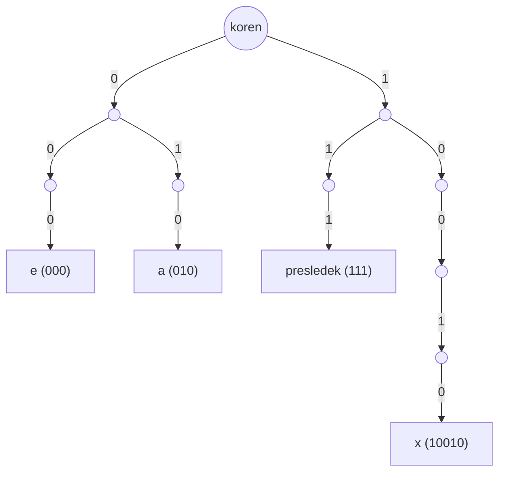

Kvantizacija tovrstnega kodiranja se uporablja pri formatih DEFLATE (PKZIP), JPEG, MP3 idr.

### Kriptografija

Ločimo **kodiranje** (stalna, javna tabela preslikav - npr. E=3, L=1 daje "133t"-zapis; substitucijska tabela O=L, G=P, D=X preslika "GOOD DOG" v "PLLX XLP") in **šifriranje** (preslikava s skrivnim ključem).

Glede na ključ ločimo:

- **simetrično šifriranje** - enak ključ za šifriranje in dešifriranje, hitro (npr. AES/DES) - temelji na substitucijsko-permutacijski mreži operacij (XOR, bitne rotacije ...);
- **asimetrično šifriranje** - različna ključa za šifriranje in dešifriranje (npr. RSA): šifriranje poteka kot deljenje po modulu n (javen) in eksponiranje po eksponentu e (zaseben),

\[ c = m^e \bmod n \]

kjer morata biti n in e veliki in medsebojno tuji števili - za iskanje velikih praštevil se uporabljajo verjetnostni (probabilistični) algoritmi.

### Genetika in drugi primeri kodiranja

**DNK**: kodoni so zapisani s štirimi bazami (T - timin, C - citozin, A - adenin, G - gvanin); vsak kodon lahko preslikamo v binarno kodo, npr. GCA=0000, AGA=0001, GAT=0010 itd. Zvijanje proteinov pomeni, da struktura proteina določa njegovo funkcijo.

**Genski zapis v evolucijskih algoritmih**: spremenljivke pri iskanju optimuma (črna škatla) matematične funkcije lahko kodiramo kot genski zapis - npr. pri generiranju drevesa lahko kodiramo število vej, višino prvega odseka debla, koeficient debeline veje in kot filotakse, nato pa z genetskim algoritmom (kolektivna inteligenca, diferencialna evolucija) iščemo optimalne vrednosti.

## Instrukcije in naslavljanja

Program in koda sta shranjena v glavnem pomnilniku; od tam ukazi (instrukcije) potujejo preko predpomnilnika do procesorja, kjer se izvedejo. Tematika zajema: zbirni jezik, strojni jezik (koda, ki jo razume računalnik), naslavljanja (s čimer dostopamo do pomnilnika in registrov v procesorju) ter instrukcije.

### Program in semantični prepad

Računalnik izvaja programe, sestavljene iz zaporedja ukazov; procesor pa razume le binarno zapisane ukaze. Uporabnik želi ukaze podajati v obliki, podobni naravnemu jeziku - a naravni jezik je dvoumen (npr. "vile" lahko pomenijo orodje ali pravljična bitja), medtem ko mora biti strojni zapis enoumen. Ta razkorak (semantični prepad) premoščajo kompleksne instrukcije, prevajalniki in interpreterji:

**visoki programski jezik** → (prevajanje) → **zbirni jezik** → (transformacija) → **strojni jezik**

### Instrukcija

- Instrukcija je ukaz procesorju - enoumna binarna predstavitev v strojnem kodu (dvoumnost bi pomenila, da procesor ne bi vedel, kaj storiti).
- Instrukcije se med procesorjem in pomnilnikom (kjer sta koda in podatki) prenašajo preko vodil.
- **Nabor instrukcij** je množica ukazov, ki jih CPE razume in interpretira - določa arhitekturo instrukcijske množice (ISA).
- Instrukcija je sestavljena iz **operacijske kode** (določa operacijo, npr. seštevanje, odštevanje, primerjavo) in **operandov** (lahko so registri, naslovi ali neposredno podane vrednosti).

### Instrukcijski cikel

Instrukcijski cikel se zgodi v Von Neumannovi arhitekturi - gre za proces, kako instrukcija pride iz pomnilnika v CPE in se izvede. Programski števec pove, katera koda se bo izvajala naslednja. Instrukcija se prevzame, dekodira, izračuna se naslov operanda(-ov), operand(-i) se prevzamejo, izvede se operacija, izračuna se naslov(-i) za rezultat(-e), rezultat(-i) pa se shranijo. Med CPE in pomnilnikom poteka veliko prenosa, kar predstavlja ozko grlo. Programski števec se po izvedbi instrukcije poveča (za 1 oz. glede na velikost instrukcije) in izvede se naslednja operacija.

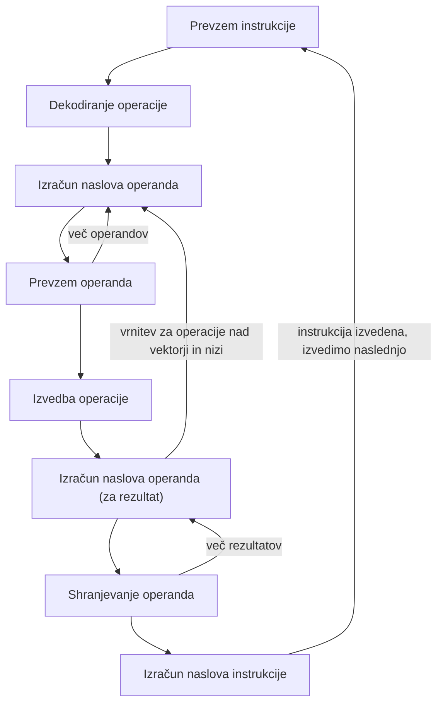

### CISC in RISC

**Complex Instruction Set Computer (CISC)** - namen: zmanjšanje semantičnega prepada pri prevajanju; veliko kompleksnih instrukcij in načinov naslavljanja. Zgledi: System/360, VAX, Motorola 680xx, Intel x86.

**Reduced Instruction Set Computer (RISC)** - prenosljivost binarne kode onemogoča učinkovito izrabo procesorjev, zato se kompleksnost prestavi iz procesorja v prevajalnik: omejen nabor instrukcij, preprostejše oblike naslavljanja (preprosti, a hitro izvedljivi ukazi). Zgledi: DEC Alpha, ARM, SPARC, MIPS, PowerPC.

Danes prevladuje CISC; obstajajo pa tudi hibridni procesorji.

### Oblika predstavitve instrukcije

Instrukcije imajo lahko **stalno** ali **spremenljivo** bitno dolžino (npr. ena instrukcija dolga 8 bitov, druga 64 bitov).

- pri stalni dolžini ostane del pomnilnika med instrukcijami neizkoriščen, a je razpoznava in izvedba preprostejša;
- pri spremenljivi dolžini se prosta mesta v pomnilniku bolje zapolnijo (boljša izkoriščenost pomnilnika), zahtevnejša pa je razpoznava.

Zgled enostavne 16-bitne instrukcije s stalno dolžino:

| operacijska koda | operand 1 | operand 2 |
|---|---|---|
| 4 biti | 6 bitov | 6 bitov |

### Zbirni jezik

Množica instrukcij predstavlja strojni jezik; koda v zbirnem jeziku se vedno pojavi pri prevajanju. Zbirni jezik je človeku prijaznejši, simbolični zapis instrukcij in vključuje: **mnemonike** (simbolični zapis binarnih kod), **spremenljivke**, **psevdoinstrukcije** (direktive prevajalniku) in **oznake** (labele). Med programom v zbirnem jeziku in strojnim kodom obstaja skoraj linearna (1:1) preslikava; za prevod potrebujemo prevajalnik - **zbirnik**.

Zgled: izraz z oznako IZRAZ (LDA) se nahaja na naslovu 101:

| naslov | vsebina (strojni kod) | oznaka | operacija (zbirni jezik) | operand |
|---|---|---|---|---|
| 101 | 0010 0010 0000 0001 | IZRAZ | LDA | I |
| 102 | 0001 0010 0000 0010 | | ADD | J |
| 103 | 0001 0010 0000 0011 | | ADD | K |
| 104 | 0011 0010 0000 0100 | | STA | N |
| 201 | 0000 0000 0000 0010 | I | DATA | 2 |
| 202 | 0000 0000 0000 0011 | J | DATA | 3 |
| 203 | 0000 0000 0000 0100 | K | DATA | 4 |
| 204 | 0000 0000 0000 0000 | N | DATA | 0 |

Zgled prevajanja (transliranja) iz zbirnega v strojni jezik: ukaz `add esp, 4` (poveča vrednost registra esp za 4) prevajalnik za x86 prevede v 32-bitni binarni kod \( \text{c48100040000}_{(16)} \) - koda operacije je 81, operand esp je c4, operand 4 pa 00040000 (16-bitni besedi sta zamenjani).

Računalnik v pomnilniku ne razlikuje med instrukcijami in podatki - v zgodovini je bilo vse zapisano zgolj kot zaporedje ničel in enic, zato je bilo težko ločiti, kaj je podatek in kaj instrukcija. Zaradi tega se je ob napakah v kodi lahko zgodilo, da je prevajalnik "skočil" naprej in je ista koda pomenila nekaj popolnoma drugega (npr. namesto for zanke le navadno priredit). Sodobni operacijski sistemi omogočajo jasno ločitev instrukcij od podatkov. Vsak procesor ima svoj nabor funkcij, prevajalnik pa mora na njegovi podlagi sestaviti pravi nabor podatkov in ukazov za ta procesor.

### Vrste instrukcij

- **aritmetične in logične** - računanje;
- **pretvorbene** - pretvorba med tipi;
- **prenos in shranjevanje podatkov**;
- **krmilne** - krmilijo npr. podatkovni tok;
- **sistemske (privilegirane)** - služijo za reševanje prekinitev (nečesa, kar pride od zunaj in zaradi česar procesor ne more nadaljevati - npr. premik miške je treba rešiti v obliki prekinitve);
- **pasti** - npr. deljenje z 0; pri 32-bitnem naslovu mora biti naslov v pomnilniku deljiv s 4, pri 64-bitnem pa z 8.

### Aritmetične operacije

Seštevanje, odštevanje, množenje, deljenje idr. - nad predznačenimi/nepredznačenimi in realnimi števili. Dodatne instrukcije za pogoste operacije: inkrement (a++), dekrement (a--), negacija (-a).

### Premik in rotacija

Pri **premiku** (shift) se biti izgubljajo, na prazno mesto pa se dodaja 0; aritmetični premik v desno ohranja predznak. Pri **rotaciji** se vsi biti ohranijo - izpadli bit se vrne na drugo stran:

```
Premik za eno mesto v levo (izgubljen bit, dodana ničla desno):
[b7 b6 b5 b4 b3 b2 b1 b0] -> [b6 b5 b4 b3 b2 b1 b0 0]   (b7 se izgubi)

Rotacija za eno mesto v desno (noben bit se ne izgubi):
[b7 b6 b5 b4 b3 b2 b1 b0] -> [b0 b7 b6 b5 b4 b3 b2 b1]
```

### Logične operacije

Bitne operacije (nad posameznimi biti): in (and), ali (or), negacija (not), izključujoč ali (xor) idr.

**Privilegirane instrukcije** uporablja operacijski sistem - izvedljive so samo, kadar je CPE v nadzornem (*supervisor*) načinu delovanja. Zgledi: obravnava prekinitev, upravljanje s pomnilnikom, uporaba sistemskih registrov (poleg običajnega nabora registrov obstajajo še dodatni, skriti registri za nivo mikroprogramiranja). Procesor dela v normalnem ali nadzornem načinu; ob prekinitvi preklopi v nadzorni način za kratek, hiter čas in nato vrne rezultat uporabniku.

### Prenos toka izvajanja

- **vejitve** - pogojni in brezpogojni skoki;
- **klic procedure**;
- **vračanje iz procedure**;
- **prekinitve**.

Instrukcije se sicer izvajajo ena za drugo, podobno kot ukazi v programskem jeziku - programski števec se z vsako instrukcijo poveča za 1 oz. glede na njeno velikost (za 4 pri 32-bitni, za 8 pri 64-bitni instrukciji).

Zgled programa s skoki (BRZ - skok, če je rezultat 0 oz. sta vrednosti enaki; BR - brezpogojni skok; BRE - skok, če sta vrednosti registrov enaki):

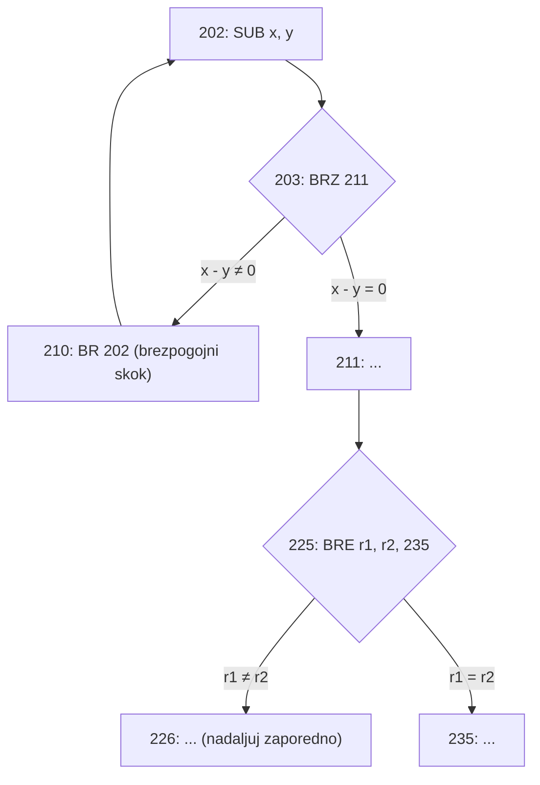

### Zgled: prevod if stavka

En ukaz visokega programskega jezika se v ozadju razgradi v več instrukcij (1 ukaz = več instrukcij). Zgled za `if (a == 5) a = b * b;`:

| naslov | instrukcija | operand |
|---|---|---|
| 0 | LOAD | 8 |
| 1 | SUB | 9 |
| 2 | JUMPZERO | 5 |
| 3 | STOP | |
| 5 | LOAD | 10 |
| 6 | MUL | 10 |
| 7 | STORE | 9 |
| 8 | DATA | 5 |
| 9 | DATA | a |
| 10 | DATA | b |

### Zgled: prevod while zanke (iteracije)

Zgled za `int f = 1, n = 5; while (n > 0) { f = f * n; n--; }`:

| naslov | instrukcija | operand |
|---|---|---|
| 0 | LOAD | #1 |
| 1 | STORE | 101 |
| 2 | LOAD | 100 |
| 3 | JUMPZERO | 10 |
| 4 | MUL | 101 |
| 5 | STORE | 101 |
| 6 | LOAD | 100 |
| 7 | SUB | #1 |
| 8 | STORE | 100 |
| 9 | JUMP | 2 |
| 10 | STOP | |

kjer naslov 100 hrani n (začetna vrednost 5), naslov 101 pa rezultat f. `#1` je direktna (neposredna) vrednost, zapisana znotraj same instrukcije - poseben tip naslavljanja: številka 1 se shrani v poseben register, imenovan **akumulator**, ki se nato uporabi za izračune.

Ko nalagalnik nalaga programe, lahko kodo prenese na katerokoli prosto mesto v pomnilniku - posledično instrukcije niso nujno shranjene zaporedoma, temveč so lahko pomešane, nalagalnik pa mora pravilno povezati naslove, kje se kateri del nahaja.

### Zgled: klic procedure

Zgled za klic `max2(3, 6)`:

| naslov | instrukcija | operand |
|---|---|---|
| 0 | PUSH | #6 |
| 1 | PUSH | #3 |
| 2 | CALL | 100 |
| 100 | LOADL | 1 |
| 101 | SUBL | 2 |
| 102 | JUMPNEG | 106 |
| 110 | RET | |

Če imamo sestavljeni podatkovni tip (npr. objekt), se ta na sklad pošlje kot referenca - prevajalnik referenco razume kot kazalec, ki kaže na nek naslov v pomnilniku.

### Tipi operandov

Operandi so binarno kodirane vrednosti, ki jih vsaka instrukcija nosi s sabo - predstavljajo lahko naslove, števila, znake, logične podatke (zastavice, biti) idr.

### Formati instrukcije

- **fiksen** - dolžina instrukcije in število operandov sta stalna; značilno za RISC računalnike;
- **variabilen** - dolžina instrukcije, število operandov in dolžina operandov so spremenljivi; značilno za CISC računalnike.

Format instrukcije določa tudi način programiranja v zbirnem jeziku.

### Prenos podatkov

V instrukciji podamo izvor, ponor in količino podatkov - najpogostejše opravilo je kopiranje (premik podatkov iz ene lokacije na drugo, npr. iz pomnilnika v CPE). Nekateri procesorji imajo različne instrukcije za različne vrste premikov (npr. na x86: `movsb` ali `mov eax, ebx`), drugi pa eno instrukcijo z različnimi načini naslavljanja (npr. `mov eax, 1` ali `mov eax, [ebx]`).

### Instrukcije s tremi, dvema, enim in brez naslovov

**Instrukcije s tremi naslovi** - vsak operand ima svoj naslov: `ADD operand1, operand2, rezultat` (rezultat = operand1 + operand2); operand1, operand2 in rezultat so vsi naslovi v pomnilniku. Potrebujemo dolge instrukcije za hranjenje vseh naslovov, več prenosov podatkov in več registrov za naslove - več registrov ima CPE, lažje je programirati.

**Instrukcije z dvema naslovoma** - en naslov je hkrati izvorni in ponorni operand: `ADD operand1, operand2` (operand2 = operand1 + operand2); vsebina, ki jo je imel operand2 pred operacijo, se izgubi (razen če jo predhodno shranimo drugam). Prednost: krajša dolžina instrukcije. Slabost: dodatno delo s shranjevanjem rezultata na začasno lokacijo, če originalno vsebino še potrebujemo.

**Instrukcije z enim naslovom** - drugi naslov je implicitno podan, običajno register (akumulator): `ADD operand1` (AC = AC + operand1). Značilno za starejše procesorje - treba je natančno vedeti, kateri register se spreminja, saj akumulator po operaciji izgubi predhodno vrednost.

**Instrukcije brez naslovov** - vsi naslovi so implicitni; najdemo jih pri virtualnih strojih (npr. JVM). Zgled - skladovni stroj, kjer so vsi operandi na skladu:

```
push 5 ; na sklad prvi operand
push 3 ; na sklad drugi operand
add    ; sešteje operanda, ju odstrani in na vrh doda rezultat
```

Prednost je preprostost implementacije sklada kot podatkovne strukture; slabost je učinkovitost - sklad je počasen, poleg tega pa je pomemben tudi vrstni red zlaganja operacij na sklad.

### Zgled: Y=(A-B)/(C+D*E) z različnim številom naslovov

**S tronaslovnimi instrukcijami:**

| instrukcija | opomba |
|---|---|
| SUB Y,A,B | Y = A - B |
| MPY T,D,E | T = D * E |
| ADD T,T,C | T = T + C |
| DIV Y,Y,T | Y = Y / T |

**Z dvonaslovnimi instrukcijami:**

| instrukcija | opomba |
|---|---|
| MOVE Y,A | Y = A |
| SUB Y,B | Y = Y - B |
| MOVE T,D | T = D |
| MPY T,E | T = T * E |
| ADD T,C | T = T + C |
| DIV Y,T | Y = Y / T |

**Z enonaslovnimi instrukcijami** (AC - akumulator):

| instrukcija | opomba |
|---|---|
| LOAD D | AC = D |
| MPY E | AC = AC * E |
| ADD C | AC = AC + C |
| STOR Y | Y = AC |
| LOAD A | AC = A |
| SUB B | AC = AC - B |
| DIV Y | AC = AC / Y |
| STOR Y | Y = AC |

**Koliko prostora zasedajo instrukcije?** Ob predpostavki, da instrukcija (opkoda) zaseda 8 bitov, vsak naslov pa prav tako 8 bitov, potrebujemo za zapis zgornjega izraza:

- tronaslovne instrukcije: 4 instrukcije × (8 + 3×8) bitov = 4 × 32 = 128 bitov;
- dvonaslovne instrukcije: 6 instrukcij × (8 + 2×8) bitov = 6 × 24 = 144 bitov;
- enonaslovne instrukcije: 8 instrukcij × (8 + 1×8) bitov = 8 × 16 = 128 bitov.

Če bi instrukcija (opkoda) zasedala le 4 bite, naslov pa še vedno 8 bitov:

- tronaslovne: 4 × (4 + 24) = 4 × 28 = 112 bitov;
- dvonaslovne: 6 × (4 + 16) = 6 × 20 = 120 bitov;
- enonaslovne: 8 × (4 + 8) = 8 × 12 = 96 bitov.

### Naslavljanje

Naslavljanje je sklicevanje na shranjene podatke v pomnilniku. **Efektivni naslov** (EA - Effective Address) je naslov, na katerem se nahaja operand. Podatki so lahko shranjeni v registrih procesorja ali v glavnem pomnilniku, dostopamo pa do njih preko imen (lahko imamo tudi naslov naslova - s kazalci in referencami pridemo do mesta, kjer se operand dejansko nahaja).

Načini naslavljanja: **takojšnje**, **neposredno**, **posredno**, **registrsko**, **registrsko posredno**, **z odmikom**, **skladovno**.

### Takojšnje naslavljanje

Operand je del same instrukcije - EA je znotraj instrukcije, ni pomnilniških naslovov. Hitro, a omejeno z velikostjo vrednosti, ki jo lahko shranimo znotraj instrukcije. Zgled: `ADD #5` - prištej 5 akumulatorju (5 je operand). Instrukcija je tu sestavljena le iz dveh polj: opkode in samega operanda.

### Neposredno (direktno) naslavljanje

Instrukcija vsebuje naslov operanda: EA = A. En ali več pomnilniških naslovov, ni potrebe po izračunu naslova, a je naslovni prostor omejen s širino operanda in potreben je prenos vrednosti iz pomnilnika. Zgled: `ADD A` - akumulatorju prištej vrednost na lokaciji A (operand je na pomnilniški lokaciji A).

### Posredno naslavljanje

Pomnilniška lokacija vsebuje naslov (kazalec) operanda: EA = (A). Zgled: `ADD (A)` - z naslova A preberemo naslov operanda, s tega naslova pa preberemo vrednost operanda in jo prištejemo akumulatorju.


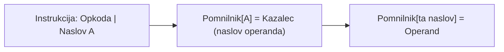

Slabost posrednega naslavljanja je počasnost (potrebnih je več dostopov do pomnilnika); prednost pa, da je lahko vgnezdeno, večnivojsko oz. kaskadno - npr. trikratno posredno naslavljanje: \( (((A))) \).

### Registrsko in registrsko posredno naslavljanje

**Registrsko naslavljanje** - operand se nahaja neposredno v registru: EA = R. Slabost: omejeno število registrov (majhen naslovni prostor). Prednosti: krajša dolžina instrukcije, ni potreben dostop do pomnilnika, zelo hitro. Uporablja se povsod, kjer si podatki v pomnilniku sledijo eden za drugim.

**Registrsko posredno naslavljanje** - operand je na pomnilniški lokaciji, določeni z vrednostjo registra R: EA = (R) - register torej hrani naslov, kjer se v pomnilniku nahaja operand. V primerjavi s posrednim naslavljanjem je potreben en dostop do pomnilnika manj.


### Naslavljanje z odmikom

Instrukcija vsebuje dva naslova: bazni naslov A in odmik D - oba sta lahko podana neposredno (kot vrednosti v instrukciji) ali preko registrov:

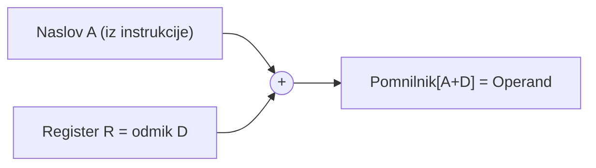

**Relativno naslavljanje** je oblika naslavljanja z odmikom: EA = bazni naslov (podan implicitno) + D. Zgled: naloži vrednost z naslova, ki je D mest od trenutne vrednosti programskega števca (PC). Uporablja se, ker omogoča nalaganje istega programa na različna mesta v pomnilniku (npr. da lahko več uporabnikov hkrati izvaja isti program), poleg tega pa izkorišča lokalnost referenc in predpomnilnik: lokalne spremenljivke so v trenutnem bloku na dosti krajši razdalji kot če bi bile globalne, zato je dostop do njih učinkovitejši in hitrejši.

Druge oblike naslavljanja z odmikom: **bazno registrsko** (npr. segmentni registri pri x86) in **indeksno** (npr. dostop do polj).

### Skladovno naslavljanje

Operand je podan implicitno, na vrhu sklada - zelo omejen naslovni prostor (samo vrh sklada). Značilno za virtualne stroje (npr. JVM). Zgled `ADD`: prebere prvi operand s sklada, prebere drugi operand s sklada, ju sešteje, rezultat pa shrani na vrh sklada. Prednost je preprostost, slabost pa počasnost, saj se delo odvija izven CPE.

### 32-bitna Intel arhitektura

Intel 80386 je bil prvi 32-bitni procesor (prva pojavitev leta 1985, CISC arhitektura) - celotna družina x86 je združljiva z 80386, programsko opremo za i386 najdemo še danes.

Načini delovanja:

- **realni (real)** - združljivost s starejšo programsko opremo;
- **zaščiteni (protected)** - optimalen način delovanja: zaščita pomnilnika, virtualni naslovni prostor, večopravilnost;
- **virtualni (virtual 86)** - hibriden način.

128-bitna arhitektura (še) ni potrebna, ker toliko naslovnega prostora ne rabimo - danes iz pomnilnika običajno naslavljamo okoli 48 bitov in niti ne izkoristimo celotnega razpona trenutne (večinoma 64-bitne) arhitekture; ker glavnega pomnilnika velikosti \( 2^{64} \) nimamo, 128-bitna arhitektura trenutno še ni smiselna. Predhodni (32-bitni) programi so na današnjih 64-bitnih sistemih še vedno delujoči in podprti (kompatibilnost za nazaj).

**Naslovni prostor:**

- **segmentiran pomnilnik** - segmentni registri, značilno za starejše verzije;
- **ravni pomnilniški model (flat memory model)** - možno nasloviti do 4 GB pomnilnika (32-bitni naslovi).

**Virtualni naslovni prostor** pomeni, da vsak program (oz. uporabnik) "vidi", kot da ima na voljo celoten pomnilnik - tudi če na sistemu hkrati teče več programov ali uporabnikov, si pomnilnika ne delijo neposredno, temveč vsak vidi svoj navidezni naslovni prostor v celoti.

**Posebno-namenski registri**: PS (status procesorja), EIP - programski števec (Intelovo poimenovanje), ter sistemske zastavice za prekinitvene rutine, pasti in izjeme (npr. da pomnilnik ne odgovori na klic) ter prekinitve s strani operacijskega sistema.

## Registri in instrukcijska množica arhitekture IA-32

Dobro je, da se podatki, nad katerimi se izvedejo operacije, hranijo čim bliže mestu v procesorju, kjer se operacije dejansko izvedejo - torej v registrih. Ker je registrov malo, mora del podatkov vseeno biti hranjen v pomnilniku (RAM-u).

### Splošnonamenski in segmentni registri

32-bitna arhitektura IA-32 ima: 8 splošnonamenskih registrov, 8 registrov za realne vrednosti, 6 segmentnih registrov in posebnonamenske registre.

Splošnonamenski registri (32-bitni register se deli na 16-bitni del, ta pa še na dva 8-bitna dela):

| 32 bit | 16 bit | 8 bit (visoki/nizki) | vloga |
|---|---|---|---|
| EAX | AX | AH / AL | akumulator |
| EBX | BX | BH / BL | bazni register |
| ECX | CX | CH / CL | count (števec) |
| EDX | DX | DH / DL | data |
| EBP | - | - | |
| ESI | - | - | |
| EDI | - | - | |
| ESP | - | - | |

Segmentni registri (odseki, 16-bitni): CS, DS, SS, ES, FS, GS.

### Registri realnih vrednosti in EFLAGS

Registri realnih vrednosti (R0-R7) so 80-bitni: 1 bit predznaka, 15 bitov eksponenta, 64 bitov mantise.

**Posebnonamenski registri:**

- **EIP** - programski števec.
- **EFLAGS** - statusni register (32 bitov), ki vsebuje informacije o stanju procesorja: rezultate operacij (prenos, preliv, predznak ...), rezultate testov, uporablja pa se predvsem pri vejitvenih instrukcijah. V enem samem registru je tako posnetek stanja (predhodno stanje) nekega procesa pred prekinitvijo. Zastavice so razporejene v skupine:
  - **statusne zastavice** - npr. CF (carry), PF (parity), AF (auxiliary carry), ZF (zero), SF (sign), OF (overflow);
  - **krmilne zastavice** - npr. DF (direction);
  - **sistemske zastavice** - npr. TF, IF, IOPL, NT, RF, VM, AC, VIF, VIP, ID;
  - preostali biti so rezervirani.

### Velikosti podatkovnih enot in razširitve registrov

Osnovne podatkovne enote v arhitekturi IA-32:

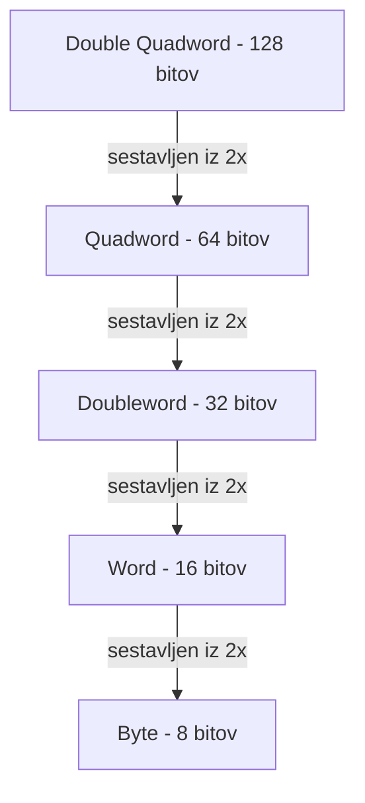

Skozi čas so procesorji nadgrajevali nabor registrov z razširitvami: **MMX** (8 64-bitnih registrov), **SSE** (8 128-bitnih registrov), **SSE2**, **SSE3**, **3DNow!**.

Če so registri prostonamenski (RISC), lahko programer z njimi dela, kar koli želi - npr. če imamo 32 registrov, lahko vsak uporabimo za karkoli. Pri Intelovih procesorjih (CISC) pa so nekateri registri rezervirani za določene, posebej določene ukaze oz. instrukcije.

### Instrukcijska množica CISC

Značilnosti CISC računalnika: variabilen format, kompleksni in številni modeli naslavljanja (enonaslovno, dvonaslovno, trinaslovno itd.), kompleksne operacije, širok nabor instrukcij, razvrščene v skupine (prenos podatkov, aritmetika, krmiljenje).

Format instrukcij je variabilen, kar privarčuje oz. skrajša dolžino prevedenega programa (podobno kot pri UTF-8, ki je prav tako variabilen, saj imamo fiksne bite, dolžina nekega besedila pa je posledično precej krajša, kot bi bila sicer).

### Zgledi naslavljanja v zbirniku (IA-32)

| način naslavljanja | zgled (x86) |
|---|---|
| takojšnje | `mov eax, 1` |
| registrsko (premikamo registre) | `mov eax, ebx` |
| neposredno | `mov eax, [1000]` |
| registrsko posredno | `mov eax, [ebx]` |
| bazno posredno | `mov eax, [ebp+4]` |
| indeksno posredno | `mov eax, [esi+100]` |
| bazno indeksno posredno | `mov eax, [ebp+esi]` ali `mov eax, [ebp+esi+4]` |

### Najpogostejše instrukcije (zbirni jezik x86)

**Prenos podatkov**: `mov`, `movs` - razlika je, da `movs` uporabimo, če imamo v ozadju znake (nize).

**Aritmetika**: `add`, `sub`, `mul`, `div`, `shl`, `shr`.

- **MUL** (unsigned multiply) - pomnoži 8-, 16- ali 32-bitni operand z AL, AX ali EAX. Zastavica Carry označuje, ali zgornja polovica izdelka vsebuje pomembne števke ali ne.
- **DIV** - deli 16-, 32- ali 64-bitno vrednost registra (deljenec) z bajtom registra ali pomnilnika, besedo ali dolgim registrom (delilnik). Kvocient se shrani v register AL, AX ali EAX, preostanek pa v AH, DX ali EDX.
- **SHL** (shift left) - izvede logični premik v levo na ciljnem operandu, najnižji bit se zapolni z 0.
- **SHR** (shift right) - izvede logični premik v desno na ciljnem operandu, najvišji položaj bita se zapolni z 0.

**Primerjava**: `cmp`, `test`.

- **TEST** izvede bitno IN nad dvema operandoma. Zastavice SF, ZF, PF se spremenijo glede na rezultat, medtem ko se rezultat operacije AND zavrže. Zastavici OF in CF se nastavita na 0, zastavica AF pa ostane nedoločena.
- **CMP** (compare) primerja dva operanda - na splošno se uporablja pred pogojno vejitvijo. Navodilo v bistvu odšteje en operand od drugega zato, da bi ju primerjali (sta enaka ali ne).

**Vejitve**: `jge`, `jle`, `je`, `jmp`, `call`, `ret`.

- **jge** pomeni "skoči, če je večji ali enak (SF=OF)" - sinonim za `jnl`.
- **jle** je pogojni skok, ki sledi testu (npr. `cmp`) - izvede podpisani primerjalni skok, če je ciljni operand manjši ali enak izvornemu operandu.
- **je** (jump if equal) - skoči, če je primerjava enaka.
- **jmp** - brezpogojni skok.
- **call** - klicno navodilo, uporabljeno za klic funkcije. Ukaz CALL izvede dve operaciji: potisne povratni naslov (naslov takoj za ukazom CALL) na sklad, nato pa EIP spremeni na cilj klica - s tem učinkovito prenese nadzor na cilj klica, kjer se izvajanje nadaljuje.
- **ret** - vrnitev (return).

## Programiranje v zbirniku x86 z NASM

### Zgled: Hello World (32-bitni NASM)

```
bits 32
extern printf
global main

section .data
    message db "hello, world!", 10, 0

section .text
main:
    pushad              ; shranimo vsebine registrov
    push dword message
    call printf    ; klic funkcije za izpis
    add esp, 4     ; pocistimo sklad
    popad          ; restavriramo registre
    ret
```

Prvo se odločimo, ali bomo delali za 32-bitno ali 64-bitno arhitekturo, nato pa še, na katerem operacijskem sistemu bomo delali.

- direktiva `extern` pove sestavljalcu, da določena oznaka ne bo najdena v trenutni izvorni datoteki in jo je treba drugje deklarirati kot "globalno" - naloga povezovalnika je, da razreši povezavo med sklicevanjem na zunanjo oznako in njeno globalno izjavo (tukaj: `extern printf`);
- `global main` pove, da bo funkcija main globalna;
- različne **sekcije** vsebujejo posamezne dele, s katerimi upravljamo: `section .data` pove sestavljalcu, da odsek za tem ukazom predstavlja podatke - podatkovni odsek `.data` se uporablja za deklariranje inicializiranih podatkov ali konstant, ki se med izvajanjem ne spreminjajo (lahko deklariramo vrednosti konstant, imena datotek, velikost medpomnilnika ipd.); `message db "hello world", 10, 0` - 10 je koda za novo vrstico (kot `\n`), 0 pa označuje, kje se niz zaključi (`\0`);
- `section .text` predstavlja dejansko kodo programa; `main:` je vstopna točka v program;
- `pushad` shrani vsebino registrov - ko med procesi menjamo kontekst (vsebino registrov), to pomeni, da se trenutna vsebina registrov (kontekst) shrani v glavni pomnilnik (na sklad) - časovna rezina v registru traja le nekaj milisekund ali manj;
- `push dword message` - sporočilo damo na sklad (register esp);
- `call printf` - ko je sporočilo na vrhu sklada, pokličemo funkcijo `printf` za izpis;
- `add esp, 4` - dword je velik 4 zloge, zato moramo počistiti 4 bajte - počistimo sklad oz. prve 4 zloge (bajte), ki so na vrhu sklada;
- na koncu le še restavriramo registre (`popad`) in kličemo `ret`, podobno kot v navadnih programskih jezikih kličemo `return 0`.

Ko v pomnilniku zmanjka prostora, se podatki začnejo shranjevati na disk.

Navodili **PUSHAD** (potisne vse dvojne besede) in **POPAD** (vstavi vse dvojne besede) potisneta oz. vstavita osem registrov splošnega namena v sklad. Navodilo PUSHAD potisne tudi register esp v sklad, ukaz POPAD pa prikaže vrednost, vendar je ne shrani v register esp.

### Zgled: obdelava polja

```
bits 32
extern printf
global main

section .data
    izpis db "%d",10, 0
    polje dd 3, 4, 5, 6, 7
    section .text

main:
    pushad
    push dword 5                 ; velikost polja
    push dword polje             ; naslov polja
    call povecaj
    call izpis_polja
    add esp, 8
    popad
    ret
```

`izpis db "%d", 10, 0` - znak je velik 1 bajt (8 bitov), zato uporabimo `db`. `polje dd 3, 4, 5, 6, 7` - števila int so vsako po 4 bajte (32 bitov), zato uporabimo `dd` (imamo polje velikosti 5).

- **DB** = define byte size (8-bitne) spremenljivke.
- **DW** = define word size (16-bitne) spremenljivke.
- **DD** = define double word size (32-bitne) spremenljivke.

Funkcija `povecaj` (pomnoži vsak element polja s 3):

```
povecaj:
    push esi
    push ebx
    push ecx
    mov esi, dword [esp + 16] ; esi - kazalec na polje
    mov ecx, dword [esp + 20] ; ecx - velikost
.zanka:
    mov eax, dword [esi]
    imul eax, 3
    mov dword [esi], eax
    add esi, 4
    dec ecx
    cmp ecx, 0
    jg .zanka
    pop ecx
    pop ebx
    pop esi
    ret
```

Funkcija za izpis polja:

```
izpis_polja:
    pushad
    mov esi, dword [esp + 16] ; esi - kazalec na polje
    mov ecx, dword [esp + 20] ; ecx - velikost
.zanka:
    mov eax, dword [esi]    ; eax - trenutni element
    push ecx
    push eax
    push dword izpis
    call printf
    add esp, 8
    pop ecx
    add esi, 4                   ; premaknemo kazalec
    dec ecx                      ; odstejemo stevec
    cmp ecx, 0
    jg .zanka
    popad
    ret
```

### Netwide Assembler (NASM)

[NASM](http://www.nasm.us) je prevajalnik (sestavljalnik) za arhitekturno družino 80x86, na voljo pod licenco "Simplified BSD" (prej licenca LGPL). Podpira mnoge binarne formate: coff, elf, obj, win32, a.out, com idr. - ti formati določajo, v kakšni obliki je zapisana izvršljiva (.exe) koda za določen operacijski sistem (npr. win32 za Windows).

Prevajanje:

- v Linux okolju: `nasm -f elf vhod.asm`
- v Windows okolju: `nasm -f win32 vhod.asm`

Objektno datoteko "vhod.o" povežemo v izvršljiv program s povezovalnikom, npr. z gcc: `gcc vhod.o -o program` (izhod iz NASM je .o datoteka, ki jo lahko povežemo s poljubnim povezovalnikom - ta ukaz generira izvršljiv program).

### Poimenovanje simbolov in odseki programa

Globalni simboli imajo v okolju Windows predpono `_` (zgleda: `_main`, `_printf`), medtem ko so *nix okolja brez predpone (zgleda: `main`, `printf`).

Program delimo na odseke (sekcije):

- **text** - vsebuje ukaze;
- **data** - inicializirani podatki; direktiva `db` določa, da je tip podatka bajt (zgled v NASM: `ime db 'Marko', 0`; zgled v C++: `char ime[] = "Marko";` - NASM za nize uporablja enojne narekovaje);
- **bss** - neinicializirani podatki (zgled v NASM: `polje resb 100`; zgled v C++: `char polje[100];`).

### Zgled: Hello World (64-bitni NASM, sistemski klici)

```
; 64-bit "Hello World!" in Linux NASM

global _start  ; global entry point export for ld

section .text
_start:
    ; sys_write(stdout, message, length)

    mov     rax, 1          ; sys_write
    mov     rdi, 1          ; stdout
    mov     rsi, message    ; message address
    mov     rdx, length     ; message string length
    syscall

    ; sys_exit(return_code)
    mov     rax, 60         ; sys_exit
    mov     rdi, 0          ; return 0 (success)
    syscall

section .data
    message: db 'Hello, world!',0x0A ; message
                                      ;;and newline
    length:  equ    $-message        ; NASM
                     ;;definition pseudo-instruction
```

Za razliko od 32-bitnega zgleda, ki za izpis uporabi knjižnično funkcijo `printf`, ta 64-bitni zgled izpiše sporočilo neposredno preko sistemskega klica (`syscall`) Linuxovega jedra - `sys_write` za izpis in `sys_exit` za zaključek programa.

Prevajanje in povezovanje (Makefile):

```
*** Makefile ***

hw64:  hw64.nasm
    nasm -f elf64 -o hw64.o hw64.nasm
    ld -o hw64 hw64.o
```

## Instrukcijski cikel, prekinitve in registri

### Sloji in struktura računalniškega sistema

Uporabnik dostopa do strojne opreme preko plasti abstrakcije: uporabniški programi, knjižnice in operacijski sistem. Programer pri razvoju uporablja knjižnice in operacijski sistem, razvijalec OS pa dostopa neposredno do strojne opreme. Programska oprema, ki potrebuje neko strojno opremo, do nje v sistemu Windows dostopa neposredno, pri Unix sistemih pa vmes vedno posreduje operacijski sistem.

Strukturo računalnika lahko gledamo na več nivojih podrobnosti - od celote (računalnik) do njegovih sestavnih delov (CPE, krmilna enota):

```mermaid
flowchart TB
    rac["Računalnik"] --> cpe["CPE (centralno procesna enota)"]
    rac --> pom["Glavni pomnilnik"]
    rac --> vod["Vodila"]
    rac --> vi["Vhod / izhod"]
    cpe --> reg["Registri"]
    cpe --> ale["Aritmetično logična enota"]
    cpe --> nvod["Notranja vodila"]
    cpe --> ke["Krmilna enota"]
    ke --> sek["Sekvenčna logika"]
    ke --> rdv["Registri, dekoderji in vodila"]
    ke --> mik["Mikropomnilnik"]
```

**Krmilna (kontrolna) enota** nadzoruje dogajanje v CPE. **Sekvenčna logika** poskrbi, da se instrukcije izvedejo v pravilnem vrstnem redu - za ta vrstni red je odgovoren programski števec. **Mikropomnilnik** vsebuje mikroprogram oz. mikrokodo, ki določa, na kakšen način se bo posamezna instrukcija izvedla in kaj mora instrukcija narediti. Blok "Registri, dekoderji in vodila" deluje kot demultiplekser z \(2^n\) vhodi in enim izhodom.

### Komponente računalnika in njihove povezave

```mermaid
flowchart LR
    subgraph cpe2 ["CPE"]
        pc["PC"]
        ir["IR"]
        mar["MAR"]
        mbr["MBR"]
        ale2["ALE"]
    end
    cpe2 <-->|"vodilo"| mem["Glavni pomnilnik"]
```

V glavnem pomnilniku so zaporedoma shranjene instrukcije in podatki. Pomembni registri:

- **PC** (programski števec) - vsebuje naslov naslednje instrukcije za izvedbo.
- **IR** (instrukcijski register) - vsebuje trenutno izvajano instrukcijo.
- **MAR** (naslovni register) - vsebuje naslov, ki se izmenjuje med procesorjem in glavnim pomnilnikom.
- **MBR** (podatkovni register) - shrani podatek na poti od oz. do pomnilnika.

Krmilnik DMA skrbi za delo z vhodno-izhodnimi enotami.

### Poenostavljen instrukcijski cikel

Izvajanje vsake instrukcije lahko na najvišjem nivoju opišemo z dvema korakoma: prevzem in izvršitev.

```mermaid
flowchart LR
    start(["Start"]) --> prevzem["Prevzem instrukcije"]
    prevzem --> izvrsitev["Izvršitev instrukcije"]
    izvrsitev -->|"naslednja instrukcija"| prevzem
    izvrsitev --> halt(["Halt"])
```

**Prevzem instrukcije:**

- Programski števec (PC) vsebuje naslov instrukcije za prevzem.
- CPE prebere instrukcijo s pomnilniške lokacije, kamor kaže PC.
- Povečamo PC, razen v izjemnih primerih (vejitev, klic funkcije, prekinitev).
- Instrukcija se naloži v instrukcijski register (IR).
- Procesor razpozna (dekodira) instrukcijo.

**Izvršitev instrukcije** je lahko kombinacija naslednjih akcij:

- prenos podatkov med CPE in glavnim pomnilnikom;
- prenos podatkov med CPE in V/I moduli;
- izvajanje aritmetičnih, logičnih in krmilnih operacij;
- kombinacija zgoraj navedenih akcij.

### Zgled: izvršitev programa

Program:

```
LOAD  940
ADD   941
STORE 941
```

Pred izvajanjem je pomnilniška lokacija 940 vsebovala vrednost 3 (0003), lokacija 941 pa vrednost 2 (0002); lokacije 300-302 vsebujejo kodirane instrukcije programa (1940, 5941, 2941).

| korak | PC | AC | IR | opis |
|---|---|---|---|---|
| 1 | 300 | - | 1940 | prevzem instrukcije iz naslova 300 v IR |
| 2 | 300 | 0003 | 1940 | izvedba LOAD 940 - iz naslova 940 prevzamemo operand (3) v AC |
| 3 | 301 | 0003 | 5941 | PC se poveča na 301, prevzem naslednje instrukcije (ADD 941) v IR |
| 4 | 301 | 0005 | 5941 | izvedba ADD 941 - AC = AC + pomnilnik[941] = 3 + 2 = 5 |
| 5 | 302 | 0005 | 2941 | PC se poveča na 302, prevzem naslednje instrukcije (STORE 941) v IR |
| 6 | 302 | 0005 | 2941 | izvedba STORE 941 - vrednost iz AC (5) se zapiše na naslov 941 |

### Podroben instrukcijski cikel s prekinitvami

Celoten instrukcijski cikel, ki vključuje izračun naslovov operandov (za primere z več operandi ali rezultati), ter na koncu preveri, ali je prišlo do prekinitve:

```mermaid
flowchart LR
    ini["Izračun naslova instrukcije"] --> pi["Prevzem instrukcije"]
    pi --> dek["Dekodiranje operacije"]
    dek --> ino1["Izračun naslova operanda"]
    ino1 -->|"več operandov"| ino1
    ino1 --> po["Prevzem operanda"]
    po --> izv["Izvedba operacije"]
    izv -->|"vrnitev za vektorske/nizovne operacije"| dek
    izv --> ino2["Izračun naslova operanda"]
    ino2 -->|"več rezultatov"| ino2
    ino2 --> so["Shranjevanje operanda"]
    so --> pre["Preverjanje za prekinitev"]
    pre -->|"ni prekinitve"| ini
    pre -->|"prekinitev"| obr["Obravnava prekinitve"]
    obr --> ini
```

### Prekinitve

**Prekinitev** je mehanizem, s pomočjo katerega drugi moduli (npr. V/I) lahko prekinejo izvajanje trenutnega zaporedja ukazov. Vrste prekinitev:

- **programske** (npr. preliv, deljenje z nič);
- **urine** (timer - proži jih notranja ura CPE);
- **vhodno/izhodne** (proži jih V/I krmilnik);
- **strojne** (običajno zaradi strojne napake, npr. napaka vodila - ko se pomnilnik ne odziva).

**Obravnava prekinitev:** procesor med izvajanjem ukazov programa preverja, ali je prišlo do prekinitve. Če ni prekinitve, nadaljuje z izvajanjem programa. Če je prišlo do prekinitve:

- prekine izvajanje trenutnega programa;
- shrani okolje (stanje programa pred prekinitvijo, PC in registre);
- nastavi PC na začetni naslov servisne rutine;
- izvede servisno rutino;
- obnovi okolje in nadaljuje prekinjeni program.

**Obravnava več prekinitev** je mogoča na dva načina:

- **onemogočene prekinitve** - med obravnavanjem trenutne prekinitve procesor prezre ostale prekinitve; ostale prekinitve čakajo, dokler se obravnava trenutne prekinitve ne zaključi; prekinitve so obravnavane zaporedno.
- **določitev prioritet** - prekinitve z višjo prioriteto lahko prekinejo servisne rutine prekinitev z nižjo prioriteto; ko se konča obravnava prekinitve z višjo prioriteto, se nadaljuje prekinjena servisna rutina.

### Registri

Registri so vrh pomnilniške hierarhije - gre za hiter, majhen in drag pomnilnik (kapaciteta informacij, ki jih register lahko hrani, je zelo majhna, je pa po hitrosti delovanja na vrhu pomnilniške hierarhije). Lastnosti registrov: število, dolžina in namen.

**Delitev registrov po namenu:**

- **splošnonamenski** - omogočajo večjo fleksibilnost, a posledično tudi daljše instrukcije (ker je treba v instrukciji določiti, kateri register se uporabi);
- **posebnonamenski** - vsak ima vnaprej določeno vlogo, npr. podatkovni (MBR), naslovni (MAR), statusni (EFLAGS na arhitekturi x86), krmilni (PC, IR).

**Statusni register** hrani nabor bitov (signalov), med drugim: predznak rezultata zadnje operacije, ali je bil rezultat operacije ničla, rezultat primerjav, prenos (carry), preliv (overflow), prekinitev in podobno.

## Pomnilnik

### Pomnilnik in predpomnilnik

Pomnilnik je naprava za hranjenje podatkov. Želimo imeti velik in hiter pomnilnik, kar pa je nasprotje zahtev - velik pomnilnik je običajno počasnejši, hiter pomnilnik pa je drag in zato majhen.

**Predpomnilnik** je "hiter in majhen pomnilnik", ki zmanjša število dostopov do glavnega pomnilnika in s tem skrajša dostopne čase do podatkov.

### Lastnosti pomnilnikov

Pomembne lastnosti pomnilnikov: lokacija, kapaciteta, enota prenosa, način dostopa, zmogljivost, tip, fizične lastnosti, organizacija.

**Lokacija** - pomnilnik je lahko zunanji ali notranji. Primeri: v procesorju ali drugih napravah (predpomnilnik), glavni pomnilnik (RAM), zunanji pomnilnik (disk).

**Kapaciteta** - določena z velikostjo osnovne podatkovne celice (besede), npr. 8, 16, 32 ali 64 bitov, in številom besed.

**Enota prenosa** - prenos znotraj notranjega pomnilnika je omejen s širino podatkovnega vodila, zunanji pomnilnik pa običajno prenaša cele bloke podatkov. **Naslovljiva enota** je najmanjša količina pomnilnika, ki ima svoj naslov.

### Načini dostopa

- **zaporedni** - čas dostopa do podatka je odvisen od lokacije iskanega in prejšnjega podatka (napravo je treba "odvrteti", da pridemo do želenih podatkov); zgled: magnetni trak.
- **direktni** - posamezni bloki imajo lastne naslove, do podatkov znotraj bloka pa dostopamo zaporedno; zgled: disk (razdeljen na bloke).
- **naključni** - vsaka lokacija v pomnilniku ima lasten naslov, čas dostopa do podatka ni odvisen od lokacije - preko naslova lahko takoj dostopamo do poljubne celice; zgled: glavni pomnilnik (RAM).
- **asociativni** - naslov podatka je določen s primerjavo vsebine dela pomnilnika, čas dostopa ni odvisen od lokacije podatka; zgled: predpomnilnik.

### Zmogljivost pomnilnika

- **dostopni čas** - čas med podajo naslova in pridobitvijo podatka;
- **mrtev čas** - čas, ki mora preteči med dvema dostopoma;
- **čas pomnilniškega cikla** = dostopni čas + mrtev čas;
- **hitrost prenosa**.

### Pomnilniška hierarhija

Vrste pomnilnika po hitrosti, od najhitrejšega (in po velikosti najmanjšega) do najpočasnejšega (in največjega): registri, L1/L2/L3 predpomnilnik, glavni pomnilnik, diskovni predpomnilnik, disk, optični disk, magnetni trak.

```mermaid
flowchart TB
    reg["Registri"] --> cache["Predpomnilnik (L1 / L2 / L3)"]
    cache --> ram["Glavni pomnilnik"]
    ram --> diskcache["Diskovni predpomnilnik"]
    diskcache --> disk["Trdi disk"]
    disk --> tape["Magnetni trak / optični diski"]
```

Proti vrhu hierarhije (registri) cena na bit narašča, dostopni čas pa se zmanjšuje; proti dnu hierarhije (magnetni trak, optični diski) se kapaciteta in dostopni čas večata, cena na bit pa pada.

### Vrste pomnilnika glede na branje in pisanje

| tip pomnilnika | branje/pisanje | brisanje | pisanje |
|---|---|---|---|
| naključni dostop (RAM) | branje in pisanje | električno (zlog) | električno |
| samo za branje (ROM) | samo za branje | ni možno | šablone |
| programiran ROM (PROM) | večinoma za branje | ni možno | električno |
| brisljiv PROM (EPROM) | večinoma za branje | UV svetloba (celoten čip) | električno |
| električno brisljiv PROM (EEPROM) | večinoma za branje | električno (zlog) | električno |
| flash | večinoma za branje | električno (blok) | električno |

Bralni pomnilnik (ROM) najdemo v BIOS-u in v procesorju (krmilni enoti) - krmilna enota (control unit) ima registre, mikropomnilnik in sekvenčno logiko, ideja mikropomnilnika pa je bila zgrajena v obliki pomnilnika, ki temelji na read-only-memory.

### Lokalnost referenc in naloga predpomnilnika

**Lokalnost referenc** pomaga, kadar so lokalne spremenljivke blizu skupaj - kos iz glavnega pomnilnika se prenese v predpomnilnik, ki je bližje CPE, zato je dostop do vrednosti procesa hitrejši, saj so ti podatki bližje procesorju. Namesto da bi skakali po glavnem pomnilniku, skačemo po predpomnilniku. Med izvajanjem programa so sklici v pomnilniku "skupaj" - zgledi: zanke, strukture, lokalne spremenljivke. Višja stopnja lokalnosti zmanjšuje število zgrešitev v predpomnilniku.

Scenarij dostopa do podatka (naloga predpomnilnika):

```mermaid
flowchart LR
    zahteva["CPE zahteva vsebino pomnilniške lokacije"] --> preveri{"Je podatek že v predpomnilniku?"}
    preveri -->|"da"| posreduj["Podatek se prenese v CPE"]
    preveri -->|"ne"| prenesi["Iz glavnega pomnilnika se prenese ustrezen blok v predpomnilnik"]
    prenesi --> posreduj
```

### Polprevodniški pomnilnik

**RAM** je pravzaprav "nepravilno poimenovan", saj imajo vsi polprevodniški pomnilniki naključen dostop. Namenjen je branju in pisanju, je spremenljiv in služi kot začasna shramba - je lahko statičen ali dinamičen.

**Dinamični RAM:**

- biti so shranjeni kot naboj v kondenzatorjih (v osnovi analogen - nivo naboja);
- potrebno je osveževanje, tudi pod napetostjo;
- preprosta zgradba, fizično manjši na bit kapacitete;
- cenejši, a počasnejši;
- zgled: glavni pomnilnik.

**Statični RAM:**

- biti so shranjeni kot on/off stikala (digitalni zadrževalniki);
- pod napetostjo osveževanje ni potrebno;
- zahtevnejša zgradba, fizično večji na bit od dinamičnega;
- dražji, a hitrejši;
- zgled: predpomnilnik.

**Bralni pomnilnik (ROM)** - trajna shramba podatkov; primeri: PROM, EPROM, EEPROM, flash memory.

Za hranjenje enega bita pri statičnem pomnilniku (SRAM) potrebujemo 6 tranzistorjev. Pri dinamičnem pomnilniku (DRAM) imamo en kondenzator in en tranzistor na bit - zaradi kondenzatorja je potrebno osveževanje glavnega pomnilnika. Pri **DDR SDRAM** lahko preko multiplekserja dosežemo, da v kratkem času dobimo čim več podatkov.

### Stran in tabela strani (paging)

Pri **ostranjevanju (paging)** se med diskom in glavnim pomnilnikom (v obe smeri) prenašajo bloki podatkov - strani. Ko se glavni pomnilnik napolni, se podatki začnejo začasno hraniti na disku. Velikost strani je običajno 8 KiB.

**Tabela strani** je posebna tabela, v kateri operacijski sistem za vsako stran vodi podatek, katera stran je na disku in katera je trenutno aktivna v glavnem pomnilniku (RAM-u). Element tabele strani vsebuje:

- **bit veljavnosti** - pove, ali se stran nahaja v glavnem pomnilniku (velja, da stran hrani neke podatke);
- **naslov** - kje se stran nahaja v glavnem pomnilniku in kje na disku.

**Zgled:** če je velikost strani 8 KiB, na razpolago pa imamo 16 GB pomnilnika RAM, koliko je vseh strani?

Rešitev (izračun): \( \dfrac{16\ \text{GiB}}{8\ \text{KiB}} = \dfrac{2^{34}}{2^{13}} = 2^{21} \approx 2{,}1 \) milijona strani (približno \(10^6\), natančneje približno 2 milijona).

### Delovanje predpomnilnika in preslikave

V predpomnilniku imamo neke lokacije; ko podatki iz glavnega pomnilnika pridejo v predpomnilnik, se vsebina vanj naloži pomešano (ne nujno v istem vrstnem redu kot v glavnem pomnilniku). Ker je predpomnilnik hitrejši od RAM-a, preverjanje vsake celice posebej ne pride v poštev - to bi vzelo preveč časa, zato se za ugotavljanje, ali se podatek nahaja v predpomnilniku, uporabljajo preslikave:

- **direktna preslikava**;
- **asociativna preslikava**;
- **set-asociativna preslikava**.

Pri direktni preslikavi se uporablja tabela vrstic.

### Pomnilniška hierarhija: pot od CPE do navideznega pomnilnika

Pot podatka od procesorja navzdol po pomnilniški hierarhiji: CPE dostopa do registrov, nato do L1 predpomnilnika (ki hrani ločeno instrukcije, podatke in naslove), nato do skupnega L2/L3 predpomnilnika, nato do glavnega pomnilnika (DRAM) in nazadnje do navideznega pomnilnika na trdem disku. Proti dnu te poti narašča velikost (SIZE), proti vrhu pa hitrost (SPEED):

```mermaid
flowchart TB
    cpu0["CPU"] --> reg0["REG"]
    reg0 --> l1_0["L1 cache (SRAM):<br/>Instruction, Data, Addresses"]
    l1_0 --> l23_0["L2 / L3 cache"]
    l23_0 --> mm_0["Glavni pomnilnik (DRAM)"]
    mm_0 --> vm_0["Navidezni pomnilnik (na trdem disku)"]
```

### Načrtovanje predpomnilnika

Pri načrtovanju predpomnilnika moramo določiti: velikost, preslikavo, algoritem zamenjave, politiko pisanja, velikost bloka ter število in nivoje predpomnilnikov.

**Preslikava** se nanaša na to, kam bo šla neka vrednost oz. podatek iz RAM-a v predpomnilnik - predpomnilnik mora hitro ugotoviti, ali se nek podatek nahaja v njem ali ne. Poznamo tri vrste preslikav:

- direktna preslikava;
- asociativna preslikava;
- set-asociativna preslikava.

### Zgled pomnilniške organizacije

Za ponazoritev preslikav si predpostavimo naslednjo pomnilniško organizacijo:

- predpomnilnik velikosti 64 kB;
- blok velikosti 4 zlogov - predpomnilnik vsebuje 16k (\(2^{14}\)) vrstic po 4 zloge;
- 16 MB glavnega pomnilnika, torej 24-bitni naslov (\(2^{24} = 16\text{ M}\)).

### Direktna preslikava

Pri direktni preslikavi se vsak blok glavnega pomnilnika preslika v točno eno (določeno) predpomnilniško vrstico. Naslov je sestavljen iz:

- \(w\) bitov z najmanjšo težo, ki določajo besedo znotraj bloka;
- \(s\) bitov z največjo težo, ki določajo pomnilniški blok - ti biti se naprej delijo na del, ki določa predpomnilniško vrstico (\(r\) bitov), in **značko** (dolžine \(s-r\) bitov).

Za naš zgled (24-bitni naslov, 16k vrstic, blok 4 zlogov):

| značka (s-r) | vrstica (r) | beseda (w) |
|---|---|---|
| 8 bitov | 14 bitov | 2 bita |

- 2-bitni identifikator besede (blok 4 zlogov);
- 22-bitni identifikator bloka (8-bitna značka + 14-bitna vrstica);
- dva bloka v isti vrstici ne moreta imeti enake značke;
- vsebino predpomnilnika preverimo z iskanjem vrstice in primerjavo značke.

Bloki glavnega pomnilnika gredo vsak posebej v svojo (vnaprej določeno) vrstico predpomnilnika - če je \(m = 2^r\) število vrstic, potem vrstica 0 hrani bloke \(0, m, 2m, 3m, \ldots, 2^s - m\), vrstica 1 bloke \(1, m+1, 2m+1, \ldots, 2^s - m + 1\), itd., vrstica \(m-1\) pa bloke \(m-1, 2m-1, 3m-1, \ldots, 2^s - 1\).

```mermaid
flowchart LR
    addr1["Naslov: značka (s-r) | vrstica (r) | beseda (w)"] --> line1["vrstica r izbere eno predpomnilniško vrstico"]
    line1 --> cmp1{"značka v vrstici == značka naslova?"}
    cmp1 -->|"da (hit)"| data1["beseda se prebere iz predpomnilnika"]
    cmp1 -->|"ne (miss)"| fetch1["blok se prenese iz glavnega pomnilnika v to vrstico"]
    fetch1 --> data1
```

**Slabost direktne preslikave:** če imamo v glavnem pomnilniku podatke, ki so v zanki in se konstantno izmenjujejo (pridejo do prepletanja - vedno znova "trkajo" na isto predpomnilniško vrstico), imamo dosti zamenjav.

### Asociativna preslikava

Pri asociativni preslikavi se blok podatkov iz glavnega pomnilnika lahko preslika v katerokoli vrstico predpomnilnika. Pomnilniški naslov se interpretira kot značka in beseda - značka enoumno določa pomnilniški blok. Preverja se značka vsake predpomnilniške vrstice, zato iskanje po predpomnilniku postane zahtevnejše: i-ti podatek iz RAM-a se lahko nahaja kjerkoli v predpomnilniku, zato mora primerjalnik (comparator) primerjati vsako vrstico predpomnilnika, ali je v njej zadetek za iskani podatek - vsaka značka asociativnega predpomnilnika mora biti vezana na svoj primerjalnik.

| značka | beseda (w) |
|---|---|
| 22 bitov | 2 bita |

22-bitna značka je shranjena z vsakim 32-bitnim blokom podatkov - iskalni ključ je značka. 2 naslovna bita z najmanjšo težo določata, katera beseda znotraj bloka se zahteva.

```mermaid
flowchart LR
    addr2["Naslov: značka (s) | beseda (w)"] --> cmp2{"značka naslova primerjana z značkami vseh vrstic"}
    cmp2 -->|"ujemanje (hit)"| data2["beseda se prebere iz ujemajoče vrstice"]
    cmp2 -->|"brez ujemanja (miss)"| fetch2["blok se prenese iz glavnega pomnilnika v poljubno prosto vrstico"]
    fetch2 --> data2
```

### Set-asociativna preslikava

Set-asociativna preslikava je kombinacija obeh prejšnjih pristopov: predpomnilnik je razdeljen v **sete**, vsak set pa ima določeno število vrstic. Posamezen blok se lahko preslika v poljubno vrstico določenega seta (npr. blok \(b\) je lahko v poljubni vrstici seta \(i\)) - najpogostejši primer je dvo-nivojska asociativna preslikava, kjer se blok lahko nahaja v eni izmed 2 vrstic seta.

**SET** je torej skupina več vrstic v predpomnilniku - za preslikavo vrednosti iz RAM-a v nek določen set uporabimo direktno preslikavo (set določimo z direktno preslikavo), znotraj posameznega seta pa imamo asociativen tip delovanja - naslov iz RAM-a lahko gre na katerokoli mesto znotraj tega seta.

Pri strukturi naslova se set-biti uporabijo za določitev seta, v katerega je treba pogledati, nato pa se znotraj tega seta primerjajo značke:

```mermaid
flowchart LR
    addr3["Naslov: značka (s-d) | set (d) | beseda (w)"] --> set3["set d izbere skupino (set) vrstic"]
    set3 --> cmp3{"značka primerjana z značkami vrstic v tem setu"}
    cmp3 -->|"ujemanje (hit)"| data3["beseda se prebere iz ujemajoče vrstice"]
    cmp3 -->|"brez ujemanja (miss)"| fetch3["blok se prenese iz glavnega pomnilnika v poljubno vrstico tega seta"]
    fetch3 --> data3
```

### Algoritmi zamenjave

Pri **direktni preslikavi** ni izbire - vsak blok se preslika v eno samo vrstico, zato ob zgrešitvi preprosto zamenjamo to isto vrstico (algoritem zamenjave ni potreben).

Pri setu pa lahko določimo, kako bomo posamezne vrstice znotraj njega zamenjevali - zato imamo tu več strategij zamenjav. Predpomnilnik je za procesor transparenten - CPE samo naslovi in "reče, naj mu dajo naslov", ne ve pa, ali je podatek prišel iz predpomnilnika ali iz glavnega pomnilnika (podobno kot bi doma radi kumarico - lahko gremo do trgovine ali pa do soseda, če jo ima morda on; od zunaj ni vidno, od kod smo jo dejansko prinesli).

Algoritmi zamenjave za asociativno in set-asociativno preslikavo so strojno implementirani (zaradi hitrosti) - ne gre torej za klasičen programski algoritem, ampak za logiko na strojnem nivoju:

- **naključno**;
- **Least Recently Used (LRU)** - zamenjamo tisti blok, ki je najdlje neuporabljen;
- **First In First Out (FIFO)** - zamenjamo blok, ki je v predpomnilniku najdlje;
- **Least Frequently Used (LFU)** - zamenjamo blok z najmanj zadetki.

Ko so te strategije razvijali, so morali preizkusiti vse, da so ugotovili, katera najbolj učinkovito deluje. Naključno strategijo so uporabili na simulaciji in ugotovili, da je delovala, vendar se v praksi danes ne uporablja - razlog je vprašanje, kako bi z vezjem sploh naredili dejanski naključni algoritem oz. naključno delovanje; fizično je naključni algoritem na vezju težko izdelati.

### Politika pisanja

Pri predpomnilniku procesor podatke bere, lahko pa tudi piše. V vsaki vrstici predpomnilnika imamo poleg značke še nekaj dodatnih bitov, kot sta bit veljavnosti in **umazan (dirty) bit**, ki povesta, kaj se dogaja s posamezno vsebino v pomnilniku - če je procesor spremenil vsebino, se dirty bit ustrezno spremeni, da se ve, da je bila vsebina spremenjena.

Predpomnilniški blok se ne sme prepisati, če glavni pomnilnik ni osvežen - razloga za to sta, da ima lahko več CPE-jev vsak svoj predpomnilnik, in da lahko V/I naprave naslavljajo glavni pomnilnik neposredno (npr. krmilnik DMA). Strategiji pisanja sta:

```mermaid
flowchart LR
    cpu6["CPE piše"] --> cache6["Predpomnilnik"]
    cache6 -->|"write-through: takoj tudi"| mem6["Glavni pomnilnik"]
    cache6 -.->|"write-back: šele ob zamenjavi, če je dirty bit = 1"| mem6
```

**Pisanje skozi (write-through):** vedno, ko procesor piše v predpomnilnik, se istočasno piše tudi v glavni pomnilnik.

- pisanje se vedno vrši hkrati v predpomnilnik in v glavni pomnilnik;
- več CPE-jev lahko nadzoruje glavni pomnilnik in ohranja skladnost svojih (lokalnih) predpomnilnikov (glavna prednost);
- veliko prometa;
- upočasnjeno pisanje (glavna slabost) - pisanje traja dlje časa, vendar je prednost, da je pri več procesorjih in procesnih enotah vzdrževanje skladnosti pomnilnika lažje.

**Pisanje nazaj (write-back):** procesor vsebino bloka zapiše v glavni pomnilnik šele, ko bo to potrebno. V pomnilnik dosti več beremo, kot zapisujemo - pisanja predstavljajo približno 15 % vseh dostopov do pomnilnika.

- pisanje se vrši samo v predpomnilnik;
- umazan (dirty) bit nakazuje spremembo;
- blok se zapiše v glavni pomnilnik šele ob zamenjavi, če je umazan bit nastavljen;
- V/I naprave morajo do glavnega pomnilnika dostopati skozi predpomnilnik;
- približno 15 % dostopov do pomnilnika so pisanja.

### Predpomnilnik v x86 družini: zgodovina

- **80386** - brez predpomnilnika v čipu.
- **80486** - 8 kB predpomnilnik, z vrsticami po 16 zlogov.
- **Pentium** - dva L1 predpomnilnika (ločeno za instrukcije in podatke).
- **Pentium 4** - dva L1 predpomnilnika (8 kB / 64 zlogov v vrstici / 4-nivojska set-asociativna preslikava) in L2 predpomnilnik (256 kB / 128 zlogov v vrstici / 8-nivojska set-asociativna preslikava).
- **Core i7** - 4 jedra, vsako s svojim 32 kB L1 I-cache in 32 kB L1 D-cache ter 256 kB L2 predpomnilnikom (podatki + instrukcije); vsa jedra si delijo skupen 8 MB L3 predpomnilnik (vključujoča - inclusive - politika predpomnilnika, ki zmanjšuje promet zaradi "vohljanja" - snoopinga - med jedri).

Meritve dostopnega časa do pomnilnika pri različnih velikostih dostopanega območja (Sandra 2013 SP3, na procesorjih Core i7-3770K, i7-4950HQ in i7-4770K) lepo pokažejo učinek pomnilniške hierarhije v praksi: dostopni čas (v urinih ciklih) ostane nizek in približno konstanten, dokler dostopano območje sodi znotraj L1/L2 predpomnilnika, nato pa ob prehodu čez mejo velikosti L3 predpomnilnika (nekje med 8 MB in 16 MB) dostopni čas skokovito naraste - kar neposredno ponazarja, zakaj je pomnilniška hierarhija in dobro načrtovan predpomnilnik tako pomemben za hitrost delovanja.

## Mikroprogramiran nivo

### Lastnosti mikroprogramiranega nivoja

Meja med strojno in programsko opremo ni natančno definirana in se spreminja. Prvi računalniki so imeli instrukcije za aritmetične in logične operacije, pomike, primerjanje in podobno, ki jih je izvajalo vezje (strojna oprema) - vezja za deljenje pa v modernih računalnikih ni več, saj je deljenje danes rešeno s pomočjo programske opreme.

**Mikroarhitektura:** začetni računalniki so večino stvari reševali s pomočjo programske opreme, danes pa večino operacij rešujemo s pomočjo strojne opreme. En primer stvari, ki je danes rešena na nivoju programske opreme, v računalniku pa strojno ni implementirana, je delilnik.

**Interpreter** je zadnji nivo pri izvajanju kode. Mikroprogramiran nivo ima nalogo, da izvaja (poganja) interpreterje za navidezne stroje. Trije osnovni cikli interpreterja:

- **pridobitev instrukcije** - fetch;
- **dekodiranje** - decode;
- **izvršitev instrukcije** - execute.

Ali ima npr. Intel Core i7 mikroprogramiran nivo? Da, ima.

### Elementi digitalne logike: registri in vodila

Pri registrih (npr. 16-bitnih) so bit, ki je najbolj pomemben, in bit, ki je najmanj pomemben, razporejeni odznotraj posameznega registra po vrstnem redu.

**Vodilo (bus)** služi za povezavo kakršnihkoli enot. Do vodila moramo dostop krmiliti, saj lahko iz vodila jemlje več uporabnikov hkrati. Vodila so lahko enosmerna ali dvosmerna:

- **enosmerno vodilo** - npr. naslovno vodilo, ki gre od CPE do pomnilnika, saj ga CPE samo naslovi;
- **dvosmerno vodilo** - vodilo, ki gre v obe smeri.

Zunanja vodila povezujejo CPE in RAM, notranja vodila pa so znotraj samega procesorja (CPE):

```mermaid
flowchart TB
    subgraph cpu1 ["CPU"]
        regs1["Registri"] -->|"vodila"| alu1["ALE"]
        alu1 -->|"on-chip vodilo"| regs1
    end
    cpu1 <-->|"system bus"| mem1["Pomnilniška plošča"]
    cpu1 <-->|"system bus"| io1a["V/I plošča"]
    cpu1 <-->|"system bus"| io1b["V/I plošča"]
    cpu1 <-->|"local bus"| coproc1["Koprocesor"]
```

### Multiplekser, demultiplekser in dekodirnik

Register lahko preko krmilnih vrstic poda podatke na različna vodila - ideja je, da preko nekega vodila določimo, ali bo podatek šel skozi ali ne.

- **multiplekser in demultiplekser** - multiplekser je naprava, ki zna iz N vhodov preklopiti na en izhod; multiplekser in demultiplekser sta kombinacijski vezji.
- **dekodirnik in kodirnik** - dekodirnik je kombinacijsko vezje, ki ima N vhodnih linij in \(2^n\) izhodnih linij.

### ALE (aritmetično logična enota) in pomikalni register

ALE (ALU - Arithmetic Logic Unit) zna izvesti 4 operacije \(F(A,B)\):

- \(A + B\) - seštevanje;
- \(A \text{ and } B\) - binarni IN;
- \(A\) - spustimo skozi;
- \(\overline{A}\) - negacija A.

Krmilni liniji \(F_0\) in \(F_1\) določata izbrano operacijo. Izhoda **Z** (rezultat je 0 oz. nič) in **N** (negativno število) prevzameta stanje rezultata - na krmilno linijo Z gre rezultat, če ima vrednost 0, sicer gre na krmilno linijo N.

**Pomikalni register (shifter)** ima vsaj dva krmilna signala, saj omogoča množenje in deljenje z 2 - rabimo 2 krmilni liniji za pomikanje v levo in desno smer (ne samo ene, ker se lahko zgodi tudi primer, da se sploh ne premika):

```mermaid
flowchart LR
    a2["A"] --> alu2["ALU"]
    b2["B"] --> alu2
    f2["F0, F1"] -.->|"izbrana operacija"| alu2
    alu2 --> fab2["F(A,B)"]
    alu2 --> n2["N"]
    alu2 --> z2["Z"]
    fab2 --> sh2["Shifter"]
    s2["S0, S1"] -.->|"smer pomika"| sh2
    sh2 --> out2["izhod"]
```

### Ura (clock)

Posamezni deli vezja se fazno aktivirajo - ura izkorišča tike kristala, da dobi željen rezultat (reda velikosti GHz). Aktivirajo se z zamikom ali zakasnitvijo - **cikel, podcikel**: da se stvari v procesorju lahko zgodijo z zamikom, imamo neke podcikle. Ura ima osnovni cikel, s pomočjo zakasnilnikov pa imamo lahko podenote - podcikle.

### Glavni pomnilnik in povezava s CPE

CPE bere podatke iz pomnilnika in jih piše v pomnilnik. Vodila so naslovna, podatkovna in nadzorna (krmilna). Dostop do pomnilnika (branje ali pisanje) traja predvidoma več časa kakor posamezna mikroinštrukcija. Uporabljata se dva registra, ki služita kot povezava med CPE in pomnilnikom:

- **MAR** - prejme naslov in control signal s strani CPE, naslov pa posreduje na naslovno vodilo (address bus);
- **MBR** - prejme/odda podatek (data in/data out) in control signal, povezan je s podatkovnim vodilom (data bus) ter signaloma RD (read) in WR (write), ki gresta do RAM-a.

### Horizontalna organizacija: podatkovni del (data path)

Podatkovni del sestavljajo osnovna vodila, registri in ALE; krmilni del pa poskrbi, da bo krmiljenje povezano s CPE.

**Registri v podatkovnem delu:**

- **PC** - programski števec (program counter) - kaže na naslov naslednje instrukcije;
- **AC** - akumulator;
- **SP** - skladovni register (stack pointer);
- **IR** - inštrukcijski register (instruction register);
- **TIR** - pomožni inštrukcijski register (temporal IR);
- pet registrov s konstantnimi vrednostmi \(0, +1, -1, \text{AMASK}, \text{SMASK}\) - read-only registri, ki jih ne moremo spreminjati, ampak jih lahko samo beremo;
- **A, B, C, D, E, F** - registri, ki se uporabljajo pri mikroprogramiranju.

AMASK ima vrednost `0000 1111 1111 1111` - z njim dobimo spodnjih 12 bitov. SMASK se uporablja za maskiranje na skladu, da dobimo \(y\) ven: `0000 0000 1111 1111`.

Poenostavljen pretok podatkov med registri, zadrževalnikoma (latch), AMUX-om, ALE in pomikalnim registrom:

```mermaid
flowchart LR
    regs3["16 registrov<br/>(PC, AC, SP, IR, TIR, 0, +1, -1, AMASK, SMASK, A-F)"]
    regs3 -->|"A bus"| al3["A latch"]
    regs3 -->|"B bus"| bl3["B latch"]
    mbr3["MBR"] --> amux3{"AMUX"}
    al3 --> amux3
    amux3 --> alu3["ALU"]
    bl3 --> alu3
    alu3 --> sh3["Shifter"]
    alu3 -->|"N, Z"| mseq3["Mikrosekvenčna logika"]
    sh3 -->|"C bus"| regs3
    sh3 -->|"C bus"| mar3["MAR"]
    sh3 -->|"C bus"| mbr3
```

Zadrževalnika A in B (latch) zadržita podatek oz. signal - ALE je tista komponenta, ki deluje samo, ko je pod signalom, in lahko informacijo v registru drži več časa. MAR in MBR sta registra, ki skrbita, da CPE komunicira z RAM-om.

### Krmilni del: mikropomnilnik (control store) in MIR

V mikropomnilniku (control store) imamo 32-bitne lokacije, na katerih se nahajajo mikroinstrukcije. Mikroinstrukcija je v mikropomnilniku, znotraj CPE - instrukcija pa je zunaj, v RAM-u, in preko instrukcijskega cikla gre v CPE, kjer se izvede.

- **MPC** - mikroprogramski števec, ki kaže na naslednjo mikroinstrukcijo, ki bo na vrsti. Privzeto se MPC po vsakem koraku poveča za ena.
- **MIR** - mikroinstrukcijski register (32-bitni), v katerega se mikroinstrukcija preprosto skopira iz mikropomnilnika. V MIR je zapisan tudi del, ki preko vodil krmili ALE.
- **ADDR** - pove, da gre za skok, in kaže nazaj na Mmux.
- **Amux** - multiplekser, ki izbere, ali bo šel električni tok preko vodila A ali B: če ima vrednost 0, gre podatek iz A latcha, če ima vrednost 1, gre podatek iz MBR-ja.
- **Mikrosekvenčna logika (micro sequencing logic)** omogoča skoke na podlagi N in Z, da se spremeni mikroprogramski števec.

```mermaid
flowchart LR
    mpc4["MPC (mikroprogramski števec)"] --> cs4["Control store<br/>(mikropomnilnik, 32-bitne lokacije)"]
    cs4 --> mir4["MIR (mikroinstrukcijski register)"]
    mir4 -->|"krmilni signali"| dp4["AMUX, ALU, SH, MBR, MAR, RD, WR, ENC, C, B, A"]
    mir4 -->|"ADDR"| mmux4{"Mmux"}
    mseq4["Mikrosekvenčna logika (N, Z)"] --> mmux4
    mmux4 --> mpc4
    inc4["+1 (privzeto)"] --> mpc4
```

Kjer se srečata programska in strojna oprema? Meja je **MIR**. Do MIR-ja je krmiljenje s programsko opremo, od MIR-ja dalje pa je delo z ALE na strojnem nivoju.

### Pomen posameznih polj mikroinstrukcije

- **AMUX**: 0 = podatek iz A latcha, 1 = podatek iz MBR.
- **ALU**: določi, katera operacija v ALE naj se izvede - 0 = \(A+B\), 1 = \(A \text{ AND } B\), 2 = \(A\), 3 = negirani A (\(\overline{A}\)).
- **SH**: 0 = ne bo pomika, 1 = pomik v desno, 2 = pomik v levo, 3 = ni izkoriščeno.
- **MBR, MAR, RD, WR, ENC**: vsak je 1-bitni signal, 0 = ni aktivno, 1 = je aktivno. Pozor: če MBR samo beremo (npr. `ir:=mbr`), bo vrednost bita MBR enaka 0, če pa vanj tudi zapisujemo (npr. `mbr:=ir`), bo vrednost bita MBR postavljena na 1. ENC služi za aktivacijo vpisa nazaj v register - če podatek ne gre nazaj v register, ga ne pošljemo na vodilo C (ENC=0), sicer ENC=1.
- **COND**: gre za skoke - 0 = ni skoka, 1 = skok, če je N=1, 2 = skok, če je Z=1, 3 = skok vedno.

### MAC-1 - preprosti strojni jezik

MAC-1 je preprosti strojni jezik, ki v ozadju uporablja opisano horizontalno organizacijo. Z naslova \(x\) preberemo vrednost v akumulator: `ac := m(x)`.

- predpona **L** pri mnemoniku pomeni, da se nanaša na lokalno (LOCAL) spremenljivko;
- **CALL** pomeni, da gre za klic procedure;
- **RETURN** naredi obratno operacijo (pobere naslov s sklada);
- **SWAP** je instrukcija, ki zamenja akumulator in kazalec sklada (ac - akumulator, sp - stack pointer).

### Zgled: kodiranje mikroinstrukcije

Format 32-bitne mikroinstrukcije (širine polj v bitih):

| AMUX | COND | ALU | SH | MBR | MAR | RD | WR | ENC | C | B | A | ADDR |
|---|---|---|---|---|---|---|---|---|---|---|---|---|
| 1 | 2 | 2 | 2 | 1 | 1 | 1 | 1 | 1 | 4 | 4 | 4 | 8 |

Želimo zapisati mikroinstrukcijo `ac := inv(mbr);` - podatek iz MBR-ja gre v akumulator (AC, register z indeksom 1), pri čemer akumulator prejme inverzno (negirano) vrednost MBR-ja:

| polje | vrednost | binarni zapis | razlaga |
|---|---|---|---|
| AMUX | 1 | `1` | podatek gre iz MBR-ja |
| COND | 0 | `00` | nimamo skoka |
| ALU | 3 | `11` | ALE naredi inverz (negira) A |
| SH | 0 | `00` | ne pomikamo |
| MBR | 0 | `0` | iz MBR samo beremo (v AMUX), zato je bit 0 |
| MAR | 0 | `0` | v tem zgledu ni uporabljen |
| RD | 0 | `0` | nič ne beremo iz pomnilnika |
| WR | 0 | `0` | nič ne pišemo v pomnilnik |
| ENC | 1 | `1` | podatek vpisujemo nazaj v register, zato gre na vodilo C |
| C | akumulator (1) | `0001` | ker vpisujemo nazaj, je vodilo C aktivno in kaže na AC |
| B | ni uporabljeno | `0000` | vodilo B ne uporabljamo |
| A | ni uporabljeno | `0000` | vodilo A ne uporabljamo |
| ADDR | poljubno | `00000000` | ADDR je lahko katerakoli vrednost |

Vsako vrstico pretvorimo v 32-bitno obliko mikroinstrukcije:

```
1001 1000 0001 0001 0000 0000 0000 0000
```

Vsako instrukcijo je treba dekodirati.

### Branje in pisanje v glavni pomnilnik (HO)

Horizontalna organizacija (HO) ima v mikropomnilniku zapisanih 79 mikroinstrukcij x 32 bitov - mikroprogram je torej zapisan v mikropomnilniku (control store), vsaka mikroinstrukcija pa je dolga 32 bitov. Vrednost mikroinstrukcije (32 bitov) iz registra MIR preko krmilnih linij krmili vse ostale dele CPE.

Novo inštrukcijo dobimo iz glavnega pomnilnika - preden pride v CPE, je v RAM-u. Programski števec kaže na naslednjo inštrukcijo, ki naj se izvede - ta gre v MAR in izvede se branje.

Branje in pisanje vedno trajata **2 cikla** (branje - 2 cikla, pisanje - 2 cikla), zato imamo v mikroprogramu vedno zaporedoma dve vrstici z RD, RD oziroma WR, WR. Iz MBR gre podatek preko ALU in preko shifterja do registrov (16 registrov), oziroma se iz MBR pošlje v instrukcijski cikel. Da inštrukcijo izvedemo, potrebujemo zaporedje več mikroinstrukcij - vsaka inštrukcija traja različno dolgo.

### Zgled: inštrukcija STOD (store direct)

Želimo izvesti `m[x] := ac` (vsebino akumulatorja shranimo na naslov x, ki ga podaja IR) - to je inštrukcija **STOD** (store direct), nasprotna inštrukciji **LODD** (load direct, `ac := m[x]`), ki smo jo spoznali že prej:

| binarni zapis | mnemonik | inštrukcija | pomen |
|---|---|---|---|
| `0000xxxxxxxxxxxx` | LODD | Load direct | `ac := m[x]` |
| `0001xxxxxxxxxxxx` | STOD | Store direct | `m[x] := ac` |

V mikropomnilniku je STOD zapisan kot zaporedje dveh mikroinstrukcij:

```
9:  mar := ir; mbr := ac; wr;   {0001 = STOD}
10: wr; goto 0;
```

### Kodiranje mikroinstrukcije 9: mar := ir; mbr := ac; wr;

Register IR in register AC se ne nahajata v MBR, ampak v skupini 16 registrov. Vrednost registra IR lahko pride do MAR samo preko vodila B (B latch ima neposredno povezavo na MAR) - zato gre `mar := ir` preko vodila B. Vrednost registra AC pa lahko pride do MBR le preko ALU (in shifterja) - zato gre `mbr := ac` preko vodila A, AMUX-a, ALU in shifterja na vodilo C, od koder jo prevzame MBR.

| polje | vrednost | binarni zapis | razlaga |
|---|---|---|---|
| AMUX | 0 | `0` | podatek za ALU gre preko A latcha (vrednost AC) |
| COND | 0 | `00` | nimamo skoka |
| ALU | 2 | `10` | ALE spusti A skozi (ohrani vrednost AC nespremenjeno) |
| SH | 0 | `00` | ne pomikamo |
| MBR | 1 | `1` | v MBR zapisujemo (mbr := ac) |
| MAR | 1 | `1` | v MAR zapisujemo (mar := ir) |
| RD | 0 | `0` | ne beremo |
| WR | 1 | `1` | pišemo (wr;) |
| ENC | 0 | `0` | ne zapisujemo nazaj v skupino 16 registrov |
| C | - | `0000` | vodilo C ni aktivno (ENC=0) |
| B | IR (3) | `0011` | register IR gre preko vodila B na MAR |
| A | AC (1) | `0001` | register AC gre preko vodila A na ALU/MBR |
| ADDR | poljubno | `00000000` | ni skoka, ADDR se ne uporabi |

Končni 32-bitni binarni zapis mikroinstrukcije 9:

```
0001 0001 1010 0000 0011 0001 0000 0000
```

### Kodiranje mikroinstrukcije 10: wr; goto 0;

Drugi cikel pisanja - ponovno aktiviramo WR, dodatno pa imamo še brezpogojni skok nazaj na mikroinstrukcijo 0 (začetek naslednjega instrukcijskega cikla):

| polje | vrednost | binarni zapis |
|---|---|---|
| AMUX | 0 | `0` |
| COND | 3 (skok vedno) | `11` |
| ALU | 0 | `00` |
| SH | 0 | `00` |
| MBR | 0 | `0` |
| MAR | 0 | `0` |
| RD | 0 | `0` |
| WR | 1 | `1` |
| ENC | 0 | `0` |
| C | - | `0000` |
| B | - | `0000` |
| A | - | `0000` |
| ADDR | 0 (goto 0) | `00000000` |

Končni binarni zapis mikroinstrukcije 10:

```
0110 0000 0010 0000 0000 0000 0000 0000
```

### Model vertikalne organizacije (VO)

Podatkovni del je pri vertikalni organizaciji (VO) isti kot pri horizontalni (MAR, MBR, ALU, registri itd.) - razlika je v krmilnem delu:

- mikropomnilnik je pri HO štel 32 bitov na mikroinstrukcijo, pri VO pa imamo sedaj samo **12 bitov** (control store je torej 256 × 12);
- mikrosekvenčna logika vpliva na skok - dekoderja (R1, R2 decoder) imamo 2 namesto 3 (HO je imela A, B in C dekoder, VO pa samo R1 in R2 dekoder);
- dodatno imamo še **NZ** - nekakšen statusni register, ki hrani 2 bita informacije; pri HO je po izračunu v ALU lahko takoj prišlo do skoka, pri VO pa se rezultat vmes shrani v NZ;
- dodatno imamo še **OP Decode** - strojno vezje, ki dekodira operacijsko kodo; notri dobi 4 bite in izbere eno izmed 16 možnih inštrukcij.

```mermaid
flowchart LR
    mir5["MIR: OP (4 bit) | R1 (4 bit) | R2 (4 bit)"] --> opd5["OP Decode"]
    opd5 -->|"krmilni signali (ALUH, ALUL, SHH, SHL, AMUX, AND, MAR, MBR, RD, WR)"| dp5["podatkovni del (16 registrov, ALU, Shifter, MAR, MBR)"]
    mir5 -->|"R1, R2"| dec5["R1 decoder, R2 decoder"]
    dec5 --> dp5
    dp5 -->|"N, Z"| nz5["NZ (statusni register)"]
    nz5 --> mseq5["Mikrosekvenčna logika"]
    opd5 -->|"MSLH, MSLL"| mseq5
    mseq5 --> mmux5{"Mmux"}
    mmux5 --> mpc5["MPC"]
    mpc5 --> cs5["Control store (256 × 12)"]
    cs5 --> mir5
```

Interpreter pri VO zna isti jezik, MAC-1, kot pri HO. Inštrukcija (12 bitov) je sestavljena iz treh polj:

- **OP** - operacijska koda (4 biti);
- **R1** - prvi register (4 biti);
- **R2** - drugi register (4 biti).

Inštrukcija pri vertikalni organizaciji `BEGWR IR, AC` je enaka inštrukciji `mar := ir; mbr := ac; wr;` pri horizontalni organizaciji - razlika je, da je sedaj zapisana z 12 biti namesto z 32.

### Tabela krmilnih linij glede na mikroinstrukcijsko kodo (VO)

Za vsako izmed 16 možnih operacijskih kod (OP) tabela pove, katere krmilne linije se aktivirajo:

| koda | mnemonik | ALUH | ALUL | SHH | SHL | NZ | AMUX | AND | MAR | MBR | RD | WR | MSLH | MSLL |
|---|---|---|---|---|---|---|---|---|---|---|---|---|---|---|
| 0 | ADD |  |  |  |  | + |  | + |  |  |  |  |  |  |
| 1 | AND |  | + |  |  | + |  | + |  |  |  |  |  |  |
| 2 | MOVE | + |  |  |  | + |  | + |  |  |  |  |  |  |
| 3 | COMPL | + | + |  |  | + |  | + |  |  |  |  |  |  |
| 4 | LSHIFT | + |  | + |  | + |  | + |  |  |  |  |  |  |
| 5 | RSHIFT | + |  |  | + | + |  | + |  |  |  |  |  |  |
| 6 | GETMBR | + |  |  |  | + | + | + |  |  |  |  |  |  |
| 7 | TEST | + |  |  |  | + |  |  |  |  |  |  |  |  |
| 8 | BEGRD | + |  |  |  |  |  |  | + |  | + |  |  |  |
| 9 | BEGWR | + |  |  |  |  |  |  | + | + |  | + |  |  |
| 10 | CONRD | + |  |  |  |  |  |  |  |  | + |  |  |  |
| 11 | CONWR | + |  |  |  |  |  |  |  |  |  | + |  |  |
| 12 | *(ni uporabljen)* |  |  |  |  |  |  |  |  |  |  |  |  |  |
| 13 | NJUMP | + |  |  |  |  |  |  |  |  |  |  |  | + |
| 14 | ZJUMP | + |  |  |  |  |  |  |  |  |  |  | + |  |
| 15 | UJUMP | + |  |  |  |  |  |  |  |  |  |  | + | + |

Opazimo, da **MSLH** in **MSLL** skupaj kodirata enako skočno pogojevanje, kot ga je pri HO kodiralo polje COND: brez znaka pri obeh = brez skoka, MSLL = skok ob N=1, MSLH = skok ob Z=1, oba hkrati (UJUMP) = skok vedno.

### Zgled: kodiranje VO inštrukcije BEGWR IR, AC

Registri so po vrstnem redu oštevilčeni takole: 0 PC, 1 AC, 2 SP, 3 IR, 4 TIR, 5 `0`, 6 `+1`, 7 `-1`, 8 AMASK, 9 SMASK, 10 A, 11 B, 12 C, 13 D, 14 E, 15 F.

- **BEGWR** je po vrsti 10. mikroinstrukcija (indeks 9), zato dobi 4-bitni zapis `1001`.
- **IR** je po vrsti 4. register (indeks 3), zato dobi 4-bitni zapis `0011`.
- **AC** je po vrsti 2. register (indeks 1), zato dobi 4-bitni zapis `0001`.

Rezultat je zapis mikroinstrukcije s 12 biti:

```
1001 0011 0001
```

### Zgled 2: kodiranje VO inštrukcije ADD PC, 1

Inštrukcijo `pc := pc + 1` bi pri VO zapisali v obliki `ADD PC, 1`:

- **ADD** je prva v seznamu in ima indeks 0, zato dobi 4-bitni zapis `0000`;
- **PC** ima po vrsti registrov indeks 0, zato dobi 4-bitni zapis `0000`;
- register **+1** ima indeks 6, zato dobi 4-bitni zapis `0110`.

Rezultat je zapis mikroinstrukcije s 12 biti:

```
0000 0000 0110
```

### Primerjava HO in VO pri prevzemu instrukcije

Pri HO imamo prvo mikroinstrukcijo instrukcijskega cikla zapisano kot eno samo vrstico: `0: mar := pc; rd;` - pri HO se lahko znotraj ene mikroinstrukcije naenkrat izvede več stvari hkrati, saj ima vsako polje svoje krmilne bite.

Pri VO pa je zapis "ožji" (12 bitov namesto 32), zato isto funkcionalnost potrebuje več zaporednih mikroinstrukcij, npr.:

```
1: rd;
   pc := pc + 1;
```

Pri ukazu `ADD` pri VO sodelujeta registra, zapisana v poljih R1 in R2 (vsako po 4 bite) - za delo z MBR pri VO nimamo posebnega polja (kot je MBR pri HO), ampak imamo zanj svojo namensko instrukcijo - **GETMBR** (indeks 6 v tabeli mikroinstrukcijskih kod).

Pri horizontalni organizaciji imamo torej to prednost, da lahko delamo več stvari sočasno.

### Primer HO: mar := pc; rd; (prevzem instrukcije)

Želimo na MAR dati vrednost PC, poleg pa želimo izvesti še ukaz branja (read) - to je prva mikroinstrukcija instrukcijskega cikla:

| polje | vrednost | binarni zapis | razlaga |
|---|---|---|---|
| AMUX | 0 | `0` | 0 je A latch - z njim se bo bralo; če bi zapisali 1, bi se navezovalo na MBR, katerega tukaj ne rabimo |
| COND | 0 | `00` | nimamo skoka oz. ga sploh ne rabimo |
| ALU | x | `00` | z ALU nič ne delamo, ima lahko katerokoli vrednost, pri zapisu 32-bitne kode zapišemo `00` |
| SH | x | `00` | nimamo pomika, binarni zapis bo na koncu `00` |
| MBR | 0 | `0` | z njim nič ne delamo, zato ima vrednost 0 - ga ne rabimo |
| MAR | 1 | `1` | MAR potrebujemo, saj bomo nanj vstavili podatek PC |
| RD | 1 | `1` | ker želimo izvesti branje |
| WR | 0 | `0` | ne rabimo |
| ENC | 0 | `0` | ne rabimo |
| C | x | `0000` | ker ne bomo nič zapisovali nazaj na skupino 16 registrov, nismo aktivirali ENC, zato C vodila tudi ne rabimo |
| B | PC (0) | `0000` | PC želimo dati na MAR, zato ga zapišemo na vodilo B, saj je B povezan z MAR-jem (PC-ja NE MOREMO zapisati na vodilo A!) |
| A | x | `0000` | A ima lahko katerokoli vrednost, saj ga za to mikroinstrukcijo ne rabimo |
| ADDR | x | `00000000` | ADDR je lahko karkoli |

**Pomembno pravilo:** če se neka stvar pri mikroinstrukciji sploh ne rabi, jo lahko označimo z x-i, pri končnem zapisu 32-bitne kode pa namesto x-ov zapišemo za take vrednosti samo potrebno število ničel. Pozor: pri poljih, kot je npr. `ALU: 00`, to v takem primeru ne pomeni dejansko "seštevanje", ampak zgolj katerokoli (nerelevantno) vrednost.

Končni 32-bitni binarni zapis mikroinstrukcije:

```
0000 0000 1100 0000 0000 0000 0000 0000
```

### Primer VO: BEGRD PC

Isto mikroinstrukcijo (`mar := pc; rd;`) pri VO zapišemo z inštrukcijo **BEGRD PC**. Zapis moramo spraviti v 12-bitno obliko:

- **OP** je v tem primeru **BEGRD**, ki ima po vrsti inštrukcij indeks 8, zato prejme zapis `1000`;
- **R1** je v tem primeru karkoli (na vodilo A ne damo PC), zato dobi vrednost x oz. pri zapisu `0000`;
- **R2** je vrednost indeksa registra PC, zapisanega s štiri-bitno kodo `0000`, ki smo ga dali na vodilo B.

Dobimo 12-bitni zapis:

```
1000 0000 0000
```

### Primerjava hitrosti HO in VO

Ena instrukcija bere instrukcijo, jo dekodira in izvede. Za eno instrukcijo potrebujemo n mikroinstrukcij, da jo izvedemo - želimo si, da je teh mikroinstrukcij čim manj. Dekodiranje pri HO izvaja programska oprema (torej sama zaporedja mikroinstrukcij).

**Slabost HO:** je počasnejša. Instrukcijo je treba prebrati (branje rabi 2 procesorska cikla), dekodiranje pa je narejeno programsko in za to porabimo kar nekaj ciklov. VO je pri tem hitrejša, saj ima eno namensko enoto (vezje **OP Decode**), ki dekodiranje izvede strojno.

### Nanoprogramiranje

Namesto da bi v mikropomnilniku zapisali vse mikroinstrukcije v celoti (vsaka vrstica široka \(w\) bitov, skupno \(n\) vrstic), lahko namesto tega zapišemo samo indekse mikroinstrukcij (ožji zapis, širine \(\log_2 m\) bitov, še vedno \(n\) vrstic - to je **mikroprogram**), nato pa preko teh indeksov dostopamo do dejanskih mikroinstrukcij, zapisanih v ločenem, manjšem pomnilniku - **nanoprogramu** (širine \(w\) bitov, \(m\) vrstic). Na tak način se prihrani nekaj bitov, saj se ponavljajoče se mikroinstrukcije v nanoprogramu zapišejo samo enkrat, mikroprogram pa nanje le kaže z indeksom.

### Zgled: dekodiranje HO mikroinstrukcije iz heksadecimalnega zapisa

Podan imamo heksadecimalni zapis mikroinstrukcije, shranjene v MIR: `ABCD12FC`. Najprej vsak heksadecimalni znak pretvorimo v 4 bite:

```
A    B    C    D    1    2    F    C
1010 1011 1100 1101 0001 0010 1111 1100
```

Dobljenih 32 bitov nato razporedimo po poljih HO formata (AMUX 1, COND 2, ALU 2, SH 2, MBR 1, MAR 1, RD 1, WR 1, ENC 1, C 4, B 4, A 4, ADDR 8):

```
AMUX COND ALU SH MBR MAR RD WR ENC C    B    A    ADDR
1    01   01  01 1   1   1  0  0   1101 0001 0010 11111100
```

- **AMUX = 1** - podatek gre iz MBR;
- **COND = 01** - skok, če je N = 1;
- **ALU = 01** - operacija A AND B;
- **SH = 01** - pomik v desno za 1 bit;
- **MBR = 1, MAR = 1, RD = 1, WR = 0, ENC = 0**;
- **C = 1101 = 13 = D**, vendar je ENC = 0, zato se vpis na vodilo C dejansko ne izvede;
- **B = 0001 = 1 = AC**;
- **A = 0010 = 2 = SP**, vendar je AMUX = 1 (MBR), zato se A latch sploh ne uporabi;
- **ADDR = 11111100 = 252**.

Mikroinstrukcijo sestavimo polje za poljem: iz MBR gre podatek v ALU, kjer se AND-a z vsebino B latcha (AC); rezultat se pomakne za 1 bit v desno in zapiše nazaj v MBR; hkrati se bere iz pomnilnika na naslovu, ki ga poda MAR (nastavljen na AC), ter se izvede pogojni skok na mikrolokacijo 252, če je bil prvi bit rezultata (N) enak 1:

```
mar := ac; mbr := rhift(band(mbr, ac)); if N goto 252; rd;
```

Pomensko: iz lokacije, podane z registrom AC, beremo (MAR = 1, RD = 1); v MBR zapišemo `rhift(band(mbr, ac))`, nato pa izvedemo skok na mikrolokacijo 252 (MPC := 252), če je prvi bit `band(mbr, ac)` enak 1.

### Zgled: dekodiranje VO instrukcije iz heksadecimalnega zapisa

Podan imamo zapis `0AB` (12-bitna VO instrukcija, format OP 4, R1 4, R2 4):

```
0    A    B
0000 1010 1011
```

- **OP = 0000 = 0 = ADD**;
- **R1 = 1010 = 10 = A**;
- **R2 = 1011 = 11 = B**.

Instrukcija torej sešteje vrednosti registrov A in B ter rezultat shrani v register A:

```
a := a + b
```

### Nasvet: prepoznavanje VO instrukcije iz zahtevanih krmilnih linij

Instrukcijo VO lahko prepoznamo tudi obratno - iz zahtevane mikrokode v tabeli krmilnih linij poiščemo vrstico, ki ustreza zahtevanim signalom. Zgled: pri mikrokodi `mar := pc; rd;` (prevzem instrukcije, glej razdelek "Primer VO: BEGRD PC") mora biti MAR = 1 (ker vanj zapisujemo) - v tabeli je MAR = 1 samo pri **BEGRD** in **BEGWR**; ker je zahtevan tudi `rd`, mora biti še RD = 1, kar od teh dveh velja samo za **BEGRD**. S tem smo instrukcijo prepoznali brez predhodnega poznavanja njenega imena.

### Zgled: kodiranje HO instrukcije ir := mbr

Analogno za prenos vrednosti iz MBR v inštrukcijski register IR:

| polje | vrednost | razlaga |
|---|---|---|
| AMUX | 1 | podatek gre iz MBR |
| COND | 00 | ni skoka |
| ALU | 10 | vrednost gre skozi ALE nespremenjena (A) |
| SH | 00 | brez pomika |
| MBR | 0 | iz MBR samo beremo |
| MAR | 0 | ne uporabimo |
| RD | 0 | ne beremo pomnilnika |
| WR | 0 | ne pišemo v pomnilnik |
| ENC | 1 | rezultat zapišemo nazaj v register |
| C | 0011 = IR | rezultat gre v inštrukcijski register |
| B | 0000 = X | ni uporabljen |
| A | 0000 = X | ni uporabljen |
| ADDR | 00000000 = X | poljubna vrednost |

Zapis z 32 biti:

```
1 00 10 00 0 0 0 0 1 0011 0000 0000 00000000
```
